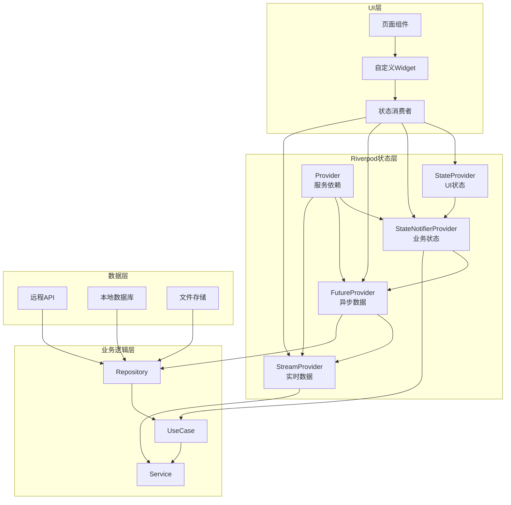
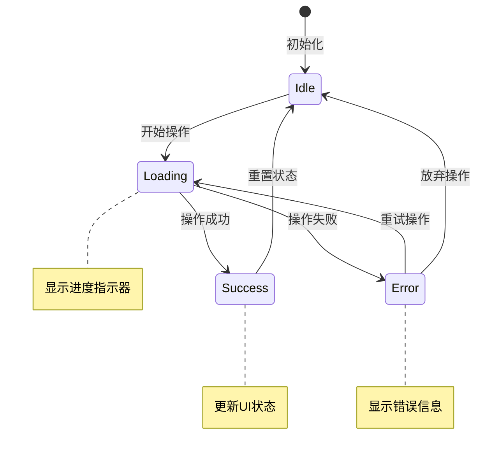

# 状态管理架构设计

**文档版本**: v3.0
**最后更新**: 2025-11-22
**项目名称**: dehaze_flutter

---

## 📋 概述

本文档详细描述了Flutter图像去雾系统的状态管理架构设计，基于**Riverpod**状态管理框架，采用分层架构和模块化设计，确保系统的可维护性、可测试性和高性能。状态管理作为Flutter应用的核心架构，负责协调数据流、UI状态和业务逻辑，为用户提供流畅的交互体验。

---

## 🏗️ 状态管理架构概览

### 技术选型：Riverpod

**核心优势分析**

| 优势特性 | 描述 | 对项目价值 |
|---------|------|-----------|
| **编译时安全** | 提供编译时类型检查，防止运行时错误 | 减少开发阶段的bug，提高代码质量 |
| **灵活性高** | 支持多种状态管理模式（Provider、StateProvider、FutureProvider等） | 适应不同场景的状态管理需求 |
| **测试友好** | 易于Mock和单元测试，支持Provider覆盖 | 提高测试覆盖率，保证代码质量 |
| **性能优秀** | 精细的依赖追踪和选择性重构建 | 优化应用性能，减少不必要的重渲染 |
| **代码简洁** | 样板代码少，开发效率高 | 加快开发速度，降低维护成本 |
| **生态兼容** | 与Flutter生态完美集成 | 便于集成第三方库和工具 |

### 整体架构层次

```
┌─────────────────────────────────────────────────────────────┐
│                    用户界面层 (UI Layer)                    │
│  ┌─────────────────┬─────────────────┬─────────────────┐   │
│  │   页面组件       │   自定义Widget   │   UI状态管理     │   │
│  │  (Pages/Screens) │  (Custom Widgets)│ (UI State)     │   │
│  └─────────────────┴─────────────────┴─────────────────┘   │
│                           │ Ref.watch/Ref.read           │
└─────────────────────────────────┼───────────────────────────┘
                                 ↓ Provider调用
┌─────────────────────────────────────────────────────────────┐
│                   状态管理层 (Riverpod Layer)              │
│  ┌─────────────────┬─────────────────┬─────────────────┐   │
│  │   Provider容器   │   状态数据       │   业务逻辑       │   │
│  │  (Providers)    │   (States)      │  (Notifiers)    │   │
│  └─────────────────┴─────────────────┴─────────────────┘   │
│                           │ Repository调用               │
└─────────────────────────────────┼───────────────────────────┘
                                 ↓ 数据访问
┌─────────────────────────────────────────────────────────────┐
│                  业务逻辑层 (Business Layer)               │
│  ┌─────────────────┬─────────────────┬─────────────────┐   │
│  │   用例服务       │   数据仓库       │   领域模型       │   │
│  │  (Use Cases)    │ (Repositories)  │ (Domain Models) │   │
│  └─────────────────┴─────────────────┴─────────────────┘   │
│                           │ API/数据库调用                │
└─────────────────────────────────┼───────────────────────────┘
                                 ↓ 数据源
┌─────────────────────────────────────────────────────────────┐
│                    数据层 (Data Layer)                     │
│  ┌─────────────────┬─────────────────┬─────────────────┐   │
│  │   远程API       │   本地数据库     │   文件存储       │   │
│  │  (Remote APIs)  │ (Local DB)      │ (File Storage)  │   │
│  └─────────────────┴─────────────────┴─────────────────┘   │
└─────────────────────────────────────────────────────────────┘
```

---

## 🔧 Provider类型体系架构

### Provider分类与用途

**Riverpod Provider类型矩阵**

| Provider类型 | 主要用途 | 生命周期 | 异步支持 | 适用场景 |
|-------------|---------|---------|---------|---------|
| **Provider** | 依赖注入、服务实例 | 应用生命周期 | ❌ | Repository、Service等单例 |
| **StateProvider** | 简单状态管理 | Widget生命周期 | ❌ | UI状态、表单数据 |
| **StateNotifierProvider** | 复杂状态逻辑 | 应用生命周期 | ❌ | 业务状态、数据集合 |
| **FutureProvider** | 异步数据获取 | 首次访问后缓存 | ✅ | API调用、数据库查询 |
| **StreamProvider** | 实时数据流 | 监听期间 | ✅ | WebSocket、事件流 |
| **AsyncNotifierProvider** | 异步状态管理 | 应用生命周期 | ✅ | 复杂异步操作 |

### 核心Provider架构图



---

## 🏛️ Provider注册与依赖体系

### 全局Provider架构体系

**Provider分层注册架构**

| 层级 | Provider类型 | 注册模块 | 主要职责 | 依赖关系 |
|------|-------------|---------|---------|---------|
| **应用层** | Provider | `app_providers.dart` | 全局服务、网络配置 | 依赖系统层 |
| **领域层** | Provider | `domain_providers.dart` | Repository、Domain Service | 依赖数据层 |
| **数据层** | Provider | `data_providers.dart` | DataSource、外部API | 依赖基础设施 |
| **表现层** | 各种Provider | `presentation_providers.dart` | UI状态、ViewModel | 依赖领域层 |

### 依赖注入架构表

**核心模块Provider映射关系**

| 模块 | 核心Provider | 状态类型 | 管理范围 | 更新频率 |
|------|-------------|---------|---------|---------|
| **图像输入** | `imageInputStateProvider` | `ImageInputState` | 图像选择、预览 | 中等 |
| **算法选择** | `algorithmSelectProvider` | `AlgorithmSelectState` | 算法列表、推荐 | 低 |
| **图像处理** | `processingStateProvider` | `ProcessingState` | 处理进度、结果 | 高 |
| **效果对比** | `comparisonStateProvider` | `ComparisonState` | 对比视图、控制 | 中等 |
| **算法管理** | `algorithmManagementProvider` | `AlgorithmManagementState` | 算法CRUD | 低 |
| **数据集管理** | `datasetManagementProvider` | `DatasetManagementState` | 数据集操作 | 低 |

---

## 📦 模块化状态管理架构

### 模块状态管理策略

**模块化状态管理核心原则**

| 原则 | 描述 | 实施方式 | 好处 |
|------|------|---------|------|
| **单一职责** | 每个Provider只负责一个业务域 | 按功能模块拆分Provider | 降低耦合度 |
| **状态隔离** | 不同模块状态相互独立 | 独立的State和Notifier | 避免状态污染 |
| **依赖清晰** | 明确定义模块间依赖关系 | 通过Repository或Service通信 | 便于维护和测试 |
| **接口标准化** | 统一的Provider接口规范 | 定义标准State和Notifier模式 | 提高开发效率 |

### 模块状态生命周期



### 状态数据流架构

**数据流向图**

```
用户交互 → UI事件 → StateNotifier → 业务逻辑 → Repository → 数据源
     ↑                                                    ↓
UI更新 ← 状态变化 ← State更新 ← 处理结果 ← 数据返回 ← API/数据库
```

**状态转换表**

| 状态 | 触发条件 | 数据变化 | UI响应 |
|------|---------|---------|--------|
| **Initial** | 组件初始化 | 设置默认值 | 显示默认UI |
| **Loading** | 开始异步操作 | 设置loading=true | 显示加载指示器 |
| **Success** | 操作成功 | 更新数据, loading=false | 显示新数据 |
| **Error** | 操作失败 | 设置error信息, loading=false | 显示错误提示 |
| **Refreshing** | 刷新数据 | 保持现有数据, refreshing=true | 显示刷新指示器 |

---

## 🎯 状态管理模式与策略

### 核心设计原则

**1. 单一数据源原则**

- **概念**: 每个状态由唯一的Provider管理
- **实现**: 通过Provider注册表确保状态唯一性
- **好处**: 避免状态冲突和同步问题

**2. 依赖最小化原则**

- **概念**: Provider只包含必要的状态和逻辑
- **实现**: 按职责拆分，避免过度聚合
- **好处**: 提高代码可读性和可维护性

**3. 组合优于继承原则**

- **概念**: 使用Provider组合构建复杂状态
- **实现**: 通过多个Provider组合成复合状态
- **好处**: 提高灵活性和可测试性

### 状态管理决策矩阵

**选择Provider类型的决策标准**

| 场景特征 | 推荐Provider | 决策因素 |
|---------|-------------|---------|
| **简单UI状态** | StateProvider | 状态变化频繁、逻辑简单 |
| **复杂业务逻辑** | StateNotifierProvider | 多个相关状态、复杂操作 |
| **一次性异步数据** | FutureProvider | API调用、数据库查询 |
| **持续数据流** | StreamProvider | WebSocket、传感器数据 |
| **服务依赖注入** | Provider | Repository、Service等单例 |
| **复杂异步状态** | AsyncNotifierProvider | 需要管理多个异步操作 |

---

## 🧪 状态管理测试策略

### 测试金字塔架构

```
        ┌─────────────────┐
        │   E2E测试       │ ← 最少
        │  (集成测试)      │
        └─────────────────┘
      ┌───────────────────────┐
      │   Widget测试          │ ← 适中
      │  (UI组件集成测试)      │
      └───────────────────────┘
    ┌─────────────────────────────┐
    │   Provider单元测试          │ ← 最多
    │  (状态管理逻辑测试)         │
    └─────────────────────────────┘
```

### 测试覆盖率要求

**测试类型与覆盖率标准**

| 测试类型 | 覆盖率要求 | 测试重点 | 测试工具 |
|---------|-----------|---------|---------|
| **Provider单元测试** | ≥90% | 状态逻辑、错误处理 | flutter_test |
| **Widget集成测试** | ≥80% | UI交互、状态同步 | flutter_test |
| **E2E集成测试** | ≥70% | 完整业务流程 | integration_test |

### 模拟策略表

**Provider Mock策略**

| Provider类型 | Mock方式 | 测试场景 | 验证重点 |
|-------------|---------|---------|---------|
| **Repository Provider** | Mock实现类 | 数据获取失败 | 错误处理逻辑 |
| **Service Provider** | 依赖注入覆盖 | 业务逻辑流程 | 业务正确性 |
| **Future Provider** | 手动返回结果 | 异步状态转换 | 加载、成功、失败状态 |
| **Stream Provider** | 手动发送事件 | 实时数据流处理 | 数据流订阅、取消订阅 |

---

## 🚀 性能优化策略

### 选择性重构建优化

**性能优化策略矩阵**

| 优化技术 | 适用场景 | 性能提升 | 实施难度 | 优先级 |
|---------|---------|---------|---------|--------|
| **select监听** | 大型对象部分字段 | 30-50% | 低 | 🔥🔥🔥 |
| **autoDispose** | 临时状态 | 20-40% | 低 | 🔥🔥🔥 |
| **Provider缓存** | 重复计算结果 | 40-60% | 中 | 🔥🔥 |
| **懒加载** | 按需加载 | 50-80% | 中 | 🔥🔥🔥 |
| **状态分片** | 大型状态对象 | 20-30% | 高 | 🔥 |

### 性能监控指标

**关键性能指标(KPI)**

| 指标名称 | 目标值 | 监控方式 | 优化措施 |
|---------|-------|---------|---------|
| **Provider重构建次数** | <5次/秒 | 开发工具监控 | 使用select优化 |
| **状态更新延迟** | <16ms | 性能测试 | 异步处理优化 |
| **内存使用量** | <100MB | 内存分析工具 | 及时释放状态 |
| **启动时间** | <2秒 | 启动时间测试 | 延迟初始化 |

---

## 🔄 状态持久化架构

### 持久化策略选择

**持久化技术对比表**

| 持久化方案 | 存储类型 | 容量限制 | 性能 | 适用数据 | 同步方式 |
|-----------|---------|---------|------|---------|---------|
| **SharedPreferences** | 键值对 | 几KB | 高 | 用户偏好、设置 | 同步 |
| **Hive数据库** | NoSQL | 几MB | 高 | 缓存数据、会话 | 同步 |
| **SQLite数据库** | 关系型 | 几百MB | 中 | 结构化数据 | 同步/异步 |
| **文件存储** | 文件 | 几GB | 低 | 图像、文档 | 异步 |

### 状态持久化决策图

```
数据类型判断
     ↓
┌─────────────┐
│ 简单配置数据 │ → SharedPreferences
└─────────────┘
     ↓
┌─────────────┐
│ 结构化数据   │ → Hive/SQLite
└─────────────┘
     ↓
┌─────────────┐
│ 大型文件     │ → 文件存储
└─────────────┘
```

---

## 📊 监控与调试体系

### 状态监控架构

**多层级监控体系**

| 监控层级 | 监控内容 | 监控工具 | 告警阈值 |
|---------|---------|---------|---------|
| **应用级** | 整体性能、崩溃率 | Firebase Crashlytics | 崩溃率<0.1% |
| **页面级** | 页面加载时间、交互延迟 | Flutter DevTools | 加载<2秒 |
| **组件级** | Provider重构建次数 | Riverpod DevTools | 重构建<10次/操作 |
| **业务级** | 核心流程成功率 | 自定义埋点 | 成功率>95% |

### 调试工具链

**调试工具组合**

| 工具名称 | 主要功能 | 使用场景 | 集成方式 |
|---------|---------|---------|---------|
| **Flutter DevTools** | 性能分析、内存监控 | 开发阶段调试 | IDE插件 |
| **Riverpod DevTools** | 状态可视化、Provider监控 | 状态管理调试 | 依赖包 |
| **自定义Logger** | 业务日志、状态变化日志 | 生产环境问题追踪 | 自实现 |
| **Performance Overlay** | 实时性能指标显示 | 性能优化 | Flutter内置 |

---

## 🎯 开发最佳实践指南

### 代码规范与约定

**Provider命名约定规范表**

| Provider类型 | 命名模式 | 示例 | 说明 |
|-------------|---------|------|------|
| **StateProvider** | `xxxProvider` | `selectedImageProvider` | 简单状态 |
| **StateNotifierProvider** | `xxxProvider` | `imageInputStateProvider` | 复杂状态 |
| **FutureProvider** | `xxxProvider` | `algorithmsProvider` | 异步数据 |
| **StreamProvider** | `xxxStreamProvider` | `processingProgressStreamProvider` | 数据流 |
| **Provider** | `xxxProvider` | `imageRepositoryProvider` | 服务依赖 |

### 错误处理策略

**分层错误处理架构**

| 错误层级 | 处理方式 | 错误类型 | 用户反馈 |
|---------|---------|---------|---------|
| **UI层错误** | 显示友好提示 | 表单验证、交互错误 | Toast、SnackBar |
| **业务层错误** | 统一错误处理 | 业务逻辑错误 | 错误页面、重试按钮 |
| **数据层错误** | 异常捕获、重试机制 | 网络、数据库错误 | 离线提示、重试机制 |
| **系统级错误** | 崩溃上报、自动恢复 | 内存不足、系统异常 | 崩溃恢复、错误上报 |

### 代码审查检查清单

**状态管理代码审查要点**

| 审查项目 | 检查内容 | 通过标准 |
|---------|---------|---------|
| **Provider设计** | 职责单一性、依赖合理性 | 符合SOLID原则 |
| **状态设计** | 不变性、状态转换完整性 | 状态转换清晰 |
| **异步处理** | 错误处理、超时机制 | 完善的异常处理 |
| **性能考虑** | 重构建优化、内存管理 | 无性能问题 |
| **测试覆盖** | 单元测试、集成测试 | 覆盖率达标 |

---

## 📚 技术选型与资源

### 技术栈版本矩阵

**核心技术版本要求**

| 技术组件 | 最低版本 | 推荐版本 | 兼容性说明 |
|---------|---------|---------|-----------|
| **Flutter** | 3.16.0 | 3.19.0+ | 支持最新特性 |
| **Dart** | 3.2.0 | 3.4.0+ | 语言特性支持 |
| **Riverpod** | 2.4.0 | 2.6.0+ | 状态管理核心 |
| **Flutter Test** | 3.16.0 | 3.19.0+ | 测试框架 |
| **DevTools** | 2.24.0 | 2.28.0+ | 开发工具 |

### 学习资源与文档

**官方文档与社区资源**

| 资源类型 | 名称 | 链接 | 适用阶段 |
|---------|------|------|---------|
| **官方文档** | Riverpod官方文档 | https://riverpod.dev | 全阶段 |
| **API文档** | Flutter Riverpod API | https://pub.dev/packages/flutter_riverpod | 开发阶段 |
| **最佳实践** | Riverpod最佳实践指南 | https://riverpod.dev/docs/concepts/best_practices | 架构设计 |
| **示例项目** | Riverpod官方示例 | https://github.com/rrousselGit/riverpod/tree/master/examples | 学习参考 |
| **社区讨论** | GitHub Discussions | https://github.com/rrousselGit/riverpod/discussions | 问题解决 |

---

## 🔮 未来演进规划

### 状态管理技术演进路线

**短期目标 (3-6个月)**
- 完善现有Riverpod架构，优化性能
- 建立完整的状态管理测试体系
- 实现状态持久化和缓存机制

**中期目标 (6-12个月)**
- 引入状态管理可视化工具
- 实现跨页面状态同步机制
- 建立状态管理监控和告警系统

**长期目标 (1-2年)**
- 探索下一代状态管理技术
- 实现自适应性能优化
- 建立状态管理最佳实践库

### 技术债务管理

**重构优先级矩阵**

| 技术债务项 | 影响程度 | 解决难度 | 优先级 | 计划解决时间 |
|-----------|---------|---------|--------|-------------|
| **Provider命名规范** | 中 | 低 | 🔥🔥 | Q1 2024 |
| **测试覆盖率提升** | 高 | 中 | 🔥🔥🔥 | Q2 2024 |
| **性能监控完善** | 高 | 中 | 🔥🔥🔥 | Q2 2024 |
| **文档体系完善** | 中 | 低 | 🔥🔥 | Q1 2024 |

---

**文档版本**: v3.0
**最后更新**: 2025-11-22
**技术栈**: Flutter 3.16+, Dart 3.2+, Riverpod 2.6+
**架构原则**: 单一职责、依赖注入、测试驱动、性能优先
**维护团队**: Flutter开发团队
**下次评审**: 2025-12-22