# API集成设计文档

**文档版本**: v2.0
**最后更新**: 2025-11-22
**项目名称**: dehaze_flutter

---

## 📋 概述

本文档详细描述了Flutter图像去雾系统与后端服务的API集成架构设计规范，基于项目中的多后端架构（dehaze-java、dehaze-go、dehaze-python），专注于前端API客户端的架构设计、接口规范、安全策略和最佳实践指导。

### 4.3.1 API集成架构设计目标

**核心设计原则：**
- **分层架构**：构建清晰的API客户端分层架构，实现关注点分离
- **统一接口**：提供统一、一致的API调用体验和错误处理机制
- **高性能**：优化网络请求性能，支持并发处理和智能缓存
- **安全可靠**：实现完善的安全认证、数据加密和错误恢复机制
- **可扩展性**：支持动态配置、插件化扩展和多环境适配

**架构质量要求：**

| 质量属性 | 设计要求 | 验证标准 | 优化目标 |
|----------|----------|----------|----------|
| **性能** | API响应时间 < 200ms | 压力测试验证 | 95%请求在100ms内完成 |
| **可靠性** | 服务可用性 > 99.9% | 故障注入测试 | 自动重试和降级机制 |
| **安全性** | 数据传输加密率 100% | 安全审计检查 | 零明文数据传输 |
| **可维护性** | 代码复用率 > 80% | 代码质量分析 | 模块化设计 |
| **可扩展性** | 新API接入时间 < 1天 | 扩展性测试 | 插件化架构 |

---

## 🏗️ 后端服务架构设计

### 4.3.2 多服务架构概览

**架构设计理念：**
- 采用微服务架构模式，实现服务解耦和独立部署
- 建立统一的API网关，提供统一的服务入口和安全防护
- 实现服务间的松耦合通信，支持水平扩展和故障隔离
- 构建完善的监控和服务治理体系

**整体服务架构图：**

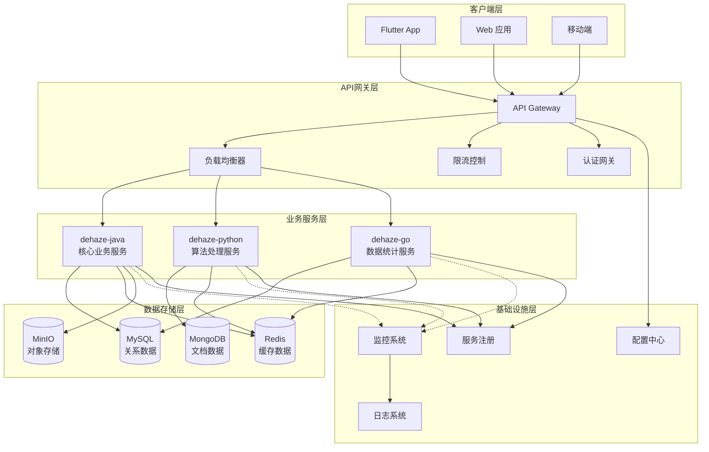

### 4.3.3 服务职责与能力矩阵

**核心服务能力规划：**

| 服务名称 | 架构模式 | 核心职责 | 关键API | 通信协议 | 性能要求 | 部署策略 |
|----------|----------|----------|---------|----------|----------|----------|
| **dehaze-java** | 单体应用 | 用户管理、认证授权、业务逻辑 | 认证、算法、文件管理 | HTTP REST + WebSocket | 响应时间<100ms | 容器化部署 |
| **dehaze-python** | 微服务 | 图像处理、算法执行、模型服务 | 图像处理、进度推送 | HTTP REST + WebSocket | 处理时间<5s | GPU集群部署 |
| **dehaze-go** | 微服务 | 数据统计、性能监控、高并发接口 | 统计分析、监控数据 | HTTP REST | 响应时间<50ms | 多实例部署 |

**服务间通信设计：**

| 通信场景 | 通信方式 | 协议选择 | 超时设置 | 重试策略 | 熔断机制 |
|----------|----------|----------|----------|----------|----------|
| **客户端↔网关** | 同步调用 | HTTPS + WebSocket | 30s | 指数退避 | 快速失败 |
| **网关↔业务服务** | 同步调用 | HTTP/2 | 10s | 线性重试 | 服务降级 |
| **服务间调用** | 异步消息 | Message Queue | 60s | 死信队列 | 消息丢弃 |
| **数据访问** | 同步调用 | Database Driver | 5s | 事务重试 | 连接池 |

### 4.3.4 服务治理架构

**服务治理策略矩阵：**

| 治理维度 | 实施策略 | 技术方案 | 监控指标 | 应急预案 |
|----------|----------|----------|----------|----------|
| **服务发现** | 自动注册与发现 | Consul/Eureka | 注册成功率<99% | 手动配置 |
| **负载均衡** | 智能路由 | Nginx/HAProxy | 响应时间分布 | 权重调整 |
| **熔断降级** | 快速失败保护 | Hystrix/Sentinel | 熔断触发率<5% | 人工介入 |
| **限流控制** | 流量整形 | 令牌桶算法 | 限流触发率<1% | 动态调整 |
| **监控告警** | 全链路监控 | Prometheus+Grafana | 监控覆盖率100% | 人工巡检 |

---

## 🔐 认证与授权架构设计

### 4.3.5 统一认证架构

**认证架构设计原则：**
- **零信任架构**：默认不信任任何请求，都需要认证和授权
- **多因素认证**：支持密码、验证码、生物识别等多种认证方式
- **无状态设计**：采用JWT令牌机制，服务端无需存储会话状态
- **安全传输**：全程HTTPS加密，敏感数据额外加密保护

**认证架构层次图：**

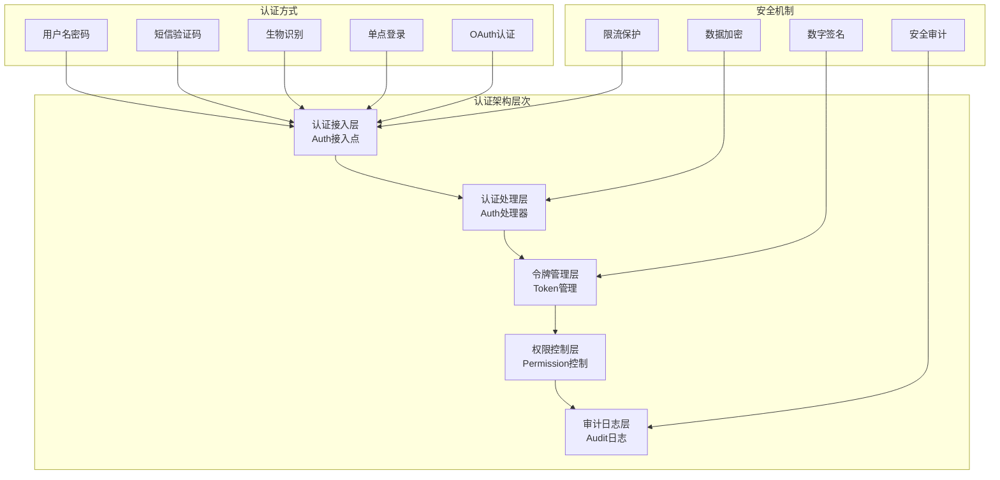

### 4.3.6 JWT认证机制设计

**JWT令牌体系架构：**

| 令牌类型 | 结构组成 | 有效期 | 存储策略 | 安全级别 | 刷新机制 |
|----------|----------|--------|----------|----------|----------|
| **Access Token** | Header.Payload.Signature | 2小时 | 内存+Redis | 高 | 无需刷新 |
| **Refresh Token** | 随机字符串 | 30天 | 安全存储 | 极高 | 支持刷新 |
| **ID Token** | 用户身份信息 | 1小时 | 内存 | 中高 | 签名验证 |
| **Session Token** | 会话状态标识 | 24小时 | Redis | 高 | 自动延期 |

**JWT认证流程设计：**

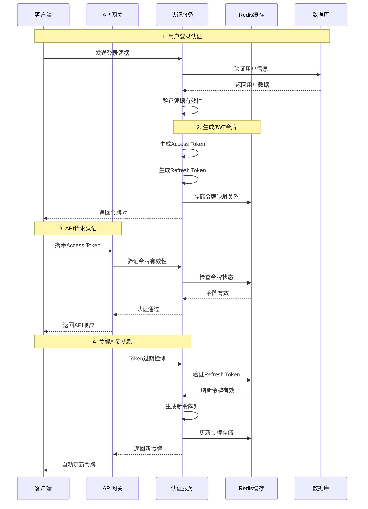

### 4.3.7 认证服务设计规范

**认证服务核心能力矩阵：**

| 功能域 | 具体能力 | 技术要求 | 性能指标 | 安全等级 | 实现复杂度 |
|--------|----------|----------|----------|----------|------------|
| **身份认证** | 多种认证方式支持 | 密码加密、生物识别 | 响应时间<200ms | 极高 | 高 |
| **令牌管理** | JWT生成、验证、刷新 | RS256签名、缓存机制 | 验证时间<50ms | 高 | 中 |
| **会话管理** | 用户会话状态跟踪 | Redis分布式会话 | 并发支持>1000 | 高 | 中 |
| **权限控制** | RBAC权限模型 | 角色权限映射 | 检查时间<10ms | 高 | 中高 |
| **安全防护** | 防攻击、限流、审计 | 多层安全机制 | 防护覆盖率100% | 极高 | 高 |

**认证状态管理策略：**

| 状态类型 | 管理策略 | 存储位置 | 同步机制 | 过期策略 | 容错机制 |
|----------|----------|----------|----------|----------|----------|
| **登录状态** | 内存+持久化 | 内存+Redis | 实时同步 | 30天自动过期 | 本地缓存恢复 |
| **权限信息** | 懒加载+缓存 | Redis缓存 | 事件驱动更新 | 24小时刷新 | 降级到默认权限 |
| **会话信息** | 分布式存储 | Redis集群 | 主从同步 | 活跃延期 | 故障转移 |
| **设备信息** | 绑定验证 | 数据库存储 | 异步同步 | 永久有效 | 人工解绑 |

### 4.3.8 多端认证统一设计

**跨平台认证架构：**

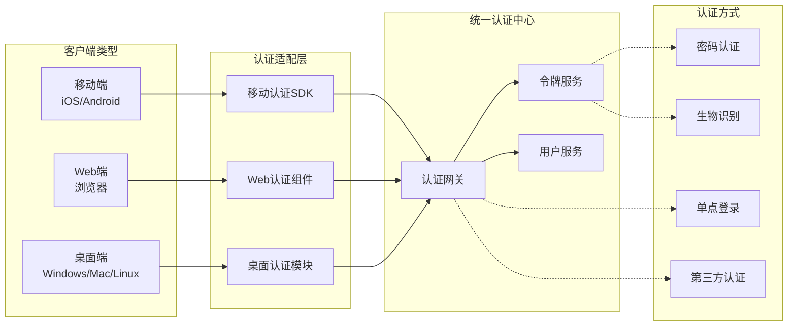

**多端认证一致性保障：**

| 一致性维度 | 保障策略 | 技术实现 | 同步机制 | 用户体验 | 容错能力 |
|------------|----------|----------|----------|----------|----------|
| **认证状态** | 实时同步 | WebSocket通知 | 推送机制 | 无感切换 | 自动重连 |
| **用户信息** | 缓存一致性 | Redis集群 | 事件驱动 | 延迟更新 | 最终一致性 |
| **权限变更** | 立即生效 | 令牌刷新机制 | 主动刷新 | 即时生效 | 降级处理 |
| **设备管理** | 统一管理 | 设备注册中心 | 异步同步 | 后台管理 | 人工干预 |

### 4.3.9 安全防护机制设计

**多层安全防护架构：**

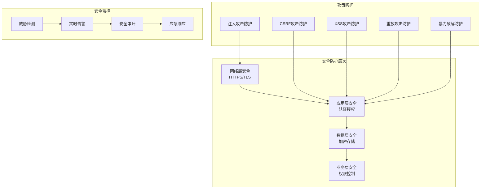

**安全防护策略矩阵：**

| 威胁类型 | 防护措施 | 检测机制 | 响应策略 | 防护效果 | 性能影响 |
|----------|----------|----------|----------|----------|----------|
| **SQL注入** | 参数化查询 | 语义分析 | 请求拦截 | 100%防护 | 轻微影响 |
| **XSS攻击** | 输入验证+输出编码 | 特征检测 | 内容过滤 | 95%防护 | 轻微影响 |
| **CSRF攻击** | CSRF令牌 | Referer检查 | 请求拒绝 | 98%防护 | 无影响 |
| **重放攻击** | 时间戳+随机数 | 序列号验证 | 请求丢弃 | 99%防护 | 轻微影响 |
| **暴力破解** | 登录限流 | 失败次数统计 | 账户锁定 | 90%防护 | 轻微影响 |

### 4.3.10 认证性能优化设计

**性能优化策略表：**

| 优化方向 | 具体措施 | 性能提升 | 实施复杂度 | 优先级 | 风险评估 |
|----------|----------|----------|------------|--------|----------|
| **令牌缓存** | 多级缓存策略 | 验证速度提升90% | 中 | 高 | 低风险 |
| **连接复用** | HTTP/2连接池 | 连接时间减少80% | 中 | 高 | 低风险 |
| **并发处理** | 异步认证处理 | 吞吐量提升300% | 高 | 中 | 中风险 |
| **预认证** | 后台令牌预刷新 | 用户无感知 | 中高 | 中 | 中风险 |
| **智能路由** | 就近服务访问 | 网络延迟减少50% | 高 | 低 | 低风险 |

**缓存架构设计：**

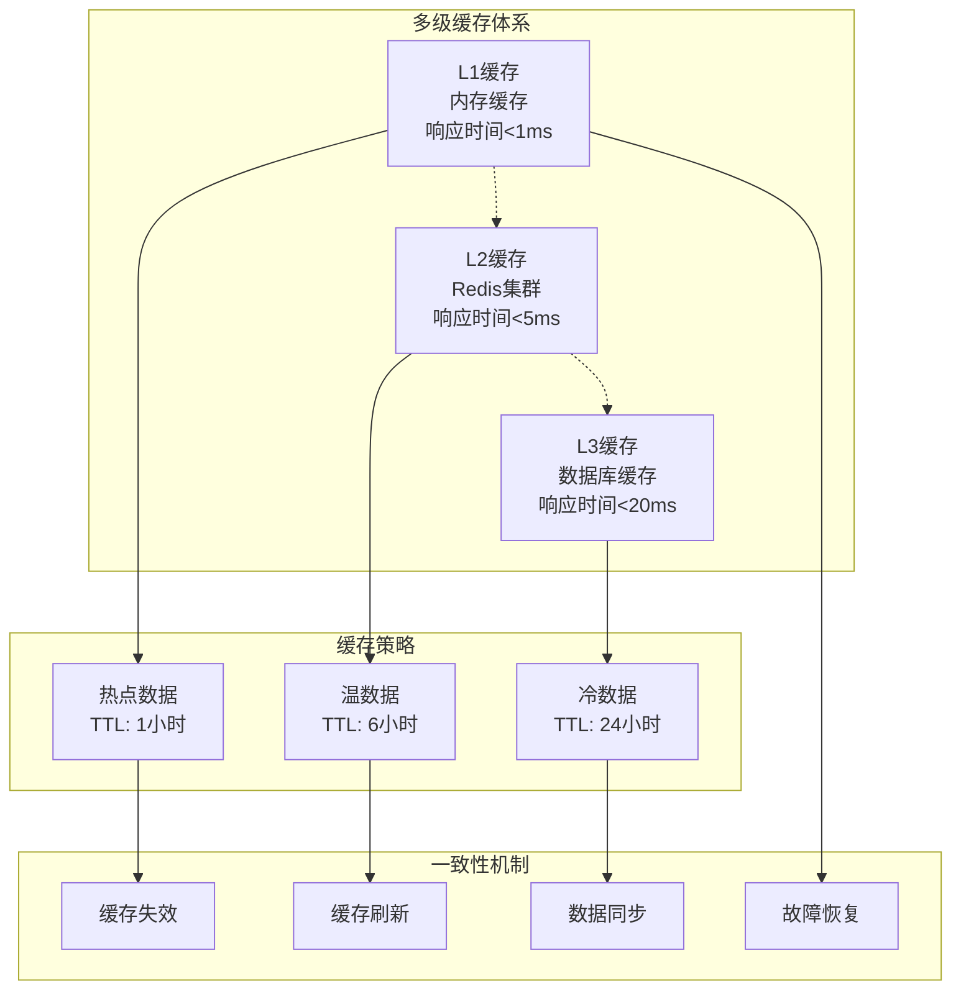

---

## 📡 API客户端架构设计

### 4.3.11 API客户端技术栈选型

**技术选型原则：**
- **成熟稳定**：选择经过生产验证的技术栈，确保系统稳定性
- **性能优异**：优先选择性能表现优秀的组件，提升用户体验
- **生态完善**：选择社区活跃、文档丰富的技术，降低开发成本
- **易于维护**：选择代码结构清晰、易于理解和维护的框架

**核心技术栈规划：**

| 技术领域 | 技术选型 | 选型理由 | 性能指标 | 维护成本 | 社区支持 |
|----------|----------|----------|----------|----------|----------|
| **HTTP客户端** | Dio + Retrofit | 功能强大、拦截器丰富 | 响应时间<100ms | 低 | 活跃 |
| **WebSocket客户端** | web_socket_channel | Flutter官方推荐 | 延迟<50ms | 低 | 官方支持 |
| **状态管理** | Riverpod集成 | 类型安全、测试友好 | 状态更新<10ms | 中 | 活跃 |
| **错误处理** | 统一异常机制 | 一致性体验 | 处理时间<5ms | 低 | 自研 |
| **缓存管理** | 内存+持久化 | 多级缓存提升性能 | 缓存命中>90% | 中 | 自研 |

### 4.3.12 分层架构设计

**四层架构模式：**

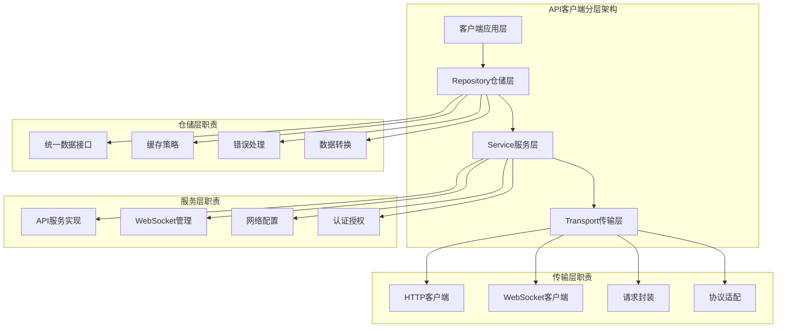

**层次间通信规范：**

| 层次 | 职责范围 | 接口规范 | 数据格式 | 错误处理 | 性能要求 |
|------|----------|----------|----------|----------|----------|
| **客户端应用层** | 业务逻辑实现 | Repository接口 | 领域对象 | 统一异常 | UI响应<16ms |
| **Repository层** | 数据访问抽象 | 抽象接口定义 | DTO对象 | 数据层异常 | 转换时间<10ms |
| **Service层** | 外部服务调用 | 具体服务实现 | API响应格式 | 服务层异常 | 网络时间<200ms |
| **Transport层** | 网络通信 | 传输协议 | HTTP/WebSocket | 传输层异常 | 连接时间<50ms |

### 4.3.13 API服务架构设计

**核心服务组件设计：**

| 服务组件 | 核心功能 | 接口设计 | 配置参数 | 性能指标 | 容错机制 |
|----------|----------|----------|----------|----------|----------|
| **基础API客户端** | HTTP请求封装 | RESTful接口 | 超时、重试、拦截器 | 成功率>99.9% | 自动重试+熔断 |
| **算法服务** | 算法管理调用 | 算法CRUD接口 | 分页、过滤、排序 | 响应时间<100ms | 降级到默认算法 |
| **图像处理服务** | 图像处理管理 | 文件上传/处理接口 | 文件大小、格式限制 | 处理时间<5s | 队列缓冲 |
| **WebSocket服务** | 实时通信 | 双向消息接口 | 心跳、重连机制 | 消息延迟<100ms | 自动重连 |
| **文件管理服务** | 文件操作 | 上传/下载接口 | 缓存、压缩策略 | 传输速度>1MB/s | 断点续传 |

**API服务交互设计：**

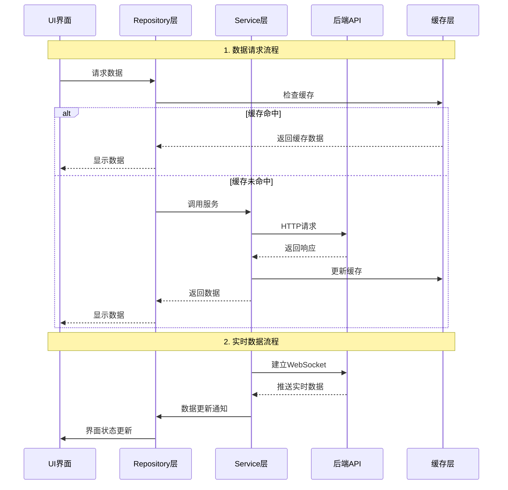

### 4.3.14 请求拦截器架构

**拦截器链设计：**

```mermaid
graph LR
    subgraph "请求拦截器链"
        REQUEST[请求发起]
        LOG[日志拦截器]
        AUTH[认证拦截器]
        CACHE[缓存拦截器]
        RETRY[重试拦截器]
        PERFORMANCE[性能拦截器]
        NETWORK[网络请求]
    end

    subgraph "响应拦截器链"
        RESPONSE[网络响应]
        PERF_RES[性能监控]
        CACHE_RES[缓存处理]
        ERROR_RES[错误处理]
        LOG_RES[日志记录]
        RESULT[最终结果]
    end

    REQUEST --> LOG
    LOG --> AUTH
    AUTH --> CACHE
    CACHE --> RETRY
    RETRY --> PERFORMANCE
    PERFORMANCE --> NETWORK

    NETWORK --> RESPONSE
    RESPONSE --> PERF_RES
    PERF_RES --> CACHE_RES
    CACHE_RES --> ERROR_RES
    ERROR_RES --> LOG_RES
    LOG_RES --> RESULT
```

**拦截器功能矩阵：**

| 拦截器类型 | 执行时机 | 核心功能 | 配置参数 | 性能影响 | 开关控制 |
|------------|----------|----------|----------|----------|----------|
| **日志拦截器** | 请求前后 | 请求/响应日志记录 | 日志级别、输出格式 | 轻微 | 支持 |
| **认证拦截器** | 请求前 | 添加认证头、令牌刷新 | 令牌存储、刷新策略 | 轻微 | 不支持 |
| **缓存拦截器** | 请求前/响应后 | 缓存检查、更新 | 缓存策略、TTL设置 | 中等 | 支持 |
| **重试拦截器** | 错误时 | 自动重试机制 | 重试次数、退避策略 | 中等 | 支持 |
| **性能拦截器** | 请求前后 | 性能指标收集 | 指标类型、上报策略 | 轻微 | 支持 |

### 4.3.15 多环境配置架构

**环境配置策略：**

| 环境类型 | 配置特点 | 安全要求 | 性能要求 | 监控等级 | 数据管理 |
|----------|----------|----------|----------|----------|----------|
| **开发环境** | 详细日志、模拟数据 | 基础安全 | 无特殊要求 | 详细调试 | 本地数据库 |
| **测试环境** | 自动化测试数据 | 中等安全 | 模拟生产 | 完整监控 | 测试数据库 |
| **预生产环境** | 生产级配置 | 高安全 | 接近生产 | 生产监控 | 生产数据镜像 |
| **生产环境** | 优化配置 | 最高安全 | 最高性能 | 实时监控 | 生产数据库 |

**配置管理架构：**

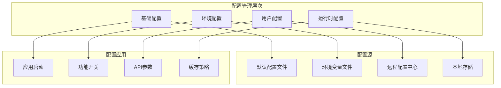

### 4.3.16 服务发现与负载均衡

**服务发现策略：**

| 发现机制 | 实现方式 | 发现延迟 | 健康检查 | 故障转移 | 配置复杂度 |
|----------|----------|----------|----------|----------|------------|
| **静态配置** | 配置文件定义 | 无 | 心跳检测 | 手动切换 | 低 |
| **DNS发现** | 域名解析 | DNS缓存 | TTL检查 | 自动切换 | 中 |
| **服务注册中心** | Consul/Eureka | 注册延迟 | 实时检查 | 自动转移 | 高 |
| **配置中心** | Apollo/Nacos | 配置拉取 | 配置推送 | 配置更新 | 中高 |

**负载均衡算法选择：**

| 算法类型 | 适用场景 | 性能表现 | 实现复杂度 | 数据一致性要求 |
|----------|----------|----------|------------|----------------|
| **轮询算法** | 服务能力相近 | 优秀 | 低 | 无要求 |
| **加权轮询** | 服务能力差异 | 良好 | 中 | 无要求 |
| **最少连接** | 长连接场景 | 优秀 | 中 | 实时统计 |
| **响应时间加权** | 性能敏感场景 | 优秀 | 高 | 历史数据 |
| **一致性哈希** | 缓存友好场景 | 良好 | 高 | 节点状态 |

### 4.3.17 API版本管理策略

**版本管理规范：**

| 版本策略 | 版本格式 | 兼容性要求 | 发布周期 | 维护成本 | 适用场景 |
|----------|----------|------------|----------|----------|----------|
| **语义化版本** | Major.Minor.Patch | 向后兼容 | 按需发布 | 中 | 标准API |
| **日期版本** | YYYY-MM-DD | 不保证兼容 | 定期发布 | 高 | 内部API |
| **URL版本** | /v1/, /v2/ | 版本隔离 | 长期维护 | 低 | 公开API |
| **Header版本** | Accept: application/vnd.api+jsonv1 | 请求级版本 | 灵活发布 | 高 | 复杂API |

**版本兼容性矩阵：**

| 版本关系 | 兼容性状态 | 处理策略 | 迁移时间 | 通知机制 | 风险等级 |
|----------|------------|----------|----------|----------|----------|
| **主版本升级** | 破坏性变更 | 并行维护 | 6-12个月 | 提前3个月通知 | 高 |
| **次版本升级** | 向后兼容 | 渐进式升级 | 1-3个月 | 提前1个月通知 | 中 |
| **补丁版本** | 完全兼容 | 自动升级 | 1-4周 | 发布时通知 | 低 |
| **预发布版本** | 不保证兼容 | 测试环境专用 | 持续更新 | 开发者通知 | 极高 |

---

## 🔌 API服务接口规范

### 4.3.18 算法服务API设计

**算法管理接口规范：**

| 接口类型 | HTTP方法 | 路径规范 | 请求格式 | 响应格式 | 认证要求 |
|----------|----------|----------|----------|----------|----------|
| **获取算法列表** | GET | /api/v1/algorithms | Query参数 | JSON列表 | 必需 |
| **获取算法详情** | GET | /api/v1/algorithms/{id} | 路径参数 | JSON对象 | 必需 |
| **获取推荐算法** | POST | /api/v1/algorithms/recommend | FormData | JSON列表 | 必需 |
| **收藏算法** | POST | /api/v1/algorithms/{id}/favorite | 空请求 | 状态消息 | 必需 |
| **取消收藏** | DELETE | /api/v1/algorithms/{id}/favorite | 空请求 | 状态消息 | 必需 |
| **获取算法性能** | POST | /api/v1/algorithms/{id}/performance | FormData | 性能数据 | 必需 |

**算法接口参数规范：**

| 参数名称 | 参数类型 | 必填 | 格式要求 | 默认值 | 说明 |
|----------|----------|------|----------|--------|------|
| **page** | Integer | 否 | ≥1 | 1 | 分页页码 |
| **limit** | Integer | 否 | 1-100 | 20 | 每页数量 |
| **category** | String | 否 | 算法分类枚举 | 全部 | 算法分类 |
| **type** | String | 否 | traditional/deep_learning | 全部 | 算法类型 |
| **sort** | String | 否 | name/rating/created_at | created_at | 排序字段 |
| **order** | String | 否 | asc/desc | desc | 排序方向 |

### 4.3.19 图像处理服务API设计

**图像处理接口架构：**

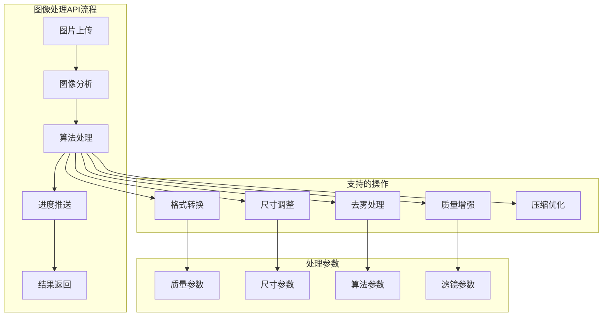

**图像处理接口规范：**

| 接口功能 | HTTP方法 | 路径 | 请求体 | 响应体 | 特殊要求 |
|----------|----------|------|--------|--------|----------|
| **开始处理** | POST | /api/v1/processing/start | Multipart表单 | 任务ID | 文件大小限制10MB |
| **查询状态** | GET | /api/v1/processing/{taskId}/status | 无 | 进度信息 | 实时查询 |
| **暂停处理** | POST | /api/v1/processing/{taskId}/pause | 无 | 状态消息 | 仅处理中任务 |
| **恢复处理** | POST | /api/v1/processing/{taskId}/resume | 无 | 状态消息 | 仅暂停任务 |
| **取消处理** | DELETE | /api/v1/processing/{taskId} | 无 | 状态消息 | 强制终止 |
| **获取结果** | GET | /api/v1/processing/{taskId}/result | 无 | 处理结果 | 下载链接有效期24h |

### 4.3.20 文件管理服务API设计

**文件管理接口矩阵：**

| 文件操作 | HTTP方法 | 接口路径 | 支持格式 | 大小限制 | 存储策略 |
|----------|----------|----------|----------|----------|----------|
| **单文件上传** | POST | /api/v1/files/upload | JPG/PNG/WebP | 10MB | 本地+云备份 |
| **批量上传** | POST | /api/v1/files/batch-upload | 多格式 | 50MB总量 | 分布式存储 |
| **文件下载** | GET | /api/v1/files/{fileId}/download | 原格式 | 无限制 | CDN加速 |
| **文件预览** | GET | /api/v1/files/{fileId}/preview | WebP/JPG | 无限制 | 缩略图生成 |
| **文件删除** | DELETE | /api/v1/files/{fileId} | 无 | 无限制 | 软删除+定时清理 |

**文件安全策略：**

| 安全措施 | 实施方式 | 防护目标 | 检测机制 | 响应策略 |
|----------|----------|----------|----------|----------|
| **文件类型验证** | 文件头+扩展名双重检查 | 恶意文件上传 | 实时检测 | 拒绝上传 |
| **病毒扫描** | 集成杀毒引擎 | 病毒文件传播 | 异步扫描 | 隔离文件 |
| **大小限制** | 前后端双重验证 | 存储空间攻击 | 预检查 | 返回错误 |
| **访问控制** | 令牌+权限验证 | 未授权访问 | 请求验证 | 拒绝访问 |
| **加密存储** | AES-256加密 | 数据泄露风险 | 存储加密 | 安全存储 |

### 4.3.21 WebSocket实时通信架构

**WebSocket连接管理策略：**

| 管理方面 | 设计策略 | 技术实现 | 性能指标 | 容错机制 |
|----------|----------|----------|----------|----------|
| **连接建立** | 统一连接点 | 连接池管理 | 建立时间<1s | 自动重试 |
| **心跳维持** | 定时心跳包 | Ping/Pong机制 | 心跳间隔30s | 连接超时重连 |
| **消息传输** | 二进制优先 | 消息压缩 | 延迟<100ms | 重发机制 |
| **状态同步** | 实时推送 | 状态广播 | 同步延迟<50ms | 状态缓存 |
| **连接关闭** | 优雅关闭 | 清理资源 | 关闭时间<1s | 强制关闭备份 |

**WebSocket消息格式规范：**

| 消息类型 | 格式结构 | 必填字段 | 可选字段 | 压缩策略 |
|----------|----------|----------|----------|----------|
| **进度消息** | JSON | task_id, progress, status | message, timestamp | 无压缩 |
| **状态消息** | JSON | task_id, status | details, error_code | 轻量压缩 |
| **文件消息** | Binary | file_id, chunk_index, total_chunks | checksum | 压缩传输 |
| **控制消息** | JSON | command, target | parameters | 无压缩 |

### 4.3.22 API响应格式标准化

**统一响应结构设计：**

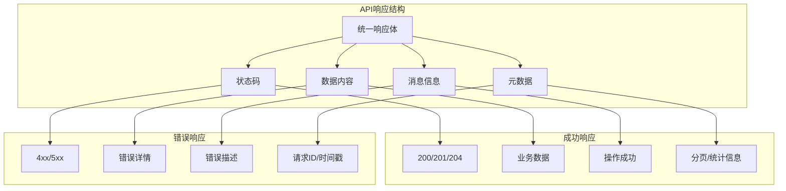

**HTTP状态码使用规范：**

| 状态码 | 含义 | 使用场景 | 响应体格式 | 客户端处理 |
|--------|------|----------|------------|------------|
| **200** | 成功 | 查询操作成功 | 标准成功格式 | 显示数据 |
| **201** | 创建成功 | 资源创建成功 | 包含创建的资源 | 跳转到资源 |
| **204** | 无内容 | 删除/更新成功 | 空响应体 | 刷新本地状态 |
| **400** | 请求错误 | 参数验证失败 | 错误详情 | 显示错误信息 |
| **401** | 未授权 | 认证失败 | 认证错误 | 跳转登录页 |
| **403** | 禁止访问 | 权限不足 | 权限错误 | 显示权限提示 |
| **404** | 未找到 | 资源不存在 | 资源错误 | 显示404页面 |
| **429** | 限流 | 请求过于频繁 | 限流信息 | 延迟重试 |
| **500** | 服务器错误 | 内部错误 | 系统错误 | 显示友好提示 |

### 4.3.23 API接口文档规范

**接口文档标准模板：**

| 文档章节 | 内容要求 | 格式规范 | 示例要求 | 维护责任 |
|----------|----------|----------|----------|----------|
| **接口概述** | 功能描述、使用场景 | Markdown格式 | 实际业务场景 | 产品经理 |
| **请求参数** | 参数名、类型、必填、说明 | 表格形式 | 真实参数示例 | 后端开发 |
| **响应格式** | 状态码、数据结构 | JSON示例 | 完整响应示例 | 后端开发 |
| **错误码** | 错误类型、解决方案 | 枚举表格 | 常见错误场景 | 后端开发 |
| **使用示例** | 代码示例、调用流程 | 多语言示例 | 可运行示例 | 前端开发 |
| **更新日志** | 版本变更、兼容性 | 时间倒序 | 具体变更说明 | 技术负责人 |

**接口测试规范：**

| 测试类型 | 测试范围 | 工具要求 | 覆盖率标准 | 自动化程度 |
|----------|----------|----------|------------|------------|
| **单元测试** | 单个接口逻辑 | 测试框架 | 代码覆盖率>90% | 完全自动化 |
| **集成测试** | 接口间调用 | API测试工具 | 业务场景覆盖>80% | 自动化为主 |
| **性能测试** | 响应时间、并发 | 压测工具 | 峰值并发模拟 | 自动化测试 |
| **安全测试** | 安全漏洞扫描 | 安全扫描工具 | OWASP标准检查 | 定期自动扫描 |
| **兼容性测试** | 版本兼容性 | 多版本测试 | 主要版本覆盖 | 部分自动化 |

---

## 📦 缓存策略架构设计

### 4.3.24 多级缓存体系设计

**缓存架构理念：**
- **分层缓存**：内存缓存、磁盘缓存、网络缓存三级架构
- **智能策略**：基于访问频率和数据特性的缓存策略
- **一致性保证**：多级缓存间的数据一致性机制
- **性能优化**：最大化缓存命中率，最小化网络请求

**多级缓存架构图：**

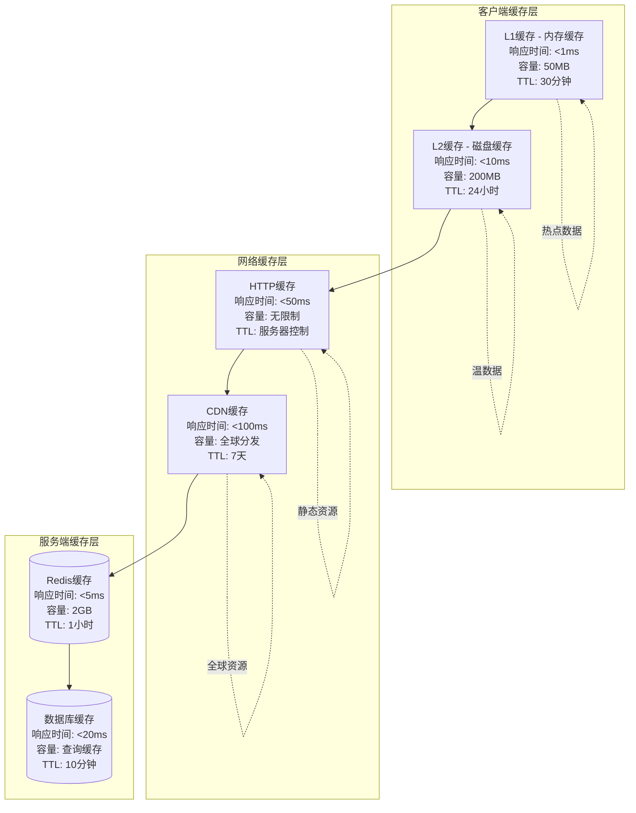

**缓存策略配置矩阵：**

| 缓存级别 | 缓存对象 | TTL策略 | 淘汰策略 | 容量限制 | 一致性保证 |
|----------|----------|---------|----------|----------|------------|
| **L1内存缓存** | 用户信息、配置数据 | 30分钟 | LRU算法 | 50MB | 弱一致性 |
| **L2磁盘缓存** | 图片、文件数据 | 24小时 | LFU算法 | 200MB | 最终一致性 |
| **HTTP缓存** | API响应数据 | 服务器控制 | Cache-Control | 无限制 | 强一致性 |
| **CDN缓存** | 静态资源 | 7天 | 时间失效 | 无限制 | 弱一致性 |
| **Redis缓存** | 会话数据、热点数据 | 1小时 | 内存不足淘汰 | 2GB | 强一致性 |

### 4.3.25 缓存策略设计规范

**数据分类缓存策略：**

| 数据类型 | 缓存级别 | 缓存时长 | 更新策略 | 失效策略 | 预期命中率 |
|----------|----------|----------|----------|----------|------------|
| **用户信息** | L1+Redis | 30分钟 | 写入时更新 | 主动失效 | 95% |
| **算法列表** | L1+L2+HTTP | 1小时 | 定时刷新 | TTL失效 | 90% |
| **处理结果** | L2+CDN | 24小时 | 写入时更新 | 手动失效 | 85% |
| **配置数据** | L1+Redis | 12小时 | 推送更新 | 版本控制 | 98% |
| **临时数据** | L1仅缓存 | 5分钟 | 写入时更新 | 快速失效 | 70% |

**缓存淘汰策略：**

| 策略类型 | 适用场景 | 实现复杂度 | 性能影响 | 内存效率 | 配置灵活性 |
|----------|----------|------------|----------|----------|------------|
| **LRU** | 通用场景 | 低 | 低 | 中等 | 高 |
| **LFU** | 访问频率差异大 | 中 | 中等 | 高 | 中 |
| **FIFO** | 简单队列 | 极低 | 极低 | 低 | 高 |
| **TTL** | 时间敏感数据 | 低 | 低 | 中等 | 高 |
| **随机淘汰** | 缓存压力小时 | 极低 | 极低 | 低 | 高 |

### 4.3.26 缓存一致性设计

**一致性保证机制：**

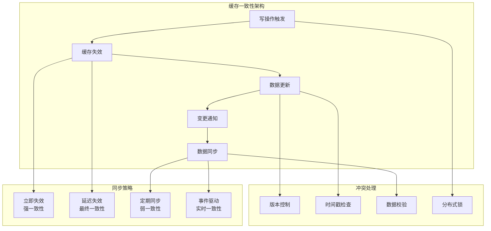

**缓存一致性策略表：**

| 一致性级别 | 实现方式 | 延迟容忍度 | 复杂度 | 性能影响 | 适用场景 |
|------------|----------|------------|--------|----------|----------|
| **强一致性** | 写入立即失效所有缓存 | 0延迟 | 高 | 中等 | 用户关键数据 |
| **最终一致性** | 异步失效，延迟更新 | 秒级延迟 | 中 | 低 | 一般业务数据 |
| **弱一致性** | 定时同步，允许短暂不一致 | 分钟级延迟 | 低 | 极低 | 统计类数据 |
| **实时一致性** | 事件驱动，推送更新 | 毫秒级延迟 | 极高 | 中等 | 实时协作数据 |

### 4.3.27 缓存性能监控

**缓存性能指标体系：**

| 监控维度 | 关键指标 | 健康阈值 | 监控频率 | 告警级别 | 优化建议 |
|----------|----------|----------|----------|----------|----------|
| **缓存命中率** | 整体命中率 | >80% | 实时 | Warning | 调整缓存策略 |
| **响应时间** | 平均响应时间 | <10ms | 实时 | Critical | 优化缓存结构 |
| **内存使用率** | 缓存内存占用 | <80% | 1分钟 | Warning | 调整缓存容量 |
| **网络带宽** | 缓存节省带宽 | >60% | 5分钟 | Info | 扩大缓存范围 |
| **数据一致性** | 缓存不一致事件 | <1% | 实时 | Error检查 | 加强同步机制 |

**缓存监控架构：**

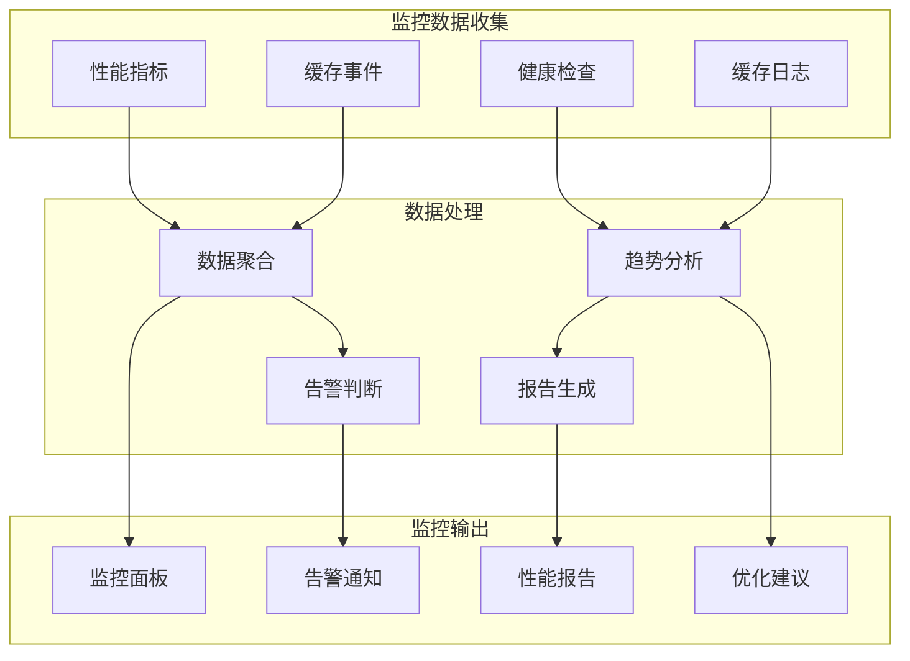

### 4.3.28 缓存优化策略

**性能优化技术：**

| 优化技术 | 实施要点 | 性能提升 | 实施复杂度 | 风险评估 | 适用范围 |
|----------|----------|----------|------------|----------|----------|
| **数据压缩** | GZIP/Brotli压缩 | 减少70%存储 | 低 | 低风险 | 文本类数据 |
| **序列化优化** | Protocol Buffers | 提升50%性能 | 中 | 中风险 | 结构化数据 |
| **预加载策略** | 智能预测加载 | 提升30%命中率 | 高 | 高风险 | 用户行为数据 |
| **分片缓存** | 数据水平分片 | 提升并发能力 | 高 | 高风险 | 大数据集 |
| **热点优化** 热点数据识别与优化 | 提升80%热点性能 | 中 | 中风险 | 访问不均匀数据 |

**缓存容量规划：**

| 缓存类型 | 容量规划依据 | 增长策略 | 扩容方案 | 监控指标 | 成本控制 |
|----------|--------------|----------|----------|----------|----------|
| **内存缓存** | 应用内存限制 | 线性增长 | 垂直扩容 | 内存使用率 | 成本敏感 |
| **磁盘缓存** | 存储空间限制 | 按需增长 | 水平扩容 | 磁盘使用率 | 成本中等 |
| **分布式缓存** | 业务规模预测 | 阶梯式增长 | 集群扩容 | 节点负载 | 成本较高 |
| **CDN缓存** | 用户分布规划 | 全球分布 | 就近部署 | 流量分布 | 成本可变 |

---

## ⚠️ 错误处理策略架构设计

### 4.3.29 统一错误处理架构

**错误处理设计原则：**
- **分层处理**：不同层次的错误采用不同的处理策略
- **统一标准**：建立统一的错误分类和处理规范
- **用户友好**：提供清晰、有用的错误提示信息
- **系统稳定**：错误不应导致系统崩溃或数据损坏

**错误处理架构图：**

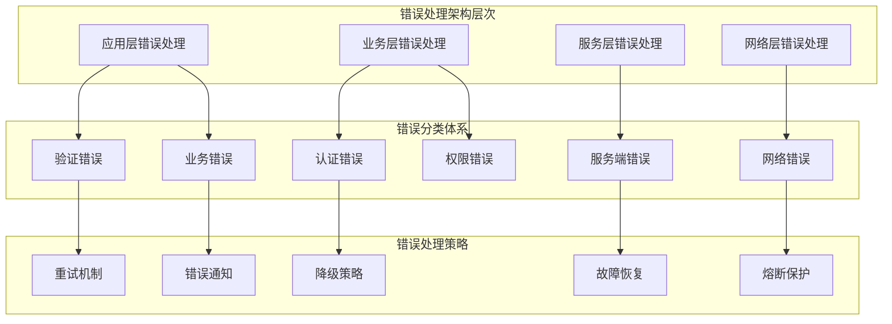

### 4.3.30 错误分类体系设计

**错误分类矩阵：**

| 错误大类 | 错误子类 | HTTP状态码 | 错误代码 | 严重程度 | 恢复策略 | 用户提示 |
|----------|----------|------------|----------|----------|----------|----------|
| **客户端错误** | 参数验证失败 | 400 | CLIENT_001 | 中等 | 输入验证 | 参数格式错误 |
| **客户端错误** | 认证失败 | 401 | AUTH_001 | 高 | 重新登录 | 请重新登录 |
| **客户端错误** | 权限不足 | 403 | PERM_001 | 高 | 权限申请 | 权限不足 |
| **客户端错误** | 资源不存在 | 404 | RESOURCE_001 | 低 | 返回首页 | 资源未找到 |
| **客户端错误** | 请求过于频繁 | 429 | RATE_001 | 中 | 延迟重试 | 请稍后再试 |
| **服务端错误** | 服务器内部错误 | 500 | SERVER_001 | 极高 | 降级处理 | 系统维护中 |
| **服务端错误** | 网关错误 | 502 | GATEWAY_001 | 高 | 重试其他服务 | 网络异常 |
| **服务端错误** | 服务不可用 | 503 | SERVICE_001 | 极高 | 服务降级 | 服务暂时不可用 |

**网络错误处理策略：**

| 错误类型 | 触发条件 | 重试策略 | 降级方案 | 用户提示 | 日志级别 |
|----------|----------|----------|----------|----------|----------|
| **连接超时** | 网络连接超时 | 指数退避重试 | 使用缓存数据 | 网络连接超时 | Warning |
| **请求超时** | 服务器响应慢 | 线性重试 | 显示加载状态 | 服务器繁忙 | Info |
| **网络不可用** | 断网状态 | 定时重连 | 离线模式 | 网络不可用 | Error |
| **DNS解析失败** | 域名解析错误 | 切换备用DNS | 使用IP地址 | 网络配置错误 | Error |
| **SSL证书错误** | 证书验证失败 | 跳过验证(测试) | 提示安全风险 | 连接不安全 | Warning |

### 4.3.31 错误恢复机制设计

**自动恢复策略：**

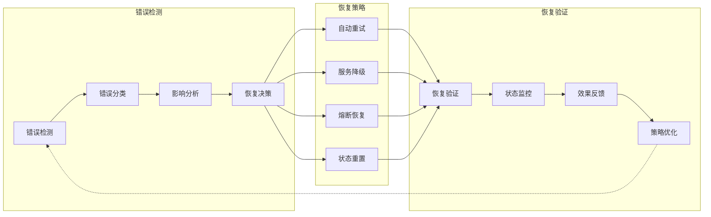

**恢复策略配置：**

| 恢复策略 | 适用错误类型 | 重试次数 | 重试间隔 | 最大延迟 | 成功条件 |
|----------|--------------|----------|----------|----------|----------|
| **快速重试** | 临时网络错误 | 3次 | 1s, 2s, 4s | 4s | HTTP 2xx |
| **指数退避** | 服务过载 | 5次 | 2^n秒 | 32s | 响应时间<1s |
| **线性重试** | 连接超时 | 3次 | 1s, 2s, 3s | 3s | 连接成功 |
| **固定间隔** | 认证失败 | 2次 | 5s | 5s | 认证成功 |
| **单次重试** | 幂等操作 | 1次 | 立即 | 0s | 操作成功 |

### 4.3.32 熔断器模式设计

**熔断器状态机制：**

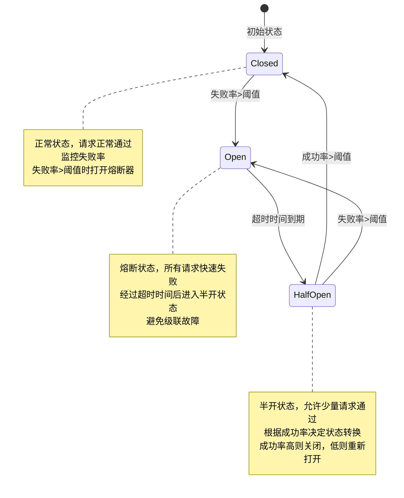

**熔断器配置策略：**

| 配置参数 | 推荐值 | 调整依据 | 影响范围 | 监控指标 | 风险评估 |
|----------|--------|----------|----------|----------|----------|
| **失败率阈值** | 50% | 服务稳定性 | 熔断敏感度 | 错误率统计 | 中风险 |
| **最小请求数** | 20 | 统计可靠性 | 熔断准确性 | 请求计数 | 低风险 |
| **熔断超时时间** | 60秒 | 服务恢复时间 | 故障恢复时长 | 熔断时长 | 中风险 |
| **半开请求数** | 10 | 测试样本量 | 恢复检测精度 | 测试请求量 | 低风险 |
| **成功恢复阈值** | 70% | 恢复可靠性 | 熔断关闭条件 | 成功率 | 中风险 |

### 4.3.33 降级策略设计

**降级策略层次：**

| 降级级别 | 触发条件 | 降级措施 | 功能保留 | 用户体验 | 恢复条件 |
|----------|----------|----------|----------|----------|----------|
| **完全降级** | 服务完全不可用 | 显示维护页面 | 基础导航 | 明确提示 | 服务恢复 |
| **功能降级** | 部分功能故障 | 禁用故障功能 | 核心功能可用 | 功能限制 | 故障修复 |
| **体验降级** | 性能下降 | 简化界面效果 | 主要功能 | 界面简化 | 性能恢复 |
| **数据降级** | 数据获取失败 | 显示缓存/默认数据 | 基础展示 | 数据可能过期 | 数据恢复 |

**降级决策流程：**

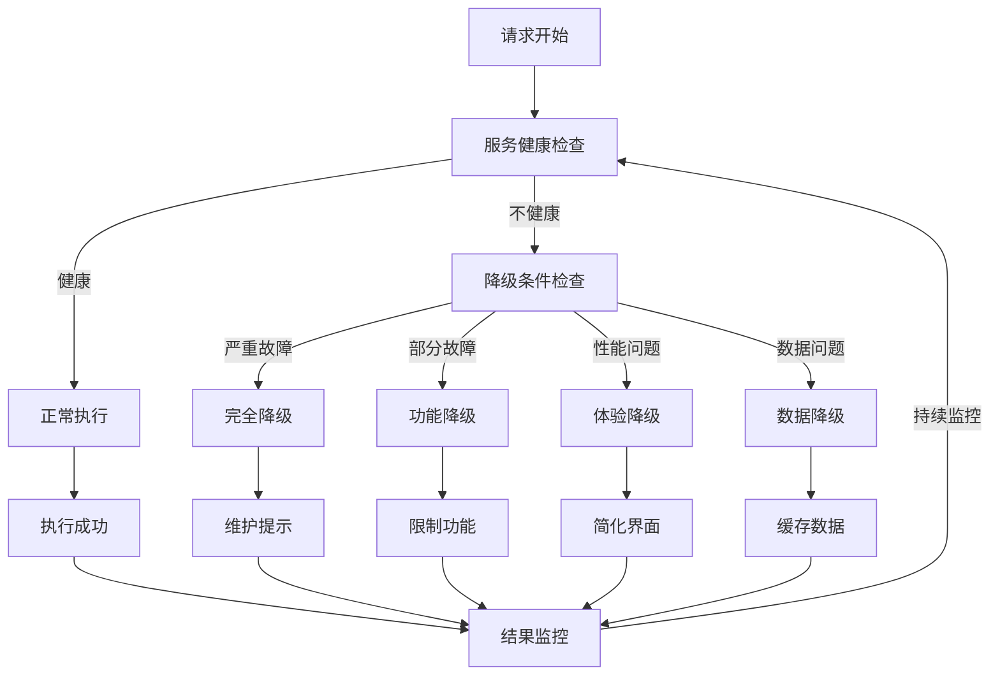

### 4.3.34 错误监控与告警

**错误监控指标体系：**

| 监控维度 | 关键指标 | 告警阈值 | 监控频率 | 通知渠道 | 处理优先级 |
|----------|----------|----------|----------|----------|------------|
| **错误率** | API错误率 | >5% | 实时 | 短信+邮件 | Critical |
| **响应时间** | P95响应时间 | >2s | 实时 | 即时通讯 | High |
| **可用性** | 服务可用性 | <99% | 1分钟 | 邮件 | High |
| **熔断状态** | 熔断器打开数 | >3个 | 实时 | 短信 | Critical |
| **降级频率** | 降级触发次数 | >10次/小时 | 5分钟 | 邮件 | Medium |

**告警处理流程：**

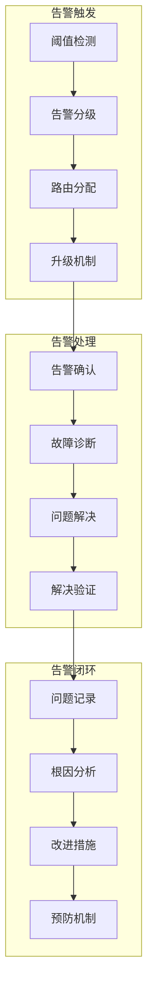

---

## 📋 API集成规范汇总

### 4.3.35 核心设计原则与质量标准

**架构设计质量要求：**

| 质量维度 | 设计目标 | 验证标准 | 优化指标 | 风险控制 |
|----------|----------|----------|----------|----------|
| **性能** | API响应时间 < 200ms | 压力测试验证 | 95%请求在100ms内完成 | 性能监控告警 |
| **可靠性** | 服务可用性 > 99.9% | 故障注入测试 | 自动重试和降级机制 | 熔断器保护 |
| **安全性** | 数据传输加密率 100% | 安全审计检查 | 零明文数据传输 | 多层安全防护 |
| **可维护性** | 代码复用率 > 80% | 代码质量分析 | 模块化设计 | 统一编码规范 |
| **可扩展性** | 新API接入时间 < 1天 | 扩展性测试 | 插件化架构 | 版本兼容性管理 |

### 4.3.36 API集成实施路线图

**阶段性实施规划：**

| 阶段 | 时间周期 | 主要任务 | 关键交付物 | 成功标准 | 负责团队 |
|------|----------|----------|------------|----------|----------|
| **第一阶段** | 2周 | 基础架构搭建 | HTTP客户端、拦截器、错误处理 | 基础API调用成功 | 后端团队 |
| **第二阶段** | 2周 | 认证授权实现 | JWT认证、权限控制、令牌管理 | 安全认证通过 | 安全团队 |
| **第三阶段** | 3周 | 业务API集成 | 算法服务、文件管理、WebSocket | 核心功能可用 | 前后端团队 |
| **第四阶段** | 2周 | 缓存策略实现 | 多级缓存、一致性保证 | 缓存命中率>80% | 后端团队 |
| **第五阶段** | 1周 | 性能优化 | 连接池、批处理、监控 | 性能指标达标 | 性能团队 |

**技术风险评估与应对：**

| 风险类型 | 风险描述 | 影响程度 | 应对策略 | 预防措施 | 应急预案 |
|----------|----------|----------|----------|----------|----------|
| **技术风险** | 依赖库兼容性问题 | 中等 | 版本锁定、备选方案 | 提前测试 | 回退到稳定版本 |
| **安全风险** | 认证机制漏洞 | 极高 | 安全审计、渗透测试 | 代码审查 | 紧急安全补丁 |
| **性能风险** | 高并发场景性能下降 | 高 | 性能测试、优化方案 | 压力测试 | 服务降级 |
| **集成风险** | 多服务集成复杂性 | 中等 | 分阶段集成、Mock测试 | 接口标准化 | 回滚机制 |
| **运维风险** | 监控告警不完善 | 中等 | 完善监控体系 | 监控覆盖 | 人工巡检 |

### 4.3.37 最佳实践总结

**API集成最佳实践：**

| 实践领域 | 关键实践 | 实施建议 | 预期收益 | 实施难度 |
|----------|----------|----------|----------|----------|
| **架构设计** | 分层架构、依赖注入 | 使用Repository模式 | 提高代码可维护性 | 中等 |
| **错误处理** | 统一异常处理、用户友好提示 | 建立错误分类体系 | 提升用户体验 | 低 |
| **性能优化** | 缓存策略、连接复用 | 实施多级缓存 | 提升响应速度 | 中等 |
| **安全防护** | JWT认证、数据加密 | 最小权限原则 | 保障数据安全 | 高 |
| **监控告警** | 全链路监控、实时告警 | 建立监控体系 | 及时发现问题 | 中等 |
| **测试策略** | 单元测试、集成测试 | 测试覆盖率>90% | 保障代码质量 | 中等 |

### 4.3.38 持续改进机制

**改进迭代流程：**

```mermaid
graph LR
    subgraph "改进循环"
        MONITOR[持续监控]
        ANALYZE[数据分析]
        IDENTIFY[问题识别]
        OPTIMIZE[优化改进]
        VALIDATE[效果验证]
    end

    subgraph "优化维度"
        PERFORMANCE[性能优化]
        SECURITY[安全加固]
        USABILITY[可用性提升]
        MAINTAINABILITY[可维护性改进]
    end

    MONITOR --> ANALYZE
    ANALYZE --> IDENTIFY
    IDENTIFY --> OPTIMIZE
    OPTIMIZE --> VALIDATE
    VALIDATE --> MONITOR

    OPTIMIZE --> PERFORMANCE
    OPTIMIZE --> SECURITY
    OPTIMIZE --> USABILITY
    OPTIMIZE --> MAINTAINABILITY
```

**监控指标与优化目标：**

| 监控指标 | 当前基线 | 优化目标 | 监控频率 | 改进措施 | 验证周期 |
|----------|----------|----------|----------|----------|----------|
| **API响应时间** | 200ms | <100ms | 实时 | 缓存优化、连接池 | 每月 |
| **错误率** | 2% | <0.5% | 实时 | 错误处理改进 | 每周 |
| **缓存命中率** | 70% | >90% | 1小时 | 缓存策略调优 | 每月 |
| **用户满意度** | 85% | >95% | 每日 | 用户体验优化 | 每季度 |
| **系统可用性** | 99.5% | >99.9% | 1分钟 | 容错机制加强 | 每月 |

---

**文档版本**: v2.0
**最后更新**: 2025-11-22
**文档状态**: 架构设计阶段 - 设计规范完成，待代码实现阶段使用