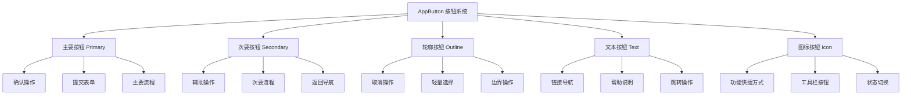
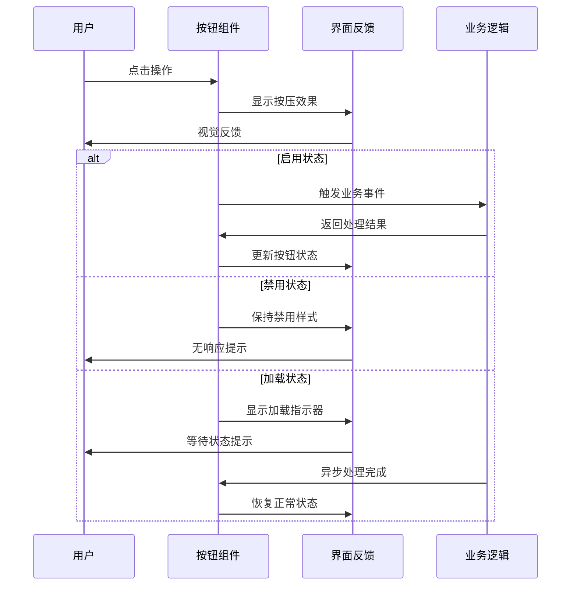
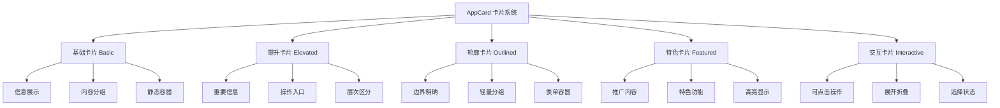
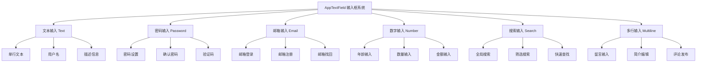
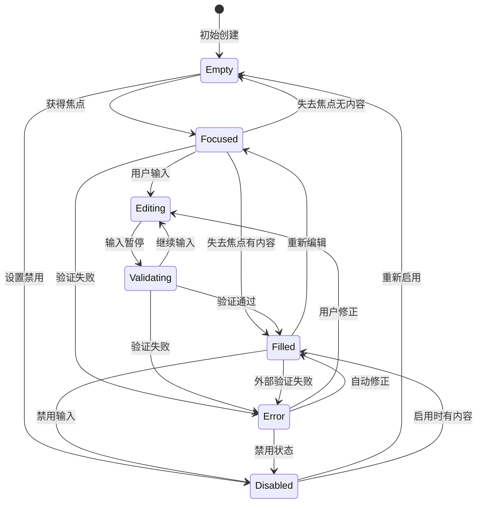
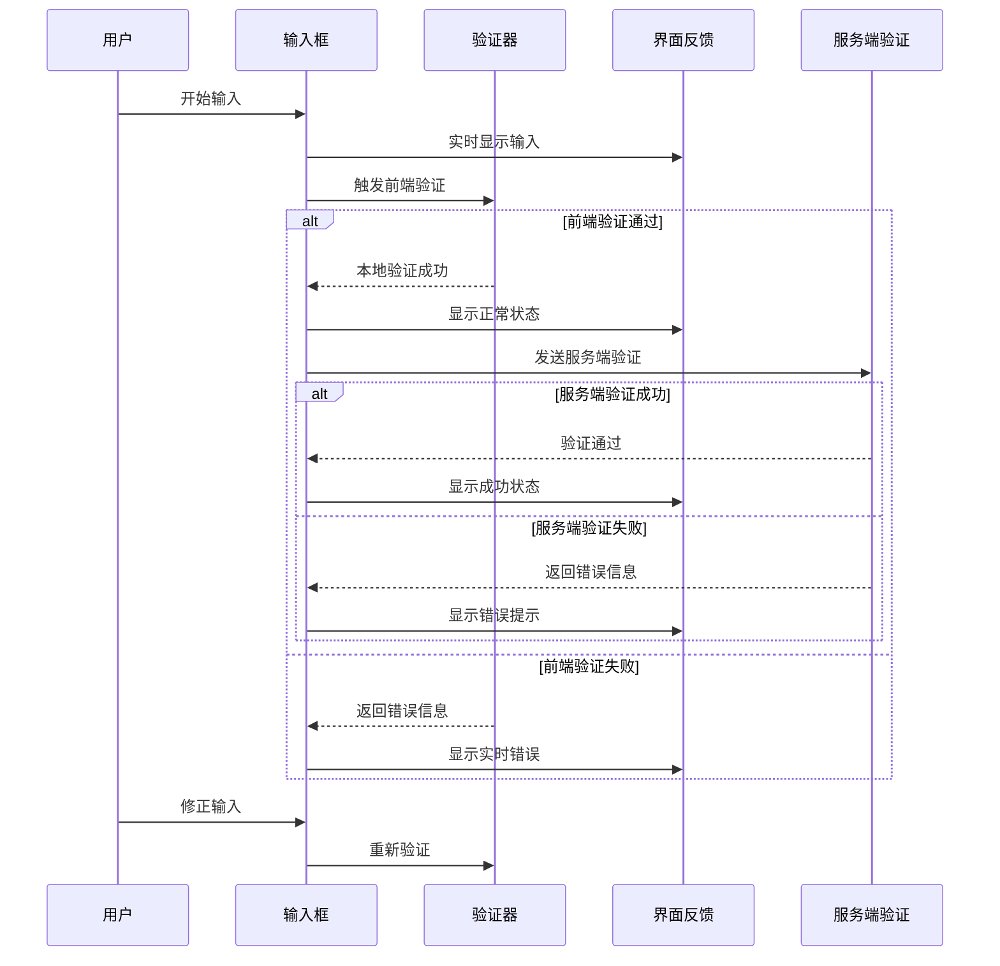
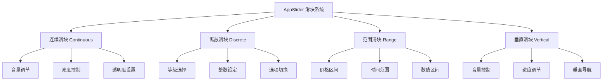
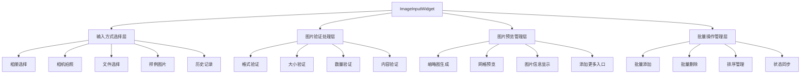
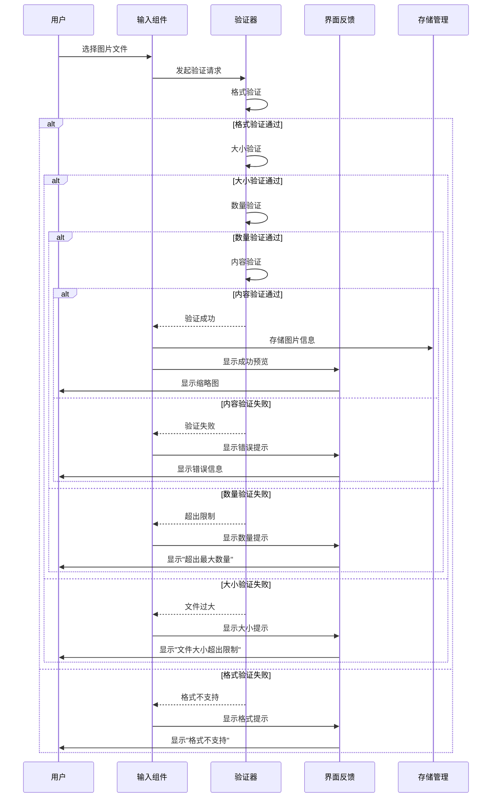
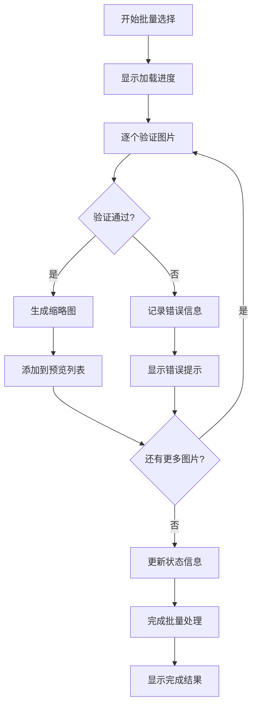

# UI组件与交互设计规范

**文档版本**: v2.0
**最后更新**: 2025-11-22
**项目名称**: dehaze_flutter
**文档类型**: 架构设计文档

---

## 📋 概述

本文档详细定义了Flutter图像去雾系统的UI组件架构设计规范和交互设计指南，为后续前端开发提供完整的技术基础。文档采用纯设计规范形式，重点关注组件结构、交互逻辑、设计规范和实现指导。

---

## 🏗️ 组件架构设计

### 组件分层架构

```
应用组件层 (Application Components)
    ↓
业务组件层 (Business Components)
    ↓
通用组件层 (Common Components)
    ↓
基础组件层 (Base Components)
```

### 组件分类体系

| 组件类型 | 用途 | 示例 | 复用性 |
|---------|------|------|--------|
| **基础组件** | 构建块级UI元素 | AppButton、AppCard | 高 |
| **布局组件** | 页面布局和容器 | AppScaffold、AppContainer | 中 |
| **表单组件** | 用户输入控件 | AppTextField、AppSlider | 高 |
| **业务组件** | 特定功能组件 | ImageUploader、AlgorithmSelector | 低 |
| **页面组件** | 完整页面实现 | HomePage、ProcessingPage | 低 |

---

## 🎨 通用组件设计规范

### 3.1 按钮组件设计规范 (AppButton)

#### **3.1.1 按钮类型系统设计**

**按钮分类架构图：**



**按钮类型设计规范表：**

| 按钮类型 | 视觉层级 | 背景样式 | 边框样式 | 文字颜色 | 适用场景 | 重要性权重 |
|----------|----------|----------|----------|----------|----------|------------|
| Primary | 最高层级 | 实心主题色 | 无边框 | 白色 #FFFFFF | 核心操作、确认流程 | ⭐⭐⭐⭐⭐ |
| Secondary | 次要层级 | 浅灰色背景 | 无边框 | 深灰色 #666666 | 辅助功能、次要操作 | ⭐⭐⭐⭐ |
| Outline | 轻量层级 | 透明背景 | 主题色边框 | 主题色蓝色 | 可选操作、取消功能 | ⭐⭐⭐ |
| Text | 最轻层级 | 透明背景 | 无边框 | 主题色蓝色 | 链接导航、帮助说明 | ⭐⭐ |
| Icon | 功能层级 | 灰色背景 | 无边框 | 主题色蓝色 | 快捷操作、状态切换 | ⭐⭐⭐ |

#### **3.1.2 按钮尺寸规范系统**

**按钮尺寸设计规范表：**

| 尺寸类型 | 高度 | 内边距水平 | 字体大小 | 圆角半径 | 图标尺寸 | 最小点击区域 | 适用场景 |
|----------|------|------------|----------|----------|----------|--------------|----------|
| Small | 40px | 16px | 14px | 8px | 16px | 44px×44px | 表单内按钮、工具栏 |
| Medium | 48px | 24px | 16px | 12px | 20px | 48px×48px | 页面主要按钮 |
| Large | 56px | 32px | 18px | 12px | 24px | 56px×56px | 重要操作按钮、CTA |

**响应式按钮尺寸适配表：**

| 设备类型 | 推荐尺寸 | 间距要求 | 全宽适配 | 触摸优化 | 视觉平衡 |
|----------|----------|----------|----------|----------|----------|
| 移动端 | Medium/Large | 最小16px | 重要操作全宽 | 44px最小区域 | 适当留白 |
| 平板端 | Medium | 标准12px | 选择性全宽 | 40px最小区域 | 保持平衡 |
| 桌面端 | Small/Medium | 标准8px | 很少全宽 | 32px最小区域 | 紧凑布局 |

#### **3.1.3 按钮状态管理设计**

**按钮状态转换时序图：**



**按钮状态样式设计表：**

| 状态类型 | 背景颜色 | 文字颜色 | 边框处理 | 阴影效果 | 透明度 | 交互性 | 动画时长 |
|----------|----------|----------|----------|----------|--------|--------|----------|
| Default | 标准背景色 | 标准文字色 | 标准边框 | 标准阴影 | 100% | ✅ 可点击 | - |
| Hovered | 背景色加深10% | 标准文字色 | 标准边框 | 阴影加深 | 100% | ✅ 可点击 | 200ms |
| Pressed | 背景色加深20% | 标准文字色 | 标准边框 | 阴影减弱 | 80% | ✅ 点击中 | 100ms |
| Disabled | 灰色背景 #F5F5F5 | 灰色文字 #CCCCCC | 灰色边框 | 无阴影 | 60% | ❌ 不可点击 | 300ms |
| Loading | 标准背景色 | 标准文字色 | 标准边框 | 标准阴影 | 100% | ❌ 处理中 | 持续动画 |

#### **3.1.4 按钮内容组织设计**

**按钮内容布局规范表：**

| 内容类型 | 图标位置 | 文本位置 | 间距设置 | 对齐方式 | 排列方向 | 适配规则 |
|----------|----------|----------|----------|----------|----------|----------|
| 图标+文字 | 左侧 | 右侧 | 图标与文字间距8px | 水平居中 | 水平排列 | 默认布局 |
| 文字+图标 | 右侧 | 左侧 | 图标与文字间距8px | 水平居中 | 水平排列 | 特殊强调 |
| 仅文字 | - | 居中 | - | 水平居中 | - | 纯文本按钮 |
| 仅图标 | 居中 | - | - | 居中 | - | 图标按钮 |

**加载状态指示器设计规范：**

| 指示器类型 | 尺寸 | 颜色 | 动画效果 | 显示位置 | 适用场景 |
|------------|------|------|----------|----------|----------|
| 圆形进度环 | 20px | 白色/主题色 | 360°旋转 | 替换文字内容 | 标准按钮 |
| 点状动画 | 16px | 主题色 | 三点跳动 | 文字左侧 | 轻量按钮 |
| 线性进度条 | 100%宽度 | 主题色 | 水平填充 | 按钮底部 | 全宽按钮 |
| 脉冲效果 | 文字大小 | 主题色 | 透明度渐变 | 整体背景 | 重要操作 |

### 3.2 卡片组件设计规范 (AppCard)

#### **3.2.1 卡片类型架构设计**

**卡片分类系统图：**



**卡片类型设计规范表：**

| 卡片类型 | 阴影深度 | 边框处理 | 背景样式 | 圆角大小 | 交互行为 | 使用频率 |
|----------|----------|----------|----------|----------|----------|----------|
| Basic | 2dp | 无边框 | 纯白背景 | 12px | 无交互 | ⭐⭐⭐⭐⭐ |
| Elevated | 6dp | 无边框 | 纯白背景 | 12px | 可点击 | ⭐⭐⭐⭐ |
| Outlined | 0dp | 1px灰色边框 | 纯白背景 | 12px | 轻交互 | ⭐⭐⭐ |
| Featured | 8dp | 无边框 | 渐变背景 | 16px | 重点交互 | ⭐⭐ |
| Interactive | 4dp | 无边框 | 纯白背景 | 12px | 丰富交互 | ⭐⭐⭐ |

#### **3.2.2 卡片视觉设计规范**

**阴影系统设计表：**

| 阴影级别 | Y轴偏移 | 模糊半径 | 扩散半径 | 颜色透明度 | 层级感知 | 适用卡片类型 |
|----------|---------|----------|----------|------------|----------|--------------|
| Level 0 | 0px | 0px | 0px | 0% | 平面 | Outlined |
| Level 1 | 2px | 4px | 0px | 8% | 轻微浮动 | Basic |
| Level 2 | 4px | 8px | 0px | 12% | 标准浮动 | Elevated |
| Level 3 | 6px | 12px | 0px | 16% | 明显浮动 | Featured |
| Level 4 | 8px | 16px | 0px | 20% | 重度浮动 | Modal |

**卡片圆角规范表：**

| 圆角大小 | 使用场景 | 设计风格 | 视觉感受 | 适用卡片类型 |
|----------|----------|----------|----------|--------------|
| 8px | 小组件卡片 | 硬朗现代 | 紧凑精确 | 选项卡片 |
| 12px | 标准卡片 | 平衡圆润 | 舒适友好 | 大部分卡片 |
| 16px | 重要卡片 | 极致圆润 | 柔和高雅 | Featured卡片 |
| 24px | 特殊容器 | 超圆润 | 温和亲和 | 头像容器 |

#### **3.2.3 卡片内容布局设计**

**卡片内容区域划分标准：**

```
┌─────────────────────────────────────────────────────────┐
│                    卡片标题区域 (Header)                 │  ← 48px 高度，20px 内边距
│  标题文字 + 操作按钮 + 状态标签                          │
├─────────────────────────────────────────────────────────┤
│                                                         │
│                    卡片主体区域 (Body)                   │  ← 自适应高度，24px 内边距
│  主要内容、图片、列表、描述信息                          │
│                                                         │
├─────────────────────────────────────────────────────────┤
│                    卡片操作区域 (Actions)                │  ← 56px 高度，20px 内边距
│  操作按钮、链接、快捷操作                                │
└─────────────────────────────────────────────────────────┘
```

**内容间距设计规范表：**

| 区域间距 | 尺寸 | 视觉效果 | 紧凑度 | 信息层次 | 使用建议 |
|----------|------|----------|--------|----------|----------|
| Header-Body | 16px | 标准分隔 | 适中 | 明确层次 | 推荐使用 |
| Body-Actions | 24px | 明确分隔 | 宽松 | 独立区域 | 重要操作 |
| 卡片外边距 | 16px | 统一间距 | 整齐 | 网格对齐 | 页面布局 |
| 卡片内边距 | 20px | 内容呼吸 | 舒适 | 阅读友好 | 内容展示 |

**内容组织设计原则：**

1. **信息层次原则**
   - 重要信息在顶部
   - 次要信息在底部
   - 操作按钮在右侧或底部

2. **视觉平衡原则**
   - 左右对称布局
   - 上下比例协调
   - 元素间距统一

3. **功能分组原则**
   - 相关信息聚集
   - 操作逻辑分组
   - 状态明确标识

#### **3.2.4 卡片交互设计规范**

**卡片交互状态变化表：**

| 交互状态 | 阴影变化 | 背景变化 | 边框处理 | 缩放效果 | 动画时长 | 触发条件 |
|----------|----------|----------|----------|----------|----------|----------|
| 静止状态 | 标准阴影 | 纯白背景 | 无边框 | 1.0x | - | 默认显示 |
| 悬停状态 | 阴影加深1级 | 轻灰背景 #FAFAFA | 无边框 | 1.02x | 200ms | 鼠标悬停 |
| 按下状态 | 阴影减少1级 | 纯白背景 | 无边框 | 0.98x | 100ms | 鼠标按下 |
| 聚焦状态 | 阴影加深2级 | 纯白背景 | 主题色边框 | 1.0x | 300ms | 键盘焦点 |
| 禁用状态 | 无阴影 | 灰白背景 #F5F5F5 | 灰色边框 | 1.0x | 300ms | 禁用状态 |

**卡片点击反馈动画设计：**

| 动画类型 | 动画曲线 | 持续时间 | 缓动函数 | 视觉效果 | 适用场景 |
|----------|----------|----------|----------|----------|----------|
| 涟漪扩散 | ease-out | 400ms | cubic-bezier(0.4, 0, 0.2, 1) | 圆形波纹 | Material Design |
| 缩放反馈 | ease-in-out | 150ms | cubic-bezier(0.2, 0, 0.38, 0.9) | 轻微缩放 | iOS 风格 |
| 阴影变化 | ease-in-out | 200ms | cubic-bezier(0.4, 0, 0.2, 1) | 层次变化 | 通用设计 |
| 边框高亮 | ease-in-out | 300ms | cubic-bezier(0.4, 0, 0.2, 1) | 边框动画 | 聚焦状态 |

### 3.3 输入框组件设计规范 (AppTextField)

#### **3.3.1 输入框类型系统设计**

**输入框分类架构图：**



**输入框类型设计规范表：**

| 输入类型 | 键盘类型 | 输入格式 | 验证规则 | 最大长度 | 默认行数 | 图标建议 | 使用场景 |
|----------|----------|----------|----------|----------|----------|----------|----------|
| Text | 默认键盘 | 任意字符 | 基础验证 | 100字符 | 1行 | Icons.person | 用户名、描述 |
| Password | 密码键盘 | 掩码显示 | 密码强度 | 50字符 | 1行 | Icons.lock | 密码设置 |
| Email | 邮箱键盘 | 邮箱格式 | @验证 | 100字符 | 1行 | Icons.email | 邮箱输入 |
| Number | 数字键盘 | 数字字符 | 数值范围 | 20字符 | 1行 | Icons.pin | 数量年龄 |
| Search | 搜索键盘 | 搜索文本 | 实时搜索 | 200字符 | 1行 | Icons.search | 搜索功能 |
| Multiline | 默认键盘 | 多行文本 | 长度限制 | 500字符 | 3-5行 | Icons.description | 留言评论 |

#### **3.3.2 输入框状态管理设计**

**输入框状态转换流程图：**



**输入框状态样式设计规范表：**

| 状态 | 边框颜色 | 边框宽度 | 背景颜色 | 文字颜色 | 阴影效果 | 标签颜色 | 交互性 |
|------|----------|----------|----------|----------|----------|----------|--------|
| Empty | 灰色 #E0E0E0 | 1px | 白色 #FFFFFF | 灰色 #757575 | 无阴影 | 灰色 #666666 | ✅ 可输入 |
| Focused | 主题色 #2196F3 | 2px | 白色 #FFFFFF | 黑色 #212121 | 主题色阴影 | 主题色 #2196F3 | ✅ 活跃输入 |
| Filled | 灰色 #E0E0E0 | 1px | 白色 #FFFFFF | 黑色 #212121 | 无阴影 | 灰色 #666666 | ✅ 可编辑 |
| Error | 红色 #F44336 | 2px | 浅红 #FFEBEE | 黑色 #212121 | 红色阴影 | 红色 #F44336 | ✅ 需修正 |
| Disabled | 浅灰 #F5F5F5 | 1px | 灰白 #FAFAFA | 灰色 #BDBDBD | 无阴影 | 浅灰 #9E9E9E | ❌ 不可输入 |

#### **3.3.3 输入框装饰元素设计**

**标签系统设计规范表：**

| 标签类型 | 显示位置 | 字体大小 | 字体权重 | 动画效果 | 悬浮逻辑 | 颜色变化 |
|----------|----------|----------|----------|----------|----------|----------|
| 浮动标签 | 输入框内部顶部 | 12px | FontWeight.w500 | 上移动画 | 输入时悬浮 | 灰色→主题色 |
| 固定标签 | 输入框外部上方 | 14px | FontWeight.w600 | 无动画 | 始终固定 | 灰色主题色切换 |
| 占位标签 | 输入框内部中心 | 16px | FontWeight.w400 | 淡入淡出 | 输入时消失 | 浅灰色 |
| 描述标签 | 输入框下方 | 12px | FontWeight.w400 | 滑入显示 | 获得焦点时 | 蓝色提示色 |

**图标系统设计规范表：**

| 图标位置 | 图标大小 | 颜色规范 | 交互行为 | 功能类型 | 示例 |
|----------|----------|----------|----------|----------|------|
| 前缀图标 | 20px | 灰色 #666666 | 无交互 | 类型指示 | 用户、邮箱、锁 |
| 后缀图标 | 20px | 灰色 #666666 | 可点击 | 操作功能 | 清空、显示密码 |
| 验证图标 | 16px | 绿色/红色 | 无交互 | 状态反馈 | 对勾、错误 |
| 帮助图标 | 16px | 蓝色 #2196F3 | 可点击 | 提示说明 | 问号、信息 |

**辅助文本设计规范表：**

| 文本类型 | 显示时机 | 字体大小 | 行数限制 | 颜色规范 | 字符限制 | 位置关系 |
|----------|----------|----------|----------|----------|----------|----------|
| 帮助文本 | 始终显示 | 12px | 2行 | 灰色 #666666 | 50字符 | 输入框下方8px |
| 错误文本 | 验证失败时 | 12px | 1行 | 红色 #F44336 | 30字符 | 输入框下方4px |
| 计数文本 | 输入时显示 | 12px | 1行 | 灰色 #999999 | 动态计算 | 输入框右下角 |
| 成功文本 | 验证成功时 | 12px | 1行 | 绿色 #4CAF50 | 20字符 | 输入框下方4px |

#### **3.3.4 输入框交互设计规范**

**焦点管理设计表：**

| 焦点事件 | 视觉反馈 | 动画时长 | 键盘适配 | 无障碍支持 | 触摸优化 |
|----------|----------|----------|----------|------------|----------|
| 获得焦点 | 边框高亮+阴影 | < 100ms | 自动调整位置 | 语音提示 | 放大点击区域 |
| 失去焦点 | 恢复默认样式 | < 200ms | 键盘收起 | 状态播报 | 缩小点击区域 |
| 焦点切换 | 平滑过渡动画 | < 150ms | 键盘类型切换 | 过渡提示 | 视觉焦点指示 |
| 程序聚焦 | 立即高亮显示 | < 50ms | 延迟显示键盘 | 聚焦通知 | 滚动到可视区域 |

**输入验证流程设计：**



**响应式输入框设计：**

1. **移动端优化策略**
   - 增大触摸目标：最小44×44px
   - 自适应键盘弹出：滚动到输入位置
   - 优化输入体验：专用键盘类型

2. **桌面端优化策略**
   - 完善键盘导航：Tab键顺序控制
   - 鼠标交互增强：悬停效果
   - 快捷键支持：常用操作快捷键

3. **跨平台一致性**
   - 统一的视觉设计语言
   - 一致的交互行为模式
   - 平台特定的体验优化

### 3.4 滑块组件设计规范 (AppSlider)

#### **3.4.1 滑块类型系统设计**

**滑块分类架构图：**



**滑块类型设计规范表：**

| 滑块类型 | 数值类型 | 分段设置 | 步长控制 | 数值显示 | 精度控制 | 适用场景 |
|----------|----------|----------|----------|----------|----------|----------|
| Continuous | 连续数值 | 无分段 | 任意步长 | 实时显示 | 小数精度 | 音量亮度调节 |
| Discrete | 离散数值 | 固定分段 | 整数步长 | 分段显示 | 整数精度 | 等级选项选择 |
| Range | 数值区间 | 双向控制 | 任意步长 | 区间显示 | 小数精度 | 价格时间范围 |
| Vertical | 连续数值 | 可选分段 | 任意步长 | 实时显示 | 小数精度 | 垂直控制面板 |

#### **3.4.2 滑块视觉设计规范**

**滑块尺寸设计规范表：**

| 滑块类型 | 轨道高度 | 轨道长度 | 滑块直径 | 滑轨间距 | 标签距离 | 触摸区域 |
|----------|----------|----------|----------|----------|----------|----------|
| Horizontal | 6px | 200-300px | 24px | - | 16px | 48×48px |
| Vertical | 200-300px | 6px | 24px | - | 16px | 48×48px |
| Compact | 4px | 120-180px | 16px | - | 12px | 32×32px |
| Large | 8px | 300-400px | 32px | - | 20px | 56×56px |

**滑块颜色设计规范表：**

| 元素状态 | 颜色值 | 透明度 | 渐变效果 | 适用场景 | 视觉权重 |
|----------|--------|--------|----------|----------|----------|
| Active Track | 主题色 #2196F3 | 100% | 无渐变 | 已选择部分 | 高权重 |
| Inactive Track | 灰色 #E0E0E0 | 100% | 无渐变 | 未选择部分 | 低权重 |
| Thumb | 主题色 #2196F3 | 100% | 无渐变 | 滑块按钮 | 高权重 |
| Thumb Overlay | 主题色 #2196F3 | 30% | 径向渐变 | 悬停扩散 | 中权重 |
| Disabled Track | 灰色 #F5F5F5 | 100% | 无渐变 | 禁用状态 | 低权重 |

#### **3.4.3 滑块交互设计规范**

**滑块交互状态变化表：**

| 交互状态 | 滑块大小 | 轨道效果 | 数值显示 | 动画时长 | 颜色变化 | 触发条件 |
|----------|----------|----------|----------|----------|----------|----------|
| Default | 标准大小 | 标准颜色 | 隐藏/显示 | - | 默认配色 | 初始状态 |
| Hovered | 放大1.2x | 轨道加粗 | 实时显示 | 200ms | 主题色加深 | 鼠标悬停 |
| Pressed | 放大1.1x | 轨道高亮 | 实时显示 | 100ms | 主题色饱和 | 点击拖动 |
| Focused | 标准大小 | 轨道高亮 | 实时显示 | 300ms | 焦点环显示 | 键盘焦点 |
| Disabled | 缩小0.8x | 灰色显示 | 隐藏 | 300ms | 灰度配色 | 禁用状态 |

**数值显示设计规范：**

| 显示类型 | 位置关系 | 显示格式 | 更新频率 | 单位显示 | 精度控制 | 适用场景 |
|----------|----------|----------|----------|----------|----------|----------|
| 固定标签 | 滑块上方 | "标签: 值" | 实时更新 | 包含单位 | 小数点后1位 | 标准设置 |
| 浮动提示 | 跟随滑块 | "数值" | 拖动时更新 | 可选单位 | 根据步长 | 精确调节 |
| 分段标签 | 轨道下方 | 刻度值 | 静态显示 | 包含单位 | 整数显示 | 离散选择 |
| 百分比 | 滑块右侧 | "XX%" | 实时更新 | 百分号 | 整数百分比 | 比例调节 |

#### **3.4.4 滑块无障碍设计**

**无障碍功能设计表：**

| 功能需求 | 实现方式 | 键盘操作 | 语音反馈 | 屏幕阅读器 | 触摸优化 |
|----------|----------|----------|----------|------------|----------|
| 值调节 | 语义标签 | 左右箭头键 | 播报数值 | aria-label | 增大触摸区域 |
| 状态通知 | ARIA属性 | Tab键切换 | 状态变化 | aria-live | 状态音频反馈 |
| 范围控制 | min/max属性 | Page Up/Down | 范围说明 | aria-valuemin | 手势操作支持 |
| 步长控制 | step属性 | + -键调节 | 步长说明 | aria-valuenow | 滑动手势 |

**键盘导航设计规范：**

| 按键组合 | 功能描述 | 步长控制 | 适用场景 | 反馈方式 | 重复操作 |
|----------|----------|----------|----------|----------|----------|
| ← → | 微调数值 | 1步长 | 精确调节 | 音频提示 | 支持长按 |
| ↑ ↓ | 快速调节 | 10步长 | 快速跳转 | 音频提示 | 支持长按 |
| Home | 最小值 | 跳转到最小 | 重置操作 | 状态播报 | - |
| End | 最大值 | 跳转到最大 | 最大设置 | 状态播报 | - |
| Tab | 焦点切换 | - | 导航控制 | 焦点移动 | - |

---

## 🎯 业务组件设计规范

### 4.1 图像输入组件设计规范 (ImageInputWidget)

#### **4.1.1 组件功能架构设计**

**图像输入流程架构图：**



#### **4.1.2 输入方式系统设计**

**输入方式分类设计表：**

| 输入方式 | 图标标识 | 操作权限 | 预期时间 | 批量支持 | 错误处理 | 用户体验 |
|----------|----------|----------|----------|----------|----------|----------|
| 相册选择 | photo_library | 相册访问权限 | 2-5秒 | ✅ 支持 | 权限拒绝处理 | 直观易用 |
| 相机拍照 | camera_alt | 相机拍照权限 | 10-30秒 | ❌ 单次 | 相机异常处理 | 即拍即用 |
| 文件选择 | folder_open | 文件系统权限 | 3-8秒 | ✅ 支持 | 路径访问错误 | 技术用户友好 |
| 样例图片 | image | 无需权限 | <1秒 | ✅ 支持 | 网络异常处理 | 快速体验 |
| 历史记录 | history | 存储权限 | 1-3秒 | ✅ 支持 | 存储访问错误 | 便捷选择 |

**输入方式权限管理表：**

| 权限类型 | 平台适配 | 申请时机 | 拒绝处理 | 替代方案 | 用户提示 |
|----------|----------|----------|----------|----------|----------|
| 相册访问 | iOS/Android | 首次使用 | 跳转设置 | 样例图片 | "需要相册权限以选择图片" |
| 相机拍照 | iOS/Android | 首次使用 | 跳转设置 | 相册选择 | "需要相机权限以拍摄照片" |
| 文件系统 | iOS/Android | 使用时 | 提供其他方式 | 网络上传 | "需要文件系统权限" |
| 网络访问 | iOS/Android | 网络请求时 | 离线模式 | 本地资源 | "请检查网络连接" |
| 存储写入 | iOS/Android | 保存结果 | 云端存储 | 缓存存储 | "需要存储权限以保存结果" |

#### **4.1.3 图片验证系统设计**

**验证流程架构图：**



**验证规则设计规范表：**

| 验证类型 | 验证规则 | 错误消息 | 处理策略 | 允许重试 | 用户体验 |
|----------|----------|----------|----------|----------|----------|
| 格式验证 | JPG, PNG, WEBP, HEIC | "不支持图片格式: {格式}" | 完全拒绝 | ✅ 支持 | 明确提示支持格式 |
| 大小验证 | 最大20MB | "图片大小超过20MB限制" | 截断提示 | ✅ 支持 | 显示实际大小 |
| 数量验证 | 最多5张 | "最多只能选择5张图片" | 部分接受 | ✅ 支持 | 显示已选数量 |
| 分辨率验证 | 最大8000x8000 | "图片分辨率过高" | 压缩提示 | ✅ 支持 | 建议压缩 |
| 内容验证 | 非空图片文件 | "图片文件损坏" | 完全拒绝 | ✅ 支持 | 重新选择 |

#### **4.1.4 图片预览系统设计**

**预览布局架构图：**

```
┌─────────────────────────────────────────────────────────────────┐
│                    图片输入组件容器                                │
├─────────────────────────────────────────────────────────────────┤
│                                                             │
│  ┌─────────────────────────┐  ┌─────────────────────────┐  │
│  │     输入方式选择区域      │  │    状态信息显示区      │  │
│  │                         │  │                         │  │
│  │  ┌─────────┐ ┌─────────┐  │  │ 已选择: 3/5张        │  │
│  │  │相册选择│ │相机拍照 │  │  │ 总大小: 12.5MB      │  │
│  │  │   📷   │ │   📷   │  │  │ 支持格式: JPG,PNG    │  │
│  │  └─────────┘ └─────────┘  │  │ 最大: 20MB/张        │  │
│  │                         │  │                         │  │
│  │  ┌─────────┐ ┌─────────┐  │  └─────────────────────────┘  │
│  │  │文件选择│ │样例图片│  │                             │
│  │  │   📁   │ │   🖼️   │  │                             │
│  │  └─────────┘ └─────────┘  │                             │
│  │                         │  │                             │
│  │  ┌─────────┐               │  ┌─────────────────────────┐  │
│  │  │历史记录│               │  │   图片预览网格区域      │  │
│  │  │   🕒   │               │  │                         │  │
│  │  └─────────┘               │  │ ┌─────┐ ┌─────┐ ┌─────┐ │  │
│  │                         │  │ │图片1│ │图片2│ │图片3│ │  │
│  │                         │  │ │缩略图│ │缩略图│ │缩略图│ │  │
│  │                         │  │ └─────┘ └─────┘ └─────┘ │  │
│  └─────────────────────────┘  │  │                         │  │
│                             │  │ ┌─────┐                 │  │
│                             │  │ │ +   │ 添加更多按钮  │  │
│                             │  │ └─────┘                 │  │
│                             │  └─────────────────────────┘  │
└─────────────────────────────────────────────────────────────────┘
```

**预览网格设计规范表：**

| 网格参数 | 移动端设置 | 平板端设置 | 桌面端设置 | 自适应规则 | 优化策略 |
|----------|------------|------------|------------|----------|----------|
| 列数 | 3列 | 4列 | 5列 | 根据屏幕宽度 | 保持图片比例 |
| 间距 | 12px | 16px | 20px | 固定间距 | 视觉舒适度 |
| 图片比例 | 1:1 | 1:1 | 1:1 | 正方形 | 保持一致性 |
| 最小尺寸 | 80px | 100px | 120px | 保持可点击 | 触摸友好 |
| 最大数量 | 5张 | 8张 | 10张 | 性能优化 | 防止内存溢出 |

**图片信息显示规范表：**

| 信息类型 | 显示位置 | 字体大小 | 颜色规范 | 背景处理 | 显示时机 | 重要性 |
|----------|----------|----------|----------|----------|----------|--------|
| 文件名 | 底部左下角 | 10px | 白色 | 黑色半透明 | 长按显示 | 中 |
| 文件大小 | 底部右下角 | 8px | 白色70% | 黑色半透明 | 长按显示 | 低 |
| 选择序号 | 左上角 | 12px | 白色 | 蓝色圆角 | 始终显示 | 高 |
| 删除按钮 | 右上角 | 16px | 白色 | 红色圆形 | 始终显示 | 高 |
| 格式标识 | 左下角 | 8px | 白色 | 绿色标签 | 悬停显示 | 低 |

#### **4.1.5 交互体验设计规范**

**交互状态管理表：**

| 交互状态 | 视觉反馈 | 动画效果 | 音效反馈 | 触觉反馈 | 持续时间 | 适用场景 |
|----------|----------|----------|----------|----------|----------|----------|
| 选择图片 | 缩略图浮现 | 渐显动画 | 轻微音效 | 轻微震动 | 300ms | 添加图片时 |
| 删除图片 | 红色高亮 | 缩小消失 | 确认音效 | 确认震动 | 200ms | 删除图片时 |
| 拖拽排序 | 半透明效果 | 平滑移动 | 无音效 | 拖拽震动 | 持续 | 排序操作时 |
| 点击预览 | 放大效果 | 缩放动画 | 无音效 | 无震动 | 400ms | 预览大图时 |
| 添加更多 | 蓝色边框 | 脉冲效果 | 无音效 | 无震动 | 1.5s | 等待添加时 |

**错误处理策略表：**

| 错误类型 | 用户提示 | 重试机制 | 替代方案 | 日志记录 | 自动恢复 |
|----------|----------|----------|----------|----------|----------|
| 权限拒绝 | "请授予相册权限" | 跳转设置 | 使用样例 | ✅ 记录 | ❌ 手动 |
| 文件过大 | "请选择小于20MB的图片" | 重新选择 | 压缩建议 | ✅ 记录 | ❌ 手动 |
| 格式不支持 | "请选择JPG/PNG格式图片" | 重新选择 | 格式转换 | ✅ 记录 | ❌ 手动 |
| 网络异常 | "网络连接异常，请重试" | 自动重试 | 离线模式 | ✅ 记录 | ✅ 自动 |
| 存储空间不足 | "存储空间不足，请清理" | 手动清理 | 云端存储 | ✅ 记录 | ❌ 手动 |

#### **4.1.6 性能优化设计**

**图片处理优化策略表：**

| 优化策略 | 实现方式 | 内存控制 | 性能提升 | 适用场景 | 实现复杂度 |
|----------|----------|----------|----------|----------|------------|
| 缩略图生成 | 原图压缩处理 | 减少内存80% | 显示速度提升5x | 预览显示 | 中等 |
| 延迟加载 | 视窗检测 | 减少内存60% | 初始加载提升3x | 长列表 | 简单 |
| 内存回收 | 及时释放资源 | 减少内存90% | 防止内存溢出 | 大图片处理 | 复杂 |
| 缓存策略 | 本地缓存管理 | 减少网络请求 | 重复加载提升10x | 历史记录 | 中等 |
| 压缩算法 | 智能压缩 | 减少存储50% | 上传速度提升2x | 网络传输 | 复杂 |

**批量处理流程设计：**



### 算法选择组件 (AlgorithmSelectorWidget)

#### 组件职责
- 显示算法列表和推荐
- 提供搜索和筛选功能
- 展示算法详细信息
- 管理算法收藏

#### 组件实现
```dart
class AlgorithmSelectorWidget extends StatefulWidget {
  final Algorithm? selectedAlgorithm;
  final ValueChanged<Algorithm?>? onAlgorithmSelected;
  final ImageFile? imageFile;

  const AlgorithmSelectorWidget({
    Key? key,
    this.selectedAlgorithm,
    this.onAlgorithmSelected,
    this.imageFile,
  }) : super(key: key);

  @override
  State<AlgorithmSelectorWidget> createState() => _AlgorithmSelectorWidgetState();
}

class _AlgorithmSelectorWidgetState extends State<AlgorithmSelectorWidget> {
  List<Algorithm> _algorithms = [];
  List<Algorithm> _filteredAlgorithms = [];
  List<Algorithm> _recommendedAlgorithms = [];
  Set<String> _favoriteAlgorithms = {};
  String _searchQuery = '';
  AlgorithmFilter _filter = AlgorithmFilter();

  @override
  void initState() {
    super.initState();
    _loadAlgorithms();
    if (widget.imageFile != null) {
      _loadRecommendedAlgorithms();
    }
  }

  @override
  Widget build(BuildContext context) {
    return CustomScrollView(
      slivers: [
        // 推荐算法区域
        if (_recommendedAlgorithms.isNotEmpty)
          SliverToBoxAdapter(
            child: _buildRecommendedSection(),
          ),

        // 搜索栏
        SliverToBoxAdapter(
          child: _buildSearchBar(),
        ),

        // 筛选器
        SliverToBoxAdapter(
          child: _buildFilterBar(),
        ),

        // 算法列表
        SliverList(
          delegate: SliverChildBuilderDelegate(
            (context, index) => _buildAlgorithmCard(_filteredAlgorithms[index]),
            childCount: _filteredAlgorithms.length,
          ),
        ),
      ],
    );
  }

  Widget _buildRecommendedSection() {
    return Container(
      margin: EdgeInsets.all(16),
      child: Column(
        crossAxisAlignment: CrossAxisAlignment.start,
        children: [
          Row(
            children: [
              Icon(Icons.auto_awesome, color: Colors.orange),
              SizedBox(width: 8),
              Text(
                '智能推荐',
                style: TextStyle(
                  fontSize: 18,
                  fontWeight: FontWeight.bold,
                ),
              ),
            ],
          ),
          SizedBox(height: 16),
          Container(
            height: 180,
            child: ListView.builder(
              scrollDirection: Axis.horizontal,
              itemCount: _recommendedAlgorithms.length,
              itemBuilder: (context, index) {
                final algorithm = _recommendedAlgorithms[index];
                return _buildRecommendedCard(algorithm);
              },
            ),
          ),
        ],
      ),
    );
  }

  Widget _buildRecommendedCard(Algorithm algorithm) {
    return Container(
      width: 280,
      margin: EdgeInsets.only(right: 16),
      child: AppCard(
        onTap: () => widget.onAlgorithmSelected?.call(algorithm),
        type: AppCardType.elevated,
        child: Column(
          crossAxisAlignment: CrossAxisAlignment.start,
          children: [
            Row(
              children: [
                CircleAvatar(
                  backgroundColor: Colors.blue.withOpacity(0.1),
                  child: Icon(Icons.psychology, color: Colors.blue),
                ),
                SizedBox(width: 12),
                Expanded(
                  child: Column(
                    crossAxisAlignment: CrossAxisAlignment.start,
                    children: [
                      Text(
                        algorithm.name,
                        style: TextStyle(
                          fontSize: 16,
                          fontWeight: FontWeight.bold,
                        ),
                      ),
                      Text(
                        algorithm.type.displayName,
                        style: TextStyle(
                          fontSize: 12,
                          color: Colors.grey[600],
                        ),
                      ),
                    ],
                  ),
                ),
                IconButton(
                  icon: Icon(
                    _favoriteAlgorithms.contains(algorithm.id)
                        ? Icons.favorite
                        : Icons.favorite_border,
                    ),
                  onPressed: () => _toggleFavorite(algorithm.id),
                ),
              ],
            ),
            SizedBox(height: 12),
            Row(
              children: [
                _buildRatingStars(algorithm.rating),
                SizedBox(width: 8),
                Text(
                  algorithm.rating.toStringAsFixed(1),
                  style: TextStyle(fontWeight: FontWeight.w600),
                ),
              ],
            ),
            SizedBox(height: 8),
            Text(
              algorithm.description,
              style: TextStyle(
                fontSize: 12,
                color: Colors.grey[600],
              ),
              maxLines: 2,
              overflow: TextOverflow.ellipsis,
            ),
            SizedBox(height: 12),
            AppButton(
              text: '使用此算法',
              onPressed: () => widget.onAlgorithmSelected?.call(algorithm),
              size: AppButtonSize.small,
              fullWidth: true,
            ),
          ],
        ),
      ),
    );
  }

  Widget _buildSearchBar() {
    return Container(
      margin: EdgeInsets.all(16),
      child: AppTextField(
        hint: '搜索算法名称、类型或功能...',
        prefixIcon: Icons.search,
        onChanged: (value) {
          setState(() {
            _searchQuery = value;
            _applyFilter();
          });
        },
      ),
    );
  }

  Widget _buildFilterBar() {
    return Container(
      margin: EdgeInsets.symmetric(horizontal: 16),
      child: Row(
        children: [
          Expanded(
            child: SingleChildScrollView(
              scrollDirection: Axis.horizontal,
              child: Row(
                children: [
                  FilterChip(
                    label: Text(_filter.type ?? '全部类型'),
                    onSelected: (_) => _showTypeFilter(),
                    selected: _filter.type != null,
                  ),
                  SizedBox(width: 8),
                  FilterChip(
                    label: Text(_filter.speed ?? '全部速度'),
                    onSelected: (_) => _showSpeedFilter(),
                    selected: _filter.speed != null,
                  ),
                  SizedBox(width: 8),
                  FilterChip(
                    label: Text(_filter.quality ?? '全部质量'),
                    onSelected: (_) => _showQualityFilter(),
                    selected: _filter.quality != null,
                  ),
                ],
              ),
            ),
          ),
          IconButton(
            icon: Icon(Icons.clear_all),
            onPressed: _clearFilter,
          ),
        ],
      ),
    );
  }

  Widget _buildAlgorithmCard(Algorithm algorithm) {
    final isSelected = widget.selectedAlgorithm?.id == algorithm.id;

    return Container(
      margin: EdgeInsets.symmetric(horizontal: 16, vertical: 8),
      child: AppCard(
        onTap: () => widget.onAlgorithmSelected?.call(algorithm),
        type: isSelected ? AppCardType.elevated : AppCardType.basic,
        child: Container(
          decoration: isSelected
              ? BoxDecoration(
                  border: Border.all(
                    color: Theme.of(context).primaryColor,
                    width: 2,
                  ),
                  borderRadius: BorderRadius.circular(16),
                )
              : null,
          child: ListTile(
            contentPadding: EdgeInsets.all(16),
            leading: CircleAvatar(
              backgroundColor: Colors.blue.withOpacity(0.1),
              child: Icon(Icons.psychology, color: Colors.blue),
            ),
            title: Row(
              children: [
                Expanded(
                  child: Text(
                    algorithm.name,
                    style: TextStyle(
                      fontSize: 16,
                      fontWeight: FontWeight.bold,
                    ),
                  ),
                ),
                IconButton(
                  icon: Icon(
                    _favoriteAlgorithms.contains(algorithm.id)
                        ? Icons.favorite
                        : Icons.favorite_border,
                    ),
                  onPressed: () => _toggleFavorite(algorithm.id),
                ),
              ],
            ),
            subtitle: Column(
              crossAxisAlignment: CrossAxisAlignment.start,
              children: [
                SizedBox(height: 4),
                Row(
                  children: [
                    Chip(
                      label: Text(algorithm.type.displayName),
                      backgroundColor: Colors.blue.withOpacity(0.1),
                      labelStyle: TextStyle(fontSize: 10),
                    ),
                    SizedBox(width: 8),
                    Chip(
                      label: Text(algorithm.speed.displayName),
                      backgroundColor: Colors.green.withOpacity(0.1),
                      labelStyle: TextStyle(fontSize: 10),
                    ),
                    SizedBox(width: 8),
                    Chip(
                      label: Text(algorithm.quality.displayName),
                      backgroundColor: Colors.orange.withOpacity(0.1),
                      labelStyle: TextStyle(fontSize: 10),
                    ),
                  ],
                ),
                SizedBox(height: 8),
                Row(
                  children: [
                    _buildRatingStars(algorithm.rating),
                    SizedBox(width: 8),
                    Text(
                      algorithm.rating.toStringAsFixed(1),
                      style: TextStyle(fontWeight: FontWeight.w600),
                    ),
                    Spacer(),
                    Text(
                      '${algorithm.processingTime}秒',
                      style: TextStyle(
                        color: Colors.grey[600],
                        fontSize: 12,
                      ),
                    ),
                  ],
                ),
              ],
            ),
            trailing: isSelected
                ? Icon(Icons.check_circle, color: Colors.green)
                : Icon(Icons.arrow_forward_ios),
          ),
        ),
      ),
    );
  }

  Widget _buildRatingStars(double rating) {
    return Row(
      mainAxisSize: MainAxisSize.min,
      children: List.generate(5, (index) {
        return Icon(
          index < rating.round() ? Icons.star : Icons.star_border,
          size: 16,
          color: Colors.orange,
        );
      }),
    );
  }

  void _loadAlgorithms() async {
    // 从API加载算法列表
    try {
      final algorithms = await AlgorithmService.getAlgorithms();
      setState(() {
        _algorithms = algorithms;
        _filteredAlgorithms = algorithms;
      });
    } catch (e) {
      _showError('加载算法列表失败: $e');
    }
  }

  void _loadRecommendedAlgorithms() async {
    if (widget.imageFile == null) return;

    try {
      final recommended = await AlgorithmService.getRecommendedAlgorithms(
        widget.imageFile!,
      );
      setState(() {
        _recommendedAlgorithms = recommended;
      });
    } catch (e) {
      _showError('加载推荐算法失败: $e');
    }
  }

  void _applyFilter() {
    setState(() {
      _filteredAlgorithms = _algorithms.where((algorithm) {
        // 搜索过滤
        if (_searchQuery.isNotEmpty) {
          final query = _searchQuery.toLowerCase();
          if (!algorithm.name.toLowerCase().contains(query) &&
              !algorithm.description.toLowerCase().contains(query)) {
            return false;
          }
        }

        // 类型过滤
        if (_filter.type != null &&
            algorithm.type.displayName != _filter.type) {
          return false;
        }

        // 速度过滤
        if (_filter.speed != null &&
            algorithm.speed.displayName != _filter.speed) {
          return false;
        }

        // 质量过滤
        if (_filter.quality != null &&
            algorithm.quality.displayName != _filter.quality) {
          return false;
        }

        return true;
      }).toList();
    });
  }

  void _toggleFavorite(String algorithmId) async {
    setState(() {
      if (_favoriteAlgorithms.contains(algorithmId)) {
        _favoriteAlgorithms.remove(algorithmId);
      } else {
        _favoriteAlgorithms.add(algorithmId);
      }
    });

    // 保存到本地存储
    await StorageService.saveFavoriteAlgorithms(_favoriteAlgorithms);
  }

  void _showTypeFilter() {
    showModalBottomSheet(
      context: context,
      builder: (context) => _buildFilterBottomSheet(
        '选择算法类型',
        AlgorithmType.values.map((type) => type.displayName).toList(),
        _filter.type,
        (selected) {
          setState(() {
            _filter.type = selected;
            _applyFilter();
          });
        },
      ),
    );
  }

  void _showSpeedFilter() {
    showModalBottomSheet(
      context: context,
      builder: (context) => _buildFilterBottomSheet(
        '选择处理速度',
        ProcessingSpeed.values.map((speed) => speed.displayName).toList(),
        _filter.speed,
        (selected) {
          setState(() {
            _filter.speed = selected;
            _applyFilter();
          });
        },
      ),
    );
  }

  void _showQualityFilter() {
    showModalBottomSheet(
      context: context,
      builder: (context) => _buildFilterBottomSheet(
        '选择效果质量',
        QualityLevel.values.map((quality) => quality.displayName).toList(),
        _filter.quality,
        (selected) {
          setState(() {
            _filter.quality = selected;
            _applyFilter();
          });
        },
      ),
    );
  }

  Widget _buildFilterBottomSheet(
    String title,
    List<String> options,
    String? selected,
    Function(String?) onSelected,
  ) {
    return Container(
      padding: EdgeInsets.all(16),
      child: Column(
        mainAxisSize: MainAxisSize.min,
        children: [
          Text(
            title,
            style: TextStyle(
              fontSize: 18,
              fontWeight: FontWeight.bold,
            ),
          ),
          SizedBox(height: 24),
          ...options.map((option) {
            return ListTile(
              title: Text(option),
              trailing: selected == option ? Icon(Icons.check) : null,
              onTap: () {
                Navigator.pop(context);
                onSelected(selected == option ? null : option);
              },
            );
          }).toList(),
        ],
      ),
    );
  }

  void _clearFilter() {
    setState(() {
      _filter = AlgorithmFilter();
      _applyFilter();
    });
  }

  void _showError(String message) {
    ScaffoldMessenger.of(context).showSnackBar(
      SnackBar(content: Text(message), backgroundColor: Colors.red),
    );
  }
}

class AlgorithmFilter {
  String? type;
  String? speed;
  String? quality;
}
```

---

## 📱 响应式组件设计

### 响应式布局容器 (ResponsiveContainer)

#### 组件实现
```dart
class ResponsiveContainer extends StatelessWidget {
  final Widget child;
  final EdgeInsetsGeometry? padding;
  final double? maxWidth;
  final bool centerContent;

  const ResponsiveContainer({
    Key? key,
    required this.child,
    this.padding,
    this.maxWidth,
    this.centerContent = true,
  }) : super(key: key);

  @override
  Widget build(BuildContext context) {
    final screenWidth = MediaQuery.of(context).size.width;
    final effectiveMaxWidth = maxWidth ?? _getMaxWidthForScreen(screenWidth);

    return Container(
      width: double.infinity,
      padding: padding,
      child: centerContent
          ? Center(
              child: ConstrainedBox(
                constraints: BoxConstraints(maxWidth: effectiveMaxWidth),
                child: child,
              ),
            )
          : ConstrainedBox(
              constraints: BoxConstraints(maxWidth: effectiveMaxWidth),
              child: child,
            ),
    );
  }

  double _getMaxWidthForScreen(double screenWidth) {
    if (screenWidth < 768) {
      return screenWidth; // Mobile: full width
    } else if (screenWidth < 1024) {
      return 768; // Tablet: limit width
    } else if (screenWidth < 1440) {
      return 1024; // Desktop: standard width
    } else {
      return 1200; // Large desktop: wider but not too wide
    }
  }
}
```

### 响应式网格 (ResponsiveGrid)

#### 组件实现
```dart
class ResponsiveGrid extends StatelessWidget {
  final List<Widget> children;
  final double spacing;
  final double runSpacing;
  final EdgeInsetsGeometry? padding;
  final int? mobileColumns;
  final int? tabletColumns;
  final int? desktopColumns;

  const ResponsiveGrid({
    Key? key,
    required this.children,
    this.spacing = 16,
    this.runSpacing = 16,
    this.padding,
    this.mobileColumns = 1,
    this.tabletColumns = 2,
    this.desktopColumns = 3,
  }) : super(key: key);

  @override
  Widget build(BuildContext context) {
    return LayoutBuilder(
      builder: (context, constraints) {
        final columns = _getColumnsForWidth(constraints.maxWidth);

        return Container(
          padding: padding,
          child: GridView.builder(
            shrinkWrap: true,
            physics: NeverScrollableScrollPhysics(),
            gridDelegate: SliverGridDelegateWithFixedCrossAxisCount(
              crossAxisCount: columns,
              crossAxisSpacing: spacing,
              mainAxisSpacing: runSpacing,
              childAspectRatio: _getChildAspectRatio(columns),
            ),
            itemCount: children.length,
            itemBuilder: (context, index) => children[index],
          ),
        );
      },
    );
  }

  int _getColumnsForWidth(double width) {
    if (width < 768) {
      return mobileColumns!;
    } else if (width < 1024) {
      return tabletColumns!;
    } else {
      return desktopColumns!;
    }
  }

  double _getChildAspectRatio(int columns) {
    switch (columns) {
      case 1:
        return 16 / 9; // Mobile: wider
      case 2:
        return 1; // Tablet: square
      case 3:
        return 4 / 3; // Desktop: slightly taller
      default:
        return 1;
    }
  }
}
```

---

## 🎯 交互优化策略

### 手势操作支持

#### 图片查看手势
```dart
class InteractiveImageView extends StatefulWidget {
  final ImageProvider image;
  final double? initialScale;
  final bool allowZoom;
  final bool allowPan;

  const InteractiveImageView({
    Key? key,
    required this.image,
    this.initialScale,
    this.allowZoom = true,
    this.allowPan = true,
  }) : super(key: key);

  @override
  State<InteractiveImageView> createState() => _InteractiveImageViewState();
}

class _InteractiveImageViewState extends State<InteractiveImageView>
    with SingleTickerProviderStateMixin {
  TransformationController? _transformationController;
  late AnimationController _animationController;
  Animation<Matrix4>? _animation;

  @override
  void initState() {
    super.initState();
    _transformationController = TransformationController();
    _animationController = AnimationController(
      duration: Duration(milliseconds: 300),
      vsync: this,
    );
  }

  @override
  void dispose() {
    _transformationController?.dispose();
    _animationController.dispose();
    super.dispose();
  }

  @override
  Widget build(BuildContext context) {
    return InteractiveViewer(
      transformationController: _transformationController,
      onInteractionEnd: (details) {
        if (details.velocity.pixelsPerSecond.dx.abs() > 600 ||
            details.velocity.pixelsPerSecond.dy.abs() > 600) {
          _resetTransform();
        }
      },
      child: Image(
        image: widget.image,
        fit: BoxFit.contain,
      ),
    );
  }

  void _resetTransform() {
    _animation = Matrix4Tween(
      begin: _transformationController!.value,
      end: Matrix4.identity(),
    ).animate(CurvedAnimation(
      parent: _animationController,
      curve: Curves.easeInOut,
    ));

    _animationController.reset();
    _animationController.forward();
  }
}
```

### 动画效果增强

#### 页面转场动画
```dart
class CustomPageRoute<T> extends PageRouteBuilder<T> {
  final Widget child;
  final Duration duration;
  final Offset? beginOffset;

  CustomPageRoute({
    required this.child,
    this.duration = const Duration(milliseconds: 300),
    this.beginOffset,
  }) : super(
          pageBuilder: (context, animation, secondaryAnimation) => child,
          transitionDuration: duration,
          transitionsBuilder: (context, animation, secondaryAnimation, child) {
            final offset = beginOffset ?? Offset(1.0, 0.0);
            final curve = Curves.easeInOut;

            var offsetAnimation = Tween<Offset>(
              begin: offset,
              end: Offset.zero,
            ).chain(CurveTween(curve: curve));

            var fadeAnimation = Tween<double>(
              begin: 0.0,
              end: 1.0,
            ).chain(CurveTween(curve: curve));

            return SlideTransition(
              position: animation.drive(offsetAnimation),
              child: FadeTransition(
                opacity: animation.drive(fadeAnimation),
                child: child,
              ),
            );
          },
        );
```

#### 按钮点击动画
```dart
class AnimatedButton extends StatefulWidget {
  final Widget child;
  final VoidCallback onPressed;
  final Duration duration;

  const AnimatedButton({
    Key? key,
    required this.child,
    required this.onPressed,
    this.duration = const Duration(milliseconds: 150),
  }) : super(key: key);

  @override
  State<AnimatedButton> createState() => _AnimatedButtonState();
}

class _AnimatedButtonState extends State<AnimatedButton>
    with SingleTickerProviderStateMixin {
  late AnimationController _controller;
  late Animation<double> _scaleAnimation;
  late Animation<double> _opacityAnimation;

  @override
  void initState() {
    super.initState();
    _controller = AnimationController(
      duration: widget.duration,
      vsync: this,
    );

    _scaleAnimation = Tween<double>(
      begin: 1.0,
      end: 0.95,
    ).animate(CurvedAnimation(
      parent: _controller,
      curve: Curves.easeInOut,
    ));

    _opacityAnimation = Tween<double>(
      begin: 1.0,
      end: 0.8,
    ).animate(CurvedAnimation(
      parent: _controller,
      curve: Curves.easeInOut,
    ));
  }

  @override
  void dispose() {
    _controller.dispose();
    super.dispose();
  }

  @override
  Widget build(BuildContext context) {
    return GestureDetector(
      onTapDown: (_) => _controller.forward(),
      onTapUp: (_) {
        _controller.reverse();
        widget.onPressed();
      },
      onTapCancel: () => _controller.reverse(),
      child: AnimatedBuilder(
        animation: _controller,
        builder: (context, child) {
          return Transform.scale(
            scale: _scaleAnimation.value,
            child: Opacity(
              opacity: _opacityAnimation.value,
              child: widget.child,
            ),
          );
        },
      ),
    );
  }
}
```

---

## 📊 性能优化策略

### 图片懒加载
```dart
class LazyImage extends StatefulWidget {
  final String imageUrl;
  final Widget? placeholder;
  final Widget? errorWidget;
  final double? width;
  final double? height;
  final BoxFit fit;

  const LazyImage({
    Key? key,
    required this.imageUrl,
    this.placeholder,
    this.errorWidget,
    this.width,
    this.height,
    this.fit = BoxFit.cover,
  }) : super(key: key);

  @override
  State<LazyImage> createState() => _LazyImageState();
}

class _LazyImageState extends State<LazyImage> {
  bool _isVisible = false;
  ImageProvider? _imageProvider;

  @override
  void initState() {
    super.initState();
    // 预加载图片
    _preloadImage();
  }

  @override
  Widget build(BuildContext context) {
    return VisibilityDetector(
      key: Key('image_${widget.imageUrl}'),
      onVisibilityChanged: (visibilityInfo) {
        if (visibilityInfo.visibleFraction > 0.1 && !_isVisible) {
          setState(() {
            _isVisible = true;
          });
        }
      },
      child: _isVisible
          ? _buildImage()
          : widget.placeholder ?? _buildDefaultPlaceholder(),
    );
  }

  Widget _buildImage() {
    return Image(
      image: _imageProvider!,
      width: widget.width,
      height: widget.height,
      fit: widget.fit,
      errorBuilder: (context, error, stackTrace) {
        return widget.errorWidget ?? _buildDefaultErrorWidget();
      },
      loadingBuilder: (context, child, loadingProgress) {
        if (loadingProgress == null) return child;
        return widget.placeholder ?? _buildDefaultPlaceholder();
      },
    );
  }

  Widget _buildDefaultPlaceholder() {
    return Container(
      width: widget.width,
      height: widget.height,
      color: Colors.grey[200],
      child: Center(
        child: CircularProgressIndicator(),
      ),
    );
  }

  Widget _buildDefaultErrorWidget() {
    return Container(
      width: widget.width,
      height: widget.height,
      color: Colors.grey[200],
      child: Icon(Icons.error, color: Colors.grey[400]),
    );
  }

  void _preloadImage() {
    // 使用 precachedImage 预加载图片
    if (_imageProvider != null) {
      precacheImage(_imageProvider!, context);
    }
  }
}
```

### 列表性能优化
```dart
class OptimizedListView<T> extends StatelessWidget {
  final List<T> items;
  final Widget Function(BuildContext context, T item, int index) itemBuilder;
  final ScrollController? controller;
  final bool shrinkWrap;
  final EdgeInsetsGeometry? padding;

  const OptimizedListView({
    Key? key,
    required this.items,
    required this.itemBuilder,
    this.controller,
    this.shrinkWrap = false,
    this.padding,
  }) : super(key: key);

  @override
  Widget build(BuildContext context) {
    return ListView.builder(
      controller: controller,
      shrinkWrap: shrinkWrap,
      padding: padding,
      itemCount: items.length,
      // 使用 automaticKeepAlive 保持item状态
      addAutomaticKeepAlives: true,
      // 使用 cacheExtent 预渲染附近的项目
      cacheExtent: 250,
      itemBuilder: (context, index) {
        final item = items[index];
        return _buildOptimizedItem(context, item, index);
      },
    );
  }

  Widget _buildOptimizedItem(BuildContext context, T item, int index) {
    // 使用 AutomaticKeepAliveClientMixin 保持状态
    return _OptimizedListItem<T>(
      item: item,
      index: index,
      builder: itemBuilder,
    );
  }
}

class _OptimizedListItem<T> extends StatefulWidget {
  final T item;
  final int index;
  final Widget Function(BuildContext context, T item, int index) builder;

  const _OptimizedListItem({
    Key? key,
    required this.item,
    required this.index,
    required this.builder,
  }) : super(key: key);

  @override
  State<_OptimizedListItem<T>> createState() => _OptimizedListItemState<T>();
}

class _OptimizedListItemState<T> extends State<_OptimizedListItem<T>>
    with AutomaticKeepAliveClientMixin {
  @override
  bool get wantKeepAlive => true;

  @override
  Widget build(BuildContext context) {
    super.build(context);
    return widget.builder(context, widget.item, widget.index);
  }
}
```

---

**文档版本**: v1.0
**最后更新**: 2025-11-22