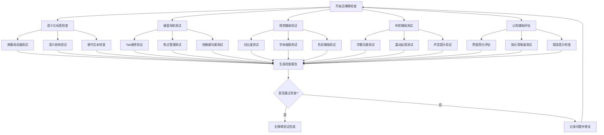

# 无障碍设计规范

## 概述

本文档定义了Dehaze Flutter应用的无障碍设计原则、实施标准和测试要求。无障碍设计确保所有用户，包括视力、听力、运动或认知障碍的用户，都能有效地使用图像去雾应用。

## 无障碍设计原则

### 1. 感知性
- 确保信息以多种方式呈现，用户可以感知界面内容
- 提供文本替代方案描述图像和UI元素
- 使用足够的颜色对比度确保内容可读性

### 2. 可操作性
- 所有功能都可通过键盘或辅助技术操作
- 为交互元素提供足够的操作空间
- 避免设计可能导致癫痫的内容

### 3. 可理解性
- 使用清晰、一致的语言和术语
- 提供上下文帮助和错误说明
- 确保界面内容预测性强且易于理解

### 4. 健壮性
- 与主流辅助技术兼容
- 遵循Web无障碍标准在移动端的最佳实践
- 确保应用在不同设备和设置下正常工作

## 无障碍检查流程

## 语义化标签规范

### 屏幕阅读器支持要求

| 规范类别 | 具体要求 | 实施方法 | 检查要点 |
|---------|---------|---------|---------|
| 语义化组件 | 使用语义化Widget而非装饰性组件 | `Semantics`包装关键UI元素 | 是否为按钮、图像、输入框添加语义标签 |
| 内容描述 | 为所有有意义的UI元素提供描述 | `Semantics(label: '描述')` | 描述是否准确、简洁、有意义 |
| 状态通知 | 动态内容变化时通知用户 | `Semantics(onTap: callback)` | 屏幕阅读器是否能及时获得状态更新 |
| 结构层次 | 正确的标题层次和内容结构 | `MergeSemantics`组合相关元素 | 信息组织是否符合逻辑层次 |
| 焦点指示 | 清晰的焦点视觉反馈 | `FocusNode`配合语义标签 | 焦点是否明确可见且可预测 |

### 实施方法

1. **图像去雾结果描述**：为处理后的图片提供详细的文字描述
2. **按钮功能说明**：每个按钮都有明确的动作描述
3. **表单字段标识**：输入框带有标签和必填项说明
4. **导航结构清晰**：使用标题和分组组织相关功能
5. **状态变化通知**：处理进度、完成状态等信息及时通知用户

## 键盘导航优化

### Tab顺序和焦点管理

| 导航要素 | 规范要求 | 实施标准 | 测试方法 |
|---------|---------|---------|---------|
| Tab顺序 | 符合阅读顺序，逻辑连贯 | 从左到右，从上到下 | 仅使用Tab键遍历所有交互元素 |
| 焦点可见 | 明确的焦点指示器 | 高对比度边框或背景变化 | 检查每个可聚焦元素的视觉反馈 |
| 跳过链接 | 提供跳过导航的快捷方式 | "跳转到主要内容"链接 | 测试是否能快速跳过重复导航 |
| 焦点陷阱 | 模态对话框中焦点限制 | 在弹出框内部循环焦点 | 测试对话框打开后的焦点行为 |
| 键盘快捷键 | 常用功能的快捷键支持 | Alt+字母，Ctrl+组合键 | 验证所有快捷键是否正常工作 |

### 快捷键设计规范

| 功能区域 | 快捷键组合 | 功能描述 | 使用场景 |
|---------|-----------|---------|---------|
| 文件操作 | Ctrl+O | 打开图片文件 | 主界面 |
| Ctrl+S | 保存处理结果 | 处理完成后 |
| Ctrl+Z | 撤销上一步操作 | 编辑操作 |
| Ctrl+Y | 重做操作 | 编辑操作 |
| 算法选择 | Alt+1-9 | 快速切换算法 | 算法选择界面 |
| 参数调整 | 方向键 | 微调参数值 | 参数设置面板 |
| 对话框控制 | Esc | 关闭当前对话框 | 任何弹出窗口 |
| Enter | 确认操作 | 按钮、表单 |
| Tab/Shift+Tab | 前进/后退导航 | 全局导航 |

## 视觉辅助支持

### 高对比度和色彩规范

| 视觉要素 | 规范标准 | 具体要求 | 实施方法 |
|---------|---------|---------|---------|
| 文本对比度 | WCAG AA级标准 | 正常文本4.5:1，大文本3:1 | 使用颜色对比度检查工具验证 |
| 交互元素对比度 | WCAG AA级标准 | 3:1对比度 | 按钮、链接等可交互元素 |
| 色彩独立性 | 不仅依赖颜色传达信息 | 配合形状、图标、文字 | 错误状态除了红色还需文字说明 |
| 高对比度模式 | 支持系统高对比度设置 | 动态适应系统主题 | 检测系统设置并切换配色方案 |
| 字体缩放 | 支持200%缩放 | 布局自适应，文本不截断 | 使用相对字体大小，弹性布局 |

### 字体和布局规范

| 规范类别 | 要求标准 | 实施要点 | 验证方法 |
|---------|---------|---------|---------|
| 字体大小 | 最小14sp，推荐16sp | 重要信息使用更大字体 | 在不同设备上测试可读性 |
| 行间距 | 1.5倍行高 | 提高文本块可读性 | 检查长文本的阅读舒适度 |
| 交互区域 | 最小44×44dp | 确保触摸和点击准确性 | 测试小屏幕设备的操作体验 |
| 响应式布局 | 适配不同屏幕尺寸 | 使用弹性布局和约束 | 在各种设备上测试布局完整性 |
| 文本对齐 | 左对齐或两端对齐 | 避免居中对齐长文本 | 检查多语言文本的显示效果 |

## 听觉辅助支持

### 字幕和音频规范

| 听觉要素 | 规范要求 | 实施标准 | 测试要点 |
|---------|---------|---------|---------|
| 视频字幕 | 所有视频内容提供字幕 | 字幕同步、准确、完整 | 关闭声音测试字幕效果 |
| 音频提示 | 重要操作提供声音反馈 | 可自定义音量或关闭 | 测试声音提示的必要性 |
| 震动反馈 | 关键操作提供触觉反馈 | 可配置震动强度和模式 | 测试震动反馈的有效性 |
| 语音控制 | 支持语音命令操作 | 准确识别和执行命令 | 测试语音控制功能覆盖度 |
| 视觉替代 | 声音信息提供视觉指示 | 闪烁、颜色变化等 | 关闭声音测试功能可用性 |

### 反馈系统设计

| 反馈类型 | 适用场景 | 实施方式 | 可配置性 |
|---------|---------|---------|---------|
| 处理完成 | 图像去雾完成 | 声音+震动+视觉通知 | 用户可选择反馈方式 |
| 错误提示 | 操作失败或异常 | 警告声音+错误对话框 | 可调节警告音量 |
| 进度更新 | 长时间处理过程 | 定期震动+进度条 | 可设置更新频率 |
| 导航确认 | 重要操作执行前 | 确认声音+对话框 | 可关闭确认声音 |
| 状态变化 | 系统状态改变 | 短促声音+图标变化 | 可自定义声音类型 |

## 认知辅助支持

### 界面简化原则

| 设计要素 | 简化策略 | 实施方法 | 评估标准 |
|---------|---------|---------|---------|
| 信息分组 | 相关功能归类 | 使用卡片、标签页组织 | 用户能否快速找到目标功能 |
| 渐进式披露 | 复杂功能分步展示 | 向导模式、步骤指示 | 新用户能否顺利完成操作 |
| 一致性设计 | 统一的交互模式 | 相同功能使用相同模式 | 用户学习成本是否降低 |
| 错误预防 | 减少操作失误机会 | 确认对话框、撤销功能 | 错误率是否显著降低 |
| 帮助系统 | 上下文相关帮助 | 工具提示、帮助文档 | 用户能否独立解决问题 |

### 指示和引导系统

| 指示类型 | 设计要求 | 实施标准 | 有效性测试 |
|---------|---------|---------|-----------|
| 操作指示 | 清晰明确的操作说明 | 使用图标+文字组合 | 用户能否理解下一步操作 |
| 状态指示 | 实时反馈当前状态 | 进度条、状态图标 | 用户是否了解系统当前状态 |
| 错误提示 | 具体可操作的错误信息 | 错误原因+解决建议 | 用户能否根据提示解决问题 |
| 成功确认 | 操作完成的明确反馈 | 成功动画+确认信息 | 用户是否确认操作成功 |
| 帮助引导 | 新功能使用指导 | 高亮提示、步骤说明 | 新用户能否快速上手 |

## 实施方法和测试工具

### 开发阶段无障碍集成

1. **设计阶段**
   - 使用无障碍设计检查清单
   - 进行用户测试，包含障碍用户群体
   - 建立无障碍设计模式和组件库

2. **开发阶段**
   - 集成无障碍测试工具到CI/CD流程
   - 使用Flutter的无障碍属性和API
   - 定期进行代码审查，关注无障碍实现

3. **测试阶段**
   - 自动化无障碍测试覆盖核心功能
   - 手动测试验证复杂交互场景
   - 辅助技术兼容性测试

### 推荐测试工具和设备

| 工具类型 | 推荐工具 | 测试目标 | 使用方法 |
|---------|---------|---------|---------|
| 屏幕阅读器 | TalkBack(Android) VoiceOver(iOS) | 语音导航体验 | 开启屏幕阅读器测试所有功能 |
| 对比度检查 | Color Contrast Analyzer WebAIM Contrast Checker | 颜色可访问性 | 验证所有文本和交互元素对比度 |
| 键盘导航 | 系统键盘 | 键盘操作完整性 | 仅用键盘完成所有操作流程 |
| 字体缩放 | 系统设置 | 文本缩放适应性 | 测试200%字体缩放下的显示效果 |
| 颜色模拟 | Color Blindness Simulator | 色盲用户体验 | 模拟不同类型的色盲情况 |
| 震动测试 | 设备震动功能 | 触觉反馈有效性 | 测试各种场景下的震动反馈 |

### 无障碍合规性检查清单

#### 基础要求
- [ ] 所有交互元素可通过屏幕阅读器访问
- [ ] 颜色对比度符合WCAG AA标准
- [ ] 支持键盘导航所有功能
- [ ] 焦点指示清晰可见
- [ ] 图像提供有意义的替代文本

#### 高级要求
- [ ] 支持系统高对比度模式
- [ ] 文本缩放至200%仍保持可用性
- [ ] 提供字幕和视觉替代方案
- [ ] 错误信息清晰且可操作
- [ ] 支持语音控制或快捷键

#### 最佳实践
- [ ] 界面简洁，认知负担低
- [ ] 操作流程可预测且一致
- [ ] 提供上下文相关的帮助信息
- [ ] 支持撤销和重做操作
- [ ] 响应时间合理，避免长时间等待

## 持续改进计划

### 用户反馈收集
- 建立无障碍反馈渠道
- 定期收集障碍用户的使用体验
- 与无障碍组织合作进行专业评估

### 技术更新跟进
- 关注Flutter无障碍功能更新
- 学习新的无障碍设计模式
- 参与无障碍技术社区和会议

### 团队能力建设
- 定期开展无障碍设计培训
- 建立无障碍设计规范和最佳实践
- 鼓励团队成员参与无障碍项目

通过遵循本规范，Dehaze Flutter应用将为所有用户提供包容、平等的使用体验，确保每个人都能享受图像去雾技术带来的便利。