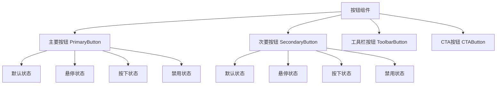
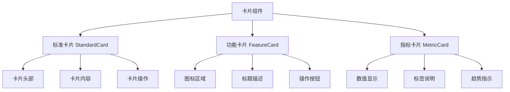
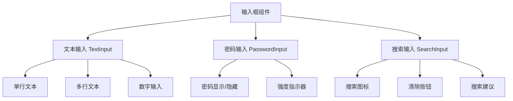
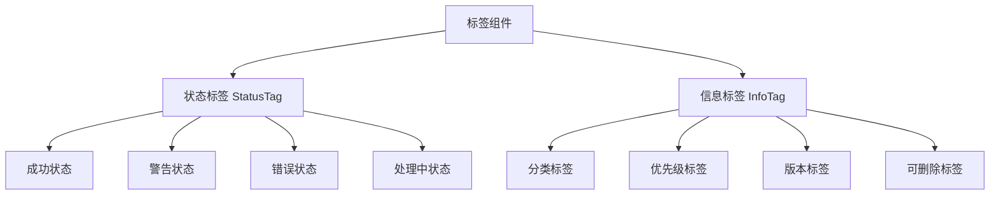
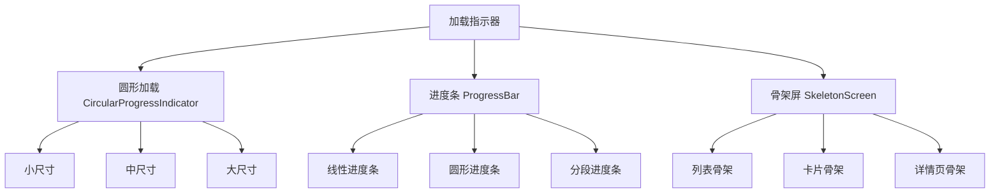

# 通用组件设计规范

## 概述

本文档定义了Dehaze Flutter应用中通用UI组件的设计规范、交互状态和使用场景。这些组件确保应用界面的一致性和用户体验的统一性。

## 1. 按钮组件 (Button Components)

### 组件层次结构

### 组件规范表格

| 组件类型 | 视觉特征 | 主要用途 | 使用场景 | 状态变化 |
|---------|----------|----------|----------|----------|
| **主要按钮** | 填充背景色，白色文字 | 主要操作触发 | 表单提交、确认操作、重要功能入口 | 悬停时背景加深，按下时缩放95% |
| **次要按钮** | 透明背景，边框样式 | 次要操作触发 | 取消操作、返回、辅助功能 | 悬停时背景半透明，按下时边框变细 |
| **工具栏按钮** | 图标为主，圆角矩形 | 快捷操作 | 工具栏操作栏、编辑功能 | 悬停时显示背景色，按下时图标变色 |
| **CTA按钮** | 渐变背景，加大尺寸 | 重要转化引导 | 注册、下载、购买、开始使用 | 动画效果增强，悬停时轻微放大 |

### 设计指导原则

- **一致性**: 相同功能的按钮在整个应用中保持一致的样式
- **可访问性**: 最小触摸区域44dp×44dp，支持键盘导航
- **视觉层次**: 主要按钮最突出，次要按钮次之，工具栏按钮最弱
- **状态反馈**: 所有状态变化都要有明确的视觉反馈

## 2. 卡片组件 (Card Components)

### 组件层次结构

### 组件规范表格

| 组件类型 | 尺寸规范 | 内容结构 | 交互方式 | 适用场景 |
|---------|----------|----------|----------|----------|
| **标准卡片** | 宽度自适应，高度120-200dp | 标题+内容+可选操作 | 点击展开详情、滑动操作 | 列表项、内容展示、信息卡片 |
| **功能卡片** | 正方形或16:9比例 | 图标+标题+简短描述 | 点击执行功能、长按显示菜单 | 功能入口、导航卡片、快捷操作 |
| **指标卡片** | 紧凑型，高度80-120dp | 数值+单位+趋势信息 | 点击查看详细统计、刷新数据 | 仪表盘、数据展示、统计面板 |

### 设计指导原则

- **信息层次**: 重要信息突出显示，次要信息弱化处理
- **间距统一**: 卡片间距16dp，内部内容边距16dp
- **阴影效果**: 轻微阴影营造层次感，避免过度装饰
- **响应式**: 卡片在不同屏幕尺寸下保持良好的比例和可读性

## 3. 输入框组件 (Input Components)

### 组件层次结构

### 组件规范表格

| 组件类型 | 输入类型 | 验证规则 | 辅助功能 | 错误处理 |
|---------|----------|----------|----------|----------|
| **文本输入** | 单行/多行文本 | 长度限制、格式验证 | 字符计数、自动完成 | 错误提示、边框变红 |
| **密码输入** | 密码字符 | 复杂度要求、长度要求 | 显示/隐藏切换、强度指示 | 实时强度反馈、规则提示 |
| **搜索输入** | 搜索关键词 | 无硬性限制 | 实时搜索、历史记录、自动建议 | 无结果提示、搜索建议 |

### 交互状态设计

| 状态 | 视觉表现 | 动画效果 | 用户提示 |
|------|----------|----------|----------|
| **聚焦状态** | 边框高亮、标签上浮 | 边框颜色渐变 | 显示输入提示 |
| **有效状态** | 绿色边框、成功图标 | 淡入动画 | 验证通过提示 |
| **错误状态** | 红色边框、错误图标 | 震动效果 | 错误信息展示 |
| **禁用状态** | 灰色背景、不可编辑 | 透明度变化 | 禁用原因说明 |

## 4. 标签组件 (Tag Components)

### 组件层次结构

### 组件规范表格

| 标签类型 | 颜色规范 | 形状样式 | 尺寸规格 | 使用场景 |
|---------|----------|----------|----------|----------|
| **状态标签** | 绿色(成功)、橙色(警告)、红色(错误)、蓝色(处理中) | 圆角矩形，左侧色块 | 高度24dp，内边距8dp | 任务状态、处理进度、系统状态 |
| **信息标签** | 灰色系为主，彩色为辅 | 完全圆角或椭圆 | 高度20-28dp，根据内容调整 | 内容分类、属性标记、过滤条件 |

### 设计指导原则

- **颜色语义**: 遵循通用的颜色语义约定，避免用户混淆
- **可读性**: 确保文字与背景有足够的对比度
- **密度控制**: 避免标签过多造成视觉混乱，提供折叠机制
- **交互反馈**: 可交互标签要有明确的视觉反馈

## 5. 加载指示器 (Loading Components)

### 组件层次结构

### 组件规范表格

| 组件类型 | 动画效果 | 尺寸规格 | 使用场景 | 性能考虑 |
|---------|----------|----------|----------|----------|
| **圆形加载** | 旋转动画，连续不断 | 16dp、24dp、32dp、48dp | 按钮加载、表格加载、弹窗加载 | 轻量级，适合短时间等待 |
| **进度条** | 填充动画，百分比显示 | 高度4dp、8dp | 文件上传、数据处理、表单提交 | 支持精确进度反馈 |
| **骨架屏** | 渐变闪烁效果 | 根据内容自适应 | 页面初始加载、列表数据加载 | 提升感知性能，减少等待焦虑 |

### 使用场景指导

| 等待时间 | 推荐组件 | 备注说明 |
|---------|----------|----------|
| 0-2秒 | 无需显示 | 用户感知不到明显延迟 |
| 2-5秒 | 圆形加载 | 简单的旋转动画即可 |
| 5-30秒 | 进度条 + 百分比 | 提供具体进度信息 |
| 30秒以上 | 骨架屏 + 进度条 | 减少用户等待焦虑 |

## 通用设计原则

### 1. 一致性原则
- **视觉一致性**: 相同功能的组件在不同页面保持一致的样式
- **交互一致性**: 相同的交互手势在整个应用中有相同的响应
- **布局一致性**: 组件间距、对齐方式遵循统一规范

### 2. 可访问性原则
- **颜色对比**: 确保文字与背景的对比度符合WCAG 2.1 AA标准
- **触摸目标**: 所有可交互元素最小44dp×44dp
- **状态反馈**: 为所有交互状态提供清晰的视觉反馈

### 3. 响应式设计
- **断点设置**: 手机(320dp-768dp)、平板(768dp-1024dp)、桌面(1024dp+)
- **弹性布局**: 使用Flex和Grid实现自适应布局
- **内容优先**: 确保在任何屏幕尺寸下内容都完整可读

### 4. 性能优化
- **组件复用**: 提取通用逻辑，避免重复代码
- **懒加载**: 大型组件和图片按需加载
- **状态管理**: 合理管理组件状态，避免不必要的重建

## 主题和样式系统

### 颜色系统
- **主色调**: 品牌蓝色系，用于主要操作和重要信息
- **辅助色**: 绿色(成功)、橙色(警告)、红色(错误)、灰色(中性)
- **中性色**: 文字、边框、背景使用不同深浅的灰色

### 字体系统
- **主字体**: 系统默认字体，确保最佳可读性
- **字重**: Regular(400)、Medium(500)、Semibold(600)、Bold(700)
- **字号**: 12dp、14dp、16dp、18dp、20dp、24dp、32dp

### 间距系统
- **基础单位**: 4dp，所有间距为4dp的倍数
- **常用间距**: 4dp、8dp、16dp、24dp、32dp、48dp
- **组件间距**: 16dp(卡片间距)、8dp(内部元素间距)

## 组件使用检查清单

在开发过程中，请使用以下检查清单确保组件的规范使用：

### 设计阶段
- [ ] 确定组件类型和用途
- [ ] 选择合适的尺寸和样式
- [ ] 定义所有交互状态
- [ ] 考虑可访问性要求

### 开发阶段
- [ ] 使用正确的组件props
- [ ] 实现所有必要的状态变化
- [ ] 添加错误处理和边界情况
- [ ] 确保响应式设计

### 测试阶段
- [ ] 验证视觉效果是否符合设计稿
- [ ] 测试所有交互状态
- [ ] 检查不同屏幕尺寸下的表现
- [ ] 验证可访问性功能

通过遵循这些设计规范和指导原则，我们可以确保Dehaze Flutter应用提供一致、直观、易用的用户体验。