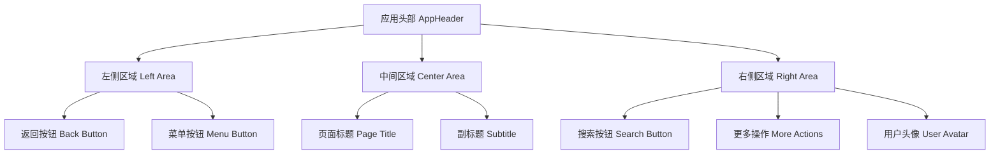
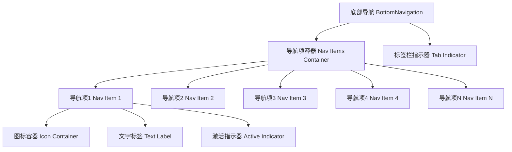
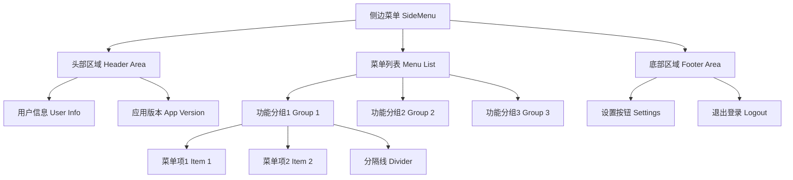
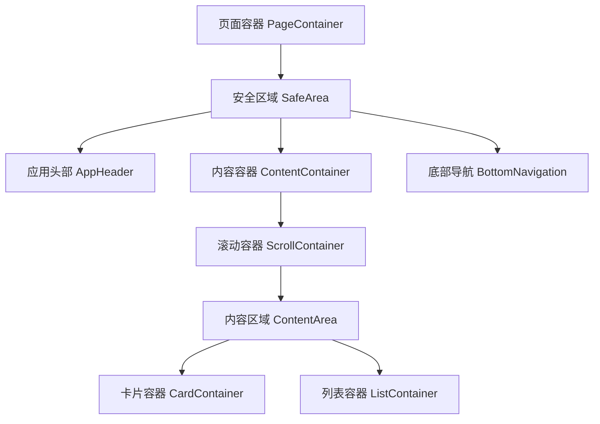
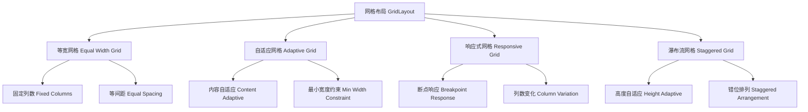

# 去雾系统 - 布局组件设计规范

## 概述

本文档定义了去雾系统Flutter应用的布局组件设计规范，包括应用头部、底部导航、侧边菜单、容器组件和网格布局等核心布局组件的设计原则、响应式策略和交互设计。

## 1. 应用头部 (App Header)

### 设计原则

应用头部作为页面顶部的重要导航元素，提供页面标题、导航控制和操作功能。头部采用固定定位，始终保持在页面顶部，为用户提供一致的导航体验。

### 布局层次结构



### 布局属性配置

| 属性类别 | 属性名称 | 默认值 | 说明 |
|---------|---------|--------|------|
| 尺寸属性 | 高度 | 56dp | 遵循Material Design标准 |
| | 内边距 | 水平16dp | 内容与边缘的间距 |
| | 最小高度 | 48dp | 无障碍访问要求 |
| 颜色属性 | 背景色 | 主题色 | 适配深色/浅色模式 |
| | 文字颜色 | onPrimary | 确保对比度符合标准 |
| | 图标颜色 | onPrimary | 与文字颜色保持一致 |
| 阴影属性 | 海拔高度 | 4dp | 提供层次感 |
| | 模糊效果 | 半透明 | 增强视觉深度 |

### 响应式行为

| 屏幕尺寸 | 返回按钮 | 标题显示 | 操作按钮 |
|---------|---------|----------|----------|
| 手机竖屏 | 必需显示 | 截断显示 | 最多2个 |
| 手机横屏 | 必需显示 | 完整显示 | 最多3个 |
| 平板竖屏 | 可选显示 | 完整显示 | 最多4个 |
| 平板横屏 | 可选显示 | 完整显示 | 完整显示 |

### 交互设计

#### 返回按钮交互
- 点击返回：执行页面返回操作
- 长按返回：显示返回路径提示
- 无历史记录：显示禁用状态

#### 操作按钮交互
- 主操作：使用高亮色彩
- 次要操作：使用描边样式
- 危险操作：使用红色警告色

## 2. 底部导航 (Bottom Navigation)

### 设计原则

底部导航作为应用主要导航方式，提供快速访问核心功能模块的入口。采用图标+文字的组合形式，确保用户能够快速识别和理解各个功能模块。

### 布局层次结构



### 导航项配置规范

| 配置项 | 图标尺寸 | 文字大小 | 间距规范 | 激活状态 |
|--------|----------|----------|----------|----------|
| 标准模式 | 24dp | 12dp | 垂直8dp | 图标+文字高亮 |
| 紧凑模式 | 20dp | 10dp | 垂直6dp | 仅图标高亮 |
| 标签模式 | 无图标 | 14dp | 水平16dp | 文字下划线 |

### 响应式适配策略

| 屏幕类型 | 导航项数量 | 显示方式 | 交互模式 |
|---------|-----------|----------|----------|
| 小屏手机 | 3-4个 | 图标+文字 | 点击切换 |
| 大屏手机 | 4-5个 | 图标+文字 | 点击切换 |
| 小屏平板 | 5-6个 | 图标+文字 | 点击切换 |
| 大屏平板 | 6-8个 | 标签模式 | 点击切换 |

### 状态设计

#### 激活状态
- 图标使用主题色填充
- 文字使用主题色且字体加粗
- 底部显示激活指示条

#### 非激活状态
- 图标使用次要颜色
- 文字使用次要颜色
- 无激活指示条

#### 禁用状态
- 图标和文字使用灰色
- 降低透明度至50%
- 无交互响应

## 3. 侧边菜单 (Side Menu)

### 设计原则

侧边菜单作为次要导航方式，提供完整的导航结构和辅助功能。采用抽屉式设计，从屏幕左侧滑出，不影响主要内容区域的展示。

### 菜单层次结构



### 菜单分组规范

| 分组类型 | 标题样式 | 分组间距 | 菜单项高度 | 图标尺寸 |
|---------|----------|----------|-----------|----------|
| 主要功能 | 大标题加粗 | 24dp | 56dp | 24dp |
| 次要功能 | 小标题常规 | 16dp | 48dp | 20dp |
| 辅助功能 | 无标题分组 | 8dp | 40dp | 16dp |

### 响应式行为

| 屏幕尺寸 | 菜单宽度 | 遮罩层 | 动画时长 | 手势支持 |
|---------|----------|--------|----------|----------|
| 手机竖屏 | 280dp | 半透明 | 300ms | 支持 |
| 手机横屏 | 320dp | 半透明 | 250ms | 支持 |
| 平板竖屏 | 360dp | 半透明 | 200ms | 可选 |
| 平板横屏 | 400dp | 可选 | 200ms | 可选 |

### 交互设计

#### 打开方式
- 点击菜单按钮：平滑滑出
- 左滑手势：快速打开
- 长按菜单：延迟打开

#### 关闭方式
- 点击遮罩层：立即关闭
- 点击菜单项：选择后关闭
- 右滑手势：快速关闭
- ESC键：键盘支持

#### 菜单项交互
- 当前页面：高亮显示且不可点击
- 子菜单：展开/收起动画
- 外部链接：显示跳转图标

## 4. 容器组件 (Container Components)

### 设计原则

容器组件作为页面内容的基础框架，提供统一的布局约束和间距规范。通过标准化的容器组件，确保整个应用的视觉一致性和布局稳定性。

### 容器类型层次



### 容器属性配置

#### 页面容器 (PageContainer)
| 属性 | 值 | 说明 |
|------|----|----- |
| 内边距 | 水平16dp，垂直8dp | 内容与屏幕边缘间距 |
| 背景色 | 主题背景色 | 适配深色/浅色模式 |
| 最小高度 | 屏幕高度 | 确保填满整个屏幕 |
| 滚动行为 | 支持嵌套滚动 | 处理复杂滚动场景 |

#### 内容容器 (ContentContainer)
| 属性 | 值 | 说明 |
|------|----|----- |
| 最大宽度 | 1200dp | 大屏幕适配 |
| 居中对齐 | 水平居中 | 内容居中显示 |
| 内边距 | 16dp | 内容与容器边缘间距 |
| 圆角半径 | 8dp | 卡片化设计 |

#### 滚动容器 (ScrollContainer)
| 属性 | 值 | 说明 |
|------|----|----- |
| 滚动方向 | 垂直 | 主要滚动方向 |
| 滚动条显示 | 智能显示 | 根据内容显示 |
| 弹性效果 | 支持 | iOS风格弹性 |
| 刷新支持 | 可选 | 下拉刷新功能 |

### 响应式策略

| 屏幕尺寸 | 页面边距 | 内容最大宽度 | 卡片间距 | 列布局 |
|---------|----------|-------------|----------|--------|
| 小屏手机 | 12dp | 100% | 8dp | 单列 |
| 大屏手机 | 16dp | 100% | 12dp | 单列 |
| 小屏平板 | 24dp | 600dp | 16dp | 双列 |
| 大屏平板 | 32dp | 800dp | 20dp | 多列 |

### 特殊容器类型

#### 状态容器 (StateContainer)
- 加载状态：显示加载指示器
- 空状态：显示空状态提示
- 错误状态：显示错误信息和重试按钮
- 成功状态：显示正常内容

#### 操作容器 (ActionContainer)
- 固定位置：底部固定定位
- 安全区域：适配底部安全区域
- 阴影效果：提供层次感
- 按钮布局：水平排列，右对齐

## 5. 网格布局 (Grid Layout)

### 设计原则

网格布局提供灵活的内容排列方式，支持不同尺寸和比例的内容展示。通过标准化的网格系统，实现响应式布局和视觉对齐。

### 网格类型结构



### 网格配置参数

#### 等宽网格
| 参数 | 小屏 | 中屏 | 大屏 | 超大屏 |
|------|------|------|------|--------|
| 列数 | 2 | 3 | 4 | 5 |
| 间距 | 8dp | 12dp | 16dp | 20dp |
| 边距 | 12dp | 16dp | 24dp | 32dp |

#### 自适应网格
| 参数 | 最小宽度 | 最大宽度 | 间距 | 缩放策略 |
|------|----------|----------|------|----------|
| 卡片最小宽度 | 280dp | - | 固定 | 列数自适应 |
| 图片最小宽度 | 200dp | 400dp | 弹性 | 宽度弹性缩放 |
| 列表项最小宽度 | 320dp | 600dp | 固定 | 水平居中 |

#### 响应式网格
| 断点 | 屏幕宽度 | 列数 | 间距 | 布局变化 |
|------|----------|------|------|----------|
| Mobile | < 600dp | 1-2 | 8dp | 垂直排列 |
| Tablet | 600-1024dp | 2-4 | 12dp | 网格排列 |
| Desktop | > 1024dp | 3-6 | 16dp | 多列网格 |

### 响应式适配规则

#### 列数计算公式
```
列数 = floor((屏幕宽度 - 总边距) / (项目最小宽度 + 间距))
```

#### 间距计算规则
- 项目间距：屏幕宽度的2%
- 容器边距：屏幕宽度的4%
- 最小间距：8dp
- 最大间距：24dp

#### 内容适配策略
- 图片内容：保持宽高比，裁剪填充
- 文本内容：弹性高度，省略截断
- 卡片内容：固定高度，内容滚动
- 混合内容：根据类型分别处理

### 交互设计

#### 网格项交互
- 点击反馈：涟漪效果
- 长按操作：显示上下文菜单
- 拖拽排序：支持重新排列
- 滑动操作：显示快捷操作

#### 滚动行为
- 惯性滚动：支持动量效果
- 分页滚动：可选的分页对齐
- 下拉刷新：支持内容更新
- 上拉加载：支持无限滚动

### 性能优化

#### 渲染优化
- 延迟加载：可视区域外项目延迟渲染
- 项目缓存：复用已创建的项目组件
- 预加载：提前加载下一页内容
- 虚拟化：大数据集使用虚拟列表

#### 内存管理
- 图片缓存：智能缓存策略
- 资源释放：及时释放不可见资源
- 内存监控：监控内存使用情况
- 降级处理：内存不足时降低质量

## 布局组件使用指南

### 组件选择原则

1. **页面级布局**：使用PageContainer作为根容器
2. **导航需求**：根据层级选择头部导航或底部导航
3. **内容展示**：根据内容类型选择合适的网格布局
4. **交互复杂度**：复杂交互使用侧边菜单，简单交互使用头部按钮

### 响应式设计检查清单

- [ ] 所有布局组件在不同屏幕尺寸下正常显示
- [ ] 文字大小和间距在小屏幕上可读性良好
- [ ] 触摸目标大小符合无障碍标准（最小44dp）
- [ ] 横竖屏切换时布局正确适配
- [ ] 平板和大屏设备充分利用屏幕空间

### 性能优化建议

1. **减少嵌套层级**：避免过深的组件嵌套
2. **合理使用const**：静态组件使用const构造函数
3. **延迟加载**：非首屏内容延迟加载
4. **图片优化**：使用合适尺寸和格式的图片
5. **滚动优化**：使用ListView或GridView处理大量数据

### 测试验证

#### 布局测试
- 不同设备尺寸测试
- 横竖屏切换测试
- 不同内容长度测试
- 边界条件测试

#### 交互测试
- 点击响应测试
- 手势操作测试
- 状态切换测试
- 动画效果测试

#### 性能测试
- 页面加载时间
- 滚动流畅度
- 内存使用情况
- CPU占用率