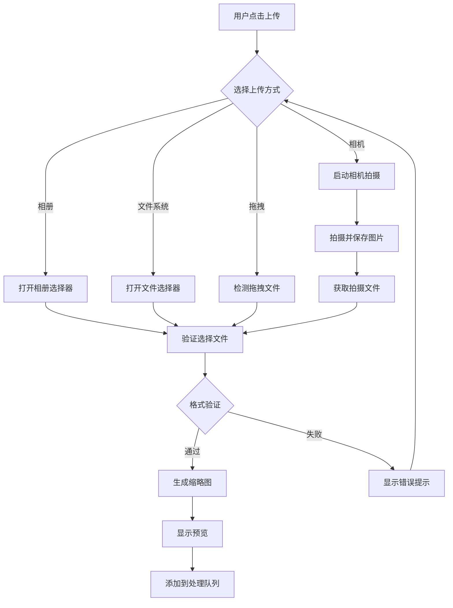
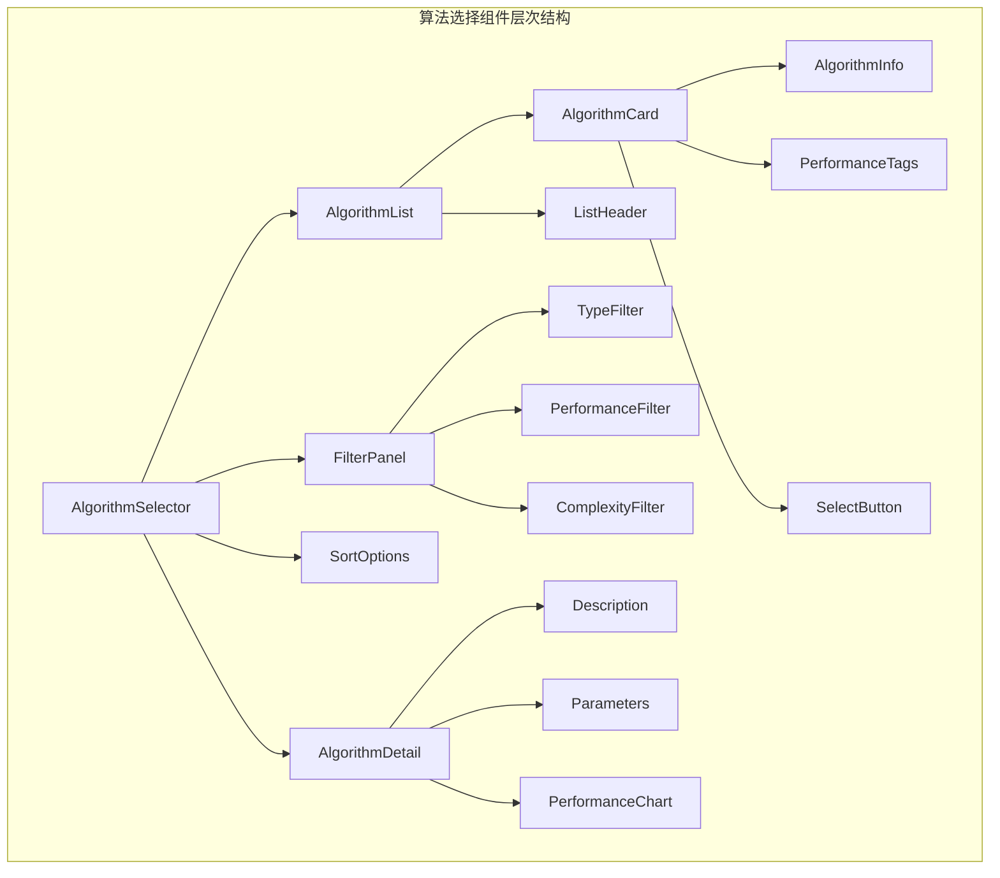
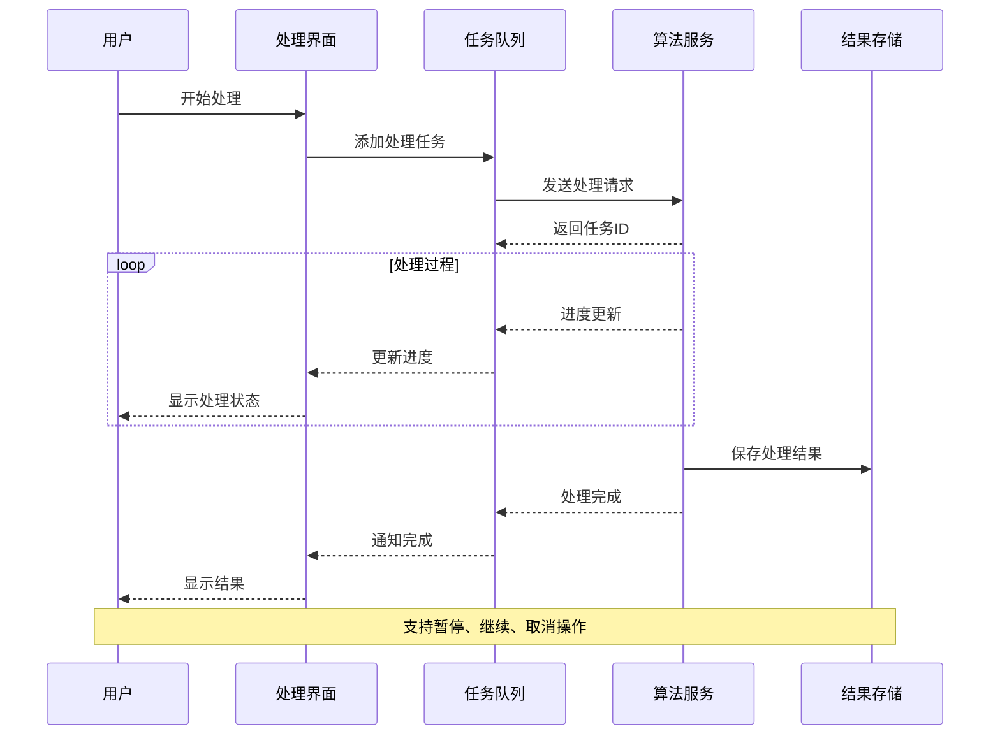
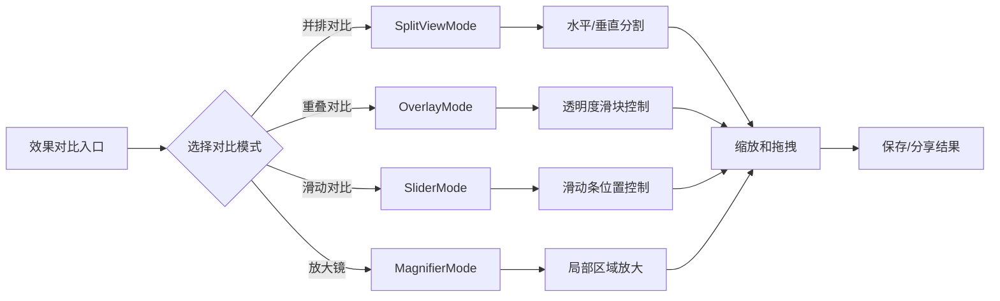
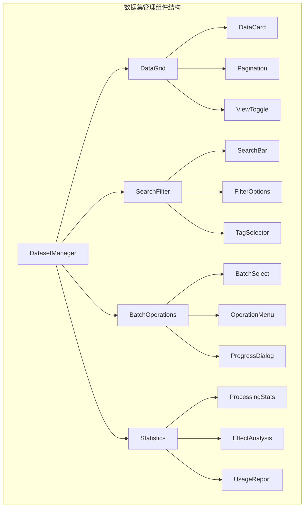
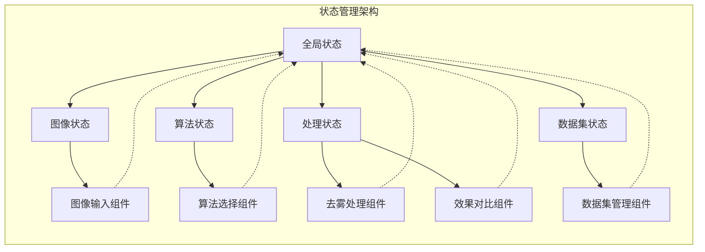

# Flutter 业务组件设计

## 概述

本文档定义了DehazeSystem Flutter应用中的核心业务组件，包括组件功能、设计要求、业务流程和状态管理。所有组件都遵循Material Design 3.0设计规范，确保统一的用户体验和响应式设计。

## 1. 图像输入组件

### 组件描述
图像输入组件负责处理用户的图像文件输入，支持多种图像格式和来源，提供直观的文件选择和预览功能。

### 核心功能
- **文件选择**: 支持从相册、相机、文件系统选择图像
- **格式验证**: 支持JPG、PNG、BMP、TIFF等主流图像格式
- **预览功能**: 提供缩略图和全屏预览
- **拖拽上传**: 支持拖拽文件到指定区域
- **批量上传**: 支持一次选择多张图像
- **基本信息展示**: 显示文件名、大小、分辨率、格式等元数据

### 业务流程

### 用户交互流程
1. 用户进入图像输入页面
2. 选择上传方式（相册/相机/文件/拖拽）
3. 系统验证文件格式和大小
4. 生成缩略图并显示预览
5. 用户可以删除或重新选择
6. 确认后添加到处理队列

### 状态管理表格

| 状态名称 | 类型 | 描述 | 更新条件 |
|---------|------|------|----------|
| selectedImages | List<ImageFile> | 已选择的图像文件列表 | 用户添加/删除图像时 |
| uploadProgress | Map<String, double> | 上传进度映射 | 文件上传过程中 |
| isUploading | bool | 是否正在上传 | 开始/结束上传时 |
| previewIndex | int | 当前预览图像索引 | 切换预览图像时 |
| uploadError | String? | 上传错误信息 | 上传失败时 |

## 2. 算法选择组件

### 组件描述
算法选择组件提供完整的去雾算法管理功能，包括算法列表展示、筛选排序、详细信息查看和参数配置。

### 核心功能
- **算法列表**: 以卡片形式展示所有可用算法
- **筛选功能**: 按类型、性能、复杂度等条件筛选
- **排序选项**: 支持按名称、性能、推荐度排序
- **详情展示**: 显示算法描述、性能指标、适用场景
- **预设参数**: 提供不同场景的参数预设
- **性能预估**: 根据设备性能预估处理时间

### 组件关系图

### 算法分类

| 类别 | 包含算法 | 特点 | 适用场景 |
|------|----------|------|----------|
| 经典算法 | DCP, CAP, BCCR | 理论基础扎实 | 学术研究、教学演示 |
| 深度学习 | DPN, AOD-Net, Dehamer | 效果优秀 | 实际应用、高质量需求 |
| 轻量级 | MSCNN, GFN | 速度快 | 实时处理、移动设备 |
| 高性能 | WPXNet, FFA-Net | 效果最好 | 专业应用、离线处理 |

### 用户交互流程
1. 进入算法选择页面
2. 查看推荐算法或搜索特定算法
3. 使用筛选器缩小选择范围
4. 查看算法详细信息
5. 选择适合的算法
6. 调整算法参数（可选）

### 状态管理表格

| 状态名称 | 类型 | 描述 | 更新条件 |
|---------|------|------|----------|
| algorithms | List<Algorithm> | 算法列表数据 | 页面加载、筛选变化时 |
| selectedAlgorithm | Algorithm? | 当前选择的算法 | 用户选择算法时 |
| filters | FilterOptions | 筛选条件 | 用户调整筛选条件时 |
| sortBy | SortType | 排序方式 | 用户切换排序时 |
| showDetail | bool | 是否显示详情面板 | 点击详情时 |
| algorithmParams | Map<String, dynamic> | 算法参数配置 | 用户调整参数时 |

## 3. 去雾处理组件

### 组件描述
去雾处理组件负责管理图像去雾的整个处理过程，包括任务队列管理、进度跟踪、参数调节和结果预览。

### 核心功能
- **任务队列**: 支持批量处理多个图像
- **进度跟踪**: 实时显示处理进度和预估时间
- **参数调节**: 动态调整算法参数并实时预览
- **暂停/继续**: 支持暂停和继续处理任务
- **错误处理**: 处理失败时的重试和错误提示
- **结果管理**: 处理结果的保存和管理

### 处理流程图

### 参数调节界面设计

| 参数类型 | 控制方式 | 实时预览 | 说明 |
|---------|----------|----------|------|
| 强度调节 | Slider滑块 | 支持 | 去雾强度控制 |
| 色彩恢复 | 开关/滑块 | 支持 | 色彩饱和度调整 |
| 对比度 | 数值输入 | 支持 | 图像对比度 |
| 锐化程度 | 滑块 | 支持 | 边缘锐化强度 |
| 预设模式 | 下拉选择 | 支持 | 快速参数组合 |

### 用户交互流程
1. 用户确认图像和算法后开始处理
2. 系统将任务加入处理队列
3. 实时显示处理进度和状态
4. 用户可以调节参数并实时预览
5. 处理完成后显示结果
6. 用户可以保存或重新处理

### 状态管理表格

| 状态名称 | 类型 | 描述 | 更新条件 |
|---------|------|------|----------|
| processingTasks | List<Task> | 处理任务队列 | 添加/完成任务时 |
| currentTask | Task? | 当前处理任务 | 处理状态变化时 |
| processingProgress | double | 处理进度 0-1 | 接收进度更新时 |
| estimatedTime | Duration? | 预估剩余时间 | 进度更新时 |
| isPaused | bool | 是否暂停 | 暂停/继续操作时 |
| previewResult | Image? | 预览结果 | 实时预览生成时 |
| processingParams | ProcessingParams | 处理参数 | 参数调节时 |

## 4. 效果对比组件

### 组件描述
效果对比组件提供丰富的原图与处理结果的对比功能，帮助用户直观评估去雾效果。

### 核心功能
- **并排对比**: 左右或上下分割显示原图和结果
- **重叠对比**: 通过透明度调节对比差异
- **滑动对比**: 滑动分隔线对比局部效果
- **放大镜**: 局部区域放大对比
- **缩放控制**: 支持放大缩小查看细节
- **全屏对比**: 全屏模式对比查看

### 对比模式流程

### 对比功能对比表

| 对比模式 | 适用场景 | 交互方式 | 优势 | 局限 |
|---------|----------|----------|------|------|
| 并排对比 | 整体效果评估 | 拖拽分隔线 | 直观清晰 | 占用空间大 |
| 重叠对比 | 细微差异查看 | 透明度滑块 | 空间利用率高 | 需要频繁调节 |
| 滑动对比 | 局部区域对比 | 滑动分隔线 | 精确对比 | 一次性查看区域有限 |
| 放大镜 | 细节对比查看 | 鼠标/手指移动 | 高倍放大 | 只能查看局部 |

### 用户交互流程
1. 处理完成后自动进入对比界面
2. 用户选择合适的对比模式
3. 通过交互操作查看效果差异
4. 可以切换不同的对比模式
5. 支持缩放查看细节
6. 确认满意后保存结果

### 状态管理表格

| 状态名称 | 类型 | 描述 | 更新条件 |
|---------|------|------|----------|
| originalImage | Image | 原始图像 | 设置对比图像时 |
| processedImage | Image | 处理后图像 | 处理完成时 |
| compareMode | CompareMode | 当前对比模式 | 用户切换模式时 |
| sliderPosition | double | 滑动条位置 0-1 | 用户拖拽时 |
| overlayOpacity | double | 重叠透明度 0-1 | 用户调节时 |
| zoomLevel | double | 缩放级别 | 缩放操作时 |
| offset | Offset | 图像偏移量 | 拖拽操作时 |

## 5. 数据集管理组件

### 组件描述
数据集管理组件提供完整的图像数据集管理功能，包括数据浏览、搜索过滤、批量操作和统计分析。

### 核心功能
- **数据列表**: 网格或列表形式展示数据集
- **搜索过滤**: 按名称、标签、时间等条件搜索
- **批量操作**: 支持批量删除、导出、处理
- **标签管理**: 为图像添加和管理标签
- **统计分析**: 显示处理统计和效果分析
- **导入导出**: 支持数据集的导入和导出

### 数据管理架构

### 数据集分类管理

| 分类方式 | 说明 | 用途 | 示例 |
|---------|------|------|------|
| 按时间 | 按拍摄/处理时间分组 | 时间线浏览 | 今日、本周、本月 |
| 按算法 | 按使用的去雾算法分组 | 算法效果对比 | DCP组、AOD-Net组 |
| 按质量 | 按图像质量评分分组 | 质量筛选 | 优秀、良好、一般 |
| 按场景 | 按拍摄场景分组 | 场景适配 | 室内、室外、夜景 |
| 按标签 | 用户自定义标签分组 | 个性化管理 | 测试、正式、备份 |

### 用户交互流程
1. 进入数据集管理页面
2. 查看数据集概览和统计信息
3. 使用搜索和筛选功能定位目标数据
4. 批量选择需要进行操作的数据
5. 执行批量处理、删除或导出操作
6. 查看操作结果和统计报告

### 状态管理表格

| 状态名称 | 类型 | 描述 | 更新条件 |
|---------|------|------|----------|
| dataset | List<DataItem> | 数据集列表 | 数据加载、操作更新时 |
| filteredData | List<DataItem> | 筛选后的数据 | 筛选条件变化时 |
| selectedItems | Set<String> | 选中的数据ID | 用户选择/取消选择时 |
| viewMode | ViewMode | 显示模式 | 切换网格/列表视图时 |
| searchQuery | String | 搜索关键词 | 用户搜索时 |
| filters | DatasetFilters | 数据筛选条件 | 筛选器变化时 |
| sortBy | SortField | 排序字段 | 切换排序时 |
| sortOrder | SortOrder | 排序方向 | 切换升序/降序时 |

## 组件间通信机制

### 状态共享策略

### 事件传递机制
- **状态更新事件**: 组件状态变化时通知全局状态管理
- **操作完成事件**: 长时间操作完成后的回调通知
- **错误处理事件**: 操作失败时的错误传播和处理
- **导航事件**: 页面间跳转的参数传递

## 性能优化策略

### 图像处理优化
- **缩略图生成**: 后台异步生成缩略图，避免阻塞UI
- **内存管理**: 及时释放不用的图像资源
- **缓存策略**: 智能缓存处理结果和预览图
- **懒加载**: 大数据集的分页加载

### 用户界面优化
- **响应式布局**: 适配不同屏幕尺寸和方向
- **动画优化**: 使用硬件加速的流畅动画
- **手势识别**: 支持多点触控和手势操作
- **主题切换**: 支持明暗主题切换

## 错误处理和用户反馈

### 错误分类和处理
| 错误类型 | 处理方式 | 用户提示 | 恢复策略 |
|---------|----------|----------|----------|
| 文件格式错误 | 文件验证 | 提示支持的格式 | 重新选择文件 |
| 网络连接错误 | 重试机制 | 网络异常提示 | 自动重试/手动重试 |
| 处理失败 | 错误日志 | 处理失败原因 | 调整参数重试 |
| 内存不足 | 清理缓存 | 内存不足警告 | 释放内存重试 |
| 算法服务不可用 | 服务检测 | 服务异常提示 | 切换备用算法 |

### 用户反馈机制
- **进度指示**: 长时间操作的进度展示
- **操作确认**: 重要操作的二次确认
- **成功提示**: 操作完成的成功反馈
- **错误提示**: 友好的错误信息和解决建议

## 总结

本设计文档详细定义了DehazeSystem Flutter应用的五个核心业务组件：

1. **图像输入组件**: 提供灵活的图像输入和管理功能
2. **算法选择组件**: 提供完整的算法选择和配置功能
3. **去雾处理组件**: 管理整个图像处理流程
4. **效果对比组件**: 提供丰富的效果对比和评估功能
5. **数据集管理组件**: 提供完整的数据管理和统计功能

所有组件都遵循一致的设计原则，提供良好的用户体验，并通过合理的状态管理确保应用的可维护性和可扩展性。组件间的通信机制和错误处理策略确保了应用的稳定性和可靠性。