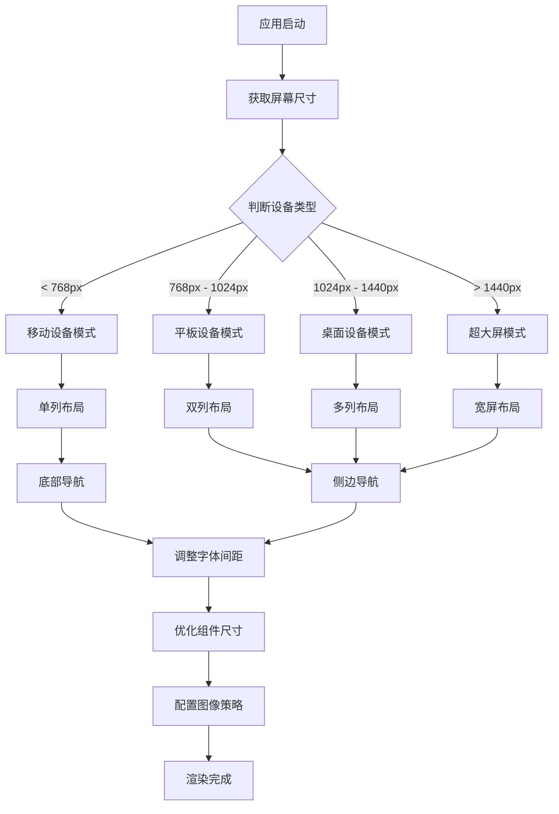
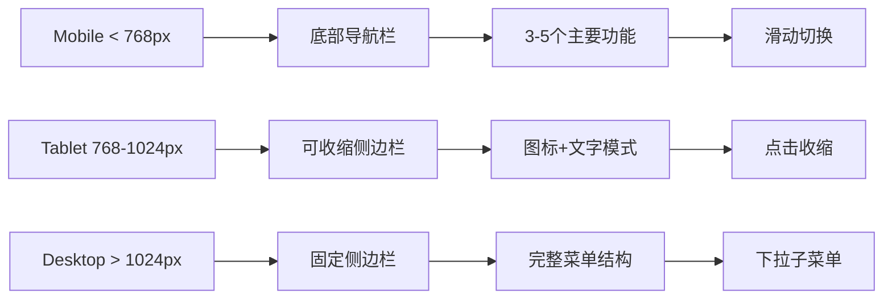
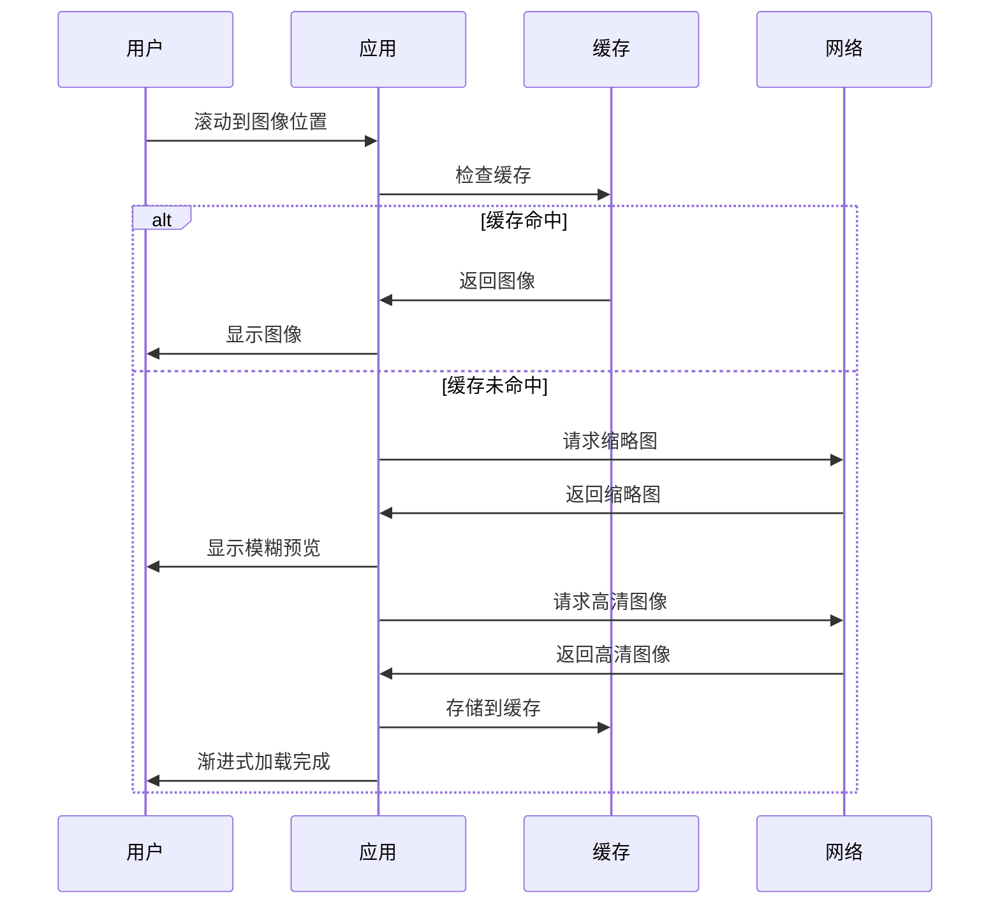

# 响应式设计规范

## 概述

本文档定义了Dehaze Flutter应用的响应式设计策略，确保应用在不同设备和屏幕尺寸上都能提供优秀的用户体验。响应式设计通过动态调整布局、字体、间距和组件尺寸来适配各种设备。

## 1. 设备断点定义

### 断点策略

我们采用四个主要断点来适配不同设备类型，每个断点都有明确的布局规则和交互模式。

### 断点分类

- **Mobile（移动设备）**: 屏幕宽度 < 768px
- **Tablet（平板设备）**: 屏幕宽度 768px - 1024px
- **Desktop（桌面设备）**: 屏幕宽度 1024px - 1440px
- **Large Desktop（超大屏）**: 屏幕宽度 > 1440px

## 2. 响应式设计流程

## 3. 断点布局规范

### 3.1 布局断点表

| 断点类别 | 屏幕宽度 | 布局列数 | 导航位置 | 侧边栏 | 卡片尺寸 | 字体缩放 |
|---------|---------|---------|---------|--------|----------|----------|
| Mobile | < 768px | 1列 | 底部 | 隐藏 | 100%宽度 | 0.9x |
| Tablet | 768px - 1024px | 2列 | 侧边 | 可收缩 | 48%宽度 | 1.0x |
| Desktop | 1024px - 1440px | 3列 | 侧边 | 固定 | 31%宽度 | 1.1x |
| Large Desktop | > 1440px | 4列 | 侧边 | 固定 | 23%宽度 | 1.2x |

### 3.2 间距规范表

| 断点类别 | 基础间距 | 内容边距 | 组件间距 | 卡片内边距 | 按钮高度 |
|---------|---------|---------|----------|-----------|----------|
| Mobile | 8px | 16px | 12px | 16px | 44px |
| Tablet | 12px | 24px | 16px | 20px | 48px |
| Desktop | 16px | 32px | 20px | 24px | 52px |
| Large Desktop | 20px | 40px | 24px | 28px | 56px |

## 4. 布局适配策略

### 4.1 单列布局（移动设备）

移动设备采用单列垂直布局，确保内容在小屏幕上的可读性和操作性：

- **导航栏**: 固定在底部，高度60px，包含主要功能入口
- **内容区域**: 全宽展示，垂直滚动
- **卡片组件**: 占据屏幕宽度，圆角和阴影适中
- **按钮**: 全宽或固定宽度，触摸友好尺寸不小于44x44px
- **列表项**: 高度不小于72px，提供充足的触摸区域

### 4.2 双列布局（平板设备）

平板设备采用双列布局，平衡信息密度和阅读体验：

- **侧边导航**: 可收缩，宽度240px，收缩时显示图标
- **主内容区**: 分为两列，列间距16px
- **卡片组件**: 并排显示，保持宽高比例
- **工具栏**: 水平排列，图标和文字组合
- **弹窗**: 居中显示，最大宽度600px

### 4.3 多列布局（桌面设备）

桌面设备采用多列布局，充分利用屏幕空间：

- **侧边导航**: 固定显示，宽度280px
- **主内容区**: 3列网格布局，自适应列宽
- **详情面板**: 可选右侧面板，宽度360px
- **菜单栏**: 顶部水平菜单，支持下拉子菜单
- **状态栏**: 底部信息栏，显示系统状态

### 4.4 宽屏布局（超大屏）

超大屏设备采用4列布局，防止内容过度拉伸：

- **最大内容宽度**: 1400px，居中显示
- **列数**: 最多4列，防止内容过于稀疏
- **字体大小**: 适当放大，提高可读性
- **空白区域**: 合理利用留白，避免视觉疲劳

## 5. 组件响应式行为

### 5.1 按钮组件响应式

按钮在不同设备上的尺寸和行为：

**移动设备**:
- 高度44px，最小触摸区域
- 全宽按钮用于主要操作
- 圆角增大，提供更好的视觉反馈

**平板设备**:
- 高度48px，适中尺寸
- 文字+图标组合按钮
- 支持悬停状态和动画效果

**桌面设备**:
- 高度52px，精确控制
- 快捷键支持
- 右键菜单功能

### 5.2 卡片组件响应式

卡片布局的响应式调整：

**移动设备**:
- 单列排列，上下间距12px
- 圆角12px，阴影适中
- 标题字体16px，内容字体14px

**平板设备**:
- 双列排列，网格布局
- 圆角8px，轻微阴影
- 标题字体18px，内容字体15px

**桌面设备**:
- 多列排列，瀑布流布局
- 圆角6px，悬停阴影加深
- 标题字体20px，内容字体16px

### 5.3 导航组件响应式

导航模式的响应式切换：

## 6. 字体和间距响应式

### 6.1 字体缩放策略

基于屏幕宽度的动态字体缩放：

- **基准字体**: 16px（在桌面设备上）
- **缩放公式**: `fontSize = baseSize * (screenWidth / 1024)`
- **最小字体**: 12px（移动设备）
- **最大字体**: 20px（超大屏）

### 6.2 行高调整

行高根据字体大小动态调整：

- **正文行高**: 字体大小的1.5倍
- **标题行高**: 字体大小的1.3倍
- **列表行高**: 字体大小的1.4倍

### 6.3 间距系统

采用8px基础间距系统：

- **基础单位**: 8px
- **间距倍数**: 0.5x, 1x, 1.5x, 2x, 3x, 4x
- **响应式调整**: 基础单位根据设备类型调整

## 7. 图像适配策略

### 7.1 分辨率适配

图像资源的分辨率适配策略：

- **1x**: 标准分辨率（老式设备）
- **2x**: 高分辨率（大部分现代设备）
- **3x**: 超高分辨率（高端设备）
- **4x**: 极高分辨率（专业显示设备）

### 7.2 图像加载流程

### 7.3 渐进式加载

图像的渐进式加载策略：

1. **占位符**: 加载前显示纯色占位符
2. **模糊预览**: 显示低分辨率模糊版本
3. **渐进增强**: 逐步加载高清版本
4. **平滑过渡**: 使用动画效果平滑切换

### 7.4 懒加载策略

基于用户行为的智能加载：

- **视窗检测**: 进入视窗前200px开始加载
- **网络优化**: 根据网络状况调整图像质量
- **优先级**: 首屏图像优先加载
- **预加载**: 智能预加载用户可能查看的图像

## 8. 设备特性适配

### 8.1 触摸设备适配

针对触摸设备的特殊优化：

- **触摸目标**: 最小44x44px的触摸区域
- **手势支持**: 支持滑动、捏合、长按等手势
- **反馈效果**: 触摸时的视觉和触觉反馈
- **防止误触**: 增加关键操作的确认步骤

### 8.2 键盘和鼠标适配

针对桌面设备的交互优化：

- **键盘导航**: Tab键导航和快捷键支持
- **鼠标悬停**: 悬停状态和工具提示
- **右键菜单**: 上下文相关操作菜单
- **拖拽操作**: 支持文件拖拽和组件拖拽

## 9. 性能优化

### 9.1 渲染优化

响应式布局的性能优化策略：

- **布局缓存**: 缓存计算结果，减少重复计算
- **懒加载组件**: 延迟加载非关键组件
- **虚拟滚动**: 大列表使用虚拟滚动技术
- **动画优化**: 使用硬件加速的动画效果

### 9.2 内存管理

不同设备上的内存管理策略：

- **移动设备**: 严格限制内存使用，及时释放资源
- **平板设备**: 适中的缓存策略
- **桌面设备**: 更宽松的内存使用策略

## 10. 测试策略

### 10.1 设备测试

覆盖主要设备类型的测试：

- **手机测试**: iPhone和主流Android设备
- **平板测试**: iPad和Android平板
- **桌面测试**: 不同分辨率的显示器
- **响应式测试**: 动态调整窗口尺寸测试

### 10.2 边界情况

重要的边界测试场景：

- **最小宽度**: 320px宽度适配
- **最大宽度**: 4K显示器适配
- **设备旋转**: 横竖屏切换
- **分屏模式**: 多任务场景下的适配

## 11. 实现指南

### 11.1 Flutter响应式实现

在Flutter中实现响应式设计的核心方法：

- **LayoutBuilder**: 根据父容器约束构建不同布局
- **MediaQuery**: 获取设备屏幕信息
- **OrientationBuilder**: 根据屏幕方向调整布局
- **AspectRatio**: 保持组件的宽高比

### 11.2 状态管理

响应式状态的最佳实践：

- **响应式状态管理**: 使用Provider等状态管理方案
- **设备信息缓存**: 避免重复查询设备信息
- **主题切换**: 支持明暗主题的响应式切换

## 12. 未来扩展

### 12.1 可折叠设备

为可折叠设备准备的适配策略：

- **折叠状态检测**: 检测设备的展开和折叠状态
- **布局切换**: 根据折叠状态调整布局模式
- **跨屏显示**: 支持内容跨越折叠屏幕

### 12.2 新兴技术

面向未来的响应式设计考虑：

- **AR/VR设备**: 三维空间中的响应式布局
- **车载系统**: 特殊使用场景的界面适配
- **智能手表**: 超小屏幕的极简界面设计

---

## 总结

响应式设计是现代移动应用开发的基础要求，通过合理的断点设置、布局策略、组件适配和性能优化，我们能够确保Dehaze Flutter应用在各种设备上都能提供一致且优质的用户体验。

在实际开发中，需要始终以用户为中心，从使用场景出发，设计出既美观又实用的响应式界面。同时，要充分测试各种设备和边界情况，确保应用的稳定性和可靠性。