# 动画设计规范

## 概述

本文档定义了Dehaze Flutter应用的动画设计规范，旨在提供流畅、自然且一致的用户体验。所有动画设计都遵循Material Design 3动画原则，并针对不同设备和性能水平进行优化。

## 动画设计原则

### 核心原则
- **自然流畅**: 动画效果符合用户直觉，避免突兀的视觉变化
- **快速响应**: 动画时长控制在用户注意力范围内，避免过长等待
- **性能优先**: 确保动画在各种设备上都能保持60fps的流畅度
- **视觉层次**: 通过动画引导用户注意力，突出重要信息
- **一致性原则**: 相同类型的交互使用统一的动画效果

### 性能考虑
- 优先选择性能友好的动画效果
- 确保动画在各种设备上都能流畅运行
- 根据设备性能调整动画复杂度
- 为低端设备提供简化的动画版本

## 页面转场动画

### 推入转场

适用于从列表进入详情页面的场景，营造向深层探索的感觉。

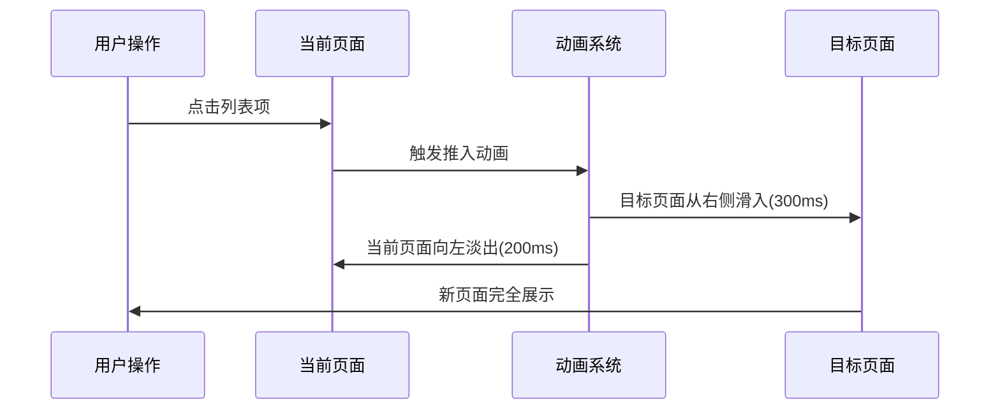

**设计说明**:
- 目标页面从右侧推入，创造向深层探索的感觉
- 当前页面同时向左淡出，增强空间层次感
- 动画时长适中，保证流畅且不拖沓

### 淡入转场

适用于模态对话框、设置页面等弹出式界面。

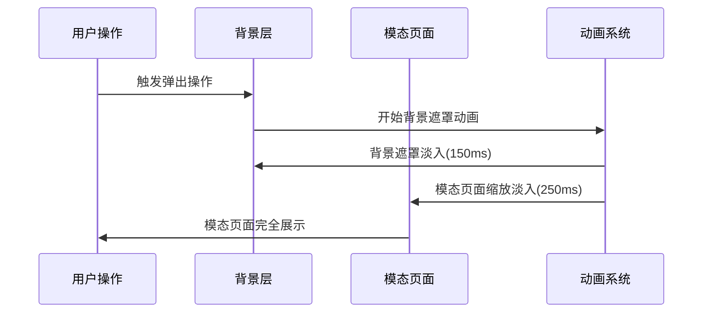

**设计说明**:
- 背景遮罩先淡入，营造模态氛围
- 模态页面使用弹性缩放，创造柔和的弹出效果
- 时长控制得当，避免用户等待焦虑

### 滑动转场

适用于标签页切换、侧边栏导航等场景。

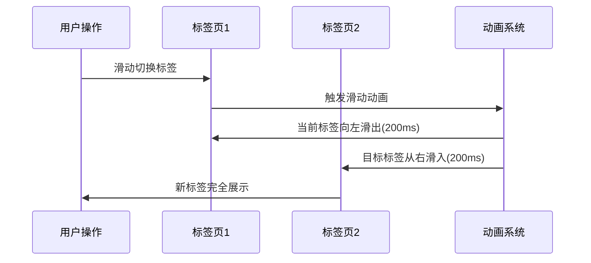

## 组件交互动画

### 按钮点击动画

为用户提供即时的视觉反馈，增强操作的确认感。

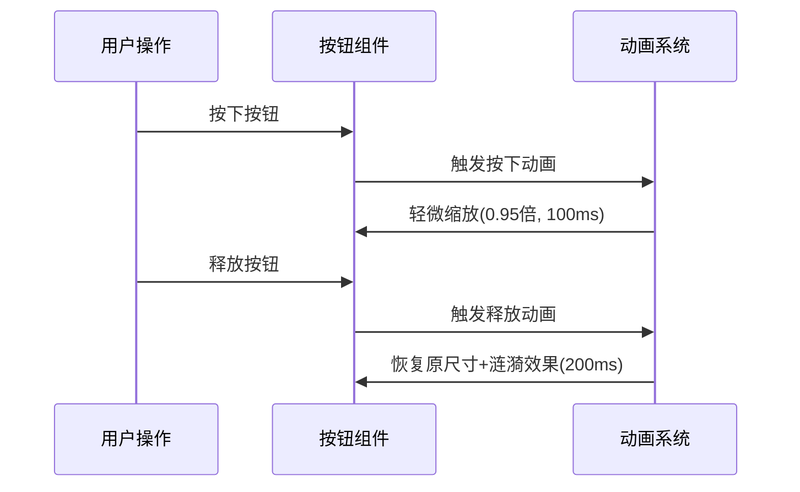

### 卡片悬停动画

在桌面端提供悬停效果，增强交互的可发现性。

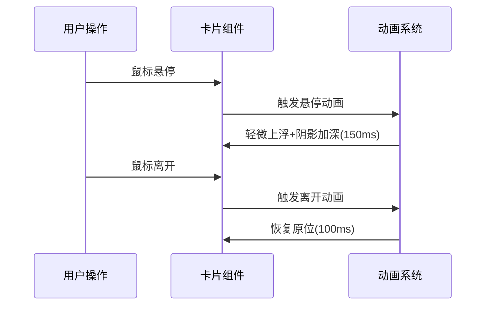

### 展开收起动画

用于可折叠内容区域，提供平滑的空间过渡。

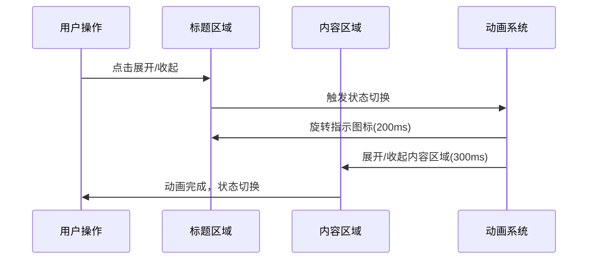

## 加载状态动画

### 进度条动画

用于显示明确的进度信息，如文件上传、图片处理等。

**触发条件**:
- 文件上传开始时显示，上传完成时隐藏
- 图片处理开始时显示，处理完成时隐藏
- 页面资源加载时显示

**动画状态**:
- 初始状态: 进度条宽度0%，透明度0
- 加载中: 进度条根据百分比更新，透明度1
- 完成状态: 进度条到达100%，保持500ms后淡出

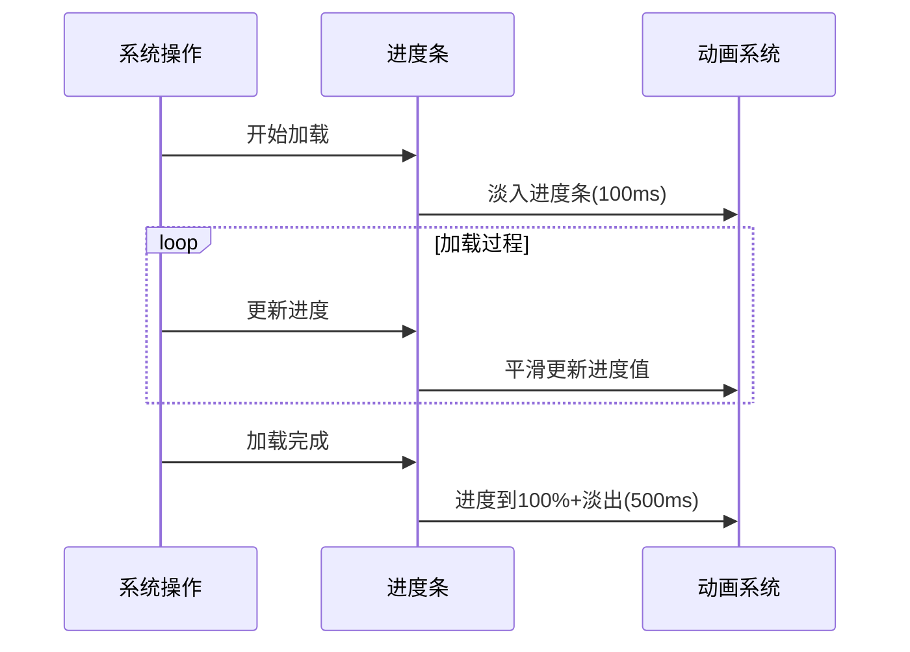

### 骨架屏动画

用于内容加载期间的占位显示，提供更好的加载体验。

**触发条件**:
- 列表数据加载时显示
- 详情页面内容加载时显示
- 网络请求期间显示

**动画状态**:
- 默认状态: 显示骨架屏布局
- 加载中: 骨架屏闪烁效果
- 完成状态: 骨架屏淡出，真实内容淡入

### 数据加载动画

用于表格、图表等数据密集型组件的加载状态。

**触发条件**:
- 数据请求发起时显示
- 数据渲染完成时隐藏
- 请求失败时转换为错误状态

## 反馈动画

### 成功提示动画

用于操作成功后的正面反馈，增强用户成就感。

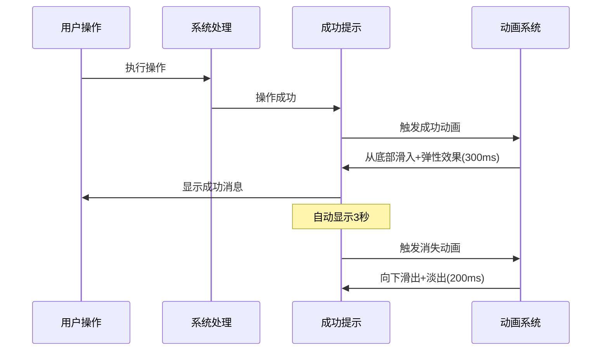

**实现说明**:
- 使用绿色主题色配合勾选图标
- 弹性缓动创造愉悦感
- 自动消失或用户点击关闭

### 错误提示动画

用于操作失败时的错误反馈，引导用户解决问题。

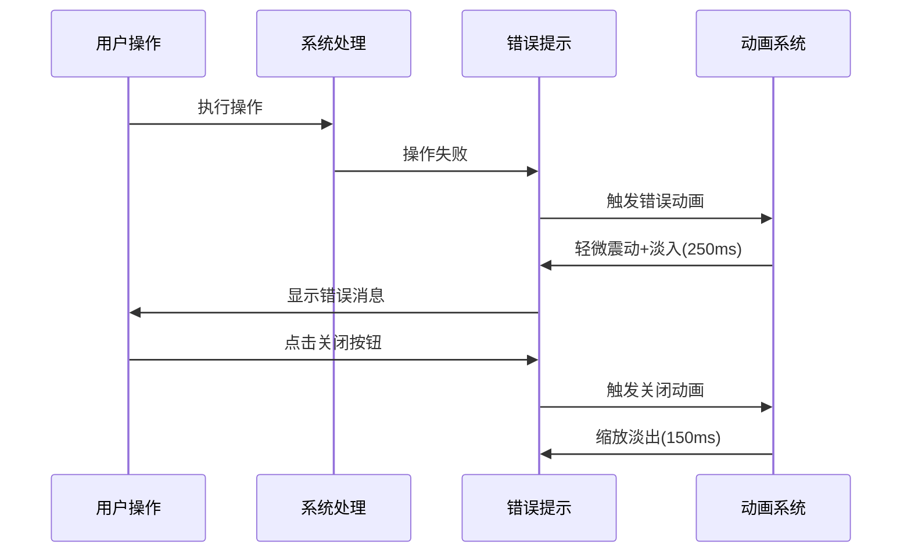

### 操作确认动画

用于删除、重置等危险操作的二次确认。

**触发条件**:
- 用户点击删除按钮
- 用户触发重置操作
- 用户执行不可逆操作

**动画状态**:
- 弹出状态: 从中心缩放淡入，背景模糊
- 确认状态: 按钮状态变化动画
- 关闭状态: 缩放淡出，背景恢复

## 手势动画

### 滑动手势

支持列表项滑动删除、页面切换等交互。

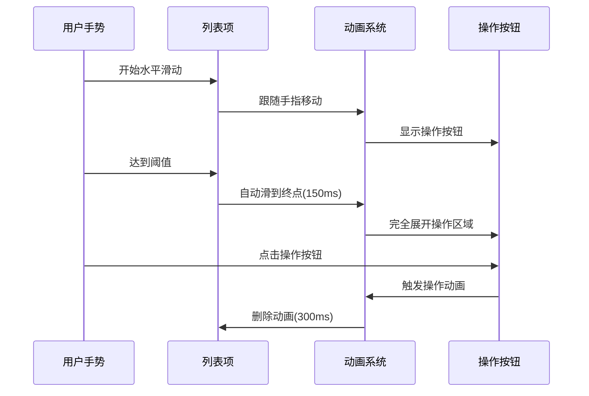

### 缩放手势

用于图片查看器的缩放功能，提供流畅的图片浏览体验。

**触发条件**:
- 用户双击图片
- 用户捏合手势缩放
- 用户双指缩放手势

**动画状态**:
- 双击放大: 从点击位置为中心缩放
- 捏合缩放: 实时跟随手指缩放
- 边界检测: 缩放到边界时的弹性回弹

### 拖拽手势

支持卡片拖拽排序、文件拖拽上传等功能。

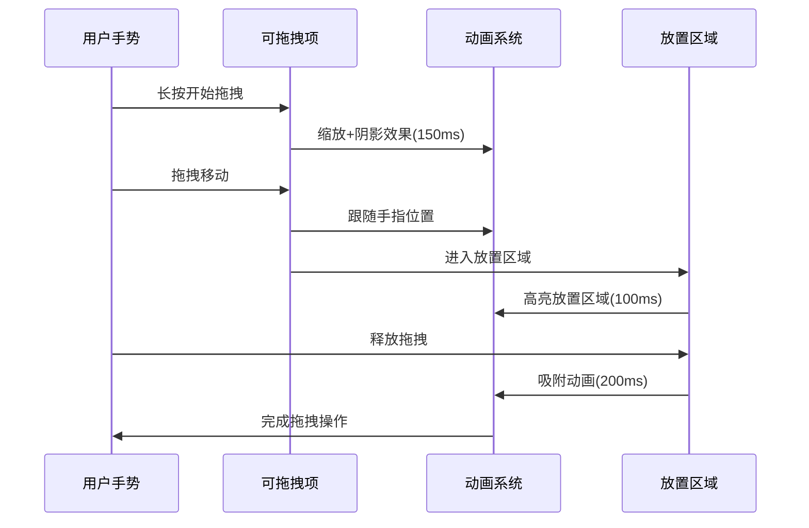

## 动画时长与节奏

### 页面转场动画节奏

| 动画类型 | 适用场景 | 时长 | 节奏特点 | 情感体验 |
|---------|---------|------|----------|----------|
| 推入转场 | 页面导航 | 300ms | 平稳流畅 | 探索感 |
| 淡入转场 | 模态弹出 | 250ms | 柔和缓动 | 轻盈感 |
| 滑动转场 | 标签切换 | 200ms | 快速切换 | 利落感 |
| 返回转场 | 返回操作 | 250ms | 平缓自然 | 回归感 |

### 组件交互动画节奏

| 动画类型 | 适用场景 | 时长 | 节奏特点 | 交互感受 |
|---------|---------|------|----------|----------|
| 按钮按下 | 触摸反馈 | 100ms | 即时响应 | 确认感 |
| 按钮释放 | 释放反馈 | 200ms | 弹性缓动 | 愉悦感 |
| 卡片悬停 | 桌面交互 | 150ms | 平滑过渡 | 生动感 |
| 展开收起 | 内容切换 | 300ms | 渐进展开 | 层次感 |

### 状态反馈动画节奏

| 动画类型 | 适用场景 | 时长 | 节奏特点 | 情感传达 |
|---------|---------|------|----------|----------|
| 成功提示 | 操作成功 | 300ms | 弹性出现 | 成就感 |
| 错误提示 | 操作失败 | 250ms | 震动提醒 | 警示感 |
| 确认对话框 | 危险操作 | 200ms | 庄重缓动 | 严肃感 |
| 加载指示器 | 数据加载 | 1000ms | 循环持续 | 耐心等待 |

### 手势交互动画节奏

| 动画类型 | 适用场景 | 时长 | 节奏特点 | 操作体验 |
|---------|---------|------|----------|----------|
| 滑动删除 | 列表操作 | 150ms | 快速响应 | 果断感 |
| 双击缩放 | 图片查看 | 300ms | 自然缩放 | 沉浸感 |
| 拖拽排序 | 内容整理 | 200ms | 流畅跟随 | 控制感 |
| 手势跟随 | 实时交互 | 实时 | 无延迟 | 同步感 |

## 设备适配策略

### 动画分级设计

根据设备性能将动画体验分为三个级别：

**高端设备 (完整体验)**
- 硬件特征: 处理器强劲、内存充足、显示效果优秀
- 动画策略: 提供完整动画体验，包含所有视觉效果
- 设计重点: 丰富的细节动画、流畅的过渡效果、立体视觉反馈

**中端设备 (标准体验)**
- 硬件特征: 性能适中、满足日常使用
- 动画策略: 使用标准动画效果，确保流畅性
- 设计重点: 核心交互动画、适中的视觉效果、平衡的性能与体验

**低端设备 (流畅体验)**
- 硬件特征: 基础配置、注重基础功能
- 动画策略: 简化动画效果，优先保证响应速度
- 设计重点: 必要的状态反馈、简单的过渡动画、避免复杂效果

### 适配设计原则

**渐进式体验设计**
- 核心交互在所有设备上保持一致
- 视觉效果根据设备能力递减
- 功能体验不受设备等级影响

**优雅降级处理**
- 复杂动画简化为基础动画
- 多层动画合并为单层动画
- 装饰性动画让位于功能性动画

**性能优先考虑**
- 确保基础交互的流畅性
- 在关键路径上避免复杂动画
- 为用户提供关闭动画的选项

## 无障碍设计

### 动画偏好设置

**尊重系统设置**
- 检测系统的"减少动画"设置
- 为有动晕症的用户提供静态选项
- 支持自定义动画速度设置

**可访问性考虑**
- 提供关闭动画的选项
- 确保所有重要信息不依赖动画传递
- 为动画提供替代的文本说明

### 动画可访问性

**视觉反馈**
- 确保动画不会掩盖重要信息
- 提供足够的颜色对比度
- 避免使用仅依赖颜色变化的动画

**操作反馈**
- 为动画提供触觉反馈
- 确保动画不会干扰屏幕阅读器
- 提供键盘导航的动画支持

## 设计检验与测试

### 用户体验验证

**情感体验测试**
- 收集用户对不同动画效果的情感反馈
- 评估动画对用户操作愉悦度的影响
- 确保动画效果符合品牌调性

**易用性检验**
- 测试动画对操作效率的影响
- 验证动画是否干扰用户的操作流程
- 确保动画不会造成视觉混乱或分心

**多场景测试**
- 在不同使用场景下验证动画效果
- 测试动画在各种网络条件下的表现
- 评估长时间使用后的视觉疲劳度

### 设备兼容性验证

**跨设备测试**
- 在不同性能等级的设备上测试动画流畅度
- 验证动画在各种屏幕尺寸上的表现
- 确保动画在不同系统版本上的一致性

**无障碍测试**
- 验证动画对屏幕阅读器的影响
- 测试动画关闭状态下的可用性
- 确保色盲用户能理解动画反馈

## 设计维护与迭代

### 动画设计原则

**一致性维护**
- 确保相同类型交互使用统一的动画效果
- 定期review动画效果与设计规范的符合度
- 维护动画节奏与品牌体验的一致性

**性能监控**
- 持续关注动画在不同设备上的表现
- 根据用户反馈优化动画效果
- 平衡视觉效果与性能要求

### 迭代优化

**用户反馈驱动**
- 建立用户反馈收集机制
- 根据用户需求调整动画细节
- 持续优化动画的用户体验

**技术发展跟进**
- 关注动画设计趋势和最佳实践
- 适时引入新的动画效果和技术
- 保持设计与技术的协调发展