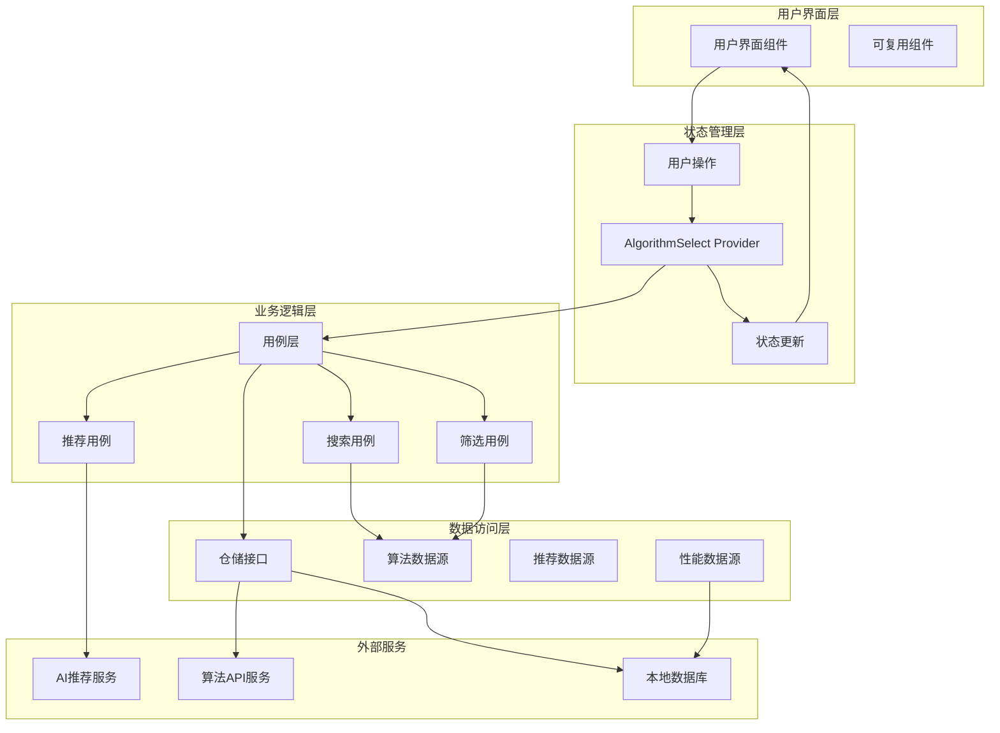

# 算法选择模块设计文档

**文档版本**: v1.0
**最后更新**: 2025-11-22
**关联文档
**: [模块概览](README.md) | [架构设计](../architecture/02-architecture.md) | [设计系统](../design/01-design-system.md)

---

## 📋 模块概述

### 功能定位

算法选择模块是Flutter图像去雾系统的智能核心，负责为用户提供最适合的去雾算法选择和参数配置功能。该模块结合AI智能推荐和用户自定义选择，确保用户能够获得最佳的去雾效果体验。

### 核心价值

- **智能化**: 基于图像特征自动推荐最适合的算法
- **专业性**: 提供详细的算法信息和专业参数配置
- **用户友好**: 简化复杂概念，提供直观的选择界面
- **个性化**: 记忆用户偏好，提供个性化推荐

### 模块边界

| 输入来源 | 处理内容 | 输出结果 | 依赖模块 |
|---------|---------|---------|---------|
| **图像输入模块** | 图像特征分析、算法推荐 | 推荐算法列表 | 去雾处理模块 |
| **用户偏好** | 历史选择分析、偏好学习 | 个性化推荐 | 去雾处理模块 |
| **算法库** | 算法信息查询、参数配置 | 算法详细信息 | 去雾处理模块 |
| **性能数据** | 算法效果评估、速度统计 | 性能对比数据 | 效果对比模块 |

---

## 🏗️ 架构设计

### Clean Architecture分层

```
features/algorithm_select/
├── data/                              # 数据层
│   ├── datasources/                   # 数据源
│   │   ├── algorithm_datasource.dart        # 算法数据源
│   │   ├── recommendation_datasource.dart   # 推荐数据源
│   │   └── performance_datasource.dart      # 性能数据源
│   ├── models/                         # 数据模型
│   │   ├── algorithm_model.dart            # 算法模型
│   │   ├── algorithm_category_model.dart   # 算法分类模型
│   │   ├── recommendation_model.dart       # 推荐结果模型
│   │   └── performance_metrics_model.dart  # 性能指标模型
│   └── repositories/                   # 仓储实现
│       ├── algorithm_repository_impl.dart
│       └── recommendation_repository_impl.dart
├── domain/                            # 领域层
│   ├── entities/                      # 业务实体
│   │   ├── algorithm.dart                    # 算法实体
│   │   ├── algorithm_category.dart           # 算法分类实体
│   │   ├── algorithm_parameter.dart          # 算法参数实体
│   │   ├── recommendation.dart               # 推荐结果实体
│   │   └── performance_metrics.dart          # 性能指标实体
│   ├── repositories/                  # 仓储接口
│   │   ├── algorithm_repository.dart
│   │   └── recommendation_repository.dart
│   └── usecases/                       # 用例
│       ├── get_algorithms_usecase.dart        # 获取算法列表
│       ├── get_algorithm_details_usecase.dart # 获取算法详情
│       ├── recommend_algorithms_usecase.dart  # 推荐算法
│       ├── search_algorithms_usecase.dart     # 搜索算法
│       ├── filter_algorithms_usecase.dart     # 筛选算法
│       └── get_performance_metrics_usecase.dart # 获取性能指标
└── presentation/                      # 表现层
    ├── pages/                         # 页面组件
    │   ├── algorithm_select_page.dart         # 算法选择主页面
    │   ├── algorithm_details_page.dart        # 算法详情页面
    │   ├── algorithm_comparison_page.dart     # 算法对比页面
    │   └── advanced_settings_page.dart        # 高级设置页面
    ├── widgets/                       # 可复用组件
    │   ├── algorithm_card_widget.dart         # 算法卡片组件
    │   ├── recommendation_widget.dart         # 推荐算法组件
    │   ├── filter_panel_widget.dart           # 筛选面板组件
    │   ├── search_bar_widget.dart             # 搜索栏组件
    │   ├── parameter_slider_widget.dart       # 参数滑块组件
    │   └── performance_chart_widget.dart      # 性能图表组件
    └── providers/                      # 状态管理
        ├── algorithm_select_provider.dart      # 算法选择状态管理
        ├── algorithm_details_provider.dart     # 算法详情状态管理
        └── recommendation_provider.dart        # 推荐状态管理
```

### 数据流架构



---

## 🎯 领域模型设计

### 核心实体定义

#### Algorithm 算法实体

```dart
/// 去雾算法实体
class Algorithm {
  final String id;                        // 算法唯一标识
  final String name;                      // 算法名称
  final String nameEn;                    // 英文名称
  final String description;               // 算法描述
  final AlgorithmCategory category;       // 算法分类
  final AlgorithmType type;               // 算法类型
  final List<String> tags;                // 算法标签
  final double rating;                    // 用户评分
  final int reviewCount;                  // 评价数量
  final ProcessingSpeed speed;            // 处理速度
  final QualityLevel quality;             // 效果质量
  final List<HazeLevel> suitableFor;      // 适用的雾霾程度
  final List<SceneType> suitableScenes;   // 适用的场景类型
  final Map<String, AlgorithmParameter> parameters; // 算法参数
  final List<String> sampleImages;        // 样例图片
  final String? paperUrl;                 // 论文链接
  final String? codeUrl;                  // 代码链接
  final DateTime createdAt;               // 创建时间
  final DateTime updatedAt;               // 更新时间
  final bool isAvailable;                 // 是否可用
  final AlgorithmVersion version;         // 算法版本

  const Algorithm({
    required this.id,
    required this.name,
    required this.nameEn,
    required this.description,
    required this.category,
    required this.type,
    required this.tags,
    required this.rating,
    required this.reviewCount,
    required this.speed,
    required this.quality,
    required this.suitableFor,
    required this.suitableScenes,
    required this.parameters,
    required this.sampleImages,
    this.paperUrl,
    this.codeUrl,
    required this.createdAt,
    required this.updatedAt,
    required this.isAvailable,
    required this.version,
  });
}

/// 算法分类
class AlgorithmCategory {
  final String id;                        // 分类ID
  final String name;                      // 分类名称
  final String nameEn;                    // 英文名称
  final String description;               // 分类描述
  final IconData icon;                    // 分类图标
  final Color color;                      // 分类颜色
  final int order;                        // 显示顺序

  const AlgorithmCategory({
    required this.id,
    required this.name,
    required this.nameEn,
    required this.description,
    required this.icon,
    required this.color,
    required this.order,
  });
}

/// 算法参数
class AlgorithmParameter {
  final String id;                        // 参数ID
  final String name;                      // 参数名称
  final String description;               // 参数描述
  final ParameterType type;               // 参数类型
  final dynamic defaultValue;             // 默认值
  final dynamic minValue;                 // 最小值
  final dynamic maxValue;                 // 最大值
  final List<ParameterOption>? options;   // 选项列表（枚举类型）
  final String? unit;                     // 单位
  final bool isRequired;                  // 是否必需
  final bool isAdvanced;                  // 是否高级参数
  final ValidationRule? validationRule;   // 验证规则

  const AlgorithmParameter({
    required this.id,
    required this.name,
    required this.description,
    required this.type,
    required this.defaultValue,
    this.minValue,
    this.maxValue,
    this.options,
    this.unit,
    this.isRequired = false,
    this.isAdvanced = false,
    this.validationRule,
  });
}

/// 枚举类型定义
enum AlgorithmType { traditional, deepLearning, hybrid }
enum ProcessingSpeed { fast, medium, slow }
enum QualityLevel { fair, good, excellent }
enum HazeLevel { light, medium, heavy, extreme }
enum SceneType { landscape, portrait, urban, night, underwater }
enum ParameterType { number, boolean, string, enum, range }
```

#### Recommendation 推荐实体

```dart
/// 算法推荐结果
class Recommendation {
  final String id;                        // 推荐ID
  final InputImage inputImage;            // 输入图像
  final List<RecommendedAlgorithm> algorithms; // 推荐算法列表
  final ImageAnalysisResult analysisResult;   // 图像分析结果
  final RecommendationReason reason;      // 推荐理由
  final double confidence;                // 推荐置信度
  final DateTime createdAt;               // 推荐时间

  const Recommendation({
    required this.id,
    required this.inputImage,
    required this.algorithms,
    required this.analysisResult,
    required this.reason,
    required this.confidence,
    required this.createdAt,
  });
}

/// 推荐算法
class RecommendedAlgorithm {
  final Algorithm algorithm;              // 算法信息
  final double score;                     // 推荐得分
  final List<String> reasons;             // 推荐理由列表
  final EstimatedPerformance estimatedPerformance; // 预估性能
  final Map<String, dynamic> recommendedParameters; // 推荐参数

  const RecommendedAlgorithm({
    required this.algorithm,
    required this.score,
    required this.reasons,
    required this.estimatedPerformance,
    required this.recommendedParameters,
  });
}

/// 图像分析结果
class ImageAnalysisResult {
  final HazeLevel hazeLevel;              // 雾霾程度
  final SceneType sceneType;              // 场景类型
  final double imageQuality;              // 图像质量评分
  final List<String> detectedObjects;     // 检测到的对象
  final Map<String, dynamic> features;    // 图像特征
  final AnalysisConfidence confidence;    // 分析置信度

  const ImageAnalysisResult({
    required this.hazeLevel,
    required this.sceneType,
    required this.imageQuality,
    required this.detectedObjects,
    required this.features,
    required this.confidence,
  });
}
```

### 用例设计

#### RecommendAlgorithmsUseCase 推荐算法用例

```dart
/// 推荐算法用例
class RecommendAlgorithmsUseCase implements UseCase<Recommendation, RecommendParams> {
  final RecommendationRepository repository;
  final ImageAnalyzer imageAnalyzer;
  final UserPreferenceService preferenceService;
  final PerformanceCalculator performanceCalculator;

  RecommendAlgorithmsUseCase({
    required this.repository,
    required this.imageAnalyzer,
    required this.preferenceService,
    required this.performanceCalculator,
  });

  @override
  Future<Recommendation> call(RecommendParams params) async {
    try {
      // 1. 分析图像特征
      final analysisResult = await imageAnalyzer.analyzeImage(
        params.inputImage,
        analysisOptions: params.analysisOptions,
      );

      // 2. 获取可用算法列表
      final availableAlgorithms = await repository.getAvailableAlgorithms();

      // 3. 获取用户偏好
      final userPreferences = await preferenceService.getUserPreferences();

      // 4. 计算推荐得分
      final scoredAlgorithms = await _calculateRecommendationScores(
        availableAlgorithms,
        analysisResult,
        userPreferences,
      );

      // 5. 排序并选择Top推荐
      scoredAlgorithms.sort((a, b) => b.score.compareTo(a.score));
      final topAlgorithms = scoredAlgorithms.take(params.maxRecommendations).toList();

      // 6. 生成推荐理由
      final recommendationReason = _generateRecommendationReason(
        topAlgorithms,
        analysisResult,
      );

      // 7. 预估性能指标
      final algorithmsWithPerformance = await _addPerformanceEstimates(
        topAlgorithms,
        params.inputImage,
      );

      return Recommendation(
        id: const Uuid().v4(),
        inputImage: params.inputImage,
        algorithms: algorithmsWithPerformance,
        analysisResult: analysisResult,
        reason: recommendationReason,
        confidence: _calculateOverallConfidence(algorithmsWithPerformance),
        createdAt: DateTime.now(),
      );
    } catch (e) {
      throw RecommendationException('Failed to generate recommendations: $e');
    }
  }

  /// 计算推荐得分
  Future<List<RecommendedAlgorithm>> _calculateRecommendationScores(
    List<Algorithm> algorithms,
    ImageAnalysisResult analysisResult,
    UserPreferences userPreferences,
  ) async {
    final List<RecommendedAlgorithm> scoredAlgorithms = [];

    for (final algorithm in algorithms) {
      final score = await _calculateScore(
        algorithm,
        analysisResult,
        userPreferences,
      );

      if (score > 0.3) { // 最低推荐阈值
        final reasons = _generateReasons(algorithm, analysisResult, score);
        final estimatedPerformance = await performanceCalculator.estimatePerformance(
          algorithm,
          analysisResult,
        );

        scoredAlgorithms.add(
          RecommendedAlgorithm(
            algorithm: algorithm,
            score: score,
            reasons: reasons,
            estimatedPerformance: estimatedPerformance,
            recommendedParameters: _getRecommendedParameters(
              algorithm,
              analysisResult,
            ),
          ),
        );
      }
    }

    return scoredAlgorithms;
  }

  /// 计算单个算法的推荐得分
  Future<double> _calculateScore(
    Algorithm algorithm,
    ImageAnalysisResult analysisResult,
    UserPreferences userPreferences,
  ) async {
    double score = 0.0;

    // 1. 雾霾程度匹配度 (权重: 30%)
    if (algorithm.suitableFor.contains(analysisResult.hazeLevel)) {
      score += 0.30;
    }

    // 2. 场景类型匹配度 (权重: 20%)
    if (algorithm.suitableScenes.contains(analysisResult.sceneType)) {
      score += 0.20;
    }

    // 3. 算法质量评分 (权重: 15%)
    score += (algorithm.rating / 5.0) * 0.15;

    // 4. 处理速度 (权重: 15%)
    switch (algorithm.speed) {
      case ProcessingSpeed.fast:
        score += 0.15;
      case ProcessingSpeed.medium:
        score += 0.10;
      case ProcessingSpeed.slow:
        score += 0.05;
    }

    // 5. 用户偏好匹配 (权重: 20%)
    if (userPreferences.favoriteAlgorithms.contains(algorithm.id)) {
      score += 0.20;
    } else if (userPreferences.preferredTypes.contains(algorithm.type)) {
      score += 0.10;
    }

    return score.clamp(0.0, 1.0);
  }
}

/// 推荐参数
class RecommendParams {
  final InputImage inputImage;            // 输入图像
  final int maxRecommendations;           // 最大推荐数量
  final AnalysisOptions? analysisOptions; // 分析选项
  final bool includeBetaAlgorithms;       // 是否包含Beta算法

  const RecommendParams({
    required this.inputImage,
    this.maxRecommendations = 3,
    this.analysisOptions,
    this.includeBetaAlgorithms = false,
  });
}
```

---

## 🎨 界面设计

### 页面布局结构

#### 主页面设计

```
┌─────────────────────────────────────────────────────────────┐
│  算法选择                                    [设置] [帮助]    │
├─────────────────────────────────────────────────────────────┤
│                                                             │
│  🎯 智能推荐 (基于您的图像特征)                                 │
│                                                             │
│  ┌─────────────────────────────────────────────────────────┐ │
│  │ ⭐ 推荐算法1                    ⭐⭐⭐⭐⭐  快速  优秀    │ │
│  │ AOD-Net算法非常适合轻度雾霾，处理速度快，效果质量优秀        │ │
│  │ [立即使用] [查看详情] [添加到收藏]                         │ │
│  └─────────────────────────────────────────────────────────┘ │
│                                                             │
│  ┌─────────────────────────────────────────────────────────┐ │
│  │ ⭐ 推荐算法2                    ⭐⭐⭐⭐   中速  良好     │ │
│  │ DCP算法适合中度雾霾，基于物理模型，效果稳定可靠            │ │
│  │ [立即使用] [查看详情] [添加到收藏]                         │ │
│  └─────────────────────────────────────────────────────────┘ │
│                                                             │
│  🔍 搜索和筛选                                               │
│                                                             │
│  ┌─────────────────────────────────────────────────────────┐ │
│  │ 🔍 搜索算法...                              [高级筛选]    │ │
│  └─────────────────────────────────────────────────────────┘ │
│                                                             │
│  📋 算法分类                                                 │
│                                                             │
│  ┌─────────────┬─────────────┬─────────────┬─────────────┐ │
│  │ 🧠 深度学习  │ 🔬 传统算法  │ ⚡ 混合算法  │ ⭐ 收藏算法  │ │
│  │ 12个算法     │ 8个算法      │ 3个算法      │ 5个算法     │ │
│  └─────────────┴─────────────┴─────────────┴─────────────┘ │
│                                                             │
│  📊 算法列表 (显示24个算法)                                    │
│                                                             │
│  ┌─────────────────────────────────────────────────────────┐ │
│  │ [算法卡片1] [算法卡片2] [算法卡片3] [算法卡片4]            │ │
│  │ [算法卡片5] [算法卡片6] [算法卡片7] [算法卡片8]            │ │
│  │ [算法卡片9] [算法卡片10] [算法卡片11] [算法卡片12]         │ │
│  │ ... 更多算法                                             │ │
│  └─────────────────────────────────────────────────────────┘ │
│                                                             │
└─────────────────────────────────────────────────────────────┘
```

### 响应式适配

| 屏幕尺寸 | 布局特点 | 组件排列 | 交互优化 |
|---------|---------|---------|---------|
| **Mobile** < 768px | 单列垂直布局 | 推荐(1) -> 搜索 -> 分类 -> 列表(2列) | 卡片式设计，滑动浏览 |
| **Tablet** 768-1024px | 双列布局 | 推荐(2) -> 侧边分类 -> 列表(3列) | 支持拖拽排序 |
| **Desktop** > 1024px | 三列布局 | 推荐(3) -> 侧边栏 -> 主列表(4列) | 键盘快捷键支持 |

### 组件设计规范

#### 算法卡片组件

```dart
/// 算法卡片组件
class AlgorithmCardWidget extends StatelessWidget {
  final Algorithm algorithm;
  final double? recommendationScore;
  final List<String> highlights;
  final VoidCallback onSelect;
  final VoidCallback onDetails;
  final VoidCallback onFavorite;
  final bool isFavorite;

  const AlgorithmCardWidget({
    required this.algorithm,
    this.recommendationScore,
    this.highlights = const [],
    required this.onSelect,
    required this.onDetails,
    required this.onFavorite,
    this.isFavorite = false,
  });

  @override
  Widget build(BuildContext context) {
    return Card(
      elevation: 2,
      clipBehavior: Clip.antiAlias,
      child: InkWell(
        onTap: onSelect,
        child: Column(
          crossAxisAlignment: CrossAxisAlignment.start,
          children: [
            // 头部区域
            _buildHeader(context),
            // 评分和信息区域
            _buildRatingInfo(context),
            // 描述区域
            _buildDescription(context),
            // 操作按钮区域
            _buildActions(context),
          ],
        ),
      ),
    );
  }

  Widget _buildHeader(BuildContext context) {
    return Container(
      padding: EdgeInsets.all(16),
      decoration: BoxDecoration(
        gradient: LinearGradient(
          colors: [
            algorithm.category.color.withOpacity(0.1),
            algorithm.category.color.withOpacity(0.05),
          ],
          begin: Alignment.topLeft,
          end: Alignment.bottomRight,
        ),
      ),
      child: Row(
        children: [
          // 分类图标
          Container(
            width: 48,
            height: 48,
            decoration: BoxDecoration(
              color: algorithm.category.color.withOpacity(0.2),
              borderRadius: BorderRadius.circular(12),
            ),
            child: Icon(
              algorithm.category.icon,
              size: 24,
              color: algorithm.category.color,
            ),
          ),
          SizedBox(width: 12),
          // 算法信息
          Expanded(
            child: Column(
              crossAxisAlignment: CrossAxisAlignment.start,
              children: [
                Text(
                  algorithm.name,
                  style: Theme.of(context).textTheme.titleMedium?.copyWith(
                    fontWeight: FontWeight.bold,
                  ),
                ),
                SizedBox(height: 4),
                Text(
                  algorithm.nameEn,
                  style: Theme.of(context).textTheme.bodySmall?.copyWith(
                    color: Colors.grey[600],
                  ),
                ),
              ],
            ),
          ),
          // 推荐得分
          if (recommendationScore != null)
            Container(
              padding: EdgeInsets.symmetric(horizontal: 8, vertical: 4),
              decoration: BoxDecoration(
                color: Colors.orange.withOpacity(0.1),
                borderRadius: BorderRadius.circular(12),
                border: Border.all(color: Colors.orange.withOpacity(0.3)),
              ),
              child: Text(
                '${(recommendationScore! * 100).toInt()}%匹配',
                style: TextStyle(
                  fontSize: 12,
                  fontWeight: FontWeight.bold,
                  color: Colors.orange[700],
                ),
              ),
            ),
        ],
      ),
    );
  }

  Widget _buildRatingInfo(BuildContext context) {
    return Padding(
      padding: EdgeInsets.all(16),
      child: Row(
        children: [
          // 评分
          Row(
            children: [
              Icon(
                Icons.star,
                size: 16,
                color: Colors.amber,
              ),
              SizedBox(width: 4),
              Text(
                algorithm.rating.toStringAsFixed(1),
                style: Theme.of(context).textTheme.bodyMedium?.copyWith(
                  fontWeight: FontWeight.bold,
                ),
              ),
              Text(
                ' (${algorithm.reviewCount})',
                style: Theme.of(context).textTheme.bodySmall?.copyWith(
                  color: Colors.grey[600],
                ),
              ),
            ],
          ),
          SizedBox(width: 16),
          // 处理速度
          _buildSpeedIndicator(context),
          Spacer(),
          // 收藏按钮
          IconButton(
            onPressed: onFavorite,
            icon: Icon(
              isFavorite ? Icons.favorite : Icons.favorite_border,
              color: isFavorite ? Colors.red : Colors.grey,
            ),
            tooltip: '收藏',
          ),
        ],
      ),
    );
  }

  Widget _buildSpeedIndicator(BuildContext context) {
    final (icon, color, text) = switch (algorithm.speed) {
      ProcessingSpeed.fast => (Icons.bolt, Colors.green, '快速'),
      ProcessingSpeed.medium => (Icons.hourglass_empty, Colors.orange, '中速'),
      ProcessingSpeed.slow => (Icons.hourglass_full, Colors.red, '慢速'),
    };

    return Row(
      children: [
        Icon(icon, size: 16, color: color),
        SizedBox(width: 4),
        Text(
          text,
          style: Theme.of(context).textTheme.bodySmall?.copyWith(
            color: color,
            fontWeight: FontWeight.bold,
          ),
        ),
      ],
    );
  }
}
```

#### 推荐算法组件

```dart
/// 推荐算法组件
class RecommendationWidget extends StatelessWidget {
  final Recommendation recommendation;
  final Function(Algorithm) onSelectAlgorithm;
  final Function(Algorithm) onViewDetails;

  const RecommendationWidget({
    required this.recommendation,
    required this.onSelectAlgorithm,
    required this.onViewDetails,
  });

  @override
  Widget build(BuildContext context) {
    return Container(
      margin: EdgeInsets.only(bottom: 24),
      child: Column(
        crossAxisAlignment: CrossAxisAlignment.start,
        children: [
          // 推荐标题
          _buildRecommendationHeader(context),
          SizedBox(height: 16),
          // 推荐算法列表
          ...recommendation.algorithms.asMap().entries.map((entry) {
            final index = entry.key;
            final recommendedAlgorithm = entry.value;
            return Padding(
              padding: EdgeInsets.only(bottom: 16),
              child: _buildRecommendedAlgorithmCard(
                context,
                recommendedAlgorithm,
                index + 1,
              ),
            );
          }),
        ],
      ),
    );
  }

  Widget _buildRecommendationHeader(BuildContext context) {
    return Container(
      padding: EdgeInsets.all(16),
      decoration: BoxDecoration(
        color: Theme.of(context).primaryColor.withOpacity(0.1),
        borderRadius: BorderRadius.circular(12),
        border: Border.all(
          color: Theme.of(context).primaryColor.withOpacity(0.3),
        ),
      ),
      child: Row(
        children: [
          Icon(
            Icons.psychology,
            color: Theme.of(context).primaryColor,
            size: 24,
          ),
          SizedBox(width: 12),
          Expanded(
            child: Column(
              crossAxisAlignment: CrossAxisAlignment.start,
              children: [
                Text(
                  '🎯 智能推荐算法',
                  style: Theme.of(context).textTheme.titleMedium?.copyWith(
                    fontWeight: FontWeight.bold,
                    color: Theme.of(context).primaryColor,
                  ),
                ),
                SizedBox(height: 4),
                Text(
                  '基于您的图像特征，为您推荐最适合的去雾算法',
                  style: Theme.of(context).textTheme.bodySmall,
                ),
              ],
            ),
          ),
          Container(
            padding: EdgeInsets.symmetric(horizontal: 8, vertical: 4),
            decoration: BoxDecoration(
              color: Colors.green,
              borderRadius: BorderRadius.circular(12),
            ),
            child: Text(
              '${(recommendation.confidence * 100).toInt()}%置信度',
              style: TextStyle(
                fontSize: 12,
                color: Colors.white,
                fontWeight: FontWeight.bold,
              ),
            ),
          ),
        ],
      ),
    );
  }

  Widget _buildRecommendedAlgorithmCard(
    BuildContext context,
    RecommendedAlgorithm recommendedAlgorithm,
    int rank,
  ) {
    final algorithm = recommendedAlgorithm.algorithm;

    return Card(
      elevation: 4,
      child: Padding(
        padding: EdgeInsets.all(16),
        child: Column(
          crossAxisAlignment: CrossAxisAlignment.start,
          children: [
            // 排名和基本信息
            Row(
              children: [
                Container(
                  width: 32,
                  height: 32,
                  decoration: BoxDecoration(
                    color: _getRankColor(rank),
                    borderRadius: BorderRadius.circular(8),
                  ),
                  child: Center(
                    child: Text(
                      '$rank',
                      style: TextStyle(
                        color: Colors.white,
                        fontWeight: FontWeight.bold,
                        fontSize: 16,
                      ),
                    ),
                  ),
                ),
                SizedBox(width: 12),
                Expanded(
                  child: Column(
                    crossAxisAlignment: CrossAxisAlignment.start,
                    children: [
                      Text(
                        algorithm.name,
                        style: Theme.of(context).textTheme.titleMedium?.copyWith(
                          fontWeight: FontWeight.bold,
                        ),
                      ),
                      SizedBox(height: 4),
                      Text(
                        algorithm.description,
                        style: Theme.of(context).textTheme.bodySmall,
                        maxLines: 2,
                        overflow: TextOverflow.ellipsis,
                      ),
                    ],
                  ),
                ),
              ],
            ),
            SizedBox(height: 12),
            // 推荐理由
            ...recommendedAlgorithm.reasons.map((reason) => Padding(
              padding: EdgeInsets.only(bottom: 4, left: 8),
              child: Row(
                children: [
                  Icon(
                    Icons.check_circle,
                    size: 16,
                    color: Colors.green,
                  ),
                  SizedBox(width: 8),
                  Expanded(
                    child: Text(
                      reason,
                      style: Theme.of(context).textTheme.bodySmall,
                    ),
                  ),
                ],
              ),
            )),
            SizedBox(height: 12),
            // 操作按钮
            Row(
              children: [
                Expanded(
                  child: ElevatedButton(
                    onPressed: () => onSelectAlgorithm(algorithm),
                    style: ElevatedButton.styleFrom(
                      backgroundColor: Theme.of(context).primaryColor,
                      foregroundColor: Colors.white,
                    ),
                    child: Text('立即使用'),
                  ),
                ),
                SizedBox(width: 12),
                OutlinedButton(
                  onPressed: () => onViewDetails(algorithm),
                  child: Text('查看详情'),
                ),
                SizedBox(width: 12),
                IconButton(
                  onPressed: () {
                    // 添加到收藏
                  },
                  icon: Icon(Icons.favorite_border),
                  tooltip: '添加到收藏',
                ),
              ],
            ),
          ],
        ),
      ),
    );
  }

  Color _getRankColor(int rank) {
    switch (rank) {
      case 1:
        return Colors.gold;
      case 2:
        return Colors.grey;
      case 3:
        return Colors.brown;
      default:
        return Colors.blue;
    }
  }
}
```

---

## 🔄 状态管理

### Riverpod状态设计

```dart
/// 算法选择状态
@freezed
class AlgorithmSelectState with _$AlgorithmSelectState {
  const factory AlgorithmSelectState.initial() = _AlgorithmSelectInitial;
  const factory AlgorithmSelectState.loading(String message) = _AlgorithmSelectLoading;
  const factory AlgorithmSelectState.algorithmsLoaded({
    required List<Algorithm> algorithms,
    required List<AlgorithmCategory> categories,
    required AlgorithmFilters filters,
  }) = _AlgorithmsLoaded;
  const factory AlgorithmSelectState.recommendationsLoaded({
    required Recommendation recommendation,
    required List<Algorithm> allAlgorithms,
  }) = _RecommendationsLoaded;
  const factory AlgorithmSelectState.algorithmDetailsLoaded({
    required Algorithm algorithm,
    AlgorithmPerformance? performance,
  }) = _AlgorithmDetailsLoaded;
  const factory AlgorithmSelectState.algorithmSelected({
    required Algorithm algorithm,
    required Map<String, dynamic> parameters,
  }) = _AlgorithmSelected;
  const factory AlgorithmSelectState.error({
    required String message,
    required AlgorithmSelectErrorType errorType,
    VoidCallback? onRetry,
  }) = _AlgorithmSelectError;
}

/// 错误类型枚举
enum AlgorithmSelectErrorType {
  networkError,        // 网络错误
  apiError,           // API错误
  algorithmNotFound,  // 算法未找到
  recommendationFailed, // 推荐失败
  unknownError,       // 未知错误
}

/// 算法选择状态Provider
final algorithmSelectProvider = StateNotifierProvider<AlgorithmSelectNotifier, AlgorithmSelectState>((ref) {
  return AlgorithmSelectNotifier(
    ref.read(algorithmRepositoryProvider),
    ref.read(recommendationRepositoryProvider),
  );
});

/// 算法选择状态管理器
class AlgorithmSelectNotifier extends StateNotifier<AlgorithmSelectState> {
  final AlgorithmRepository _algorithmRepository;
  final RecommendationRepository _recommendationRepository;

  AlgorithmSelectNotifier(
    this._algorithmRepository,
    this._recommendationRepository,
  ) : super(const AlgorithmSelectState.initial());

  /// 加载算法列表
  Future<void> loadAlgorithms({bool forceRefresh = false}) async {
    state = const AlgorithmSelectState.loading('正在加载算法...');
    try {
      final algorithms = await _algorithmRepository.getAvailableAlgorithms();
      final categories = await _algorithmRepository.getAlgorithmCategories();

      state = AlgorithmSelectState.algorithmsLoaded(
        algorithms: algorithms,
        categories: categories,
        filters: const AlgorithmFilters(),
      );
    } catch (e) {
      state = AlgorithmSelectState.error(
        message: '加载算法失败: ${e.toString()}',
        errorType: _getErrorType(e),
        onRetry: () => loadAlgorithms(forceRefresh: forceRefresh),
      );
    }
  }

  /// 生成推荐算法
  Future<void> generateRecommendations(InputImage inputImage) async {
    state = const AlgorithmSelectState.loading('正在生成推荐...');
    try {
      final recommendation = await _recommendationRepository.generateRecommendation(
        inputImage: inputImage,
      );

      final allAlgorithms = await _algorithmRepository.getAvailableAlgorithms();

      state = AlgorithmSelectState.recommendationsLoaded(
        recommendation: recommendation,
        allAlgorithms: allAlgorithms,
      );
    } catch (e) {
      state = AlgorithmSelectState.error(
        message: '生成推荐失败: ${e.toString()}',
        errorType: _getErrorType(e),
        onRetry: () => generateRecommendations(inputImage),
      );
    }
  }

  /// 选择算法
  void selectAlgorithm(Algorithm algorithm, Map<String, dynamic> parameters) {
    state = AlgorithmSelectState.algorithmSelected(
      algorithm: algorithm,
      parameters: parameters,
    );
  }

  /// 应用筛选
  void applyFilters(AlgorithmFilters filters) {
    final currentState = state;
    if (currentState is _AlgorithmsLoaded) {
      state = AlgorithmSelectState.algorithmsLoaded(
        algorithms: currentState.algorithms,
        categories: currentState.categories,
        filters: filters,
      );
    }
  }

  AlgorithmSelectErrorType _getErrorType(dynamic error) {
    if (error is NetworkException) {
      return AlgorithmSelectErrorType.networkError;
    } else if (error is ApiException) {
      return AlgorithmSelectErrorType.apiError;
    } else if (error is AlgorithmNotFoundException) {
      return AlgorithmSelectErrorType.algorithmNotFound;
    } else if (error is RecommendationException) {
      return AlgorithmSelectErrorType.recommendationFailed;
    } else {
      return AlgorithmSelectErrorType.unknownError;
    }
  }
}

/// 算法详情Provider
final algorithmDetailsProvider = FutureProvider.family<Algorithm, String>((ref, algorithmId) async {
  return ref.read(algorithmRepositoryProvider).getAlgorithmById(algorithmId);
});

/// 推荐算法Provider
final recommendationProvider = FutureProvider.family<Recommendation, InputImage>((ref, inputImage) async {
  return ref.read(recommendationRepositoryProvider).generateRecommendation(
    inputImage: inputImage,
  );
});
```

### Provider依赖管理

```dart
/// 算法仓储Provider
final algorithmRepositoryProvider = Provider<AlgorithmRepository>((ref) {
  return AlgorithmRepositoryImpl(
    ref.read(algorithmDatasourceProvider),
    ref.read(performanceDatasourceProvider),
  );
});

/// 推荐仓储Provider
final recommendationRepositoryProvider = Provider<RecommendationRepository>((ref) {
  return RecommendationRepositoryImpl(
    ref.read(recommendationDatasourceProvider),
  );
});

/// 搜索算法Provider
final searchResultsProvider = FutureProvider.family<List<Algorithm>, String>((ref, query) async {
  return ref.read(algorithmRepositoryProvider).searchAlgorithms(query: query);
});
```

---

## 🔧 技术实现

### 核心服务接口

#### AlgorithmRepository 算法仓储接口

```dart
/// 算法仓储接口
abstract class AlgorithmRepository {
  /// 获取所有可用算法
  Future<List<Algorithm>> getAvailableAlgorithms({
    bool includeBeta = false,
    AlgorithmCategory? category,
    AlgorithmType? type,
  });

  /// 获取算法详情
  Future<Algorithm?> getAlgorithmById(String id);

  /// 搜索算法
  Future<List<Algorithm>> searchAlgorithms({
    required String query,
    List<String>? tags,
    AlgorithmFilters? filters,
    int limit = 20,
    int offset = 0,
  });

  /// 获取算法分类
  Future<List<AlgorithmCategory>> getAlgorithmCategories();

  /// 获取算法性能指标
  Future<AlgorithmPerformance?> getAlgorithmPerformance(String algorithmId);

  /// 获取用户收藏的算法
  Future<List<Algorithm>> getFavoriteAlgorithms();

  /// 添加/移除收藏
  Future<void> toggleFavoriteAlgorithm(String algorithmId);

  /// 获取算法使用统计
  Future<List<AlgorithmUsageStats>> getAlgorithmUsageStats({
    DateTimeRange? dateRange,
  });

  /// 获取算法更新日志
  Future<List<AlgorithmUpdateLog>> getAlgorithmUpdateLog(String algorithmId);

  /// 上报算法使用情况
  Future<void> reportAlgorithmUsage({
    required String algorithmId,
    required Map<String, dynamic> parameters,
    required ProcessingResult result,
  });
}

/// 算法筛选条件
class AlgorithmFilters {
  final Set<AlgorithmType>? types;           // 算法类型
  final Set<ProcessingSpeed>? speeds;        // 处理速度
  final Set<QualityLevel>? qualities;        // 效果质量
  final Set<HazeLevel>? hazeLevels;          // 雾霾程度
  final Set<SceneType>? sceneTypes;          // 场景类型
  final RangeValues? ratingRange;           // 评分范围
  final bool? includeBeta;                  // 是否包含Beta版本
  final List<String>? tags;                 // 标签筛选

  const AlgorithmFilters({
    this.types,
    this.speeds,
    this.qualities,
    this.hazeLevels,
    this.sceneTypes,
    this.ratingRange,
    this.includeBeta,
    this.tags,
  });

  AlgorithmFilters copyWith({
    Set<AlgorithmType>? types,
    Set<ProcessingSpeed>? speeds,
    Set<QualityLevel>? qualities,
    Set<HazeLevel>? hazeLevels,
    Set<SceneType>? sceneTypes,
    RangeValues? ratingRange,
    bool? includeBeta,
    List<String>? tags,
  }) {
    return AlgorithmFilters(
      types: types ?? this.types,
      speeds: speeds ?? this.speeds,
      qualities: qualities ?? this.qualities,
      hazeLevels: hazeLevels ?? this.hazeLevels,
      sceneTypes: sceneTypes ?? this.sceneTypes,
      ratingRange: ratingRange ?? this.ratingRange,
      includeBeta: includeBeta ?? this.includeBeta,
      tags: tags ?? this.tags,
    );
  }
}
```

#### RecommendationRepository 推荐仓储接口

```dart
/// 推荐仓储接口
abstract class RecommendationRepository {
  /// 生成算法推荐
  Future<Recommendation> generateRecommendation({
    required InputImage inputImage,
    RecommendParams? params,
  });

  /// 获取推荐历史
  Future<List<Recommendation>> getRecommendationHistory({
    int limit = 10,
    int offset = 0,
  });

  /// 获取推荐解释
  Future<RecommendationExplanation> getRecommendationExplanation({
    required String recommendationId,
  });

  /// 反馈推荐质量
  Future<void> feedbackRecommendation({
    required String recommendationId,
    required bool isHelpful,
    String? feedback,
  });

  /// 获取推荐模型信息
  Future<RecommendationModelInfo> getRecommendationModelInfo();
}

/// 推荐参数
class RecommendParams {
  final int maxRecommendations;           // 最大推荐数量
  final AnalysisOptions? analysisOptions; // 图像分析选项
  final bool includeBetaAlgorithms;       // 是否包含Beta算法
  final bool considerUserPreference;      // 是否考虑用户偏好
  final Set<String>? excludedAlgorithms;  // 排除的算法

  const RecommendParams({
    this.maxRecommendations = 3,
    this.analysisOptions,
    this.includeBetaAlgorithms = false,
    this.considerUserPreference = true,
    this.excludedAlgorithms,
  });
}

/// 图像分析选项
class AnalysisOptions {
  final bool enableHazeDetection;         // 启用雾霾检测
  final bool enableSceneClassification;   // 启用场景分类
  final bool enableQualityAssessment;     // 启用质量评估
  final bool enableObjectDetection;       // 启用对象检测
  final AnalysisLevel analysisLevel;     // 分析深度

  const AnalysisOptions({
    this.enableHazeDetection = true,
    this.enableSceneClassification = true,
    this.enableQualityAssessment = true,
    this.enableObjectDetection = false,
    this.analysisLevel = AnalysisLevel.standard,
  });
}

enum AnalysisLevel { basic, standard, advanced }
```

### 性能优化策略

#### 智能缓存策略

```dart
/// 算法缓存管理器
class AlgorithmCacheManager {
  static const String _algorithmsCacheKey = 'algorithms_cache';
  static const String _categoriesCacheKey = 'categories_cache';
  static const Duration _cacheExpiry = Duration(hours: 6);

  final CacheService _cacheService;
  final NetworkService _networkService;

  AlgorithmCacheManager({
    required CacheService cacheService,
    required NetworkService networkService,
  }) : _cacheService = cacheService,
       _networkService = networkService;

  /// 获取算法列表（带缓存）
  Future<List<Algorithm>> getAlgorithms({
    bool forceRefresh = false,
    AlgorithmFilters? filters,
  }) async {
    final cacheKey = _generateCacheKey(filters);

    // 尝试从缓存获取
    if (!forceRefresh) {
      final cached = await _cacheService.get<List<Algorithm>>(cacheKey);
      if (cached != null) {
        return cached;
      }
    }

    // 从网络获取
    final algorithms = await _networkService.fetchAlgorithms(filters: filters);

    // 缓存结果
    await _cacheService.set(cacheKey, algorithms, expiry: _cacheExpiry);

    return algorithms;
  }

  /// 预加载热门算法
  Future<void> preloadPopularAlgorithms() async {
    final popularFilters = AlgorithmFilters(
      ratingRange: RangeValues(4.0, 5.0),
      includeBeta: false,
    );

    await getAlgorithms(filters: popularFilters);
  }

  String _generateCacheKey(AlgorithmFilters? filters) {
    if (filters == null) return _algorithmsCacheKey;

    final keyParts = <String>[_algorithmsCacheKey];

    if (filters.types?.isNotEmpty == true) {
      keyParts.add('types:${filters.types!.map((t) => t.name).join(',')}');
    }
    if (filters.speeds?.isNotEmpty == true) {
      keyParts.add('speeds:${filters.speeds!.map((s) => s.name).join(',')}');
    }
    if (filters.qualities?.isNotEmpty == true) {
      keyParts.add('qualities:${filters.qualities!.map((q) => q.name).join(',')}');
    }

    return keyParts.join('_');
  }
}
```

#### 搜索优化

```dart
/// 算法搜索引擎
class AlgorithmSearchEngine {
  final Map<String, Algorithm> _algorithmIndex;
  final Map<String, List<String>> _tagIndex;
  final Map<String, List<String>> _keywordIndex;

  AlgorithmSearchEngine()
      : _algorithmIndex = {},
        _tagIndex = {},
        _keywordIndex = {};

  /// 构建搜索索引
  void buildIndex(List<Algorithm> algorithms) {
    _algorithmIndex.clear();
    _tagIndex.clear();
    _keywordIndex.clear();

    for (final algorithm in algorithms) {
      _algorithmIndex[algorithm.id] = algorithm;

      // 构建标签索引
      for (final tag in algorithm.tags) {
        _tagIndex.putIfAbsent(tag.toLowerCase(), () => [])
            .add(algorithm.id);
      }

      // 构建关键词索引
      final keywords = _extractKeywords(algorithm);
      for (final keyword in keywords) {
        _keywordIndex.putIfAbsent(keyword, () => [])
            .add(algorithm.id);
      }
    }
  }

  /// 搜索算法
  Future<List<Algorithm>> search({
    required String query,
    AlgorithmFilters? filters,
    int limit = 20,
    int offset = 0,
  }) async {
    final normalizedQuery = query.toLowerCase().trim();
    final matchedAlgorithmIds = <String>{};

    // 1. 精确匹配ID
    if (_algorithmIndex.containsKey(normalizedQuery)) {
      matchedAlgorithmIds.add(normalizedQuery);
    }

    // 2. 名称匹配
    for (final entry in _algorithmIndex.entries) {
      if (entry.value.name.toLowerCase().contains(normalizedQuery) ||
          entry.value.nameEn.toLowerCase().contains(normalizedQuery)) {
        matchedAlgorithmIds.add(entry.key);
      }
    }

    // 3. 关键词匹配
    final keywordMatches = _keywordIndex[normalizedQuery] ?? [];
    matchedAlgorithmIds.addAll(keywordMatches);

    // 4. 标签匹配
    final tagMatches = _tagIndex[normalizedQuery] ?? [];
    matchedAlgorithmIds.addAll(tagMatches);

    // 转换为算法对象
    final matchedAlgorithms = matchedAlgorithmIds
        .map((id) => _algorithmIndex[id])
        .where((algorithm) => algorithm != null)
        .cast<Algorithm>()
        .toList();

    // 应用筛选
    final filteredAlgorithms = _applyFilters(matchedAlgorithms, filters);

    // 排序（按相关性和评分）
    final sortedAlgorithms = _sortAlgorithms(filteredAlgorithms, normalizedQuery);

    // 分页
    return sortedAlgorithms.skip(offset).take(limit).toList();
  }

  List<String> _extractKeywords(Algorithm algorithm) {
    final keywords = <String>{};

    // 从名称提取
    keywords.addAll(algorithm.name.toLowerCase().split(' '));
    keywords.addAll(algorithm.nameEn.toLowerCase().split(' '));

    // 从描述提取
    final descWords = algorithm.description
        .toLowerCase()
        .replaceAll(RegExp(r'[^\w\s]'), '')
        .split(' ')
        .where((word) => word.length > 2);
    keywords.addAll(descWords);

    return keywords.toList();
  }

  List<Algorithm> _applyFilters(
    List<Algorithm> algorithms,
    AlgorithmFilters? filters,
  ) {
    if (filters == null) return algorithms;

    return algorithms.where((algorithm) {
      // 类型筛选
      if (filters.types?.isNotEmpty == true &&
          !filters.types!.contains(algorithm.type)) {
        return false;
      }

      // 速度筛选
      if (filters.speeds?.isNotEmpty == true &&
          !filters.speeds!.contains(algorithm.speed)) {
        return false;
      }

      // 质量筛选
      if (filters.qualities?.isNotEmpty == true &&
          !filters.qualities!.contains(algorithm.quality)) {
        return false;
      }

      // 评分筛选
      if (filters.ratingRange != null) {
        final rating = algorithm.rating;
        if (rating < filters.ratingRange!.start ||
            rating > filters.ratingRange!.end) {
          return false;
        }
      }

      // Beta版本筛选
      if (filters.includeBeta == false && !algorithm.isAvailable) {
        return false;
      }

      return true;
    }).toList();
  }

  List<Algorithm> _sortAlgorithms(List<Algorithm> algorithms, String query) {
    return algorithms..sort((a, b) {
      // 计算相关性得分
      final aScore = _calculateRelevanceScore(a, query);
      final bScore = _calculateRelevanceScore(b, query);

      if (aScore != bScore) {
        return bScore.compareTo(aScore); // 相关性降序
      }

      // 相关性相同时按评分排序
      return b.rating.compareTo(a.rating);
    });
  }

  double _calculateRelevanceScore(Algorithm algorithm, String query) {
    double score = 0.0;
    final normalizedQuery = query.toLowerCase();

    // 名称匹配得分
    if (algorithm.name.toLowerCase().contains(normalizedQuery)) {
      score += 10.0;
    }
    if (algorithm.nameEn.toLowerCase().contains(normalizedQuery)) {
      score += 8.0;
    }

    // 描述匹配得分
    if (algorithm.description.toLowerCase().contains(normalizedQuery)) {
      score += 3.0;
    }

    // 标签匹配得分
    for (final tag in algorithm.tags) {
      if (tag.toLowerCase().contains(normalizedQuery)) {
        score += 5.0;
      }
    }

    return score;
  }
}
```

---

## 📊 性能监控

### 关键性能指标

| 指标名称 | 目标值 | 监控方法 | 优化策略 |
|---------|--------|---------|---------|
| **算法列表加载时间** | < 800ms | 性能监控埋点 | 智能预加载、缓存策略 |
| **推荐生成时间** | < 2s | 计时器监控 | 并行处理、模型优化 |
| **搜索响应时间** | < 300ms | 搜索性能监控 | 索引优化、分页加载 |
| **筛选响应时间** | < 200ms | UI性能监控 | 虚拟化列表、防抖处理 |
| **内存占用峰值** | < 50MB | 内存监控工具 | 图片缓存管理、及时释放 |

### 监控实现

```dart
/// 算法模块性能监控
class AlgorithmPerformanceMonitor {
  static const String _tag = 'AlgorithmSelect';
  final AnalyticsService _analytics;
  final TimerService _timerService;

  AlgorithmPerformanceMonitor({
    required AnalyticsService analytics,
    required TimerService timerService,
  }) : _analytics = analytics,
       _timerService = timerService;

  /// 监控推荐生成性能
  Future<Recommendation> monitorRecommendationGeneration(
    InputImage inputImage,
    Future<Recommendation> Function() generateFunc,
  ) async {
    return _timerService.measureOperation(
      'recommendation_generation',
      () async {
        final stopwatch = Stopwatch()..start();

        try {
          final result = await generateFunc();

          await _analytics.logEvent(
            name: 'recommendation_success',
            parameters: {
              'duration_ms': stopwatch.elapsedMilliseconds,
              'input_image_size': inputImage.metadata.fileSize,
              'recommended_count': result.algorithms.length,
              'confidence': result.confidence,
            },
          );

          return result;
        } catch (e) {
          await _analytics.logEvent(
            name: 'recommendation_error',
            parameters: {
              'duration_ms': stopwatch.elapsedMilliseconds,
              'error_type': e.runtimeType.toString(),
              'error_message': e.toString(),
            },
          );

          rethrow;
        } finally {
          stopwatch.stop();
        }
      },
    );
  }

  /// 监控搜索性能
  Future<List<Algorithm>> monitorSearchPerformance(
    String query,
    Future<List<Algorithm>> Function() searchFunc,
  ) async {
    return _timerService.measureOperation(
      'algorithm_search',
      () async {
        final stopwatch = Stopwatch()..start();

        try {
          final results = await searchFunc();

          await _analytics.logEvent(
            name: 'search_success',
            parameters: {
              'query': query,
              'duration_ms': stopwatch.elapsedMilliseconds,
              'result_count': results.length,
              'query_length': query.length,
            },
          );

          return results;
        } catch (e) {
          await _analytics.logEvent(
            name: 'search_error',
            parameters: {
              'query': query,
              'duration_ms': stopwatch.elapsedMilliseconds,
              'error_type': e.runtimeType.toString(),
            },
          );

          rethrow;
        } finally {
          stopwatch.stop();
        }
      },
    );
  }

  /// 监控用户交互行为
  void trackUserInteraction({
    required String action,
    required String target,
    Map<String, dynamic>? parameters,
  }) {
    _analytics.logEvent(
      name: 'user_interaction',
      parameters: {
        'module': _tag,
        'action': action,
        'target': target,
        'timestamp': DateTime.now().millisecondsSinceEpoch,
        ...?parameters,
      },
    );
  }

  /// 监控算法选择行为
  void trackAlgorithmSelection({
    required String algorithmId,
    required String algorithmName,
    required String selectionType, // 'recommendation', 'search', 'browse', 'favorite'
    Map<String, dynamic>? parameters,
  }) {
    _analytics.logEvent(
      name: 'algorithm_selected',
      parameters: {
        'algorithm_id': algorithmId,
        'algorithm_name': algorithmName,
        'selection_type': selectionType,
        'timestamp': DateTime.now().millisecondsSinceEpoch,
        ...?parameters,
      },
    );
  }
}
```

---

## 🧪 测试策略

### 单元测试

```dart
/// 算法推荐用例测试
void main() {
  group('RecommendAlgorithmsUseCase Tests', () {
    late RecommendAlgorithmsUseCase useCase;
    late MockRecommendationRepository mockRepository;
    late MockImageAnalyzer mockImageAnalyzer;
    late MockUserPreferenceService mockPreferenceService;

    setUp(() {
      mockRepository = MockRecommendationRepository();
      mockImageAnalyzer = MockImageAnalyzer();
      mockPreferenceService = MockUserPreferenceService();
      useCase = RecommendAlgorithmsUseCase(
        repository: mockRepository,
        imageAnalyzer: mockImageAnalyzer,
        preferenceService: mockPreferenceService,
        performanceCalculator: MockPerformanceCalculator(),
      );
    });

    test('should generate recommendations based on image analysis', () async {
      // Arrange
      final testImage = _createTestInputImage();
      final analysisResult = ImageAnalysisResult(
        hazeLevel: HazeLevel.medium,
        sceneType: SceneType.landscape,
        imageQuality: 0.8,
        detectedObjects: ['sky', 'mountain'],
        features: {'contrast': 0.6, 'brightness': 0.7},
        confidence: AnalysisConfidence.high,
      );

      final availableAlgorithms = [
        _createTestAlgorithm('AOD-Net', AlgorithmType.deepLearning),
        _createTestAlgorithm('DCP', AlgorithmType.traditional),
        _createTestAlgorithm('FFA-Net', AlgorithmType.deepLearning),
      ];

      when(mockImageAnalyzer.analyzeImage(any, analysisOptions: anyNamed('analysisOptions')))
          .thenAnswer((_) async => analysisResult);
      when(mockRepository.getAvailableAlgorithms())
          .thenAnswer((_) async => availableAlgorithms);
      when(mockPreferenceService.getUserPreferences())
          .thenAnswer((_) async => UserPreferences());

      // Act
      final result = await useCase(RecommendParams(inputImage: testImage));

      // Assert
      expect(result.algorithms.isNotEmpty, true);
      expect(result.analysisResult.hazeLevel, HazeLevel.medium);
      expect(result.confidence, greaterThan(0.5));
      verify(mockRepository.getAvailableAlgorithms()).called(1);
      verify(mockPreferenceService.getUserPreferences()).called(1);
    });

    test('should prioritize user favorite algorithms', () async {
      // Arrange
      final testImage = _createTestInputImage();
      final analysisResult = _createTestAnalysisResult();
      final algorithms = [
        _createTestAlgorithm('AOD-Net', AlgorithmType.deepLearning),
        _createTestAlgorithm('UserFavorite', AlgorithmType.traditional),
      ];

      final userPreferences = UserPreferences(
        favoriteAlgorithms: ['UserFavorite'],
      );

      when(mockImageAnalyzer.analyzeImage(any, analysisOptions: anyNamed('analysisOptions')))
          .thenAnswer((_) async => analysisResult);
      when(mockRepository.getAvailableAlgorithms())
          .thenAnswer((_) async => algorithms);
      when(mockPreferenceService.getUserPreferences())
          .thenAnswer((_) async => userPreferences);

      // Act
      final result = await useCase(RecommendParams(inputImage: testImage));

      // Assert
      final favoriteRecommendation = result.algorithms
          .where((rec) => rec.algorithm.id == 'UserFavorite')
          .first;
      expect(favoriteRecommendation.score, greaterThan(0.5));
    });
  });
}

InputImage _createTestInputImage() {
  return InputImage(
    id: 'test-image-1',
    path: '/path/to/test.jpg',
    source: ImageSource.upload,
    timestamp: DateTime.now(),
    metadata: ImageMetadata(
      width: 1920,
      height: 1080,
      fileSize: 1024 * 1024,
      format: 'jpg',
    ),
  );
}
```

### 集成测试

```dart
/// 算法选择模块集成测试
void main() {
  group('AlgorithmSelect Integration Tests', () {
    late App app;
    late WidgetTester tester;

    setUp(() async {
      app = App();
      await tester.pumpWidget(app);
    });

    testWidgets('should complete algorithm selection flow', (tester) async {
      // 1. 模拟上传图片
      await tester.tap(find.text('图像输入'));
      await tester.pumpAndSettle();

      // 模拟选择图片
      // ... (需要mock图片选择)

      // 2. 进入算法选择页面
      await tester.tap(find.text('继续'));
      await tester.pumpAndSettle();

      // 3. 验证推荐算法是否显示
      expect(find.text('智能推荐算法'), findsOneWidget);
      expect(find.byType(RecommendationWidget), findsOneWidget);

      // 4. 点击立即使用推荐算法
      await tester.tap(find.text('立即使用'));
      await tester.pumpAndSettle();

      // 5. 验证参数配置页面是否显示
      expect(find.text('算法参数配置'), findsOneWidget);

      // 6. 确认参数并开始处理
      await tester.tap(find.text('开始处理'));
      await tester.pumpAndSettle();

      // 7. 验证是否跳转到处理页面
      expect(find.byType(ProcessingPage), findsOneWidget);
    });

    testWidgets('should search and filter algorithms correctly', (tester) async {
      // 进入算法选择页面
      await _navigateToAlgorithmSelect(tester);

      // 使用搜索功能
      await tester.enterText(find.byType(TextField), 'AOD-Net');
      await tester.pumpAndSettle();

      // 验证搜索结果
      expect(find.text('AOD-Net'), findsOneWidget);

      // 使用筛选功能
      await tester.tap(find.text('高级筛选'));
      await tester.pumpAndSettle();

      // 选择深度学习算法
      await tester.tap(find.text('深度学习'));
      await tester.tap(find.text('应用筛选'));
      await tester.pumpAndSettle();

      // 验证筛选结果
      expect(find.byType(AlgorithmCardWidget), findsWidgets);
    });
  });
}
```

---

## 📈 未来扩展

### 功能扩展计划

#### AI能力增强
- **多模态推荐**: 结合文本、图像、元数据进行综合推荐
- **实时反馈学习**: 根据用户选择结果持续优化推荐模型
- **个性化算法适配**: 基于用户使用习惯自动调整参数
- **场景智能识别**: 更精细的场景分类和算法匹配

#### 高级功能
- **算法组合**: 支持多个算法的级联或并行处理
- **参数优化**: 自动寻找最优参数组合
- **批量处理**: 支持多图片的智能批量处理
- **性能预测**: 精确预测处理时间和资源消耗

#### 协作功能
- **算法分享**: 用户可以分享自定义算法配置
- **社区推荐**: 基于社区数据的热门算法推荐
- **专家评测**: 邀请专家对算法进行评测和推荐
- **竞赛模式**: 算法效果对比竞赛功能

### 技术升级路线

1. **机器学习集成** (Q1 2025)
   - 集成TensorFlow Lite进行端侧推理
   - 实现个性化推荐模型
   - 优化图像分析速度

2. **性能优化** (Q2 2025)
   - 实现算法列表虚拟化
   - 优化搜索和筛选性能
   - 改进缓存策略

3. **用户体验提升** (Q3 2025)
   - 增强AR预览功能
   - 实现语音搜索
   - 添加手势操作支持

---

**文档版本**: v1.0
**最后更新**: 2025-11-22
**下次更新**: 根据开发进度和用户反馈持续更新
**维护团队**: Flutter开发团队
