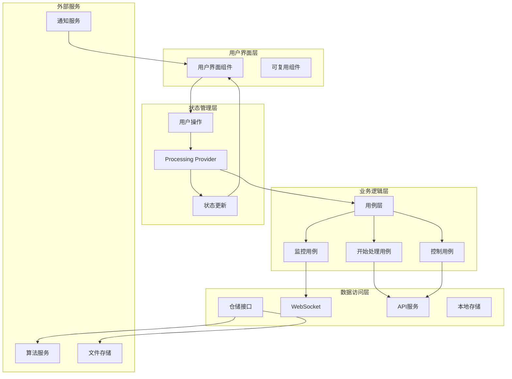

# 去雾处理模块设计文档

**文档版本**: v1.0
**最后更新**: 2025-11-22
**关联文档
**: [模块概览](README.md) | [架构设计](../architecture/02-architecture.md) | [设计系统](../design/01-design-system.md)

---

## 📋 模块概述

### 功能定位

去雾处理模块是Flutter图像去雾系统的核心执行模块，负责协调后端算法服务，管理图像处理任务，提供实时的处理进度反馈，并生成高质量的去雾结果。该模块是用户体验的关键环节，直接影响用户对系统性能和效果的感知。

### 核心价值

- **高性能**: 优化的任务调度和资源管理，确保处理效率
- **实时反馈**: 提供详细的处理进度和状态信息
- **可靠性**: 完善的错误处理和重试机制
- **灵活性**: 支持单张和批量处理，满足不同场景需求

### 模块边界

| 输入来源 | 处理内容 | 输出结果 | 依赖模块 |
|---------|---------|---------|---------|
| **算法选择模块** | 任务创建、参数配置、处理执行 | 处理进度、去雾结果 | 效果对比模块 |
| **图像输入模块** | 批量任务管理、队列调度 | 处理状态、结果文件 | 效果对比模块 |
| **后端服务** | 通信协调、进度监控、错误处理 | 处理状态更新 | 效果对比模块 |
| **用户操作** | 任务控制、参数调整、状态查询 | 实时反馈、操作结果 | 效果对比模块 |

---

## 🏗️ 架构设计

### Clean Architecture分层

```
features/dehaze_processing/
├── data/                              # 数据层
│   ├── datasources/                   # 数据源
│   │   ├── processing_datasource.dart      # 处理任务数据源
│   │   ├── websocket_datasource.dart       # WebSocket数据源
│   │   ├── progress_datasource.dart        # 进度监控数据源
│   │   └── result_datasource.dart          # 结果数据源
│   ├── models/                         # 数据模型
│   │   ├── processing_task_model.dart      # 处理任务模型
│   │   ├── processing_progress_model.dart  # 处理进度模型
│   │   ├── processing_result_model.dart    # 处理结果模型
│   │   └── batch_task_model.dart           # 批量任务模型
│   └── repositories/                   # 仓储实现
│       ├── processing_repository_impl.dart
│       ├── websocket_repository_impl.dart
│       └── result_repository_impl.dart
├── domain/                            # 领域层
│   ├── entities/                      # 业务实体
│   │   ├── processing_task.dart           # 处理任务实体
│   │   ├── processing_progress.dart       # 处理进度实体
│   │   ├── processing_result.dart         # 处理结果实体
│   │   ├── batch_processing_task.dart      # 批量处理任务实体
│   │   └── processing_parameters.dart      # 处理参数实体
│   ├── repositories/                  # 仓储接口
│   │   ├── processing_repository.dart
│   │   ├── websocket_repository.dart
│   │   └── result_repository.dart
│   └── usecases/                       # 用例
│       ├── start_processing_usecase.dart     # 开始处理用例
│       ├── pause_processing_usecase.dart     // 暂停处理用例
│       ├── resume_processing_usecase.dart    // 恢复处理用例
│       ├── cancel_processing_usecase.dart    // 取消处理用例
│       ├── get_processing_status_usecase.dart // 获取状态用例
│       ├── start_batch_processing_usecase.dart // 批量处理用例
│       └── save_processing_result_usecase.dart // 保存结果用例
└── presentation/                      # 表现层
    ├── pages/                         # 页面组件
    │   ├── processing_page.dart            # 处理主页面
    │   ├── batch_processing_page.dart      # 批量处理页面
    │   ├── processing_details_page.dart    // 处理详情页面
    │   └── result_preview_page.dart        // 结果预览页面
    ├── widgets/                       # 可复用组件
    │   ├── progress_indicator_widget.dart   # 进度指示器组件
    │   ├── task_card_widget.dart           # 任务卡片组件
    │   ├── parameter_panel_widget.dart     # 参数面板组件
    │   ├── result_preview_widget.dart      # 结果预览组件
    │   ├── batch_status_widget.dart        // 批量状态组件
    │   └── control_panel_widget.dart       # 控制面板组件
    └── providers/                      # 状态管理
        ├── processing_provider.dart         # 处理状态管理
        ├── batch_processing_provider.dart   # 批量处理状态管理
        ├── progress_monitor_provider.dart   # 进度监控状态管理
        └── result_preview_provider.dart     # 结果预览状态管理
```

### 数据流架构



---

## 🎯 领域模型设计

### 核心实体定义

#### ProcessingTask 处理任务实体

```dart
/// 图像处理任务实体
class ProcessingTask {
  final String id;                        // 任务唯一标识
  final InputImage inputImage;            // 输入图像
  final Algorithm algorithm;              // 选择的算法
  final ProcessingParameters parameters;   // 处理参数
  final ProcessingStatus status;          // 处理状态
  final double progress;                  // 处理进度 (0.0 - 1.0)
  final ProcessingStage? currentStage;    // 当前处理阶段
  final ProcessedImage? result;           // 处理结果
  final String? errorMessage;             // 错误信息
  final DateTime createdAt;               // 创建时间
  final DateTime? startedAt;              // 开始时间
  final DateTime? completedAt;            // 完成时间
  final Duration? estimatedDuration;      // 预估时长
  final List<ProcessingLog> logs;         // 处理日志
  final Map<String, dynamic> metadata;    // 元数据

  const ProcessingTask({
    required this.id,
    required this.inputImage,
    required this.algorithm,
    required this.parameters,
    required this.status,
    required this.progress,
    this.currentStage,
    this.result,
    this.errorMessage,
    required this.createdAt,
    this.startedAt,
    this.completedAt,
    this.estimatedDuration,
    this.logs = const [],
    this.metadata = const {},
  });

  /// 获取处理时长
  Duration? get processingDuration {
    if (startedAt == null) return null;
    final endTime = completedAt ?? DateTime.now();
    return endTime.difference(startedAt!);
  }

  /// 获取剩余时间
  Duration? get remainingTime {
    if (estimatedDuration == null || startedAt == null) return null;

    final elapsed = DateTime.now().difference(startedAt!);
    final remaining = estimatedDuration! - elapsed;
    return remaining.isNegative ? Duration.zero : remaining;
  }

  /// 是否正在处理
  bool get isActive => status == ProcessingStatus.processing ||
                        status == ProcessingStatus.paused;

  /// 是否已完成
  bool get isCompleted => status == ProcessingStatus.completed ||
                         status == ProcessingStatus.failed ||
                         status == ProcessingStatus.cancelled;
}

/// 处理状态枚举
enum ProcessingStatus {
  pending,        // 等待中
  processing,     // 处理中
  paused,         // 已暂停
  completed,      // 已完成
  failed,         // 失败
  cancelled,      // 已取消
}

/// 处理阶段
enum ProcessingStage {
  validation,     // 验证阶段
  preprocessing,  // 预处理阶段
  analysis,       // 分析阶段
  processing,     // 处理阶段
  postprocessing, // 后处理阶段
  finalization,   // 完成阶段
}

/// 处理日志
class ProcessingLog {
  final DateTime timestamp;              // 时间戳
  final ProcessingStage stage;           // 处理阶段
  final String message;                  // 日志消息
  final LogLevel level;                  // 日志级别
  final Map<String, dynamic>? details;   // 详细信息

  const ProcessingLog({
    required this.timestamp,
    required this.stage,
    required this.message,
    required this.level,
    this.details,
  });
}

enum LogLevel { debug, info, warning, error, critical }
```

#### ProcessedImage 处理结果实体

```dart
/// 处理后的图像实体
class ProcessedImage {
  final String id;                        // 结果唯一标识
  final String taskId;                    // 关联的任务ID
  final String originalPath;              // 原始图片路径
  final String processedPath;             // 处理后图片路径
  final String thumbnailPath;             // 缩略图路径
  final int originalWidth;                // 原始宽度
  final int originalHeight;               // 原始高度
  final int processedWidth;               // 处理后宽度
  final int processedHeight;              // 处理后高度
  final int fileSize;                     // 文件大小
  final String format;                    // 文件格式
  final QualityMetrics qualityMetrics;    // 质量指标
  final ProcessingStatistics statistics;   // 处理统计
  final DateTime createdAt;               // 创建时间
  final Map<String, dynamic> exifData;   // EXIF数据

  const ProcessedImage({
    required this.id,
    required this.taskId,
    required this.originalPath,
    required this.processedPath,
    required this.thumbnailPath,
    required this.originalWidth,
    required this.originalHeight,
    required this.processedWidth,
    required this.processedHeight,
    required this.fileSize,
    required this.format,
    required this.qualityMetrics,
    required this.statistics,
    required this.createdAt,
    this.exifData = const {},
  });
}

/// 质量指标
class QualityMetrics {
  final double psnr;                     // 峰值信噪比
  final double ssim;                     // 结构相似性
  final double lpips;                    // 感知路径损失
  final double sharpness;                // 清晰度评分
  final double contrast;                 // 对比度评分
  final double brightness;               // 亮度评分
  final double colorfulness;             // 色彩丰富度
  final Map<String, dynamic> customMetrics; // 自定义指标

  const QualityMetrics({
    required this.psnr,
    required this.ssim,
    required this.lpips,
    required this.sharpness,
    required this.contrast,
    required this.brightness,
    required this.colorfulness,
    this.customMetrics = const {},
  });
}

/// 处理统计
class ProcessingStatistics {
  final Duration totalTime;             // 总处理时间
  final Duration validationTime;        // 验证时间
  final Duration preprocessingTime;     // 预处理时间
  final Duration processingTime;        // 核心处理时间
  final Duration postprocessingTime;    // 后处理时间
  final int memoryUsagePeak;            // 内存使用峰值
  final double cpuUsageAverage;         // 平均CPU使用率
  final int iterationsCount;            // 迭代次数
  final Map<String, dynamic> algorithmStats; // 算法特定统计

  const ProcessingStatistics({
    required this.totalTime,
    required this.validationTime,
    required this.preprocessingTime,
    required this.processingTime,
    required this.postprocessingTime,
    required this.memoryUsagePeak,
    required this.cpuUsageAverage,
    required this.iterationsCount,
    this.algorithmStats = const {},
  });
}
```

#### BatchProcessingTask 批量处理任务实体

```dart
/// 批量处理任务实体
class BatchProcessingTask {
  final String id;                        // 批量任务ID
  final String name;                      // 任务名称
  final List<ProcessingTask> tasks;       // 子任务列表
  final BatchProcessingConfig config;     // 批量处理配置
  final BatchProcessingStatus status;     // 批量任务状态
  final int completedCount;               // 已完成任务数
  final int failedCount;                  // 失败任务数
  final int totalCount;                   // 总任务数
  final double overallProgress;           // 整体进度
  final DateTime createdAt;               // 创建时间
  final DateTime? startedAt;              // 开始时间
  final DateTime? completedAt;            // 完成时间
  final Duration? estimatedDuration;      // 预估总时长
  final Map<String, dynamic> metadata;    // 元数据

  const BatchProcessingTask({
    required this.id,
    required this.name,
    required this.tasks,
    required this.config,
    required this.status,
    required this.completedCount,
    required this.failedCount,
    required this.totalCount,
    required this.overallProgress,
    required this.createdAt,
    this.startedAt,
    this.completedAt,
    this.estimatedDuration,
    this.metadata = const {},
  });

  /// 获取成功率
  double get successRate {
    if (totalCount == 0) return 0.0;
    return (completedCount - failedCount) / totalCount;
  }

  /// 获取剩余任务数
  int get remainingCount => totalCount - completedCount;

  /// 是否正在处理
  bool get isActive => status == BatchProcessingStatus.processing ||
                       status == BatchProcessingStatus.paused;
}

/// 批量处理状态
enum BatchProcessingStatus {
  pending,        // 等待中
  processing,     // 处理中
  paused,         // 已暂停
  completed,      // 已完成
  failed,         // 失败
  cancelled,      // 已取消
}

/// 批量处理配置
class BatchProcessingConfig {
  final int maxConcurrentTasks;           // 最大并发任务数
  final bool enableAutoRetry;             // 是否启用自动重试
  final int maxRetryAttempts;             // 最大重试次数
  final bool pauseOnError;                // 遇到错误时是否暂停
  final bool continueOnError;             // 遇到错误时是否继续
  final Duration taskTimeout;             // 任务超时时间
  final bool saveIntermediateResults;     // 是否保存中间结果

  const BatchProcessingConfig({
    this.maxConcurrentTasks = 3,
    this.enableAutoRetry = true,
    this.maxRetryAttempts = 2,
    this.pauseOnError = false,
    this.continueOnError = true,
    this.taskTimeout = const Duration(minutes: 5),
    this.saveIntermediateResults = false,
  });
}
```

### 用例设计

#### StartProcessingUseCase 开始处理用例

```dart
/// 开始图像处理用例
class StartProcessingUseCase implements UseCase<ProcessingTask, StartProcessingParams> {
  final ProcessingRepository repository;
  final WebSocketRepository webSocketRepository;
  final ValidationService validationService;
  final NotificationService notificationService;
  final FileService fileService;

  StartProcessingUseCase({
    required this.repository,
    required this.webSocketRepository,
    required this.validationService,
    required this.notificationService,
    required this.fileService,
  });

  @override
  Future<ProcessingTask> call(StartProcessingParams params) async {
    try {
      // 1. 创建处理任务
      final task = ProcessingTask(
        id: const Uuid().v4(),
        inputImage: params.inputImage,
        algorithm: params.algorithm,
        parameters: params.parameters,
        status: ProcessingStatus.pending,
        progress: 0.0,
        createdAt: DateTime.now(),
        estimatedDuration: await _estimateProcessingTime(params),
        logs: [
          ProcessingLog(
            timestamp: DateTime.now(),
            stage: ProcessingStage.validation,
            message: '任务创建成功，等待验证',
            level: LogLevel.info,
          ),
        ],
      );

      // 2. 验证输入参数
      await _validateProcessingParams(params);

      // 3. 预处理输入图像
      final preprocessedImage = await _preprocessImage(params.inputImage);

      // 4. 创建WebSocket连接监听进度
      await webSocketRepository.connectToTask(task.id);
      webSocketRepository.listenToTaskProgress(task.id, (progress) {
        // 这里会通过Riverpod状态管理更新UI
        notificationService.updateProgressNotification(task.id, progress);
      });

      // 5. 启动处理任务
      final startedTask = await repository.startProcessing(
        task,
        preprocessedImage: preprocessedImage,
        priority: params.priority,
      );

      // 6. 发送开始通知
      await notificationService.sendProcessingStartedNotification(startedTask);

      return startedTask;
    } catch (e) {
      throw ProcessingException('Failed to start processing: $e');
    }
  }

  /// 验证处理参数
  Future<void> _validateProcessingParams(StartProcessingParams params) async {
    // 验证算法可用性
    final isAlgorithmAvailable = await validationService.validateAlgorithm(
      params.algorithm.id,
    );
    if (!isAlgorithmAvailable) {
      throw ValidationException('Algorithm is not available');
    }

    // 验证参数范围
    await validationService.validateParameters(
      params.algorithm.parameters,
      params.parameters,
    );

    // 验证输入图像
    await validationService.validateInputImage(params.inputImage);
  }

  /// 预处理输入图像
  Future<File> _preprocessImage(InputImage inputImage) async {
    final imageFile = File(inputImage.path);

    // 检查图像格式
    final isValidFormat = await fileService.isValidImageFormat(imageFile);
    if (!isValidFormat) {
      throw ValidationException('Unsupported image format');
    }

    // 检查图像大小
    final fileSize = await imageFile.length();
    if (fileSize > 50 * 1024 * 1024) { // 50MB限制
      throw ValidationException('Image file too large');
    }

    // 验证图像完整性
    final isValidImage = await fileService.validateImageIntegrity(imageFile);
    if (!isValidImage) {
      throw ValidationException('Corrupted image file');
    }

    return imageFile;
  }

  /// 估算处理时间
  Future<Duration> _estimateProcessingTime(StartProcessingParams params) async {
    // 基于算法、图像大小和历史数据估算时间
    final imageSize = params.inputImage.metadata.fileSize;
    final imagePixels = params.inputImage.metadata.width *
                       params.inputImage.metadata.height;

    // 基础时间（秒）
    double baseTime = switch (params.algorithm.speed) {
      ProcessingSpeed.fast => 2.0,
      ProcessingSpeed.medium => 5.0,
      ProcessingSpeed.slow => 10.0,
    };

    // 根据图像大小调整
    final sizeMultiplier = (imageSize / (1024 * 1024)).clamp(0.5, 5.0);
    final pixelMultiplier = (imagePixels / (1920 * 1080)).clamp(0.5, 3.0);

    final estimatedSeconds = baseTime * sizeMultiplier * pixelMultiplier;

    return Duration(seconds: estimatedSeconds.round());
  }
}

/// 开始处理参数
class StartProcessingParams {
  final InputImage inputImage;            // 输入图像
  final Algorithm algorithm;              // 处理算法
  final ProcessingParameters parameters;  // 处理参数
  final TaskPriority priority;            // 任务优先级

  const StartProcessingParams({
    required this.inputImage,
    required this.algorithm,
    required this.parameters,
    this.priority = TaskPriority.normal,
  });
}

enum TaskPriority { low, normal, high, urgent }
```

---

## 🎨 界面设计

### 页面布局结构

#### 单张处理页面设计

```
┌─────────────────────────────────────────────────────────────┐
│  去雾处理                              [暂停] [取消] [设置] │
├─────────────────────────────────────────────────────────────┤
│                                                             │
│  📊 处理进度                                                 │
│                                                             │
│  ┌─────────────────────────────────────────────────────────┐ │
│  │ ████████████░░░░░░ 75%                                 │ │
│  │ 当前阶段: 图像去雾处理                                    │ │
│  │ 预计剩余时间: 1分30秒                                    │ │
│  │                                                         │ │
│  │ ⚡ AOD-Net算法正在处理中...                              │ │
│  └─────────────────────────────────────────────────────────┘ │
│                                                             │
│  🖼️ 实时预览                                                 │
│                                                             │
│  ┌─────────────────────────────────────────────────────────┐ │
│  │                  [处理中预览图]                         │ │
│  │                                                         │ │
│  │            基于当前进度的实时预览效果                    │ │
│  └─────────────────────────────────────────────────────────┘ │
│                                                             │
│  ⚙️ 处理参数                                                 │
│                                                             │
│  ┌─────────────────────────────────────────────────────────┐ │
│  │ 去雾强度:    ████████░░ 80%                              │ │
│  │ 色彩恢复:    ●开启                                        │ │
│  │ 对比度增强:  ██████░░░░ 60%                              │ │
│  │                                                         │ │
│  │ [重置参数] [应用预设] [高级设置]                         │ │
│  └─────────────────────────────────────────────────────────┘ │
│                                                             │
│  📋 处理信息                                                 │
│                                                             │
│  ┌─────────────────────────────────────────────────────────┐ │
│  │ 算法: AOD-Net (深度学习)                                │ │
│  │ 原图: 1920×1080, 3.2MB                                 │ │
│  │ 开始时间: 14:30:25                                      │ │
│  │ 已用时间: 2分15秒                                        │ │
│  │ 内存使用: 456MB                                          │ │
│  └─────────────────────────────────────────────────────────┘ │
│                                                             │
└─────────────────────────────────────────────────────────────┘
```

### 响应式适配

| 屏幕尺寸 | 布局特点 | 组件排列 | 交互优化 |
|---------|---------|---------|---------|
| **Mobile** < 768px | 垂直布局 | 进度 -> 预览 -> 参数 -> 信息 | 大按钮，易于触摸 |
| **Tablet** 768-1024px | 双列布局 | 左侧进度+预览，右侧参数+信息 | 支持拖拽调整 |
| **Desktop** > 1024px | 三列布局 | 进度栏 | 预览区 | 参数面板 | 信息面板 | 键盘快捷键支持 |

### 组件设计规范

#### 进度指示器组件

```dart
/// 处理进度指示器组件
class ProcessingProgressWidget extends StatelessWidget {
  final ProcessingTask task;
  final VoidCallback? onPause;
  final VoidCallback? onCancel;
  final VoidCallback? onViewDetails;

  const ProcessingProgressWidget({
    required this.task,
    this.onPause,
    this.onCancel,
    this.onViewDetails,
  });

  @override
  Widget build(BuildContext context) {
    return Card(
      elevation: 4,
      child: Padding(
        padding: EdgeInsets.all(20),
        child: Column(
          crossAxisAlignment: CrossAxisAlignment.start,
          children: [
            // 头部信息
            _buildHeader(context),
            SizedBox(height: 16),
            // 进度条
            _buildProgressBar(context),
            SizedBox(height: 12),
            // 进度详情
            _buildProgressDetails(context),
            SizedBox(height: 16),
            // 控制按钮
            _buildControlButtons(context),
          ],
        ),
      ),
    );
  }

  Widget _buildHeader(BuildContext context) {
    return Row(
      children: [
        // 状态图标
        Container(
          width: 48,
          height: 48,
          decoration: BoxDecoration(
            color: _getStatusColor().withOpacity(0.1),
            borderRadius: BorderRadius.circular(24),
          ),
          child: Icon(
            _getStatusIcon(),
            size: 24,
            color: _getStatusColor(),
          ),
        ),
        SizedBox(width: 16),
        Expanded(
          child: Column(
            crossAxisAlignment: CrossAxisAlignment.start,
            children: [
              Text(
                _getStatusText(),
                style: Theme.of(context).textTheme.titleLarge?.copyWith(
                  fontWeight: FontWeight.bold,
                  color: _getStatusColor(),
                ),
              ),
              SizedBox(height: 4),
              Text(
                '⚡ ${task.algorithm.name}',
                style: Theme.of(context).textTheme.bodyMedium,
              ),
            ],
          ),
        ),
        // 操作菜单
        PopupMenuButton<String>(
          onSelected: _handleMenuAction,
          itemBuilder: (context) => [
            PopupMenuItem(
              value: 'details',
              child: Row(
                children: [
                  Icon(Icons.info_outline),
                  SizedBox(width: 8),
                  Text('查看详情'),
                ],
              ),
            ),
            PopupMenuItem(
              value: 'logs',
              child: Row(
                children: [
                  Icon(Icons.list_alt),
                  SizedBox(width: 8),
                  Text('处理日志'),
                ],
              ),
            ),
            PopupMenuItem(
              value: 'export',
              child: Row(
                children: [
                  Icon(Icons.file_download),
                  SizedBox(width: 8),
                  Text('导出配置'),
                ],
              ),
            ),
          ],
        ),
      ],
    );
  }

  Widget _buildProgressBar(BuildContext context) {
    return Column(
      crossAxisAlignment: CrossAxisAlignment.start,
      children: [
        Row(
          mainAxisAlignment: MainAxisAlignment.spaceBetween,
          children: [
            Text(
              '${(task.progress * 100).toInt()}%',
              style: Theme.of(context).textTheme.titleMedium?.copyWith(
                fontWeight: FontWeight.bold,
              ),
            ),
            if (task.remainingTime != null)
              Text(
                '剩余 ${_formatDuration(task.remainingTime!)}',
                style: Theme.of(context).textTheme.bodySmall?.copyWith(
                  color: Colors.grey[600],
                ),
              ),
          ],
        ),
        SizedBox(height: 8),
        LinearProgressIndicator(
          value: task.progress,
          backgroundColor: Colors.grey[300],
          valueColor: AlwaysStoppedAnimation<Color>(
            _getProgressColor(),
          ),
          minHeight: 8,
        ),
      ],
    );
  }

  Widget _buildProgressDetails(BuildContext context) {
    return Container(
      padding: EdgeInsets.all(12),
      decoration: BoxDecoration(
        color: Colors.grey[50],
        borderRadius: BorderRadius.circular(8),
      ),
      child: Column(
        crossAxisAlignment: CrossAxisAlignment.start,
        children: [
          Row(
            children: [
              Icon(
                Icons.analytics_outlined,
                size: 16,
                color: Theme.of(context).primaryColor,
              ),
              SizedBox(width: 8),
              Text(
                '当前阶段: ${_getStageText()}',
                style: Theme.of(context).textTheme.bodyMedium?.copyWith(
                  fontWeight: FontWeight.w500,
                ),
              ),
            ],
          ),
          SizedBox(height: 8),
          Row(
            children: [
              Icon(
                Icons.schedule_outlined,
                size: 16,
                color: Colors.grey[600],
              ),
              SizedBox(width: 8),
              Text(
                '已用时间: ${_formatDuration(task.processingDuration ?? Duration.zero)}',
                style: Theme.of(context).textTheme.bodySmall,
              ),
            ],
          ),
          if (task.logs.isNotEmpty) ...[
            SizedBox(height: 8),
            Row(
              children: [
                Icon(
                  Icons.info_outline,
                  size: 16,
                  color: Colors.blue,
                ),
                SizedBox(width: 8),
                Expanded(
                  child: Text(
                    task.logs.last.message,
                    style: Theme.of(context).textTheme.bodySmall,
                    maxLines: 1,
                    overflow: TextOverflow.ellipsis,
                  ),
                ),
              ],
            ),
          ],
        ],
      ),
    );
  }

  Widget _buildControlButtons(BuildContext context) {
    switch (task.status) {
      case ProcessingStatus.processing:
        return Row(
          children: [
            Expanded(
              child: OutlinedButton.icon(
                onPressed: onPause,
                icon: Icon(Icons.pause),
                label: Text('暂停'),
              ),
            ),
            SizedBox(width: 12),
            Expanded(
              child: OutlinedButton.icon(
                onPressed: onCancel,
                icon: Icon(Icons.cancel),
                label: Text('取消'),
                style: OutlinedButton.styleFrom(
                  foregroundColor: Colors.red,
                  side: BorderSide(color: Colors.red),
                ),
              ),
            ),
          ],
        );
      case ProcessingStatus.paused:
        return Row(
          children: [
            Expanded(
              child: ElevatedButton.icon(
                onPressed: onPause, // 恢复功能
                icon: Icon(Icons.play_arrow),
                label: Text('继续'),
              ),
            ),
            SizedBox(width: 12),
            Expanded(
              child: OutlinedButton.icon(
                onPressed: onCancel,
                icon: Icon(Icons.cancel),
                label: Text('取消'),
              ),
            ),
          ],
        );
      default:
        return SizedBox.shrink();
    }
  }

  IconData _getStatusIcon() {
    switch (task.status) {
      case ProcessingStatus.pending:
        return Icons.schedule;
      case ProcessingStatus.processing:
        return Icons.autorenew;
      case ProcessingStatus.paused:
        return Icons.pause;
      case ProcessingStatus.completed:
        return Icons.check_circle;
      case ProcessingStatus.failed:
        return Icons.error;
      case ProcessingStatus.cancelled:
        return Icons.cancel;
    }
  }

  Color _getStatusColor() {
    switch (task.status) {
      case ProcessingStatus.pending:
        return Colors.orange;
      case ProcessingStatus.processing:
        return Colors.blue;
      case ProcessingStatus.paused:
        return Colors.amber;
      case ProcessingStatus.completed:
        return Colors.green;
      case ProcessingStatus.failed:
        return Colors.red;
      case ProcessingStatus.cancelled:
        return Colors.grey;
    }
  }

  String _getStatusText() {
    switch (task.status) {
      case ProcessingStatus.pending:
        return '等待处理';
      case ProcessingStatus.processing:
        return '正在处理';
      case ProcessingStatus.paused:
        return '已暂停';
      case ProcessingStatus.completed:
        return '处理完成';
      case ProcessingStatus.failed:
        return '处理失败';
      case ProcessingStatus.cancelled:
        return '已取消';
    }
  }

  Color _getProgressColor() {
    if (task.status == ProcessingStatus.failed) {
      return Colors.red;
    } else if (task.status == ProcessingStatus.completed) {
      return Colors.green;
    }
    return Theme.of(Get.context!).primaryColor;
  }

  String _getStageText() {
    switch (task.currentStage) {
      case ProcessingStage.validation:
        return '验证输入参数';
      case ProcessingStage.preprocessing:
        return '预处理图像';
      case ProcessingStage.analysis:
        return '分析图像特征';
      case ProcessingStage.processing:
        return '执行去雾算法';
      case ProcessingStage.postprocessing:
        return '后处理优化';
      case ProcessingStage.finalization:
        return '完成处理';
      default:
        return '准备中';
    }
  }

  String _formatDuration(Duration duration) {
    final hours = duration.inHours;
    final minutes = duration.inMinutes % 60;
    final seconds = duration.inSeconds % 60;

    if (hours > 0) {
      return '${hours}:${minutes.toString().padLeft(2, '0')}:${seconds.toString().padLeft(2, '0')}';
    } else {
      return '${minutes}:${seconds.toString().padLeft(2, '0')}';
    }
  }

  void _handleMenuAction(String action) {
    switch (action) {
      case 'details':
        onViewDetails?.call();
        break;
      case 'logs':
        // 显示处理日志
        break;
      case 'export':
        // 导出配置
        break;
    }
  }
}
```

#### 批量处理状态组件

```dart
/// 批量处理状态组件
class BatchProcessingWidget extends StatelessWidget {
  final BatchProcessingTask batchTask;
  final Function(ProcessingTask) onTaskTap;
  final VoidCallback? onPause;
  final VoidCallback? onResume;
  final VoidCallback? onCancel;

  const BatchProcessingWidget({
    required this.batchTask,
    required this.onTaskTap,
    this.onPause,
    this.onResume,
    this.onCancel,
  });

  @override
  Widget build(BuildContext context) {
    return Card(
      elevation: 4,
      child: Padding(
        padding: EdgeInsets.all(20),
        child: Column(
          crossAxisAlignment: CrossAxisAlignment.start,
          children: [
            // 批量任务头部
            _buildBatchHeader(context),
            SizedBox(height: 20),
            // 整体进度
            _buildOverallProgress(context),
            SizedBox(height: 20),
            // 统计信息
            _buildStatistics(context),
            SizedBox(height: 20),
            // 控制按钮
            _buildBatchControls(context),
            SizedBox(height: 20),
            // 子任务列表
            _buildTaskList(context),
          ],
        ),
      ),
    );
  }

  Widget _buildBatchHeader(BuildContext context) {
    return Row(
      children: [
        Icon(
          Icons.view_list,
          size: 28,
          color: Theme.of(context).primaryColor,
        ),
        SizedBox(width: 12),
        Expanded(
          child: Column(
            crossAxisAlignment: CrossAxisAlignment.start,
            children: [
              Text(
                batchTask.name,
                style: Theme.of(context).textTheme.titleLarge?.copyWith(
                  fontWeight: FontWeight.bold,
                ),
              ),
              SizedBox(height: 4),
              Text(
                '${batchTask.totalCount} 个任务',
                style: Theme.of(context).textTheme.bodyMedium?.copyWith(
                  color: Colors.grey[600],
                ),
              ),
            ],
          ),
        ),
        Container(
          padding: EdgeInsets.symmetric(horizontal: 12, vertical: 6),
          decoration: BoxDecoration(
            color: _getBatchStatusColor().withOpacity(0.1),
            borderRadius: BorderRadius.circular(16),
          ),
          child: Text(
            _getBatchStatusText(),
            style: TextStyle(
              color: _getBatchStatusColor(),
              fontWeight: FontWeight.bold,
              fontSize: 12,
            ),
          ),
        ),
      ],
    );
  }

  Widget _buildOverallProgress(BuildContext context) {
    return Column(
      crossAxisAlignment: CrossAxisAlignment.start,
      children: [
        Row(
          mainAxisAlignment: MainAxisAlignment.spaceBetween,
          children: [
            Text(
              '整体进度',
              style: Theme.of(context).textTheme.titleMedium?.copyWith(
                fontWeight: FontWeight.bold,
              ),
            ),
            Text(
              '${(batchTask.overallProgress * 100).toInt()}% (${batchTask.completedCount}/${batchTask.totalCount})',
              style: Theme.of(context).textTheme.bodyMedium,
            ),
          ],
        ),
        SizedBox(height: 8),
        LinearProgressIndicator(
          value: batchTask.overallProgress,
          backgroundColor: Colors.grey[300],
          valueColor: AlwaysStoppedAnimation<Color>(
            _getBatchStatusColor(),
          ),
          minHeight: 10,
        ),
      ],
    );
  }

  Widget _buildStatistics(BuildContext context) {
    return Row(
      children: [
        Expanded(
          child: _buildStatCard(
            context,
            '已完成',
            batchTask.completedCount.toString(),
            Colors.green,
            Icons.check_circle,
          ),
        ),
        SizedBox(width: 12),
        Expanded(
          child: _buildStatCard(
            context,
            '失败',
            batchTask.failedCount.toString(),
            Colors.red,
            Icons.error,
          ),
        ),
        SizedBox(width: 12),
        Expanded(
          child: _buildStatCard(
            context,
            '成功率',
            '${(batchTask.successRate * 100).toInt()}%',
            Colors.blue,
            Icons.trending_up,
          ),
        ),
      ],
    );
  }

  Widget _buildStatCard(
    BuildContext context,
    String label,
    String value,
    Color color,
    IconData icon,
  ) {
    return Container(
      padding: EdgeInsets.all(12),
      decoration: BoxDecoration(
        color: color.withOpacity(0.1),
        borderRadius: BorderRadius.circular(8),
      ),
      child: Column(
        children: [
          Icon(icon, color: color, size: 20),
          SizedBox(height: 4),
          Text(
            value,
            style: Theme.of(context).textTheme.titleMedium?.copyWith(
              fontWeight: FontWeight.bold,
              color: color,
            ),
          ),
          SizedBox(height: 2),
          Text(
            label,
            style: Theme.of(context).textTheme.bodySmall,
          ),
        ],
      ),
    );
  }

  Widget _buildBatchControls(BuildContext context) {
    switch (batchTask.status) {
      case BatchProcessingStatus.processing:
        return Row(
          children: [
            Expanded(
              child: OutlinedButton.icon(
                onPressed: onPause,
                icon: Icon(Icons.pause),
                label: Text('暂停全部'),
              ),
            ),
            SizedBox(width: 12),
            Expanded(
              child: OutlinedButton.icon(
                onPressed: onCancel,
                icon: Icon(Icons.cancel),
                label: Text('取消全部'),
                style: OutlinedButton.styleFrom(
                  foregroundColor: Colors.red,
                  side: BorderSide(color: Colors.red),
                ),
              ),
            ),
          ],
        );
      case BatchProcessingStatus.paused:
        return Row(
          children: [
            Expanded(
              child: ElevatedButton.icon(
                onPressed: onResume,
                icon: Icon(Icons.play_arrow),
                label: Text('继续全部'),
              ),
            ),
            SizedBox(width: 12),
            Expanded(
              child: OutlinedButton.icon(
                onPressed: onCancel,
                icon: Icon(Icons.cancel),
                label: Text('取消全部'),
              ),
            ),
          ],
        );
      default:
        return SizedBox.shrink();
    }
  }

  Widget _buildTaskList(BuildContext context) {
    return Column(
      crossAxisAlignment: CrossAxisAlignment.start,
      children: [
        Text(
          '任务列表',
          style: Theme.of(context).textTheme.titleMedium?.copyWith(
            fontWeight: FontWeight.bold,
          ),
        ),
        SizedBox(height: 12),
        Container(
          height: 300,
          child: ListView.builder(
            itemCount: batchTask.tasks.length,
            itemBuilder: (context, index) {
              final task = batchTask.tasks[index];
              return _buildTaskItem(context, task);
            },
          ),
        ),
      ],
    );
  }

  Widget _buildTaskItem(BuildContext context, ProcessingTask task) {
    return Card(
      margin: EdgeInsets.only(bottom: 8),
      child: ListTile(
        leading: CircleAvatar(
          backgroundColor: _getTaskStatusColor(task.status).withOpacity(0.1),
          child: Icon(
            _getTaskStatusIcon(task.status),
            color: _getTaskStatusColor(task.status),
            size: 20,
          ),
        ),
        title: Text(
          '${task.algorithm.name} - ${task.inputImage.metadata.width}×${task.inputImage.metadata.height}',
          style: Theme.of(context).textTheme.bodyMedium?.copyWith(
            fontWeight: FontWeight.w500,
          ),
        ),
        subtitle: Column(
          crossAxisAlignment: CrossAxisAlignment.start,
          children: [
            SizedBox(height: 4),
            LinearProgressIndicator(
              value: task.progress,
              backgroundColor: Colors.grey[300],
              valueColor: AlwaysStoppedAnimation<Color>(
                _getTaskStatusColor(task.status),
              ),
              minHeight: 4,
            ),
            SizedBox(height: 4),
            Text(
              '${(task.progress * 100).toInt()}% - ${_getTaskStatusText(task.status)}',
              style: Theme.of(context).textTheme.bodySmall,
            ),
          ],
        ),
        trailing: Icon(Icons.chevron_right),
        onTap: () => onTaskTap(task),
      ),
    );
  }

  Color _getBatchStatusColor() {
    switch (batchTask.status) {
      case BatchProcessingStatus.pending:
        return Colors.orange;
      case BatchProcessingStatus.processing:
        return Colors.blue;
      case BatchProcessingStatus.paused:
        return Colors.amber;
      case BatchProcessingStatus.completed:
        return Colors.green;
      case BatchProcessingStatus.failed:
        return Colors.red;
      case BatchProcessingStatus.cancelled:
        return Colors.grey;
    }
  }

  String _getBatchStatusText() {
    switch (batchTask.status) {
      case BatchProcessingStatus.pending:
        return '等待中';
      case BatchProcessingStatus.processing:
        return '处理中';
      case BatchProcessingStatus.paused:
        return '已暂停';
      case BatchProcessingStatus.completed:
        return '已完成';
      case BatchProcessingStatus.failed:
        return '失败';
      case BatchProcessingStatus.cancelled:
        return '已取消';
    }
  }

  Color _getTaskStatusColor(ProcessingStatus status) {
    switch (status) {
      case ProcessingStatus.pending:
        return Colors.orange;
      case ProcessingStatus.processing:
        return Colors.blue;
      case ProcessingStatus.paused:
        return Colors.amber;
      case ProcessingStatus.completed:
        return Colors.green;
      case ProcessingStatus.failed:
        return Colors.red;
      case ProcessingStatus.cancelled:
        return Colors.grey;
    }
  }

  IconData _getTaskStatusIcon(ProcessingStatus status) {
    switch (status) {
      case ProcessingStatus.pending:
        return Icons.schedule;
      case ProcessingStatus.processing:
        return Icons.autorenew;
      case ProcessingStatus.paused:
        return Icons.pause;
      case ProcessingStatus.completed:
        return Icons.check_circle;
      case ProcessingStatus.failed:
        return Icons.error;
      case ProcessingStatus.cancelled:
        return Icons.cancel;
    }
  }

  String _getTaskStatusText(ProcessingStatus status) {
    switch (status) {
      case ProcessingStatus.pending:
        return '等待中';
      case ProcessingStatus.processing:
        return '处理中';
      case ProcessingStatus.paused:
        return '已暂停';
      case ProcessingStatus.completed:
        return '已完成';
      case ProcessingStatus.failed:
        return '失败';
      case ProcessingStatus.cancelled:
        return '已取消';
    }
  }
}
```

---

## 🔄 状态管理

### Riverpod状态设计

```dart
/// 处理任务状态
@freezed
class ProcessingState with _$ProcessingState {
  const factory ProcessingState.initial() = _ProcessingInitial;
  const factory ProcessingState.ready({
    required InputImage inputImage,
    required Algorithm algorithm,
    required ProcessingParameters parameters,
  }) = _ProcessingReady;
  const factory ProcessingState.inProgress(ProcessingTask task) = _ProcessingInProgress;
  const factory ProcessingState.progressUpdated({
    required ProcessingTask task,
    required ProcessingProgress progress,
  }) = _ProcessingProgressUpdated;
  const factory ProcessingState.completed({
    required ProcessingTask task,
    required ProcessedImage result,
  }) = _ProcessingCompleted;
  const factory ProcessingState.failed({
    required ProcessingTask task,
    required String errorMessage,
    VoidCallback? onRetry,
  }) = _ProcessingFailed;
  const factory ProcessingState.cancelled(ProcessingTask task) = _ProcessingCancelled;
  const factory ProcessingState.batchInProgress(BatchProcessingTask batchTask) = _BatchProcessingInProgress;
}

/// 处理状态Provider
final processingProvider = StateNotifierProvider<ProcessingNotifier, ProcessingState>((ref) {
  return ProcessingNotifier(
    ref.read(processingRepositoryProvider),
    ref.read(webSocketRepositoryProvider),
  );
});

/// 处理状态管理器
class ProcessingNotifier extends StateNotifier<ProcessingState> {
  final ProcessingRepository _repository;
  final WebSocketRepository _webSocketRepository;
  StreamSubscription<ProcessingProgress>? _progressSubscription;

  ProcessingNotifier(this._repository, this._webSocketRepository)
      : super(const ProcessingState.initial());

  /// 准备处理
  void prepareProcessing({
    required InputImage inputImage,
    required Algorithm algorithm,
    required ProcessingParameters parameters,
  }) {
    state = ProcessingState.ready(
      inputImage: inputImage,
      algorithm: algorithm,
      parameters: parameters,
    );
  }

  /// 开始处理
  Future<void> startProcessing({TaskPriority priority = TaskPriority.normal}) async {
    final readyState = state;
    if (readyState is! _ProcessingReady) {
      throw StateError('处理状态不正确，请先准备处理参数');
    }

    try {
      // 启动WebSocket监听
      _progressSubscription = _webSocketRepository
          .listenToTaskProgress('temp-task-id')
          .listen((progress) {
            _handleProgressUpdate(progress);
          });

      state = ProcessingState.inProgress(
        ProcessingTask(
          id: const Uuid().v4(),
          inputImage: readyState.inputImage,
          algorithm: readyState.algorithm,
          parameters: readyState.parameters,
          status: ProcessingStatus.processing,
          progress: 0.0,
          createdAt: DateTime.now(),
          startedAt: DateTime.now(),
          logs: [
            ProcessingLog(
              timestamp: DateTime.now(),
              stage: ProcessingStage.validation,
              message: '开始处理任务',
              level: LogLevel.info,
            ),
          ],
        ),
      );

      final result = await _repository.startProcessing(
        readyState.inputImage,
        readyState.algorithm,
        readyState.parameters,
        priority: priority,
      );

      state = ProcessingState.completed(
        task: _updateTaskWithResult(state as _ProcessingInProgress, result),
        result: result,
      );

      await _progressSubscription?.cancel();
    } catch (e) {
      state = ProcessingState.failed(
        task: (state as _ProcessingInProgress).task,
        errorMessage: e.toString(),
        onRetry: () => startProcessing(priority: priority),
      );
      await _progressSubscription?.cancel();
    }
  }

  /// 暂停处理
  Future<void> pauseProcessing() async {
    final currentState = state;
    if (currentState is _ProcessingInProgress) {
      try {
        await _repository.pauseProcessing(currentState.task.id);
        // 更新任务状态
        final updatedTask = ProcessingTask(
          id: currentState.task.id,
          inputImage: currentState.task.inputImage,
          algorithm: currentState.task.algorithm,
          parameters: currentState.task.parameters,
          status: ProcessingStatus.paused,
          progress: currentState.task.progress,
          createdAt: currentState.task.createdAt,
          startedAt: currentState.task.startedAt,
        );
        state = ProcessingState.inProgress(updatedTask);
      } catch (e) {
        state = ProcessingState.failed(
          task: currentState.task,
          errorMessage: '暂停处理失败: ${e.toString()}',
          onRetry: pauseProcessing,
        );
      }
    }
  }

  /// 恢复处理
  Future<void> resumeProcessing() async {
    final currentState = state;
    if (currentState is _ProcessingInProgress && currentState.task.status == ProcessingStatus.paused) {
      try {
        await _repository.resumeProcessing(currentState.task.id);
        // 更新任务状态
        final updatedTask = ProcessingTask(
          id: currentState.task.id,
          inputImage: currentState.task.inputImage,
          algorithm: currentState.task.algorithm,
          parameters: currentState.task.parameters,
          status: ProcessingStatus.processing,
          progress: currentState.task.progress,
          createdAt: currentState.task.createdAt,
          startedAt: currentState.task.startedAt,
        );
        state = ProcessingState.inProgress(updatedTask);
      } catch (e) {
        state = ProcessingState.failed(
          task: currentState.task,
          errorMessage: '恢复处理失败: ${e.toString()}',
          onRetry: resumeProcessing,
        );
      }
    }
  }

  /// 取消处理
  Future<void> cancelProcessing() async {
    final currentState = state;
    if (currentState is _ProcessingInProgress) {
      try {
        await _repository.cancelProcessing(currentState.task.id);
        state = ProcessingState.cancelled(currentState.task);
        await _progressSubscription?.cancel();
      } catch (e) {
        state = ProcessingState.failed(
          task: currentState.task,
          errorMessage: '取消处理失败: ${e.toString()}',
        );
      }
    }
  }

  void _handleProgressUpdate(ProcessingProgress progress) {
    final currentState = state;
    if (currentState is _ProcessingInProgress) {
      final updatedTask = ProcessingTask(
        id: currentState.task.id,
        inputImage: currentState.task.inputImage,
        algorithm: currentState.task.algorithm,
        parameters: currentState.task.parameters,
        status: _mapProgressStatus(progress.stage),
        progress: progress.percentage,
        currentStage: progress.stage,
        createdAt: currentState.task.createdAt,
        startedAt: currentState.task.startedAt,
        logs: [
          ...currentState.task.logs,
          ProcessingLog(
            timestamp: DateTime.now(),
            stage: progress.stage,
            message: progress.message,
            level: LogLevel.info,
          ),
        ],
      );

      state = ProcessingState.progressUpdated(
        task: updatedTask,
        progress: progress,
      );
    }
  }

  ProcessingTask _updateTaskWithResult(_ProcessingInProgress currentState, ProcessedImage result) {
    return ProcessingTask(
      id: currentState.task.id,
      inputImage: currentState.task.inputImage,
      algorithm: currentState.task.algorithm,
      parameters: currentState.task.parameters,
      status: ProcessingStatus.completed,
      progress: 1.0,
      result: result,
      createdAt: currentState.task.createdAt,
      startedAt: currentState.task.startedAt,
      completedAt: DateTime.now(),
      logs: currentState.task.logs,
    );
  }

  ProcessingStatus _mapProgressStatus(ProcessingStage stage) {
    switch (stage) {
      case ProcessingStage.validation:
      case ProcessingStage.preprocessing:
      case ProcessingStage.analysis:
      case ProcessingStage.processing:
      case ProcessingStage.postprocessing:
        return ProcessingStatus.processing;
      case ProcessingStage.finalization:
        return ProcessingStatus.completed;
    }
  }

  @override
  void dispose() {
    _progressSubscription?.cancel();
    super.dispose();
  }
}

/// 批量处理Provider
final batchProcessingProvider = StateNotifierProvider<BatchProcessingNotifier, BatchProcessingState>((ref) {
  return BatchProcessingNotifier(ref.read(processingRepositoryProvider));
});

/// 进度监控Provider
final progressMonitorProvider = StreamProvider<ProcessingProgress>((ref) {
  return ref.read(webSocketRepositoryProvider).listenToProgress();
});
```

### Provider依赖管理

```dart
/// 处理仓储Provider
final processingRepositoryProvider = Provider<ProcessingRepository>((ref) {
  return ProcessingRepositoryImpl(
    ref.read(processingDatasourceProvider),
    ref.read(resultDatasourceProvider),
  );
});

/// WebSocket仓储Provider
final webSocketRepositoryProvider = Provider<WebSocketRepository>((ref) {
  return WebSocketRepositoryImpl(
    ref.read(websocketDatasourceProvider),
  );
});

/// 结果预览Provider
final resultPreviewProvider = FutureProvider.family<ProcessedImage, String>((ref, taskId) async {
  return ref.read(processingRepositoryProvider).getProcessingResult(taskId);
});

/// 批量处理状态
@freezed
class BatchProcessingState with _$BatchProcessingState {
  const factory BatchProcessingState.initial() = _BatchProcessingInitial;
  const factory BatchProcessingState.loading() = _BatchProcessingLoading;
  const factory BatchProcessingState.inProgress({
    required BatchProcessingTask batchTask,
  }) = _BatchProcessingInProgress;
  const factory BatchProcessingState.completed({
    required BatchProcessingTask batchTask,
  }) = _BatchProcessingCompleted;
  const factory BatchProcessingState.error(String message) = _BatchProcessingError;
}
```

---

**文档版本**: v1.0
**最后更新**: 2025-11-22
**下次更新**: 根据开发进度和用户反馈持续更新
**维护团队**: Flutter开发团队
