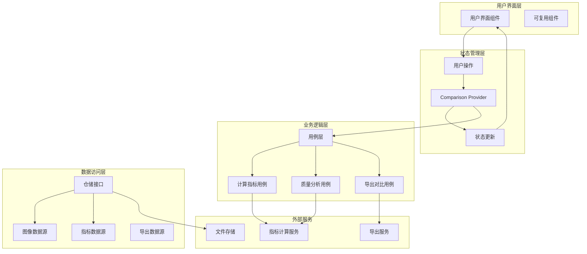

# 效果对比模块设计文档

**文档版本**: v1.0
**最后更新**: 2025-11-22
**关联文档
**: [模块概览](README.md) | [架构设计](../architecture/02-architecture.md) | [设计系统](../design/01-design-system.md)

---

## 📋 模块概述

### 功能定位

效果对比模块是Flutter图像去雾系统的核心展示模块，为用户提供全面、专业、直观的去雾效果对比体验。该模块支持6种对比模式，结合量化指标评估和交互式操作，帮助用户准确评估去雾效果，验证算法性能。

### 核心价值

- **全面对比**: 提供6种专业对比模式，满足不同评估需求
- **量化评估**: 结合PSNR、SSIM等专业指标，提供客观评价
- **交互友好**: 流畅的交互体验，支持手势操作和实时反馈
- **专业可信**: 专业的数据处理和可视化的效果展示

### 模块边界

| 输入来源 | 处理内容 | 输出结果 | 依赖模块 |
|---------|---------|---------|---------|
| **去雾处理模块** | 结果展示、对比分析、效果评估 | 对比界面、评估报告 | 用户操作 |
| **算法选择模块** | 算法效果对比、性能评估 | 算法对比数据 | 用户选择 |
| **用户操作** | 交互控制、模式切换、参数调节 | 实时反馈、操作结果 | 数据导出 |
| **评估服务** | 指标计算、质量分析、数据统计 | 评估报告、性能数据 | 算法优化 |

---

## 🏗️ 架构设计

### Clean Architecture分层

```
features/effect_comparison/
├── data/                              # 数据层
│   ├── datasources/                   # 数据源
│   │   ├── comparison_datasource.dart       # 对比数据源
│   │   ├── metrics_datasource.dart          # 指标数据源
│   │   ├── image_datasource.dart            # 图像数据源
│   │   └── export_datasource.dart           # 导出数据源
│   ├── models/                         # 数据模型
│   │   ├── comparison_result_model.dart     # 对比结果模型
│   │   ├── comparison_metrics_model.dart    # 对比指标模型
│   │   ├── export_config_model.dart         # 导出配置模型
│   │   └── image_analysis_model.dart        # 图像分析模型
│   └── repositories/                   # 仓储实现
│       ├── comparison_repository_impl.dart
│       ├── metrics_repository_impl.dart
│       └── export_repository_impl.dart
├── domain/                            # 领域层
│   ├── entities/                      # 业务实体
│   │   ├── comparison_result.dart           # 对比结果实体
│   │   ├── comparison_metrics.dart          # 对比指标实体
│   │   ├── comparison_mode.dart             # 对比模式实体
│   │   ├── image_comparison.dart            # 图像对比实体
│   │   ├── quality_metrics.dart             # 质量指标实体
│   │   └── export_config.dart               # 导出配置实体
│   ├── repositories/                  # 仓储接口
│   │   ├── comparison_repository.dart
│   │   ├── metrics_repository.dart
│   │   └── export_repository.dart
│   └── usecases/                       # 用例
│       ├── calculate_metrics_usecase.dart   # 计算指标用例
│       ├── compare_images_usecase.dart      # 对比图像用例
│       ├── export_comparison_usecase.dart    // 导出对比用例
│       ├── analyze_quality_usecase.dart     // 质量分析用例
│       ├── generate_report_usecase.dart     // 生成报告用例
│       └── save_comparison_usecase.dart     // 保存对比用例
└── presentation/                      # 表现层
    ├── pages/                         # 页面组件
    │   ├── comparison_main_page.dart         # 对比主页面
    │   ├── side_by_side_page.dart           # 并排对比页面
    │   ├── overlay_page.dart                # 重叠对比页面
    │   ├── magnifier_page.dart              // 放大镜页面
    │   ├── filter_page.dart                 // 滤镜调节页面
    │   └── metrics_page.dart                // 指标评估页面
    ├── widgets/                       # 可复用组件
    │   ├── comparison_mode_selector.dart     # 对比模式选择器
    │   ├── image_viewer_widget.dart         # 图像查看器组件
    │   ├── metrics_chart_widget.dart        # 指标图表组件
    │   ├── overlay_slider_widget.dart       # 重叠滑块组件
    │   ├── magnifier_widget.dart            // 放大镜组件
    │   ├── filter_controls_widget.dart      // 滤镜控制组件
    │   └── export_options_widget.dart       // 导出选项组件
    └── providers/                      # 状态管理
        ├── comparison_provider.dart          # 对比状态管理
        ├── image_viewer_provider.dart           // 图像查看器状态管理
        ├── metrics_provider.dart                // 指标状态管理
        └── export_provider.dart                 // 导出状态管理
```

### 数据流架构



---

## 🎯 领域模型设计

### 核心实体定义

#### ComparisonResult 对比结果实体

```dart
/// 图像对比结果实体
class ComparisonResult {
  final String id;                        // 对比结果唯一标识
  final String originalImageId;            // 原始图像ID
  final List<ProcessedImage> processedImages; // 处理后图像列表
  final ComparisonMode currentMode;        // 当前对比模式
  final Map<String, QualityMetrics> metrics; // 质量指标
  final ComparisonConfig config;           // 对比配置
  final DateTime createdAt;                // 创建时间
  final String? title;                    // 对比标题
  final String? description;              // 对比描述
  final List<String> tags;                // 标签列表
  final bool isFavorite;                  // 是否收藏

  const ComparisonResult({
    required this.id,
    required this.originalImageId,
    required this.processedImages,
    required this.currentMode,
    required this.metrics,
    required this.config,
    required this.createdAt,
    this.title,
    this.description,
    this.tags = const [],
    this.isFavorite = false,
  });
}

/// 对比模式
enum ComparisonMode {
  sideBySide,      // 并排对比
  overlay,         // 重叠对比
  magnifier,       // 放大镜对比
  filter,          // 滤镜调节对比
  metrics,         // 指标评估对比
  animation,       // 动画对比
}

/// 对比配置
class ComparisonConfig {
  final bool showRuler;                   // 是否显示标尺
  final bool showGrid;                    // 是否显示网格
  final bool enableZoom;                  // 是否启用缩放
  final double maxZoomLevel;              // 最大缩放级别
  final bool enablePan;                   // 是否启用平移
  final bool showImageInfo;               // 是否显示图像信息
  final Color backgroundColor;            // 背景颜色
  final ComparisonLayout layout;          // 布局方式

  const ComparisonConfig({
    this.showRuler = true,
    this.showGrid = false,
    this.enableZoom = true,
    this.maxZoomLevel = 5.0,
    this.enablePan = true,
    this.showImageInfo = true,
    this.backgroundColor = const Color(0xFFF5F5F5),
    this.layout = ComparisonLayout.auto,
  });
}

enum ComparisonLayout { auto, horizontal, vertical, grid }
```

#### QualityMetrics 质量指标实体

```dart
/// 图像质量指标
class QualityMetrics {
  final String imageId;                   // 图像ID
  final Map<String, double> basicMetrics; // 基础指标
  final Map<String, double> advancedMetrics; // 高级指标
  final Map<String, double> perceptualMetrics; // 感知指标
  final Map<String, dynamic> customMetrics; // 自定义指标
  final DateTime calculatedAt;            // 计算时间
  final MetricCalculationConfig config;   // 计算配置

  const QualityMetrics({
    required this.imageId,
    required this.basicMetrics,
    required this.advancedMetrics,
    required this.perceptualMetrics,
    required this.customMetrics,
    required this.calculatedAt,
    required this.config,
  });

  /// 获取PSNR值
  double? get psnr => basicMetrics['psnr'];

  /// 获取SSIM值
  double? get ssim => basicMetrics['ssim'];

  /// 获取LPIPS值
  double? get lpips => advancedMetrics['lpips'];

  /// 获取清晰度评分
  double? get sharpness => perceptualMetrics['sharpness'];

  /// 获取对比度评分
  double? get contrast => perceptualMetrics['contrast'];

  /// 获取整体质量评分
  double get overallScore {
    final scores = <double>[];

    if (psnr != null) scores.add(psnr! / 40.0); // 标准化到0-1
    if (ssim != null) scores.add(ssim!);
    if (lpips != null) scores.add(1.0 - lpips!); // LPIPS越小越好
    if (sharpness != null) scores.add(sharpness!);
    if (contrast != null) scores.add(contrast!);

    return scores.isEmpty ? 0.0 : scores.reduce((a, b) => a + b) / scores.length;
  }
}

/// 指标计算配置
class MetricCalculationConfig {
  final bool calculateBasic;              // 是否计算基础指标
  final bool calculateAdvanced;           // 是否计算高级指标
  final bool calculatePerceptual;         // 是否计算感知指标
  final bool enableGPU;                   // 是否启用GPU加速
  final Map<String, dynamic> parameters;  // 自定义参数

  const MetricCalculationConfig({
    this.calculateBasic = true,
    this.calculateAdvanced = true,
    this.calculatePerceptual = false,
    this.enableGPU = true,
    this.parameters = const {},
  });
}

/// 基础指标映射
const Map<String, String> basicMetricNames = {
  'psnr': '峰值信噪比 (PSNR)',
  'ssim': '结构相似性 (SSIM)',
  'mse': '均方误差 (MSE)',
  'mae': '平均绝对误差 (MAE)',
};

/// 高级指标映射
const Map<String, String> advancedMetricNames = {
  'lpips': '感知路径损失 (LPIPS)',
  'fid': '弗雷歇初始距离 (FID)',
  'kid': '核初始距离 (KID)',
  'is': '图像清晰度 (IS)',
};

/// 感知指标映射
const Map<String, String> perceptualMetricNames = {
  'sharpness': '清晰度评分',
  'contrast': '对比度评分',
  'brightness': '亮度评分',
  'colorfulness': '色彩丰富度',
  'naturalness': '自然度评分',
};
```

#### ImageComparison 图像对比实体

```dart
/// 图像对比操作
class ImageComparison {
  final String id;                        // 对比操作ID
  final String originalImagePath;        // 原始图像路径
  final String processedImagePath;       // 处理后图像路径
  final ComparisonMode mode;             // 对比模式
  final Map<String, dynamic> parameters; // 模式参数
  final Rect? viewRegion;                // 查看区域
  final double zoomLevel;                // 缩放级别
  final Offset? panOffset;               // 平移偏移

  const ImageComparison({
    required this.id,
    required this.originalImagePath,
    required this.processedImagePath,
    required this.mode,
    this.parameters = const {},
    this.viewRegion,
    this.zoomLevel = 1.0,
    this.panOffset,
  });
}

/// 重叠对比参数
class OverlayParameters {
  final double position;                 // 分割线位置 (0.0 - 1.0)
  final bool isVertical;                 // 是否垂直分割
  final double opacity;                  // 透明度 (0.0 - 1.0)
  final bool showSlider;                 // 是否显示滑块

  const OverlayParameters({
    this.position = 0.5,
    this.isVertical = true,
    this.opacity = 1.0,
    this.showSlider = true,
  });
}

/// 放大镜对比参数
class MagnifierParameters {
  final double magnification;            // 放大倍数
  final double magnifierSize;            // 放大镜大小
  final Offset position;                 // 放大镜位置
  final bool showComparison;             // 是否显示对比内容
  final MagnifierShape shape;            // 放大镜形状

  const MagnifierParameters({
    this.magnification = 2.0,
    this.magnifierSize = 150.0,
    this.position = Offset.zero,
    this.showComparison = true,
    this.shape = MagnifierShape.circle,
  });
}

enum MagnifierShape { circle, square, rounded }
```

### 用例设计

#### CalculateMetricsUseCase 计算指标用例

```dart
/// 计算图像质量指标用例
class CalculateMetricsUseCase implements UseCase<QualityMetrics, CalculateMetricsParams> {
  final MetricsRepository repository;
  final ImageAnalyzer imageAnalyzer;
  final MetricCalculator metricCalculator;

  CalculateMetricsUseCase({
    required this.repository,
    required this.imageAnalyzer,
    required this.metricCalculator,
  });

  @override
  Future<QualityMetrics> call(CalculateMetricsParams params) async {
    try {
      // 1. 验证输入参数
      await _validateInputs(params);

      // 2. 加载图像数据
      final originalImage = await _loadImage(params.originalImagePath);
      final processedImage = await _loadImage(params.processedImagePath);

      // 3. 预处理图像
      final (preprocessedOriginal, preprocessedProcessed) =
          await _preprocessImages(originalImage, processedImage, params.config);

      // 4. 计算基础指标
      final basicMetrics = <String, double>{};
      if (params.config.calculateBasic) {
        basicMetrics.addAll(
          await _calculateBasicMetrics(
            preprocessedOriginal,
            preprocessedProcessed,
          ),
        );
      }

      // 5. 计算高级指标
      final advancedMetrics = <String, double>{};
      if (params.config.calculateAdvanced) {
        advancedMetrics.addAll(
          await _calculateAdvancedMetrics(
            preprocessedOriginal,
            preprocessedProcessed,
            params.config,
          ),
        );
      }

      // 6. 计算感知指标
      final perceptualMetrics = <String, double>{};
      if (params.config.calculatePerceptual) {
        perceptualMetrics.addAll(
          await _calculatePerceptualMetrics(
            preprocessedOriginal,
            preprocessedProcessed,
          ),
        );
      }

      // 7. 计算自定义指标
      final customMetrics = <String, dynamic>{};
      if (params.config.parameters.isNotEmpty) {
        customMetrics.addAll(
          await _calculateCustomMetrics(
            preprocessedOriginal,
            preprocessedProcessed,
            params.config.parameters,
          ),
        );
      }

      // 8. 创建质量指标对象
      return QualityMetrics(
        imageId: params.processedImageId,
        basicMetrics: basicMetrics,
        advancedMetrics: advancedMetrics,
        perceptualMetrics: perceptualMetrics,
        customMetrics: customMetrics,
        calculatedAt: DateTime.now(),
        config: params.config,
      );
    } catch (e) {
      throw MetricsCalculationException('Failed to calculate metrics: $e');
    }
  }

  /// 验证输入参数
  Future<void> _validateInputs(CalculateMetricsParams params) async {
    // 验证文件是否存在
    final originalExists = await File(params.originalImagePath).exists();
    final processedExists = await File(params.processedImagePath).exists();

    if (!originalExists) {
      throw ValidationException('Original image file not found');
    }
    if (!processedExists) {
      throw ValidationException('Processed image file not found');
    }

    // 验证文件格式
    final originalFormat = await _getImageFormat(params.originalImagePath);
    final processedFormat = await _getImageFormat(params.processedImagePath);

    if (!_isSupportedFormat(originalFormat) || !_isSupportedFormat(processedFormat)) {
      throw ValidationException('Unsupported image format');
    }
  }

  /// 加载图像
  Future<ui.Image> _loadImage(String imagePath) async {
    final file = File(imagePath);
    final bytes = await file.readAsBytes();
    final codec = await ui.instantiateImageCodec(bytes);
    final frame = await codec.getNextFrame();
    return frame.image;
  }

  /// 预处理图像
  Future<(ui.Image, ui.Image)> _preprocessImages(
    ui.Image original,
    ui.Image processed,
    MetricCalculationConfig config,
  ) async {
    // 确保图像尺寸一致
    final targetSize = Size(
      original.width.toDouble(),
      original.height.toDouble(),
    );

    final resizedProcessed = await _resizeImage(processed, targetSize);

    return (original, resizedProcessed);
  }

  /// 计算基础指标
  Future<Map<String, double>> _calculateBasicMetrics(
    ui.Image original,
    ui.Image processed,
  ) async {
    final metrics = <String, double>{};

    // 计算PSNR
    metrics['psnr'] = await metricCalculator.calculatePSNR(original, processed);

    // 计算SSIM
    metrics['ssim'] = await metricCalculator.calculateSSIM(original, processed);

    // 计算MSE
    metrics['mse'] = await metricCalculator.calculateMSE(original, processed);

    // 计算MAE
    metrics['mae'] = await metricCalculator.calculateMAE(original, processed);

    return metrics;
  }

  /// 计算高级指标
  Future<Map<String, double>> _calculateAdvancedMetrics(
    ui.Image original,
    ui.Image processed,
    MetricCalculationConfig config,
  ) async {
    final metrics = <String, double>{};

    // 如果启用GPU加速，使用GPU计算
    if (config.enableGPU) {
      metrics['lpips'] = await metricCalculator.calculateLPIPS_GPU(original, processed);
      metrics['fid'] = await metricCalculator.calculateFID_GPU(original, processed);
    } else {
      metrics['lpips'] = await metricCalculator.calculateLPIPS_CPU(original, processed);
      // FID通常需要大量样本，单张图像计算可能不准确
    }

    return metrics;
  }

  /// 计算感知指标
  Future<Map<String, double>> _calculatePerceptualMetrics(
    ui.Image original,
    ui.Image processed,
  ) async {
    final metrics = <String, double>{};

    // 计算清晰度
    metrics['sharpness'] = await metricCalculator.calculateSharpness(processed);

    // 计算对比度
    metrics['contrast'] = await metricCalculator.calculateContrast(processed);

    // 计算亮度
    metrics['brightness'] = await metricCalculator.calculateBrightness(processed);

    // 计算色彩丰富度
    metrics['colorfulness'] = await metricCalculator.calculateColorfulness(processed);

    // 计算自然度
    metrics['naturalness'] = await metricCalculator.calculateNaturalness(processed);

    return metrics;
  }
}

/// 计算指标参数
class CalculateMetricsParams {
  final String originalImagePath;        // 原始图像路径
  final String processedImagePath;       // 处理后图像路径
  final String processedImageId;         // 处理后图像ID
  final MetricCalculationConfig config; // 计算配置

  const CalculateMetricsParams({
    required this.originalImagePath,
    required this.processedImagePath,
    required this.processedImageId,
    required this.config,
  });
}
```

---

## 🎨 界面设计

### 对比模式设计

#### 1. 并排对比模式

```
┌─────────────────────────────────────────────────────────────┐
│  并排对比                                    [切换模式] [导出] │
├─────────────────────────────────────────────────────────────┤
│                                                             │
│  ┌─────────────────────────────┬─────────────────────────────┐ │
│  │          原图              │          处理后              │ │
│  │                             │                             │ │
│  │        [原始图像]           │        [处理后图像]         │ │
│  │                             │                             │ │
│  │                             │                             │ │
│  │         1920×1080           │         1920×1080           │ │
│  │            3.2MB            │            2.8MB            │ │
│  └─────────────────────────────┴─────────────────────────────┘ │
│                      ↕ 可拖拽调整比例                        │
│                                                             │
│  📊 对比指标                                                 │
│  ┌─────────────────────────────────────────────────────────┐ │
│  │ [PSNR图表] [SSIM图表] [清晰度对比] [色彩分析]             │ │
│  │                                                         │ │
│  │  PSNR: 28.5dB | SSIM: 0.89 | 清晰度: +42% | 对比度: +18% │ │
│  └─────────────────────────────────────────────────────────┘ │
│                                                             │
└─────────────────────────────────────────────────────────────┘
```

#### 2. 重叠对比模式

```
┌─────────────────────────────────────────────────────────────┐
│  重叠对比                                    [切换模式] [导出] │
├─────────────────────────────────────────────────────────────┤
│                                                             │
│  ┌─────────────────────────────────────────────────────────┐ │
│  │                  [重叠显示图像]                         │ │
│  │                                                         │ │
│  │            原图和处理后的图像重叠显示                     │ │
│  │                                                         │ │
│  │                                                     ↔ │ │
│  │                   [可拖拽分割线]                        │ │
│  │                                                         │ │
│  └─────────────────────────────────────────────────────────┘ │
│                                                             │
│  ┌─────────────────────────────────────────────────────────┐ │
│  │ 位置: ████████████░░ 80%    [垂直模式] [重置位置]         │ │
│  │ 透明度: ████████░░░░ 60%    [原图在上] [结果图在上]      │ │
│  └─────────────────────────────────────────────────────────┘ │
│                                                             │
└─────────────────────────────────────────────────────────────┘
```

#### 3. 放大镜模式

```
┌─────────────────────────────────────────────────────────────┐
│  放大镜对比                                  [切换模式] [导出] │
├─────────────────────────────────────────────────────────────┤
│                                                             │
│  ┌─────────────────────────────────────────────────────────┐ │
│  │                  [基础图像显示]                         │ │
│  │                                                         │ │
│  │                    [圆形放大镜]                         │ │
│  │              显示该位置的细节对比                         │ │
│  │                                                         │ │
│  │                                                         │ │
│  └─────────────────────────────────────────────────────────┘ │
│                                                             │
│  ┌─────────────────────────────────────────────────────────┐ │
│  │ 放大倍数: ████░░ 2.0x    [圆形] [方形] [圆角]           │ │
│  │ 放大镜大小: ████████░░ 150px                           │ │
│  │ 显示模式: ●并排对比 ○叠加对比 ○切换显示                   │ │
│  └─────────────────────────────────────────────────────────┘ │
│                                                             │
└─────────────────────────────────────────────────────────────┘
```

### 组件设计规范

#### 对比模式选择器组件

```dart
/// 对比模式选择器组件
class ComparisonModeSelector extends StatelessWidget {
  final ComparisonMode currentMode;
  final Function(ComparisonMode) onModeChanged;
  final List<ComparisonMode> availableModes;

  const ComparisonModeSelector({
    required this.currentMode,
    required this.onModeChanged,
    this.availableModes = ComparisonMode.values,
  });

  @override
  Widget build(BuildContext context) {
    return Container(
      padding: EdgeInsets.all(16),
      decoration: BoxDecoration(
        color: Theme.of(context).cardColor,
        borderRadius: BorderRadius.circular(12),
        boxShadow: [
          BoxShadow(
            color: Colors.black.withOpacity(0.05),
            blurRadius: 8,
            offset: Offset(0, 2),
          ),
        ],
      ),
      child: Column(
        crossAxisAlignment: CrossAxisAlignment.start,
        children: [
          Text(
            '对比模式',
            style: Theme.of(context).textTheme.titleMedium?.copyWith(
              fontWeight: FontWeight.bold,
            ),
          ),
          SizedBox(height: 12),
          Wrap(
            spacing: 8,
            runSpacing: 8,
            children: availableModes.map((mode) {
              final isSelected = mode == currentMode;
              return _buildModeChip(context, mode, isSelected);
            }).toList(),
          ),
        ],
      ),
    );
  }

  Widget _buildModeChip(BuildContext context, ComparisonMode mode, bool isSelected) {
    final (icon, label, color) = _getModeInfo(mode);

    return GestureDetector(
      onTap: () => onModeChanged(mode),
      child: AnimatedContainer(
        duration: Duration(milliseconds: 200),
        padding: EdgeInsets.symmetric(horizontal: 16, vertical: 8),
        decoration: BoxDecoration(
          color: isSelected ? color : Colors.transparent,
          borderRadius: BorderRadius.circular(20),
          border: Border.all(
            color: isSelected ? color : Colors.grey[300]!,
            width: isSelected ? 2 : 1,
          ),
        ),
        child: Row(
          mainAxisSize: MainAxisSize.min,
          children: [
            Icon(
              icon,
              size: 16,
              color: isSelected ? Colors.white : color,
            ),
            SizedBox(width: 6),
            Text(
              label,
              style: TextStyle(
                color: isSelected ? Colors.white : color,
                fontWeight: isSelected ? FontWeight.bold : FontWeight.normal,
              ),
            ),
          ],
        ),
      ),
    );
  }

  (IconData, String, Color) _getModeInfo(ComparisonMode mode) {
    switch (mode) {
      case ComparisonMode.sideBySide:
        return (Icons.view_column, '并排对比', Colors.blue);
      case ComparisonMode.overlay:
        return (Icons.layers, '重叠对比', Colors.green);
      case ComparisonMode.magnifier:
        return (Icons.search, '放大镜', Colors.orange);
      case ComparisonMode.filter:
        return (Icons.tune, '滤镜调节', Colors.purple);
      case ComparisonMode.metrics:
        return (Icons.analytics, '指标评估', Colors.red);
      case ComparisonMode.animation:
        return (Icons.animation, '动画对比', Colors.teal);
    }
  }
}
```

#### 并排对比组件

```dart
/// 并排对比组件
class SideBySideComparisonWidget extends StatefulWidget {
  final ComparisonResult comparisonResult;
  final ComparisonConfig config;
  final Function(double)? onDividerPositionChanged;

  const SideBySideComparisonWidget({
    required this.comparisonResult,
    required this.config,
    this.onDividerPositionChanged,
  });

  @override
  State<SideBySideComparisonWidget> createState() => _SideBySideComparisonWidgetState();
}

class _SideBySideComparisonWidgetState extends State<SideBySideComparisonWidget> {
  double _dividerPosition = 0.5;
  final GlobalKey _containerKey = GlobalKey();
  bool _isDragging = false;

  @override
  Widget build(BuildContext context) {
    return Container(
      key: _containerKey,
      height: 400,
      decoration: BoxDecoration(
        color: widget.config.backgroundColor,
        borderRadius: BorderRadius.circular(12),
        border: Border.all(color: Colors.grey[300]!),
      ),
      child: Row(
        children: [
          // 原图区域
          Expanded(
            flex: (_dividerPosition * 100).round(),
            child: _buildImageSide(
              context,
              widget.comparisonResult.originalImageId,
              '原图',
              Colors.blue,
            ),
          ),
          // 分隔线
          GestureDetector(
            onPanUpdate: _handlePanUpdate,
            onPanStart: _handlePanStart,
            onPanEnd: _handlePanEnd,
            child: Container(
              width: 4,
              decoration: BoxDecoration(
                color: _isDragging ? Theme.of(context).primaryColor : Colors.grey[400],
                boxShadow: [
                  BoxShadow(
                    color: Colors.black.withOpacity(0.2),
                    blurRadius: 4,
                    offset: Offset(0, 2),
                  ),
                ],
              ),
              child: Center(
                child: Container(
                  width: 20,
                  height: 40,
                  decoration: BoxDecoration(
                    color: Colors.white,
                    borderRadius: BorderRadius.circular(10),
                    border: Border.all(
                      color: _isDragging
                          ? Theme.of(context).primaryColor
                          : Colors.grey[400]!,
                      width: 2,
                    ),
                  ),
                  child: Icon(
                    Icons.drag_handle,
                    color: _isDragging
                        ? Theme.of(context).primaryColor
                        : Colors.grey[600],
                    size: 16,
                  ),
                ),
              ),
            ),
          ),
          // 处理后图像区域
          Expanded(
            flex: ((1 - _dividerPosition) * 100).round(),
            child: _buildImageSide(
              context,
              widget.comparisonResult.processedImages.first.id,
              '处理后',
              Colors.green,
            ),
          ),
        ],
      ),
    );
  }

  Widget _buildImageSide(
    BuildContext context,
    String imageId,
    String label,
    Color accentColor,
  ) {
    return Container(
      child: Stack(
        children: [
          // 图像显示
          Positioned.fill(
            child: InteractiveViewer(
              panEnabled: widget.config.enablePan,
              boundaryMargin: EdgeInsets.all(20),
              minScale: 0.5,
              maxScale: widget.config.maxZoomLevel,
              child: Image.network(
                _getImageUrl(imageId),
                fit: BoxFit.contain,
                loadingBuilder: (context, child, loadingProgress) {
                  if (loadingProgress == null) return child;
                  return Center(
                    child: CircularProgressIndicator(
                      value: loadingProgress.expectedTotalBytes != null
                          ? loadingProgress.cumulativeBytesLoaded /
                              loadingProgress.expectedTotalBytes!
                          : null,
                    ),
                  );
                },
                errorBuilder: (context, error, stackTrace) {
                  return Center(
                    child: Column(
                      mainAxisAlignment: MainAxisAlignment.center,
                      children: [
                        Icon(Icons.error_outline, size: 48, color: Colors.grey),
                        SizedBox(height: 8),
                        Text('加载失败', style: TextStyle(color: Colors.grey)),
                      ],
                    ),
                  );
                },
              ),
            ),
          ),
          // 标签和信息
          if (widget.config.showImageInfo)
            Positioned(
              top: 12,
              left: 12,
              child: Container(
                padding: EdgeInsets.symmetric(horizontal: 12, vertical: 6),
                decoration: BoxDecoration(
                  color: accentColor.withOpacity(0.9),
                  borderRadius: BorderRadius.circular(16),
                ),
                child: Text(
                  label,
                  style: TextStyle(
                    color: Colors.white,
                    fontWeight: FontWeight.bold,
                    fontSize: 12,
                  ),
                ),
              ),
            ),
          // 标尺
          if (widget.config.showRuler)
            Positioned(
              bottom: 12,
              left: 12,
              right: 12,
              child: Container(
                height: 20,
                decoration: BoxDecoration(
                  color: Colors.black.withOpacity(0.7),
                  borderRadius: BorderRadius.circular(4),
                ),
                child: CustomPaint(
                  painter: RulerPainter(),
                ),
              ),
            ),
        ],
      ),
    );
  }

  void _handlePanStart(DragStartDetails details) {
    setState(() {
      _isDragging = true;
    });
  }

  void _handlePanUpdate(DragUpdateDetails details) {
    final RenderBox renderBox = _containerKey.currentContext?.findRenderObject() as RenderBox?;
    if (renderBox == null) return;

    final localPosition = renderBox.globalToLocal(details.globalPosition);
    final newPosition = localPosition.dx / renderBox.size.width;

    setState(() {
      _dividerPosition = newPosition.clamp(0.1, 0.9);
    });

    widget.onDividerPositionChanged?.call(_dividerPosition);
  }

  void _handlePanEnd(DragEndDetails details) {
    setState(() {
      _isDragging = false;
    });
  }

  String _getImageUrl(String imageId) {
    // 这里应该根据实际的API或存储服务来获取图片URL
    return 'https://api.example.com/images/$imageId';
  }
}

/// 标尺绘制器
class RulerPainter extends CustomPainter {
  @override
  void paint(Canvas canvas, Size size) {
    final paint = Paint()
      ..color = Colors.white
      ..strokeWidth = 1;

    // 绘制刻度
    const majorInterval = 50.0;
    const minorInterval = 10.0;

    for (double x = 0; x <= size.width; x += minorInterval) {
      final isMajor = (x % majorInterval == 0);
      final height = isMajor ? 12.0 : 6.0;

      canvas.drawLine(
        Offset(x, size.height - height),
        Offset(x, size.height),
        paint,
      );

      if (isMajor && x > 0) {
        final textPainter = TextPainter(
          text: TextSpan(
            text: '${x.toInt()}px',
            style: TextStyle(
              color: Colors.white,
              fontSize: 8,
            ),
          ),
          textDirection: TextDirection.ltr,
        );
        textPainter.layout();
        textPainter.paint(
          canvas,
          Offset(x - textPainter.width / 2, size.height - height - 2),
        );
      }
    }
  }

  @override
  bool shouldRepaint(covariant CustomPainter oldDelegate) => false;
}
```

---

## 🔄 状态管理

### Riverpod状态设计

```dart
/// 效果对比状态
@freezed
class ComparisonState with _$ComparisonState {
  const factory ComparisonState.initial() = _ComparisonInitial;
  const factory ComparisonState.loading(String message) = _ComparisonLoading;
  const factory ComparisonState.loaded({
    required ComparisonResult comparisonResult,
    required ComparisonConfig config,
  }) = _ComparisonLoaded;
  const factory ComparisonState.modeChanged({
    required ComparisonResult comparisonResult,
    required ComparisonMode newMode,
  }) = _ComparisonModeChanged;
  const factory ComparisonState.metricsCalculated({
    required ComparisonResult comparisonResult,
    required Map<String, QualityMetrics> metrics,
  }) = _MetricsCalculated;
  const factory ComparisonState.exporting({
    required String exportFormat,
    required double progress,
  }) = _ComparisonExporting;
  const factory ComparisonState.exported({
    required String filePath,
    required String format,
  }) = _ComparisonExported;
  const factory ComparisonState.error({
    required String message,
    required ComparisonErrorType errorType,
    VoidCallback? onRetry,
  }) = _ComparisonError;
}

/// 错误类型枚举
enum ComparisonErrorType {
  imageLoadFailed,     // 图像加载失败
  metricsCalculationFailed, // 指标计算失败
  exportFailed,        // 导出失败
  invalidParameters,   // 无效参数
  networkError,        // 网络错误
  unknownError,        // 未知错误
}

/// 效果对比状态Provider
final comparisonProvider = StateNotifierProvider<ComparisonNotifier, ComparisonState>((ref) {
  return ComparisonNotifier(
    ref.read(comparisonRepositoryProvider),
    ref.read(metricsRepositoryProvider),
  );
});

/// 效果对比状态管理器
class ComparisonNotifier extends StateNotifier<ComparisonState> {
  final ComparisonRepository _comparisonRepository;
  final MetricsRepository _metricsRepository;

  ComparisonNotifier(
    this._comparisonRepository,
    this._metricsRepository,
  ) : super(const ComparisonState.initial());

  /// 创建对比
  Future<void> createComparison({
    required String originalImageId,
    required List<String> processedImageIds,
    ComparisonConfig config = const ComparisonConfig(),
  }) async {
    state = const ComparisonState.loading('正在创建对比...');
    try {
      final comparisonResult = await _comparisonRepository.createComparison(
        originalImageId: originalImageId,
        processedImageIds: processedImageIds,
        config: config,
      );

      state = ComparisonState.loaded(
        comparisonResult: comparisonResult,
        config: config,
      );
    } catch (e) {
      state = ComparisonState.error(
        message: '创建对比失败: ${e.toString()}',
        errorType: _getErrorType(e),
        onRetry: () => createComparison(
          originalImageId: originalImageId,
          processedImageIds: processedImageIds,
          config: config,
        ),
      );
    }
  }

  /// 切换对比模式
  void changeComparisonMode(ComparisonMode newMode, {Map<String, dynamic>? parameters}) {
    final currentState = state;
    if (currentState is _ComparisonLoaded) {
      final updatedConfig = _updateConfigForMode(currentState.config, newMode, parameters);

      state = ComparisonState.modeChanged(
        comparisonResult: currentState.comparisonResult,
        newMode: newMode,
      );
    }
  }

  /// 计算质量指标
  Future<void> calculateMetrics(MetricCalculationConfig config) async {
    final currentState = state;
    if (currentState is _ComparisonLoaded) {
      state = const ComparisonState.loading('正在计算质量指标...');
      try {
        final metrics = <String, QualityMetrics>{};

        for (final processedImage in currentState.comparisonResult.processedImages) {
          final metric = await _metricsRepository.calculateMetrics(
            originalImageId: currentState.comparisonResult.originalImageId,
            processedImageId: processedImage.id,
            config: config,
          );
          metrics[processedImage.id] = metric;
        }

        state = ComparisonState.metricsCalculated(
          comparisonResult: currentState.comparisonResult,
          metrics: metrics,
        );
      } catch (e) {
        state = ComparisonState.error(
          message: '计算指标失败: ${e.toString()}',
          errorType: ComparisonErrorType.metricsCalculationFailed,
          onRetry: () => calculateMetrics(config),
        );
      }
    }
  }

  /// 导出对比结果
  Future<void> exportComparison(ExportConfig exportConfig) async {
    state = ComparisonState.exporting(
      exportFormat: exportConfig.format,
      progress: 0.0,
    );

    try {
      final filePath = await _comparisonRepository.exportComparison(
        comparisonResult: _getComparisonResult(),
        exportConfig: exportConfig,
        onProgress: (progress) {
          state = ComparisonState.exporting(
            exportFormat: exportConfig.format,
            progress: progress,
          );
        },
      );

      state = ComparisonState.exported(
        filePath: filePath,
        format: exportConfig.format,
      );
    } catch (e) {
      state = ComparisonState.error(
        message: '导出失败: ${e.toString()}',
        errorType: _getErrorType(e),
        onRetry: () => exportComparison(exportConfig),
      );
    }
  }

  ComparisonConfig _updateConfigForMode(
    ComparisonConfig currentConfig,
    ComparisonMode newMode,
    Map<String, dynamic>? parameters,
  ) {
    return currentConfig.copyWith(
      mode: newMode,
      parameters: parameters ?? {},
    );
  }

  ComparisonResult _getComparisonResult() {
    final currentState = state;
    if (currentState is _ComparisonLoaded) {
      return currentState.comparisonResult;
    } else if (currentState is _ComparisonModeChanged) {
      return currentState.comparisonResult;
    } else if (currentState is _MetricsCalculated) {
      return currentState.comparisonResult;
    } else {
      throw StateError('无效的状态，无法获取对比结果');
    }
  }

  ComparisonErrorType _getErrorType(dynamic error) {
    if (error is ImageLoadException) {
      return ComparisonErrorType.imageLoadFailed;
    } else if (error is MetricsCalculationException) {
      return ComparisonErrorType.metricsCalculationFailed;
    } else if (error is ExportException) {
      return ComparisonErrorType.exportFailed;
    } else if (error is ParametersException) {
      return ComparisonErrorType.invalidParameters;
    } else if (error is NetworkException) {
      return ComparisonErrorType.networkError;
    } else {
      return ComparisonErrorType.unknownError;
    }
  }
}

/// 图像查看器Provider
final imageViewerProvider = StateNotifierProvider.family<ImageViewerNotifier, ImageViewerState, String>((ref, comparisonId) {
  return ImageViewerNotifier(ref.read(comparisonRepositoryProvider));
});

/// 指标Provider
final metricsProvider = FutureProvider.family<Map<String, QualityMetrics>, String>((ref, comparisonId) async {
  final comparison = await ref.read(comparisonRepositoryProvider).getComparisonById(comparisonId);
  final metrics = <String, QualityMetrics>{};

  for (final processedImage in comparison.processedImages) {
    metrics[processedImage.id] = await ref.read(metricsRepositoryProvider).getMetrics(processedImage.id);
  }

  return metrics;
});
```

### Provider依赖管理

```dart
/// 对比仓储Provider
final comparisonRepositoryProvider = Provider<ComparisonRepository>((ref) {
  return ComparisonRepositoryImpl(
    ref.read(comparisonDatasourceProvider),
    ref.read(imageDatasourceProvider),
  );
});

/// 指标仓储Provider
final metricsRepositoryProvider = Provider<MetricsRepository>((ref) {
  return MetricsRepositoryImpl(
    ref.read(metricsDatasourceProvider),
  );
});

/// 导出仓储Provider
final exportRepositoryProvider = Provider<ExportRepository>((ref) {
  return ExportRepositoryImpl(
    ref.read(exportDatasourceProvider),
  );
});

/// 图像查看器状态
@freezed
class ImageViewerState with _$ImageViewerState {
  const factory ImageViewerState.initial() = _ImageViewerInitial;
  const factory ImageViewerState.loading() = _ImageViewerLoading;
  const factory ImageViewerState.viewing({
    required String imageId,
    required double zoomLevel,
    required Offset panOffset,
    required ComparisonMode mode,
  }) = _ImageViewerViewing;
  const factory ImageViewerState.error(String message) = _ImageViewerError;
}
```

---

## 📊 性能监控

### 关键性能指标

| 指标名称 | 目标值 | 监控方法 | 优化策略 |
|---------|--------|---------|---------|
| **对比切换响应时间** | < 200ms | UI性能监控 | 预加载组件、状态复用 |
| **指标计算时间** | < 3s | 计时器监控 | GPU加速、并行计算 |
| **图像加载时间** | < 500ms | 加载性能监控 | 智能缓存、压缩传输 |
| **交互响应延迟** | < 100ms | 手势性能监控 | 事件防抖、异步处理 |
| **内存占用峰值** | < 200MB | 内存监控工具 | 及时释放、对象池 |

### 监控实现

```dart
/// 对比模块性能监控
class ComparisonPerformanceMonitor {
  static const String _tag = 'EffectComparison';
  final AnalyticsService _analytics;
  final PerformanceTracker _performanceTracker;

  ComparisonPerformanceMonitor({
    required AnalyticsService analytics,
    required PerformanceTracker performanceTracker,
  }) : _analytics = analytics,
       _performanceTracker = performanceTracker;

  /// 监控对比模式切换性能
  Future<void> monitorModeSwitch({
    required ComparisonMode fromMode,
    required ComparisonMode toMode,
    required Future<void> Function() switchFunction,
  }) async {
    return _performanceTracker.measureOperation(
      'comparison_mode_switch',
      () async {
        final stopwatch = Stopwatch()..start();

        try {
          await switchFunction();

          await _analytics.logEvent(
            name: 'comparison_mode_switch_success',
            parameters: {
              'from_mode': fromMode.name,
              'to_mode': toMode.name,
              'duration_ms': stopwatch.elapsedMilliseconds,
            },
          );
        } catch (e) {
          await _analytics.logEvent(
            name: 'comparison_mode_switch_error',
            parameters: {
              'from_mode': fromMode.name,
              'to_mode': toMode.name,
              'duration_ms': stopwatch.elapsedMilliseconds,
              'error_type': e.runtimeType.toString(),
            },
          );

          rethrow;
        } finally {
          stopwatch.stop();
        }
      },
    );
  }

  /// 监控指标计算性能
  Future<Map<String, QualityMetrics>> monitorMetricsCalculation(
    List<String> imageIds,
    Future<Map<String, QualityMetrics>> Function() calculateFunction,
  ) async {
    return _performanceTracker.measureOperation(
      'metrics_calculation',
      () async {
        final stopwatch = Stopwatch()..start();

        try {
          final results = await calculateFunction();

          await _analytics.logEvent(
            name: 'metrics_calculation_success',
            parameters: {
              'image_count': imageIds.length,
              'duration_ms': stopwatch.elapsedMilliseconds,
              'metrics_count': results.length,
            },
          );

          return results;
        } catch (e) {
          await _analytics.logEvent(
            name: 'metrics_calculation_error',
            parameters: {
              'image_count': imageIds.length,
              'duration_ms': stopwatch.elapsedMilliseconds,
              'error_type': e.runtimeType.toString(),
            },
          );

          rethrow;
        } finally {
          stopwatch.stop();
        }
      },
    );
  }

  /// 监控图像加载性能
  void trackImageLoading({
    required String imageId,
    required Duration loadTime,
    required int fileSize,
    required bool success,
  }) {
    _analytics.logEvent(
      name: 'image_load',
      parameters: {
        'image_id': imageId,
        'load_time_ms': loadTime.inMilliseconds,
        'file_size_bytes': fileSize,
        'success': success,
        'module': _tag,
      },
    );
  }

  /// 监控用户交互行为
  void trackUserInteraction({
    required String action,
    required ComparisonMode mode,
    Map<String, dynamic>? parameters,
  }) {
    _analytics.logEvent(
      name: 'comparison_user_interaction',
      parameters: {
        'module': _tag,
        'action': action,
        'mode': mode.name,
        'timestamp': DateTime.now().millisecondsSinceEpoch,
        ...?parameters,
      },
    );
  }
}
```

---

**文档版本**: v1.0
**最后更新**: 2025-11-22
**下次更新**: 根据开发进度和用户反馈持续更新
**维护团队**: Flutter开发团队
