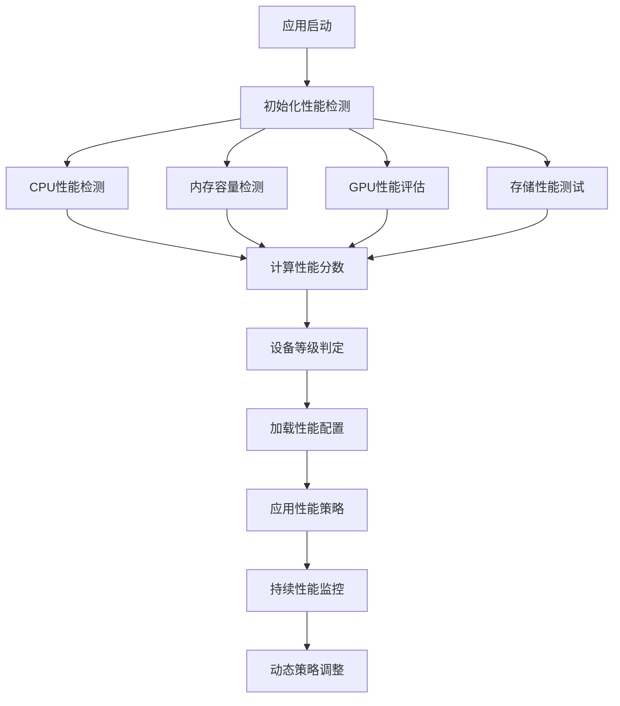

# Flutter图像去雾系统 - 设备性能检测与分级

**文档版本**: v2.0
**最后更新**: 2025-11-22
**关联文档**: [性能优化总览](00-performance-overview.md) | [架构设计](../architecture/00-overview.md)

---

## 概述

设备性能检测是Flutter图像去雾系统性能优化的基础，通过准确的设备性能评估和分级，系统能够为不同性能的设备提供最适合的性能策略，确保在各类设备上都能获得最佳的用户体验。

### 检测目标

#### 性能评估维度
- **CPU计算能力**：处理器核心数、主频、基准测试分数
- **内存容量与速度**：可用内存大小、内存访问速度
- **GPU图形性能**：GPU型号、显存容量、图形API支持
- **存储I/O性能**：读写速度、存储类型、可用空间

#### 分级策略目的
- **性能适配**：根据设备性能调整应用功能复杂度
- **资源优化**：合理分配计算资源和内存使用
- **用户体验**：确保在不同设备上都有流畅的使用体验
- **电池优化**：在低端设备上减少耗电以延长续航

---

## 设备性能检测体系

### 检测流程架构



### 检测时序规划

| 检测阶段 | 执行时机 | 检测内容 | 耗时预期 |
|---------|---------|---------|---------|
| **快速检测** | 应用启动时 | CPU核心数、内存总量 | <100ms |
| **基准测试** | 首次启动时 | CPU性能、内存速度 | 2-5秒 |
| **GPU检测** | 图像处理前 | GPU型号、显存容量 | <200ms |
| **存储测试** | 文件操作时 | 读写速度、I/O性能 | <500ms |
| **持续监控** | 运行期间 | 实时性能指标 | 持续进行 |

---

## CPU性能检测

### 处理器能力评估

#### 核心信息获取
- **核心数量**：检测CPU物理核心和逻辑核心数
- **主频信息**：获取CPU基准和最大运行频率
- **架构类型**：识别CPU架构（ARM、x64等）
- **缓存信息**：L1/L2/L3缓存大小和速度

#### 基准测试方法

| 测试项目 | 测试内容 | 评分权重 | 耗时 |
|---------|---------|---------|------|
| **整数运算** | 大数计算、质数判断 | 30% | 0.5-1秒 |
| **浮点运算** | 矩阵运算、数学函数 | 25% | 0.5-1秒 |
| **内存访问** | 数组遍历、数据结构操作 | 20% | 0.3-0.5秒 |
| **多线程** | 并发任务处理能力 | 25% | 1-2秒 |

#### 性能评分算法

```dart
// CPU性能评分计算示例
class CPUPerformanceAnalyzer {
  static const int baseScore = 1000;
  static const Map<String, double> coreMultiplier = {
    '2': 1.0,   // 双核基准
    '4': 1.8,   // 四核
    '6': 2.6,   // 六核
    '8': 3.4,   // 八核
    '12': 4.8,  // 十二核
  };

  static int calculateCPUScore({
    required int coreCount,
    required double clockSpeed,
    required int benchmarkScore,
  }) {
    final coreScore = baseScore * (coreMultiplier[coreCount.toString()] ?? 1.0);
    final speedScore = clockSpeed * 100; // GHz转换为分数
    final benchmarkNormalized = benchmarkScore ~/ 1000;

    return ((coreScore + speedScore + benchmarkNormalized) / 3).round();
  }
}
```

### 平台特定检测

#### Android平台
```dart
import 'package:device_info_plus/device_info_plus.dart';

class AndroidCPUInfo {
  static Future<CPUInfo> getCPUInfo() async {
    final androidInfo = await DeviceInfoPlugin().androidInfo;

    return CPUInfo(
      coreCount: androidInfo.hardware.cores ?? 2,
      architecture: androidInfo.hardware.architecture ?? 'ARM',
      clockSpeed: androidInfo.hardware.clockSpeed ?? 0.0,
      manufacturer: androidInfo.manufacturer,
      model: androidInfo.model,
    );
  }
}
```

#### iOS平台
```dart
import 'package:device_info_plus/device_info_plus.dart';

class IOSCPUInfo {
  static Future<CPUInfo> getCPUInfo() async {
    final iosInfo = await DeviceInfoPlugin().iosInfo;

    return CPUInfo(
      coreCount: _getCoreCountFromModel(iosInfo.model),
      architecture: 'ARM64',
      clockSpeed: _getClockSpeedFromModel(iosInfo.model),
      manufacturer: 'Apple',
      model: iosInfo.model,
    );
  }
}
```

---

## 内存性能检测

### 内存容量分析

#### 可用内存检测
- **总内存容量**：设备物理内存总量
- **可用内存**：当前可用的内存空间
- **内存压力**：系统内存使用压力等级
- **内存类型**：LPDDR4、LPDDR5等内存规格

#### 内存访问速度测试

| 测试类型 | 测试方法 | 性能指标 | 评分标准 |
|---------|---------|---------|---------|
| **顺序访问** | 大数组连续读写 | MB/s | >8000优秀 |
| **随机访问** | 随机位置读写 | MB/s | >2000优秀 |
| **分配性能** | 内存分配速度 | 分配/秒 | >100万优秀 |
| **释放性能** | 内存释放速度 | 释放/秒 | >100万优秀 |

#### 内存分级标准

| 内存容量 | 分级 | 适用场景 | 优化策略 |
|---------|------|---------|---------|
| **8GB+** | 高端 | 全功能模式 | 最大缓存、高质量渲染 |
| **4-8GB** | 中端 | 标准模式 | 中等缓存、平衡质量 |
| **2-4GB** | 低端 | 节能模式 | 最小缓存、基础功能 |
| **<2GB** | 入门 | 限制模式 | 精简功能、最小缓存 |

### 内存监控系统

```dart
class MemoryMonitor {
  static Timer? _monitorTimer;
  static const Duration monitorInterval = Duration(seconds: 5);

  static void startMonitoring() {
    _monitorTimer = Timer.periodic(monitorInterval, (_) {
      _checkMemoryUsage();
    });
  }

  static void _checkMemoryUsage() {
    final memoryInfo = _getCurrentMemoryInfo();

    if (memoryInfo.usagePercentage > 80) {
      _triggerMemoryCleanup();
    }

    if (memoryInfo.availableMemory < 100 * 1024 * 1024) { // 100MB
      _enableLowMemoryMode();
    }
  }
}
```

---

## GPU性能检测

### 图形处理能力评估

#### GPU信息获取
- **GPU型号**：具体的GPU芯片型号
- **显存容量**：GPU专用内存大小
- **图形API版本**：OpenGL ES、Metal、Vulkan版本
- **渲染管线**：支持的渲染特性

#### 图形性能基准测试

| 测试项目 | 测试内容 | 性能指标 | 评分标准 |
|---------|---------|---------|---------|
| **2D渲染** | 矢量图形绘制 | FPS | >60优秀 |
| **3D渲染** | 三维场景渲染 | FPS | >30优秀 |
| **纹理处理** | 纹理加载和处理 | MB/s | >500优秀 |
| **着色器性能** | 复杂着色器执行 | ms/frame | <16优秀 |

### GPU分级体系

#### 移动设备GPU分级

| GPU级别 | 典型GPU | 性能特征 | 适用设备 |
|---------|---------|---------|---------|
| **旗舰级** | A16 GPU, Adreno 740 | 高性能、高能效 | iPhone 14 Pro, Samsung S23 |
| **高端级** | A15 GPU, Adreno 730 | 强大性能 | iPhone 14, Google Pixel 7 |
| **中端级** | A14 GPU, Adreno 660 | 平衡性能 | iPhone 13, Xiaomi 12 |
| **入门级** | A13 GPU, Adreno 650 | 基础性能 | iPhone SE, Redmi系列 |

#### 图形特性支持

| 特性类别 | 高端支持 | 中端支持 | 低端支持 |
|---------|---------|---------|---------|
| **Metal/Vulkan** | ✅ 完整支持 | ✅ 部分支持 | ❌ 不支持 |
| **GPU计算** | ✅ 完整支持 | ✅ 基础支持 | ❌ 有限支持 |
| **高级特效** | ✅ 全特效 | ✅ 部分特效 | ❌ 基础特效 |
| **高分辨率纹理** | ✅ 4K+ | ✅ 2K | ❌ 1080P |

---

## 存储性能检测

### I/O性能评估

#### 存储类型识别
- **存储介质**：UFS 3.1、UFS 2.1、eMMC 5.1
- **读写速度**：顺序读写和随机读写性能
- **可用空间**：剩余存储空间大小
- **访问延迟**：文件访问的响应时间

#### 性能测试方法

| 测试类型 | 测试方法 | 性能目标 | 耗时预期 |
|---------|---------|---------|---------|
| **顺序读取** | 大文件连续读取 | >500MB/s | 1-2秒 |
| **顺序写入** | 大文件连续写入 | >300MB/s | 2-3秒 |
| **随机读取** | 小文件随机读取 | >50MB/s | 1-2秒 |
| **随机写入** | 小文件随机写入 | >30MB/s | 2-4秒 |

### 存储优化策略

#### 基于性能的缓存策略
```dart
class StorageBasedCacheStrategy {
  static CacheStrategy getStrategy(StoragePerformance storage) {
    if (storage.sequentialReadSpeed > 500) {
      return CacheStrategy.highPerformance; // 大文件缓存
    } else if (storage.sequentialReadSpeed > 200) {
      return CacheStrategy.balanced; // 中等大小缓存
    } else {
      return CacheStrategy.conservative; // 小文件缓存
    }
  }
}
```

---

## 综合性能分级

### 分级算法设计

#### 评分权重分配

| 性能维度 | 权重 | 评分依据 | 满分 |
|---------|------|---------|------|
| **CPU性能** | 35% | 基准测试分数 | 1000分 |
| **内存容量** | 25% | 可用内存大小 | 1000分 |
| **GPU性能** | 30% | 图形基准测试 | 1000分 |
| **存储性能** | 10% | I/O速度测试 | 1000分 |

#### 设备等级判定

| 综合分数 | 设备等级 | 性能配置 | 功能限制 |
|---------|---------|---------|---------|
| **800-1000分** | 旗舰级 | 全功能开启 | 无限制 |
| **600-800分** | 高端级 | 高性能模式 | 轻微限制 |
| **400-600分** | 中端级 | 标准模式 | 适度限制 |
| **200-400分** | 入门级 | 节能模式 | 显著限制 |
| **<200分** | 基础级 | 限制模式 | 严格限制 |

### 分级配置应用

#### 性能配置映射

```dart
enum DeviceTier {
  flagship(4),
  high(3),
  medium(2),
  low(1),
  basic(0);

  const DeviceTier(this.level);
  final int level;
}

class PerformanceConfig {
  static PerformanceConfig getConfig(DeviceTier tier) {
    switch (tier) {
      case DeviceTier.flagship:
        return PerformanceConfig(
          animationFPS: 60,
          imageQuality: ImageQuality.high,
          cacheSize: 200 * 1024 * 1024, // 200MB
          maxConcurrentTasks: 8,
        );
      case DeviceTier.high:
        return PerformanceConfig(
          animationFPS: 60,
          imageQuality: ImageQuality.medium,
          cacheSize: 100 * 1024 * 1024, // 100MB
          maxConcurrentTasks: 6,
        );
      // ... 其他等级配置
    }
  }
}
```

---

## 动态性能监控

### 实时监控机制

#### 监控指标体系
- **CPU使用率**：实时CPU占用百分比
- **内存使用量**：当前内存使用情况
- **GPU负载**：图形处理器使用率
- **电池温度**：设备温度状态
- **网络延迟**：网络请求响应时间

#### 自适应调整策略

| 触发条件 | 调整措施 | 影响范围 |
|---------|---------|---------|
| **CPU > 80%** | 降低帧率、减少并发任务 | 动画、处理任务 |
| **内存 > 85%** | 清理缓存、释放非必要资源 | 缓存系统 |
| **GPU > 75%** | 减少特效、简化渲染 | 视觉效果 |
| **电池 > 40℃** | 启用节能模式 | 全局性能 |
| **网络延迟 > 1s** | 启用离线模式 | 网络功能 |

### 性能数据收集

#### 匿名数据上报
```dart
class PerformanceAnalytics {
  static void reportPerformanceData(PerformanceData data) {
    final anonymousData = {
      'deviceTier': data.deviceTier.toString(),
      'cpuScore': data.cpuScore,
      'memoryScore': data.memoryScore,
      'gpuScore': data.gpuScore,
      'appVersion': data.appVersion,
      'timestamp': DateTime.now().millisecondsSinceEpoch,
    };

    // 发送到分析服务
    AnalyticsService.send('performance_metrics', anonymousData);
  }
}
```

---

## 最佳实践

### 检测优化建议

#### 启动时优化
1. **异步检测**：避免阻塞应用启动
2. **缓存结果**：存储检测结果避免重复计算
3. **渐进式检测**：分阶段进行不同深度的检测
4. **优雅降级**：检测失败时使用默认配置

#### 运行时优化
1. **定期重评估**：根据设备状态变化调整策略
2. **用户偏好**：允许用户手动选择性能模式
3. **智能预测**：基于使用模式预调整性能
4. **资源平衡**：在性能和功耗间找到最佳平衡

### 错误处理

#### 异常情况处理
- **检测失败**：使用保守的性能配置
- **数据异常**：过滤异常值避免误判
- **权限不足**：在有限信息下进行基本评估
- **兼容性问题**：针对不同系统版本适配

---

**文档版本**: v2.0
**最后更新**: 2025-11-22
**下一篇**: [动画性能优化](02-animation-performance.md)

---

*设备性能检测是性能优化的基础，准确的检测和分级能够确保应用在各类设备上都能提供最佳的用户体验。*