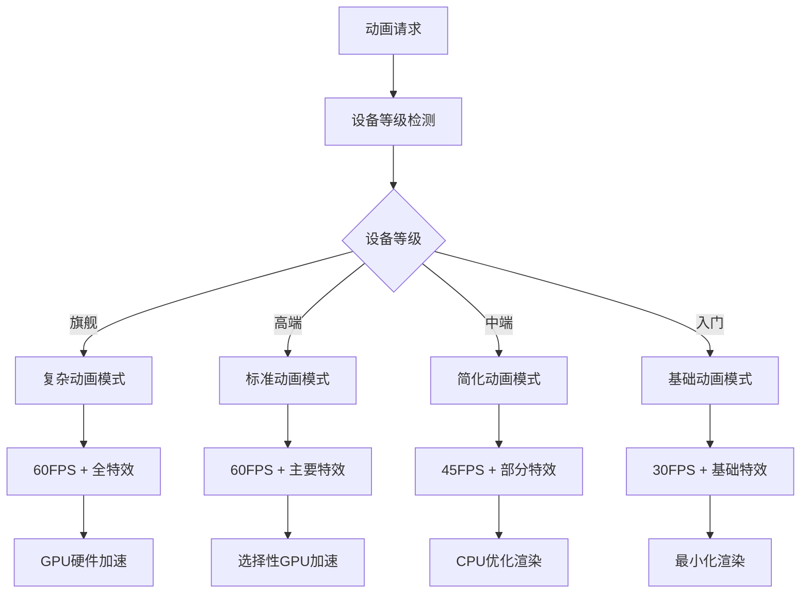

# Flutter图像去雾系统 - 动画性能优化

**文档版本**: v2.0
**最后更新**: 2025-11-22
**关联文档**: [性能优化总览](00-performance-overview.md) | [设备性能检测](01-device-performance.md)

---

## 概述

动画性能优化是提升Flutter应用用户体验的关键环节。通过科学的动画分级策略、帧率控制机制和GPU加速优化，确保在不同性能的设备上都能提供流畅自然的动画效果，同时有效控制资源消耗。

### 优化目标

#### 用户体验指标
- **流畅度**：确保动画播放的连贯性和自然性
- **响应性**：动画响应的及时性和准确性
- **一致性**：不同设备上的动画体验统一
- **能效比**：在保证性能的前提下优化功耗

#### 性能目标分级

| 设备等级 | 目标帧率 | 动画复杂度 | 特效支持 | CPU使用率 |
|---------|---------|-----------|---------|----------|
| **旗舰级** | 60FPS | 复杂动画 | 全特效 | <30% |
| **高端级** | 60FPS | 中等复杂度 | 主要特效 | <40% |
| **中端级** | 45FPS | 简化动画 | 部分特效 | <50% |
| **入门级** | 30FPS | 基础动画 | 最小特效 | <60% |

---

## 动画分级策略

### 分级体系架构



### 动画复杂度分级

#### 复杂动画（旗舰设备）
- **粒子系统**：复杂物理模拟的大规模粒子效果
- **3D变换**：完整的3D空间变换和透视效果
- **高级缓动**：自定义缓动函数和复杂曲线
- **实时阴影**：动态阴影和光照效果
- **流体动画**：流体模拟和弹性变形效果

#### 标准动画（高端设备）
- **简化粒子**：中等规模的粒子效果
- **2.5D变换**：有限的3D变换效果
- **标准缓动**：常用的缓动函数
- **静态阴影**：预计算的阴影效果
- **弹性动画**：基础的弹性变形

#### 简化动画（中端设备）
- **基础粒子**：小规模的装饰性粒子
- **2D变换**：平面内的变换效果
- **线性缓动**：简单的线性变换
- **无特效**：纯色块和渐变效果
- **基础过渡**：简单的透明度和位置变化

#### 基础动画（入门设备）
- **最小动画**：仅保留必要的界面动画
- **简单过渡**：基本的位置和透明度变化
- **无特效**：完全禁用复杂特效
- **固定缓动**：使用最简单的缓动函数
- **静态元素**：减少动态元素数量

### 动画配置策略

#### 配置映射表

| 动画类型 | 旗舰设备 | 高端设备 | 中端设备 | 入门设备 |
|---------|---------|---------|---------|---------|
| **页面切换** | 3D翻转 + 粒子 | 滑动 + 渐变 | 简单滑动 | 淡入淡出 |
| **按钮交互** | 弹性变形 + 光效 | 缩放 + 颜色渐变 | 简单缩放 | 颜色变化 |
| **列表滚动** | 物理弹性 + 视差 | 标准弹性 | 基础弹性 | 线性滚动 |
| **加载动画** | 复杂粒子系统 | 旋转加载器 | 简单加载器 | 静态提示 |
| **成功反馈** | 庆祝粒子 + 音效 | 缩放 + 颜色 | 简单缩放 | 颜色闪烁 |

---

## 帧率控制机制

### 动态帧率调整

#### 自适应帧率算法

```dart
class AdaptiveFrameRateController {
  double _targetFPS = 60.0;
  double _currentFPS = 60.0;
  final List<double> _frameTimeHistory = [];

  void updateFrameRate(double actualFrameTime) {
    _frameTimeHistory.add(actualFrameTime);
    if (_frameTimeHistory.length > 30) {
      _frameTimeHistory.removeAt(0);
    }

    final avgFrameTime = _frameTimeHistory.reduce((a, b) => a + b) / _frameTimeHistory.length;
    final currentFPS = 1000.0 / avgFrameTime;

    _adjustFrameRate(currentFPS);
  }

  void _adjustFrameRate(double currentFPS) {
    final deviceTier = DevicePerformanceDetector.currentTier;
    final targetFPS = _getTargetFPS(deviceTier);

    if (currentFPS < targetFPS * 0.8) {
      // 性能不足，降低目标帧率
      _targetFPS = Math.max(_targetFPS - 5, 30);
    } else if (currentFPS > targetFPS * 1.2) {
      // 性能有余，可以提高帧率
      _targetFPS = Math.min(_targetFPS + 5, targetFPS);
    }
  }
}
```

#### 帧率决策矩阵

| 当前帧率 | 设备负载 | 电池状态 | 用户偏好 | 调整策略 |
|---------|---------|---------|---------|---------|
| >目标*1.2 | 低 | >80% | 高性能 | 提升至目标 |
| 目标*0.8-1.2 | 中 | 50-80% | 自动 | 保持当前 |
| <目标*0.8 | 高 | <50% | 省电 | 降低帧率 |
| <目标*0.6 | 极高 | <30% | 极省电 | 最小帧率 |

### 场景化帧率策略

#### 不同界面帧率配置

| 界面类型 | 高端设备 | 中端设备 | 低端设备 | 优化考虑 |
|---------|---------|---------|---------|---------|
| **首页** | 60FPS | 45FPS | 30FPS | 第一印象，需要流畅 |
| **图像处理** | 60FPS | 30FPS | 15FPS | CPU密集型，适当降低 |
| **设置页面** | 60FPS | 60FPS | 30FPS | 简单交互，可保持高帧率 |
| **结果展示** | 60FPS | 45FPS | 30FPS | 展示效果，需要流畅 |
| **后台状态** | 30FPS | 15FPS | 10FPS | 节能优先 |

#### 动画优先级系统

```dart
enum AnimationPriority {
  critical(1.0),    // 关键动画，必须保证流畅
  important(0.8),  // 重要动画，尽量保证流畅
  normal(0.6),     // 普通动画，可适当牺牲
  low(0.4),        // 次要动画，可大幅简化
  cosmetic(0.2);   // 装饰动画，可完全禁用

  const AnimationPriority(this.weight);
  final double weight;
}

class AnimationPriorityManager {
  static void adjustAnimationBasedOnPriority() {
    final deviceLoad = DeviceMonitor.getCurrentLoad();

    for (final animation in activeAnimations) {
      if (deviceLoad > 0.8 && animation.priority.weight < 0.6) {
        animation.suspend();
      } else if (deviceLoad > 0.9 && animation.priority.weight < 0.8) {
        animation.simplify();
      }
    }
  }
}
```

---

## GPU加速优化

### 硬件加速策略

#### GPU能力检测

```dart
class GPUCapabilityDetector {
  static Future<GPUInfo> detectGPUCapabilities() async {
    final gpuInfo = GPUInfo();

    // 检测GPU型号和基本参数
    gpuInfo.model = await _getGPUModel();
    gpuInfo.maxTextureSize = await _getMaxTextureSize();
    gpuInfo.supportsComputeShaders = await _checkComputeShaderSupport();
    gpuInfo.openGLVersion = await _getOpenGLVersion();

    // 运行GPU基准测试
    gpuInfo.benchmarkScore = await _runGPUBenchmark();

    return gpuInfo;
  }

  static GPUAccelerationLevel determineAccelerationLevel(GPUInfo info) {
    if (info.benchmarkScore > 8000 && info.supportsComputeShaders) {
      return GPUAccelerationLevel.full; // 完全GPU加速
    } else if (info.benchmarkScore > 4000) {
      return GPUAccelerationLevel.partial; // 部分GPU加速
    } else {
      return GPUAccelerationLevel.minimal; // 最小GPU加速
    }
  }
}
```

#### 加速策略分级

| GPU等级 | 加速策略 | 渲染管线 | 纹理压缩 | 计算着色器 |
|---------|---------|---------|---------|-----------|
| **旗舰级** | 完全硬件加速 | GPU渲染管线 | ASTC/ETC2 | 完整支持 |
| **高端级** | 主要硬件加速 | 混合渲染管线 | ETC2/PVRTC | 部分支持 |
| **中端级** | 选择性加速 | CPU+GPU混合 | 基础压缩 | 有限支持 |
| **入门级** | 最小硬件加速 | 主要CPU渲染 | 无压缩 | 不支持 |

### 渲染优化技术

#### 批处理渲染

```dart
class RenderBatchOptimizer {
  final List<RenderObject> _batchQueue = [];

  void addToBatch(RenderObject object) {
    if (_canBatch(object)) {
      _batchQueue.add(object);
    } else {
      _flushBatch();
      object.render();
    }
  }

  void _flushBatch() {
    if (_batchQueue.isNotEmpty) {
      final batchedRenderData = _prepareBatchData(_batchQueue);
      _renderBatch(batchedRenderData);
      _batchQueue.clear();
    }
  }

  bool _canBatch(RenderObject object) {
    return _batchQueue.length < maxBatchSize &&
           _isCompatibleWithBatch(object, _batchQueue);
  }
}
```

#### 纹理优化策略

| 优化技术 | 实现方式 | 内存节省 | 性能提升 | 适用设备 |
|---------|---------|---------|---------|---------|
| **纹理压缩** | ASTC/ETC2/PVRTC | 50-70% | 20-30% | 全设备 |
| **纹理图集** | 多图合并为一张 | 30-40% | 40-50% | 全设备 |
| **Mipmap生成** | 多级纹理 | 33%额外 | 减少带宽消耗 | 中高端 |
| **纹理流式加载** | 按需加载 | 60-80% | 减少启动时间 | 大型应用 |

---

## 特效性能优化

### 粒子系统优化

#### 粒子数量控制

```dart
class ParticleSystemOptimizer {
  static const Map<DeviceTier, int> maxParticleCounts = {
    DeviceTier.flagship: 1000,
    DeviceTier.high: 500,
    DeviceTier.medium: 200,
    DeviceTier.low: 50,
    DeviceTier.basic: 20,
  };

  static int optimizeParticleCount(int baseCount, DeviceTier tier) {
    final maxCount = maxParticleCounts[tier] ?? 20;
    return Math.min(baseCount, maxCount);
  }

  static void adjustParticleQuality(ParticleSystem system, DeviceTier tier) {
    switch (tier) {
      case DeviceTier.flagship:
        system.enablePhysics = true;
        system.enableCollisions = true;
        system.textureQuality = TextureQuality.high;
        break;
      case DeviceTier.high:
        system.enablePhysics = true;
        system.enableCollisions = false;
        system.textureQuality = TextureQuality.medium;
        break;
      // ... 其他等级配置
    }
  }
}
```

#### 粒子效果分级

| 特效类型 | 旗舰设备 | 高端设备 | 中端设备 | 入门设备 |
|---------|---------|---------|---------|---------|
| **图像处理成功** | 500个庆祝粒子 | 200个彩色粒子 | 50个简单粒子 | 20个点状粒子 |
| **加载动画** | 流体粒子动画 | 旋转粒子系统 | 简单旋转动画 | 静态加载图标 |
| **按钮点击** | 波纹扩散 + 粒子 | 波纹扩散 | 简单缩放 | 颜色变化 |
| **页面切换** | 粒子消散效果 | 渐变过渡 | 滑动效果 | 淡入淡出 |

### 阴影与光照优化

#### 阴影渲染策略

```dart
class ShadowOptimizer {
  static ShadowQuality determineShadowQuality(DeviceTier tier) {
    switch (tier) {
      case DeviceTier.flagship:
        return ShadowQuality.realtime; // 实时阴影
      case DeviceTier.high:
        return ShadowQuality.cached; // 缓存阴影
      case DeviceTier.medium:
        return ShadowQuality.precomputed; // 预计算阴影
      case DeviceTier.low:
        return ShadowQuality.simple; // 简单阴影
      case DeviceTier.basic:
        return ShadowQuality.none; // 无阴影
    }
  }
}
```

#### 光照效果分级

| 光照特性 | 旗舰设备 | 高端设备 | 中端设备 | 入门设备 |
|---------|---------|---------|---------|---------|
| **动态光照** | 实时光照计算 | 简化光照模型 | 预设光照效果 | 无光照 |
| **环境光遮蔽** | SSAO效果 | 简化AO | 预计算AO | 无AO |
| **反射效果** | 实时反射 | 环境贴图 | 简单反射 | 无反射 |
| **折射效果** | 复杂折射 | 简单折射 | 基础折射 | 无折射 |

---

## 性能监控与调试

### 动画性能监控

#### 实时性能指标

```dart
class AnimationPerformanceMonitor {
  static void startMonitoring() {
    WidgetsBinding.instance.addPostFrameCallback(_onFrameEnd);
  }

  static void _onFrameEnd(Duration timestamp) {
    final frameTime = timestamp.inMicroseconds.toDouble();

    // 记录帧时间
    _frameTimeHistory.add(frameTime);
    if (_frameTimeHistory.length > 60) {
      _frameTimeHistory.removeAt(0);
    }

    // 计算性能指标
    _calculateMetrics();

    // 继续监控
    WidgetsBinding.instance.addPostFrameCallback(_onFrameEnd);
  }

  static void _calculateMetrics() {
    final avgFrameTime = _frameTimeHistory.reduce((a, b) => a + b) / _frameTimeHistory.length;
    final fps = 1000000.0 / avgFrameTime;

    if (fps < _targetFPS * 0.8) {
      PerformanceLogger.warn('Animation performance drop detected: ${fps.toStringAsFixed(1)} FPS');
    }
  }
}
```

#### 性能告警系统

| 告警级别 | 触发条件 | 处理措施 | 通知方式 |
|---------|---------|---------|---------|
| **严重** | FPS < 目标*0.5 | 立即降级动画质量 | 控制台警告 |
| **警告** | FPS < 目标*0.7 | 调整动画复杂度 | 静默日志 |
| **提醒** | FPS < 目标*0.9 | 监控性能变化 | 调试信息 |
| **正常** | FPS ≥ 目标*0.9 | 保持当前设置 | 无需处理 |

### 调试工具集成

#### Flutter DevTools集成

```dart
class AnimationDevToolsIntegration {
  static void setupDevTools() {
    if (kDebugMode) {
      // 注册动画性能数据到DevTools
      DevTools.registerExtension('ext.animation.performance', _handlePerformanceQuery);
      DevTools.registerExtension('ext.animation.control', _handleAnimationControl);
    }
  }

  static Map<String, dynamic> _handlePerformanceQuery(Map<String, String> params) {
    return {
      'currentFPS': _currentFPS,
      'targetFPS': _targetFPS,
      'activeAnimations': _activeAnimations.length,
      'droppedFrames': _droppedFrames,
      'averageFrameTime': _averageFrameTime,
    };
  }
}
```

---

## 最佳实践

### 动画设计原则

#### 性能优先设计
1. **简洁为主**：避免过度复杂的动画效果
2. **意义明确**：每个动画都应有明确的用户价值
3. **渐进增强**：基础功能在所有设备上可用，特效在高端设备上增强
4. **用户控制**：允许用户根据偏好调整动画设置

#### 资源管理原则
1. **及时释放**：动画结束后立即释放相关资源
2. **预加载策略**：合理预加载常用动画资源
3. **内存监控**：持续监控动画相关的内存使用
4. **缓存优化**：智能缓存动画结果避免重复计算

### 常见问题解决

#### 性能问题排查

| 症状 | 可能原因 | 解决方案 | 预防措施 |
|---------|---------|---------|---------|
| **动画卡顿** | 帧率过低 | 降低复杂度、启用GPU加速 | 预先测试、分级设计 |
| **内存泄漏** | 资源未释放 | 检查生命周期、强制释放 | 自动管理、定期检查 |
| **发热严重** | 过度计算 | 减少计算量、优化算法 | 性能监控、自适应调整 |
| **电池消耗快** | 频繁重绘 | 减少重绘频率、优化渲染 | 智能暂停、节能模式 |

#### 优化策略建议

1. **启动阶段**：使用简化的启动动画，避免复杂特效
2. **交互阶段**：重点优化用户交互相关的动画响应性
3. **处理阶段**：在图像处理时降低动画复杂度
4. **展示阶段**：在结果展示时使用高质量的动画效果

---

**文档版本**: v2.0
**最后更新**: 2025-11-22
**上一篇**: [设备性能检测](01-device-performance.md)
**下一篇**: [内存管理策略](03-memory-management.md)

---

*动画性能优化需要在视觉效果和性能消耗之间找到最佳平衡点，通过科学的分级策略和自适应调整，确保在各类设备上都能提供优秀的用户体验。*