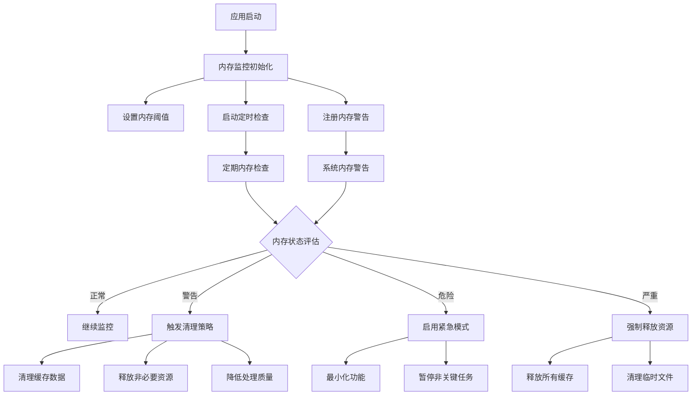
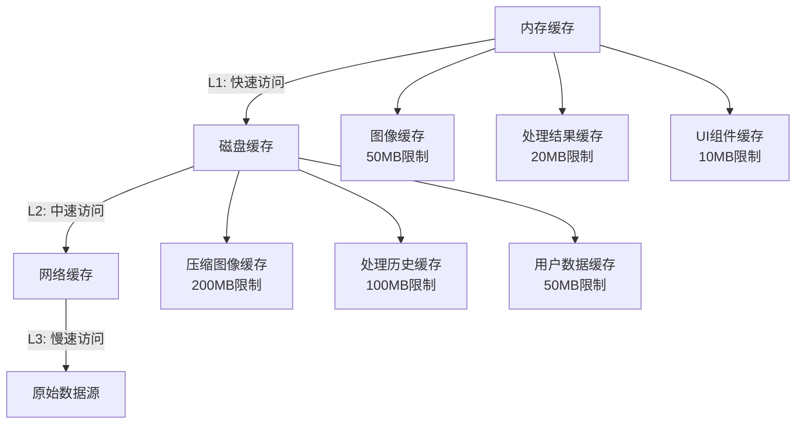

# Flutter图像去雾系统 - 内存管理策略

**文档版本**: v2.0
**最后更新**: 2025-11-22
**关联文档**: [性能优化总览](00-performance-overview.md) | [设备性能检测](01-device-performance.md)

---

## 概述

内存管理是Flutter图像去雾系统性能优化的核心环节。由于图像处理涉及大量内存操作，科学的内存管理策略能够有效防止内存泄漏、减少内存占用、提升应用稳定性，确保在内存受限的移动设备上也能流畅运行。

### 管理目标

#### 核心目标
- **预防内存泄漏**：及时释放不再使用的内存资源
- **控制内存峰值**：避免内存使用量超过设备限制
- **提升内存效率**：最大化内存利用率，减少内存碎片
- **保证应用稳定性**：防止因内存不足导致的应用崩溃

#### 性能指标

| 指标类型 | 高端设备目标 | 中端设备目标 | 低端设备目标 |
|---------|-------------|-------------|-------------|
| **内存峰值** | <300MB | <200MB | <150MB |
| **内存泄漏率** | <1MB/小时 | <2MB/小时 | <3MB/小时 |
| **GC频率** | <10次/分钟 | <15次/分钟 | <20次/分钟 |
| **内存碎片率** | <15% | <20% | <25% |

---

## 内存监控体系

### 实时监控架构



### 内存状态分级

#### 监控指标定义

| 监控项目 | 检测方法 | 正常范围 | 警告阈值 | 危险阈值 |
|---------|---------|---------|---------|---------|
| **内存使用率** | 系统API获取 | <70% | 70-85% | >85% |
| **可用内存** | 系统查询 | >200MB | 100-200MB | <100MB |
| **内存增长速度** | 历史对比 | <1MB/分钟 | 1-5MB/分钟 | >5MB/分钟 |
| **GC频率** | Dart VM监控 | <10次/分钟 | 10-20次/分钟 | >20次/分钟 |
| **内存碎片** | 内存分析器 | <15% | 15-25% | >25% |

#### 内存监控实现

```dart
class MemoryMonitor {
  static const Duration checkInterval = Duration(seconds: 10);
  static const double warningThreshold = 0.7;
  static const double dangerThreshold = 0.85;

  static Timer? _monitorTimer;
  static final List<int> _memoryHistory = [];

  static void startMonitoring() {
    _monitorTimer = Timer.periodic(checkInterval, (_) {
      _checkMemoryStatus();
    });
  }

  static void _checkMemoryStatus() {
    final memoryInfo = _getCurrentMemoryInfo();
    _memoryHistory.add(memoryInfo.totalUsage);

    if (_memoryHistory.length > 60) {
      _memoryHistory.removeAt(0);
    }

    final usageRate = memoryInfo.usageRate;
    final trend = _calculateGrowthTrend();

    if (usageRate > dangerThreshold || trend > 5.0) {
      _triggerEmergencyCleanup();
    } else if (usageRate > warningThreshold || trend > 1.0) {
      _triggerPreventiveCleanup();
    }
  }
}
```

---

## 资源生命周期管理

### 图像资源管理

#### 图像内存占用分析

| 图像类型 | 典型分辨率 | 内存占用（未压缩） | 内存占用（压缩） | 优化策略 |
|---------|-----------|------------------|----------------|---------|
| **输入图像** | 1920x1080 | 8MB | 2-4MB | 按需加载、压缩存储 |
| **处理结果** | 1920x1080 | 8MB | 1-3MB | 渐进式加载、格式优化 |
| **缩略图** | 200x200 | 0.15MB | 0.05MB | 预生成、缓存复用 |
| **预览图** | 800x600 | 2MB | 0.5MB | 动态生成、及时释放 |

#### 图像资源生命周期

```dart
class ImageResourceManager {
  final Map<String, ImageMemoryInfo> _activeImages = {};
  final Map<String, ImageMemoryInfo> _cachedImages = {};
  final Queue<String> _lruQueue = Queue();

  // 注册图像资源
  void registerImage(String key, Image image, ImageType type) {
    final memoryInfo = ImageMemoryInfo(
      key: key,
      image: image,
      type: type,
      size: _calculateImageMemorySize(image),
      lastAccessed: DateTime.now(),
    );

    _activeImages[key] = memoryInfo;
    _updateLRUQueue(key);

    // 检查是否需要清理
    _checkMemoryPressure();
  }

  // 释放图像资源
  void releaseImage(String key) {
    final info = _activeImages.remove(key);
    if (info != null) {
      // 移动到缓存
      if (_shouldCache(info)) {
        _cachedImages[key] = info;
      } else {
        _disposeImage(info);
      }
    }
    _lruQueue.remove(key);
  }

  // 清理最老的资源
  void _evictOldestResources() {
    while (_shouldEvictResources() && _lruQueue.isNotEmpty) {
      final oldestKey = _lruQueue.removeFirst();
      releaseImage(oldestKey);
    }
  }
}
```

### 内存清理策略

#### 自动清理触发条件

| 触发条件 | 清理级别 | 清理范围 | 预期效果 |
|---------|---------|---------|---------|
| **内存使用率 > 80%** | 轻度清理 | 清理过期缓存 | 释放10-20%内存 |
| **内存使用率 > 85%** | 中度清理 | 清理所有缓存 + 非关键资源 | 释放20-40%内存 |
| **内存使用率 > 90%** | 深度清理 | 释放所有可释放资源 | 释放40-60%内存 |
| **系统内存警告** | 紧急清理 | 强制释放所有非必要资源 | 释放60-80%内存 |

#### 分级清理实现

```dart
enum MemoryCleanupLevel {
  light(0.1),      // 清理10%内存
  moderate(0.3),   // 清理30%内存
  deep(0.5),       // 清理50%内存
  emergency(0.8);  // 清理80%内存

  const MemoryCleanupLevel(this.targetRatio);
  final double targetRatio;
}

class MemoryCleanupManager {
  static Future<void> cleanup(MemoryCleanupLevel level) async {
    switch (level) {
      case MemoryCleanupLevel.light:
        await _performLightCleanup();
        break;
      case MemoryCleanupLevel.moderate:
        await _performLightCleanup();
        await _performModerateCleanup();
        break;
      case MemoryCleanupLevel.deep:
        await _performLightCleanup();
        await _performModerateCleanup();
        await _performDeepCleanup();
        break;
      case MemoryCleanupLevel.emergency:
        await _performEmergencyCleanup();
        break;
    }

    // 强制垃圾回收
    await _forceGarbageCollection();
  }

  static Future<void> _performLightCleanup() async {
    // 清理过期缓存
    await CacheManager.clearExpiredCache();

    // 释放不活跃的图像资源
    await ImageResourceManager.releaseInactiveImages();

    // 清理临时文件
    await TempFileManager.cleanup();
  }

  static Future<void> _performModerateCleanup() async {
    // 清理所有缓存
    await CacheManager.clearAllCache();

    // 释放非关键的UI资源
    await UIResourceManager.releaseNonCriticalResources();
  }

  static Future<void> _performDeepCleanup() async {
    // 释放所有可释放的资源
    await ResourceManager.releaseAllReleasableResources();

    // 降低图像处理质量
    ImageProcessingManager.reduceQuality();
  }

  static Future<void> _performEmergencyCleanup() async {
    // 停止所有非关键任务
    TaskManager.pauseNonCriticalTasks();

    // 释放最大可能的内存
    await ResourceManager.emergencyRelease();

    // 切换到最小功能模式
    AppManager.enterMinimalMode();
  }
}
```

---

## 缓存策略优化

### 多级缓存架构

#### 缓存层级设计



#### 缓存容量配置

| 缓存类型 | 高端设备 | 中端设备 | 低端设备 | 淘汰策略 |
|---------|---------|---------|---------|---------|
| **内存缓存** | 100MB | 50MB | 25MB | LRU + 时间过期 |
| **磁盘缓存** | 500MB | 200MB | 100MB | LRU + 频率优先 |
| **图像缓存** | 50MB | 25MB | 10MB | 智能预测 + LRU |
| **处理缓存** | 30MB | 15MB | 5MB | 最近使用 + 大小优先 |

### 缓存算法优化

#### 智能缓存淘汰

```dart
class SmartCacheEvictionStrategy {
  final Map<String, CacheItem> _cacheItems = {};
  final Map<String, double> _accessFrequencies = {};
  final Map<String, DateTime> _lastAccessTimes = {};

  String? selectEvictionCandidate(int requiredSpace) {
    final candidates = _getEvictionCandidates(requiredSpace);

    if (candidates.isEmpty) return null;

    // 综合考虑访问频率、最后访问时间、文件大小
    String? bestCandidate;
    double bestScore = double.infinity;

    for (final candidate in candidates) {
      final score = _calculateEvictionScore(candidate);
      if (score < bestScore) {
        bestScore = score;
        bestCandidate = candidate;
      }
    }

    return bestCandidate;
  }

  double _calculateEvictionScore(String key) {
    final frequency = _accessFrequencies[key] ?? 0.0;
    final lastAccess = _lastAccessTimes[key] ?? DateTime.now();
    final item = _cacheItems[key]!;

    // 分数越低越容易被淘汰
    final timeFactor = DateTime.now().difference(lastAccess).inHours;
    final sizeFactor = item.size / (1024 * 1024); // MB
    final frequencyFactor = 1.0 / (frequency + 1.0);

    return timeFactor * sizeFactor * frequencyFactor;
  }
}
```

#### 预测性缓存

```dart
class PredictiveCacheManager {
  final Map<String, AccessPattern> _userPatterns = {};
  final List<String> _accessHistory = [];

  void recordAccess(String itemKey) {
    _accessHistory.add(itemKey);
    if (_accessHistory.length > 1000) {
      _accessHistory.removeAt(0);
    }

    _updateAccessPattern(itemKey);
    _predictNextAccess(itemKey);
  }

  void _predictNextAccess(String currentKey) {
    final pattern = _userPatterns[currentKey];
    if (pattern != null && pattern.nextItemProbability > 0.7) {
      _preloadCache(pattern.nextItem);
    }
  }

  void _preloadCache(String itemKey) {
    // 在后台线程预加载预测的缓存项
    Compute.run(() async {
      final data = await DataSource.loadData(itemKey);
      CacheManager.put(itemKey, data);
    });
  }
}
```

---

## 内存泄漏防护

### 泄漏检测机制

#### 自动泄漏检测

```dart
class MemoryLeakDetector {
  static final Map<Type, int> _instanceCounters = {};
  static final Map<String, WeakReference> _trackedObjects = {};

  static void trackObject(Object object, String tag) {
    _trackedObjects[tag] = WeakReference(object);

    final type = object.runtimeType;
    _instanceCounters[type] = (_instanceCounters[type] ?? 0) + 1;

    // 定期检查对象是否被释放
    Timer(Duration(seconds: 30), () {
      _checkObjectReleased(tag);
    });
  }

  static void _checkObjectReleased(String tag) {
    final weakRef = _trackedObjects[tag];
    if (weakRef?.target == null) {
      // 对象已正确释放
      _trackedObjects.remove(tag);
    } else {
      // 可能存在内存泄漏
      MemoryLogger.warn('Potential memory leak detected for object: $tag');

      // 尝试强制释放
      _forceRelease(tag);
    }
  }

  static void generateLeakReport() {
    final report = StringBuffer();
    report.writeln('Memory Leak Report - ${DateTime.now()}');
    report.writeln('=====================================');

    _instanceCounters.forEach((type, count) {
      report.writeln('$type: $count instances');
    });

    report.writeln('\nTracked Objects: ${_trackedObjects.length}');
    Logger.info(report.toString());
  }
}
```

#### 常见泄漏场景防护

| 泄漏场景 | 检测方法 | 防护措施 | 自动修复 |
|---------|---------|---------|---------|
| **事件监听器未移除** | 引用计数检查 | 自动移除监听器 | 定时扫描清理 |
| **Timer未取消** | Timer注册表 | 自动取消Timer | 应用暂停时清理 |
| **Stream未关闭** | Stream订阅跟踪 | 自动关闭Stream | 页面销毁时清理 |
| **图像资源未释放** | 内存使用监控 | 强制释放图像 | 内存压力时清理 |
| **缓存未清理** | 缓存大小监控 | 自动清理过期 | 定时清理任务 |

### 资源释放策略

#### 生命周期绑定释放

```dart
class LifecycleAwareResourceManager {
  static final Map<String, List<Disposable>> _lifecycleResources = {};

  static void bindToLifecycle(String lifecycleKey, Disposable resource) {
    final resources = _lifecycleResources.putIfAbsent(lifecycleKey, () => []);
    resources.add(resource);
  }

  static void disposeLifecycleResources(String lifecycleKey) {
    final resources = _lifecycleResources.remove(lifecycleKey);
    if (resources != null) {
      for (final resource in resources) {
        try {
          resource.dispose();
        } catch (e) {
          Logger.error('Failed to dispose resource: $e');
        }
      }
    }
  }
}

// 使用示例
class ImageProcessingWidget extends StatefulWidget {
  @override
  _ImageProcessingWidgetState createState() => _ImageProcessingWidgetState();
}

class _ImageProcessingWidgetState extends State<ImageProcessingWidget> {
  late StreamSubscription _processingSubscription;
  late Timer _progressTimer;

  @override
  void initState() {
    super.initState();

    _processingSubscription = ProcessingService.onProgress.listen(_onProgress);
    LifecycleAwareResourceManager.bindToLifecycle(
        widget.runtimeType.toString(), _processingSubscription);

    _progressTimer = Timer.periodic(Duration(seconds: 1), _updateProgress);
    LifecycleAwareResourceManager.bindToLifecycle(
        widget.runtimeType.toString(), _progressTimer);
  }

  @override
  void dispose() {
    // 自动释放绑定的资源
    LifecycleAwareResourceManager.disposeLifecycleResources(runtimeType.toString());
    super.dispose();
  }
}
```

---

## 内存优化最佳实践

### 图像处理优化

#### 内存使用优化策略

| 优化技术 | 实现方式 | 内存节省 | 性能影响 | 适用场景 |
|---------|---------|---------|---------|---------|
| **图像压缩** | 有损/无损压缩 | 50-80% | 轻微影响 | 存储和传输 |
| **分块处理** | 大图分块处理 | 60-90% | 处理时间增加 | 大型图像 |
| **格式转换** | 选择高效格式 | 30-50% | 转换开销 | 存储优化 |
| **分辨率降级** | 降低处理分辨率 | 50-75% | 质量下降 | 预览和快速处理 |
| **色彩空间优化** | 减少色彩深度 | 25-50% | 色彩精度降低 | 特定场景 |

#### 处理流水线优化

```dart
class MemoryOptimizedProcessingPipeline {
  static Future<ProcessedImage> processImage(
    InputImage input,
    ProcessingOptions options,
  ) async {
    final deviceTier = DevicePerformanceDetector.currentTier;

    // 根据设备等级调整处理策略
    final optimizedOptions = _optimizeOptionsForDevice(options, deviceTier);

    // 分块处理大图像
    if (_shouldUseTileProcessing(input, deviceTier)) {
      return await _processInTiles(input, optimizedOptions);
    } else {
      return await _processDirectly(input, optimizedOptions);
    }
  }

  static ProcessingOptions _optimizeOptionsForDevice(
    ProcessingOptions options,
    DeviceTier tier,
  ) {
    switch (tier) {
      case DeviceTier.flagship:
        return options; // 保持原始高质量
      case DeviceTier.high:
        return options.copyWith(
          quality: Quality.high,
          enableAdvancedFeatures: true,
        );
      case DeviceTier.medium:
        return options.copyWith(
          quality: Quality.medium,
          tileSize: 512,
          enableAdvancedFeatures: false,
        );
      case DeviceTier.low:
        return options.copyWith(
          quality: Quality.low,
          tileSize: 256,
          enableAdvancedFeatures: false,
          maxMemoryUsage: 50 * 1024 * 1024, // 50MB限制
        );
      case DeviceTier.basic:
        return options.copyWith(
          quality: Quality.minimum,
          tileSize: 128,
          enableAdvancedFeatures: false,
          maxMemoryUsage: 25 * 1024 * 1024, // 25MB限制
        );
    }
  }
}
```

### 代码优化建议

#### 内存使用模式优化

1. **对象池化**：重用频繁创建的对象
2. **懒加载**：延迟初始化非必要资源
3. **弱引用**：使用WeakReference避免强引用
4. **及时释放**：不再使用时立即释放资源
5. **批量操作**：合并小的内存操作

#### 调试和监控工具

```dart
class MemoryProfiler {
  static void enableProfiling() {
    if (kDebugMode) {
      // 记录内存分配
      DartVm.allocateMemory = _onMemoryAllocate;

      // 记录内存释放
      DartVm.freeMemory = _onMemoryFree;

      // 定期生成内存报告
      Timer.periodic(Duration(minutes: 5), (_) {
        _generateMemoryReport();
      });
    }
  }

  static void _onMemoryAllocate(int size, String type) {
    MemoryLogger.debug('Memory allocated: ${size}B, type: $type');
  }

  static void _onMemoryFree(int size, String type) {
    MemoryLogger.debug('Memory freed: ${size}B, type: $type');
  }

  static void _generateMemoryReport() {
    final heap = MemoryProfiler.getHeapInfo();
    final report = {
      'timestamp': DateTime.now().toIso8601String(),
      'heapUsed': heap.used,
      'heapCapacity': heap.capacity,
      'externalUsed': heap.external,
    };

    MemoryLogger.info('Memory Report: $report');
  }
}
```

---

**文档版本**: v2.0
**最后更新**: 2025-11-22
**上一篇**: [动画性能优化](02-animation-performance.md)
**下一篇**: [渲染优化技术](04-rendering-optimization.md)

---

*有效的内存管理是Flutter应用稳定运行的基础，通过科学的监控体系、智能的缓存策略和严格的泄漏防护，确保应用在各类设备上都能提供稳定可靠的性能表现。*