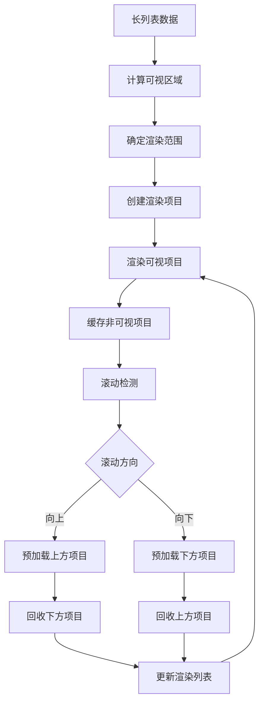

# Flutter图像去雾系统 - 渲染优化技术

**文档版本**: v2.0
**最后更新**: 2025-11-22
**关联文档**: [性能优化总览](00-performance-overview.md) | [动画性能优化](02-animation-performance.md)

---

## 概述

渲染优化是Flutter应用性能提升的关键环节，直接影响用户界面的流畅度和响应性。通过科学的懒加载策略、虚拟化技术、图像优化和渲染管线优化，显著提升Flutter图像去雾系统的渲染性能，确保在各类设备上都能提供流畅的用户体验。

### 优化目标

#### 核心性能指标
- **渲染帧率**：保持稳定的60FPS或目标帧率
- **渲染延迟**：减少从状态变化到屏幕显示的时间
- **GPU利用率**：充分利用GPU硬件加速能力
- **内存带宽**：优化内存使用和传输效率

#### 性能目标分级

| 设备等级 | 目标FPS | 渲染延迟 | GPU使用率 | 内存带宽 |
|---------|---------|---------|----------|---------|
| **旗舰级** | 60FPS | <16ms | 60-80% | 高效利用 |
| **高端级** | 60FPS | <16ms | 50-70% | 优化利用 |
| **中端级** | 45FPS | <22ms | 40-60% | 适度利用 |
| **入门级** | 30FPS | <33ms | 30-50% | 节约利用 |

---

## 懒加载实现策略

### 页面级懒加载

#### 路由懒加载架构

```mermaid
graph TD
    A[用户导航] --> B[路由解析]
    B --> C[检查页面是否已加载]
    C -->{已加载}

    C -->|是| D[显示缓存页面]
    C -->|否| E[创建页面加载任务]

    E --> F[后台加载页面代码]
    F --> G[加载页面资源]
    G --> H[初始化页面状态]
    H --> I[显示页面]

    I --> J[缓存页面实例]
    J --> K[预加载关联页面]
```

#### 懒加载实现方案

```dart
class LazyRouteManager {
  static final Map<String, Widget Function()> _routeBuilders = {};
  static final Map<String, Widget> _cachedWidgets = {};

  static void registerRoute(String routeName, Widget Function() builder) {
    _routeBuilders[routeName] = builder;
  }

  static Future<Widget> getWidget(String routeName) async {
    // 检查缓存
    if (_cachedWidgets.containsKey(routeName)) {
      return _cachedWidgets[routeName]!;
    }

    // 检查注册
    final builder = _routeBuilders[routeName];
    if (builder == null) {
      throw RouteNotFoundException(routeName);
    }

    // 显示加载指示器
    final loadingWidget = _showLoadingIndicator();

    try {
      // 在isolate中加载页面
      final widget = await compute(_buildWidget, routeName);

      // 缓存结果
      _cachedWidgets[routeName] = widget;

      // 预加载关联路由
      _preloadRelatedRoutes(routeName);

      return widget;
    } catch (e) {
      return _showErrorWidget(e);
    } finally {
      _hideLoadingIndicator(loadingWidget);
    }
  }

  static void _preloadRelatedRoutes(String currentRoute) {
    final relatedRoutes = _getRelatedRoutes(currentRoute);

    for (final route in relatedRoutes) {
      if (!_cachedWidgets.containsKey(route)) {
        // 异步预加载
        Future.delayed(Duration(milliseconds: 500), () {
          getWidget(route);
        });
      }
    }
  }
}
```

### 组件级懒加载

#### 智能组件加载

```dart
class LazyWidget<T extends StatefulWidget> extends StatefulWidget {
  final Widget Function(BuildContext) placeholderBuilder;
  final Future<T> Function() widgetLoader;
  final Duration timeout;

  const LazyWidget({
    Key? key,
    required this.placeholderBuilder,
    required this.widgetLoader,
    this.timeout = const Duration(seconds: 5),
  }) : super(key: key);

  @override
  _LazyWidgetState createState() => _LazyWidgetState();
}

class _LazyWidgetState extends State<LazyWidget> {
  Widget? _loadedWidget;
  bool _isLoading = false;
  bool _hasError = false;

  @override
  void initState() {
    super.initState();
    _loadWidgetWhenNeeded();
  }

  void _loadWidgetWhenNeeded() {
    // 只有当组件即将进入视口时才开始加载
    WidgetsBinding.instance.addPostFrameCallback((_) {
      if (_isWidgetVisible() && !_isLoading) {
        _loadWidget();
      }
    });
  }

  Future<void> _loadWidget() async {
    if (_isLoading || _loadedWidget != null) return;

    setState(() {
      _isLoading = true;
      _hasError = false;
    });

    try {
      final future = widget.widgetLoader();
      final loadedWidget = await future.timeout(widget.timeout);

      if (mounted) {
        setState(() {
          _loadedWidget = loadedWidget;
          _isLoading = false;
        });
      }
    } catch (e) {
      if (mounted) {
        setState(() {
          _hasError = true;
          _isLoading = false;
        });
      }
    }
  }

  @override
  Widget build(BuildContext context) {
    if (_loadedWidget != null) {
      return _loadedWidget!;
    }

    if (_hasError) {
      return _buildErrorWidget();
    }

    if (_isLoading) {
      return _buildLoadingWidget();
    }

    return widget.placeholderBuilder(context);
  }
}
```

### 数据懒加载

#### 分页数据加载

```dart
class PaginatedDataLoader<T> {
  final Future<List<T>> Function(int page, int pageSize) dataFetcher;
  final int pageSize;
  final List<T> _items = [];
  int _currentPage = 0;
  bool _hasMore = true;
  bool _isLoading = false;

  PaginatedDataLoader({
    required this.dataFetcher,
    this.pageSize = 20,
  });

  Future<List<T>> loadNextPage() async {
    if (_isLoading || !_hasMore) return _items;

    _isLoading = true;

    try {
      final newItems = await dataFetcher(_currentPage, pageSize);

      _items.addAll(newItems);
      _currentPage++;
      _hasMore = newItems.length == pageSize;

      return List.from(_items);
    } finally {
      _isLoading = false;
    }
  }

  Future<void> refresh() async {
    _items.clear();
    _currentPage = 0;
    _hasMore = true;
    _isLoading = false;

    await loadNextPage();
  }
}
```

---

## 虚拟化列表优化

### 列表虚拟化架构

#### 可视区域渲染策略



#### 高性能虚拟列表实现

```dart
class VirtualizedListView<T> extends StatefulWidget {
  final List<T> items;
  final Widget Function(BuildContext context, T item, int index) itemBuilder;
  final double itemHeight;
  final int prefetchCount;

  const VirtualizedListView({
    Key? key,
    required this.items,
    required this.itemBuilder,
    required this.itemHeight,
    this.prefetchCount = 3,
  }) : super(key: key);

  @override
  _VirtualizedListViewState<T> createState() => _VirtualizedListViewState<T>();
}

class _VirtualizedListViewState<T> extends State<VirtualizedListView<T>> {
  late ScrollController _scrollController;
  final Map<int, Widget> _itemCache = {};
  int _firstVisibleIndex = 0;
  int _lastVisibleIndex = 0;

  @override
  void initState() {
    super.initState();
    _scrollController = ScrollController();
    _scrollController.addListener(_onScroll);
  }

  void _onScroll() {
    if (_scrollController.hasClients) {
      final offset = _scrollController.offset;
      final viewportHeight = _scrollController.position.viewportDimension;

      final newFirstIndex = (offset / widget.itemHeight).floor();
      final newLastIndex = ((offset + viewportHeight) / widget.itemHeight).ceil();

      if (newFirstIndex != _firstVisibleIndex || newLastIndex != _lastVisibleIndex) {
        setState(() {
          _firstVisibleIndex = newFirstIndex;
          _lastVisibleIndex = newLastIndex;
          _updateItemCache();
        });
      }
    }
  }

  void _updateItemCache() {
    // 清理不可视区域的缓存
    _itemCache.removeWhere((index, _) {
      return index < _firstVisibleIndex - widget.prefetchCount ||
             index > _lastVisibleIndex + widget.prefetchCount;
    });

    // 预加载可视区域附近的项目
    final startIndex = Math.max(0, _firstVisibleIndex - widget.prefetchCount);
    final endIndex = Math.min(
      widget.items.length - 1,
      _lastVisibleIndex + widget.prefetchCount,
    );

    for (int i = startIndex; i <= endIndex; i++) {
      if (!_itemCache.containsKey(i)) {
        _itemCache[i] = _buildItem(i);
      }
    }
  }

  Widget _buildItem(int index) {
    if (index < 0 || index >= widget.items.length) {
      return SizedBox.shrink();
    }

    return widget.itemBuilder(context, widget.items[index], index);
  }

  @override
  Widget build(BuildContext context) {
    return ListView.builder(
      controller: _scrollController,
      itemCount: widget.items.length,
      itemBuilder: (context, index) {
        return SizedBox(
          height: widget.itemHeight,
          child: _itemCache[index] ?? Container(),
        );
      },
    );
  }
}
```

### 动态高度支持

#### 不固定高度列表优化

```dart
class DynamicHeightVirtualList<T> extends StatefulWidget {
  final List<T> items;
  final Widget Function(BuildContext context, T item, int index) itemBuilder;
  final int prefetchCount;

  const DynamicHeightVirtualList({
    Key? key,
    required this.items,
    required this.itemBuilder,
    this.prefetchCount = 3,
  }) : super(key: key);

  @override
  _DynamicHeightVirtualListState<T> createState() => _DynamicHeightVirtualListState<T>();
}

class _DynamicHeightVirtualListState<T> extends State<DynamicHeightVirtualList<T>> {
  final Map<int, double> _itemHeights = {};
  final Map<int, Widget> _itemCache = {};
  double _totalHeight = 0;
  int _firstVisibleIndex = 0;
  int _lastVisibleIndex = 0;

  @override
  Widget build(BuildContext context) {
    return CustomScrollView(
      slivers: [
        SliverFillRemaining(
          hasScrollBody: false,
          child: _buildVirtualList(),
        ),
      ],
    );
  }

  Widget _buildVirtualList() {
    return CustomMultiChildLayout(
      delegate: _VirtualListDelegate(
        items: widget.items,
        itemBuilder: widget.itemBuilder,
        itemHeights: _itemHeights,
        itemCache: _itemCache,
        totalHeight: _totalHeight,
        onHeightCalculated: _onItemHeightCalculated,
      ),
    );
  }

  void _onItemHeightCalculated(int index, double height) {
    if (_itemHeights[index] != height) {
      setState(() {
        _itemHeights[index] = height;
        _recalculateTotalHeight();
      });
    }
  }

  void _recalculateTotalHeight() {
    _totalHeight = _itemHeights.values.fold(0.0, (sum, height) => sum + height);
  }
}

class _VirtualListDelegate extends MultiChildLayoutDelegate {
  final List items;
  final Widget Function(BuildContext, dynamic, int) itemBuilder;
  final Map<int, double> itemHeights;
  final Map<int, Widget> itemCache;
  final double totalHeight;
  final Function(int, double) onHeightCalculated;

  _VirtualListDelegate({
    required this.items,
    required this.itemBuilder,
    required this.itemHeights,
    required this.itemCache,
    required this.totalHeight,
    required this.onHeightCalculated,
  });

  @override
  void performLayout(Size size) {
    double yOffset = 0;

    for (int i = 0; i < items.length; i++) {
      final childId = 'item_$i';
      final height = itemHeights[i] ?? 0;

      if (hasChild(childId)) {
        layoutChild(childId, BoxConstraints.tightFor(width: size.width, height: height));
        positionChild(childId, Offset(0, yOffset));
      }

      yOffset += height;

      // 创建和测量子组件
      if (!hasChild(childId)) {
        final child = _buildItemWidget(i);
        layoutChild(childId, BoxConstraints.loose(size));
        final childSize = layoutChild(childId, BoxConstraints.loose(size));

        // 记录高度
        if (itemHeights[i] != childSize.height) {
          onHeightCalculated(i, childSize.height);
        }
      }
    }
  }

  Widget _buildItemWidget(int index) {
    if (!itemCache.containsKey(index)) {
      itemCache[index] = itemBuilder(context, items[index], index);
    }
    return itemCache[index]!;
  }

  @override
  bool shouldRelayout(_VirtualListDelegate oldDelegate) {
    return oldDelegate.totalHeight != totalHeight ||
           oldDelegate.itemHeights != itemHeights;
  }
}
```

---

## 图像渲染优化

### 图像格式选择

#### 格式性能对比

| 图像格式 | 压缩比 | 透明度支持 | 解码性能 | 内存占用 | 适用场景 |
|---------|-------|-----------|---------|---------|---------|
| **WebP** | 25-35% | ✅ 完整支持 | 中等 | 低 | 照片和复杂图像 |
| **HEIF** | 50-60% | ✅ 完整支持 | 慢 | 低 | 高质量照片存储 |
| **PNG** | 0% | ✅ 完整支持 | 快 | 高 | 图标和简单图形 |
| **JPEG** | 80-90% | ❌ 不支持 | 快 | 低 | 照片类图像 |
| **AVIF** | 50-70% | ✅ 完整支持 | 慢 | 低 | 下一代格式 |

#### 自适应图像格式

```dart
class AdaptiveImageFormat {
  static ImageFormat selectOptimalFormat(
    ImageType imageType,
    DeviceTier deviceTier,
    NetworkCondition networkCondition,
  ) {
    // 根据图像类型选择格式
    switch (imageType) {
      case ImageType.photograph:
        return _selectPhotographFormat(deviceTier, networkCondition);
      case ImageType.icon:
        return _selectIconFormat(deviceTier);
      case ImageType.screenshot:
        return _selectScreenshotFormat(deviceTier, networkCondition);
      default:
        return ImageFormat.jpeg;
    }
  }

  static ImageFormat _selectPhotographFormat(DeviceTier tier, NetworkCondition network) {
    if (tier == DeviceTier.flagship && network == NetworkCondition.wifi) {
      return ImageFormat.heif; // 高端设备 + WiFi 使用高质量格式
    } else if (tier.index >= DeviceTier.high.index) {
      return ImageFormat.webp; // 中高端设备使用WebP
    } else {
      return ImageFormat.jpeg; // 低端设备使用兼容格式
    }
  }

  static ImageFormat _selectIconFormat(DeviceTier tier) {
    return ImageFormat.png; // 图标始终使用PNG保持透明度
  }

  static ImageFormat _selectScreenshotFormat(DeviceTier tier, NetworkCondition network) {
    if (network == NetworkCondition.slow) {
      return ImageFormat.jpeg; // 网络慢时使用高压缩格式
    } else {
      return ImageFormat.webp; // 网络好时使用WebP
    }
  }
}
```

### 图像压缩与优化

#### 智能压缩策略

```dart
class IntelligentImageCompressor {
  static final Map<DeviceTier, CompressionProfile> _compressionProfiles = {
    DeviceTier.flagship: CompressionProfile(
      quality: 90,
      maxSize: 5 * 1024 * 1024, // 5MB
      enableProgressive: true,
      enableOptimization: true,
    ),
    DeviceTier.high: CompressionProfile(
      quality: 80,
      maxSize: 3 * 1024 * 1024, // 3MB
      enableProgressive: true,
      enableOptimization: true,
    ),
    DeviceTier.medium: CompressionProfile(
      quality: 70,
      maxSize: 2 * 1024 * 1024, // 2MB
      enableProgressive: false,
      enableOptimization: true,
    ),
    DeviceTier.low: CompressionProfile(
      quality: 60,
      maxSize: 1 * 1024 * 1024, // 1MB
      enableProgressive: false,
      enableOptimization: false,
    ),
    DeviceTier.basic: CompressionProfile(
      quality: 50,
      maxSize: 512 * 1024, // 512KB
      enableProgressive: false,
      enableOptimization: false,
    ),
  };

  static Future<File> compressImage(File imageFile) async {
    final deviceTier = DevicePerformanceDetector.currentTier;
    final profile = _compressionProfiles[deviceTier]!;

    final originalSize = await imageFile.length();

    // 如果已经符合要求，直接返回
    if (originalSize <= profile.maxSize) {
      return imageFile;
    }

    // 读取图像
    final bytes = await imageFile.readAsBytes();
    final image = img.decodeImage(bytes);

    if (image == null) {
      throw ImageDecodeException('无法解码图像');
    }

    // 计算目标尺寸
    final targetSize = _calculateTargetSize(image, originalSize, profile.maxSize);

    // 调整大小和压缩
    final resized = img.copyResize(
      image,
      width: targetSize.width,
      height: targetSize.height,
    );

    final compressedBytes = img.encodeJpg(resized, quality: profile.quality);

    // 保存压缩后的图像
    final compressedFile = File('${imageFile.path}.compressed.jpg');
    await compressedFile.writeAsBytes(compressedBytes);

    return compressedFile;
  }

  static Size _calculateTargetSize(
    img.Image image,
    int currentSize,
    int maxSize,
  ) {
    if (currentSize <= maxSize) {
      return Size(image.width.toDouble(), image.height.toDouble());
    }

    final ratio = math.sqrt(maxSize / currentSize);
    return Size(
      (image.width * ratio).round().toDouble(),
      (image.height * ratio).round().toDouble(),
    );
  }
}
```

### 渐进式图像加载

#### 多级质量加载

```dart
class ProgressiveImageLoader {
  static Widget buildProgressiveImage({
    required String imageUrl,
    required Widget placeholder,
    Widget? errorWidget,
    Duration timeout = const Duration(seconds: 10),
  }) {
    return ProgressiveImage(
      placeholder: placeholder,
      thumbnail: NetworkImage(imageUrl.replaceFirst('/full/', '/thumb/')),
      image: NetworkImage(imageUrl),
      width: double.infinity,
      height: double.infinity,
      fit: BoxFit.cover,
    );
  }
}

class SmartImageCacheManager {
  static const int maxCacheSize = 100 * 1024 * 1024; // 100MB
  static const int maxCacheCount = 100;

  final Map<String, CachedImage> _cache = {};
  final Queue<String> _lruQueue = Queue();
  int _currentCacheSize = 0;

  Future<ui.Image?> getImage(String url) async {
    // 检查缓存
    final cached = _cache[url];
    if (cached != null && !cached.isExpired) {
      _updateLRUQueue(url);
      return cached.image;
    }

    // 网络加载
    try {
      final image = await _loadImageFromNetwork(url);

      // 缓存图像
      _cacheImage(url, image);

      return image;
    } catch (e) {
      return null;
    }
  }

  void _cacheImage(String url, ui.Image image) {
    // 检查缓存空间
    if (_shouldEvictCache()) {
      _evictOldestImages();
    }

    final imageSize = _calculateImageSize(image);
    final cachedImage = CachedImage(
      image: image,
      timestamp: DateTime.now(),
      size: imageSize,
    );

    _cache[url] = cachedImage;
    _lruQueue.add(url);
    _currentCacheSize += imageSize;
  }

  void _evictOldestImages() {
    while (_shouldEvictCache() && _lruQueue.isNotEmpty) {
      final oldestKey = _lruQueue.removeFirst();
      final cachedImage = _cache.remove(oldestKey);

      if (cachedImage != null) {
        _currentCacheSize -= cachedImage.size;
        cachedImage.image.dispose();
      }
    }
  }

  bool _shouldEvictCache() {
    return _currentCacheSize > maxCacheSize || _cache.length > maxCacheCount;
  }
}
```

---

## 渲染管线优化

### GPU渲染优化

#### 渲染批处理

```dart
class RenderBatchManager {
  final List<RenderCall> _renderCalls = [];
  static const int maxBatchSize = 100;

  void addRenderCall(RenderCall renderCall) {
    if (_canBatch(renderCall)) {
      _renderCalls.add(renderCall);
    } else {
      _flushBatch();
      _renderCalls.add(renderCall);
    }

    if (_renderCalls.length >= maxBatchSize) {
      _flushBatch();
    }
  }

  void _flushBatch() {
    if (_renderCalls.isEmpty) return;

    // 按渲染类型分组
    final groupedCalls = _groupRenderCalls(_renderCalls);

    // 执行批量渲染
    for (final group in groupedCalls) {
      _executeBatchedRender(group);
    }

    _renderCalls.clear();
  }

  List<List<RenderCall>> _groupRenderCalls(List<RenderCall> calls) {
    final Map<RenderType, List<RenderCall>> groups = {};

    for (final call in calls) {
      groups.putIfAbsent(call.type, () => []).add(call);
    }

    return groups.values.toList();
  }

  void _executeBatchedRender(List<RenderCall> calls) {
    final canvas = _getCanvas();
    final paint = Paint();

    // 合并相似的绘制调用
    switch (calls.first.type) {
      case RenderType.drawRect:
        _batchDrawRects(canvas, paint, calls);
        break;
      case RenderType.drawImage:
        _batchDrawImages(canvas, paint, calls);
        break;
      case RenderType.drawText:
        _batchDrawTexts(canvas, paint, calls);
        break;
    }
  }
}
```

### 着色器优化

#### 自定义着色器

```dart
class OptimizedShaders {
  static Future<ui.FragmentShader?> createBlurShader() async {
    final program = await ui.FragmentProgram.fromAsset('shaders/blur.frag');
    return program.fragmentShader();
  }

  static Future<ui.FragmentShader?> createColorGradingShader() async {
    final program = await ui.FragmentProgram.fromAsset('shaders/color_grading.frag');
    return program.fragmentShader();
  }
}

class ShaderManager {
  static final Map<String, ui.FragmentShader> _shaderCache = {};

  static Future<ui.FragmentShader?> getShader(String shaderName) async {
    if (_shaderCache.containsKey(shaderName)) {
      return _shaderCache[shaderName];
    }

    try {
      final shader = await _loadShader(shaderName);
      if (shader != null) {
        _shaderCache[shaderName] = shader;
      }
      return shader;
    } catch (e) {
      return null;
    }
  }

  static Future<ui.FragmentShader?> _loadShader(String shaderName) async {
    switch (shaderName) {
      case 'blur':
        return await OptimizedShaders.createBlurShader();
      case 'color_grading':
        return await OptimizedShaders.createColorGradingShader();
      default:
        return null;
    }
  }

  static void disposeShaders() {
    for (final shader in _shaderCache.values) {
      shader.dispose();
    }
    _shaderCache.clear();
  }
}
```

---

## 性能监控与调试

### 渲染性能监控

#### 帧时间分析

```dart
class RenderPerformanceMonitor {
  static final List<double> _frameTimeHistory = [];
  static const int maxHistoryLength = 300; // 5秒的历史记录 @ 60FPS

  static void onFrameStart() {
    _frameStartTime = DateTime.now().microsecondsSinceEpoch;
  }

  static void onFrameEnd() {
    final frameTime = DateTime.now().microsecondsSinceEpoch - _frameStartTime;
    _frameTimeHistory.add(frameTime / 1000.0); // 转换为毫秒

    if (_frameTimeHistory.length > maxHistoryLength) {
      _frameTimeHistory.removeAt(0);
    }

    _analyzePerformance();
  }

  static void _analyzePerformance() {
    if (_frameTimeHistory.length < 60) return; // 需要足够的数据

    final recentFrames = _frameTimeHistory.sublist(_frameTimeHistory.length - 60);
    final avgFrameTime = recentFrames.reduce((a, b) => a + b) / recentFrames.length;
    final currentFPS = 1000.0 / avgFrameTime;

    // 检测性能问题
    if (currentFPS < 30) {
      _logPerformanceIssue('Severe', currentFPS);
    } else if (currentFPS < 45) {
      _logPerformanceIssue('Moderate', currentFPS);
    } else if (currentFPS < 55) {
      _logPerformanceIssue('Minor', currentFPS);
    }
  }

  static PerformanceMetrics getMetrics() {
    if (_frameTimeHistory.isEmpty) {
      return PerformanceMetrics.zero;
    }

    final avgFrameTime = _frameTimeHistory.reduce((a, b) => a + b) / _frameTimeHistory.length;
    final maxFrameTime = _frameTimeHistory.reduce(math.max);
    final minFrameTime = _frameTimeHistory.reduce(math.min);

    return PerformanceMetrics(
      averageFrameTime: avgFrameTime,
      maxFrameTime: maxFrameTime,
      minFrameTime: minFrameTime,
      averageFPS: 1000.0 / avgFrameTime,
      droppedFrames: _countDroppedFrames(),
    );
  }
}
```

### 调试工具集成

#### 渲染调试面板

```dart
class RenderDebugOverlay extends StatefulWidget {
  final Widget child;

  const RenderDebugOverlay({Key? key, required this.child}) : super(key: key);

  @override
  _RenderDebugOverlayState createState() => _RenderDebugOverlayState();
}

class _RenderDebugOverlayState extends State<RenderDebugOverlay> {
  bool _showDebugInfo = false;
  PerformanceMetrics _metrics = PerformanceMetrics.zero;

  @override
  void initState() {
    super.initState();
    _startMetricsCollection();
  }

  void _startMetricsCollection() {
    Timer.periodic(Duration(milliseconds: 100), (_) {
      if (mounted) {
        setState(() {
          _metrics = RenderPerformanceMonitor.getMetrics();
        });
      }
    });
  }

  @override
  Widget build(BuildContext context) {
    return Stack(
      children: [
        widget.child,
        if (_showDebugInfo) _buildDebugPanel(),
        _buildToggleButton(),
      ],
    );
  }

  Widget _buildDebugPanel() {
    return Positioned(
      top: 50,
      right: 10,
      child: Container(
        padding: EdgeInsets.all(16),
        decoration: BoxDecoration(
          color: Colors.black87,
          borderRadius: BorderRadius.circular(8),
        ),
        child: Column(
          crossAxisAlignment: CrossAxisAlignment.start,
          mainAxisSize: MainAxisSize.min,
          children: [
            Text(
              '渲染性能信息',
              style: TextStyle(
                color: Colors.white,
                fontWeight: FontWeight.bold,
              ),
            ),
            SizedBox(height: 8),
            _buildMetricRow('FPS', '${_metrics.averageFPS.toStringAsFixed(1)}'),
            _buildMetricRow('帧时间', '${_metrics.averageFrameTime.toStringAsFixed(2)}ms'),
            _buildMetricRow('丢帧数', '${_metrics.droppedFrames}'),
            _buildMetricRow('最大帧时间', '${_metrics.maxFrameTime.toStringAsFixed(2)}ms'),
            _buildMetricRow('最小帧时间', '${_metrics.minFrameTime.toStringAsFixed(2)}ms'),
          ],
        ),
      ),
    );
  }

  Widget _buildMetricRow(String label, String value) {
    return Padding(
      padding: EdgeInsets.symmetric(vertical: 2),
      child: Row(
        children: [
          SizedBox(
            width: 80,
            child: Text(
              '$label:',
              style: TextStyle(color: Colors.white70, fontSize: 12),
            ),
          ),
          Text(
            value,
            style: TextStyle(color: Colors.white, fontSize: 12),
          ),
        ],
      ),
    );
  }

  Widget _buildToggleButton() {
    return Positioned(
      top: 10,
      right: 10,
      child: GestureDetector(
        onTap: () {
          setState(() {
            _showDebugInfo = !_showDebugInfo;
          });
        },
        child: Container(
          padding: EdgeInsets.all(8),
          decoration: BoxDecoration(
            color: Colors.blue,
            borderRadius: BorderRadius.circular(4),
          ),
          child: Icon(
            Icons.bug_report,
            color: Colors.white,
            size: 16,
          ),
        ),
      ),
    );
  }
}
```

---

## 最佳实践

### 渲染优化建议

#### 通用优化策略

1. **减少重绘**：避免不必要的widget重建
2. **使用const构造函数**：减少widget创建开销
3. **合理使用RepaintBoundary**：隔离重绘区域
4. **避免透明度叠加**：减少混合计算开销
5. **优化图像资源**：选择合适的格式和尺寸

#### 设备特定优化

| 设备等级 | 优化重点 | 关键措施 | 预期效果 |
|---------|---------|---------|---------|
| **旗舰级** | 视觉质量 | 高质量渲染、全特效 | 最佳视觉体验 |
| **高端级** | 平衡优化 | 智能质量调整 | 良好体验和性能 |
| **中端级** | 性能优先 | 减少复杂度、优化渲染 | 稳定流畅 |
| **入门级** | 功能保证 | 最小化渲染、基础功能 | 可用性优先 |

### 常见问题解决

| 问题类型 | 诊断方法 | 解决方案 | 预防措施 |
|---------|---------|---------|---------|
| **渲染卡顿** | 性能监控分析 | 减少绘制调用、优化着色器 | 预先性能测试 |
| **内存占用高** | 内存分析工具 | 优化纹理、清理缓存 | 智能资源管理 |
| **启动慢** | 启动时间分析 | 懒加载、预编译 | 异步初始化 |
| **滚动不流畅** | 滚动性能分析 | 虚拟化、预加载 | 优化列表实现 |

---

**文档版本**: v2.0
**最后更新**: 2025-11-22
**上一篇**: [内存管理策略](03-memory-management.md)
**下一篇**: [网络优化方案](05-network-optimization.md)

---

*渲染优化是一个持续的过程，需要结合具体的使用场景和设备特性，通过科学的监控和优化策略，确保应用在各类设备上都能提供流畅的用户体验。*