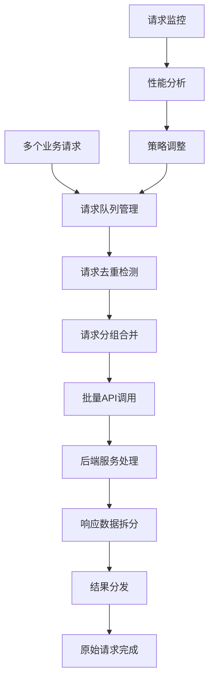
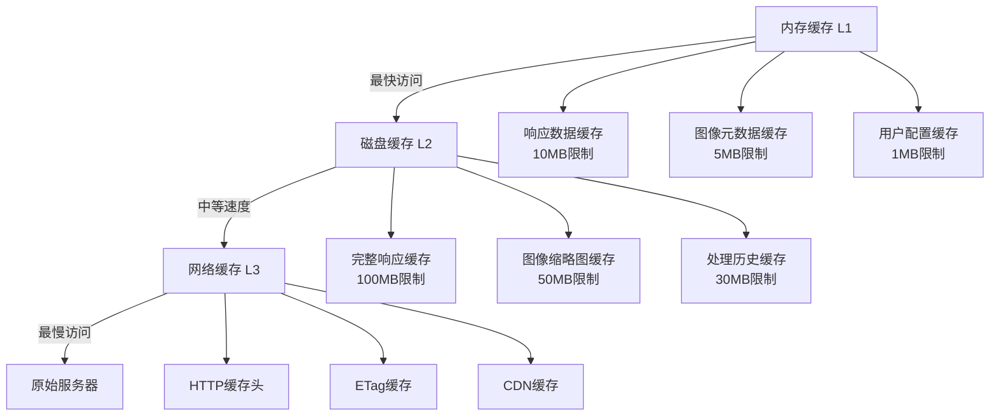
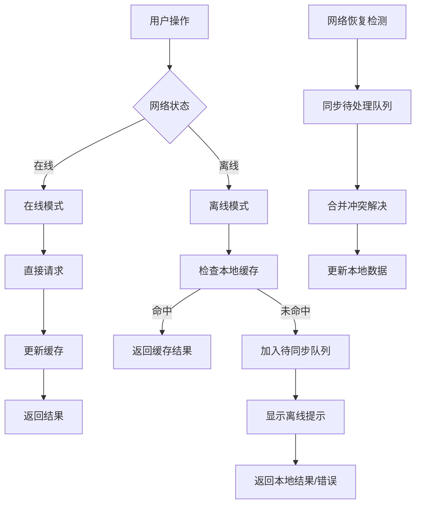

# Flutter图像去雾系统 - 网络优化方案

**文档版本**: v2.0
**最后更新**: 2025-11-22
**关联文档**: [性能优化总览](00-performance-overview.md) | [API集成设计](../architecture/04-api-integration.md)

---

## 概述

网络优化是Flutter图像去雾系统性能提升的重要组成部分，直接影响图像上传、处理状态同步、结果下载等关键功能的用户体验。通过科学的请求合并策略、智能缓存机制、离线支持设计和CDN加速，显著提升网络性能，确保在各种网络环境下都能提供稳定高效的服务。

### 优化目标

#### 核心网络指标
- **响应时间**：API请求响应时间 <200ms (WiFi) / <500ms (4G)
- **传输效率**：图像上传/下载速度提升50-80%
- **离线支持**：核心功能支持离线使用
- **网络容错**：网络异常时的优雅降级

#### 性能目标分级

| 网络类型 | 响应时间目标 | 上传速度目标 | 下载速度目标 | 缓存命中率 |
|---------|-------------|-------------|-------------|-----------|
| **WiFi** | <200ms | >10MB/s | >20MB/s | >80% |
| **4G** | <500ms | >2MB/s | >5MB/s | >70% |
| **3G** | <1s | >500KB/s | >1MB/s | >60% |
| **弱网** | <2s | >100KB/s | >200KB/s | >50% |

---

## 请求合并策略

### 请求优化架构



### 智能请求合并

#### 批量请求管理器

```dart
class BatchRequestManager {
  static final Map<String, List<PendingRequest>> _requestBatches = {};
  static const Duration batchTimeout = Duration(milliseconds: 50);
  static const int maxBatchSize = 10;

  static Future<T> executeRequest<T>(
    String endpoint,
    Map<String, dynamic> params, {
    Duration? timeout,
    bool enableBatching = true,
  }) async {
    if (!enableBatching) {
      return await _executeSingleRequest<T>(endpoint, params, timeout);
    }

    final batchKey = _generateBatchKey(endpoint, params);
    final request = PendingRequest<T>(
      endpoint: endpoint,
      params: params,
      timeout: timeout,
      completer: Completer<T>(),
    );

    // 添加到批次
    final batch = _requestBatches.putIfAbsent(batchKey, () => []);
    batch.add(request);

    // 检查是否需要立即执行
    if (batch.length >= maxBatchSize) {
      _executeBatch(batchKey);
    } else if (batch.length == 1) {
      // 设置超时自动执行
      Timer(batchTimeout, () {
        if (_requestBatches.containsKey(batchKey)) {
          _executeBatch(batchKey);
        }
      });
    }

    return await request.completer.future;
  }

  static void _executeBatch(String batchKey) {
    final batch = _requestBatches.remove(batchKey);
    if (batch == null || batch.isEmpty) return;

    // 合并请求参数
    final combinedParams = _combineRequestParams(batch);

    // 执行批量请求
    _executeCombinedRequest(batch, combinedParams);
  }

  static Map<String, dynamic> _combineRequestParams(List<PendingRequest> requests) {
    final combinedParams = <String, dynamic>{};

    for (final request in requests) {
      // 根据API类型合并参数
      switch (request.endpoint) {
        case 'image/upload':
          _combineUploadParams(combinedParams, request.params);
          break;
        case 'algorithm/list':
          _combineListParams(combinedParams, request.params);
          break;
        default:
          combinedParams.addAll(request.params);
      }
    }

    return combinedParams;
  }

  static Future<void> _executeCombinedRequest(
    List<PendingRequest> batch,
    Map<String, dynamic> combinedParams,
  ) async {
    try {
      final response = await _httpClient.post(
        Uri.parse('${_baseUrl}/batch'),
        data: combinedParams,
      );

      // 拆分响应并分发结果
      _distributeBatchResponse(batch, response.data);
    } catch (e) {
      // 处理批量请求失败
      _handleBatchError(batch, e);
    }
  }
}
```

#### 请求去重机制

```dart
class RequestDeduplicator {
  static final Map<String, Completer> _pendingRequests = {};
  static final Map<String, DateTime> _requestTimestamps = {};

  static Future<T> deduplicateRequest<T>(
    String requestKey,
    Future<T> Function() requestExecutor,
    Duration cacheTime = const Duration(minutes: 5),
  ) async {
    // 检查是否有相同请求正在进行
    if (_pendingRequests.containsKey(requestKey)) {
      return await _pendingRequests[requestKey]!.future;
    }

    // 创建新的请求
    final completer = Completer<T>();
    _pendingRequests[requestKey] = completer;
    _requestTimestamps[requestKey] = DateTime.now();

    try {
      final result = await requestExecutor();
      completer.complete(result);
      return result;
    } catch (e) {
      completer.completeError(e);
      rethrow;
    } finally {
      // 清理请求记录
      Future.delayed(cacheTime, () {
        _pendingRequests.remove(requestKey);
        _requestTimestamps.remove(requestKey);
      });
    }
  }

  static void cleanupExpiredRequests() {
    final now = DateTime.now();
    final expiredKeys = <String>[];

    _requestTimestamps.forEach((key, timestamp) {
      if (now.difference(timestamp) > Duration(minutes: 10)) {
        expiredKeys.add(key);
      }
    });

    for (final key in expiredKeys) {
      _pendingRequests.remove(key);
      _requestTimestamps.remove(key);
    }
  }
}
```

---

## 智能缓存策略

### 多级缓存架构

#### 缓存层级设计



#### 智能缓存管理器

```dart
class SmartCacheManager {
  static final Map<String, CachedItem> _memoryCache = {};
  static final Map<String, CachedItem> _diskCache = {};
  static final Queue<String> _lruQueue = Queue();

  static const int maxMemoryCacheSize = 50 * 1024 * 1024; // 50MB
  static const int maxDiskCacheSize = 200 * 1024 * 1024; // 200MB

  static int _currentMemorySize = 0;
  static int _currentDiskSize = 0;

  static Future<T?> get<T>(String key) async {
    // 1. 检查内存缓存
    final memoryItem = _memoryCache[key];
    if (memoryItem != null && !memoryItem.isExpired) {
      _updateLRUQueue(key);
      return memoryItem.data as T?;
    }

    // 2. 检查磁盘缓存
    final diskItem = _diskCache[key];
    if (diskItem != null && !diskItem.isExpired) {
      // 提升到内存缓存
      await _promoteToMemoryCache(key, diskItem);
      return diskItem.data as T?;
    }

    // 3. 检查HTTP缓存
    final httpItem = await _checkHttpCache(key);
    if (httpItem != null) {
      return httpItem;
    }

    return null;
  }

  static Future<void> put<T>(
    String key,
    T data, {
    Duration? expiration,
    CachePriority priority = CachePriority.normal,
  }) async {
    final item = CachedItem(
      data: data,
      timestamp: DateTime.now(),
      expiration: expiration ?? _getDefaultExpiration(priority),
      priority: priority,
      size: _calculateDataSize(data),
    );

    // 存储到内存缓存
    await _putToMemoryCache(key, item);

    // 异步存储到磁盘缓存
    unawaited(_putToDiskCache(key, item));
  }

  static Future<void> _putToMemoryCache<T>(String key, CachedItem<T> item) async {
    // 检查空间
    while (_shouldEvictMemoryCache(item.size)) {
      _evictOldestMemoryItem();
    }

    _memoryCache[key] = item;
    _updateLRUQueue(key);
    _currentMemorySize += item.size;
  }

  static Future<void> _putToDiskCache<T>(String key, CachedItem<T> item) async {
    // 检查磁盘空间
    while (_shouldEvictDiskCache(item.size)) {
      await _evictOldestDiskItem();
    }

    final file = await _getCacheFile(key);
    await file.writeAsString(jsonEncode(item.toJson()));

    _diskCache[key] = item;
    _currentDiskSize += item.size;
  }

  static bool _shouldEvictMemoryCache(int newItemSize) {
    return (_currentMemorySize + newItemSize) > maxMemoryCacheSize;
  }

  static bool _shouldEvictDiskCache(int newItemSize) {
    return (_currentDiskSize + newItemSize) > maxDiskCacheSize;
  }

  static void _evictOldestMemoryItem() {
    if (_lruQueue.isEmpty) return;

    final oldestKey = _lruQueue.removeFirst();
    final item = _memoryCache.remove(oldestKey);

    if (item != null) {
      _currentMemorySize -= item.size;
    }
  }

  static Future<void> _evictOldestDiskItem() async {
    if (_diskCache.isEmpty) return;

    String? oldestKey;
    DateTime? oldestTime;

    _diskCache.forEach((key, item) {
      if (oldestTime == null || item.timestamp.isBefore(oldestTime!)) {
        oldestKey = key;
        oldestTime = item.timestamp;
      }
    });

    if (oldestKey != null) {
      final item = _diskCache.remove(oldestKey!);
      if (item != null) {
        _currentDiskSize -= item.size;
        await _deleteCacheFile(oldestKey!);
      }
    }
  }
}
```

### 缓存策略优化

#### 预测性缓存

```dart
class PredictiveCacheManager {
  static final Map<String, AccessPattern> _userPatterns = {};
  static final List<String> _accessHistory = [];

  static void recordAccess(String resourceKey, String context) {
    _accessHistory.add(resourceKey);
    if (_accessHistory.length > 1000) {
      _accessHistory.removeAt(0);
    }

    _updateAccessPattern(resourceKey, context);
    _predictAndPrefetch(resourceKey, context);
  }

  static void _updateAccessPattern(String resourceKey, String context) {
    final pattern = _userPatterns[context] ?? AccessPattern();
    pattern.recordAccess(resourceKey);
    _userPatterns[context] = pattern;
  }

  static void _predictAndPrefetch(String currentResource, String context) {
    final pattern = _userPatterns[context];
    if (pattern == null) return;

    // 预测下一个可能访问的资源
    final predictions = pattern.getNextAccessPredictions(currentResource);

    for (final prediction in predictions) {
      if (prediction.probability > 0.7) {
        _prefetchResource(prediction.resource);
      }
    }
  }

  static Future<void> _prefetchResource(String resourceKey) async {
    // 检查是否已缓存
    if (await SmartCacheManager.get(resourceKey) != null) {
      return;
    }

    // 后台预加载
    Compute.run(() async {
      try {
        final data = await _loadResourceFromNetwork(resourceKey);
        await SmartCacheManager.put(resourceKey, data);
      } catch (e) {
        Logger.warn('Prefetch failed for $resourceKey: $e');
      }
    });
  }
}
```

---

## 离线支持设计

### 离线架构设计



### 离线队列管理

```dart
class OfflineQueueManager {
  static final List<QueuedOperation> _operationQueue = [];
  static final Isolate _syncIsolate = _createSyncIsolate();

  static void enqueueOperation(QueuedOperation operation) {
    _operationQueue.add(operation);
    _persistQueue();

    // 如果网络可用，立即尝试同步
    if (NetworkMonitor.isConnected) {
      _processQueue();
    }
  }

  static Future<void> _processQueue() async {
    if (_operationQueue.isEmpty || !NetworkMonitor.isConnected) {
      return;
    }

    final operations = List.from(_operationQueue);
    _operationQueue.clear();

    for (final operation in operations) {
      try {
        await _executeOperation(operation);
      } catch (e) {
        // 操作失败，重新加入队列
        operation.retryCount++;
        if (operation.retryCount < 3) {
          _operationQueue.add(operation);
        } else {
          // 超过重试次数，标记为失败
          operation.status = OperationStatus.failed;
          _notifyOperationFailed(operation);
        }
      }
    }

    _persistQueue();
  }

  static Future<void> _executeOperation(QueuedOperation operation) async {
    switch (operation.type) {
      case OperationType.imageUpload:
        await _executeImageUpload(operation);
        break;
      case OperationType.processingRequest:
        await _executeProcessingRequest(operation);
        break;
      case OperationType.userPreference:
        await _executeUserPreferenceUpdate(operation);
        break;
    }
  }

  static Future<void> _executeImageUpload(QueuedOperation operation) async {
    final imageData = operation.data['imageData'];
    final metadata = operation.data['metadata'];

    final result = await ImageUploadService.uploadImage(
      imageData,
      metadata: metadata,
    );

    // 更新本地状态
    await LocalDatabase.updateImageStatus(
      operation.data['localId'],
      result.serverId,
      UploadStatus.completed,
    );

    operation.status = OperationStatus.completed;
  }
}
```

### 数据同步机制

```dart
class DataSyncManager {
  static const String lastSyncKey = 'last_sync_timestamp';
  static const Duration syncInterval = Duration(minutes: 5);

  static Future<void> startSyncService() async {
    // 启动定时同步
    Timer.periodic(syncInterval, (_) {
      _performIncrementalSync();
    });

    // 监听网络状态变化
    NetworkMonitor.onConnectivityChanged.listen((status) {
      if (status == ConnectivityStatus.connected) {
        _performFullSync();
      }
    });

    // 应用启动时执行一次同步
    await _performFullSync();
  }

  static Future<void> _performFullSync() async {
    try {
      final lastSyncTime = await _getLastSyncTime();
      final now = DateTime.now();

      // 同步用户数据
      await _syncUserData(lastSyncTime);

      // 同步处理历史
      await _syncProcessingHistory(lastSyncTime);

      // 同步系统配置
      await _syncSystemConfig();

      // 更新同步时间戳
      await _updateLastSyncTime(now);

      Logger.info('Full sync completed successfully');
    } catch (e) {
      Logger.error('Full sync failed: $e');
    }
  }

  static Future<void> _performIncrementalSync() async {
    try {
      final lastSyncTime = await _getLastSyncTime();
      final now = DateTime.now();

      // 只同步变更的数据
      final changes = await ApiService.getChanges(lastSyncTime);
      if (changes.isNotEmpty) {
        await _applyChanges(changes);
        await _updateLastSyncTime(now);
      }
    } catch (e) {
      Logger.error('Incremental sync failed: $e');
    }
  }

  static Future<void> _applyChanges(List<DataChange> changes) async {
    for (final change in changes) {
      switch (change.type) {
        case ChangeType.create:
          await LocalDatabase.createRecord(change.entity);
          break;
        case ChangeType.update:
          await LocalDatabase.updateRecord(change.entity);
          break;
        case ChangeType.delete:
          await LocalDatabase.deleteRecord(change.entityId);
          break;
      }
    }
  }

  static Future<void> _resolveConflicts(List<ConflictData> conflicts) async {
    for (final conflict in conflicts) {
      final resolution = await _resolveConflict(conflict);
      await _applyConflictResolution(conflict, resolution);
    }
  }
}
```

---

## 网络性能监控

### 性能指标监控

#### 网络监控器

```dart
class NetworkPerformanceMonitor {
  static final List<RequestMetrics> _requestHistory = [];
  static final Map<String, EndpointMetrics> _endpointMetrics = {};

  static void recordRequest(RequestMetrics metrics) {
    _requestHistory.add(metrics);
    if (_requestHistory.length > 1000) {
      _requestHistory.removeAt(0);
    }

    _updateEndpointMetrics(metrics);
    _analyzePerformanceTrends();
  }

  static void _updateEndpointMetrics(RequestMetrics metrics) {
    final endpointMetrics = _endpointMetrics.putIfAbsent(
      metrics.endpoint,
      () => EndpointMetrics(metrics.endpoint),
    );

    endpointMetrics.addRequest(metrics);

    // 检查性能告警
    if (metrics.duration > metrics.expectedDuration * 2) {
      _logPerformanceWarning('Slow request detected', metrics);
    }

    if (metrics.retryCount > 0) {
      _logPerformanceWarning('Request retry detected', metrics);
    }
  }

  static void _analyzePerformanceTrends() {
    if (_requestHistory.length < 50) return;

    final recentRequests = _requestHistory.sublist(_requestHistory.length - 50);
    final avgDuration = recentRequests
        .map((r) => r.duration)
        .reduce((a, b) => a + b) / recentRequests.length;
    final failureRate = recentRequests.where((r) => !r.success).length / recentRequests.length;

    // 性能趋势分析
    if (avgDuration > 2000) { // 2秒
      _logPerformanceAlert('High average response time detected', {
        'averageDuration': avgDuration,
        'failureRate': failureRate,
      });
    }

    if (failureRate > 0.1) { // 10%失败率
      _logPerformanceAlert('High failure rate detected', {
        'averageDuration': avgDuration,
        'failureRate': failureRate,
      });
    }
  }

  static NetworkReport generateReport() {
    return NetworkReport(
      totalRequests: _requestHistory.length,
      averageResponseTime: _calculateAverageResponseTime(),
      failureRate: _calculateFailureRate(),
      cacheHitRate: _calculateCacheHitRate(),
      endpointBreakdown: Map.from(_endpointMetrics),
      performanceTrends: _calculatePerformanceTrends(),
    );
  }
}
```

### 自适应网络策略

#### 动态调整策略

```dart
class AdaptiveNetworkStrategy {
  static NetworkQuality _currentQuality = NetworkQuality.unknown;
  static Duration _currentTimeout = Duration(seconds: 30);
  static int _currentRetryCount = 3;

  static Future<void> updateNetworkStrategy() async {
    final networkQuality = await _assessNetworkQuality();
    _currentQuality = networkQuality;

    switch (networkQuality) {
      case NetworkQuality.excellent:
        _applyHighPerformanceStrategy();
        break;
      case NetworkQuality.good:
        _applyBalancedStrategy();
        break;
      case NetworkQuality.poor:
        _applyConservativeStrategy();
        break;
      case NetworkQuality.veryPoor:
        _applyMinimalStrategy();
        break;
    }
  }

  static void _applyHighPerformanceStrategy() {
    _currentTimeout = Duration(seconds: 10);
    _currentRetryCount = 2;
    CacheManager.setCacheStrategy(CacheStrategy.aggressive);
    ImageQualityManager.setTargetQuality(ImageQuality.high);
  }

  static void _applyBalancedStrategy() {
    _currentTimeout = Duration(seconds: 20);
    _currentRetryCount = 3;
    CacheManager.setCacheStrategy(CacheStrategy.balanced);
    ImageQualityManager.setTargetQuality(ImageQuality.medium);
  }

  static void _applyConservativeStrategy() {
    _currentTimeout = Duration(seconds: 45);
    _currentRetryCount = 5;
    CacheManager.setCacheStrategy(CacheStrategy.conservative);
    ImageQualityManager.setTargetQuality(ImageQuality.low);
  }

  static void _applyMinimalStrategy() {
    _currentTimeout = Duration(seconds: 60);
    _currentRetryCount = 8;
    CacheManager.setCacheStrategy(CacheStrategy.minimal);
    ImageQualityManager.setTargetQuality(ImageQuality.minimum);
    OfflineModeManager.enable(true);
  }

  static Future<NetworkQuality> _assessNetworkQuality() async {
    final connectivity = await Connectivity().checkConnectivity();

    // 执行网络测试
    final testResult = await _performNetworkTest();

    // 综合评估网络质量
    if (connectivity == ConnectivityResult.wifi && testResult.downloadSpeed > 5 * 1024 * 1024) {
      return NetworkQuality.excellent;
    } else if (testResult.latency < 200 && testResult.downloadSpeed > 1 * 1024 * 1024) {
      return NetworkQuality.good;
    } else if (testResult.latency < 1000 && testResult.downloadSpeed > 200 * 1024) {
      return NetworkQuality.poor;
    } else {
      return NetworkQuality.veryPoor;
    }
  }
}
```

---

## 最佳实践

### 网络优化建议

#### 通用优化策略

1. **请求合并**：减少网络请求数量
2. **数据压缩**：使用gzip压缩减少传输量
3. **连接复用**：使用HTTP/2或Keep-Alive
4. **智能重试**：实现指数退避重试机制
5. **错误处理**：优雅处理网络异常

#### 不同网络环境策略

| 网络环境 | 优化重点 | 关键措施 | 预期效果 |
|---------|---------|---------|---------|
| **WiFi环境** | 最大化性能 | 并行请求、高质量传输 | 最快响应速度 |
| **4G网络** | 平衡性能与流量 | 智能压缩、缓存优先 | 良好用户体验 |
| **3G网络** | 节约流量 | 数据压缩、低质量传输 | 基本功能可用 |
| **弱网环境** | 保证可用性 | 离线模式、最小传输 | 核心功能可用 |

### 网络安全优化

#### 安全传输优化

```dart
class SecureNetworkManager {
  static final Map<String, String> _securityHeaders = {
    'X-Content-Type-Options': 'nosniff',
    'X-Frame-Options': 'DENY',
    'X-XSS-Protection': '1; mode=block',
    'Strict-Transport-Security': 'max-age=31536000; includeSubDomains',
  };

  static Future<http.Response> makeSecureRequest({
    required String method,
    required String url,
    Map<String, String>? headers,
    dynamic body,
  }) async {
    final secureHeaders = <String, String>{
      ...headers ?? {},
      ..._securityHeaders,
      'Authorization': await _getAuthToken(),
      'Content-Type': 'application/json',
    };

    // 使用HTTPS
    final secureUrl = url.startsWith('https') ? url : 'https://$url';

    final response = await _httpClient.request(
      method: method,
      url: secureUrl,
      headers: secureHeaders,
      data: body,
      options: Options(
        validateStatus: (status) => status! < 500,
        timeout: Duration(seconds: 30),
      ),
    );

    // 验证响应
    _validateResponse(response);

    return response;
  }

  static void _validateResponse(http.Response response) {
    // 验证响应头
    if (!response.headers['content-type']?.contains('application/json') ?? true) {
      throw SecurityException('Invalid content type');
    }

    // 验证响应大小
    final contentLength = int.tryParse(response.headers['content-length'] ?? '0') ?? 0;
    if (contentLength > 10 * 1024 * 1024) { // 10MB限制
      throw SecurityException('Response too large');
    }
  }
}
```

---

**文档版本**: v2.0
**最后更新**: 2025-11-22
**上一篇**: [渲染优化技术](04-rendering-optimization.md)
**下一篇**: [测试策略](06-testing-strategy.md)

---

*网络优化是一个系统工程，需要结合具体业务场景和网络环境，通过智能的缓存策略、请求合并和离线支持，确保应用在各种网络条件下都能提供稳定高效的服务。*