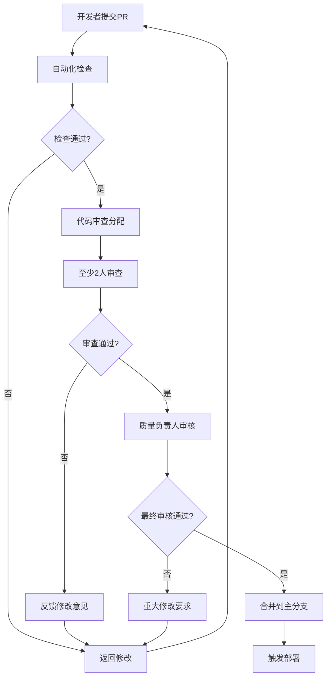

# Flutter图像去雾系统 - 代码质量保证

**文档版本**: v2.0
**最后更新**: 2025-11-22
**关联文档**: [测试策略](06-testing-strategy.md) | [持续集成](08-continuous-integration.md)

---

## 概述

代码质量保证是Flutter图像去雾系统开发过程中的关键环节，通过科学的静态代码分析、严格的代码审查流程、完善的规范制定和自动化质量检查，确保代码的可维护性、可读性和可靠性，为项目的长期发展奠定坚实基础。

### 质量目标

#### 核心质量指标
- **代码复杂度**：圈复杂度≤10，文件行数≤500行
- **代码重复率**：重复代码比例≤5%
- **测试覆盖率**：单元测试≥80%，集成测试≥70%
- **技术债务**：关键技术债务数量≤10个
- **代码规范合规率**：≥95%

#### 质量等级标准

| 质量等级 | 代码质量 | 测试覆盖率 | 文档完整性 | 可维护性 |
|---------|---------|-----------|-----------|---------|
| **A级** | 优秀 | ≥90% | 完整 | 非常高 |
| **B级** | 良好 | ≥80% | 较完整 | 高 |
| **C级** | 合格 | ≥70% | 基本完整 | 中等 |
| **D级** | 需改进 | <70% | 不完整 | 低 |

---

## 静态代码分析

### 分析工具配置

#### Dart分析器配置

```yaml
# analysis_options.yaml
include: package:flutter_lints/flutter.yaml

analyzer:
  exclude:
    - "**/*.g.dart"
    - "**/*.freezed.dart"
    - "**/generated_plugin_registrant.dart"
    - "build/**"
    - "lib/generated/**"

  strong-mode:
    implicit-casts: false
    implicit-dynamic: false

  errors:
    # Treat as errors
    missing_required_param: error
    missing_return: error
    dead_code: error
    unused_import: error
    unused_local_variable: error
    unused_field: error

    # Ignore specific warnings
    todo: ignore
    deprecated_member_use_from_same_package: ignore

linter:
  rules:
    # Dart recommended rules
    - always_declare_return_types
    - always_put_control_body_on_new_line
    - always_put_required_named_parameters_first
    - always_require_non_null_named_parameters
    - always_specify_types
    - annotate_overrides
    - avoid_annotating_with_dynamic
    - avoid_bool_literals_in_conditional_expressions
    - avoid_catches_without_on_clauses
    - avoid_catching_errors
    - avoid_classes_with_only_static_members
    - avoid_double_and_int_checks
    - avoid_dynamic_calls
    - avoid_empty_else
    - avoid_field_initializers_in_const_classes
    - avoid_function_literals_in_foreach_calls
    - avoid_implementing_value_types
    - avoid_init_to_null
    - avoid_js_rounded_ints
    - avoid_null_checks_in_equality_operators
    - avoid_positional_boolean_parameters
    - avoid_print
    - avoid_private_typedef_functions
    - avoid_redundant_argument_values
    - avoid_renaming_method_parameters
    - avoid_return_types_on_setters
    - avoid_returning_null_for_void
    - avoid_setters_without_getters
    - avoid_shadowing_type_parameters
    - avoid_single_cascade_in_expression_statements
    - avoid_slow_async_io
    - avoid_type_to_string
    - avoid_types_as_parameter_names
    - avoid_unnecessary_containers
    - avoid_unused_constructor_parameters
    - avoid_void_async
    - avoid_web_libraries_in_flutter
    - cancel_subscriptions
    - close_sinks
    - comment_references
    - constant_identifier_names
    - curly_braces_in_flow_control_structures
    - deprecated_consistency
    - diagnostic_describe_all_properties
    - directives_ordering
    - empty_catches
    - empty_constructor_bodies
    - empty_statements
    - exhaustive_cases
    - file_names
    - flutter_style_todos
    - hash_and_equals
    - implementation_imports
    - invariant_booleans
    - join_return_with_assignment
    - leading_newlines_in_multiline_strings
    - library_names
    - library_prefixes
    - lines_longer_than_80_chars
    - literal_only_boolean_expressions
    - missing_whitespace_between_adjacent_strings
    - no_adjacent_strings_in_list
    - no_duplicate_case_values
    - no_logic_in_create_state
    - no_runtimeType_toString
    - non_constant_identifier_names
    - null_closures
    - omit_local_variable_types
    - one_member_abstracts
    - only_throw_errors
    - overridden_fields
    - package_api_docs
    - package_names
    - package_prefixed_library_names
    - parameter_assignments
    - prefer_adjacent_string_concatenation
    - prefer_asserts_in_initializer_lists
    - prefer_asserts_with_message
    - prefer_collection_literals
    - prefer_conditional_assignment
    - prefer_const_constructors
    - prefer_const_constructors_in_immutables
    - prefer_const_declarations
    - prefer_const_literals_to_create_immutables
    - prefer_constructors_over_static_methods
    - prefer_contains
    - prefer_equal_for_default_values
    - prefer_expression_function_bodies
    - prefer_final_fields
    - prefer_final_in_for_each
    - prefer_final_locals
    - prefer_for_elements_to_map_fromIterable
    - prefer_function_declarations_over_variables
    - prefer_generic_function_type_aliases
    - prefer_if_elements_to_conditional_expressions
    - prefer_if_null_operators
    - prefer_initializing_formals
    - prefer_inlined_adds
    - prefer_int_literals
    - prefer_interpolation_to_compose_strings
    - prefer_is_empty
    - prefer_is_not_empty
    - prefer_is_not_operator
    - prefer_iterable_whereType
    - prefer_null_aware_operators
    - prefer_relative_imports
    - prefer_single_quotes
    - prefer_spread_collections
    - prefer_typing_uninitialized_variables
    - prefer_void_to_null
    - provide_deprecation_message
    - public_member_api_docs
    - recursive_getters
    - slash_for_doc_comments
    - sort_child_properties_last
    - sort_constructors_first
    - sort_pub_dependencies
    - sort_unnamed_constructors_first
    - test_types_in_equals
    - throw_in_finally
    - type_annotate_public_apis
    - type_init_formals
    - unawaited_futures
    - unnecessary_await_in_return
    - unnecessary_brace_in_string_interps
    - unnecessary_const
    - unnecessary_getters_setters
    - unnecessary_lambdas
    - unnecessary_new
    - unnecessary_null_aware_assignments
    - unnecessary_null_checks
    - unnecessary_null_in_if_null_operators
    - unnecessary_nullable_for_final_variable_declarations
    - unnecessary_overrides
    - unnecessary_parenthesis
    - unnecessary_raw_strings
    - unnecessary_statements
    - unnecessary_string_escapes
    - unnecessary_string_interpolations
    - unnecessary_this
    - unrelated_type_equality_checks
    - unsafe_html
    - use_build_context_synchronously
    - use_full_hex_values_for_flutter_colors
    - use_function_type_syntax_for_parameters
    - use_if_null_to_convert_nulls_to_bools
    - use_is_even_rather_than_modulo
    - use_key_in_widget_constructors
    - use_late_for_private_fields_and_variables
    - use_named_constants
    - use_raw_strings
    - use_rethrow_when_possible
    - use_setters_to_change_properties
    - use_string_buffers
    - use_test_throws_matchers
    - use_to_and_as_if_applicable
    - valid_regexps
    - void_checks
```

### 自定义分析规则

#### 代码质量检查器

```dart
// tools/analysis/custom_rules.dart
import 'package:analyzer/dart/analysis/results.dart';
import 'package:analyzer/dart/analysis/utilities.dart';
import 'package:analyzer/error/error.dart';
import 'package:analyzer/error/listener.dart';
import 'package:analyzer/source/line_info.dart';

class CustomCodeQualityRules {
  static const String ruleId = 'custom_quality';

  // 规则1: 检查Widget构造函数复杂性
  static void checkWidgetConstructorComplexity(
    ResolvedUnitResult result,
    AnalysisErrorListener listener,
  ) {
    for (final unit in result.unit.declarations) {
      if (unit is ClassDeclaration && _isWidget(unit)) {
        _checkConstructorComplexity(unit, result, listener);
      }
    }
  }

  static void _checkConstructorComplexity(
    ClassDeclaration classDecl,
    ResolvedUnitResult result,
    AnalysisErrorListener listener,
  ) {
    for (final member in classDecl.members) {
      if (member is ConstructorDeclaration) {
        final complexity = _calculateConstructorComplexity(member);
        if (complexity > 5) {
          final lineInfo = result.lineInfo;
          final location = lineInfo.getLocation(member.offset);

          listener.onError(
            AnalysisError(
              result.source,
              member.offset,
              member.length,
              CustomErrorCode.constructor_too_complex,
              message: 'Widget constructor is too complex (complexity: $complexity). '
                      'Consider using a separate method or helper widget.',
              correction: 'Extract complex logic into separate methods.',
            ),
          );
        }
      }
    }
  }

  // 规则2: 检查状态管理合规性
  static void checkStateManagementCompliance(
    ResolvedUnitResult result,
    AnalysisErrorListener listener,
  ) {
    // 检查是否正确使用Riverpod
    final riverpodUsage = _findRiverpodUsage(result);
    for (final usage in riverpodUsage) {
      if (_isImproperRiverpodUsage(usage)) {
        listener.onError(
          AnalysisError(
            result.source,
            usage.offset,
            usage.length,
            CustomErrorCode.improper_riverpod_usage,
            message: 'Improper Riverpod usage detected. '
                    'Consider using Consumer/Provider for proper state management.',
          ),
        );
      }
    }
  }

  // 规则3: 检查图像处理性能问题
  static void checkImageProcessingPerformance(
    ResolvedUnitResult result,
    AnalysisErrorListener listener,
  ) {
    final imageOperations = _findImageOperations(result);
    for (final operation in imageOperations) {
      if (_isInefficientImageOperation(operation)) {
        listener.onError(
          AnalysisError(
            result.source,
            operation.offset,
            operation.length,
            CustomErrorCode.inefficient_image_operation,
            message: 'Potential inefficient image operation detected. '
                    'Consider using Isolates for heavy image processing.',
          ),
        );
      }
    }
  }
}

class CustomErrorCode extends ErrorCode {
  static const ErrorCode constructor_too_complex = ErrorCode(
    'custom_quality',
    'constructor_too_complex',
    correctionMessage: 'Extract complex logic into separate methods.',
  );

  static const ErrorCode improper_riverpod_usage = ErrorCode(
    'custom_quality',
    'improper_riverpod_usage',
    correctionMessage: 'Use proper Riverpod patterns for state management.',
  );

  static const ErrorCode inefficient_image_operation = ErrorCode(
    'custom_quality',
    'inefficient_image_operation',
    correctionMessage: 'Consider using Isolates for heavy image processing.',
  );
}
```

---

## 代码审查流程

### 审查规范制定

#### Pull Request审查清单

| 审查类别 | 检查项目 | 必需性 | 验证方法 |
|---------|---------|--------|---------|
| **功能性** | 功能实现正确 | ✅ 必需 | 代码审查 + 测试 |
| **代码质量** | 代码符合规范 | ✅ 必需 | 静态分析 + 人工审查 |
| **性能** | 无性能回归 | ✅ 必需 | 性能测试 |
| **安全性** | 无安全漏洞 | ✅ 必需 | 安全扫描 |
| **文档** | 代码注释完整 | ⚪ 推荐 | 代码审查 |
| **测试** | 测试覆盖率达标 | ✅ 必需 | 测试报告 |

#### 审查流程设计



### 自动化审查工具

#### GitHub Actions审查配置

```yaml
# .github/workflows/pr-review.yml
name: PR Review Checks

on:
  pull_request:
    branches: [main, develop]

jobs:
  code-quality-checks:
    runs-on: ubuntu-latest
    steps:
      - uses: actions/checkout@v3
        with:
          fetch-depth: 0

      - uses: subosito/flutter-action@v2
        with:
          flutter-version: '3.16.0'

      - name: Install dependencies
        run: flutter pub get

      - name: Run Flutter analyze
        run: flutter analyze --fatal-infos

      - name: Run custom analysis rules
        run: dart tools/analysis/run_custom_analysis.dart

      - name: Check code formatting
        run: dart format --set-exit-if-changed .

      - name: Check test coverage
        run: flutter test --coverage
        working-directory: test

      - name: Upload coverage to PR
        uses: actions/github-script@v6
        with:
          script: |
            const fs = require('fs');
            const coverage = fs.readFileSync('coverage/lcov.info', 'utf8');

            // Extract coverage percentage
            const coverageMatch = coverage.match(/LF:([0-9]+)\nLH:([0-9]+)/);
            if (coverageMatch) {
              const linesFound = parseInt(coverageMatch[1]);
              const linesHit = parseInt(coverageMatch[2]);
              const coveragePercent = ((linesHit / linesFound) * 100).toFixed(1);

              // Comment on PR
              await github.rest.issues.createComment({
                issue_number: context.issue.number,
                owner: context.repo.owner,
                repo: context.repo.repo,
                body: `📊 **Code Coverage**: ${coveragePercent}%\n\n${
                  coveragePercent >= 80 ? '✅ Coverage requirement met' :
                  '❌ Coverage below required 80%'
                }`
              });
            }

      - name: Check for breaking changes
        run: |
          # 检查是否有重大API变更
          if git diff --name-only HEAD~1 | grep -E "(lib/|test/)"; then
            echo "Public API changes detected"
            dart pub global activate dart_doc
            dart doc --validate-links
          fi

      - name: Security scan
        uses: securecodewarrior/github-action-add-sarif@v1
        with:
          sarif-file: 'security-scan-results.sarif'

  size-check:
    runs-on: ubuntu-latest
    steps:
      - uses: actions/checkout@v3

      - name: Check PR size
        run: |
          PR_SIZE=$(git diff --name-only HEAD~1 | wc -l)
          if [ $PR_SIZE -gt 20 ]; then
            echo "::warning::Large PR detected ($PR_SIZE files). Consider splitting into smaller PRs."
          fi

      - name: Check lines changed
        run: |
          LINES_CHANGED=$(git diff --stat HEAD~1 | tail -1 | awk '{print $4}')
          if [[ $LINES_CHANGED =~ \+([0-9]+) ]]; then
            ADDED_LINES=${BASH_REMATCH[1]}
            if [ $ADDED_LINES -gt 500 ]; then
              echo "::warning::Many lines added ($ADDED_LINES). Ensure code is well-documented."
            fi
          fi
```

---

## 编码规范制定

### 命名规范

#### 命名约定表

| 代码元素 | 命名规范 | 示例 | 说明 |
|---------|---------|------|------|
| **类名** | PascalCase | `ImageProcessor`, `UserManager` | 每个单词首字母大写 |
| **方法名** | camelCase | `processImage()`, `getUserData()` | 首字母小写，后续单词首字母大写 |
| **变量名** | camelCase | `imageFile`, `processingResult` | 同方法名 |
| **常量名** | SCREAMING_SNAKE_CASE | `MAX_IMAGE_SIZE`, `DEFAULT_TIMEOUT` | 全大写，下划线分隔 |
| **私有成员** | 前缀下划线 | `_privateMethod`, `_internalVariable` | 私有成员以_开头 |
| **文件名** | snake_case | `image_processor.dart`, `user_manager.dart` | 全小写，下划线分隔 |
| **包名** | snake_case | `image_processing`, `user_management` | 全小写，下划线分隔 |

#### 规范检查工具

```dart
// tools/linting/naming_convention_checker.dart
class NamingConventionChecker {
  static void checkFileNaming(String filePath) {
    final fileName = filePath.split('/').last;

    if (!_isValidFileName(fileName)) {
      throw NamingConventionError(
        'Invalid file name: $fileName. Use snake_case with .dart extension.',
      );
    }
  }

  static void checkClassNaming(ClassDeclaration classDecl) {
    final className = classDecl.name.lexeme;

    if (!_isPascalCase(className)) {
      throw NamingConventionError(
        'Class name should be PascalCase: $className',
      );
    }

    // 检查Widget类命名
    if (_isWidgetClass(classDecl) && !className.endsWith('Widget')) {
      print('Warning: Widget classes should end with "Widget": $className');
    }
  }

  static void checkMethodNaming(MethodDeclaration methodDecl) {
    final methodName = methodDecl.name.lexeme;

    if (!_isCamelCase(methodName)) {
      throw NamingConventionError(
        'Method name should be camelCase: $methodName',
      );
    }

    // 检查异步方法命名
    if (methodDecl.isAsync && !methodName.startsWith('async') &&
        !methodName.endsWith('Async')) {
      print('Warning: Async methods should start with "async" or end with "Async": $methodName');
    }
  }

  static void checkVariableNaming(VariableDeclaration varDecl) {
    final varName = varDecl.name.lexeme;

    if (!_isCamelCase(varName)) {
      throw NamingConventionError(
        'Variable name should be camelCase: $varName',
      );
    }

    // 检查布尔变量命名
    if (_isBooleanVariable(varDecl) && !_startsWithIsOrHas(varName)) {
      print('Warning: Boolean variables should start with "is" or "has": $varName');
    }
  }

  static bool _isValidFileName(String fileName) {
    return RegExp(r'^[a-z][a-z0-9_]*\.dart$').hasMatch(fileName);
  }

  static bool _isPascalCase(String name) {
    return RegExp(r'^[A-Z][a-zA-Z0-9]*$').hasMatch(name);
  }

  static bool _isCamelCase(String name) {
    return RegExp(r'^[a-z][a-zA-Z0-9]*$').hasMatch(name);
  }

  static bool _isWidgetClass(ClassDeclaration classDecl) {
    return classDecl.extendsClause?.superclass.toSource().contains('Widget') ?? false;
  }

  static bool _isBooleanVariable(VariableDeclaration varDecl) {
    return varDecl.declaredElement?.type.isDartCoreBool ?? false;
  }

  static bool _startsWithIsOrHas(String name) {
    return name.startsWith('is') || name.startsWith('has');
  }
}
```

### 代码结构规范

#### 文件组织结构

```
lib/
├── core/                    # 核心功能
│   ├── constants/          # 常量定义
│   ├── errors/             # 自定义错误
│   ├── utils/              # 工具函数
│   └── services/           # 核心服务
├── features/               # 功能模块
│   ├── image_input/        # 图像输入功能
│   │   ├── data/          # 数据层
│   │   │   ├── datasources/  # 数据源
│   │   │   ├── models/       # 数据模型
│   │   │   └── repositories/ # 仓库实现
│   │   ├── domain/        # 业务层
│   │   │   ├── entities/     # 业务实体
│   │   │   ├── repositories/ # 仓库接口
│   │   │   └── usecases/     # 用例
│   │   └── presentation/  # 表现层
│   │       ├── providers/       # 状态管理
│   │       ├── widgets/      # UI组件
│   │       └── pages/        # 页面
│   ├── image_processing/   # 图像处理功能
│   └── result_display/     # 结果展示功能
├── shared/                 # 共享组件
│   ├── widgets/           # 通用组件
│   ├── themes/            # 主题样式
│   └── extensions/        # 扩展方法
└── main.dart              # 应用入口
```

#### 目录结构检查

```dart
// tools/linting/directory_structure_checker.dart
class DirectoryStructureChecker {
  static const List<String> requiredDirectories = [
    'lib/core/constants',
    'lib/core/errors',
    'lib/core/utils',
    'lib/core/services',
    'lib/features',
    'lib/shared/widgets',
    'lib/shared/themes',
    'test/unit',
    'test/integration',
    'test/widget',
  ];

  static void validateStructure() {
    for (final dir in requiredDirectories) {
      if (!Directory(dir).existsSync()) {
        throw StructureError('Required directory missing: $dir');
      }
    }

    _validateFeatureStructure();
    _validateTestStructure();
  }

  static void _validateFeatureStructure() {
    final featuresDir = Directory('lib/features');

    if (!featuresDir.existsSync()) return;

    for (final feature in featuresDir.listSync()) {
      if (feature is Directory) {
        _validateFeatureDirectory(feature);
      }
    }
  }

  static void _validateFeatureDirectory(Directory featureDir) {
    final requiredSubdirs = ['data', 'domain', 'presentation'];

    for (final subdir in requiredSubdirs) {
      final fullPath = '${featureDir.path}/$subdir';
      if (!Directory(fullPath).existsSync()) {
        throw StructureError(
          'Feature "${featureDir.path.split('/').last}" '
          'missing required directory: $subdir',
        );
      }
    }

    // 检查data子目录结构
    _validateDataSubdirectories('${featureDir.path}/data');

    // 检查domain子目录结构
    _validateDomainSubdirectories('${featureDir.path}/domain');
  }

  static void _validateDataSubdirectories(String dataPath) {
    final requiredSubdirs = ['datasources', 'models', 'repositories'];

    for (final subdir in requiredSubdirs) {
      final fullPath = '$dataPath/$subdir';
      if (!Directory(fullPath).existsSync()) {
        throw StructureError('Data directory missing: $subdir');
      }
    }
  }

  static void _validateDomainSubdirectories(String domainPath) {
    final requiredSubdirs = ['entities', 'repositories', 'usecases'];

    for (final subdir in requiredSubdirs) {
      final fullPath = '$domainPath/$subdir';
      if (!Directory(fullPath).existsSync()) {
        throw StructureError('Domain directory missing: $subdir');
      }
    }
  }
}
```

---

## 技术债务管理

### 技术债务识别

#### 债务类型分类

| 债务类型 | 识别标准 | 影响等级 | 解决优先级 |
|---------|---------|---------|---------|
| **代码异味** | 复杂度过高、重复代码 | 中 | 中 |
| **架构问题** | 违反设计原则 | 高 | 高 |
| **性能问题** | 算法效率低、内存泄漏 | 高 | 高 |
| **安全漏洞** | 存在安全隐患 | 极高 | 紧急 |
| **测试缺失** | 缺少必要测试 | 中 | 中 |
| **文档不足** | 代码缺少注释 | 低 | 低 |

#### 技术债务跟踪

```dart
// tools/technical_debt/tracker.dart
class TechnicalDebtTracker {
  static const String debtFile = 'technical_debt.json';
  static List<TechnicalDebtItem> _debtItems = [];

  static Future<void> loadDebts() async {
    final file = File(debtFile);
    if (await file.exists()) {
      final content = await file.readAsString();
      final data = jsonDecode(content) as List;
      _debtItems = data.map((item) => TechnicalDebtItem.fromJson(item)).toList();
    }
  }

  static Future<void> saveDebts() async {
    final file = File(debtFile);
    final data = _debtItems.map((item) => item.toJson()).toList();
    await file.writeAsString(jsonEncode(data));
  }

  static void addDebt({
    required String title,
    required String description,
    required DebtType type,
    required DebtSeverity severity,
    required String filePath,
    required int lineNumber,
    String? suggestedFix,
    String? assignee,
  }) {
    final debt = TechnicalDebtItem(
      id: DateTime.now().millisecondsSinceEpoch.toString(),
      title: title,
      description: description,
      type: type,
      severity: severity,
      filePath: filePath,
      lineNumber: lineNumber,
      suggestedFix: suggestedFix,
      assignee: assignee,
      createdAt: DateTime.now(),
      status: DebtStatus.open,
    );

    _debtItems.add(debt);
  }

  static List<TechnicalDebtItem> getDebtsByPriority() {
    final sortedDebts = List<TechnicalDebtItem>.from(_debtItems);
    sortedDebts.sort((a, b) => _compareSeverity(b.severity, a.severity));
    return sortedDebts;
  }

  static List<TechnicalDebtItem> getDebtsByAssignee(String assignee) {
    return _debts.where((debt) => debt.assignee == assignee).toList();
  }

  static Map<DebtType, int> getDebtStatistics() {
    final stats = <DebtType, int>{};

    for (final debt in _debts) {
      stats[debt.type] = (stats[debt.type] ?? 0) + 1;
    }

    return stats;
  }

  static int _compareSeverity(DebtSeverity a, DebtSeverity b) {
    const severityOrder = {
      DebtSeverity.critical: 4,
      DebtSeverity.high: 3,
      DebtSeverity.medium: 2,
      DebtSeverity.low: 1,
    };

    return severityOrder[a]!.compareTo(severityOrder[b]!);
  }
}

enum DebtType {
  codeSmell,
  architecture,
  performance,
  security,
  testing,
  documentation,
}

enum DebtSeverity {
  critical,
  high,
  medium,
  low,
}

enum DebtStatus {
  open,
  inProgress,
  resolved,
  wontFix,
}

class TechnicalDebtItem {
  final String id;
  final String title;
  final String description;
  final DebtType type;
  final DebtSeverity severity;
  final String filePath;
  final int lineNumber;
  final String? suggestedFix;
  final String? assignee;
  final DateTime createdAt;
  final DateTime? resolvedAt;
  final DebtStatus status;

  TechnicalDebtItem({
    required this.id,
    required this.title,
    required this.description,
    required this.type,
    required this.severity,
    required this.filePath,
    required this.lineNumber,
    this.suggestedFix,
    this.assignee,
    required this.createdAt,
    this.resolvedAt,
    required this.status,
  });
}
```

---

## 质量度量与报告

### 质量指标监控

#### 代码质量仪表板

```dart
// tools/quality/dashboard_generator.dart
class QualityDashboardGenerator {
  static Future<QualityReport> generateReport() async {
    final codeMetrics = await _analyzeCodeMetrics();
    final testMetrics = await _analyzeTestMetrics();
    final technicalDebt = await _analyzeTechnicalDebt();
    final securityMetrics = await _analyzeSecurityMetrics();

    return QualityReport(
      codeMetrics: codeMetrics,
      testMetrics: testMetrics,
      technicalDebt: technicalDebt,
      securityMetrics: securityMetrics,
      generatedAt: DateTime.now(),
    );
  }

  static Future<CodeMetrics> _analyzeCodeMetrics() async {
    final result = await analyzePackage(packagePath: '.');

    return CodeMetrics(
      linesOfCode: result.linesOfCode,
      cyclomaticComplexity: result.averageComplexity,
      codeDuplication: await _calculateDuplicationPercentage(),
      maintainabilityIndex: _calculateMaintainabilityIndex(result),
      technicalDebtRatio: await _calculateTechnicalDebtRatio(),
    );
  }

  static Future<TestMetrics> _analyzeTestMetrics() async {
    // 运行测试并收集覆盖率数据
    final testResult = await runTestsWithCoverage();

    return TestMetrics(
      unitTestCoverage: testResult.unitCoverage,
      integrationTestCoverage: testResult.integrationCoverage,
      endToEndTestCoverage: testResult.e2eCoverage,
      totalTestCount: testResult.totalTests,
      testPassRate: testResult.passRate,
    );
  }

  static Future<TechnicalDebtMetrics> _analyzeTechnicalDebt() async {
    await TechnicalDebtTracker.loadDebts();
    final debts = TechnicalDebtTracker._debtItems;

    return TechnicalDebtMetrics(
      totalDebtCount: debts.length,
      criticalDebtCount: debts.where((d) => d.severity == DebtSeverity.critical).length,
      highDebtCount: debts.where((d) => d.severity == DebtSeverity.high).length,
      debtByType: TechnicalDebtTracker.getDebtStatistics(),
      averageDebtAge: _calculateAverageDebtAge(debts),
    );
  }

  static Future<SecurityMetrics> _analyzeSecurityMetrics() async {
    final securityScan = await runSecurityScan();

    return SecurityMetrics(
      vulnerabilitiesFound: securityScan.vulnerabilityCount,
      criticalVulnerabilities: securityScan.criticalCount,
      securityScore: _calculateSecurityScore(securityScan),
      dependenciesWithIssues: securityScan.dependencyIssues.length,
    );
  }

  static Future<void> generateHtmlReport(QualityReport report) async {
    final template = await File('tools/quality/report_template.html').readAsString();
    final html = _populateTemplate(template, report);

    final outputFile = File('quality_report_${DateTime.now().millisecondsSinceEpoch}.html');
    await outputFile.writeAsString(html);

    print('Quality report generated: ${outputFile.path}');
  }
}
```

### 质量趋势分析

#### 趋势监控配置

```dart
// tools/quality/trend_analyzer.dart
class QualityTrendAnalyzer {
  static const String trendDataFile = 'quality_trends.json';
  static List<QualitySnapshot> _snapshots = [];

  static Future<void> recordSnapshot() async {
    final report = await QualityDashboardGenerator.generateReport();

    final snapshot = QualitySnapshot(
      timestamp: DateTime.now(),
      overallScore: _calculateOverallScore(report),
      codeQuality: report.codeMetrics.maintainabilityIndex,
      testCoverage: report.testMetrics.unitTestCoverage,
      technicalDebt: report.technicalDebt.totalDebtCount,
      securityScore: report.securityMetrics.securityScore,
    );

    _snapshots.add(snapshot);
    await _saveSnapshots();
  }

  static QualityTrends analyzeTrends({Duration period = const Duration(days: 30)}) {
    final cutoffDate = DateTime.now().subtract(period);
    final relevantSnapshots = _snapshots
        .where((s) => s.timestamp.isAfter(cutoffDate))
        .toList();

    if (relevantSnapshots.length < 2) {
      return QualityTrends.insufficientData;
    }

    return QualityTrends(
      period: period,
      overallScoreTrend: _calculateTrend(relevantSnapshots, (s) => s.overallScore),
      codeQualityTrend: _calculateTrend(relevantSnapshots, (s) => s.codeQuality),
      testCoverageTrend: _calculateTrend(relevantSnapshots, (s) => s.testCoverage),
      technicalDebtTrend: _calculateTrend(relevantSnapshots, (s) => -s.technicalDebt), // 负向指标
      securityScoreTrend: _calculateTrend(relevantSnapshots, (s) => s.securityScore),
      recommendations: _generateRecommendations(relevantSnapshots),
    );
  }

  static TrendDirection _calculateTrend<T>(
    List<QualitySnapshot> snapshots,
    T Function(QualitySnapshot) extractor,
  ) {
    if (snapshots.length < 2) return TrendDirection.stable;

    final first = extractor(snapshots.first);
    final last = extractor(snapshots.last);

    if (first is num && last is num) {
      final change = (last - first) / first.abs();
      if (change > 0.05) return TrendDirection.improving;
      if (change < -0.05) return TrendDirection.declining;
      return TrendDirection.stable;
    }

    return TrendDirection.stable;
  }

  static List<String> _generateRecommendations(List<QualitySnapshot> snapshots) {
    final recommendations = <String>[];

    final latest = snapshots.last;

    if (latest.testCoverage < 80) {
      recommendations.add('Test coverage is below 80%. Focus on increasing unit test coverage.');
    }

    if (latest.technicalDebt > 10) {
      recommendations.add('Technical debt is high. Schedule time to address critical items.');
    }

    if (latest.codeQuality < 70) {
      recommendations.add('Code quality needs improvement. Refactor complex methods and reduce duplication.');
    }

    if (latest.securityScore < 80) {
      recommendations.add('Security score is low. Address security vulnerabilities and update dependencies.');
    }

    return recommendations;
  }
}
```

---

## 最佳实践

### 开发工作流程

#### 质量保证检查清单

**开发阶段**
- [ ] 遵循编码规范
- [ ] 实现必要的错误处理
- [ ] 添加适当的日志记录
- [ ] 编写单元测试
- [ ] 运行静态代码分析

**提交阶段**
- [ ] 代码格式化检查
- [ ] 静态分析无错误
- [ ] 单元测试全部通过
- [ ] 测试覆盖率达标
- [ ] 提交信息符合规范

**审查阶段**
- [ ] 功能实现正确性
- [ ] 代码质量符合标准
- [ ] 性能无回归
- [ ] 安全性检查通过
- [ ] 文档更新完整

#### 质量门禁配置

```yaml
# .github/workflows/quality-gate.yml
name: Quality Gate

on:
  pull_request:
    branches: [main]

jobs:
  quality-gate:
    runs-on: ubuntu-latest
    steps:
      - uses: actions/checkout@v3

      - name: Setup Flutter
        uses: subosito/flutter-action@v2
        with:
          flutter-version: '3.16.0'

      - name: Dependencies
        run: flutter pub get

      - name: Code Analysis
        run: |
          flutter analyze --fatal-infos
          dart format --set-exit-if-changed .

      - name: Test Coverage
        run: |
          flutter test --coverage
          COVERAGE=$(lcov --summary coverage/lcov.info | grep "lines......" | grep -o "[0-9.]*%")
          if (( $(echo "$COVERAGE < 80" | bc -l) )); then
            echo "Coverage $COVERAGE is below required 80%"
            exit 1
          fi

      - name: Quality Metrics
        run: dart tools/quality/quality_check.dart

      - name: Technical Debt Check
        run: |
          DEBT_COUNT=$(dart tools/technical_debt/count.dart)
          if [ $DEBT_COUNT -gt 10 ]; then
            echo "Too many technical debt items: $DEBT_COUNT"
            exit 1
          fi

      - name: Security Scan
        run: dart tools/security/scan.dart
```

---

**文档版本**: v2.0
**最后更新**: 2025-11-22
**上一篇**: [测试策略](06-testing-strategy.md)
**下一篇**: [持续集成](08-continuous-integration.md)

---

*代码质量保证是一个持续的过程，需要整个团队的参与和工具的支撑。通过建立完善的质量体系和文化，能够确保项目长期健康发展。*