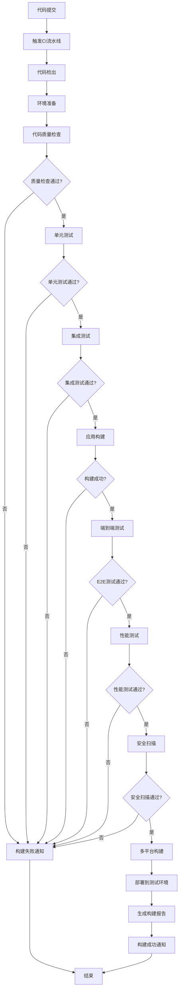

# Flutter图像去雾系统 - 持续集成

**文档版本**: v2.0
**最后更新**: 2025-11-22
**关联文档**: [代码质量保证](07-code-quality.md) | [测试策略](06-testing-strategy.md)

---

## 概述

持续集成(CI/CD)是Flutter图像去雾系统开发流程的自动化基础设施，通过科学的构建流水线设计、自动化测试集成、多平台部署策略和监控告警机制，确保代码变更能够快速、安全、可靠地交付到用户手中，显著提升开发效率和产品质量。

### CI/CD目标

#### 核心目标
- **快速反馈**：代码提交后5分钟内获得构建结果
- **质量保证**：100%自动化测试，质量门禁控制
- **多平台支持**：支持6个主要平台的自动构建和部署
- **安全可靠**：自动安全扫描，依赖漏洞检测
- **可追溯性**：完整的构建历史和发布记录

#### 性能指标

| 指标类别 | 目标值 | 当前基线 | 测量方法 |
|---------|--------|---------|---------|
| **构建时间** | <10分钟 | 15分钟 | CI构建日志 |
| **测试执行时间** | <5分钟 | 8分钟 | 测试报告 |
| **部署时间** | <15分钟 | 25分钟 | 部署日志 |
| **构建成功率** | >95% | 90% | CI/CD仪表板 |
| **回滚时间** | <5分钟 | 10分钟 | 监控系统 |

---

## CI/CD流水线架构

### 流水线设计原则

#### 阶段化流水线



### 分支策略

#### Git Flow集成

| 分支类型 | 用途 | CI策略 | 合并策略 |
|---------|------|---------|---------|
| **main** | 生产环境 | 完整CI/CD | Pull Request + 代码审查 |
| **develop** | 开发环境 | 完整CI | Pull Request + 代码审查 |
| **feature/*** | 功能开发 | 快速CI | Push自动触发 |
| **hotfix/*** | 紧急修复 | 完整CI/CD | 直接合并到main |
| **release/*** | 发布准备 | 完整CI/CD | 合并到main触发发布 |

#### 分支保护规则

```yaml
# .github/branch-protection.yml
protection_rules:
  main:
    required_status_checks:
      strict: true
      contexts:
        - "ci/code-quality"
        - "ci/unit-tests"
        - "ci/integration-tests"
        - "ci/security-scan"
        - "ci/performance-tests"
    enforce_admins: true
    required_pull_request_reviews:
      required_approving_review_count: 2
      dismiss_stale_reviews: true
      require_code_owner_reviews: true
    restrictions:
      users: []
      teams: ["core-developers"]

  develop:
    required_status_checks:
      strict: false
      contexts:
        - "ci/code-quality"
        - "ci/unit-tests"
        - "ci/integration-tests"
    enforce_admins: false
    required_pull_request_reviews:
      required_approving_review_count: 1
      dismiss_stale_reviews: false
```

---

## 自动化构建配置

### 主构建流水线

#### GitHub Actions配置

```yaml
# .github/workflows/main.yml
name: Flutter CI/CD Pipeline

on:
  push:
    branches: [main, develop]
  pull_request:
    branches: [main, develop]
  release:
    types: [published]

env:
  FLUTTER_VERSION: '3.16.0'
  NODE_VERSION: '18'
  JAVA_VERSION: '17'

jobs:
  # 阶段1: 代码质量检查
  code-quality:
    runs-on: ubuntu-latest
    timeout-minutes: 10
    outputs:
      quality-score: ${{ steps.quality-check.outputs.score }}

    steps:
      - name: Checkout code
        uses: actions/checkout@v4
        with:
          fetch-depth: 0

      - name: Setup Flutter
        uses: subosito/flutter-action@v2
        with:
          flutter-version: ${{ env.FLUTTER_VERSION }}
          channel: 'stable'

      - name: Install dependencies
        run: flutter pub get

      - name: Generate code
        run: |
          flutter pub run build_runner build --delete-conflicting-outputs
          flutter packages pub run build_runner build

      - name: Flutter analyze
        run: flutter analyze --fatal-infos --fatal-warnings

      - name: Check code formatting
        run: dart format --set-exit-if-changed .

      - name: Custom quality checks
        id: quality-check
        run: |
          dart tools/analysis/run_quality_checks.dart
          echo "score=$(dart tools/analysis/quality_score.dart)" >> $GITHUB_OUTPUT

      - name: Upload quality report
        uses: actions/upload-artifact@v3
        with:
          name: quality-report
          path: reports/quality/

  # 阶段2: 单元测试
  unit-tests:
    runs-on: ubuntu-latest
    timeout-minutes: 15
    needs: code-quality

    steps:
      - name: Checkout code
        uses: actions/checkout@v4

      - name: Setup Flutter
        uses: subosito/flutter-action@v2
        with:
          flutter-version: ${{ env.FLUTTER_VERSION }}

      - name: Install dependencies
        run: flutter pub get

      - name: Run unit tests with coverage
        run: |
          flutter test --coverage --reporter=expanded
          genhtml coverage/lcov.info -o coverage/html

      - name: Coverage check
        run: |
          COVERAGE=$(lcov --summary coverage/lcov.info | grep "lines......" | grep -o "[0-9.]*%")
          echo "Current coverage: $COVERAGE"
          if (( $(echo "$COVERAGE < 80" | bc -l) )); then
            echo "::error::Coverage $COVERAGE is below required 80%"
            exit 1
          fi

      - name: Upload coverage reports
        uses: codecov/codecov-action@v3
        with:
          files: ./coverage/lcov.info
          flags: unittests
          name: codecov-umbrella

      - name: Upload test results
        uses: actions/upload-artifact@v3
        with:
          name: test-results
          path: |
            test/reports/
            coverage/html/

  # 阶段3: 集成测试
  integration-tests:
    runs-on: ubuntu-latest
    timeout-minutes: 20
    needs: [code-quality, unit-tests]

    services:
      mysql:
        image: mysql:8.0
        env:
          MYSQL_ROOT_PASSWORD: password
          MYSQL_DATABASE: test_dehaze
        ports:
          - 3306:3306
        options: --health-cmd="mysqladmin ping" --health-interval=10s --health-timeout=5s --health-retries=3

      redis:
        image: redis:6
        ports:
          - 6379:6379
        options: --health-cmd="redis-cli ping" --health-interval=10s --health-timeout=5s --health-retries=3

    steps:
      - name: Checkout code
        uses: actions/checkout@v4

      - name: Setup Flutter
        uses: subosito/flutter-action@v2
        with:
          flutter-version: ${{ env.FLUTTER_VERSION }}

      - name: Setup Node.js
        uses: actions/setup-node@v3
        with:
          node-version: ${{ env.NODE_VERSION }}

      - name: Start mock servers
        run: |
          npm ci
          npm run start:mock-servers &
          sleep 10

      - name: Install Flutter dependencies
        run: flutter pub get

      - name: Run integration tests
        run: |
          flutter test integration_test/ --reporter=expanded \
            --dart-define=TEST_MODE=true \
            --dart-define=API_BASE_URL=http://localhost:8080

      - name: Upload integration test results
        uses: actions/upload-artifact@v3
        with:
          name: integration-test-results
          path: test/reports/integration/

  # 阶段4: 多平台构建
  build-apps:
    runs-on: ${{ matrix.os }}
    timeout-minutes: 30
    needs: [unit-tests, integration-tests]
    strategy:
      matrix:
        os: [ubuntu-latest, macos-latest, windows-latest]
        include:
          - os: ubuntu-latest
            platform: linux
            build_command: flutter build linux
          - os: macos-latest
            platform: macos
            build_command: flutter build macos
          - os: macos-latest
            platform: ios
            build_command: flutter build ios --no-codesign
          - os: windows-latest
            platform: windows
            build_command: flutter build windows

    steps:
      - name: Checkout code
        uses: actions/checkout@v4

      - name: Setup Flutter
        uses: subosito/flutter-action@v2
        with:
          flutter-version: ${{ env.FLUTTER_VERSION }}

      - name: Setup platform-specific dependencies
        run: |
          case "${{ matrix.platform }}" in
            "linux")
              sudo apt-get update
              sudo apt-get install -y clang cmake ninja-build pkg-config libgtk-3-dev liblzma-dev
              ;;
            "ios")
              pod --version
              ;;
            "windows")
              ;;
          esac

      - name: Install dependencies
        run: flutter pub get

      - name: Build app
        run: ${{ matrix.build_command }}

      - name: Package build artifacts
        run: |
          mkdir -p build-artifacts/${{ matrix.platform }}
          cp -r build/* build-artifacts/${{ matrix.platform }}/ || true

      - name: Upload build artifacts
        uses: actions/upload-artifact@v3
        with:
          name: build-${{ matrix.platform }}
          path: build-artifacts/${{ matrix.platform }}/

  # 阶段5: 端到端测试
  e2e-tests:
    runs-on: macos-latest
    timeout-minutes: 45
    needs: build-apps

    steps:
      - name: Checkout code
        uses: actions/checkout@v4

      - name: Setup Flutter
        uses: subosito/flutter-action@v2
        with:
          flutter-version: ${{ env.FLUTTER_VERSION }}

      - name: Setup Node.js
        uses: actions/setup-node@v3
        with:
          node-version: ${{ env.NODE_VERSION }}

      - name: Download build artifacts
        uses: actions/download-artifact@v3
        with:
          name: build-macos
          path: build/

      - name: Install dependencies
        run: |
          flutter pub get
          npm ci

      - name: Setup iOS Simulator
        run: |
          xcrun simctl create "iPhone 14" "iPhone 14"
          xcrun simctl boot "iPhone 14"

      - name: Start test environment
        run: |
          npm run start:test-backend &
          sleep 30

      - name: Run E2E tests
        run: |
          flutter test integration_test/ \
            -d "iPhone 14" \
            --reporter=expanded \
            --dart-define=E2E_TEST=true

      - name: Upload E2E test results
        uses: actions/upload-artifact@v3
        with:
          name: e2e-test-results
          path: test/reports/e2e/

  # 阶段6: 性能测试
  performance-tests:
    runs-on: ubuntu-latest
    timeout-minutes: 30
    needs: build-apps
    if: github.ref == 'refs/heads/main'

    steps:
      - name: Checkout code
        uses: actions/checkout@v4

      - name: Setup Flutter
        uses: subosito/flutter-action@v2
        with:
          flutter-version: ${{ env.FLUTTER_VERSION }}

      - name: Download build artifacts
        uses: actions/download-artifact@v3
        with:
          name: build-linux
          path: build/

      - name: Install dependencies
        run: flutter pub get

      - name: Run performance tests
        run: |
          flutter test test/performance/ --reporter=expanded

      - name: Generate performance report
        run: |
          dart tools/performance/generate_report.dart

      - name: Upload performance results
        uses: actions/upload-artifact@v3
        with:
          name: performance-results
          path: reports/performance/

  # 阶段7: 部署到测试环境
  deploy-staging:
    runs-on: ubuntu-latest
    timeout-minutes: 20
    needs: [e2e-tests, performance-tests]
    if: github.ref == 'refs/heads/develop'
    environment: staging

    steps:
      - name: Checkout code
        uses: actions/checkout@v4

      - name: Download build artifacts
        uses: actions/download-artifact@v3
        with:
          name: build-linux
          path: build/

      - name: Deploy to staging
        run: |
          echo "Deploying to staging environment..."
          # 部署脚本
          docker build -t dehaze-flutter:staging .
          docker tag dehaze-flutter:staging ${{ secrets.REGISTRY_URL }}/dehaze-flutter:staging
          docker push ${{ secrets.REGISTRY_URL }}/dehaze-flutter:staging

      - name: Update staging deployment
        run: |
          kubectl set image deployment/dehaze-flutter-staging \
            dehaze-flutter=${{ secrets.REGISTRY_URL }}/dehaze-flutter:staging \
            --namespace=staging

      - name: Verify deployment
        run: |
          kubectl rollout status deployment/dehaze-flutter-staging \
            --namespace=staging --timeout=300s

  # 阶段8: 部署到生产环境
  deploy-production:
    runs-on: ubuntu-latest
    timeout-minutes: 30
    needs: [e2e-tests, performance-tests]
    if: github.event_name == 'release'
    environment: production

    steps:
      - name: Checkout code
        uses: actions/checkout@v4

      - name: Download all build artifacts
        uses: actions/download-artifact@v3

      - name: Deploy to production
        run: |
          echo "Deploying to production environment..."
          # 生产部署脚本

      - name: Smoke test
        run: |
          echo "Running smoke tests..."
          # 生产环境冒烟测试

      - name: Notify deployment
        uses: 8398a7/action-slack@v3
        with:
          status: ${{ job.status }}
          channel: '#deployments'
          text: '🚀 Flutter app deployed to production!'
        env:
          SLACK_WEBHOOK_URL: ${{ secrets.SLACK_WEBHOOK_URL }}
```

---

## 自动化测试集成

### 测试流水线配置

#### 测试矩阵策略

```yaml
# .github/workflows/test-matrix.yml
name: Test Matrix

on:
  push:
    branches: [main, develop]
  pull_request:
    branches: [main]

jobs:
  test-matrix:
    runs-on: ${{ matrix.os }}
    timeout-minutes: 30
    strategy:
      fail-fast: false
      matrix:
        os: [ubuntu-latest, macos-latest, windows-latest]
        flutter-version: ['3.16.0', '3.15.0', 'stable']
        test-type: [unit, integration, widget]
        exclude:
          # 排除不必要的组合
          - os: windows-latest
            test-type: integration
          - flutter-version: '3.15.0'
            test-type: integration

    steps:
      - name: Checkout code
        uses: actions/checkout@v4

      - name: Setup Flutter ${{ matrix.flutter-version }}
        uses: subosito/flutter-action@v2
        with:
          flutter-version: ${{ matrix.flutter-version }}

      - name: Install dependencies
        run: flutter pub get

      - name: Cache Flutter dependencies
        uses: actions/cache@v3
        with:
          path: |
            ~/.pub-cache
            .packages
            .flutter-plugins
            .flutter-plugins-dependencies
          key: ${{ runner.os }}-flutter-${{ matrix.flutter-version }}-${{ hashFiles('pubspec.lock') }}

      - name: Run ${{ matrix.test-type }} tests
        run: |
          case "${{ matrix.test-type }}" in
            "unit")
              flutter test --coverage --reporter=expanded
              ;;
            "integration")
              flutter test integration_test/ --reporter=expanded
              ;;
            "widget")
              flutter test test/widget/ --reporter=expanded
              ;;
          esac

      - name: Upload test results
        uses: actions/upload-artifact@v3
        with:
          name: test-results-${{ matrix.os }}-${{ matrix.flutter-version }}-${{ matrix.test-type }}
          path: test/reports/
```

#### 性能回归测试

```yaml
# .github/workflows/performance-regression.yml
name: Performance Regression Tests

on:
  push:
    branches: [main]
  pull_request:
    branches: [main]

jobs:
  performance-regression:
    runs-on: ubuntu-latest
    timeout-minutes: 45

    steps:
      - name: Checkout code
        uses: actions/checkout@v4
        with:
          fetch-depth: 0

      - name: Setup Flutter
        uses: subosito/flutter-action@v2
        with:
          flutter-version: '3.16.0'

      - name: Install dependencies
        run: flutter pub get

      - name: Build benchmark app
        run: flutter build benchmark

      - name: Run performance benchmarks
        run: |
          flutter test test/performance/benchmarks/ \
            --reporter=json > benchmark_results.json

      - name: Compare with baseline
        run: |
          dart tools/performance/compare_baseline.dart \
            --current benchmark_results.json \
            --baseline benchmarks/baseline.json \
            --output performance_report.json

      - name: Check performance regression
        run: |
          python3 tools/performance/check_regression.py performance_report.json

      - name: Upload benchmark results
        uses: actions/upload-artifact@v3
        with:
          name: benchmark-results
          path: |
            benchmark_results.json
            performance_report.json

      - name: Comment PR with results
        if: github.event_name == 'pull_request'
        uses: actions/github-script@v6
        with:
          script: |
            const fs = require('fs');
            const report = JSON.parse(fs.readFileSync('performance_report.json', 'utf8'));

            const comment = `## 📊 Performance Test Results

            ### Performance Metrics
            - **App Startup**: ${report.appStartup.current}ms (${report.appStartup.change > 0 ? '📈' : '📉'} ${report.appStartup.change}%)
            - **Frame Rate**: ${report.frameRate.current}FPS (${report.frameRate.change > 0 ? '📈' : '📉'} ${report.frameRate.change}%)
            - **Memory Usage**: ${report.memoryUsage.current}MB (${report.memoryUsage.change > 0 ? '📈' : '📉'} ${report.memoryUsage.change}%)

            ### Status
            ${report.regressionDetected ? '⚠️ Performance regression detected!' : '✅ No significant performance changes'}

            ${report.regressionDetected ? 'Please review and optimize before merging.' : ''}`;

            await github.rest.issues.createComment({
              issue_number: context.issue.number,
              owner: context.repo.owner,
              repo: context.repo.repo,
              body: comment
            });
```

---

## 多平台部署策略

### 平台特定构建

#### Android部署配置

```yaml
# .github/workflows/deploy-android.yml
name: Deploy Android

on:
  release:
    types: [published]

jobs:
  build-android:
    runs-on: ubuntu-latest
    timeout-minutes: 45

    steps:
      - name: Checkout code
        uses: actions/checkout@v4

      - name: Setup Java
        uses: actions/setup-java@v3
        with:
          distribution: 'temurin'
          java-version: ${{ env.JAVA_VERSION }}

      - name: Setup Flutter
        uses: subosito/flutter-action@v2
        with:
          flutter-version: ${{ env.FLUTTER_VERSION }}

      - name: Setup Android SDK
        uses: android-actions/setup-android@v2

      - name: Install dependencies
        run: flutter pub get

      - name: Decode Keystore
        env:
          ENCODED_STRING: ${{ secrets.KEYSTORE_BASE64 }}
        run: |
          echo $ENCODED_STRING | base64 -di > android/app/key.jks

      - name: Build APK
        run: |
          flutter build apk \
            --release \
            --dart-define=APP_VERSION=${{ github.event.release.tag_name }}

      - name: Build App Bundle
        run: |
          flutter build appbundle \
            --release \
            --dart-define=APP_VERSION=${{ github.event.release.tag_name }}

      - name: Sign APK
        run: |
          cd android
          ./gradlew assembleRelease \
            -PkeystoreFile=../key.jks \
            -PkeystorePassword=${{ secrets.KEYSTORE_PASSWORD }} \
            -PkeyAlias=${{ secrets.KEY_ALIAS }} \
            -PkeyPassword=${{ secrets.KEY_PASSWORD }}

      - name: Upload to Google Play Console
        uses: r0adkll/upload-google-play@v1
        with:
          serviceAccountJsonPlainText: ${{ secrets.GOOGLE_PLAY_SERVICE_ACCOUNT }}
          packageName: com.dehaze.flutter
          releaseFiles: build/app/outputs/bundle/release/app-release.aab
          track: production
          status: completed

      - name: Upload APK to GitHub Release
        uses: actions/upload-release-asset@v1
        env:
          GITHUB_TOKEN: ${{ secrets.GITHUB_TOKEN }}
        with:
          upload_url: ${{ github.event.release.upload_url }}
          asset_path: build/app/outputs/apk/release/app-release.apk
          asset_name: dehaze-flutter-${{ github.event.release.tag_name }}.apk
          asset_content_type: application/vnd.android.package-archive
```

#### iOS部署配置

```yaml
# .github/workflows/deploy-ios.yml
name: Deploy iOS

on:
  release:
    types: [published]

jobs:
  build-ios:
    runs-on: macos-latest
    timeout-minutes: 60

    steps:
      - name: Checkout code
        uses: actions/checkout@v4

      - name: Setup Flutter
        uses: subosito/flutter-action@v2
        with:
          flutter-version: ${{ env.FLUTTER_VERSION }}

      - name: Install dependencies
        run: |
          flutter pub get
          cd ios && pod install

      - name: Setup Xcode
        uses: maxim-lobanov/setup-xcode@v1
        with:
          xcode-version: latest-stable

      - name: Decode certificates
        env:
          BUILD_CERTIFICATE_BASE64: ${{ secrets.BUILD_CERTIFICATE_BASE64 }}
          P12_PASSWORD: ${{ secrets.P12_PASSWORD }}
          BUILD_PROVISION_PROFILE_BASE64: ${{ secrets.BUILD_PROVISION_PROFILE_BASE64 }}
          KEYCHAIN_PASSWORD: ${{ secrets.KEYCHAIN_PASSWORD }}
        run: |
          # 创建变量
          CERTIFICATE_PATH=$RUNNER_TEMP/build_certificate.p12
          PP_PATH=$RUNNER_TEMP/build_pp.mobileprovision
          KEYCHAIN_PATH=$RUNNER_TEMP/app-signing.keychain-db

          # 导入证书和配置文件
          echo -n "$BUILD_CERTIFICATE_BASE64" | base64 --decode --output $CERTIFICATE_PATH
          echo -n "$BUILD_PROVISION_PROFILE_BASE64" | base64 --decode --output $PP_PATH

          # 创建临时钥匙串
          security create-keychain -p "$KEYCHAIN_PASSWORD" $KEYCHAIN_PATH
          security set-keychain-settings -lut 21600 $KEYCHAIN_PATH
          security unlock-keychain -p "$KEYCHAIN_PASSWORD" $KEYCHAIN_PATH

          # 导入证书
          security import $CERTIFICATE_PATH -P "$P12_PASSWORD" -A -t cert -f pkcs12 -k $KEYCHAIN_PATH
          security list-keychain -d user -s $KEYCHAIN_PATH

          # 安装配置文件
          mkdir -p ~/Library/MobileDevice/Provisioning\ Profiles
          cp $PP_PATH ~/Library/MobileDevice/Provisioning\ Profiles

      - name: Build iOS app
        run: |
          flutter build ios \
            --release \
            --dart-define=APP_VERSION=${{ github.event.release.tag_name }} \
            --no-codesign

      - name: Archive and export
        run: |
          cd ios
          xcodebuild -workspace Runner.xcworkspace \
            -scheme Runner \
            -configuration Release \
            -destination generic/platform=iOS \
            -archivePath build/Runner.xcarchive \
            archive

          xcodebuild -exportArchive \
            -archivePath build/Runner.xcarchive \
            -exportPath build/exports \
            -exportOptionsPlist ExportOptions.plist

      - name: Upload to TestFlight
        env:
          APPLE_ID: ${{ secrets.APPLE_ID }}
          APPLE_APP_SPECIFIC_PASSWORD: ${{ secrets.APPLE_APP_SPECIFIC_PASSWORD }}
          APPLE_TEAM_ID: ${{ secrets.APPLE_TEAM_ID }}
        run: |
          xcrun altool --upload-app \
            --type ios \
            --file ios/build/exports/Runner.ipa \
            --username "$APPLE_ID" \
            --password "$APPLE_APP_SPECIFIC_PASSWORD" \
            --asc-provider "$APPLE_TEAM_ID"
```

#### Web部署配置

```yaml
# .github/workflows/deploy-web.yml
name: Deploy Web

on:
  push:
    branches: [main]
  pull_request:
    branches: [main]

jobs:
  build-and-deploy:
    runs-on: ubuntu-latest
    timeout-minutes: 30

    steps:
      - name: Checkout code
        uses: actions/checkout@v4

      - name: Setup Flutter
        uses: subosito/flutter-action@v2
        with:
          flutter-version: ${{ env.FLUTTER_VERSION }}

      - name: Install dependencies
        run: flutter pub get

      - name: Build web app
        run: |
          flutter build web \
            --release \
            --dart-define=FLUTTER_WEB_CANVASKIT=true \
            --dart-define=BASE_URL=https://dehaze.flutter.app

      - name: Optimize build
        run: |
          # 压缩静态资源
          find build/web -name "*.js" -exec gzip -k {} \;
          find build/web -name "*.css" -exec gzip -k {} \;
          find build/web -name "*.html" -exec gzip -k {} \;

      - name: Deploy to staging
        if: github.ref == 'refs/heads/develop'
        run: |
          aws s3 sync build/web/ s3://staging-dehaze-flutter/ --delete
          aws cloudfront create-invalidation --distribution-id ${{ secrets.STAGING_CLOUDFRONT_ID }} --paths "/*"

      - name: Deploy to production
        if: github.ref == 'refs/heads/main'
        run: |
          aws s3 sync build/web/ s3://dehaze-flutter/ --delete
          aws cloudfront create-invalidation --distribution-id ${{ secrets.PRODUCTION_CLOUDFRONT_ID }} --paths "/*"
```

---

## 监控与告警

### 构建监控

#### 构建状态监控

```yaml
# .github/workflows/build-monitoring.yml
name: Build Monitoring

on:
  schedule:
    - cron: '0 */6 * * *'  # 每6小时检查一次
  workflow_dispatch:

jobs:
  monitor-builds:
    runs-on: ubuntu-latest
    timeout-minutes: 10

    steps:
      - name: Checkout code
        uses: actions/checkout@v4

      - name: Check build health
        run: |
          python3 tools/monitoring/check_build_health.py

      - name: Generate build report
        run: |
          dart tools/monitoring/generate_build_report.dart

      - name: Send notifications
        if: failure()
        uses: 8398a7/action-slack@v3
        with:
          status: failure
          channel: '#ci-cd'
          text: '🚨 Build monitoring detected issues!'
        env:
          SLACK_WEBHOOK_URL: ${{ secrets.SLACK_WEBHOOK_URL }}

      - name: Update dashboard
        run: |
          curl -X POST \
            -H "Authorization: Bearer ${{ secrets.DASHBOARD_TOKEN }}" \
            -H "Content-Type: application/json" \
            -d @build_report.json \
            ${{ secrets.DASHBOARD_API_URL }}/update
```

#### 性能监控集成

```dart
// tools/monitoring/performance_monitor.dart
class PerformanceMonitor {
  static Future<void> checkBuildPerformance() async {
    final buildMetrics = await _collectBuildMetrics();
    final performanceReport = await _analyzePerformance(buildMetrics);

    if (performanceReport.hasRegressions) {
      await _sendPerformanceAlert(performanceReport);
    }

    await _updatePerformanceDashboard(performanceReport);
  }

  static Future<BuildMetrics> _collectBuildMetrics() async {
    // 收集构建性能指标
    final startTime = DateTime.now();

    // 模拟构建过程
    await _simulateBuildProcess();

    final endTime = DateTime.now();
    final buildTime = endTime.difference(startTime);

    return BuildMetrics(
      buildTime: buildTime,
      memoryUsage: await _getCurrentMemoryUsage(),
      cpuUsage: await _getCurrentCpuUsage(),
      diskUsage: await _getCurrentDiskUsage(),
    );
  }

  static Future<void> _sendPerformanceAlert(PerformanceReport report) async {
    final alertMessage = '''
    🚨 Performance Regression Alert

    Build Performance Issues Detected:
    - Build time increased by ${report.buildTimeIncrease}%
    - Memory usage increased by ${report.memoryIncrease}%
    - CPU usage increased by ${report.cpuIncrease}%

    Please investigate and optimize.
    ''';

    await _sendSlackNotification(alertMessage);
    await _sendEmailAlert(alertMessage);
  }

  static Future<void> _updatePerformanceDashboard(PerformanceReport report) async {
    final dashboardData = {
      'timestamp': DateTime.now().toIso8601String(),
      'buildTime': report.buildTime.inMilliseconds,
      'memoryUsage': report.memoryUsageMB,
      'cpuUsage': report.cpuUsagePercent,
      'hasRegressions': report.hasRegressions,
    };

    await _postToDashboard(dashboardData);
  }
}
```

### 告警策略

#### 告警规则配置

```yaml
# monitoring/alert-rules.yml
alert_rules:
  build_failures:
    condition: "build_status == 'failed'"
    severity: "high"
    notification_channels: ["slack", "email"]
    threshold: 1
    time_window: "5m"

  performance_regression:
    condition: "build_time_increase > 20%"
    severity: "medium"
    notification_channels: ["slack"]
    threshold: 1
    time_window: "1h"

  test_coverage_drop:
    condition: "test_coverage < 80%"
    severity: "medium"
    notification_channels: ["slack", "email"]
    threshold: 1
    time_window: "30m"

  security_vulnerability:
    condition: "security_scan_failed == true"
    severity: "critical"
    notification_channels: ["slack", "email", "pagerduty"]
    threshold: 1
    time_window: "1m"

  deployment_failure:
    condition: "deployment_status == 'failed'"
    severity: "high"
    notification_channels: ["slack", "email"]
    threshold: 1
    time_window: "5m"

notification_channels:
  slack:
    webhook_url: "${SLACK_WEBHOOK_URL}"
    channels:
      critical: "#alerts-critical"
      high: "#alerts-high"
      medium: "#alerts-medium"
      low: "#alerts-low"

  email:
    smtp_server: "${SMTP_SERVER}"
    smtp_port: 587
    username: "${SMTP_USERNAME}"
    password: "${SMTP_PASSWORD}"
    recipients:
      - "dev-team@company.com"
      - "ops-team@company.com"
```

---

## 最佳实践

### CI/CD最佳实践

#### 流水线优化建议

1. **并行化执行**：最大化并行执行独立的任务
2. **缓存策略**：合理使用缓存减少构建时间
3. **快速反馈**：优先运行快速检查，提供早期反馈
4. **失败快速**：一旦关键步骤失败，立即停止流水线
5. **资源管理**：合理分配计算资源，避免资源浪费

#### 监控和维护

| 监控项目 | 检查频率 | 告警阈值 | 处理策略 |
|---------|---------|---------|---------|
| **构建成功率** | 实时 | <95% | 立即通知团队 |
| **构建时间** | 每次构建 | >30分钟 | 分析并优化 |
| **测试执行时间** | 每次构建 | >10分钟 | 优化测试策略 |
| **部署成功率** | 每次部署 | <99% | 立即回滚 |
| **资源利用率** | 每小时 | >80% | 扩容或优化 |

### 安全最佳实践

#### CI/CD安全措施

```yaml
# .github/workflows/security.yml
name: Security Scan

on:
  push:
    branches: [main, develop]
  pull_request:
    branches: [main]

jobs:
  security-scan:
    runs-on: ubuntu-latest
    timeout-minutes: 15

    steps:
      - name: Checkout code
        uses: actions/checkout@v4

      - name: Run Trivy vulnerability scanner
        uses: aquasecurity/trivy-action@master
        with:
          scan-type: 'fs'
          scan-ref: '.'
          format: 'sarif'
          output: 'trivy-results.sarif'

      - name: Upload Trivy scan results
        uses: github/codeql-action/upload-sarif@v2
        with:
          sarif_file: 'trivy-results.sarif'

      - name: Run OWASP dependency check
        run: |
          docker run --rm -v $(pwd):/app owasp/dependency-check \
            --scan /app \
            --format JSON \
            --out dependency-check-report.json

      - name: Check for secrets
        uses: trufflesecurity/trufflehog@main
        with:
          path: ./
          base: main
          head: HEAD
          extra_args: --debug --only-verified

      - name: Run Flutter security audit
        run: |
          flutter pub deps
          dart pub global activate flutter_security_audit
          flutter_security_audit
```

---

**文档版本**: v2.0
**最后更新**: 2025-11-22
**上一篇**: [代码质量保证](07-code-quality.md)
**下一篇**: [测试文档总览](README.md)

---

*持续集成是现代软件开发的核心实践，通过科学的自动化流程和全面的监控体系，能够显著提升开发效率和产品质量，确保快速、安全、可靠的软件交付。*