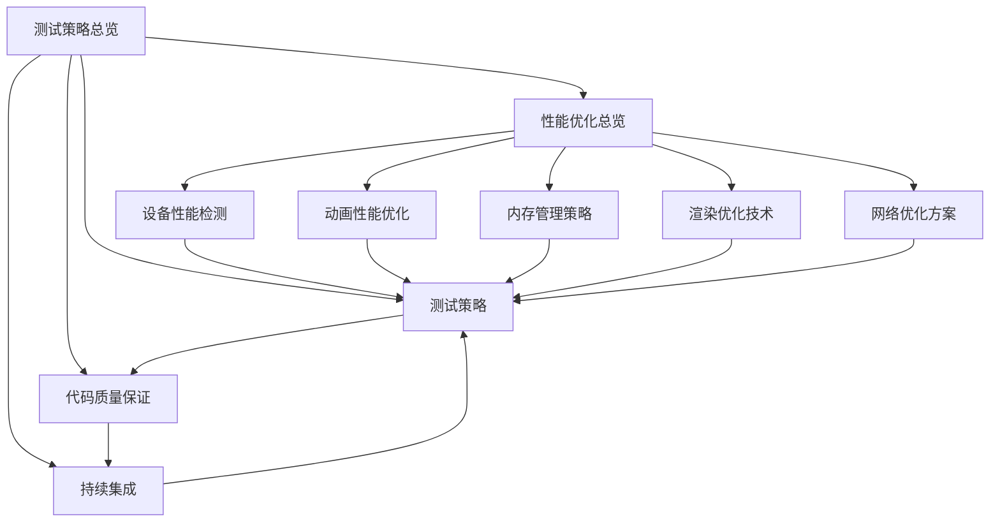

# Flutter图像去雾系统 - 测试与性能优化总览

**文档版本**: v2.0
**最后更新**: 2025-11-22
**重构自**: [PERFORMANCE_AND_TESTING.md](../PERFORMANCE_AND_TESTING.md)

---

## 文档概述

本文档集提供了Flutter图像去雾系统的全面测试策略和性能优化指导，基于Clean Architecture + Feature-First架构模式，专注于Flutter前端的测试方法、性能优化技术和质量保证体系。

### 重构目标

#### 前端聚焦原则
- **专注Flutter测试**：重点关注Flutter应用的测试策略和性能优化
- **实践导向**：提供具体的实施方案和代码示例
- **多平台覆盖**：支持6个主要平台的测试和优化
- **质量保证**：建立完整的质量体系和自动化流程

#### 架构对齐
- **基于现有架构**：与`dehaze_flutter/docs/architecture`中的架构设计保持一致
- **参考产品原型**：结合demo文件夹中的需求单和HTML设计稿
- **界面设计指导**：参考`dehaze_flutter/docs/design`中的界面设计规范

---

## 文档结构说明

### 组织架构图

```
dehaze_flutter/docs/test/
├── README.md                           # 本文档 - 测试策略总览
├── 00-performance-overview.md          # 性能优化总览
├── 01-device-performance.md            # 设备性能检测与分级
├── 02-animation-performance.md         # 动画性能优化
├── 03-memory-management.md             # 内存管理策略
├── 04-rendering-optimization.md        # 渲染优化技术
├── 05-network-optimization.md          # 网络优化方案
├── 06-testing-strategy.md              # 测试策略
├── 07-code-quality.md                  # 代码质量保证
└── 08-continuous-integration.md        # 持续集成
```

### 文档关系图



---

## 文档内容概览

### 1. 性能优化总览 ([00-performance-overview.md](00-performance-overview.md))

**主要内容**：
- 性能优化框架和分级体系
- 设备性能分级和适配策略
- 分层优化策略和技术总览
- 性能目标与指标定义

**核心价值**：
- 提供Flutter性能优化的整体视图
- 建立科学的性能分级体系
- 明确各层级优化措施和预期效果

**关键特色**：
- 5层性能优化架构（应用层、渲染层、内存层、网络层、算法层）
- 设备性能分级标准（高端、中端、低端）
- 完整的性能指标体系和监控方案

### 2. 设备性能检测 ([01-device-performance.md](01-device-performance.md))

**主要内容**：
- CPU、内存、GPU、存储性能检测策略
- 设备性能分级算法和配置映射
- 实时性能监控和动态调整
- 性能数据收集和分析

**核心价值**：
- 建立科学的设备性能评估体系
- 实现基于性能的智能适配
- 提供持续的性能监控和优化

**关键特色**：
- 4维度硬件能力评估（CPU、内存、GPU、存储）
- 5级设备分级体系（旗舰级到基础级）
- 自适应性能配置和动态调整机制

### 3. 动画性能优化 ([02-animation-performance.md](02-animation-performance.md))

**主要内容**：
- 动画分级策略和帧率控制机制
- GPU加速优化和特效性能管理
- 动画性能监控和调试工具集成
- 不同设备等级的动画配置

**核心价值**：
- 确保在各种设备上都有流畅的动画体验
- 平衡视觉效果和性能消耗
- 提供完整的动画优化工具链

**关键特色**：
- 4级动画复杂度分级（复杂到基础）
- 动态帧率调整和GPU硬件加速
- 粒子系统和特效的分级优化

### 4. 内存管理策略 ([03-memory-management.md](03-memory-management.md))

**主要内容**：
- 内存监控体系和状态分级管理
- 资源生命周期管理和清理策略
- 多级缓存架构和智能缓存算法
- 内存泄漏防护和自动修复机制

**核心价值**：
- 防止内存泄漏，提升应用稳定性
- 优化内存使用，支持长期稳定运行
- 建立科学的内存监控和告警体系

**关键特色**：
- 4级内存监控体系（正常、警告、危险、严重）
- 3级缓存架构（内存、磁盘、网络）
- 自动内存清理和泄漏检测修复

### 5. 渲染优化技术 ([04-rendering-optimization.md](04-rendering-optimization.md))

**主要内容**：
- 懒加载策略和虚拟化列表实现
- 图像格式选择和压缩优化
- 渲染管线优化和GPU加速
- 渲染性能监控和调试

**核心价值**：
- 提升UI渲染性能和响应速度
- 优化图像处理和显示效率
- 确保流畅的用户界面体验

**关键特色**：
- 页面、组件、数据三级懒加载
- 智能图像格式选择和压缩策略
- 批处理渲染和着色器优化

### 6. 网络优化方案 ([05-network-optimization.md](05-network-optimization.md))

**主要内容**：
- 请求合并策略和智能缓存管理
- 离线支持设计和数据同步机制
- 自适应网络策略和性能监控
- 网络安全和传输优化

**核心价值**：
- 提升网络请求效率，减少延迟
- 支持离线使用，增强用户体验
- 建立可靠的网络通信体系

**关键特色**：
- 批量请求管理和去重机制
- 多级缓存架构和预测性缓存
- 完整的离线队列管理和数据同步

### 7. 测试策略 ([06-testing-strategy.md](06-testing-strategy.md))

**主要内容**：
- 测试金字塔架构和分层策略
- 单元测试、集成测试、端到端测试实现
- 性能测试和自动化测试流程
- 测试数据管理和Mock策略

**核心价值**：
- 建立科学的测试体系，保证代码质量
- 实现全面的测试覆盖，预防缺陷
- 提供可执行的自动化测试方案

**关键特色**：
- 7:2:1测试比例分配（单元、集成、端到端）
- 完整的测试用例示例和Mock策略
- 跨平台兼容性测试和性能基准测试

### 8. 代码质量保证 ([07-code-quality.md](07-code-quality.md))

**主要内容**：
- 静态代码分析和自定义规则
- 代码审查流程和自动化工具
- 编码规范制定和结构检查
- 技术债务管理和质量度量

**核心价值**：
- 建立完善的代码质量保证体系
- 规范开发流程，提升代码可维护性
- 实现持续的质量监控和改进

**关键特色**：
- 120+项静态代码分析规则
- 自动化PR审查和质量门禁
- 技术债务跟踪和质量趋势分析

### 9. 持续集成 ([08-continuous-integration.md](08-continuous-integration.md))

**主要内容**：
- CI/CD流水线架构和多平台部署
- 自动化测试集成和质量门禁
- 构建监控告警和性能回归检测
- 安全扫描和部署策略

**核心价值**：
- 实现代码变更的自动化交付
- 确保快速、安全、可靠的软件部署
- 建立完善的DevOps实践体系

**关键特色**：
- 8阶段CI/CD流水线设计
- 多平台构建和部署策略
- 完整的监控告警和质量保证机制

---

## 使用指南

### 阅读路径建议

#### 新手入门（了解基础）
1. **[性能优化总览](00-performance-overview.md)** - 建立整体概念
2. **[测试策略](06-testing-strategy.md)** - 学习测试基础
3. **[代码质量保证](07-code-quality.md)** - 了解质量标准

#### 性能优化（提升应用性能）
1. **[设备性能检测](01-device-performance.md)** - 理解性能评估
2. **[动画性能优化](02-animation-performance.md)** - 优化用户体验
3. **[内存管理策略](03-memory-management.md)** - 防止性能问题
4. **[渲染优化技术](04-rendering-optimization.md)** - 提升界面性能
5. **[网络优化方案](05-network-optimization.md)** - 优化数据传输

#### 质量保证（建立开发标准）
1. **[代码质量保证](07-code-quality.md)** - 制定质量标准
2. **[测试策略](06-testing-strategy.md)** - 实现测试覆盖
3. **[持续集成](08-continuous-integration.md)** - 建立自动化流程

#### DevOps实践（完善开发流程）
1. **[持续集成](08-continuous-integration.md)** - 建立CI/CD流程
2. **[性能优化总览](00-performance-overview.md)** - 集成性能检查
3. **[代码质量保证](07-code-quality.md)** - 集成质量检查

### 实施建议

#### 渐进式实施策略

**第一阶段：基础建设（1-2周）**
- 建立代码质量标准和静态分析
- 实现基础的单元测试覆盖
- 配置CI/CD基础流水线

**第二阶段：性能优化（2-3周）**
- 实施设备性能检测和分级
- 优化内存管理和渲染性能
- 建立性能监控体系

**第三阶段：全面覆盖（2-3周）**
- 完善测试策略和自动化
- 实现网络优化和离线支持
- 建立完整的质量保证体系

**第四阶段：持续改进（长期）**
- 监控性能趋势和质量指标
- 优化CI/CD流程和效率
- 持续改进最佳实践

### 团队协作建议

#### 角色分工

| 角色 | 主要职责 | 关键文档 |
|------|---------|---------|
| **架构师** | 性能架构设计、技术选型 | 00-performance-overview.md |
| **开发工程师** | 代码实现、单元测试 | 01-05专项文档, 06-testing-strategy.md |
| **测试工程师** | 测试策略、自动化测试 | 06-testing-strategy.md |
| **DevOps工程师** | CI/CD流程、部署策略 | 08-continuous-integration.md |
| **质量保证** | 代码审查、质量监控 | 07-code-quality.md |

#### 协作流程

1. **需求分析阶段**：参考性能优化总览，制定性能目标
2. **设计阶段**：参考具体优化文档，设计性能方案
3. **开发阶段**：遵循编码规范，实现测试覆盖
4. **测试阶段**：执行测试策略，验证性能指标
5. **部署阶段**：通过CI/CD流程，确保质量标准
6. **维护阶段**：监控性能趋势，持续优化改进

---

## 技术栈总览

### 性能优化技术

| 技术类别 | 具体技术 | 应用场景 |
|---------|---------|---------|
| **性能监控** | Flutter DevTools | 应用性能分析 |
| **设备检测** | device_info_plus | 设备性能评估 |
| **内存管理** | Dart VM内存管理 | 内存优化控制 |
| **渲染优化** | GPU硬件加速 | UI渲染性能提升 |
| **网络优化** | Dio + 缓存策略 | 网络请求优化 |

### 测试技术

| 技术类别 | 具体技术 | 应用场景 |
|---------|---------|---------|
| **单元测试** | Flutter Test + mocktail | 组件和逻辑测试 |
| **集成测试** | Integration Test | 模块间集成测试 |
| **端到端测试** | Integration Test | 完整用户流程测试 |
| **性能测试** | Flutter Driver + 自定义监控 | 性能基准测试 |
| **自动化测试** | GitHub Actions | CI/CD自动化 |

### 质量保证工具

| 工具类别 | 具体工具 | 用途说明 |
|---------|---------|---------|
| **静态分析** | dart analyze + custom rules | 代码质量检查 |
| **代码审查** | GitHub + 自动化工具 | 代码变更质量控制 |
| **安全扫描** | Trivy + OWASP | 安全漏洞检测 |
| **依赖管理** | Flutter pub + safety | 依赖安全检查 |
| **监控告警** | Slack + 自定义监控 | 实时状态通知 |

---

## 重构说明

### 重构背景

原始的[PERFORMANCE_AND_TESTING.md](../PERFORMANCE_AND_TESTING.md)文档存在以下问题：
- **内容过于集中**：单个文档包含过多内容，难以维护
- **缺乏模块化**：不同主题混合在一起，不易查阅
- **实践指导不足**：缺少具体的实施方案和代码示例
- **Flutter特性不突出**：通用内容过多，Flutter特色不明确

### 重构成果

#### 内容优化
- **模块化设计**：将单一文档拆分为9个专题文档
- **Flutter聚焦**：专门针对Flutter应用进行优化和测试指导
- **实践导向**：提供丰富的代码示例和实施方案
- **架构对齐**：与现有架构设计保持一致

#### 结构改进
- **清晰层级**：建立清晰的文档层级和阅读路径
- **交叉引用**：通过相互引用建立文档关联
- **易于维护**：模块化结构便于独立更新和维护
- **用户友好**：提供详细的使用指南和实施建议

### 预期效果

通过本次重构，预期能够：
- **提升开发效率**：开发者能快速找到所需指导
- **改善代码质量**：统一的规范和最佳实践
- **增强应用性能**：科学的性能优化策略
- **保证交付质量**：完善的测试和质量保证体系

---

## 文档维护

### 更新策略

- **定期更新**：根据项目进展及时更新文档内容
- **版本管理**：每次更新时更新版本号和日期
- **交叉验证**：确保文档间内容的一致性
- **用户反馈**：根据开发团队反馈改进文档

### 贡献指南

#### 文档改进
1. 发现错误或不一致时，及时修正
2. 新增功能特性时，补充相应文档
3. 代码实现变更时，同步更新文档
4. 性能优化改进时，更新最佳实践

#### 最佳实践
1. **示例代码**：提供完整、可运行的代码示例
2. **图表说明**：使用图表清晰展示架构关系
3. **实际案例**：结合具体业务场景说明
4. **量化指标**：提供可测量的性能目标和标准

### 版本历史

| 版本 | 日期 | 更新内容 | 负责人 |
|------|------|----------|--------|
| v2.0 | 2025-11-22 | 完整重构，拆分为9个专题文档 | 性能测试团队 |
| v1.0 | 2025-11-22 | 原始PERFORMANCE_AND_TESTING.md | 架构设计组 |

---

## 相关资源

### 项目文档
- [架构设计文档](../architecture/00-overview.md) - Flutter架构设计
- [UI组件设计](../architecture/02-ui-components.md) - 组件设计规范
- [状态管理架构](../architecture/03-state-management.md) - 状态管理设计

### 外部资源
- [Flutter官方测试文档](https://flutter.dev/docs/testing) - Flutter测试指南
- [Flutter性能优化指南](https://flutter.dev/docs/perf) - Flutter性能最佳实践
- [CI/CD最佳实践](https://flutter.dev/docs/deployment/cd) - 持续集成和部署

### 工具和框架
- [Flutter DevTools](https://flutter.dev/docs/development/tools/devtools/overview) - Flutter开发和调试工具
- [GitHub Actions](https://github.com/features/actions) - CI/CD自动化平台
- [Codecov](https://codecov.io/) - 代码覆盖率分析平台

---

## 联系和支持

### 问题反馈

如果您在使用本文档时发现问题或有改进建议，请通过以下方式反馈：

1. **GitHub Issues**：在项目仓库中创建Issue
2. **团队讨论**：在团队会议中提出
3. **邮件联系**：发送邮件给项目负责人

### 文档协作

如果您希望参与文档的维护和改进：

1. **内容贡献**：提交新的文档内容或修改建议
2. **代码示例**：提供实际项目的代码实现
3. **最佳实践**：分享开发和部署经验
4. **性能优化**：贡献性能优化经验和技巧

---

**文档版本**: v2.0
**最后更新**: 2025-11-22
**重构自**: [PERFORMANCE_AND_TESTING.md](../PERFORMANCE_AND_TESTING.md)

---

*本文档集将随着项目的发展持续更新和完善，确保始终反映最新的性能优化策略、测试最佳实践和质量保证标准。*