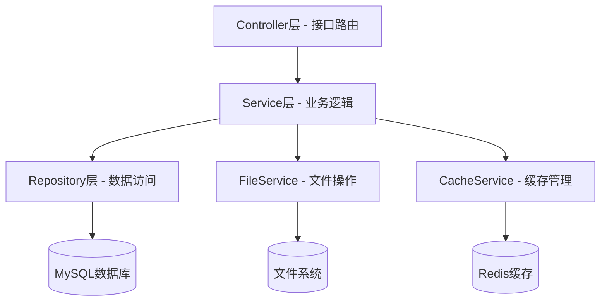
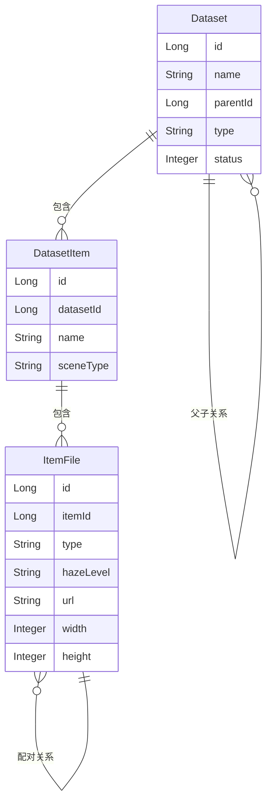
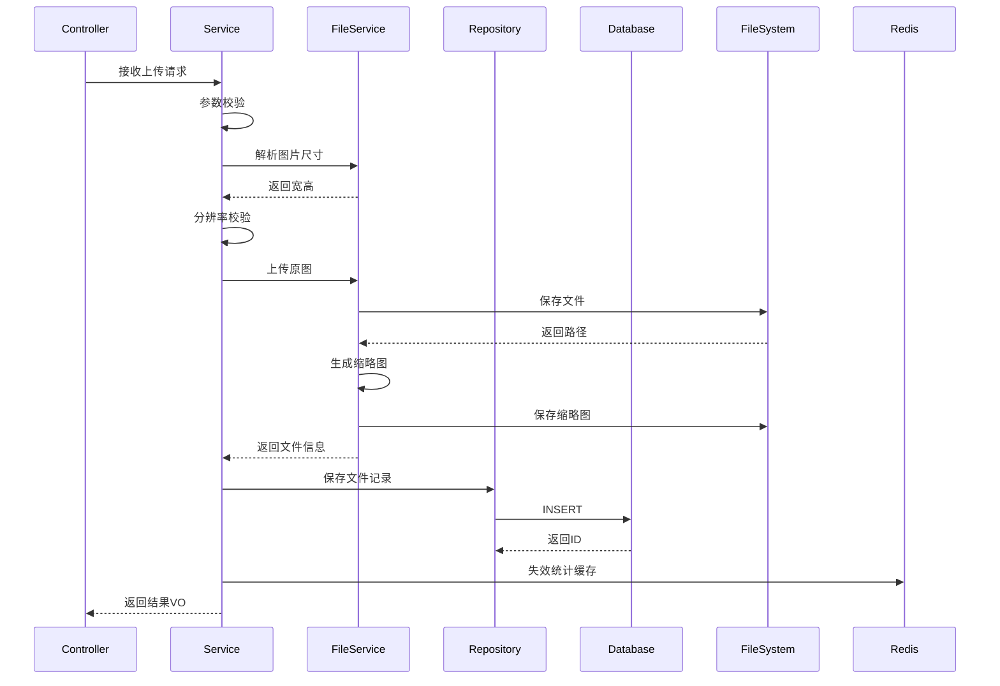
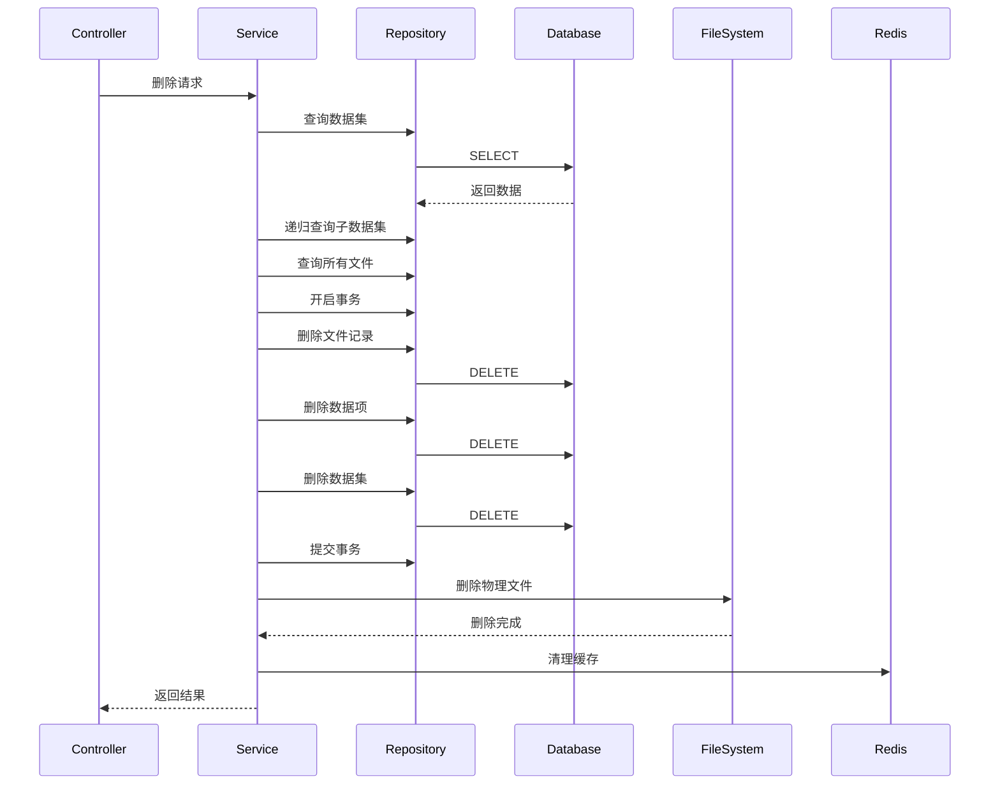

# 数据集管理模块 - 代码设计文档

**文档版本**: v1.0  
**创建日期**: 2025-12-14  
**模块编号**: M06  
**设计原则**: 语言无关、框架无关、逻辑优先

---

## 一、架构设计

### 1.1 模块分层架构

### 1.2 核心实体关系

---

## 二、通用业务模式（DRY原则）

### 2.1 标准CRUD模式

所有实体的增删改查遵循统一模式，后续接口不再重复描述：

**查询流程**：

**创建流程**：

**更新流程**：

**删除流程**：

### 2.2 通用校验规则

**参数校验**（所有接口适用）：

- 必填字段非空校验
- 字符串长度限制
- 数值范围校验
- 格式合法性校验

**业务校验**（根据场景应用）：

- 唯一性校验（名称、编码等）
- 存在性校验（外键关联）
- 权限校验（用户权限）
- 状态校验（实体状态）

### 2.3 通用异常处理

**异常分类**：

1. **参数异常**：返回400，提示具体参数错误
2. **业务异常**：返回400，提示业务规则错误
3. **资源不存在**：返回404，提示资源未找到
4. **权限异常**：返回403，提示无权限操作
5. **系统异常**：返回500，记录日志并返回通用错误

**异常处理原则**：

- 所有异常必须捕获并转换为统一响应格式
- 敏感信息不暴露给前端
- 详细错误信息记录到日志
- 事务性操作失败需回滚

### 2.4 通用缓存策略

**缓存场景**：

- 数据集统计信息（使用次数、图片数量等）
- 数据集树形结构
- 热点数据查询结果

**缓存更新策略**：

- 创建操作：更新相关缓存
- 更新操作：失效相关缓存
- 删除操作：清理相关缓存
- 缓存过期时间：根据数据变化频率设置（统计数据30分钟，基础数据1小时）

---

## 三、数据流转设计

### 3.1 图片上传数据流

### 3.2 数据集删除数据流

---

## 四、与现状差异分析

> **重要说明**：本章节对比当前实现与设计目标的差异，所有与设计不符的代码均需**完全重构**。

### 4.1 架构差异

| 设计要求          | 当前实现                                                 | 差异影响          | 重构方式        |
|---------------|------------------------------------------------------|---------------|-------------|
| **主链路与副作用分离** | 缩略图生成、统计刷新、文件删除均在同步链路                                | 响应慢、失败率高、事务复杂 | 引入事务后事件机制   |
| **统一用例服务**    | `DatasetOperationServiceImpl` 边界不清晰，与 Service 存在重复实现 | 级联删除等逻辑分散多处   | 明确用例边界，单一职责 |
| **导出任务域模型**   | `DownloadServiceImpl` 仅使用 Redis，无任务生命周期管理            | 无法取消、无审计、清理混乱 | 建立统一任务模型    |

### 4.2 代码结构差异

| 模块            | 设计要求                                     | 当前实现                     | 问题                                                                                 |
|---------------|------------------------------------------|--------------------------|------------------------------------------------------------------------------------|
| **Service职责** | 单资源 CRUD                                 | 混杂级联删除、统计计算等复合操作         | `SysDatasetItemServiceImpl.deleteDatasetItem()` 与 `DatasetOperationServiceImpl` 重复 |
| **树与叶子节点**    | 一次性查询+内存计算                               | 递归查库或多次查询                | N+1 查询问题                                                                           |
| **异步任务**      | `@Async` + `@TransactionalEventListener` | `@Async` 方法在同类内部调用（代理失效） | `DownloadServiceImpl.createDatasetDownloadTask()` 异步失效                             |

### 4.3 接口设计差异

| 接口      | 设计路径                            | 当前实现                                 | 差异             |
|---------|---------------------------------|--------------------------------------|----------------|
| 更新数据集   | `PUT /api/v1/datasets/{id}`     | `PUT /api/v1/datasets` (无 `{id}`)    | 路径不符合 REST 规范  |
| 图片文件资源  | `/item-files`                   | `/dataset-item-files`                | 命名冗长           |
| 批量删除数据集 | `DELETE /api/v1/datasets/batch` | `DELETE /api/v1/datasets` (body ids) | 缺少 `/batch` 后缀 |
| 分页结构    | 文档设想的结构                         | `PageResult` 包装                      | 与实际返回结构不一致     |

### 4.4 数据结构差异

| 字段        | 设计       | 当前实现                                       | 影响                             |
|-----------|----------|--------------------------------------------|--------------------------------|
| **缩略图字段** | 文档未明确    | `SysItemFile.thumbnailFileId` 指向 `SysFile` | 更新缩略图需操作 `SysFile` 表，而非简单写 URL |
| **文件大小**  | 数值类型（字节） | `SysFile.size` 为字符串（如 "1.2MB"）             | 搜索/排序时需 `REPLACE` + `CAST`，性能差 |
| **统计字段**  | 缓存存储     | 每次实时计算                                     | 无缓存导致重复查库                      |

### 4.5 缓存与性能差异

| 功能         | 设计要求              | 当前实现                       | 瓶颈        |
|------------|-------------------|----------------------------|-----------|
| **统计信息**   | Redis 缓存，TTL 30分钟 | 每次请求都计算                    | 热点接口打爆数据库 |
| **树形结构**   | 一次性查询+内存构建        | 递归查库                       | N+1 查询    |
| **叶子节点计算** | 闭包表或递归内存计算        | `getLeafDatasetIds()` 递归查库 | 深树会指数级查询  |

### 4.6 错误处理差异

| 场景        | 设计要求                                                        | 当前实现                                       | 问题          |
|-----------|-------------------------------------------------------------|--------------------------------------------|-------------|
| 资源不存在     | `BusinessException` + `ResultCode.RESOURCE_NOT_FOUND` → 404 | `RuntimeException("数据项不存在")` → 400         | 语义错误        |
| 文件删除失败    | 异步重试+补偿                                                     | 同步删除，失败阻塞事务                                | 外部系统失败影响主流程 |
| Local存储实现 | 不支持或明确禁用                                                    | `LocalFileService.deleteFile()` 永远返回 false | 本地模式删除不可用   |

### 4.7 测试覆盖差异

| 设计要求         | 当前实现     |
|--------------|----------|
| 用例级集成测试覆盖主流程 | 无数据集模块测试 |
| 树/叶子节点计算单元测试 | 无        |
| 接口契约测试       | 无        |

### 4.8 重构优先级

| 优先级            | 重构项             | 工作量  | 阻塞性          |
|----------------|-----------------|------|--------------|
| **P0（必须立即修复）** | 下载任务异步失效问题      | 0.5天 | 严重 - 接口实际阻塞  |
| **P0**         | Local 存储实现修复/禁用 | 0.5天 | 严重 - 删除功能不可用 |
| **P0**         | 统一异常处理与错误码      | 1天   | 高 - 影响监控告警   |
| **P1（性能关键）**   | 统计/树/叶子节点缓存     | 2天   | 高 - 扩展性瓶颈    |
| **P1**         | 事务后事件机制         | 3天   | 中 - 稳定性提升    |
| **P2（可扩展性）**   | 接口规范对齐          | 2天   | 低 - 可后续迭代    |
| **P2**         | 统一任务中心          | 5天   | 低 - 功能增强     |

---

## 五、关键业务规则总结

### 4.1 配对图片规则

1. **配对结构**：
    - 每个数据项（DatasetItem）包含一组配对图片
    - 必须有且仅有一张清晰图（type=clear）
    - 可以有多张有雾图（type=hazy），每张标注不同雾霾程度

2. **分辨率一致性**：
    - 同一数据项下所有图片分辨率必须完全一致
    - 上传时强制校验，不一致则拒绝

3. **雾霾程度标注**：
    - 有雾图必须标注hazeLevel：light（轻度）、medium（中度）、heavy（重度）
    - 清晰图的hazeLevel为null

### 4.2 缓存管理规则

1. **统计信息缓存**：
    - 键格式：`dataset:stats:{datasetId}`
    - 过期时间：30分钟
    - 更新时机：数据项或文件增删改时失效

2. **树形结构缓存**：
    - 键格式：`dataset:tree`
    - 过期时间：1小时
    - 更新时机：数据集增删改时失效

### 4.3 文件管理规则

1. **存储路径**：
    - 原图：`/{rootPath}/{datasetName}/{itemId}/{filename}`
    - 缩略图：`/{rootPath}/{datasetName}/{itemId}/thumb_{filename}`

2. **缩略图生成**：
    - 固定宽度：200px
    - 高度等比缩放
    - 格式：与原图相同

3. **文件删除**：
    - 数据库记录删除成功后再删除物理文件
    - 删除失败不影响业务流程，记录日志

### 4.4 异常处理规则

1. **参数校验失败**：返回400，提示具体字段错误
2. **资源不存在**：返回404，提示资源类型和ID
3. **业务规则违反**：返回400，提示具体业务规则
4. **文件操作失败**：返回500，记录详细日志
5. **数据库异常**：事务回滚，返回500

---
