## 二、数据集管理接口设计

> **重要**：本章节接口需要完全重构，统一路径、参数命名、返回结构与 REST 规范对齐。

### 2.1 获取数据集列表

**接口路径**: `GET /api/v1/datasets`

**当前实现差异**：
| 项目 | 设计 | 当前实现 | 重构方式 |
|------|------|---------|---------|
| 路径 | 符合 | 符合 | 无需改动 |
| 分页结构 | `PageResult` | 符合 | 无需改动 |
| 统计计算 | 缓存 | 实时计算（每次查库） | 增加 Redis 缓存 |

**请求参数**：

```
keyword: string      # 关键字搜索（name/description模糊查询）
type: string         # 数据集类型筛选
status: integer      # 状态筛选
pageNum: integer     # 页码（默认1）
pageSize: integer    # 每页大小（默认20）
```

**响应示例**（基于实际 `PageResult`）：

```json
{
  "code": "00000",
  "msg": "一切ok",
  "data": {
    "list": [
      {
        "id": 1,
        "name": "户外场景数据集",
        "description": "包含各种户外雾霾场景",
        "type": "training",
        "status": 1,
        "parentId": null,
        "path": "/户外场景数据集",
        "hasChildren": true,
        "statistics": {
          "itemCount": 120,
          "fileCount": 450,
          "totalSize": 15360000000,
          "sceneDistribution": {"outdoor": 80, "indoor": 40},
          "hazeDistribution": {"light": 150, "medium": 200, "heavy": 100}
        },
        "createTime": "2025-01-01T10:00:00",
        "updateTime": "2025-01-10T15:30:00"
      }
    ],
    "total": 50
  }
}
```

**业务逻辑**：

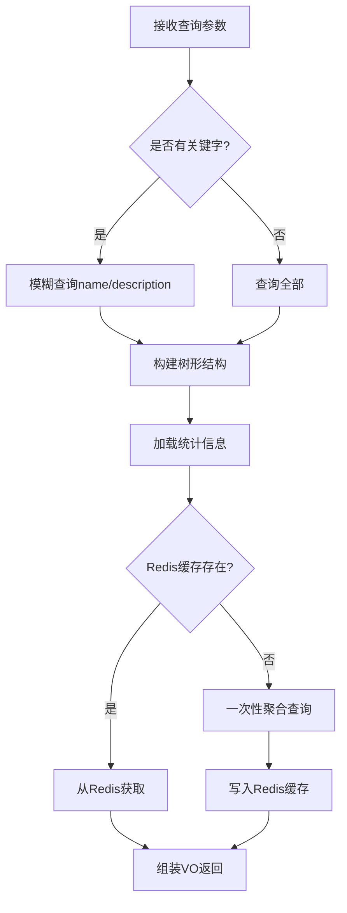

**关键逻辑**：

- 树形结构构建：一次性查询所有数据集，内存构建父子关系（避免 N+1）
- 统计信息优先从 Redis 获取（Key: `dataset:stats:{id}`，TTL: 30分钟）
- 统计包括：图片总数、占用空间、使用次数、场景分布、雾霾程度分布

**性能优化**：

- ✅ 统计信息异步计算并缓存（事务后事件触发）
- ✅ 树形结构一次性加载（BFS 内存计算）
- ✅ 聚合查询使用 `SysDatasetMapper.aggregateStatistics()`

---

### 2.2 获取数据集详情

**接口路径**: `GET /api/v1/datasets/{id}`

**当前实现差异**：
| 项目 | 设计 | 当前实现 | 重构方式 |
|------|------|---------|---------|
| 路径参数 | `{id}` | `{datasetId}` | 统一改为 `{id}` |
| 统计计算 | 缓存 | 实时计算 | 增加 Redis 缓存 |

**请求参数**：

```
路径参数：
  id: Long      # 数据集ID
```

**响应示例**：

```json
{
  "code": "00000",
  "msg": "一切ok",
  "data": {
    "id": 1,
    "name": "户外场景数据集",
    "description": "包含各种户外雾霾场景",
    "type": "training",
    "status": 1,
    "parentId": null,
    "path": "/户外场景数据集",
    "children": [
      {
        "id": 2,
        "name": "城市街道",
        "parentId": 1,
        "itemCount": 50
      }
    ],
    "statistics": {
      "itemCount": 120,
      "fileCount": 450,
      "totalSize": 15360000000,
      "clearCount": 120,
      "hazyCount": 330,
      "sceneDistribution": {"outdoor": 280, "indoor": 170},
      "hazeDistribution": {"light": 150, "medium": 120, "heavy": 60},
      "formatDistribution": {"jpg": 400, "png": 50}
    },
    "createTime": "2025-01-01T10:00:00",
    "updateTime": "2025-01-10T15:30:00"
  }
}
```

**业务逻辑**：

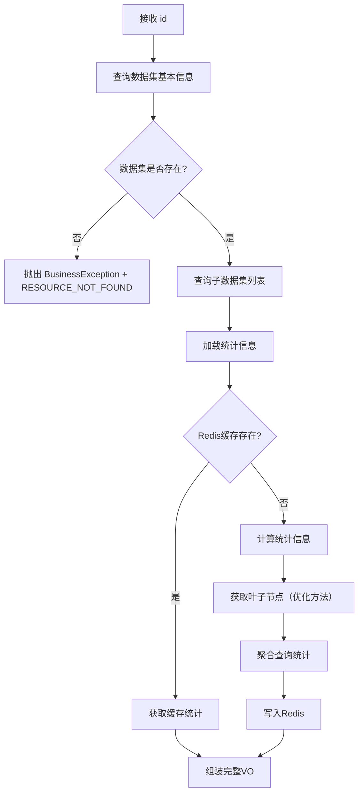

**统计信息计算逻辑**（优化后）：

```java
// 1. 获取叶子节点（一次查询 + 内存 BFS）
Set<Long> leafIds = getLeafDatasetIdsOptimized(datasetId);

// 2. 一次聚合查询（避免循环查询）
DatasetStatistics stats = datasetMapper.aggregateStatistics(leafIds);
```

**缓存键设计**：`dataset:stats:{datasetId}`

---

### 2.3 创建数据集

**接口路径**: `POST /api/v1/datasets`

**当前实现差异**：
| 项目 | 设计 | 当前实现 | 重构方式 |
|------|------|---------|---------|
| 事件发布 | 是 | 否 | 增加事件发布 |
| 缓存失效 | 自动 | 手动 | 改为事件驱动 |

**请求体**：

```json
{
  "name": "户外场景数据集",
  "description": "包含各种户外雾霾场景",
  "type": "training",
  "status": 1,
  "parentId": null
}
```

**响应示例**：

```json
{
  "code": "00000",
  "msg": "一切ok",
  "data": {
    "id": 1,
    "name": "户外场景数据集",
    "path": "/户外场景数据集",
    "createTime": "2025-01-10T16:00:00"
  }
}
```

**业务逻辑**：

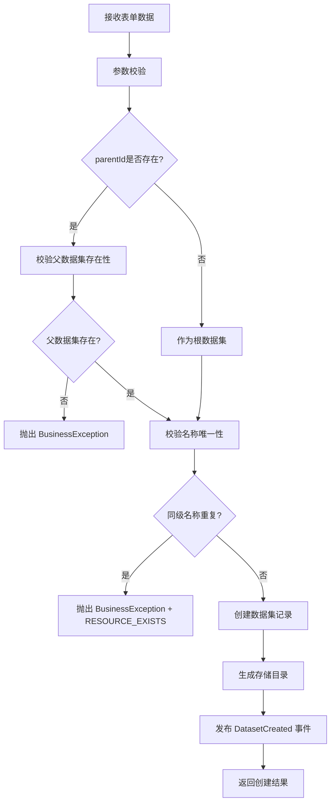

**关键校验**：

- 父数据集存在性：`parentId` 不为空时，必须存在对应记录
- 名称唯一性：同一父数据集下，`name` 不能重复（数据库唯一索引）
- 存储目录生成规则：`/数据集根目录/父数据集名称/当前数据集名称`

**事件驱动**（重构新增）：

```java
// 发布事件
eventPublisher.publishEvent(new DatasetEvent.DatasetCreated(this, dataset.getId()));

// 事件处理器（异步）
@TransactionalEventListener(phase = AFTER_COMMIT)
public void handleDatasetCreated(DatasetEvent.DatasetCreated event) {
    // 失效树形结构缓存
    redisTemplate.delete("dataset:tree");
    // 失效父数据集统计缓存
    invalidateStatsCache(dataset.getParentId());
}
```

---

### 2.4 更新数据集

**接口路径**: `PUT /api/v1/datasets/{id}`

**当前实现差异**：
| 项目 | 设计 | 当前实现 | 重构方式 |
|------|------|---------|---------|
| 路径 | `PUT /api/v1/datasets/{id}` | `PUT /api/v1/datasets` (无 `{id}`) | **重构路径** |
| 幂等性 | 是 | 否 | 增加幂等键校验 |

**请求体**：

```json
{
  "name": "户外场景数据集V2",
  "description": "更新后的描述",
  "type": "training",
  "status": 1
}
```

**响应示例**：

```json
{
  "code": "00000",
  "msg": "一切ok",
  "data": {
    "id": 1,
    "name": "户外场景数据集V2",
    "updateTime": "2025-01-10T16:30:00"
  }
}
```

**业务逻辑**：

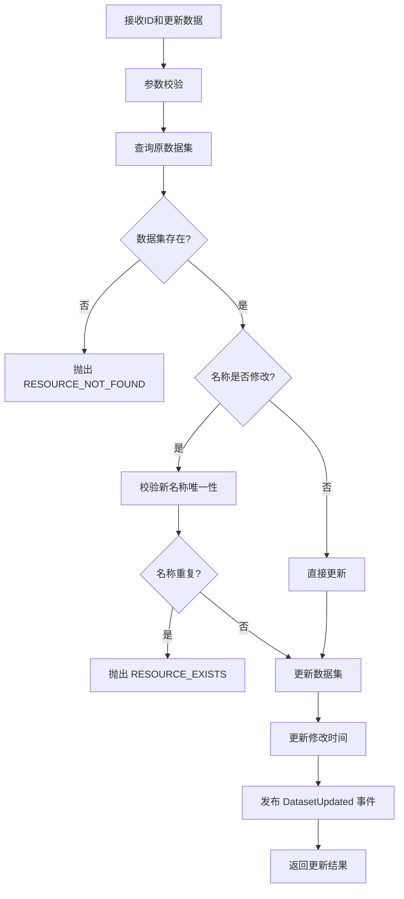

**可更新字段**：

- `name`: 数据集名称
- `description`: 描述信息
- `type`: 数据集类型
- `status`: 启用/禁用状态

**缓存失效**（事件驱动）：

- 当前数据集详情缓存
- 父数据集的子列表缓存
- 数据集树形结构缓存

---

### 2.5 删除数据集

**接口路径**:

- `DELETE /api/v1/datasets/{id}` - 删除单个数据集
- `DELETE /api/v1/datasets/batch` - 批量删除数据集

**当前实现差异**：
| 项目 | 设计 | 当前实现 | 重构方式 |
|------|------|---------|---------|
| 批量删除路径 | `DELETE /datasets/batch` | `DELETE /datasets` (body ids) | **重构路径** |
| 文件删除 | 异步 | 同步（阻塞事务） | 改为事件驱动 |

**单个删除请求**：

```
路径参数：
  id: Long      # 数据集ID
```

**批量删除请求**：

```json
{
  "ids": [1, 2, 3]
}
```

**单个删除响应**：

```json
{
  "code": "00000",
  "msg": "一切ok",
  "data": null
}
```

**批量删除响应**：

```json
{
  "code": "00000",
  "msg": "一切ok",
  "data": {
    "total": 3,
    "succeeded": 2,
    "failed": 1,
    "results": [
      {"id": 1, "status": "success"},
      {"id": 2, "status": "success"},
      {"id": 3, "status": "failed", "message": "数据集不存在", "errorCode": "RESOURCE_NOT_FOUND"}
    ]
  }
}
```

**业务逻辑**（单个删除）：

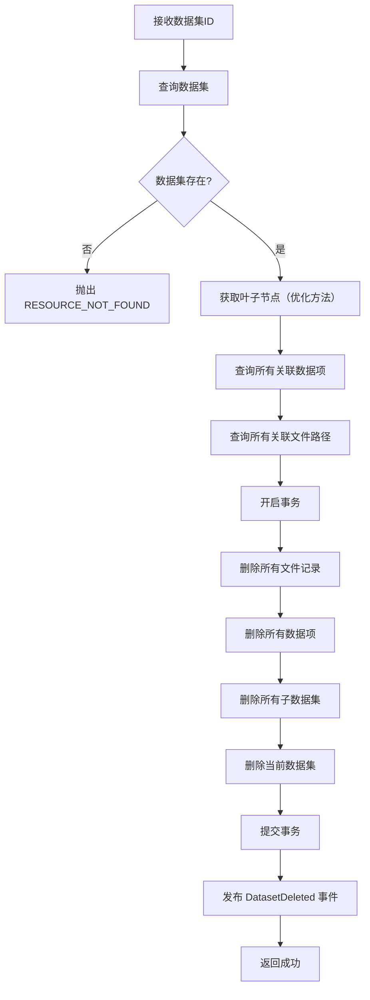

**级联删除范围**：

1. 当前数据集及所有子数据集（递归，使用优化后的叶子节点方法）
2. 所有关联的数据项（`sys_dataset_item`）
3. 所有关联的文件记录（`sys_item_file` + `sys_file`）
4. 所有物理文件（原图+缩略图）**→ 异步删除**

**事务控制**（重构重点）：

```java
@Override
@Transactional(rollbackFor = Exception.class)
public void deleteDataset(Long datasetId) {
    // 1. 查询所有文件路径（用于异步删除）
    List<String> filePaths = collectAllFilePaths(datasetId);
    
    // 2. 数据库删除操作（同步+事务）
    deleteDatasetRecords(datasetId);  // 包括子数据集、数据项、文件记录
    
    // 3. 事务提交后发布事件（异步删除物理文件）
    eventPublisher.publishEvent(new DatasetEvent.DatasetDeleted(
        this, datasetId, filePaths
    ));
}
```

**异步文件删除**（避免阻塞事务）：

```java
@Async("datasetTaskExecutor")
@TransactionalEventListener(phase = AFTER_COMMIT)
public void handlePhysicalFileDeletion(DatasetEvent.DatasetDeleted event) {
    for (String filePath : event.getFilePaths()) {
        try {
            fileService.deleteFile(filePath);
        } catch (Exception e) {
            log.error("删除文件失败: {}", filePath, e);
            // 记录失败，由补偿任务处理
            recordDeletionFailure(filePath);
        }
    }
    
    // 清理缓存
    invalidateStatsCache(event.getDatasetId());
    invalidateTreeCache();
}
```

**批量结果返回**：

- `total`: 总数量
- `succeeded`: 成功数量
- `failed`: 失败数量
- `results`: 每个ID的处理结果

---

### 2.6 创建数据集下载任务

**接口路径**: `POST /api/v1/datasets/{id}/export`

**当前实现差异**：
| 项目 | 设计 | 当前实现 | 重构方式 |
|------|------|---------|---------|
| 路径 | `/datasets/{id}/export` | `/datasets/{datasetId}/download` | 统一为 `/export` |
| 异步实现 | 真异步 | **同类调用，@Async 失效** | **重构为独立 TaskExecutor** |
| 任务管理 | 完整生命周期 | 仅 Redis 状态 | 增加 `sys_task` 表 |

**请求体**：

```json
{
  "structure": "by_item",       // 文件组织方式：by_item | flat
  "includeTypes": ["clear", "hazy"],
  "includeThumbnail": false
}
```

**响应示例**：

```json
{
  "code": "00000",
  "msg": "一切ok",
  "data": {
    "taskId": "uuid-xxx",
    "status": "pending",
    "progress": 0,
    "totalFiles": 100,
    "processedFiles": 0,
    "createdAt": "2025-01-10T10:00:00",
    "downloadUrl": null,
    "expiresAt": null
  }
}
```

**业务逻辑**：

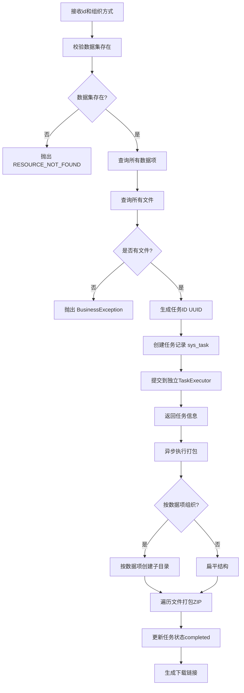

**异步任务设计**（重构重点）：

- 任务ID：UUID生成
- 任务状态：`pending` → `processing` → `completed`/`failed`/`cancelled`
- 任务信息存储：MySQL (`sys_task`) + Redis（进度）
- 进度更新：每打包 10 个文件更新一次进度

**修复异步失效问题**：

```java
// ❌ 错误实现（当前）
@Service
public class DownloadServiceImpl {
    public TaskVO createTask() {
        // ...
        this.processAsync();  // 同类调用，@Async 失效
    }
    
    @Async
    public void processAsync() {
        // 实际是同步执行
    }
}

// ✅ 正确实现（重构后）
@Service
public class TaskServiceImpl {
    private final TaskExecutor taskExecutor;  // 注入独立执行器
    
    public TaskVO createTask() {
        // ...
        taskExecutor.submitExportTask(taskId, params);  // 跨类调用，@Async 生效
    }
}

@Component
public class TaskExecutor {
    @Async("datasetTaskExecutor")
    public void submitExportTask(Long taskId, ExportParams params) {
        // 真正的异步执行
    }
}
```

**文件组织方式**：

- `by_item`：`数据集名称/数据项名称/文件名`
- `flat`：`数据集名称/文件名`

---

### 2.1 获取数据集列表

**接口路径**: `GET /api/v1/datasets`

**业务逻辑**：

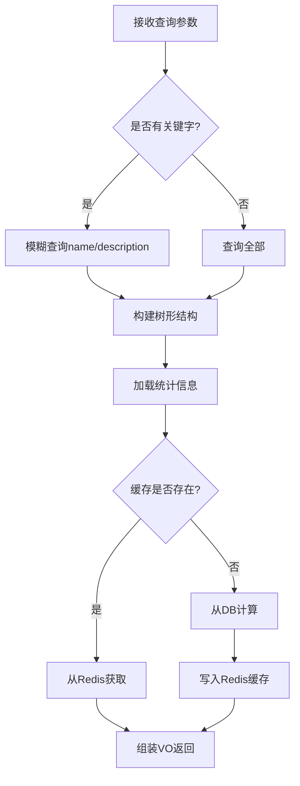

**关键逻辑**：

- 树形结构构建：递归查询父子关系，根节点parentId为null
- 统计信息优先从Redis获取，未命中则实时计算并缓存
- 统计包括：图片总数、占用空间、使用次数、场景分布、雾霾程度分布

**性能优化**：

- 统计信息异步计算并缓存
- 树形结构一次性加载，避免N+1查询

---

### 2.2 获取数据集详情

**接口路径**: `GET /api/v1/datasets/{datasetId}`

**业务逻辑**：

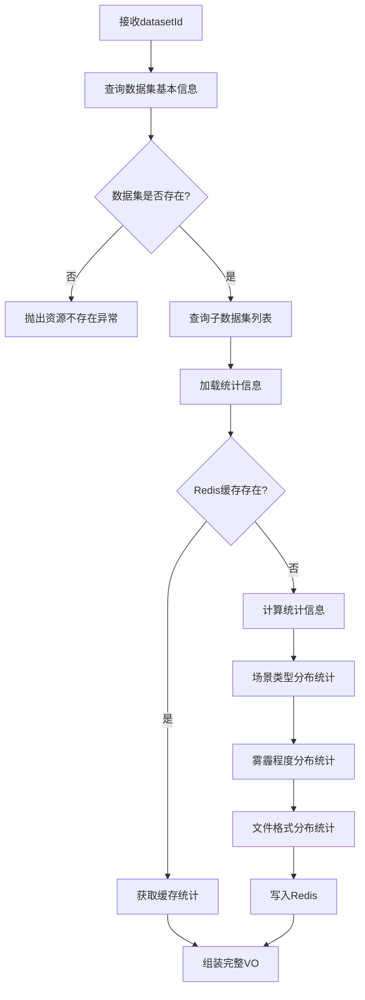

**统计信息计算逻辑**：

- 场景类型分布：GROUP BY sceneType，统计每种场景的图片数量
- 雾霾程度分布：GROUP BY hazeLevel，统计轻度/中度/重度/未标注数量
- 文件格式分布：从文件扩展名提取，统计jpg/png/gif等格式数量

**缓存键设计**：`dataset:stats:{datasetId}`

---

### 2.3 创建数据集

**接口路径**: `POST /api/v1/datasets`

**业务逻辑**：

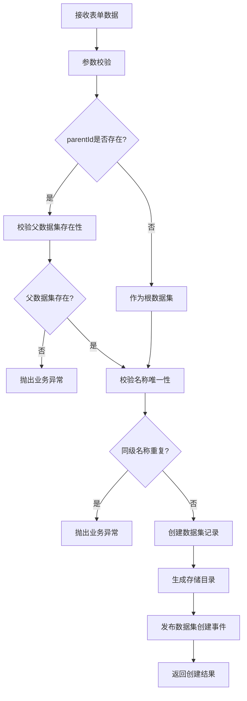

**关键校验**：

- 父数据集存在性：parentId不为空时，必须存在对应记录
- 名称唯一性：同一父数据集下，name不能重复
- 存储目录生成规则：`/数据集根目录/父数据集名称/当前数据集名称`

**事件驱动**：

- 发布 `DatasetCreatedEvent` 事件，异步触发缓存更新

**关键校验**：

- 父数据集存在性：parentId不为空时，必须存在对应记录
- 名称唯一性：同一父数据集下，name不能重复
- 存储目录生成规则：`/数据集根目录/父数据集名称/当前数据集名称`

**缓存更新**：

- 清除父数据集的子数据集列表缓存
- 清除数据集树形结构缓存

---

### 2.4 更新数据集

**接口路径**: `PUT /api/v1/datasets/{id}`

**业务逻辑**：

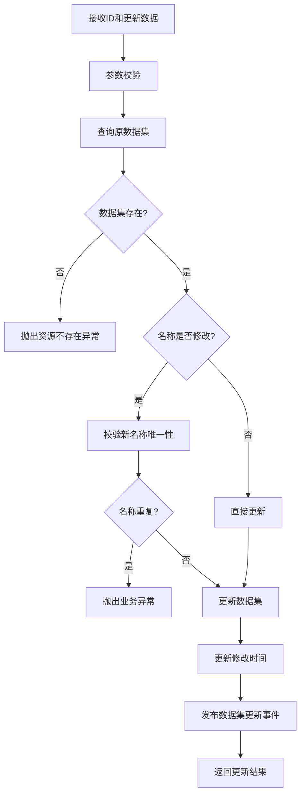

**可更新字段**：

- name：数据集名称
- description：描述信息
- type：数据集类型
- status：启用/禁用状态

**缓存失效**：

- 当前数据集详情缓存
- 父数据集的子列表缓存
- 数据集树形结构缓存

---

### 2.5 删除数据集

**接口路径**:

- `DELETE /api/v1/datasets/{id}` - 删除单个数据集
- `DELETE /api/v1/datasets/batch` - 批量删除数据集

**业务逻辑**（单个删除）：

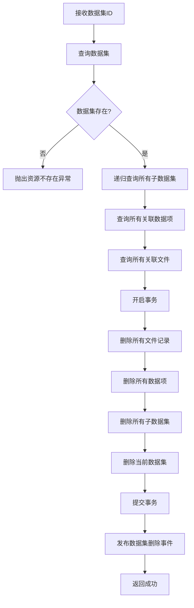

**业务逻辑**（批量删除）：

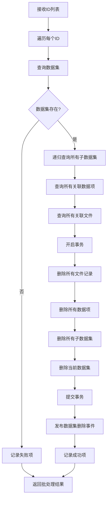

**级联删除范围**：

1. 当前数据集及所有子数据集（递归）
2. 所有关联的数据项（DatasetItem）
3. 所有关联的文件记录（ItemFile）
4. 所有物理文件（原图+缩略图）

**事务控制**：

- 数据库删除操作在同一事务中
- 事务提交后再删除物理文件
- 任一步骤失败则回滚事务

**批量结果返回**：

- 成功数量
- 失败数量
- 失败详情（ID + 失败原因）

---

### 2.6 创建数据集下载任务

**接口路径**: `POST /api/v1/datasets/{datasetId}/download`

**业务逻辑**：

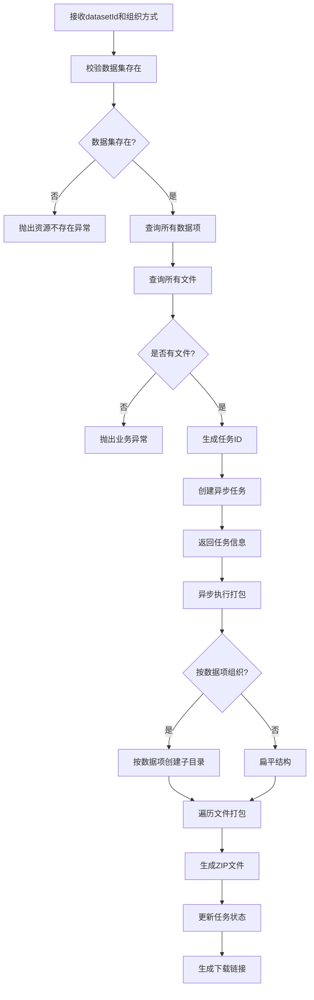

**异步任务设计**：

- 任务ID：UUID生成
- 任务状态：processing（处理中）、completed（完成）、failed（失败）
- 任务信息存储：Redis，过期时间24小时
- 进度更新：每打包10个文件更新一次进度

**文件组织方式**：

- 按数据项组织：`数据集名称/数据项名称/文件名`
- 扁平结构：`数据集名称/文件名`

---
