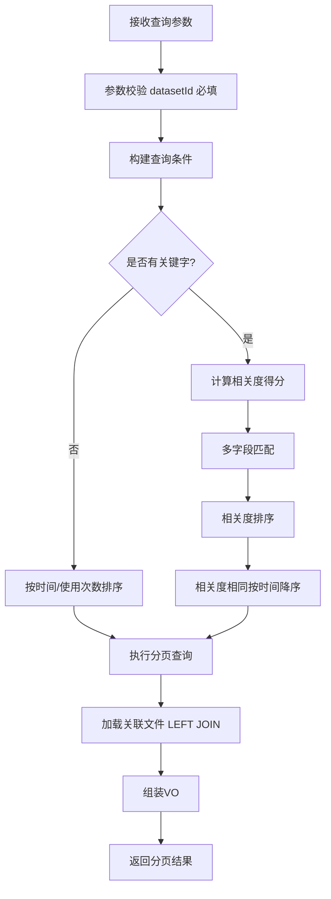
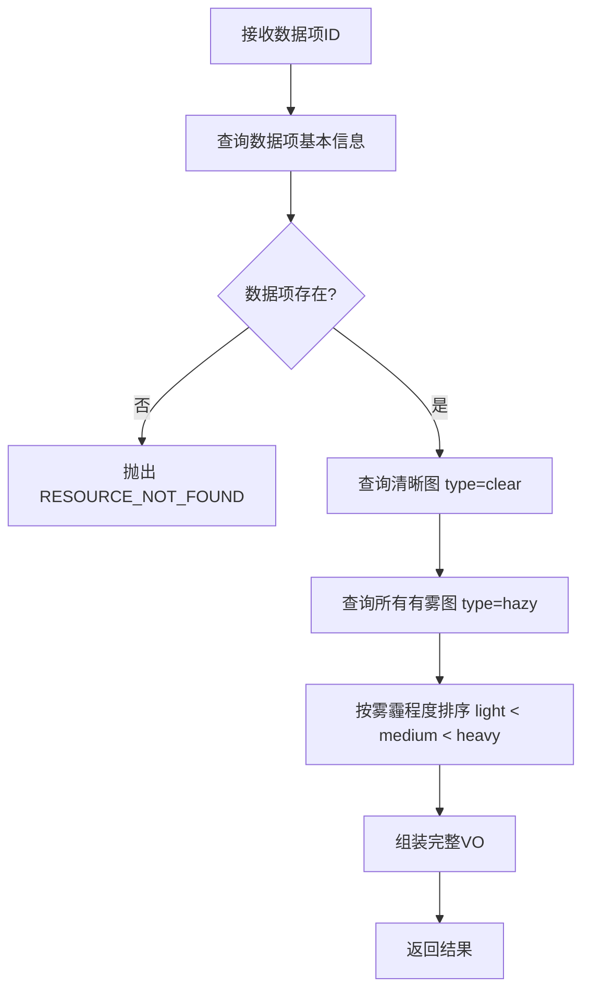
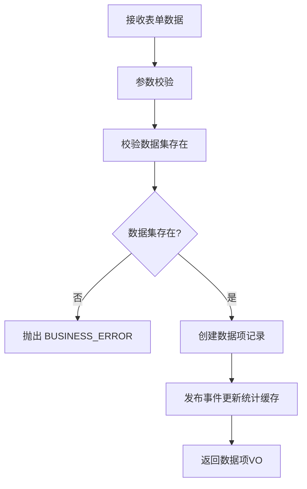
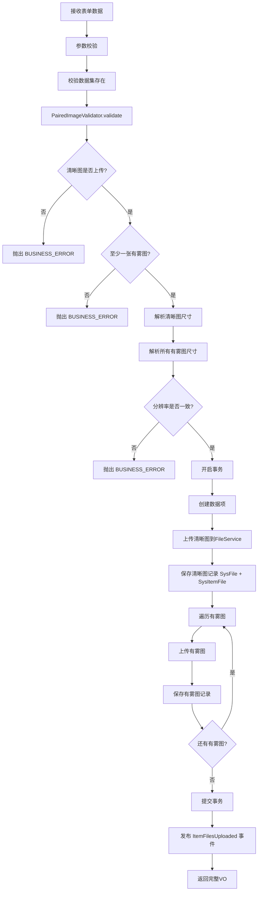
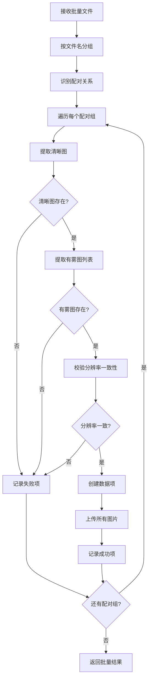
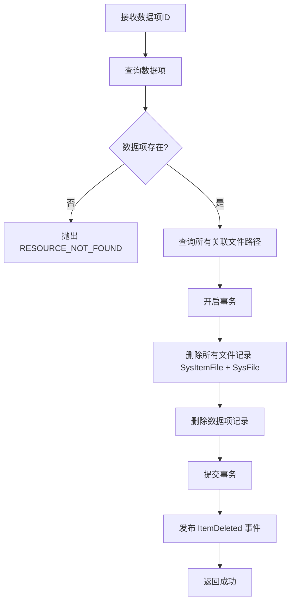

# 数据项管理接口设计

> **版本**: v2.0  
> **更新日期**: 2025-01-10  
> **重要**: 本章节接口需要对齐 REST 规范，统一路径、返回结构。

---

## 三、数据项管理接口设计

### 3.1 分页查询数据项列表

**接口路径**: `GET /api/v1/dataset-items`

**当前实现差异**：
| 项目 | 设计 | 当前实现 | 重构方式 |
|------|------|---------|---------|
| 路径 | 符合 | 符合 | 无需改动 |
| 相关度排序 | 多字段匹配 | 未实现 | 增加相关度计算 |
| 索引优化 | 组合索引 | 单列索引 | 执行 SQL 迁移 |
| 字段类型 | `size_bytes` (BIGINT) | `size` (VARCHAR) | 字段改造 |

**查询参数**：

```
datasetId: Long              # 数据集ID（必填）
keyword: string              # 关键字搜索（name/description模糊查询）
sceneType: string            # 场景类型筛选
hazeLevel: string            # 雾霾程度筛选（light/medium/heavy）
minWidth: integer            # 分辨率宽度最小值
maxWidth: integer            # 分辨率宽度最大值
minHeight: integer           # 分辨率高度最小值
maxHeight: integer           # 分辨率高度最大值
minSize: Long                # 文件大小最小值（字节）
maxSize: Long                # 文件大小最大值（字节）
sortBy: string               # 排序字段（relevance/createTime/usageCount，默认createTime）
sortOrder: string            # 排序方向（asc/desc，默认desc）
pageNum: integer             # 页码（默认1）
pageSize: integer            # 每页数量（默认20）
```

**响应示例**（基于实际 `PageResult`）：

```json
{
  "code": "00000",
  "msg": "一切ok",
  "data": {
    "list": [
      {
        "id": 1,
        "datasetId": 10,
        "name": "城市街道_001",
        "sceneType": "outdoor",
        "description": "城市主干道雾霾场景",
        "usageCount": 15,
        "clearImage": {
          "id": 101,
          "url": "https://cdn.example.com/clear/001.jpg",
          "thumbnailUrl": "https://cdn.example.com/clear/thumb_001.jpg",
          "width": 1920,
          "height": 1080,
          "sizeBytes": 2560000,
          "formattedSize": "2.44MB"
        },
        "hazyImages": [
          {
            "id": 102,
            "type": "hazy",
            "hazeLevel": "light",
            "url": "https://cdn.example.com/hazy/001_light.jpg",
            "thumbnailUrl": "https://cdn.example.com/hazy/thumb_001_light.jpg",
            "width": 1920,
            "height": 1080,
            "sizeBytes": 2800000,
            "formattedSize": "2.67MB"
          }
        ],
        "createTime": "2025-01-05T10:00:00",
        "updateTime": "2025-01-10T15:00:00"
      }
    ],
    "total": 120
  }
}
```

**业务逻辑**：



**相关度计算**（仅在有关键字时）：

```java
/**
 * 相关度计算规则
 */
public int calculateRelevanceScore(SysDatasetItem item, String keyword) {
    int score = 0;

    // 名称完全匹配：100分
    if (item.getName().equalsIgnoreCase(keyword)) {
        score += 100;
    }
    // 名称包含关键字：50分
    else if (item.getName().toLowerCase().contains(keyword.toLowerCase())) {
        score += 50;
    }

    // 场景类型匹配：20分
    if (keyword.equalsIgnoreCase(item.getSceneType())) {
        score += 20;
    }

    // 描述包含关键字：10分
    if (item.getDescription() != null &&
            item.getDescription().toLowerCase().contains(keyword.toLowerCase())) {
        score += 10;
    }

    return score;
}
```

**SQL 实现**（使用相关度计算）：

```xml
<!-- SysDatasetItemMapper.xml -->
<select id="searchWithRelevance" resultMap="DatasetItemWithFilesMap">
    SELECT
    di.*,
    CASE
    WHEN di.name = #{keyword} THEN 100
    WHEN di.name LIKE CONCAT('%', #{keyword}, '%') THEN 50
    ELSE 0
    END +
    CASE WHEN di.scene_type = #{keyword} THEN 20 ELSE 0 END +
    CASE WHEN di.description LIKE CONCAT('%', #{keyword}, '%') THEN 10 ELSE 0 END
    AS relevance_score,
    sif.*,
    sf.size_bytes, sf.url
    FROM sys_dataset_item di
    LEFT JOIN sys_item_file sif ON di.id = sif.item_id
    LEFT JOIN sys_file sf ON sif.file_id = sf.id
    WHERE di.dataset_id = #{datasetId}
    <if test="keyword != null and keyword != ''">
        AND (
        di.name LIKE CONCAT('%', #{keyword}, '%')
        OR di.description LIKE CONCAT('%', #{keyword}, '%')
        OR di.scene_type = #{keyword}
        )
    </if>
    <if test="sceneType != null">
        AND di.scene_type = #{sceneType}
    </if>
    <if test="hazeLevel != null">
        AND sif.haze_level = #{hazeLevel}
    </if>
    <if test="minWidth != null">
        AND sif.width >= #{minWidth}
    </if>
    <if test="maxWidth != null">
        AND sif.width<= #{maxWidth}
    </if>
    <if test="minHeight != null">
        AND sif.height >= #{minHeight}
    </if>
    <if test="maxHeight != null">
        AND sif.height<= #{maxHeight}
    </if>
    <if test="minSize != null">
        AND sf.size_bytes >= #{minSize}
    </if>
    <if test="maxSize != null">
        AND sf.size_bytes<= #{maxSize}
    </if>
    ORDER BY
    <choose>
        <when test="keyword != null and keyword != ''">
            relevance_score DESC,
        </when>
        <when test="sortBy == 'usageCount'">
            di.usage_count ${sortOrder},
        </when>
        <otherwise>
            di.create_time ${sortOrder}
        </otherwise>
    </choose>
    LIMIT #{offset}, #{limit}
</select>
```

**数据加载优化**：

- ✅ 使用 LEFT JOIN 一次性加载数据项和文件，避免 N+1
- ✅ 组合索引：`idx_item_file_composite(item_id, type, haze_level, scene_type)`
- ✅ 分页查询减少数据传输量

---

### 3.2 获取数据项详情

**接口路径**: `GET /api/v1/dataset-items/{id}`

**当前实现差异**：
| 项目 | 设计 | 当前实现 | 重构方式 |
|------|------|---------|---------|
| 路径参数 | `{id}` | `{datasetItemId}` | **统一改为 `{id}`** |
| 文件排序 | 雾霾程度排序 | 未明确 | 增加排序逻辑 |

**响应示例**：

```json
{
  "code": "00000",
  "msg": "一切ok",
  "data": {
    "id": 1,
    "datasetId": 10,
    "name": "城市街道_001",
    "sceneType": "outdoor",
    "description": "城市主干道雾霾场景",
    "usageCount": 15,
    "clearImage": {
      "id": 101,
      "type": "clear",
      "url": "https://cdn.example.com/clear/001.jpg",
      "thumbnailUrl": "https://cdn.example.com/clear/thumb_001.jpg",
      "width": 1920,
      "height": 1080,
      "sizeBytes": 2560000,
      "formattedSize": "2.44MB",
      "format": "jpg",
      "md5": "abc123..."
    },
    "hazyImages": [
      {
        "id": 102,
        "type": "hazy",
        "hazeLevel": "light",
        "url": "https://cdn.example.com/hazy/001_light.jpg",
        "thumbnailUrl": "https://cdn.example.com/hazy/thumb_001_light.jpg",
        "width": 1920,
        "height": 1080,
        "sizeBytes": 2800000,
        "formattedSize": "2.67MB"
      },
      {
        "id": 103,
        "type": "hazy",
        "hazeLevel": "medium",
        "url": "https://cdn.example.com/hazy/001_medium.jpg",
        "thumbnailUrl": "https://cdn.example.com/hazy/thumb_001_medium.jpg",
        "width": 1920,
        "height": 1080,
        "sizeBytes": 2900000,
        "formattedSize": "2.77MB"
      }
    ],
    "createTime": "2025-01-05T10:00:00",
    "updateTime": "2025-01-10T15:00:00"
  }
}
```

**业务逻辑**：



**有雾图排序逻辑**：

```java
// 自定义排序器
private static final Map<String, Integer> HAZE_LEVEL_ORDER = Map.of(
                "light", 1,
                "medium", 2,
                "heavy", 3
        );

hazyImages.

sort(Comparator.comparing(
        img ->HAZE_LEVEL_ORDER.

getOrDefault(img.getHazeLevel(), 999)
        ));
```

---

### 3.3 创建空数据项

**接口路径**: `POST /api/v1/dataset-items`

**应用场景**：分步骤上传，先创建数据项占位，后续再上传图片

**请求体**：

```json
{
  "datasetId": 10,
  "name": "城市街道_001",
  "sceneType": "outdoor",
  "description": "城市主干道雾霾场景"
}
```

**响应示例**：

```json
{
  "code": "00000",
  "msg": "一切ok",
  "data": {
    "id": 1,
    "datasetId": 10,
    "name": "城市街道_001",
    "createTime": "2025-01-10T16:00:00"
  }
}
```

**业务逻辑**：



---

### 3.4 创建数据项并上传配对图片

**接口路径**: `POST /api/v1/dataset-items/upload`

**当前实现差异**：
| 项目 | 设计 | 当前实现 | 重构方式 |
|------|------|---------|---------|
| 路径 | 符合 | 符合 | 无需改动 |
| 校验逻辑 | 抽取独立类 | 在 Service 中 | 抽取 `PairedImageValidator` |
| 缩略图生成 | 异步 | 同步（阻塞） | 改为事件驱动 |

**请求参数**（multipart/form-data）：

```
datasetId: Long                  # 数据集ID
name: string                     # 数据项名称
sceneType: string                # 场景类型
description: string              # 描述（可选）
clearImage: file                 # 清晰图（必填）
hazyImages: file[]               # 有雾图列表（至少1张）
hazeLevels: string[]             # 对应的雾霾程度（light/medium/heavy）
```

**响应示例**：

```json
{
  "code": "00000",
  "msg": "一切ok",
  "data": {
    "id": 1,
    "datasetId": 10,
    "name": "城市街道_001",
    "clearImage": {
      "id": 101,
      "url": "https://cdn.example.com/clear/001.jpg",
      "thumbnailUrl": null,  // 异步生成中
      "width": 1920,
      "height": 1080
    },
    "hazyImages": [
      {
        "id": 102,
        "hazeLevel": "light",
        "url": "https://cdn.example.com/hazy/001_light.jpg",
        "thumbnailUrl": null,  // 异步生成中
        "width": 1920,
        "height": 1080
      }
    ],
    "createTime": "2025-01-10T16:00:00"
  }
}
```

**业务逻辑**：



**配对图片校验**（抽取独立类）：

```java

@Component
@RequiredArgsConstructor
public class PairedImageValidator {

    private static final Set<String> ALLOWED_FORMATS = Set.of("jpg", "jpeg", "png", "gif");
    private static final long MAX_FILE_SIZE = 10 * 1024 * 1024; // 10MB

    /**
     * 校验配对图片
     */
    public void validate(MultipartFile clearImage,
                         List<MultipartFile> hazyImages,
                         List<String> hazeLevels) {

        // 规则1：清晰图必填
        if (clearImage == null || clearImage.isEmpty()) {
            throw new BusinessException(ResultCode.PARAM_INVALID, "清晰图必须上传");
        }

        // 规则2：至少一张有雾图
        if (hazyImages == null || hazyImages.isEmpty()) {
            throw new BusinessException(ResultCode.PARAM_INVALID, "至少上传一张有雾图");
        }

        // 规则3：有雾图数量与雾霾程度数量匹配
        if (hazeLevels == null || hazeLevels.size() != hazyImages.size()) {
            throw new BusinessException(ResultCode.PARAM_INVALID, "每张有雾图必须标注雾霾程度");
        }

        // 规则4：校验文件格式和大小
        validateFileFormat(clearImage);
        for (MultipartFile hazy : hazyImages) {
            validateFileFormat(hazy);
        }

        // 规则5：校验分辨率一致性
        validateResolutionConsistency(clearImage, hazyImages);

        // 规则6：校验雾霾程度有效性
        for (String level : hazeLevels) {
            if (!isValidHazeLevel(level)) {
                throw new BusinessException(ResultCode.PARAM_INVALID,
                        "无效的雾霾程度: " + level + "，有效值: light/medium/heavy");
            }
        }
    }

    private void validateResolutionConsistency(MultipartFile clearImage, List<MultipartFile> hazyImages) {
        Dimension baseline = ImageUtils.getDimension(clearImage);

        for (int i = 0; i < hazyImages.size(); i++) {
            Dimension dim = ImageUtils.getDimension(hazyImages.get(i));
            if (dim.width != baseline.width || dim.height != baseline.height) {
                throw new BusinessException(ResultCode.BUSINESS_ERROR,
                        String.format("第%d张有雾图分辨率(%dx%d)与清晰图(%dx%d)不一致",
                                i + 1, dim.width, dim.height, baseline.width, baseline.height)
                );
            }
        }
    }

    private boolean isValidHazeLevel(String level) {
        return "light".equals(level) || "medium".equals(level) || "heavy".equals(level);
    }
}
```

**文件处理流程**（重构：异步缩略图）：

```java

@Override
@Transactional(rollbackFor = Exception.class)
public DatasetItemVO createWithPairedImages(DatasetItemUploadForm form) {

    // 1. 校验（使用独立校验器）
    pairedImageValidator.validate(form.getClearImage(), form.getHazyImages(), form.getHazeLevels());

    // 2. 创建数据项
    SysDatasetItem item = new SysDatasetItem();
    item.setDatasetId(form.getDatasetId());
    item.setName(form.getName());
    item.setSceneType(form.getSceneType());
    this.save(item);

    // 3. 上传文件并保存记录（主链路，同步）
    List<Long> fileIds = new ArrayList<>();
    List<String> filePaths = new ArrayList<>();

    // 上传清晰图
    String clearPath = fileService.upload(form.getClearImage(), buildPath(item));
    SysItemFile clearFile = createFileRecord(item.getId(), clearPath, "clear", null);
    itemFileService.save(clearFile);
    fileIds.add(clearFile.getId());
    filePaths.add(clearPath);

    // 上传有雾图
    for (int i = 0; i < form.getHazyImages().size(); i++) {
        String hazyPath = fileService.upload(form.getHazyImages().get(i), buildPath(item));
        SysItemFile hazyFile = createFileRecord(item.getId(), hazyPath, "hazy", form.getHazeLevels().get(i));
        itemFileService.save(hazyFile);
        fileIds.add(hazyFile.getId());
        filePaths.add(hazyPath);
    }

    // 4. 发布事件（异步处理：缩略图生成、缓存失效）
    eventPublisher.publishEvent(new DatasetEvent.ItemFilesUploaded(
            this, form.getDatasetId(), item.getId(), fileIds, filePaths
    ));

    return buildVO(item);
}
```

**存储路径规则**：

- 原图：`/{rootPath}/{datasetName}/{itemId}/{filename}`
- 缩略图：`/{rootPath}/{datasetName}/{itemId}/thumb_{filename}`

---

### 3.5 批量创建数据项并上传图片

**接口路径**: `POST /api/v1/dataset-items/batch`

**当前实现差异**：
| 项目 | 设计 | 当前实现 | 重构方式 |
|------|------|---------|---------|
| 路径 | `/batch` | `/batch/upload` | **统一为 `/batch`** |
| 文件名识别 | 规则匹配 | 未明确 | 增加文件名解析逻辑 |

**请求参数**（multipart/form-data）：

```
datasetId: Long              # 数据集ID
files: file[]                # 批量文件
```

**响应示例**：

```json
{
  "code": "00000",
  "msg": "一切ok",
  "data": {
    "total": 10,
    "succeeded": 8,
    "failed": 2,
    "successItems": [
      {
        "id": 1,
        "name": "street_001",
        "fileCount": 3
      }
    ],
    "failedItems": [
      {
        "fileName": "invalid.jpg",
        "reason": "未找到配对的清晰图"
      }
    ]
  }
}
```

**文件名识别规则**：

```
清晰图：
- {prefix}_clear.{ext}
- {prefix}_gt.{ext}

有雾图：
- {prefix}_hazy_light.{ext}    → hazeLevel: light
- {prefix}_hazy_medium.{ext}   → hazeLevel: medium
- {prefix}_hazy_heavy.{ext}    → hazeLevel: heavy
- {prefix}_hazy.{ext}           → 需手动标注程度（默认 light）

示例：
street_001_clear.jpg
street_001_hazy_light.jpg
street_001_hazy_medium.jpg
street_001_hazy_heavy.jpg
→ 识别为同一组，前缀: street_001
```

**业务逻辑**：



**文件名解析实现**：

```java

@Component
public class BatchUploadParser {

    private static final Pattern CLEAR_PATTERN = Pattern.compile("(.+)_(clear|gt)\\.(jpg|png|gif)");
    private static final Pattern HAZY_PATTERN = Pattern.compile("(.+)_hazy(?:_(light|medium|heavy))?\\.(jpg|png|gif)");

    /**
     * 解析批量文件，按前缀分组
     */
    public Map<String, FileGroup> parseFiles(List<MultipartFile> files) {
        Map<String, FileGroup> groups = new HashMap<>();

        for (MultipartFile file : files) {
            String filename = file.getOriginalFilename();

            // 尝试匹配清晰图
            Matcher clearMatcher = CLEAR_PATTERN.matcher(filename);
            if (clearMatcher.matches()) {
                String prefix = clearMatcher.group(1);
                groups.computeIfAbsent(prefix, k -> new FileGroup()).setClearImage(file);
                continue;
            }

            // 尝试匹配有雾图
            Matcher hazyMatcher = HAZY_PATTERN.matcher(filename);
            if (hazyMatcher.matches()) {
                String prefix = hazyMatcher.group(1);
                String level = hazyMatcher.group(2); // 可能为null
                String hazeLevel = (level != null) ? level : "light";  // 默认轻度

                FileGroup group = groups.computeIfAbsent(prefix, k -> new FileGroup());
                group.addHazyImage(file, hazeLevel);
            }
        }

        return groups;
    }

    @Data
    public static class FileGroup {
        private MultipartFile clearImage;
        private List<MultipartFile> hazyImages = new ArrayList<>();
        private List<String> hazeLevels = new ArrayList<>();

        public void addHazyImage(MultipartFile file, String level) {
            hazyImages.add(file);
            hazeLevels.add(level);
        }
    }
}
```

---

### 3.6 更新数据项信息

**接口路径**: `PUT /api/v1/dataset-items/{id}`

**当前实现差异**：
| 项目 | 设计 | 当前实现 | 重构方式 |
|------|------|---------|---------|
| 路径参数 | `{id}` | `{datasetItemId}` | **统一改为 `{id}`** |
| 场景类型同步 | 自动同步 | 未明确 | 增加级联更新 |

**请求体**：

```json
{
  "name": "城市街道_001_v2",
  "sceneType": "indoor",
  "description": "更新后的描述"
}
```

**响应示例**：

```json
{
  "code": "00000",
  "msg": "一切ok",
  "data": {
    "id": 1,
    "name": "城市街道_001_v2",
    "updateTime": "2025-01-10T16:30:00"
  }
}
```

**特殊逻辑**：

- 场景类型修改会同步更新该数据项下所有图片的 `sceneType` 字段
- 更新后发布数据项更新事件，异步失效统计缓存

---

### 3.7 删除数据项

**接口路径**: `DELETE /api/v1/dataset-items/{id}`

**当前实现差异**：
| 项目 | 设计 | 当前实现 | 重构方式 |
|------|------|---------|---------|
| 路径参数 | `{id}` | `{datasetItemId}` | **统一改为 `{id}`** |
| 文件删除 | 异步 | 同步（阻塞事务） | 改为事件驱动 |

**响应示例**：

```json
{
  "code": "00000",
  "msg": "一切ok",
  "data": null
}
```

**业务逻辑**：



**级联删除**（重构：异步文件删除）：

```java

@Override
@Transactional(rollbackFor = Exception.class)
public void deleteItem(Long itemId) {
    SysDatasetItem item = this.getById(itemId);
    if (item == null) {
        throw new BusinessException(ResultCode.RESOURCE_NOT_FOUND, "数据项不存在");
    }

    // 1. 查询所有关联文件路径（用于异步删除）
    List<String> filePaths = itemFileService.getFilePathsByItemId(itemId);

    // 2. 删除数据库记录（主链路，同步+事务）
    itemFileService.removeByItemId(itemId);
    this.removeById(itemId);

    // 3. 发布事件（异步删除物理文件）
    eventPublisher.publishEvent(new DatasetEvent.ItemDeleted(
            this, item.getDatasetId(), itemId, filePaths
    ));
}
```

---

### 3.8 批量删除数据项

**接口路径**: `DELETE /api/v1/dataset-items/batch`

**请求体**：

```json
{
  "ids": [1, 2, 3]
}
```

**响应示例**：

```json
{
  "code": "00000",
  "msg": "一切ok",
  "data": {
    "total": 3,
    "succeeded": 2,
    "failed": 1,
    "results": [
      {"id": 1, "status": "success"},
      {"id": 2, "status": "success"},
      {"id": 3, "status": "failed", "message": "数据项不存在", "errorCode": "RESOURCE_NOT_FOUND"}
    ]
  }
}
```

**业务逻辑**：遵循批量删除模式，每个数据项的删除逻辑同 3.7 节

---

## 四、性能优化关键点

### 4.1 索引优化

**SQL 迁移脚本**（必须执行）：

```sql
-- V2.3__optimize_item_file_index.sql

-- 删除单列索引
DROP INDEX idx_item_id ON sys_item_file;

-- 创建组合索引（按查询频率排序）
CREATE INDEX idx_item_file_composite ON sys_item_file (item_id, type, haze_level, scene_type);

-- 覆盖索引（包含常用查询字段）
CREATE INDEX idx_item_file_covering ON sys_item_file (item_id, type, file_id, width, height);
```

### 4.2 文件大小字段改造

**SQL 迁移脚本**（必须执行）：

```sql
-- V2.2__optimize_file_size.sql

-- 新增数值字段
ALTER TABLE sys_file
    ADD COLUMN size_bytes BIGINT COMMENT '文件大小（字节）';

-- 数据迁移
UPDATE sys_file
SET size_bytes = CASE
                     WHEN size LIKE '%MB' THEN CAST(REPLACE(size, 'MB', '') AS DECIMAL(10, 2)) * 1024 * 1024
                     WHEN size LIKE '%KB' THEN CAST(REPLACE(size, 'KB', '') AS DECIMAL(10, 2)) * 1024
                     WHEN size LIKE '%GB' THEN CAST(REPLACE(size, 'GB', '') AS DECIMAL(10, 2)) * 1024 * 1024 * 1024
                     ELSE 0
    END;

-- 添加索引
CREATE INDEX idx_size_bytes ON sys_file (size_bytes);
```

### 4.3 验收标准

| 接口   | 当前 P99   | 目标 P99    | 优化手段                 |
|------|----------|-----------|----------------------|
| 列表查询 | 4.3s     | **800ms** | 索引 + size字段 + JOIN优化 |
| 详情查询 | 500ms    | **100ms** | JOIN优化               |
| 创建上传 | 6.5s     | **1s**    | 异步缩略图                |
| 批量上传 | 30s（10张） | **5s**    | 异步缩略图 + 并发上传         |

---
