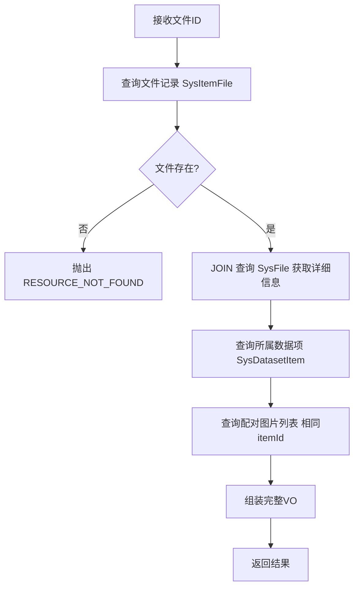
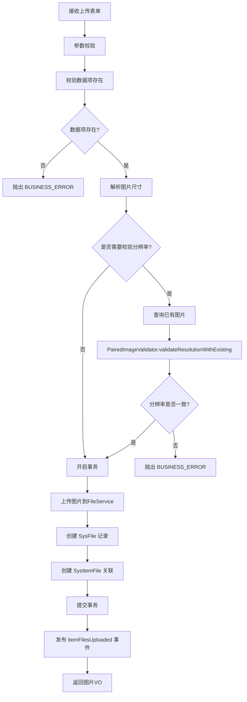
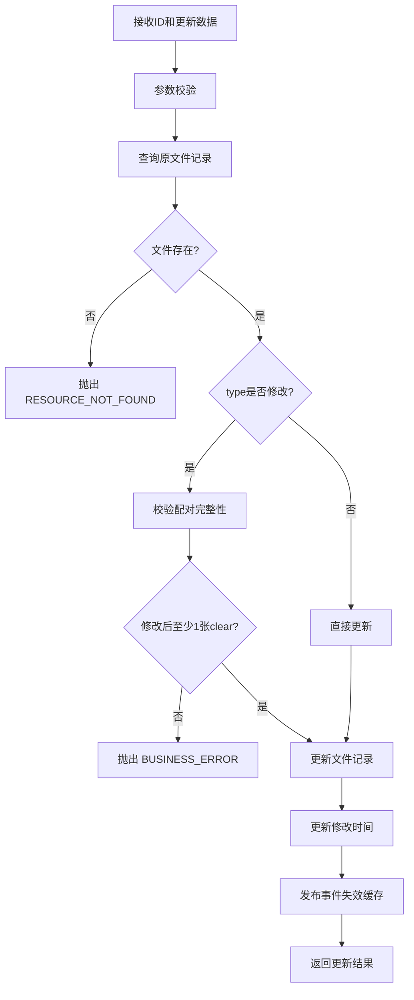
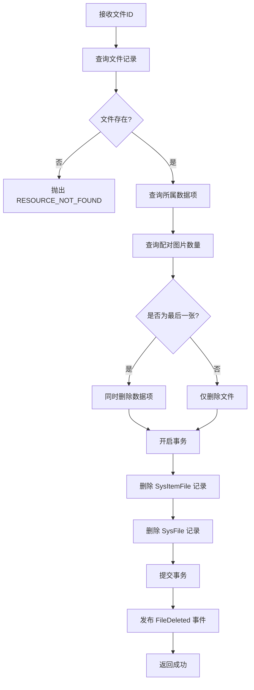

# 图片文件管理接口设计

> **版本**: v2.0  
> **更新日期**: 2025-01-10  
> **重要**: 本章节接口需要对齐 REST 规范，路径从 `/dataset-item-files` 改为 `/item-files`

---

## 四、图片文件管理接口设计

### 接口路径重构说明

| 当前路径                         | 设计路径                 | 说明                    |
|------------------------------|----------------------|-----------------------|
| `/api/v1/dataset-item-files` | `/api/v1/item-files` | **需重构**：简化命名，符合REST规范 |

---

### 4.1 获取图片详细信息

**接口路径**: `GET /api/v1/item-files/{id}`

**当前实现差异**：
| 项目 | 设计 | 当前实现 | 重构方式 |
|------|------|---------|---------|
| 路径 | `/item-files/{id}` | `/dataset-item-files/{id}` | **重构路径** |
| 缩略图字段 | `thumbnailUrl` | `thumbnailFileId` → `SysFile` | 需明确是直接返回URL还是关联查询 |

**请求参数**：

```
路径参数：
  id: Long      # 文件ID
```

**响应示例**：

```json
{
  "code": "00000",
  "msg": "一切ok",
  "data": {
    "id": 101,
    "itemId": 1,
    "type": "hazy",
    "hazeLevel": "light",
    "sceneType": "outdoor",
    "url": "https://cdn.example.com/hazy/001_light.jpg",
    "thumbnailUrl": "https://cdn.example.com/hazy/thumb_001_light.jpg",
    "width": 1920,
    "height": 1080,
    "sizeBytes": 2800000,
    "formattedSize": "2.67MB",
    "format": "jpg",
    "md5": "abc123def456...",
    "usageCount": 5,
    "datasetItem": {
      "id": 1,
      "name": "城市街道_001",
      "sceneType": "outdoor"
    },
    "pairedFiles": [
      {
        "id": 100,
        "type": "clear",
        "url": "https://cdn.example.com/clear/001.jpg",
        "thumbnailUrl": "https://cdn.example.com/clear/thumb_001.jpg"
      },
      {
        "id": 102,
        "type": "hazy",
        "hazeLevel": "medium",
        "url": "https://cdn.example.com/hazy/001_medium.jpg"
      }
    ],
    "createTime": "2025-01-05T10:30:00",
    "updateTime": "2025-01-10T15:45:00"
  }
}
```

**业务逻辑**：



**返回信息说明**：

- **当前图片信息**：URL、缩略图、分辨率、大小、格式、类型、雾霾程度、使用次数
- **所属数据项信息**：名称、场景类型
- **配对图片列表**：清晰图 + 所有有雾图的基本信息（用于前端展示对比）

**关键查询**（避免N+1）：

```xml
<!-- SysItemFileMapper.xml -->
<select id="getFileWithDetails" resultMap="FileDetailMap">
    SELECT
    sif.*,
    sf.url, sf.size_bytes, sf.format, sf.md5,
    di.id AS item_id, di.name AS item_name, di.scene_type AS item_scene_type
    FROM sys_item_file sif
    INNER JOIN sys_file sf ON sif.file_id = sf.id
    INNER JOIN sys_dataset_item di ON sif.item_id = di.id
    WHERE sif.id = #{id}
</select>

<select id="getPairedFiles" resultMap="PairedFileMap">
SELECT sif.*, sf.url, sf.size_bytes
FROM sys_item_file sif
INNER JOIN sys_file sf ON sif.file_id = sf.id
WHERE sif.item_id = #{itemId} AND sif.id != #{excludeId}
ORDER BY
CASE sif.type WHEN 'clear' THEN 0 ELSE 1 END,
CASE sif.haze_level WHEN 'light' THEN 1 WHEN 'medium' THEN 2 WHEN 'heavy' THEN 3 ELSE 4 END
</select>
```

---

### 4.2 上传数据项图片

**接口路径**: `POST /api/v1/item-files`

**当前实现差异**：
| 项目 | 设计 | 当前实现 | 重构方式 |
|------|------|---------|---------|
| 路径 | `/item-files` | `/dataset-item-files` | **重构路径** |
| 分辨率校验 | 自动 | 未明确 | 增加校验逻辑 |
| 缩略图生成 | 异步 | 同步 | 改为事件驱动 |

**请求参数**（multipart/form-data）：

```
itemId: Long                 # 数据项ID（必填）
file: file                   # 图片文件（必填）
type: string                 # 图片类型（clear/hazy，必填）
hazeLevel: string            # 雾霾程度（type=hazy时必填：light/medium/heavy）
description: string          # 描述（可选）
```

**响应示例**：

```json
{
  "code": "00000",
  "msg": "一切ok",
  "data": {
    "id": 103,
    "itemId": 1,
    "type": "hazy",
    "hazeLevel": "heavy",
    "url": "https://cdn.example.com/hazy/001_heavy.jpg",
    "thumbnailUrl": null,  // 异步生成中
    "width": 1920,
    "height": 1080,
    "sizeBytes": 3200000,
    "formattedSize": "3.05MB",
    "createTime": "2025-01-10T16:00:00"
  }
}
```

**业务逻辑**：



**分辨率校验逻辑**：

```java
/**
 * 校验新上传图片与已有图片的分辨率一致性
 */
public void validateResolutionWithExisting(MultipartFile newFile, Long itemId) {
    // 1. 查询该数据项已有的任意一张图片
    SysItemFile existingFile = itemFileMapper.selectOneByItemId(itemId);

    // 2. 如果没有图片，不需要校验
    if (existingFile == null) {
        return;
    }

    // 3. 解析新图片尺寸
    Dimension newDimension = ImageUtils.getDimension(newFile);

    // 4. 对比分辨率
    if (newDimension.width != existingFile.getWidth() ||
            newDimension.height != existingFile.getHeight()) {
        throw new BusinessException(ResultCode.BUSINESS_ERROR,
                String.format("分辨率不一致，已有图片: %dx%d，新图片: %dx%d",
                        existingFile.getWidth(), existingFile.getHeight(),
                        newDimension.width, newDimension.height)
        );
    }
}
```

**应用场景**：

- 向已有数据项补充配对图片
- 添加更多雾霾程度的有雾图（如原本只有 light 和 medium，现在补充 heavy）

**异步缩略图生成**（与创建数据项逻辑一致）：

```java

@Override
@Transactional(rollbackFor = Exception.class)
public ItemFileVO uploadFile(MultipartFile file, ItemFileUploadForm form) {
    // 1. 校验
    validateUpload(file, form);

    // 2. 上传原图
    String originalPath = fileService.upload(file, buildPath(form.getItemId()));

    // 3. 解析图片信息
    Dimension dimension = ImageUtils.getDimension(file);
    String md5 = DigestUtils.md5Hex(file.getInputStream());

    // 4. 创建文件记录
    SysFile sysFile = new SysFile();
    sysFile.setUrl(originalPath);
    sysFile.setSizeBytes(file.getSize());
    sysFile.setFormat(getFileExtension(file.getOriginalFilename()));
    sysFile.setMd5(md5);
    fileMapper.insert(sysFile);

    // 5. 创建关联记录
    SysItemFile itemFile = new SysItemFile();
    itemFile.setItemId(form.getItemId());
    itemFile.setFileId(sysFile.getId());
    itemFile.setType(form.getType());
    itemFile.setHazeLevel(form.getHazeLevel());
    itemFile.setWidth(dimension.width);
    itemFile.setHeight(dimension.height);
    itemFileMapper.insert(itemFile);

    // 6. 发布事件（异步生成缩略图）
    eventPublisher.publishEvent(new DatasetEvent.ItemFilesUploaded(
            this, getDatasetIdByItemId(form.getItemId()), form.getItemId(),
            List.of(itemFile.getId()), List.of(originalPath)
    ));

    return buildVO(itemFile, sysFile);
}
```

---

### 4.3 修改图片信息

**接口路径**: `PUT /api/v1/item-files/{id}`

**当前实现差异**：
| 项目 | 设计 | 当前实现 | 重构方式 |
|------|------|---------|---------|
| 路径 | `/item-files/{id}` | `/dataset-item-files/{id}` | **重构路径** |
| 配对完整性校验 | 自动 | 未明确 | 增加校验逻辑 |

**请求体**：

```json
{
  "type": "hazy",
  "sceneType": "indoor",
  "hazeLevel": "medium",
  "description": "更新后的描述"
}
```

**响应示例**：

```json
{
  "code": "00000",
  "msg": "一切ok",
  "data": {
    "id": 101,
    "type": "hazy",
    "hazeLevel": "medium",
    "updateTime": "2025-01-10T16:30:00"
  }
}
```

**业务逻辑**：



**可更新字段**：

- `type`: 图片类型（clear/hazy）
- `sceneType`: 场景类型
- `hazeLevel`: 雾霾程度（仅 type=hazy 时有效）
- `description`: 描述信息

**注意事项**：

- **不支持修改图片文件本身**（如需修改，删除后重新上传）
- 修改 `type` 时需校验配对完整性（至少保留一张清晰图）

**配对完整性校验**：

```java
/**
 * 校验修改type后是否还有至少1张清晰图
 */
private void validatePairedIntegrity(Long fileId, Long itemId, String newType) {
    if (!"hazy".equals(newType)) {
        return;  // 改为 hazy 或其他，不影响
    }

    // 查询该数据项其他清晰图数量
    long clearCount = itemFileMapper.selectCount(
            new LambdaQueryWrapper<SysItemFile>()
                    .eq(SysItemFile::getItemId, itemId)
                    .eq(SysItemFile::getType, "clear")
                    .ne(SysItemFile::getId, fileId)
    );

    if (clearCount == 0) {
        throw new BusinessException(ResultCode.BUSINESS_ERROR,
                "至少需要保留一张清晰图，无法将最后一张清晰图改为有雾图");
    }
}
```

---

### 4.4 删除图片

**接口路径**: `DELETE /api/v1/item-files/{id}`

**当前实现差异**：
| 项目 | 设计 | 当前实现 | 重构方式 |
|------|------|---------|---------|
| 路径 | `/item-files/{id}` | `/dataset-item-files/{id}` | **重构路径** |
| 级联删除数据项 | 自动 | 未明确 | 增加判断逻辑 |
| 文件删除 | 异步 | 同步 | 改为事件驱动 |

**响应示例**：

```json
{
  "code": "00000",
  "msg": "一切ok",
  "data": null
}
```

**业务逻辑**：



**删除校验与级联**：

```java

@Override
@Transactional(rollbackFor = Exception.class)
public void deleteFile(Long fileId) {
    SysItemFile itemFile = itemFileMapper.selectById(fileId);
    if (itemFile == null) {
        throw new BusinessException(ResultCode.RESOURCE_NOT_FOUND, "文件不存在");
    }

    // 1. 查询配对图片数量
    long fileCount = itemFileMapper.selectCount(
            new LambdaQueryWrapper<SysItemFile>()
                    .eq(SysItemFile::getItemId, itemFile.getItemId())
    );

    // 2. 查询文件路径（用于异步删除）
    SysFile sysFile = fileMapper.selectById(itemFile.getFileId());
    String filePath = sysFile.getUrl();

    // 3. 如果是最后一张，级联删除数据项
    if (fileCount == 1) {
        datasetItemService.removeById(itemFile.getItemId());
    }

    // 4. 删除文件记录（主链路，同步+事务）
    itemFileMapper.deleteById(fileId);
    fileMapper.deleteById(itemFile.getFileId());

    // 5. 发布事件（异步删除物理文件）
    eventPublisher.publishEvent(new DatasetEvent.FileDeleted(
            this, getDatasetIdByItemId(itemFile.getItemId()),
            itemFile.getItemId(), fileId, filePath
    ));
}
```

**级联删除逻辑**：

- 如果删除后数据项没有任何图片，则同时删除数据项
- 如果是配对图片，不影响其他配对图片

---

### 4.5 批量删除图片

**接口路径**: `DELETE /api/v1/item-files/batch`

**请求体**：

```json
{
  "ids": [101, 102, 103]
}
```

**响应示例**：

```json
{
  "code": "00000",
  "msg": "一切ok",
  "data": {
    "total": 3,
    "succeeded": 2,
    "failed": 1,
    "results": [
      {"id": 101, "status": "success"},
      {"id": 102, "status": "success"},
      {"id": 103, "status": "failed", "message": "文件不存在", "errorCode": "RESOURCE_NOT_FOUND"}
    ]
  }
}
```

**业务逻辑**：遵循批量删除模式，每个文件的删除逻辑同 4.4 节

---

## 五、缩略图生成策略

### 5.1 异步生成机制

**触发时机**：

- 上传图片时（创建数据项、补充图片）
- 主链路立即返回，缩略图异步生成

**事件处理**（统一处理）：

```java

@Async("datasetTaskExecutor")
@TransactionalEventListener(phase = AFTER_COMMIT)
@Retryable(maxAttempts = 3, backoff = @Backoff(delay = 2000, multiplier = 2))
public void handleThumbnailGeneration(DatasetEvent.ItemFilesUploaded event) {
    log.info("开始生成缩略图, itemId={}, fileCount={}", event.getItemId(), event.getFilePaths().size());

    for (int i = 0; i < event.getFilePaths().size(); i++) {
        String filePath = event.getFilePaths().get(i);
        Long fileId = event.getFileIds().get(i);

        try {
            // 生成缩略图
            String thumbPath = ImageUtils.generateThumbnail(filePath, 200);

            // 更新数据库
            itemFileMapper.updateThumbnailPath(fileId, thumbPath);

            log.info("缩略图生成成功: fileId={}", fileId);
        } catch (Exception e) {
            log.error("缩略图生成失败: fileId={}", fileId, e);
            // 记录失败，由补偿任务处理
            recordThumbnailFailure(fileId, filePath);
        }
    }
}
```

### 5.2 缩略图规格

| 参数   | 值              | 说明                   |
|------|----------------|----------------------|
| 固定宽度 | 200px          | 保持不变                 |
| 高度   | 等比缩放           | 根据原图宽高比计算            |
| 格式   | 与原图相同          | jpg → jpg, png → png |
| 质量   | 80%            | 平衡文件大小与清晰度           |
| 命名规则 | `thumb_{原文件名}` | 便于识别                 |

### 5.3 前端处理

**上传时**：

```javascript
// 上传接口立即返回，thumbnailUrl 为 null
const response = await uploadFile(file);
// {
//   "thumbnailUrl": null  ← 显示 loading 或占位图
// }

// 前端显示占位图
if (!response.data.thumbnailUrl) {
    showPlaceholder();
}
```

**轮询或 WebSocket 推送**：

```javascript
// 方式1：轮询（简单）
const checkThumbnail = setInterval(async () => {
    const file = await getFileInfo(fileId);
    if (file.thumbnailUrl) {
        updateThumbnail(file.thumbnailUrl);
        clearInterval(checkThumbnail);
    }
}, 2000);  // 每2秒查询一次

// 方式2：WebSocket 推送（推荐）
socket.on('thumbnail-generated', (data) => {
    if (data.fileId === fileId) {
        updateThumbnail(data.thumbnailUrl);
    }
});
```

---

## 六、性能优化关键点

### 6.1 查询优化

**JOIN 优化**（避免 N+1）：

```xml
<!-- 获取文件详情时一次性 JOIN -->
<select id="getFileWithDetails" resultMap="FileDetailMap">
    SELECT
    sif.id, sif.item_id, sif.type, sif.haze_level, sif.width, sif.height,
    sf.url, sf.size_bytes, sf.format, sf.md5,
    di.name AS item_name, di.scene_type AS item_scene_type
    FROM sys_item_file sif
    INNER JOIN sys_file sf ON sif.file_id = sf.id
    INNER JOIN sys_dataset_item di ON sif.item_id = di.id
    WHERE sif.id = #{id}
</select>
```

### 6.2 索引优化

**必须执行的索引**：

```sql
-- 组合索引（按查询频率）
CREATE INDEX idx_item_file_composite ON sys_item_file (item_id, type, haze_level);

-- 文件大小索引
CREATE INDEX idx_size_bytes ON sys_file (size_bytes);
```

### 6.3 验收标准

| 接口   | 当前 P99 | 目标 P99    | 优化手段   |
|------|--------|-----------|--------|
| 获取详情 | 300ms  | **100ms** | JOIN优化 |
| 上传图片 | 3.2s   | **500ms** | 异步缩略图  |
| 删除图片 | 1.5s   | **300ms** | 异步文件删除 |

---

## 七、重构清单

### 7.1 接口路径重构

| 当前接口                                     | 重构后                              | 影响              |
|------------------------------------------|----------------------------------|-----------------|
| `GET /api/v1/dataset-item-files/{id}`    | `GET /api/v1/item-files/{id}`    | Controller + 前端 |
| `POST /api/v1/dataset-item-files`        | `POST /api/v1/item-files`        | Controller + 前端 |
| `PUT /api/v1/dataset-item-files/{id}`    | `PUT /api/v1/item-files/{id}`    | Controller + 前端 |
| `DELETE /api/v1/dataset-item-files/{id}` | `DELETE /api/v1/item-files/{id}` | Controller + 前端 |

### 7.2 代码改造清单

| 文件                            | 改动内容           | 工时  |
|-------------------------------|----------------|-----|
| `SysItemFileController.java`  | 路径重构 + 异常统一    | 1h  |
| `SysItemFileServiceImpl.java` | 发布事件 + 移除同步副作用 | 2h  |
| `PairedImageValidator.java`   | 抽取校验逻辑         | 1h  |
| `DatasetEventHandler.java`    | 增加缩略图生成处理      | 已完成 |

---
