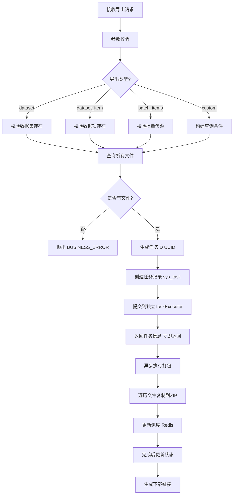
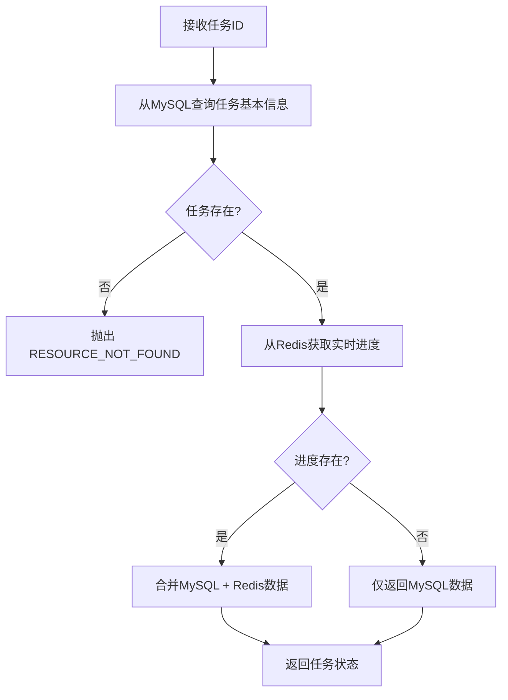
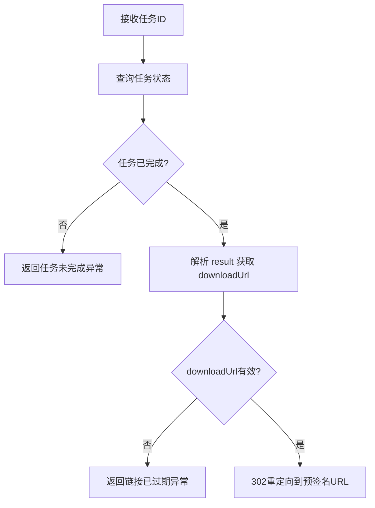
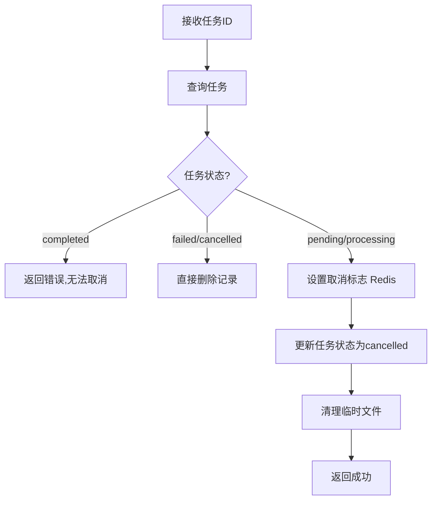

# 导出任务管理接口设计

> **版本**: v2.0  
> **更新日期**: 2025-01-10  
> **重要**: 本章节是重构重点，需要修复异步失效问题并建立完整任务模型。

---

## 五、导出任务管理

### 当前实现的严重问题

**问题1：异步失效（P0 严重 Bug）**

```java
// ❌ 错误实现（当前 DownloadServiceImpl.java）
@Service
public class DownloadServiceImpl {

    public TaskVO createDatasetDownloadTask(Long datasetId) {
        // ... 创建任务记录

        this.processDownloadAsync(taskId);  // ❌ 同类调用，@Async 失效

        return taskVO;
    }

    @Async
    public void processDownloadAsync(String taskId) {
        // 实际是同步执行，导致接口阻塞
    }
}
```

**原因**：Spring AOP 代理机制，同类内部调用不会触发 `@Async` 拦截器。

**影响**：

- 创建下载任务接口实际阻塞等待打包完成（可能 30s+）
- 用户体验极差，感觉"卡死"
- 并发请求会堆积，导致服务器资源耗尽

**验证方式**：

```java
// 在 processDownloadAsync 方法开始处打印线程名
log.info("当前线程: {}",Thread.currentThread().

getName());

// 如果输出：http-nio-8080-exec-1（主线程）→ 异步失效
// 如果输出：dataset-async-1（线程池）→ 异步正常
```

---

### 5.1 创建导出任务

**接口路径**: `POST /api/v1/export-tasks`

**当前实现差异**：
| 项目 | 设计 | 当前实现 | 重构方式 |
|------|------|---------|---------|
| 任务管理 | MySQL + Redis | 仅 Redis | **新增 `sys_task` 表** |
| 异步实现 | 跨类调用 | 同类调用（失效） | **重构为独立 TaskExecutor** |
| 任务生命周期 | 完整（pending/processing/completed/failed/cancelled） | 简化 | **重构任务模型** |

**请求体**：

```json
{
  "type": "dataset",
  "targetId": 123,
  "options": {
    "structure": "by_item",
    "includeTypes": ["clear", "hazy"],
    "includeThumbnail": false
  }
}
```

**导出类型说明**：
| 类型 | 说明 | targetId | 示例 |
|------|------|---------|------|
| `dataset` | 导出单个数据集的所有文件 | 数据集ID | 123 |
| `dataset_item` | 导出单个数据项的配对图片 | 数据项ID | 456 |
| `batch_items` | 批量导出多个数据项 | ids数组 | [1,2,3] |
| `custom` | 按自定义条件导出 | 查询条件 | filter对象 |

**响应示例**：

```json
{
  "code": "00000",
  "msg": "一切ok",
  "data": {
    "taskId": "uuid-xxx",
    "status": "pending",
    "progress": 0,
    "totalFiles": 100,
    "processedFiles": 0,
    "createdAt": "2025-01-10T10:00:00",
    "downloadUrl": null,
    "expiresAt": null
  }
}
```

**业务逻辑**：



**重构后的实现**（修复异步失效）：

#### 5.1.1 任务表设计

```sql
-- V2.1__add_task_table.sql
CREATE TABLE sys_task
(
    id              BIGINT PRIMARY KEY AUTO_INCREMENT,
    task_id         VARCHAR(64) NOT NULL UNIQUE COMMENT '任务ID（UUID）',
    task_type       VARCHAR(32) NOT NULL COMMENT '任务类型（DATASET_EXPORT）',
    status          VARCHAR(16) NOT NULL COMMENT '任务状态',
    progress        INT      DEFAULT 0 COMMENT '进度（0-100）',
    total_files     INT COMMENT '总文件数',
    processed_files INT      DEFAULT 0 COMMENT '已处理文件数',
    params          JSON COMMENT '任务参数',
    result          JSON COMMENT '任务结果（下载链接等）',
    error_message   TEXT COMMENT '错误信息',
    created_by      BIGINT COMMENT '创建人',
    created_at      DATETIME DEFAULT CURRENT_TIMESTAMP,
    started_at      DATETIME COMMENT '开始时间',
    completed_at    DATETIME COMMENT '完成时间',
    expires_at      DATETIME COMMENT '过期时间',
    INDEX idx_task_id (task_id),
    INDEX idx_status_created (status, created_at),
    INDEX idx_expires (expires_at)
) ENGINE = InnoDB
  DEFAULT CHARSET = utf8mb4 COMMENT '异步任务表';
```

#### 5.1.2 任务服务实现

```java

@Service
@RequiredArgsConstructor
public class TaskServiceImpl implements TaskService {

    private final SysTaskMapper taskMapper;
    private final RedisTemplate<String, Object> redisTemplate;
    private final TaskExecutor taskExecutor;  // ✅ 注入独立的执行器
    private final SysDatasetService datasetService;

    @Override
    public TaskVO createExportTask(ExportTaskCreateForm form) {
        // 1. 参数校验
        validateExportParams(form);

        // 2. 创建任务记录
        SysTask task = new SysTask();
        task.setTaskId(UUID.randomUUID().toString());
        task.setTaskType("DATASET_EXPORT");
        task.setStatus("pending");
        task.setParams(JSON.toJSONString(form));
        task.setCreatedBy(SecurityUtils.getUserId());
        task.setExpiresAt(LocalDateTime.now().plusHours(24));
        taskMapper.insert(task);

        // 3. 提交到独立的执行器（✅ 跨类调用，@Async 生效）
        taskExecutor.submitExportTask(task.getId(), form);

        return buildTaskVO(task);
    }

    private void validateExportParams(ExportTaskCreateForm form) {
        switch (form.getType()) {
            case "dataset":
                if (datasetService.getById(form.getTargetId()) == null) {
                    throw new BusinessException(ResultCode.RESOURCE_NOT_FOUND, "数据集不存在");
                }
                break;
            case "dataset_item":
                // 校验数据项存在
                break;
            case "batch_items":
                if (form.getTargetIds() == null || form.getTargetIds().isEmpty()) {
                    throw new BusinessException(ResultCode.PARAM_INVALID, "批量导出需要提供ID列表");
                }
                break;
            // ... 其他类型校验
        }
    }
}
```

#### 5.1.3 任务执行器（独立类）

```java

@Component
@RequiredArgsConstructor
@Slf4j
public class TaskExecutor {

    private final SysDatasetService datasetService;
    private final SysDatasetItemService itemService;
    private final SysItemFileService fileService;
    private final SysTaskMapper taskMapper;
    private final RedisTemplate<String, Object> redisTemplate;
    private final FileStorageService storageService;

    /**
     * 提交导出任务（异步执行）
     * 注意：这个方法是被外部 TaskService 调用的，所以 @Async 生效
     */
    @Async("datasetTaskExecutor")
    public void submitExportTask(Long taskId, ExportTaskCreateForm form) {
        SysTask task = taskMapper.selectById(taskId);
        String taskIdStr = task.getTaskId();

        log.info("开始执行导出任务: taskId={}, 线程={}", taskIdStr, Thread.currentThread().getName());

        try {
            // 1. 更新状态为 processing
            updateTaskStatus(taskId, "processing", LocalDateTime.now());

            // 2. 查询需要导出的文件列表
            List<FileInfo> files = queryFilesToExport(form);
            int totalFiles = files.size();

            if (totalFiles == 0) {
                throw new BusinessException(ResultCode.BUSINESS_ERROR, "没有可导出的文件");
            }

            // 3. 更新总文件数
            task.setTotalFiles(totalFiles);
            taskMapper.updateById(task);

            // 4. 执行打包
            String zipPath = packFiles(taskIdStr, files, form.getOptions(), (processed, total) -> {
                // 进度回调：检查取消标志
                if (isCancelled(taskIdStr)) {
                    throw new TaskCancelledException("任务已取消");
                }
                // 更新进度到 Redis
                updateProgress(taskIdStr, processed, total);
            });

            // 5. 生成下载链接（预签名URL，24小时有效）
            String downloadUrl = storageService.generatePresignedUrl(zipPath, Duration.ofHours(24));

            // 6. 更新任务结果
            Map<String, Object> result = new HashMap<>();
            result.put("downloadUrl", downloadUrl);
            result.put("filePath", zipPath);
            result.put("fileSize", Files.size(Paths.get(zipPath)));
            result.put("fileCount", totalFiles);

            task.setStatus("completed");
            task.setResult(JSON.toJSONString(result));
            task.setCompletedAt(LocalDateTime.now());
            task.setProcessedFiles(totalFiles);
            task.setProgress(100);
            taskMapper.updateById(task);

            log.info("导出任务完成: taskId={}, files={}, size={}",
                    taskIdStr, totalFiles, result.get("fileSize"));

        } catch (TaskCancelledException e) {
            log.info("导出任务被取消: taskId={}", taskIdStr);
            updateTaskStatus(taskId, "cancelled", null);
        } catch (Exception e) {
            log.error("导出任务失败: taskId={}", taskIdStr, e);
            task.setStatus("failed");
            task.setErrorMessage(e.getMessage());
            task.setCompletedAt(LocalDateTime.now());
            taskMapper.updateById(task);
        }
    }

    /**
     * 打包文件
     */
    private String packFiles(String taskId, List<FileInfo> files, ExportOptions options,
                             BiConsumer<Integer, Integer> progressCallback) throws IOException {

        // 临时ZIP文件路径
        String zipPath = "/tmp/export_" + taskId + ".zip";

        try (ZipOutputStream zos = new ZipOutputStream(new FileOutputStream(zipPath))) {
            zos.setLevel(Deflater.BEST_SPEED);  // 优先速度

            for (int i = 0; i < files.size(); i++) {
                FileInfo file = files.get(i);

                // 构建 ZIP 内路径
                String entryPath = buildEntryPath(file, options);
                ZipEntry entry = new ZipEntry(entryPath);
                zos.putNextEntry(entry);

                // 写入文件内容
                try (InputStream is = storageService.getFileStream(file.getPath())) {
                    IOUtils.copy(is, zos);
                }
                zos.closeEntry();

                // 回调进度
                progressCallback.accept(i + 1, files.size());
            }
        }

        return zipPath;
    }

    /**
     * 构建 ZIP 内路径
     */
    private String buildEntryPath(FileInfo file, ExportOptions options) {
        if ("by_item".equals(options.getStructure())) {
            // 按数据项组织：数据集名称/数据项名称/文件名
            return String.format("%s/%s/%s",
                    file.getDatasetName(),
                    file.getItemName(),
                    file.getFileName());
        } else {
            // 扁平结构：数据集名称/文件名
            return String.format("%s/%s",
                    file.getDatasetName(),
                    file.getFileName());
        }
    }

    /**
     * 查询需要导出的文件
     */
    private List<FileInfo> queryFilesToExport(ExportTaskCreateForm form) {
        switch (form.getType()) {
            case "dataset":
                return queryDatasetFiles(form.getTargetId(), form.getOptions());
            case "dataset_item":
                return queryItemFiles(form.getTargetId(), form.getOptions());
            case "batch_items":
                return queryBatchItemsFiles(form.getTargetIds(), form.getOptions());
            case "custom":
                return queryCustomFiles(form.getFilter(), form.getOptions());
            default:
                throw new BusinessException(ResultCode.PARAM_INVALID, "不支持的导出类型");
        }
    }

    /**
     * 查询数据集所有文件
     */
    private List<FileInfo> queryDatasetFiles(Long datasetId, ExportOptions options) {
        // 1. 获取叶子节点
        Set<Long> leafIds = datasetService.getLeafDatasetIdsOptimized(datasetId);

        // 2. 查询所有数据项
        List<SysDatasetItem> items = itemService.list(
                new LambdaQueryWrapper<SysDatasetItem>()
                        .in(SysDatasetItem::getDatasetId, leafIds)
        );

        // 3. 查询所有文件
        List<Long> itemIds = items.stream().map(SysDatasetItem::getId).collect(Collectors.toList());
        List<SysItemFile> itemFiles = fileService.list(
                new LambdaQueryWrapper<SysItemFile>()
                        .in(SysItemFile::getItemId, itemIds)
                        .in(options.getIncludeTypes() != null,
                                SysItemFile::getType, options.getIncludeTypes())
        );

        // 4. 转换为 FileInfo
        return buildFileInfoList(itemFiles, items, options);
    }

    private boolean isCancelled(String taskId) {
        Boolean flag = (Boolean) redisTemplate.opsForValue().get("task:cancel:" + taskId);
        return Boolean.TRUE.equals(flag);
    }

    private void updateProgress(String taskId, int processed, int total) {
        Map<String, Object> progress = new HashMap<>();
        progress.put("processedFiles", processed);
        progress.put("totalFiles", total);
        progress.put("progress", (int) (processed * 100.0 / total));

        redisTemplate.opsForValue().set("task:progress:" + taskId, progress, Duration.ofHours(24));
    }

    private void updateTaskStatus(Long taskId, String status, LocalDateTime startedAt) {
        SysTask task = new SysTask();
        task.setId(taskId);
        task.setStatus(status);
        if (startedAt != null) {
            task.setStartedAt(startedAt);
        }
        taskMapper.updateById(task);
    }
}
```

**文件组织方式**：

- `by_item`：`数据集名称/数据项名称/文件名`
- `flat`：`数据集名称/文件名`

---

### 5.2 查询导出任务状态

**接口路径**: `GET /api/v1/export-tasks/{taskId}`

**响应示例**：

```json
{
  "code": "00000",
  "msg": "一切ok",
  "data": {
    "taskId": "uuid-xxx",
    "status": "processing",
    "progress": 45,
    "totalFiles": 100,
    "processedFiles": 45,
    "createdAt": "2025-01-10T10:00:00",
    "startedAt": "2025-01-10T10:00:05",
    "completedAt": null,
    "downloadUrl": null,
    "expiresAt": "2025-01-11T10:00:00",
    "error": null
  }
}
```

**任务状态**：
| 状态 | 说明 | 可操作 |
|------|------|--------|
| `pending` | 待处理（已创建，排队中） | 可取消 |
| `processing` | 处理中 | 可取消 |
| `completed` | 已完成 | 可下载、不可取消 |
| `failed` | 失败 | 不可操作 |
| `cancelled` | 已取消 | 不可操作 |

**业务逻辑**：



**实现代码**：

```java

@Override
public TaskVO getTaskStatus(String taskId) {
    // 1. 从 MySQL 获取任务元信息
    SysTask task = taskMapper.selectByTaskId(taskId);
    if (task == null) {
        throw new BusinessException(ResultCode.RESOURCE_NOT_FOUND, "任务不存在");
    }

    // 2. 从 Redis 获取实时进度
    String progressKey = "task:progress:" + taskId;
    Map<String, Object> progress = (Map<String, Object>) redisTemplate.opsForValue().get(progressKey);

    // 3. 合并返回
    TaskVO vo = buildTaskVO(task);
    if (progress != null) {
        vo.setProgress((Integer) progress.get("progress"));
        vo.setProcessedFiles((Integer) progress.get("processedFiles"));
    }

    return vo;
}
```

---

### 5.3 下载导出文件

**接口路径**: `GET /api/v1/export-tasks/{taskId}/download`

**响应**：

- 重定向到预签名 URL（302）
- 或直接返回文件流

**业务逻辑**：



**实现代码**：

```java

@Override
public void downloadExportFile(String taskId, HttpServletResponse response) {
    SysTask task = taskMapper.selectByTaskId(taskId);
    if (task == null) {
        throw new BusinessException(ResultCode.RESOURCE_NOT_FOUND, "任务不存在");
    }

    if (!"completed".equals(task.getStatus())) {
        throw new BusinessException(ResultCode.BUSINESS_ERROR,
                String.format("任务未完成，当前状态: %s", task.getStatus()));
    }

    // 解析 result
    Map<String, Object> result = JSON.parseObject(task.getResult(), Map.class);
    String downloadUrl = (String) result.get("downloadUrl");

    if (downloadUrl == null) {
        throw new BusinessException(ResultCode.SYSTEM_ERROR, "下载链接生成失败");
    }

    // 检查是否过期
    if (LocalDateTime.now().isAfter(task.getExpiresAt())) {
        throw new BusinessException(ResultCode.BUSINESS_ERROR, "下载链接已过期");
    }

    // 302 重定向
    try {
        response.sendRedirect(downloadUrl);
    } catch (IOException e) {
        throw new BusinessException(ResultCode.SYSTEM_ERROR, "重定向失败");
    }
}
```

---

### 5.4 取消导出任务

**接口路径**: `DELETE /api/v1/export-tasks/{taskId}`

**响应示例**：

```json
{
  "code": "00000",
  "msg": "一切ok",
  "data": null
}
```

**业务逻辑**：



**实现代码**：

```java

@Override
public void cancelTask(String taskId) {
    SysTask task = taskMapper.selectByTaskId(taskId);
    if (task == null) {
        throw new BusinessException(ResultCode.RESOURCE_NOT_FOUND, "任务不存在");
    }

    if ("completed".equals(task.getStatus())) {
        throw new BusinessException(ResultCode.BUSINESS_ERROR, "已完成任务无法取消");
    }

    // 1. 更新状态为 cancelled
    task.setStatus("cancelled");
    task.setCompletedAt(LocalDateTime.now());
    taskMapper.updateById(task);

    // 2. 通知执行器停止（通过 Redis 标志位）
    redisTemplate.opsForValue().set("task:cancel:" + taskId, true, Duration.ofMinutes(5));

    // 3. 清理临时文件（如果已生成部分）
    cleanupTask(task);
}

private void cleanupTask(SysTask task) {
    if (task.getResult() != null) {
        Map<String, Object> result = JSON.parseObject(task.getResult(), Map.class);
        String filePath = (String) result.get("filePath");
        if (filePath != null) {
            try {
                Files.deleteIfExists(Paths.get(filePath));
            } catch (IOException e) {
                log.error("清理临时文件失败: {}", filePath, e);
            }
        }
    }
}
```

---

### 5.5 任务清理定时任务

**执行频率**：每小时执行一次

```java

@Component
@RequiredArgsConstructor
@Slf4j
public class TaskCleanupJob {

    private final SysTaskMapper taskMapper;
    private final FileStorageService storageService;

    /**
     * 清理过期任务
     */
    @Scheduled(cron = "0 0 * * * ?")
    public void cleanupExpiredTasks() {
        log.info("开始清理过期任务");

        // 1. 查询过期任务（expiresAt < now）
        List<SysTask> expiredTasks = taskMapper.selectList(
                new LambdaQueryWrapper<SysTask>()
                        .lt(SysTask::getExpiresAt, LocalDateTime.now())
                        .in(SysTask::getStatus, Arrays.asList("completed", "failed", "cancelled"))
        );

        for (SysTask task : expiredTasks) {
            try {
                // 2. 删除导出文件
                if (task.getResult() != null) {
                    Map<String, Object> result = JSON.parseObject(task.getResult(), Map.class);
                    String filePath = (String) result.get("filePath");
                    if (filePath != null) {
                        Files.deleteIfExists(Paths.get(filePath));
                    }
                }

                // 3. 删除任务记录
                taskMapper.deleteById(task.getId());

                log.info("清理过期任务成功: taskId={}", task.getTaskId());
            } catch (Exception e) {
                log.error("清理任务失败: taskId={}", task.getTaskId(), e);
            }
        }

        log.info("过期任务清理完成, count={}", expiredTasks.size());
    }

    /**
     * 清理长时间 processing 的僵尸任务
     */
    @Scheduled(cron = "0 30 * * * ?")
    public void cleanupZombieTasks() {
        log.info("开始清理僵尸任务");

        // 查询 processing 状态超过 2 小时的任务
        LocalDateTime threshold = LocalDateTime.now().minusHours(2);
        List<SysTask> zombieTasks = taskMapper.selectList(
                new LambdaQueryWrapper<SysTask>()
                        .eq(SysTask::getStatus, "processing")
                        .lt(SysTask::getStartedAt, threshold)
        );

        for (SysTask task : zombieTasks) {
            task.setStatus("failed");
            task.setErrorMessage("任务超时，自动标记为失败");
            task.setCompletedAt(LocalDateTime.now());
            taskMapper.updateById(task);

            log.warn("清理僵尸任务: taskId={}, startedAt={}", task.getTaskId(), task.getStartedAt());
        }

        log.info("僵尸任务清理完成, count={}", zombieTasks.size());
    }
}
```

---

## 六、性能优化与监控

### 6.1 性能指标

| 指标       | 目标值      | 监控方式                 |
|----------|----------|----------------------|
| 创建任务响应时间 | < 100ms  | Prometheus + Grafana |
| 打包速度     | > 10MB/s | 日志统计                 |
| 任务成功率    | > 95%    | 失败任务数/总任务数           |
| 取消响应时间   | < 3s     | 日志验证                 |
| 文件清理率    | 100%     | 定时任务日志               |

### 6.2 打包优化

**优化点**：

1. **压缩级别**：`Deflater.BEST_SPEED`（优先速度）
2. **流式处理**：边读边写，不占用大内存
3. **并发打包**：线程池大小根据CPU核心数调整

### 6.3 监控告警

```yaml
# Prometheus 告警规则
groups:
  - name: export_task
    rules:
      - alert: HighTaskFailureRate
        expr: rate(export_task_failures[5m]) > 0.1
        for: 10m
        annotations:
          summary: "导出任务失败率过高"

      - alert: LongRunningTask
        expr: export_task_processing_duration > 3600
        for: 5m
        annotations:
          summary: "导出任务执行时间过长"
```

---

## 七、重构清单

### 7.1 数据库改造

| 序号 | 脚本文件                       | 改动内容            | 验证方式  |
|----|----------------------------|-----------------|-------|
| 1  | `V2.1__add_task_table.sql` | 创建 `sys_task` 表 | 查看表结构 |

### 7.2 代码改造

| 序号 | 文件                          | 改动内容               | 工时   |
|----|-----------------------------|--------------------|------|
| 1  | `TaskService.java`          | 新建接口               | 0.5h |
| 2  | `TaskServiceImpl.java`      | 实现任务CRUD           | 3h   |
| 3  | `TaskExecutor.java`         | 独立执行器              | 4h   |
| 4  | `TaskCleanupJob.java`       | 定时清理任务             | 1h   |
| 5  | `SysDatasetController.java` | 改造导出接口             | 1h   |
| 6  | `DownloadServiceImpl.java`  | 标记 @Deprecated 或删除 | 0.5h |

### 7.3 测试验证

| 序号 | 测试项      | 验证方式         | 通过标准     |
|----|----------|--------------|----------|
| 1  | 异步生效     | 日志查看线程名      | 输出线程池线程名 |
| 2  | 任务创建响应时间 | 接口测试         | < 100ms  |
| 3  | 取消功能     | 手动取消测试       | 3s内停止打包  |
| 4  | 过期清理     | 定时任务日志       | 过期任务全部删除 |
| 5  | 并发压测     | JMeter 100并发 | 无任务堆积    |

---

## 八、回滚方案

**场景1：任务执行失败率高**

- 临时降级：改为同步下载（阻塞返回 ZIP 文件）
- 限流保护：限制并发任务数为 3

**场景2：任务清理异常**

- 手动清理：SQL 删除过期任务 + 手动删除文件
- 暂停定时任务：注释 `@Scheduled` 注解

**场景3：异步仍然失效**

- 验证方式：查看日志输出线程名
- 应急方案：使用 `CompletableFuture.runAsync()` 替代 `@Async`

---

## 九、总结

本章节是**数据集模块重构的重点**，解决了当前实现的严重 Bug（异步失效），并建立了完整的任务生命周期管理：

1. **修复异步失效**：跨类调用 `TaskExecutor`，确保 `@Async` 生效
2. **完整任务模型**：MySQL + Redis 双存储，支持完整生命周期
3. **取消机制**：Redis 标志位 + 进度回调检查
4. **自动清理**：定时任务清理过期任务和僵尸任务

**预计工期**: 3 天（含测试）  
**优先级**: P0（必须修复）
