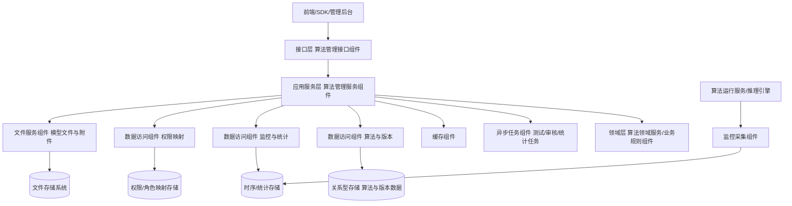
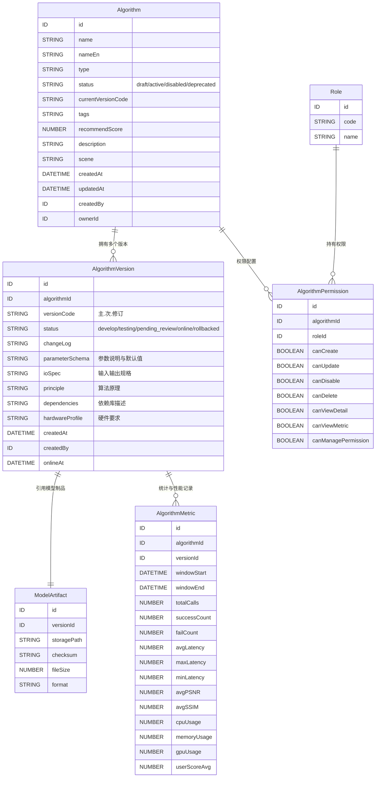
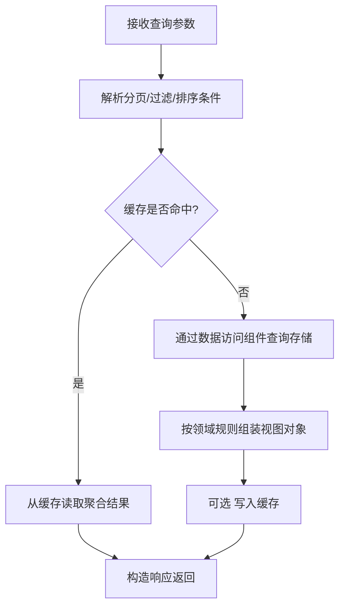
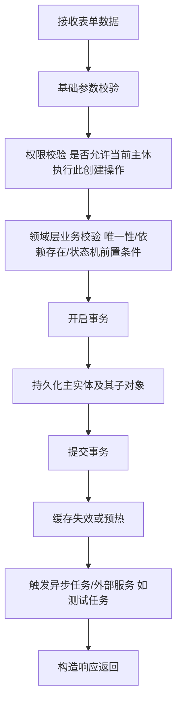
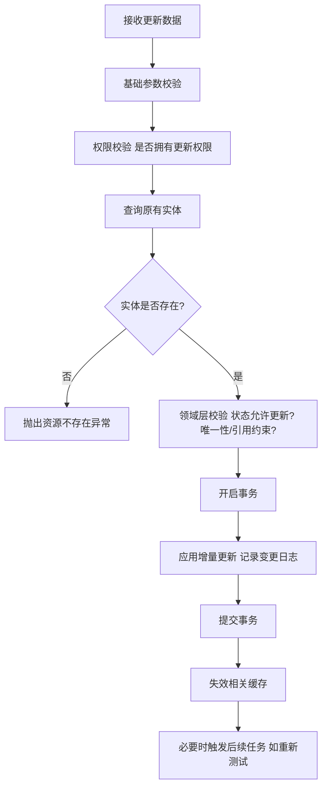
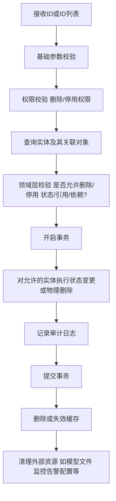
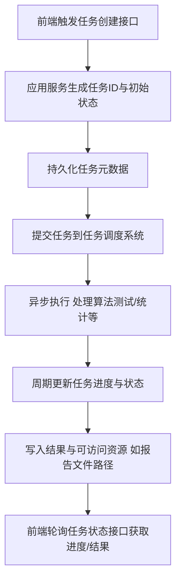
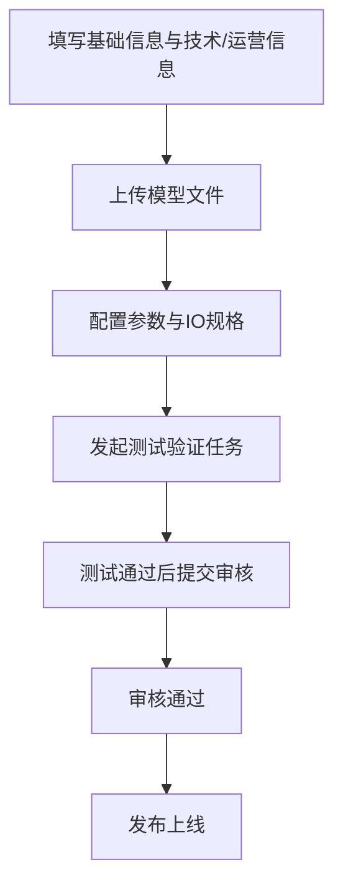
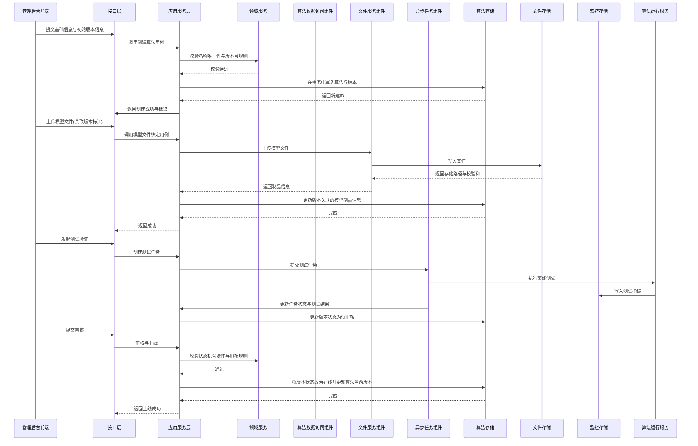
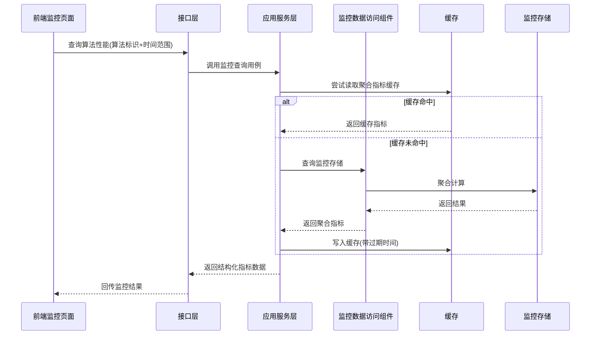

## 一、模块概览与核心目标

**模块定位**：  
算法管理模块负责管理图像去雾算法的全生命周期与运营信息，为前端配置、算法调用服务、监控平台和权限系统提供统一、稳定的后台能力。

**核心目标**：

- **生命周期管理**：支持算法从「创建 → 配置 → 测试 → 审核 → 上线 → 停用/归档 → 删除」的全流程管理。
- **版本控制**：支持同一算法的多版本并行管理、版本升级、回滚与历史版本追溯。
- **性能监控**：聚合并展示算法各版本的使用统计与性能指标。
- **权限控制**：基于角色/用户对算法进行细粒度操作权限控制（新增、修改、停用、删除、查看、监控等）。
- **可配置化下发**：为算法选择模块、终端 SDK 等提供算法树、下拉选项、详情信息与性能画像。

---

## 二、分层与组件架构

### 2.1 分层架构

**职责划分（抽象）**：

- **接口层**：
    - 暴露 REST 风格接口（列表、详情、创建、更新、停用、删除、监控查询、权限配置等）。
    - 统一请求解析、参数基础校验、身份与权限入口校验、统一响应包装。

- **应用服务层**：
    - 组合多个领域规则，实现完整用例：新增算法、版本升级、停用算法、查看算法树、查看监控等。
    - 控制事务边界、协调缓存、文件服务、任务组件和数据访问组件。

- **领域层**：
    - 封装算法状态机（状态流转、版本策略、不可删除/不可停用规则）。
    - 封装跨实体的业务不变量（唯一性规则、版本号规则、性能指标计算规则等）。

- **数据访问组件**：
    - 面向应用服务与领域服务提供实体级、聚合级访问接口。
    - 屏蔽具体数据库实现（关系型、时序型等）。

- **文件服务组件**：
    - 负责模型文件、样例图片和说明文档的上传、校验、存储路径生成与删除。
    - 与主事务解耦（失败重试、幂等处理）。

- **异步任务组件**：
    - 承载耗时操作：模型测试验证、离线评估、统计汇总、导出任务等。
    - 提供任务状态查询及进度回报。

- **缓存组件**：
    - 管理算法树、常用选项、热点详情、统计汇总等缓存项。

- **监控采集组件**：
    - 在算法运行服务侧采集原始指标，写入时序/统计存储。
    - 算法管理模块只读取这些指标，不直接参与采集。

---

## 三、核心数据模型与实体关系

> 下述为**抽象数据模型**，用于指导数据设计；并非具体类或表定义。

**说明**：

- **Algorithm**：算法逻辑实体，代表「去雾算法」这一概念。
- **AlgorithmVersion**：具体版本实例，绑定模型文件和技术配置。
- **ModelArtifact**：模型文件制品信息。
- **AlgorithmMetric**：预聚合的统计指标（可按日/小时等窗口）。
- **AlgorithmPermission**：算法级别权限映射，可对单个算法进行差异化授权。

---

## 四、通用业务模式（DRY 抽象）

### 4.1 通用请求处理流水线

**通用职责**：

- 接口层：只做**解析/校验/权限入口/响应封装**，不写业务规则。
- 应用服务层：串联多个组件，**定义事务边界与执行顺序**。
- 领域层：保证业务不变量与状态机合法性。
- 数据访问组件：单一职责，**只做持久化与查询**。
- 缓存/文件/任务组件：通过应用服务协调，避免与接口层直接耦合。

### 4.2 通用查询流程（列表/详情）

适用于：算法列表、算法详情、版本列表、监控查询等。

### 4.3 通用创建流程（含基础校验与权限）

### 4.4 通用更新流程

### 4.5 通用删除/停用流程

### 4.6 通用校验规则（适用于所有接口）

- **参数校验**：
    - 必填字段非空。
    - 字符串长度与字符集限制。
    - 数值范围与枚举值合法性。
    - 复杂字段结构校验（参数配置、IO 规格、依赖库描述等）。

- **业务校验**：
    - 名称唯一性（同一类型或同一目录下算法名称不可重复）。
    - 版本号唯一性（同一算法下版本号唯一且遵守版本号规则）。
    - 状态机合法性（不允许从停用直接变更为开发中等非法状态）。
    - 外键存在性（引用的角色、用户、模型文件等必须存在）。
    - 依赖合法性（依赖库规范、硬件要求匹配系统能力）。

### 4.7 通用权限控制模式

- 基于角色的操作权限映射：
    - 新增、修改、停用、删除、查看详情、查看监控、管理权限等操作对应不同的权限位。
- 入口校验方式：
    - 接口层负责判断当前主体是否具备访问该接口的基本权限。
    - 应用服务层在关键业务节点再次校验敏感操作权限（如删除、权限变更）。
- 数据范围控制：
    - 可选支持：仅能查看自己创建的算法、仅能操作所属团队的算法等。

### 4.8 通用异常处理与响应

- **异常分类**（模块内部约定）：
    - 参数错误：请求参数不符合格式或规则。
    - 业务错误：违反算法管理的业务规则（如版本号冲突、状态不可变更）。
    - 授权错误：无操作权限。
    - 资源未找到：算法或版本不存在。
    - 系统错误：数据库、缓存、文件服务、任务服务异常等。

- **响应策略**：
    - 将内部异常映射为统一的错误码与错误消息结构。
    - 敏感信息写入日志，不返回给前端。
    - 对于可重试的外部依赖异常，提示「可重试」类型错误。

### 4.9 通用缓存策略

- 缓存对象示例：
    - 算法树结构（供列表与选择使用）。
    - 算法下拉选项。
    - 热点算法详情与版本详情。
    - 聚合统计数据（调用量、评分、成功率等）。

- 更新策略：
    - 创建/更新/停用/删除算法时，失效树与选项缓存。
    - 版本变更时，失效对应算法详情及部分统计缓存。
    - 监控数据通过独立周期任务进行聚合与缓存。

### 4.10 通用异步任务模式

适用于：算法测试验证、性能评估、批量导入导出、统计汇总等。

---

## 五、各功能的差异化逻辑设计（按接口流向）

下面仅描述相对于通用模式的**差异**与**算法特有逻辑**。

### 5.1 算法树形列表查询

**用途**：  
展示包含父子关系的算法树，并附带基础统计信息；支持搜索、筛选、排序。

**接口层**：

- 支持参数：
    - 关键字：按名称/标签模糊搜索。
    - 类型/状态/版本范围筛选。
    - 创建时间范围筛选。
- 调用应用服务层的树型列表用例，并传递分页与排序配置。

**应用服务层**（在通用查询流程上增加）：

- 根据筛选条件调用算法数据访问组件获取平面列表。
- 执行树构建逻辑：按父子关系构建多级树（若有分类维度可按类型/目录分组）。
- 调用监控数据访问组件获取必要的聚合统计（使用次数、平均评分、成功率、平均处理时间）；可通过缓存加速。
- 将基础信息与统计信息合并为树形视图返回。

**数据访问组件**：

- 提供按多条件查询算法列表的接口。
- 提供按算法集合批量查询聚合统计的接口，减少往返。

**数据存储**：

- 算法与版本存储在关系型存储。
- 统计信息从时序或统计存储中查询、聚合。

---

### 5.2 算法详情查看

**用途**：  
展示算法的完整信息，包括当前版本、历史版本、技术信息、运营信息及性能指标。

**接口层**：

- 接收算法标识。
- 可选接收目标版本标识（未提供时默认当前线上版本）。

**应用服务层**（在通用详情查询基础上增加）：

- 查询算法基础信息。
- 查询指定版本信息（或当前版本）。
- 查询模型制品信息。
- 查询近期性能指标（如最近 7 日调用情况、成功率与平均耗时）。
- 查询权限信息（当前主体对该算法的权限，可控是否返回前端）。
- 组装三级信息结构：基础信息、技术信息、运营信息。

**数据访问组件**：

- 算法与版本组件：按算法标识与版本标识查询。
- 模型制品组件：按版本标识查询。
- 监控组件：按算法/版本与时间范围查询并聚合指标。

---

### 5.3 新增算法（含版本与模型文件）

**用途**：  
添加新的去雾算法，包括基础信息、模型文件和技术/运营配置；支持提交测试与审核。

#### 5.3.1 交互与流程（抽象）

#### 5.3.2 按层职责

**接口层**：

- 将创建过程拆分为若干接口，例如：
    - 提交基础信息与初始版本信息。
    - 上传模型文件并绑定至版本。
    - 发起测试验证任务。
    - 提交审核/审核决策。
- 每个接口均进行基础参数与权限校验后，调用对应应用服务用例。

**应用服务层**：

- **创建算法与初始版本**：
    - 按通用创建流程执行：
        - 校验算法名称唯一性与版本号合法性。
        - 创建算法实体（初始状态为「开发中」或「草稿」）。
        - 创建对应的版本实体（状态为「开发中」）。
        - 记录创建人、拥有者与初始变更日志。
- **绑定模型文件**：
    - 调用文件服务组件上传模型文件。
    - 校验文件大小、格式、校验和。
    - 更新版本实体关联的模型制品信息。
- **测试验证任务**：
    - 创建测试任务记录，保存输入参数/样例数据说明。
    - 提交到任务组件，由算法运行服务执行离线测试。
    - 收集测试报告（成功率、性能、指标等），与版本状态挂钩。
- **审核与上线**：
    - 校验当前版本状态必须为「待审核」。
    - 校验审核人权限。
    - 审核通过时：
        - 版本状态变更为「在线」。
        - 算法当前版本字段指向该版本。
        - 若有旧线上版本，则根据策略将其状态调整为「历史版本」或「可回滚」。

**领域层（关键规则）**：

- 新增时的状态机：
    - 草稿/开发中 → 测试中 → 待审核 → 在线/驳回。
- 版本号规则：
    - 格式为「主版本.次版本.修订号」。
    - 同一算法下版本号不可重复。
- 审核规则：
    - 审核人与创建者可区分角色。
    - 审核通过/驳回均需记录原因与日志。

**数据访问组件与存储**：

- 在一个事务中写入 Algorithm 与 AlgorithmVersion，避免孤立记录。
- 模型文件信息写入独立制品实体，便于统计与存储优化。

**异步任务与文件操作**：

- 测试任务与长耗时评估通过任务组件在事务外异步执行。
- 模型文件上传失败时，不改变算法与版本状态，只在业务层返回错误。

---

### 5.4 修改算法与版本升级

**用途**：  
修改算法基础信息、技术/运营信息，进行版本升级与回滚。

**接口层**：

- 普通信息修改接口：支持修改描述、适用场景、标签、推荐指数等。
- 版本升级接口：创建新版本并上传新的模型文件与配置。
- 版本回滚接口：指定目标历史版本，将其设为当前线上版本。

**应用服务层**：

- 普通修改：
    - 遵循通用更新流程。
    - 若只修改描述或运营信息，不改变版本状态。
- 版本升级：
    - 必须创建新的版本实体，不直接修改当前在线版本的模型文件。
    - 可基于现有版本复制配置，在此基础上修改。
    - 校验版本号递增或符合指定策略。
    - 后续流程同「新增版本」：测试、审核、上线。
- 版本回滚：
    - 校验目标版本状态必须为可回滚状态。
    - 更新算法当前版本字段指向目标版本。
    - 更新旧版本状态为「历史版本」或「已被回滚」。

**领域规则**：

- 不允许直接覆盖模型文件以避免线上不可追溯变更。
- 回滚操作需记录操作人、时间与原因。
- 回滚后仍保留后续版本历史，便于再次切换。

---

### 5.5 停用/删除算法

**用途**：  
根据业务条件停用或删除算法，确保不破坏系统稳定性与数据可追溯性。

**接口层**：

- 停用接口：接收算法标识列表或单个标识。
- 删除接口：接收算法标识列表，并要求二次确认参数。

**应用服务层**：

- 停用：
    - 遵循通用删除/停用流程的「状态变更」分支。
    - 校验：
        - 当前算法是否被运行服务引用。
        - 是否存在强依赖（如正在执行的任务、未完成的下载等）。
    - 若可停用：
        - 将算法状态置为「停用」，并通知运行服务更新可用算法列表。
- 删除：
    - 业务规则严格：
        - 只允许删除已停用且确认不再使用的算法。
        - 必须保留使用记录与监控数据（逻辑删除或软删除算法实体）。
    - 数据操作：
        - 在一个事务中标记算法及其版本为逻辑删除（或删除关联记录），保留必要审计信息。
        - 在事务提交后，通过任务组件异步清理模型文件与无用监控配置。

**数据访问与存储**：

- 保留 AlgorithmMetric 与审计日志。
- 使用状态字段标记已删除，而非硬删除监控数据。

---

### 5.6 算法性能监控查询

**用途**：  
为运营人员与算法管理员提供性能与使用情况视图。

**接口层**：

- 支持查询某算法/某版本在指定时间范围内的：
    - 调用量、成功率、失败率。
    - 平均/最大/最小处理时间。
    - 资源使用情况（CPU、内存、GPU）。
    - 用户评分与反馈统计。

**应用服务层**：

- 使用通用查询流程从监控存储中拉取聚合后指标。
- 若使用预聚合表：
    - 根据维度（按算法/版本/时间粒度）查询预计算指标。
- 组合为：
    - 总览指标。
    - 趋势序列（用于绘制曲线）。
    - 分布统计（处理时间分布、错误类型分布等）。

**数据访问组件**：

- 封装对时序/统计存储的查询，隐藏底层实现（如按时间窗口聚合）。

---

### 5.7 算法权限管理

**用途**：  
为不同角色配置算法级操作权限。

**接口层**：

- 提供：
    - 查询某算法当前权限配置。
    - 为角色/用户授予或回收对某算法的权限。

**应用服务层**：

- 权限配置变更：
    - 校验调用者是否具备管理权限。
    - 遵循通用创建/更新流程修改 AlgorithmPermission 记录。
    - 可选：向权限系统推送变更事件。

**数据访问与存储**：

- AlgorithmPermission 与 Role 映射存储在权限存储中。
- 查询算法列表或详情时，可附带当前主体可行操作标志位（用于前端控制按钮显示）。

---

## 六、数据流与时序设计

### 6.1 新增算法与版本全流程时序

### 6.2 算法性能监控查询时序

---

## 七、关键业务规则与校验（算法特有）

- **名称与版本唯一性**：
    - 同一类型或同一目录内，算法名称不可重复。
    - 同一算法下版本号唯一，且必须符合版本号规则。

- **状态机约束**：
    - 算法状态与版本状态均遵循严格的状态流转图，如：
        - 算法：草稿 → 开发中 → 上线 → 停用 → 归档。
        - 版本：开发中 → 测试中 → 待审核 → 在线 → 历史/可回滚。
    - 不允许从停用直接变回开发中，必须通过明确的「重新启用」操作。

- **删除与停用条件**：
    - 删除前必须处于停用状态，且未被运行服务引用。
    - 删除不影响历史调用与监控数据，后者需保留。

- **性能与质量指标规则**：
    - 统计窗口可选择固定粒度（如按日/小时）。
    - 成功率、平均耗时等计算规则在领域层统一定义，避免多处实现不一致。

- **权限规则**：
    - 全局角色表定义各类系统角色。
    - 算法权限映射允许对单个算法进行权限覆盖（如某算法仅特定团队可编辑）。

---

## 八、异常处理与事务策略（模块级）

### 8.1 事务边界

- **需要事务的场景**：
    - 创建算法与版本（确保两者原子性）。
    - 更新算法状态与版本状态（避免状态不一致）。
    - 删除或停用算法及其关联版本（尤其是批量操作）。
    - 权限配置变更。

- **事务与外部资源**：
    - 文件上传、模型测试、监控配置等外部操作在事务之外执行：
        - 主数据写入成功后再执行外部交互。
        - 外部操作失败时，通过补偿任务或重试机制处理，不回滚主数据（除非强一致性要求的部分）。

### 8.2 异常与回滚策略

- 参数错误/业务错误：
    - 不触发事务或事务未开启时返回错误，记录日志，不做数据库变更。
- 资源不存在/权限错误：
    - 直接返回对应错误码，无额外操作。
- 数据库异常：
    - 在事务中自动回滚变更，返回统一的系统错误。
- 文件服务/任务服务异常：
    - 若发生在事务前：
        - 中止流程，不写入数据库。
    - 若发生在事务后：
        - 主数据不回滚，记录失败状态与详细原因，交由后台任务修复或人工干预。

---

## 九、缓存与性能优化建议（模块维度）

### 9.1 缓存策略

- **缓存粒度**：
    - 算法树：全量缓存，适合高频读取的下拉选择、树组件展示。
    - 算法选项列表：仅包含启用状态算法，提供给前端选择模块。
    - 热点算法详情：按算法标识做短期缓存。
    - 聚合监控指标：针对热门算法做预聚合与缓存。

- **失效策略**：
    - 算法或版本发生变更、上下线等操作时：
        - 失效对应算法树、选项列表和详情缓存。
    - 监控数据缓存：
        - 设置合理过期时间（如数分钟），避免频繁查询时序存储。

### 9.2 查询与存储优化

- 为常用过滤字段建立索引（类型、状态、名称、创建时间等）。
- 使用批量查询避免 N+1 问题（一次性加载算法对应的当前版本和统计信息）。
- 对监控指标使用预聚合表或物化视图，避免实时大范围扫描时序数据。
- 对模型文件采用分层存储与 CDN 分发，减轻后端压力。

### 9.3 异步化与限流

- 对耗时操作（测试、导出、统计）统一通过异步任务处理，接口只返回任务标识与状态。
- 对监控查询与大列表接口可加限流与分页，防止单次请求拉取过多数据。
- 对高频写操作（如统计上报）采用批量写入或队列方式，减轻数据库压力。

---

- **模块范围梳理**：覆盖算法生命周期管理、版本控制、性能监控与权限管理的后端设计。
- **通用模式抽象**：提炼统一的请求处理、CRUD 流程、校验、权限、异常与缓存模式，算法功能仅描述差异。
- **算法特有设计**：对算法树、详情、创建/升级/回滚、停用/删除、监控查询与权限配置给出逐层职责与数据流设计。
