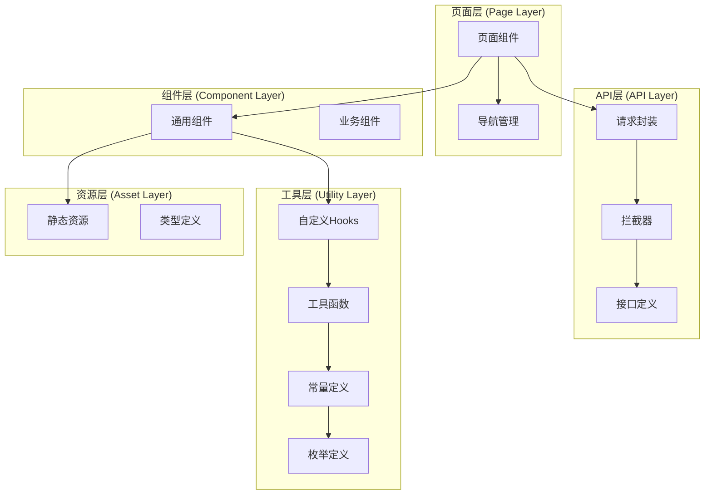
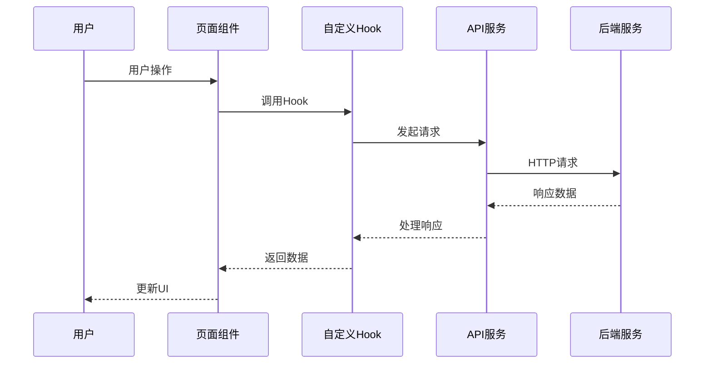

# Dehaze React Native - 架构概述

**文档版本**: v1.0
**最后更新**: 2025-11-22
**项目名称**: dehaze-react-native
**目标平台**: iOS、Android

---

## 📋 文档概述

本文档详细描述了Dehaze React
Native应用的整体架构设计，包括架构原则、技术选型、模块划分和核心设计决策。本文档基于对[demo产品需求](../../../docs)
和[后端API服务](../../../../../../../dehaze-java)的深入分析，专注于移动端原生体验的架构设计。

---

## 🎯 产品定位与设计目标

### 产品定位

**Dehaze React Native**是专为移动端设计的图像去雾应用，作为完整去雾系统的移动前端，与后端服务（dehaze-java、dehaze-python、dehaze-go）深度集成，为用户提供：

- **原生级性能体验**: 充分利用移动设备硬件能力
- **便捷的图像获取**: 深度集成相机和相册功能
- **智能的算法选择**: 基于图像特征的智能推荐
- **实时的处理反馈**: WebSocket实时进度推送
- **丰富的对比模式**: 6种专业级对比工具

### 核心设计目标

#### 1. 移动端优先原则
- **原生性能**: 接近原生应用的性能表现
- **平台一致性**: 适配iOS和Android设计规范
- **手势优化**: 支持移动端特有的手势交互
- **电池优化**: 合理的功耗管理，延长续航

#### 2. 用户体验目标
- **快速体验**: 10秒内完成首次体验流程
- **直观操作**: 基于用户习惯的交互设计
- **即时反馈**: 毫秒级的交互响应
- **错误友好**: 清晰的错误提示和恢复方案

#### 3. 技术质量目标
- **代码质量**: TypeScript类型安全，>90%测试覆盖率
- **性能指标**: 启动时间<3秒，页面切换<300ms
- **内存管理**: 内存泄漏为零，合理的内存占用
- **网络优化**: 智能缓存，离线支持

---

## 🏗️ 整体架构设计

### 架构模式选择

采用**经典分层架构**模式，结合React Navigation路由管理和Axios网络请求：



#### 分层架构原则

**页面层 (Page Layer)**
- **职责**: 页面级组件管理、路由跳转、页面状态
- **组件**: 页面组件（Home、Login、ImageInput等）
- **特点**: 管理页面级状态，协调组件间通信

**组件层 (Component Layer)**
- **职责**: UI组件、业务逻辑组件
- **组件**: Button、Input、Card等通用组件；ImagePicker、AlgorithmSelector等业务组件
- **特点**: 可复用、独立、自包含

**API层 (API Layer)**
- **职责**: 网络请求、响应处理、错误管理
- **组件**: 请求封装、拦截器、接口定义
- **特点**: 统一的API调用、自动错误处理、请求/响应拦截

**工具层 (Utility Layer)**
- **职责**: 工具函数、自定义Hooks、常量定义
- **组件**: 通用工具、业务Hooks、常量枚举
- **特点**: 纯函数、可测试、跨页面复用

**资源层 (Asset Layer)**
- **职责**: 静态资源、类型定义
- **组件**: 图片、图标、TypeScript类型
- **特点**: 类型安全、资源管理

### 项目目录结构

基于现有项目结构，扩展后的完整架构：

```
dehaze-react-native/
├── src/
│   ├── App.tsx                           # 应用入口
│   ├── api/                              # API接口层
│   │   ├── auth/                         # 认证相关API
│   │   │   ├── index.ts                  # 认证API入口
│   │   │   └── model.ts                  # 认证数据模型
│   │   ├── image/                        # 图像处理API
│   │   │   ├── index.ts                  # 图像API入口
│   │   │   └── types.ts                  # 图像数据类型
│   │   ├── algorithm/                    # 算法管理API
│   │   │   ├── index.ts                  # 算法API入口
│   │   │   └── types.ts                  # 算法数据类型
│   │   └── file/                         # 文件管理API
│   │       ├── index.ts                  # 文件API入口
│   │       └── types.ts                  # 文件数据类型
│   ├── assets/                           # 静态资源
│   │   ├── images/                       # 图片资源
│   │   │   ├── logo.png                  # 应用Logo
│   │   │   ├── icons/                    # 图标资源
│   │   │   └── backgrounds/              # 背景图片
│   │   ├── fonts/                        # 字体资源
│   │   └── animations/                   # 动画资源
│   ├── components/                       # 通用组件
│   │   ├── Button/                       # 按钮组件
│   │   │   ├── index.tsx                 # 按钮组件
│   │   │   ├── Button.styles.ts          # 按钮样式
│   │   │   └── Button.types.ts          # 按钮类型
│   │   ├── Input/                        # 输入框组件
│   │   ├── Card/                         # 卡片组件
│   │   ├── Modal/                        # 弹窗组件
│   │   ├── Loading/                      # 加载组件
│   │   └── index.ts                      # 组件导出
│   ├── pages/                            # 页面组件
│   │   ├── home/                         # 首页
│   │   │   ├── index.tsx                 # 首页组件
│   │   │   ├── Home.styles.ts            # 首页样式
│   │   │   └── components/               # 首页专用组件
│   │   ├── login/                        # 登录页
│   │   │   ├── index.tsx                 # 登录组件
│   │   │   └── Login.styles.ts           # 登录样式
│   │   ├── imageInput/                   # 图像输入页
│   │   │   ├── index.tsx                 # 图像输入组件
│   │   │   ├── components/               # 图像输入子组件
│   │   │   │   ├── CameraPicker.tsx      # 相机选择
│   │   │   │   ├── GalleryPicker.tsx     # 相册选择
│   │   │   │   └── ImagePreview.tsx      # 图片预览
│   │   │   └── ImageInput.styles.ts       # 图像输入样式
│   │   ├── algorithmSelect/              # 算法选择页
│   │   │   ├── index.tsx                 # 算法选择组件
│   │   │   ├── components/               # 算法选择子组件
│   │   │   │   ├── AlgorithmCard.tsx     # 算法卡片
│   │   │   │   ├── CategoryTabs.tsx      # 分类标签
│   │   │   │   └── SearchInput.tsx       # 搜索输入
│   │   │   └── AlgorithmSelect.styles.ts # 算法选择样式
│   │   ├── dehazeProcessing/             # 去雾处理页
│   │   │   ├── index.tsx                 # 去雾处理组件
│   │   │   ├── components/               # 去雾处理子组件
│   │   │   │   ├── ProcessingProgress.tsx # 处理进度
│   │   │   │   ├── ParameterPanel.tsx    # 参数面板
│   │   │   │   └── PreviewArea.tsx       # 预览区域
│   │   │   └── DehazeProcessing.styles.ts # 去雾处理样式
│   │   ├── effectComparison/             # 效果对比页
│   │   │   ├── index.tsx                 # 效果对比组件
│   │   │   ├── components/               # 效果对比子组件
│   │   │   │   ├── ComparisonMode.tsx    # 对比模式
│   │   │   │   ├── SideBySideView.tsx    # 并排视图
│   │   │   │   ├── OverlayView.tsx       # 重叠视图
│   │   │   │   └── MagnifierView.tsx     # 放大镜视图
│   │   │   └── EffectComparison.styles.ts # 效果对比样式
│   │   └── profile/                      # 个人中心页
│   │       ├── index.tsx                 # 个人中心组件
│   │       ├── components/               # 个人中心子组件
│   │       └── Profile.styles.ts         # 个人中心样式
│   ├── routes/                           # 路由配置
│   │   ├── config.ts                     # 路由配置
│   │   ├── navigator.tsx                 # 导航管理
│   │   ├── index.tsx                     # 导航入口
│   │   ├── utils.ts                      # 路由工具
│   │   └── types.ts                      # 导航类型
│   ├── utils/                            # 工具函数
│   │   ├── request.ts                    # 网络请求封装
│   │   ├── storage.ts                    # 本地存储工具
│   │   ├── image.ts                      # 图片处理工具
│   │   ├── permission.ts                 # 权限管理工具
│   │   ├── common.ts                     # 通用工具
│   │   └── index.ts                      # 工具导出
│   ├── hooks/                            # 自定义Hooks
│   │   ├── useAuth.ts                    # 认证Hook
│   │   ├── useRequest.ts                 # 请求Hook
│   │   ├── usePermission.ts              # 权限Hook
│   │   ├── useCamera.ts                  # 相机Hook
│   │   ├── useImagePicker.ts             # 图片选择Hook
│   │   ├── useWebSocket.ts               # WebSocket Hook
│   │   └── index.ts                      # Hooks导出
│   ├── constants/                        # 常量定义
│   │   ├── api.ts                        # API常量
│   │   ├── storage.ts                    # 存储常量
│   │   ├── config.ts                     # 配置常量
│   │   ├── navigation.ts                 # 导航常量
│   │   └── index.ts                      # 常量导出
│   ├── enums/                            # 枚举定义
│   │   ├── CacheEnum.ts                  # 缓存枚举
│   │   ├── ResultEnum.ts                 # 结果枚举
│   │   ├── StatusEnum.ts                 # 状态枚举
│   │   ├── AlgorithmEnum.ts              # 算法枚举
│   │   └── index.ts                      # 枚举导出
│   └── types/                            # TypeScript类型定义
│       ├── api.ts                        # API类型
│       ├── navigation.ts                 # 导航类型
│       ├── algorithm.ts                  # 算法类型
│       ├── image.ts                      # 图像类型
│       ├── user.ts                       # 用户类型
│       └── index.ts                      # 类型导出
├── android/                              # Android原生代码
│   ├── app/                              # Android应用配置
│   ├── gradle/                           # Gradle配置
│   └── src/                              # Android源码
├── ios/                                  # iOS原生代码
│   ├── DehazeSystem/                     # iOS应用配置
│   ├── DehazeSystem.xcodeproj/           # Xcode项目
│   └── DehazeSystemTests/                # iOS测试
├── __tests__/                            # 测试文件
│   ├── components/                       # 组件测试
│   ├── pages/                            # 页面测试
│   ├── utils/                            # 工具测试
│   └── __mocks__/                        # Mock文件
├── package.json                          # 项目配置
├── tsconfig.json                         # TypeScript配置
├── babel.config.js                       # Babel配置
├── metro.config.js                       # Metro配置
└── README.md                             # 项目说明
```

### 模块职责划分

| 模块名称 | 职责描述 | 包含内容 | 依赖关系 |
|---------|---------|---------|---------|
| **pages** | 页面级组件管理 | 各个功能页面的组件实现 | components、hooks、api、utils |
| **components** | UI组件库 | 通用组件、业务组件、组件样式 | utils、types、assets |
| **api** | 网络请求层 | API接口定义、请求封装、数据模型 | utils、constants、enums |
| **routes** | 导航管理 | 路由配置、导航控制、页面跳转 | pages、types |
| **utils** | 工具函数 | 通用工具、网络请求、存储管理 | constants、enums、types |
| **hooks** | 自定义Hooks | 业务逻辑Hook、状态管理Hook | utils、api、constants |
| **constants** | 常量定义 | 配置常量、API常量、导航常量 | 无 |
| **enums** | 枚举定义 | 业务枚举、状态枚举、类型枚举 | 无 |
| **types** | 类型定义 | TypeScript类型、接口定义 | 无 |
| **assets** | 静态资源 | 图片、图标、字体、动画资源 | 无 |

---

## 🔄 数据流设计

### 数据流架构



### 典型数据流示例

#### 1. 用户登录流程

```typescript
// 登录页面 -> useAuth Hook -> Auth API -> 后端
Login Page -> useAuth Hook -> Auth API -> Backend
```

#### 2. 图像处理流程

```typescript
// 图像输入页 -> useImagePicker Hook -> File API -> 后端
ImageInput -> useImagePicker -> File API -> Backend
```

#### 3. 算法选择流程

```typescript
// 算法选择页 -> useAlgorithm Hook -> Algorithm API -> 后端
AlgorithmSelect -> useAlgorithm -> Algorithm API -> Backend
```

---

## 📱 移动端特色功能

### 1. 原生模块集成

基于React Native的跨平台特性，集成移动端特有功能：

```typescript
// 相机功能
- react-native-camera: 相机拍照和录像
- react-native-image-picker: 图片选择和裁剪
- react-native-vision-camera: 现代化相机解决方案

// 文件系统
- react-native-fs: 文件系统操作
- @react-native-async-storage/async-storage: 本地存储
- react-native-document-picker: 文档选择器

// 权限管理
- react-native-permissions: 权限请求和检查
- @react-native-community/geolocation: 位置服务

// 设备功能
- react-native-biometrics: 生物识别
- react-native-device-info: 设备信息
- react-native-keychain: 安全存储
```

### 2. 手势交互系统

利用React Native的手势处理能力：

```typescript
// 手势处理
- react-native-gesture-handler: 手势识别
- react-native-reanimated: 高性能动画
- react-native-svg: SVG图形和动画
- react-native-skia: 现代化图形库
```

### 3. 通知和推送

移动端特有通知机制：

```typescript
// 通知系统
- @react-native-firebase/messaging: Firebase推送通知
- react-native-push-notification: 本地通知
- react-native-background-job: 后台任务
```

---

## 🎨 设计系统集成

### 1. 主题系统

基于移动端设计规范的主题系统：

```typescript
// 主题配置
interface Theme {
  colors: {
    primary: string;
    secondary: string;
    background: string;
    surface: string;
    text: string;
    textSecondary: string;
    border: string;
    error: string;
    warning: string;
    success: string;
  };
  typography: {
    fontFamily: {
      regular: string;
      medium: string;
      semiBold: string;
      bold: string;
    };
    fontSize: {
      xs: number;
      sm: number;
      md: number;
      lg: number;
      xl: number;
    };
  };
  spacing: {
    xs: number;
    sm: number;
    md: number;
    lg: number;
    xl: number;
  };
  borderRadius: {
    sm: number;
    md: number;
    lg: number;
  };
  shadows: {
    sm: any;
    md: any;
    lg: any;
  };
}
```

### 2. 响应式设计

适配不同屏幕尺寸的响应式布局：

```typescript
// 响应式工具
const useResponsive = () => {
  const [dimensions, setDimensions] = useState(Dimensions.get('window'));

  useEffect(() => {
    const subscription = Dimensions.addEventListener('change', ({ window }) => {
      setDimensions(window);
    });

    return () => subscription?.remove();
  }, []);

  return {
    width: dimensions.width,
    height: dimensions.height,
    isPhone: dimensions.width < 768,
    isTablet: dimensions.width >= 768 && dimensions.width < 1024,
    isDesktop: dimensions.width >= 1024,
  };
};
```

---

## 🚀 核心优势

### 技术优势

**1. 成熟的技术栈**
- React Native 0.81: 最新版本，稳定的跨平台框架
- TypeScript: 类型安全，提升开发效率
- React Navigation 6: 成熟的路由解决方案
- Axios: 丰富的网络请求库，完善的拦截器机制

**2. 清晰的架构分层**
- 页面、组件、API、工具四层架构
- 职责明确，易于维护和扩展
- 符合前端开发的最佳实践

**3. 移动端原生体验**
- 深度集成移动端特有功能
- 原生性能表现
- 完善的手势交互支持

### 开发优势

**1. 开发效率**
- 基于现有架构，降低学习成本
- 组件化开发，提高复用性
- TypeScript类型安全，减少运行时错误

**2. 维护性**
- 清晰的目录结构和命名规范
- 统一的代码风格和最佳实践
- 完善的文档和注释

**3. 扩展性**
- 模块化设计，便于功能扩展
- 组件库支持，快速构建新功能
- API层抽象，便于后端切换

---

## 📚 相关文档

### 架构文档系列
- [02-技术架构](02-technical-architecture.md)：详细的技术栈和架构实现
- [03-组件设计](03-component-design.md)：组件设计规范和最佳实践
- [04-API集成](04-api-integration.md)：API接口集成方案
- [05-状态管理](05-state-management.md)：状态管理策略

### 设计文档系列
- [06-导航设计](06-navigation-design.md)：导航系统设计
- [07-响应式设计](07-responsive-design.md)：多设备适配方案
- [08-性能优化](08-performance-optimization.md)：性能优化策略

### 开发文档系列
- [09-测试策略](09-testing-strategy.md)：测试策略和工具
- [10-部署指南](10-deployment-guide.md)：应用打包和发布

### 需求文档系列

- [产品概述和总体架构](../../../docs/01-产品概述和总体架构.md)：完整的产品需求分析
- [UI-UX设计规范](../../../docs/08-UI-UX设计规范.md)：完整的设计规范
- [后端API分析](../../../docs/backend-api-analysis.md)：后端接口详细分析

---

## 📈 开发计划

### 第一阶段：基础架构完善（2周）
- Week 1：完善现有目录结构，补充类型定义
- Week 2：扩展工具函数和自定义Hooks

### 第二阶段：核心功能开发（4周）
- Week 3-4：图像输入和算法选择功能
- Week 5-6：去雾处理和效果对比功能

### 第三阶段：优化与完善（3周）
- Week 7-8：移动端特有功能和性能优化
- Week 9：测试完善和文档补充

### 第四阶段：测试与发布（2周）
- Week 10：全面测试和Bug修复
- Week 11：应用打包和发布准备

---

**文档版本**: v1.0
**最后更新**: 2025-11-22
**下次更新**: 根据开发进度和需求变化持续更新
