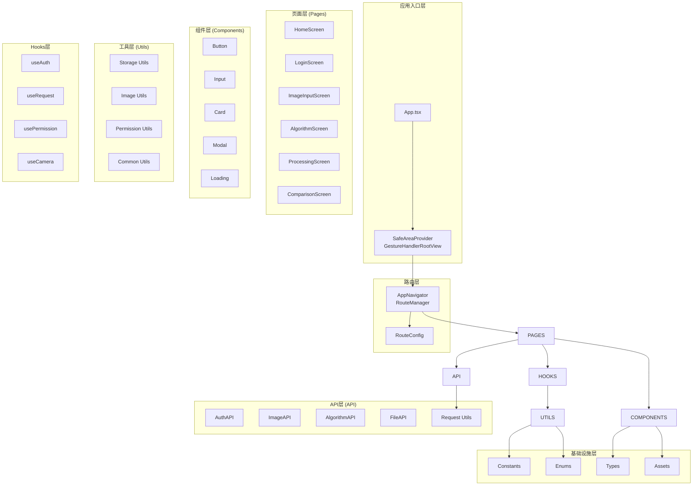

# Dehaze React Native - 技术架构设计

**文档版本**: v1.0
**最后更新**: 2025-11-22
**项目名称**: dehaze-react-native
**目标平台**: iOS、Android

---

## 📋 文档概述

本文档详细描述了Dehaze React Native应用的技术架构设计，包括技术选型理由、架构模式实现、关键技术方案和性能优化策略。基于现有的**经典分层架构**模式，专注于移动端原生体验的技术实现。

---

## 🏗️ 技术架构总览

### 整体架构图



### 技术分层架构

#### 1. 应用入口层 (Application Layer)

**职责**: 应用初始化、全局配置、基础组件
**技术栈**: React Native + SafeAreaProvider + GestureHandler

```typescript
// App.tsx - 应用入口结构
interface ApplicationLayer {
  // 根组件
  App: React.FC;                    // 主应用组件
  providers: {
    SafeAreaProvider: React.FC;    // 安全区域提供者
    GestureHandlerRootView: React.FC; // 手势处理根视图
  };
  // 全局配置
  statusBar: StatusBar;             // 状态栏配置
  theme: ThemeProvider;             // 主题提供者（可选）
}
```

#### 2. 路由层 (Navigation Layer)

**职责**: 路由管理、页面导航、导航控制
**技术栈**: React Navigation 6 + Native Stack Navigator

```typescript
// 路由层架构
interface NavigationLayer {
  // 核心导航
  AppNavigator: React.FC;          // 应用导航器
  RouteManager: React.FC;          // 路由管理器

  // 配置
  RouteConfig: RouteConfig[];      // 路由配置数组
  RootStackParamList: Type;        // 导航参数类型

  // 工具
  NavigationUtils: {               // 导航工具函数
    navigate: (screen: string, params?: any) => void;
    goBack: () => void;
    reset: (state: any) => void;
  };
}
```

#### 3. 页面层 (Page Layer)

**职责**: 页面级组件管理、页面状态、页面逻辑
**技术栈**: React Native Screens + TypeScript

```typescript
// 页面层架构
interface PageLayer {
  // 核心页面
  screens: {
    HomeScreen: React.FC;          // 首页
    LoginScreen: React.FC;         // 登录页
    ImageInputScreen: React.FC;    // 图像输入页
    AlgorithmScreen: React.FC;     // 算法选择页
    ProcessingScreen: React.FC;    // 去雾处理页
    ComparisonScreen: React.FC;    // 效果对比页
  };

  // 页面特性
  navigation: StackNavigationProps; // 导航属性
  route: RouteProp<RootStackParamList>; // 路由参数
  state: PageState;                // 页面状态管理
}
```

#### 4. 组件层 (Component Layer)

**职责**: UI组件、业务组件、组件样式
**技术栈**: React Native Components + StyleSheet + TypeScript

```typescript
// 组件层架构
interface ComponentLayer {
  // 通用组件
  common: {
    Button: React.FC<ButtonProps>;    // 按钮组件
    Input: React.FC<InputProps>;      // 输入框组件
    Card: React.FC<CardProps>;        // 卡片组件
    Modal: React.FC<ModalProps>;      // 弹窗组件
    Loading: React.FC<LoadingProps>;  // 加载组件
  };

  // 业务组件
  business: {
    ImagePicker: React.FC<ImagePickerProps>; // 图片选择器
    AlgorithmCard: React.FC<AlgorithmCardProps>; // 算法卡片
    ProcessingProgress: React.FC<ProcessingProgressProps>; // 处理进度
  };
}
```

#### 5. API层 (API Layer)

**职责**: 网络请求、接口封装、数据处理
**技术栈**: Axios + 拦截器 + TypeScript

```typescript
// API层架构
interface APILayer {
  // 核心服务
  request: {
    instance: AxiosInstance;        // Axios实例
    interceptors: {                 // 拦截器
      request: RequestInterceptor[];
      response: ResponseInterceptor[];
    };
  };

  // API服务
  services: {
    authAPI: AuthAPI;               // 认证API
    imageAPI: ImageAPI;             // 图像API
    algorithmAPI: AlgorithmAPI;     // 算法API
    fileAPI: FileAPI;               // 文件API
  };

  // 数据模型
  models: {
    User: UserModel;                // 用户模型
    Image: ImageModel;              // 图像模型
    Algorithm: AlgorithmModel;      // 算法模型
  };
}
```

#### 6. 工具层 (Utility Layer)

**职责**: 通用工具函数、辅助功能、工具类
**技术栈**: JavaScript/TypeScript Utility Functions

```typescript
// 工具层架构
interface UtilityLayer {
  // 核心工具
  storage: StorageUtils;            // 存储工具
  image: ImageUtils;                // 图像工具
  permission: PermissionUtils;      // 权限工具
  common: CommonUtils;              // 通用工具

  // 特色工具
  device: DeviceUtils;              // 设备工具
  network: NetworkUtils;            // 网络工具
  validation: ValidationUtils;      // 验证工具
}
```

#### 7. Hooks层 (Custom Hooks Layer)

**职责**: 自定义Hooks、状态逻辑、业务逻辑封装
**技术栈**: React Hooks + TypeScript

```typescript
// Hooks层架构
interface HooksLayer {
  // 核心Hooks
  useAuth: UseAuthHook;              // 认证Hook
  useRequest: UseRequestHook;        // 请求Hook
  usePermission: UsePermissionHook;  // 权限Hook
  useCamera: UseCameraHook;          // 相机Hook

  // 业务Hooks
  useImagePicker: UseImagePickerHook; // 图片选择Hook
  useWebSocket: UseWebSocketHook;    // WebSocket Hook
  useLocalStorage: UseLocalStorageHook; // 本地存储Hook
}
```

---

## 🔧 核心技术方案

### 1. 路由架构设计

基于现有的React Navigation实现，扩展为完整的路由体系：

#### 路由配置结构

```typescript
// routes/config.ts - 扩展后的路由配置
export const routeConfigs: RouteConfig[] = [
  // 认证相关路由
  {
    name: 'Login',
    component: LoginScreen,
    options: {
      title: '登录',
      headerShown: false,
      animation: 'fade'
    },
  },

  // 主应用路由
  {
    name: 'Home',
    component: HomeScreen,
    options: {
      title: '主页',
      headerShown: true,
    },
  },

  // 图像处理路由
  {
    name: 'ImageInput',
    component: ImageInputScreen,
    options: {
      title: '图像输入',
      headerShown: true,
    },
  },

  {
    name: 'AlgorithmSelect',
    component: AlgorithmSelectScreen,
    options: {
      title: '算法选择',
      headerShown: true,
    },
  },

  {
    name: 'DehazeProcessing',
    component: DehazeProcessingScreen,
    options: {
      title: '去雾处理',
      headerShown: true,
    },
  },

  {
    name: 'EffectComparison',
    component: EffectComparisonScreen,
    options: {
      title: '效果对比',
      headerShown: true,
    },
  },
];
```

#### 类型安全的导航

```typescript
// routes/types.ts - 导航类型定义
export type RootStackParamList = {
  Login: undefined;
  Home: undefined;
  ImageInput: undefined;
  AlgorithmSelect: {
    imageUri: string;
    imageId?: string;
  };
  DehazeProcessing: {
    imageUri: string;
    algorithmId: number;
    algorithmName: string;
  };
  EffectComparison: {
    originalImage: string;
    processedImage: string;
    algorithmInfo: Algorithm;
  };
};

// 导航属性类型
export type NavigationProp<T extends keyof RootStackParamList> =
  NativeStackNavigationProp<RootStackParamList, T>;

// 路由属性类型
export type RouteProp<T extends keyof RootStackParamList> =
  NativeStackRouteProp<RootStackParamList, T>;
```

#### 路由工具函数

```typescript
// routes/utils.ts - 路由工具
import { StackActions } from '@react-navigation/native';

export const NavigationUtils = {
  // 安全导航
  navigateSafely: <T extends keyof RootStackParamList>(
    navigation: NavigationProp<any>,
    screen: T,
    params?: RootStackParamList[T]
  ) => {
    if (navigation.isReady()) {
      navigation.navigate(screen, params);
    }
  },

  // 重置导航栈
  resetTo: (navigation: NavigationProp<any>, screen: string) => {
    navigation.reset({
      index: 0,
      routes: [{ name: screen }],
    });
  },

  // 替换当前页面
  replace: <T extends keyof RootStackParamList>(
    navigation: NavigationProp<any>,
    screen: T,
    params?: RootStackParamList[T]
  ) => {
    navigation.dispatch(StackActions.replace(screen, params));
  },

  // 返回上一页
  goBack: (navigation: NavigationProp<any>) => {
    navigation.canGoBack() && navigation.goBack();
  },
};
```

### 2. 网络请求架构

基于现有的request.ts，扩展为完整的API体系：

#### 核心请求配置

```typescript
// utils/request.ts - 增强版请求封装
import { ResultEnum } from '@/enums/ResultEnum';
import { CacheEnum } from '@/enums/CacheEnum';
import AsyncStorage from '@react-native-async-storage/async-storage';

// 请求配置接口
interface RequestConfig extends AxiosRequestConfig {
  loading?: boolean;        // 是否显示加载
  cache?: boolean;          // 是否缓存
  retry?: number;           // 重试次数
  retryDelay?: number;      // 重试延迟
}

// 响应接口
interface ApiResponse<T = any> {
  code: string;
  data: T;
  msg: string;
  timestamp: number;
}

// 创建增强版axios实例
const createEnhancedRequest = () => {
  const service = axios.create({
    baseURL: __DEV__ ? 'http://localhost:8989' : 'https://api.dehaze.com',
    timeout: 30000,
    headers: {
      'Content-Type': 'application/json;charset=utf-8',
    },
  });

  // 请求拦截器 - 增强版
  service.interceptors.request.use(
    async (config: RequestConfig) => {
      // 添加认证Token
      const token = await AsyncStorage.getItem(CacheEnum.TOKEN_KEY);
      if (token) {
        config.headers.Authorization = `Bearer ${token}`;
      }

      // 添加设备信息
      config.headers['X-Device-Id'] = await getDeviceId();
      config.headers['X-Platform'] = Platform.OS;
      config.headers['X-App-Version'] = getAppVersion();

      // 请求日志
      if (__DEV__) {
        console.log(`🚀 [${config.method?.toUpperCase()}] ${config.url}`);
      }

      return config;
    },
    (error: any) => {
      console.error('❌ Request Error:', error);
      return Promise.reject(error);
    },
  );

  // 响应拦截器 - 增强版
  service.interceptors.response.use(
    (response: AxiosResponse) => {
      // 处理二进制数据
      if (
        response.config.responseType === 'blob' ||
        response.config.responseType === 'arraybuffer'
      ) {
        return response;
      }

      const { code, data, msg } = response.data as ApiResponse;

      // 响应日志
      if (__DEV__) {
        console.log(`✅ [${response.config.method?.toUpperCase()}] ${response.config.url}`, data);
      }

      // 统一响应处理
      if (code === ResultEnum.SUCCESS) {
        return data;
      }

      // 业务错误处理
      handleBusinessError(code, msg);
      return Promise.reject(new Error(msg || '请求失败'));
    },
    async (error: any) => {
      const { response, config } = error;

      // 网络错误处理
      if (!response) {
        handleNetworkError(error);
        return Promise.reject('网络连接失败，请检查网络设置');
      }

      const { code, msg } = response.data;

      // 认证错误处理
      if (code === ResultEnum.TOKEN_INVALID) {
        await handleAuthError();
        return Promise.reject('登录已过期，请重新登录');
      }

      // 其他错误处理
      handleApiError(code, msg, response.status);
      return Promise.reject(msg || error.message);
    },
  );

  return service;
};

// 创建请求实例
export const request = createEnhancedRequest();
```

#### API服务封装

```typescript
// api/auth/index.ts - 认证API
import { request } from '@/utils/request';
import { LoginParams, LoginResult, User } from '@/types/auth';

export class AuthAPI {
  // 用户登录
  static async login(params: LoginParams): Promise<LoginResult> {
    return request.post('/api/v1/auth/login', params);
  }

  // 用户注册
  static async register(params: RegisterParams): Promise<User> {
    return request.post('/api/v1/auth/register', params);
  }

  // 用户登出
  static async logout(): Promise<void> {
    return request.delete('/api/v1/auth/logout');
  }

  // 获取用户信息
  static async getUserInfo(): Promise<User> {
    return request.get('/api/v1/auth/user');
  }

  // 刷新Token
  static async refreshToken(): Promise<{ token: string }> {
    return request.post('/api/v1/auth/refresh');
  }

  // 获取验证码
  static async getCaptcha(): Promise<{ captchaId: string; captchaImage: string }> {
    return request.get('/api/v1/auth/captcha');
  }
}

export default AuthAPI;
```

### 3. 状态管理策略

基于React Hooks和本地状态管理，无需引入复杂的状态管理库：

#### 页面级状态管理

```typescript
// pages/home/useHomeState.ts - 首页状态管理
import { useState, useEffect } from 'react';
import { User } from '@/types/user';
import { AuthAPI } from '@/api/auth';

interface HomeState {
  user: User | null;
  loading: boolean;
  error: string | null;
}

export const useHomeState = () => {
  const [state, setState] = useState<HomeState>({
    user: null,
    loading: false,
    error: null,
  });

  // 获取用户信息
  const fetchUserInfo = async () => {
    setState(prev => ({ ...prev, loading: true, error: null }));

    try {
      const user = await AuthAPI.getUserInfo();
      setState(prev => ({ ...prev, user, loading: false }));
    } catch (error) {
      setState(prev => ({
        ...prev,
        loading: false,
        error: typeof error === 'string' ? error : '获取用户信息失败'
      }));
    }
  };

  // 刷新用户信息
  const refreshUserInfo = () => {
    fetchUserInfo();
  };

  // 清除错误
  const clearError = () => {
    setState(prev => ({ ...prev, error: null }));
  };

  // 初始化
  useEffect(() => {
    fetchUserInfo();
  }, []);

  return {
    ...state,
    fetchUserInfo,
    refreshUserInfo,
    clearError,
  };
};
```

#### 跨页面状态共享

```typescript
// hooks/useGlobalState.ts - 全局状态Hook
import { createContext, useContext, useReducer, ReactNode } from 'react';

// 全局状态类型
interface GlobalState {
  user: User | null;
  token: string | null;
  theme: 'light' | 'dark';
  language: string;
  networkStatus: 'online' | 'offline';
}

// Action类型
type GlobalAction =
  | { type: 'SET_USER'; payload: User | null }
  | { type: 'SET_TOKEN'; payload: string | null }
  | { type: 'SET_THEME'; payload: 'light' | 'dark' }
  | { type: 'SET_LANGUAGE'; payload: string }
  | { type: 'SET_NETWORK_STATUS'; payload: 'online' | 'offline' };

// 状态Reducer
const globalReducer = (state: GlobalState, action: GlobalAction): GlobalState => {
  switch (action.type) {
    case 'SET_USER':
      return { ...state, user: action.payload };
    case 'SET_TOKEN':
      return { ...state, token: action.payload };
    case 'SET_THEME':
      return { ...state, theme: action.payload };
    case 'SET_LANGUAGE':
      return { ...state, language: action.payload };
    case 'SET_NETWORK_STATUS':
      return { ...state, networkStatus: action.payload };
    default:
      return state;
  }
};

// Context
const GlobalContext = createContext<{
  state: GlobalState;
  dispatch: React.Dispatch<GlobalAction>;
} | null>(null);

// Provider组件
export const GlobalProvider: React.FC<{ children: ReactNode }> = ({ children }) => {
  const [state, dispatch] = useReducer(globalReducer, {
    user: null,
    token: null,
    theme: 'light',
    language: 'zh-CN',
    networkStatus: 'online',
  });

  return (
    <GlobalContext.Provider value={{ state, dispatch }}>
      {children}
    </GlobalContext.Provider>
  );
};

// 使用全局状态Hook
export const useGlobalState = () => {
  const context = useContext(GlobalContext);
  if (!context) {
    throw new Error('useGlobalState must be used within GlobalProvider');
  }
  return context;
};
```

### 4. 错误处理架构

建立完善的错误处理机制：

#### 统一错误处理

```typescript
// utils/errorHandler.ts - 错误处理工具
import { Alert } from 'react-native';
import { ResultEnum } from '@/enums/ResultEnum';

export interface ErrorInfo {
  code?: string;
  message: string;
  type: 'network' | 'business' | 'system';
  status?: number;
  url?: string;
}

// 错误处理器
export class ErrorHandler {
  // 处理业务错误
  static handleBusinessError(code: string, message: string): void {
    const errorMap = {
      [ResultEnum.TOKEN_INVALID]: '登录已过期，请重新登录',
      [ResultEnum.PERMISSION_DENIED]: '权限不足',
      [ResultEnum.USER_NOT_FOUND]: '用户不存在',
      [ResultEnum.PASSWORD_ERROR]: '密码错误',
    };

    const errorMessage = errorMap[code as keyof typeof errorMap] || message;

    Alert.alert('错误', errorMessage);

    // 记录错误日志
    this.logError({
      code,
      message: errorMessage,
      type: 'business',
    });
  }

  // 处理网络错误
  static handleNetworkError(error: any): void {
    let message = '网络连接失败';

    if (error.message) {
      if (error.message.includes('timeout')) {
        message = '请求超时，请稍后重试';
      } else if (error.message.includes('Network Error')) {
        message = '网络异常，请检查网络连接';
      }
    }

    Alert.alert('网络错误', message);

    this.logError({
      message,
      type: 'network',
    });
  }

  // 处理API错误
  static handleApiError(code: string, message: string, status?: number): void {
    if (status === 401) {
      // 401错误由业务错误处理
      this.handleBusinessError(code, message);
    } else if (status === 403) {
      Alert.alert('权限不足', '您没有权限执行此操作');
    } else if (status === 404) {
      Alert.alert('请求失败', '请求的资源不存在');
    } else if (status >= 500) {
      Alert.alert('服务器错误', '服务器内部错误，请稍后重试');
    } else {
      Alert.alert('错误', message || '操作失败');
    }

    this.logError({
      code,
      message,
      type: 'system',
      status,
    });
  }

  // 处理认证错误
  static async handleAuthError(): Promise<void> {
    // 清除本地存储
    await AsyncStorage.multiRemove([
      CacheEnum.TOKEN_KEY,
      CacheEnum.USER_INFO_KEY,
    ]);

    // 跳转到登录页（这里需要导航引用）
    // NavigationUtils.resetTo(navigation, 'Login');
  }

  // 记录错误日志
  private static logError(errorInfo: ErrorInfo): void {
    const logData = {
      ...errorInfo,
      timestamp: new Date().toISOString(),
      userAgent: Platform.OS,
      appVersion: getAppVersion(),
    };

    // 开发环境打印
    if (__DEV__) {
      console.error('Error logged:', logData);
    }

    // 生产环境上报
    if (!__DEV__) {
      this.reportError(logData);
    }
  }

  // 上报错误到服务器
  private static async reportError(errorData: any): Promise<void> {
    try {
      await fetch('/api/v1/error/report', {
        method: 'POST',
        headers: {
          'Content-Type': 'application/json',
        },
        body: JSON.stringify(errorData),
      });
    } catch (error) {
      // 忽略上报错误，避免递归错误
      console.warn('Failed to report error:', error);
    }
  }
}
```

### 5. 工具函数架构

#### 存储工具

```typescript
// utils/storage.ts - 存储工具
import AsyncStorage from '@react-native-async-storage/async-storage';
import { CacheEnum } from '@/enums/CacheEnum';

export class StorageUtils {
  // 设置存储
  static async set<T>(key: string, value: T): Promise<void> {
    try {
      const jsonValue = JSON.stringify(value);
      await AsyncStorage.setItem(key, jsonValue);
    } catch (error) {
      console.error(`Storage set error for key ${key}:`, error);
      throw error;
    }
  }

  // 获取存储
  static async get<T>(key: string): Promise<T | null> {
    try {
      const jsonValue = await AsyncStorage.getItem(key);
      return jsonValue ? JSON.parse(jsonValue) : null;
    } catch (error) {
      console.error(`Storage get error for key ${key}:`, error);
      return null;
    }
  }

  // 删除存储
  static async remove(key: string): Promise<void> {
    try {
      await AsyncStorage.removeItem(key);
    } catch (error) {
      console.error(`Storage remove error for key ${key}:`, error);
      throw error;
    }
  }

  // 清空所有存储
  static async clear(): Promise<void> {
    try {
      await AsyncStorage.clear();
    } catch (error) {
      console.error('Storage clear error:', error);
      throw error;
    }
  }

  // 获取所有keys
  static async getAllKeys(): Promise<string[]> {
    try {
      return await AsyncStorage.getAllKeys();
    } catch (error) {
      console.error('Storage getAllKeys error:', error);
      return [];
    }
  }

  // 批量删除
  static async removeMultiple(keys: string[]): Promise<void> {
    try {
      await AsyncStorage.multiRemove(keys);
    } catch (error) {
      console.error('Storage removeMultiple error:', error);
      throw error;
    }
  }

  // 存储Token
  static async setToken(token: string): Promise<void> {
    return this.set(CacheEnum.TOKEN_KEY, token);
  }

  // 获取Token
  static async getToken(): Promise<string | null> {
    return this.get<string>(CacheEnum.TOKEN_KEY);
  }

  // 删除Token
  static async removeToken(): Promise<void> {
    return this.remove(CacheEnum.TOKEN_KEY);
  }

  // 存储用户信息
  static async setUserInfo(userInfo: any): Promise<void> {
    return this.set(CacheEnum.USER_INFO_KEY, userInfo);
  }

  // 获取用户信息
  static async getUserInfo(): Promise<any> {
    return this.get(CacheEnum.USER_INFO_KEY);
  }
}
```

#### 图像处理工具

```typescript
// utils/image.ts - 图像处理工具
import { launchImageLibrary, launchCamera, ImagePickerResponse } from 'react-native-image-picker';
import { ImageCropPicker } from 'react-native-image-crop-picker';

export interface ImageOptions {
  quality?: number;
  maxWidth?: number;
  maxHeight?: number;
  includeBase64?: boolean;
  includeExtra?: boolean;
}

export interface CropOptions {
  width?: number;
  height?: number;
  cropping?: boolean;
  cropperToolbarTitle?: string;
  cropperToolbarColor?: string;
  cropperActiveWidgetColor?: string;
}

export class ImageUtils {
  // 从相册选择图片
  static async pickFromLibrary(options: ImageOptions = {}): Promise<string | null> {
    const defaultOptions: ImageOptions = {
      quality: 0.8,
      maxWidth: 1920,
      maxHeight: 1080,
      includeBase64: false,
      includeExtra: true,
      ...options,
    };

    return new Promise((resolve, reject) => {
      launchImageLibrary(defaultOptions, (response: ImagePickerResponse) => {
        if (response.didCancel || response.errorMessage) {
          resolve(null);
          return;
        }

        const imageUri = response.assets?.[0]?.uri;
        resolve(imageUri || null);
      });
    });
  }

  // 拍照获取图片
  static async pickFromCamera(options: ImageOptions = {}): Promise<string | null> {
    const defaultOptions: ImageOptions = {
      quality: 0.8,
      maxWidth: 1920,
      maxHeight: 1080,
      includeBase64: false,
      includeExtra: true,
      ...options,
    };

    return new Promise((resolve, reject) => {
      launchCamera(defaultOptions, (response: ImagePickerResponse) => {
        if (response.didCancel || response.errorMessage) {
          resolve(null);
          return;
        }

        const imageUri = response.assets?.[0]?.uri;
        resolve(imageUri || null);
      });
    });
  }

  // 裁剪图片
  static async cropImage(imageUri: string, options: CropOptions = {}): Promise<string> {
    const defaultOptions: CropOptions = {
      width: 300,
      height: 300,
      cropping: true,
      cropperToolbarTitle: '编辑图片',
      cropperToolbarColor: '#3B82F6',
      cropperActiveWidgetColor: '#3B82F6',
      ...options,
    };

    return new Promise((resolve, reject) => {
      ImageCropPicker.openCropper({
        path: imageUri,
        ...defaultOptions,
      })
        .then((image) => {
          resolve(image.path);
        })
        .catch((error) => {
          reject(error);
        });
    });
  }

  // 压缩图片
  static async compressImage(imageUri: string, quality: number = 0.7): Promise<string> {
    return new Promise((resolve, reject) => {
      ImageCropPicker.openCropper({
        path: imageUri,
        width: 800,
        height: 600,
        compressImageQuality: quality,
        compressImageMaxRatio: 3,
        cropping: false,
      })
        .then((image) => {
          resolve(image.path);
        })
        .catch((error) => {
          reject(error);
        });
    });
  }

  // 获取图片信息
  static async getImageInfo(imageUri: string): Promise<{
    width: number;
    height: number;
    size: number;
    format: string;
  }> {
    return new Promise((resolve, reject) => {
      ImageCropPicker.openCropper({
        path: imageUri,
        cropping: false,
      })
        .then((image) => {
          resolve({
            width: image.width,
            height: image.height,
            size: image.size,
            format: image.mime || 'image/jpeg',
          });
        })
        .catch((error) => {
          reject(error);
        });
    });
  }

  // 生成缩略图
  static async generateThumbnail(
    imageUri: string,
    width: number = 200,
    height: number = 200
  ): Promise<string> {
    return new Promise((resolve, reject) => {
      ImageCropPicker.openCropper({
        path: imageUri,
        width,
        height,
        cropping: true,
        cropperToolbarTitle: '生成缩略图',
      })
        .then((image) => {
          resolve(image.path);
        })
        .catch((error) => {
          reject(error);
        });
    });
  }
}
```

---

## 📱 移动端特色技术方案

### 1. 权限管理

#### 权限工具类

```typescript
// utils/permission.ts - 权限管理工具
import { PermissionsAndroid, Platform, Alert } from 'react-native';
import { request, check, PERMISSIONS, RESULTS } from 'react-native-permissions';

export type PermissionType =
  | 'camera'
  | 'gallery'
  | 'storage'
  | 'location'
  | 'notification';

export class PermissionUtils {
  // 权限映射
  private static permissionMap = {
    camera: Platform.select({
      ios: PERMISSIONS.IOS.CAMERA,
      android: PERMISSIONS.ANDROID.CAMERA,
    }),
    gallery: Platform.select({
      ios: PERMISSIONS.IOS.PHOTO_LIBRARY,
      android: PERMISSIONS.ANDROID.READ_EXTERNAL_STORAGE,
    }),
    storage: Platform.select({
      ios: null,
      android: PERMISSIONS.ANDROID.WRITE_EXTERNAL_STORAGE,
    }),
    location: Platform.select({
      ios: PERMISSIONS.IOS.LOCATION_WHEN_IN_USE,
      android: PERMISSIONS.ANDROID.ACCESS_FINE_LOCATION,
    }),
    notification: Platform.select({
      ios: PERMISSIONS.IOS.NOTIFICATIONS,
      android: PERMISSIONS.ANDROID.POST_NOTIFICATIONS,
    }),
  };

  // 检查权限
  static async checkPermission(permission: PermissionType): Promise<boolean> {
    const permissionKey = this.permissionMap[permission];

    if (!permissionKey) {
      return true; // iOS不需要存储权限
    }

    try {
      const result = await check(permissionKey);
      return result === RESULTS.GRANTED;
    } catch (error) {
      console.error(`Check permission error for ${permission}:`, error);
      return false;
    }
  }

  // 请求权限
  static async requestPermission(permission: PermissionType): Promise<boolean> {
    const permissionKey = this.permissionMap[permission];

    if (!permissionKey) {
      return true;
    }

    try {
      const result = await request(permissionKey);

      if (result === RESULTS.GRANTED) {
        return true;
      } else if (result === RESULTS.DENIED) {
        return this.showPermissionDeniedDialog(permission);
      } else if (result === RESULTS.BLOCKED) {
        return this.showPermissionBlockedDialog(permission);
      }

      return false;
    } catch (error) {
      console.error(`Request permission error for ${permission}:`, error);
      return false;
    }
  }

  // 权限被拒绝对话框
  private static showPermissionDeniedDialog(permission: PermissionType): boolean {
    const permissionNames = {
      camera: '相机',
      gallery: '相册',
      storage: '存储',
      location: '位置',
      notification: '通知',
    };

    const permissionName = permissionNames[permission];

    Alert.alert(
      '权限请求',
      `应用需要${permissionName}权限才能正常使用此功能，请在设置中开启权限。`,
      [
        {
          text: '取消',
          style: 'cancel',
        },
        {
          text: '去设置',
          onPress: () => {
            // 打开应用设置页面
            if (Platform.OS === 'ios') {
              Linking.openURL('app-settings:');
            } else {
              Linking.openSettings();
            }
          },
        },
      ]
    );

    return false;
  }

  // 权限被永久拒绝对话框
  private static showPermissionBlockedDialog(permission: PermissionType): boolean {
    const permissionNames = {
      camera: '相机',
      gallery: '相册',
      storage: '存储',
      location: '位置',
      notification: '通知',
    };

    const permissionName = permissionNames[permission];

    Alert.alert(
      '权限被拒绝',
      `您已永久拒绝${permissionName}权限，请前往设置手动开启。`,
      [
        {
          text: '取消',
          style: 'cancel',
        },
        {
          text: '去设置',
          onPress: () => {
            if (Platform.OS === 'ios') {
              Linking.openURL('app-settings:');
            } else {
              Linking.openSettings();
            }
          },
        },
      ]
    );

    return false;
  }

  // 批量检查权限
  static async checkMultiplePermissions(permissions: PermissionType[]): Promise<Record<PermissionType, boolean>> {
    const results: Record<PermissionType, boolean> = {} as any;

    for (const permission of permissions) {
      results[permission] = await this.checkPermission(permission);
    }

    return results;
  }

  // 批量请求权限
  static async requestMultiplePermissions(permissions: PermissionType[]): Promise<Record<PermissionType, boolean>> {
    const results: Record<PermissionType, boolean> = {} as any;

    for (const permission of permissions) {
      results[permission] = await this.requestPermission(permission);
    }

    return results;
  }
}
```

#### 权限Hook

```typescript
// hooks/usePermission.ts - 权限管理Hook
import { useState, useCallback } from 'react';
import { PermissionUtils, PermissionType } from '@/utils/permission';

export const usePermission = (permission: PermissionType) => {
  const [hasPermission, setHasPermission] = useState<boolean | null>(null);
  const [loading, setLoading] = useState(false);

  // 检查权限
  const checkPermission = useCallback(async () => {
    setLoading(true);
    try {
      const granted = await PermissionUtils.checkPermission(permission);
      setHasPermission(granted);
      return granted;
    } catch (error) {
      setHasPermission(false);
      return false;
    } finally {
      setLoading(false);
    }
  }, [permission]);

  // 请求权限
  const requestPermission = useCallback(async () => {
    setLoading(true);
    try {
      const granted = await PermissionUtils.requestPermission(permission);
      setHasPermission(granted);
      return granted;
    } catch (error) {
      setHasPermission(false);
      return false;
    } finally {
      setLoading(false);
    }
  }, [permission]);

  // 初始化检查
  useState(() => {
    checkPermission();
  });

  return {
    hasPermission,
    loading,
    checkPermission,
    requestPermission,
  };
};
```

---

## 🚀 技术架构优势

### 1. 成熟稳定的技术栈

**React Native生态**
- React Native 0.81: 最新稳定版本
- TypeScript: 类型安全，开发效率高
- React Navigation 6: 成熟的路由解决方案
- Axios: 功能强大的HTTP客户端

**移动端原生能力**
- 完善的权限管理
- 相机、相册深度集成
- 手势识别和动画支持
- 原生性能表现

### 2. 清晰的分层架构

**职责明确**
- 每个层级职责单一，易于理解和维护
- 依赖关系清晰，避免循环依赖
- 模块化设计，便于团队协作

**易于扩展**
- 新功能可以独立开发和测试
- 组件可复用，提高开发效率
- API层抽象，便于后端切换

### 3. 开发友好

**开发效率高**
- 基于现有架构，降低学习成本
- TypeScript类型安全，减少运行时错误
- 完善的错误处理机制

**维护性好**
- 统一的代码规范和命名
- 完善的文档和注释
- 易于调试和测试

### 4. 移动端优化

**性能优化**
- 图片压缩和懒加载
- 网络请求缓存和重试
- 内存管理优化

**用户体验**
- 原生手势交互
- 流畅的动画效果
- 离线功能支持

---

**文档版本**: v1.0
**最后更新**: 2025-11-22
**下次更新**: 根据技术发展及时更新