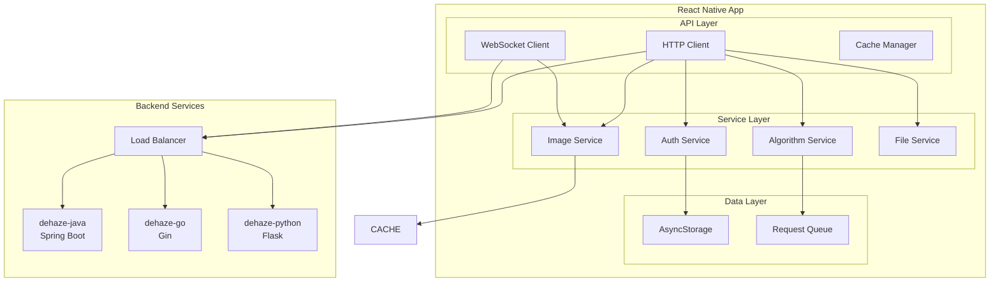

# API接口集成设计

**文档版本**: v1.0
**最后更新**: 2025-11-22
**项目名称**: dehaze-react-native
**目标平台**: iOS、Android

---

## 📋 文档概述

本文档详细描述了Dehaze React Native应用与后端服务的API接口集成方案，包括API设计原则、接口规范、数据模型、错误处理和移动端优化策略。本文档基于对后端服务（dehaze-java、dehaze-go、dehaze-python）的深入分析，专注于移动端特性和用户体验优化。

---

## 🎯 API设计原则

### 移动端优先原则

#### 1. 性能优化
- **请求合并**: 合并多个小请求，减少网络开销
- **数据压缩**: 启用gzip压缩，减少传输数据量
- **智能缓存**: 合理的缓存策略，减少重复请求
- **分页加载**: 大数据集采用分页加载，提升响应速度

#### 2. 用户体验
- **快速响应**: 关键接口响应时间<200ms
- **离线支持**: 基础功能支持离线使用
- **实时反馈**: WebSocket实时推送处理进度
- **错误友好**: 清晰的错误提示和恢复建议

#### 3. 网络适应性
- **弱网优化**: 适配2G/3G/4G/5G/WiFi网络环境
- **断线重连**: 网络恢复后自动重试机制
- **超时控制**: 合理的超时设置，避免用户长时间等待
- **流量节省**: 优化数据传输，节省用户流量

### RESTful设计规范

#### 1. URL设计规范
```
基础URL: https://api.dehaze.com/v1

资源命名规范:
- 使用名词复数形式: /api/v1/images, /api/v1/algorithms
- 层级关系清晰: /api/v1/users/{userId}/images
- 统一前缀: 所有接口以/api/v1开头
```

#### 2. HTTP方法规范
```
GET    - 获取资源: GET /api/v1/algorithms
POST   - 创建资源: POST /api/v1/images
PUT    - 完整更新: PUT /api/v1/users/{userId}
PATCH  - 部分更新: PATCH /api/v1/images/{imageId}
DELETE - 删除资源: DELETE /api/v1/images/{imageId}
```

#### 3. 状态码规范
```
200 OK          - 请求成功
201 Created     - 资源创建成功
204 No Content  - 删除成功
400 Bad Request - 请求参数错误
401 Unauthorized - 未认证
403 Forbidden    - 权限不足
404 Not Found    - 资源不存在
429 Too Many Requests - 请求频率限制
500 Internal Server Error - 服务器内部错误
```

---

## 🏗️ API架构设计

### API层架构



### 核心组件职责

#### API客户端 (HTTP Client)
- **请求封装**: 统一的HTTP请求方法
- **拦截器**: 自动添加认证头、处理错误
- **重试机制**: 网络错误自动重试
- **超时控制**: 连接和读取超时设置

#### WebSocket客户端
- **实时通信**: 处理进度实时推送
- **连接管理**: 自动重连、心跳检测
- **消息队列**: 离线消息缓存
- **事件处理**: 统一的消息分发机制

#### 缓存管理器
- **智能缓存**: 基于TTL和LRU的缓存策略
- **离线支持**: 缓存关键数据支持离线使用
- **缓存同步**: 网络恢复时同步缓存数据
- **存储优化**: 合理的缓存大小限制

---

## 📡 核心API接口设计

### 1. 认证相关接口

#### 用户登录
```typescript
POST /api/v1/auth/login

Request Body:
{
  "username": "string",      // 用户名或邮箱
  "password": "string",      // 密码
  "deviceInfo": {            // 设备信息
    "platform": "ios|android",
    "deviceId": "string",
    "appVersion": "string"
  }
}

Response (200):
{
  "code": 200,
  "message": "登录成功",
  "data": {
    "accessToken": "string",     // JWT访问令牌
    "refreshToken": "string",    // 刷新令牌
    "expiresIn": 86400,         // 过期时间（秒）
    "userInfo": {
      "userId": "string",
      "username": "string",
      "email": "string",
      "avatar": "string",
      "level": "basic|premium"
    }
  }
}

Error Response (401):
{
  "code": 401,
  "message": "用户名或密码错误",
  "data": null
}
```

#### 令牌刷新
```typescript
POST /api/v1/auth/refresh

Request Body:
{
  "refreshToken": "string"
}

Response (200):
{
  "code": 200,
  "message": "令牌刷新成功",
  "data": {
    "accessToken": "string",
    "expiresIn": 86400
  }
}
```

### 2. 图像管理接口

#### 图像上传
```typescript
POST /api/v1/images/upload
Content-Type: multipart/form-data

Request Body:
{
  "file": "File",             // 图像文件
  "filename": "string",       // 文件名
  "metadata": {              // 图像元数据
    "width": 1920,
    "height": 1080,
    "format": "jpeg",
    "size": 2048576
  }
}

Response (201):
{
  "code": 201,
  "message": "图像上传成功",
  "data": {
    "imageId": "string",
    "url": "string",          // 图像访问URL
    "thumbnailUrl": "string", // 缩略图URL
    "metadata": {
      "width": 1920,
      "height": 1080,
      "format": "jpeg",
      "size": 2048576
    },
    "uploadedAt": "2025-11-22T10:30:00Z"
  }
}
```

#### 图像列表获取
```typescript
GET /api/v1/images?page=1&limit=20&category=all

Query Parameters:
- page: 页码（默认1）
- limit: 每页数量（默认20，最大50）
- category: 分类筛选（all|uploaded|processed|favorite）

Response (200):
{
  "code": 200,
  "message": "获取成功",
  "data": {
    "images": [
      {
        "imageId": "string",
        "url": "string",
        "thumbnailUrl": "string",
        "filename": "string",
        "metadata": {
          "width": 1920,
          "height": 1080,
          "format": "jpeg",
          "size": 2048576
        },
        "processedCount": 5,
        "createdAt": "2025-11-22T10:30:00Z"
      }
    ],
    "pagination": {
      "page": 1,
      "limit": 20,
      "total": 100,
      "totalPages": 5
    }
  }
}
```

### 3. 算法管理接口

#### 算法列表获取
```typescript
GET /api/v1/algorithms?category=all&sort=popular

Query Parameters:
- category: 算法分类（all|traditional|deep|lightweight）
- sort: 排序方式（popular|newest|name|speed）

Response (200):
{
  "code": 200,
  "message": "获取成功",
  "data": [
    {
      "algorithmId": "string",
      "name": "RIDCP",
      "displayName": "RIDCP算法",
      "category": "deep",
      "description": "基于深度学习的图像去雾算法",
      "version": "1.0.0",
      "author": "Research Team",
      "performance": {
        "speed": "fast",           // fast|medium|slow
        "quality": "high",         // low|medium|high
        "memoryUsage": "medium"    // low|medium|high
      },
      "features": [
        "深度学习",
        "高质量输出",
        "实时处理"
      ],
      "sampleImages": [
        "https://example.com/sample1.jpg",
        "https://example.com/sample2.jpg"
      ],
      "parameters": [
        {
          "name": "strength",
          "type": "number",
          "min": 0.1,
          "max": 1.0,
          "default": 0.8,
          "description": "去雾强度"
        }
      ],
      "isRecommended": true,
      "usageCount": 1500
    }
  ]
}
```

#### 算法详情获取
```typescript
GET /api/v1/algorithms/{algorithmId}

Response (200):
{
  "code": 200,
  "message": "获取成功",
  "data": {
    "algorithmId": "string",
    "name": "RIDCP",
    "displayName": "RIDCP算法",
    "category": "deep",
    "description": "详细的算法描述...",
    "principle": "算法原理说明...",
    "paperUrl": "https://example.com/paper.pdf",
    "version": "1.0.0",
    "author": "Research Team",
    "performance": {
      "speed": "fast",
      "quality": "high",
      "memoryUsage": "medium",
      "psnr": 28.5,
      "ssim": 0.85
    },
    "parameters": [
      {
        "name": "strength",
        "type": "number",
        "min": 0.1,
        "max": 1.0,
        "default": 0.8,
        "description": "去雾强度",
        "step": 0.1
      }
    ],
    "compatibility": {
      "imageFormats": ["jpg", "png", "webp"],
      "minSize": 100,
      "maxSize": 4096,
      "aspectRatio": "free"
    }
  }
}
```

### 4. 图像处理接口

#### 开始去雾处理
```typescript
POST /api/v1/process/dehaze

Request Body:
{
  "imageId": "string",
  "algorithmId": "string",
  "parameters": {
    "strength": 0.8,
    "preserveColor": true
  },
  "options": {
    "generateThumbnail": true,
    "notifyProgress": true
  }
}

Response (202):
{
  "code": 202,
  "message": "处理任务已创建",
  "data": {
    "taskId": "string",
    "status": "pending",
    "estimatedDuration": 30,    // 预估处理时间（秒）
    "queuePosition": 3,         // 队列位置
    "createdAt": "2025-11-22T10:30:00Z"
  }
}
```

#### 处理进度查询
```typescript
GET /api/v1/process/{taskId}/progress

Response (200):
{
  "code": 200,
  "message": "获取成功",
  "data": {
    "taskId": "string",
    "status": "processing",      // pending|processing|completed|failed
    "progress": 65,              // 进度百分比
    "stage": "inference",        // 当前阶段
    "estimatedRemaining": 10,    // 剩余时间（秒）
    "currentOperation": "正在进行去雾处理...",
    "createdAt": "2025-11-22T10:30:00Z",
    "updatedAt": "2025-11-22T10:31:05Z"
  }
}
```

#### 处理结果获取
```typescript
GET /api/v1/process/{taskId}/result

Response (200):
{
  "code": 200,
  "message": "获取成功",
  "data": {
    "taskId": "string",
    "status": "completed",
    "result": {
      "outputImageUrl": "string",
      "thumbnailUrl": "string",
      "metadata": {
        "width": 1920,
        "height": 1080,
        "format": "jpeg",
        "size": 2048576
      },
      "metrics": {
        "psnr": 28.5,
        "ssim": 0.85,
        "processingTime": 25
      }
    },
    "originalImage": {
      "imageId": "string",
      "url": "string",
      "thumbnailUrl": "string"
    },
    "algorithm": {
      "algorithmId": "string",
      "name": "RIDCP",
      "parameters": {
        "strength": 0.8
      }
    },
    "createdAt": "2025-11-22T10:30:00Z",
    "completedAt": "2025-11-22T10:30:25Z"
  }
}
```

### 5. WebSocket实时通信

#### 连接建立
```typescript
// WebSocket连接URL
const wsUrl = `wss://api.dehaze.com/v1/ws?token=${accessToken}`;

// 连接建立后订阅处理进度
{
  "type": "subscribe",
  "channel": "process_progress",
  "taskId": "string"
}
```

#### 进度推送消息格式
```typescript
{
  "type": "process_progress",
  "data": {
    "taskId": "string",
    "status": "processing",
    "progress": 75,
    "stage": "post_processing",
    "estimatedRemaining": 5,
    "currentOperation": "正在后处理...",
    "timestamp": "2025-11-22T10:31:15Z"
  }
}
```

#### 处理完成通知
```typescript
{
  "type": "process_completed",
  "data": {
    "taskId": "string",
    "status": "completed",
    "resultUrl": "string",
    "metrics": {
      "psnr": 28.5,
      "ssim": 0.85
    },
    "timestamp": "2025-11-22T10:30:25Z"
  }
}
```

---

## 📱 移动端优化策略

### 1. 网络请求优化

#### 请求拦截器配置
```typescript
// 基于现有utils/request.ts的增强配置
const requestInterceptor = (config) => {
  // 自动添加认证头
  if (accessToken) {
    config.headers.Authorization = `Bearer ${accessToken}`;
  }

  // 添加设备信息
  config.headers['X-Device-Platform'] = Platform.OS;
  config.headers['X-Device-Version'] = Platform.Version.toString();
  config.headers['X-App-Version'] = appVersion;

  // 添加请求ID用于追踪
  config.headers['X-Request-ID'] = generateRequestId();

  return config;
};

const responseInterceptor = (response) => {
  // 自动刷新Token
  if (response.data.code === 40101) {
    return refreshAccessToken().then(() => {
      return request(response.config);
    });
  }

  return response;
};
```

#### 重试机制配置
```typescript
const retryConfig = {
  retries: 3,
  retryDelay: 1000,
  retryCondition: (error) => {
    // 网络错误或5xx错误时重试
    return !error.response || error.response.status >= 500;
  },
  onRetry: (retryCount) => {
    console.log(`请求重试第${retryCount}次`);
  }
};
```

### 2. 数据缓存策略

#### 缓存层级设计
```typescript
interface CacheConfig {
  // 用户信息缓存（24小时）
  userInfo: {
    ttl: 86400,
    strategy: 'memory+storage'
  },

  // 算法列表缓存（1小时）
  algorithms: {
    ttl: 3600,
    strategy: 'memory+storage'
  },

  // 图像缩略图缓存（7天）
  thumbnails: {
    ttl: 604800,
    strategy: 'disk'
  },

  // 处理结果缓存（永久）
  results: {
    ttl: -1,
    strategy: 'disk'
  }
}
```

#### 智能预加载
```typescript
// 预加载推荐算法
const preloadRecommendedAlgorithms = async (imageMetadata) => {
  const recommendations = await getRecommendedAlgorithms(imageMetadata);

  // 预加载算法详情和样例图片
  recommendations.forEach(async (algorithm) => {
    await cacheAlgorithmDetails(algorithm.algorithmId);
    await preloadSampleImages(algorithm.sampleImages);
  });
};

// 预加载样例图片
const preloadSampleImages = async (imageUrls) => {
  imageUrls.forEach(url => {
    Image.prefetch(url);
  });
};
```

### 3. 离线功能支持

#### 离线数据结构
```typescript
interface OfflineData {
  // 离线样例图片
  sampleImages: {
    [imageId: string]: {
      localUri: string;
      metadata: ImageMetadata;
      algorithms: string[]; // 推荐算法ID
    };
  },

  // 离线算法信息
  algorithms: {
    [algorithmId: string]: AlgorithmInfo;
  },

  // 处理历史
  history: ProcessHistory[];

  // 用户设置
  settings: UserSettings;
}
```

#### 离线功能管理
```typescript
const OfflineManager = {
  // 检查网络状态
  isOnline: () => NetInfo.isConnected,

  // 同步离线数据
  syncData: async () => {
    if (await OfflineManager.isOnline()) {
      await syncOfflineResults();
      await downloadNewSamples();
    }
  },

  // 获取离线样例
  getOfflineSamples: () => offlineData.sampleImages,

  // 保存离线结果
  saveOfflineResult: (result) => {
    offlineData.history.push(result);
    saveOfflineData();
  }
};
```

---

## 🔧 API客户端实现

### 1. 基础HTTP客户端

```typescript
// 基于现有utils/request.ts的扩展实现
import axios from 'axios';
import AsyncStorage from '@react-native-async-storage/async-storage';
import { Platform } from 'react-native';

class ApiClient {
  private baseURL: string;
  private timeout: number;
  private interceptors: any;

  constructor(config: ApiConfig) {
    this.baseURL = config.baseURL;
    this.timeout = config.timeout || 15000;

    this.axiosInstance = axios.create({
      baseURL: this.baseURL,
      timeout: this.timeout,
      headers: {
        'Content-Type': 'application/json',
      },
    });

    this.setupInterceptors();
  }

  private setupInterceptors() {
    // 请求拦截器
    this.axiosInstance.interceptors.request.use(
      async (config) => {
        const token = await AsyncStorage.getItem('access_token');
        if (token) {
          config.headers.Authorization = `Bearer ${token}`;
        }

        config.headers['X-Platform'] = Platform.OS;
        config.headers['X-Request-ID'] = this.generateRequestId();

        return config;
      },
      (error) => Promise.reject(error)
    );

    // 响应拦截器
    this.axiosInstance.interceptors.response.use(
      (response) => response.data,
      async (error) => {
        if (error.response?.status === 401) {
          await this.handleTokenRefresh();
          return this.axiosInstance.request(error.config);
        }
        return Promise.reject(error);
      }
    );
  }

  // GET请求
  async get<T>(url: string, params?: any): Promise<ApiResponse<T>> {
    return this.axiosInstance.get(url, { params });
  }

  // POST请求
  async post<T>(url: string, data?: any): Promise<ApiResponse<T>> {
    return this.axiosInstance.post(url, data);
  }

  // PUT请求
  async put<T>(url: string, data?: any): Promise<ApiResponse<T>> {
    return this.axiosInstance.put(url, data);
  }

  // DELETE请求
  async delete<T>(url: string): Promise<ApiResponse<T>> {
    return this.axiosInstance.delete(url);
  }

  // 文件上传
  async upload<T>(url: string, formData: FormData, onProgress?: (progress: number) => void): Promise<ApiResponse<T>> {
    return this.axiosInstance.post(url, formData, {
      headers: {
        'Content-Type': 'multipart/form-data',
      },
      onUploadProgress: (progressEvent) => {
        if (onProgress && progressEvent.total) {
          const progress = (progressEvent.loaded / progressEvent.total) * 100;
          onProgress(Math.round(progress));
        }
      },
    });
  }

  private generateRequestId(): string {
    return `req_${Date.now()}_${Math.random().toString(36).substr(2, 9)}`;
  }

  private async handleTokenRefresh(): Promise<void> {
    const refreshToken = await AsyncStorage.getItem('refresh_token');
    if (!refreshToken) {
      throw new Error('No refresh token available');
    }

    try {
      const response = await this.axiosInstance.post('/auth/refresh', {
        refreshToken,
      });

      const { accessToken } = response.data.data;
      await AsyncStorage.setItem('access_token', accessToken);
    } catch (error) {
      await AsyncStorage.multiRemove(['access_token', 'refresh_token']);
      throw new Error('Token refresh failed');
    }
  }
}
```

### 2. WebSocket管理器

```typescript
import { EventSource } from 'react-native-sse';

class WebSocketManager {
  private ws: WebSocket | null = null;
  private url: string;
  private reconnectAttempts = 0;
  private maxReconnectAttempts = 5;
  private reconnectDelay = 1000;
  private eventListeners: Map<string, Function[]> = new Map();

  constructor(url: string) {
    this.url = url;
  }

  connect(token: string): Promise<void> {
    return new Promise((resolve, reject) => {
      const wsUrl = `${this.url}?token=${token}`;

      this.ws = new WebSocket(wsUrl);

      this.ws.onopen = () => {
        console.log('WebSocket连接已建立');
        this.reconnectAttempts = 0;
        resolve();
      };

      this.ws.onmessage = (event) => {
        try {
          const message = JSON.parse(event.data);
          this.handleMessage(message);
        } catch (error) {
          console.error('WebSocket消息解析错误:', error);
        }
      };

      this.ws.onclose = () => {
        console.log('WebSocket连接已关闭');
        this.handleReconnect();
      };

      this.ws.onerror = (error) => {
        console.error('WebSocket连接错误:', error);
        reject(error);
      };
    });
  }

  subscribe(channel: string, callback: Function) {
    if (!this.eventListeners.has(channel)) {
      this.eventListeners.set(channel, []);
    }
    this.eventListeners.get(channel)?.push(callback);

    // 发送订阅消息
    this.send({
      type: 'subscribe',
      channel: channel
    });
  }

  unsubscribe(channel: string, callback: Function) {
    const listeners = this.eventListeners.get(channel);
    if (listeners) {
      const index = listeners.indexOf(callback);
      if (index > -1) {
        listeners.splice(index, 1);
      }
    }
  }

  send(data: any) {
    if (this.ws && this.ws.readyState === WebSocket.OPEN) {
      this.ws.send(JSON.stringify(data));
    }
  }

  disconnect() {
    if (this.ws) {
      this.ws.close();
      this.ws = null;
    }
    this.eventListeners.clear();
  }

  private handleMessage(message: any) {
    const listeners = this.eventListeners.get(message.type);
    if (listeners) {
      listeners.forEach(callback => callback(message.data));
    }
  }

  private handleReconnect() {
    if (this.reconnectAttempts < this.maxReconnectAttempts) {
      this.reconnectAttempts++;

      setTimeout(() => {
        console.log(`WebSocket重连第${this.reconnectAttempts}次`);
        // 重新连接逻辑
      }, this.reconnectDelay * this.reconnectAttempts);
    }
  }
}
```

---

## 📊 API服务接口定义

### 1. 认证服务接口

```typescript
interface AuthService {
  // 用户登录
  login(username: string, password: string, deviceInfo: DeviceInfo): Promise<LoginResponse>;

  // 用户注册
  register(userInfo: RegisterInfo): Promise<RegisterResponse>;

  // 令牌刷新
  refreshToken(refreshToken: string): Promise<TokenRefreshResponse>;

  // 用户登出
  logout(): Promise<void>;

  // 获取用户信息
  getUserInfo(): Promise<UserInfo>;

  // 更新用户信息
  updateUserInfo(userInfo: Partial<UserInfo>): Promise<UserInfo>;
}
```

### 2. 图像服务接口

```typescript
interface ImageService {
  // 上传图像
  uploadImage(file: File, metadata: ImageMetadata): Promise<UploadResponse>;

  // 获取图像列表
  getImages(params: ImageListParams): Promise<ImageListResponse>;

  // 获取图像详情
  getImageDetail(imageId: string): Promise<ImageDetail>;

  // 删除图像
  deleteImage(imageId: string): Promise<void>;

  // 获取推荐图像
  getRecommendedImages(category?: string): Promise<ImageListResponse>;
}
```

### 3. 算法服务接口

```typescript
interface AlgorithmService {
  // 获取算法列表
  getAlgorithms(params: AlgorithmListParams): Promise<AlgorithmListResponse>;

  // 获取算法详情
  getAlgorithmDetail(algorithmId: string): Promise<AlgorithmDetail>;

  // 获取推荐算法
  getRecommendedAlgorithms(imageMetadata: ImageMetadata): Promise<RecommendedAlgorithms>;

  // 搜索算法
  searchAlgorithms(keyword: string, filters?: AlgorithmFilters): Promise<AlgorithmListResponse>;
}
```

### 4. 处理服务接口

```typescript
interface ProcessService {
  // 开始去雾处理
  startDehazeProcess(request: DehazeProcessRequest): Promise<ProcessStartResponse>;

  // 获取处理进度
  getProcessProgress(taskId: string): Promise<ProcessProgressResponse>;

  // 获取处理结果
  getProcessResult(taskId: string): Promise<ProcessResultResponse>;

  // 取消处理任务
  cancelProcess(taskId: string): Promise<void>;

  // 暂停处理任务
  pauseProcess(taskId: string): Promise<void>;

  // 恢复处理任务
  resumeProcess(taskId: string): Promise<void>;
}
```

---

## 🚨 错误处理与监控

### 1. 错误分类体系

```typescript
enum ErrorType {
  // 网络错误
  NETWORK_ERROR = 'NETWORK_ERROR',
  TIMEOUT_ERROR = 'TIMEOUT_ERROR',
  CONNECTION_ERROR = 'CONNECTION_ERROR',

  // 认证错误
  AUTHENTICATION_ERROR = 'AUTHENTICATION_ERROR',
  AUTHORIZATION_ERROR = 'AUTHORIZATION_ERROR',
  TOKEN_EXPIRED = 'TOKEN_EXPIRED',

  // 业务错误
  VALIDATION_ERROR = 'VALIDATION_ERROR',
  RESOURCE_NOT_FOUND = 'RESOURCE_NOT_FOUND',
  PROCESSING_FAILED = 'PROCESSING_FAILED',

  // 系统错误
  SERVER_ERROR = 'SERVER_ERROR',
  SERVICE_UNAVAILABLE = 'SERVICE_UNAVAILABLE',
  RATE_LIMIT_EXCEEDED = 'RATE_LIMIT_EXCEEDED'
}

interface ApiError {
  code: string;
  message: string;
  type: ErrorType;
  details?: any;
  timestamp: string;
  requestId: string;
}
```

### 2. 错误处理策略

```typescript
class ErrorHandler {
  // 处理API错误
  static handleApiError(error: any): ApiError {
    if (error.response) {
      // 服务器响应错误
      const { status, data } = error.response;

      switch (status) {
        case 400:
          return {
            code: data.code || 'VALIDATION_ERROR',
            message: data.message || '请求参数错误',
            type: ErrorType.VALIDATION_ERROR,
            details: data.details,
            timestamp: new Date().toISOString(),
            requestId: error.config.headers['X-Request-ID']
          };

        case 401:
          return {
            code: data.code || 'AUTHENTICATION_ERROR',
            message: data.message || '认证失败',
            type: ErrorType.AUTHENTICATION_ERROR,
            timestamp: new Date().toISOString(),
            requestId: error.config.headers['X-Request-ID']
          };

        case 429:
          return {
            code: data.code || 'RATE_LIMIT_EXCEEDED',
            message: data.message || '请求频率过高',
            type: ErrorType.RATE_LIMIT_EXCEEDED,
            details: data.retryAfter,
            timestamp: new Date().toISOString(),
            requestId: error.config.headers['X-Request-ID']
          };

        case 500:
          return {
            code: data.code || 'SERVER_ERROR',
            message: data.message || '服务器内部错误',
            type: ErrorType.SERVER_ERROR,
            timestamp: new Date().toISOString(),
            requestId: error.config.headers['X-Request-ID']
          };

        default:
          return {
            code: data.code || 'UNKNOWN_ERROR',
            message: data.message || '未知错误',
            type: ErrorType.SERVER_ERROR,
            timestamp: new Date().toISOString(),
            requestId: error.config.headers['X-Request-ID']
          };
      }
    } else if (error.request) {
      // 网络错误
      return {
        code: 'NETWORK_ERROR',
        message: '网络连接失败',
        type: ErrorType.NETWORK_ERROR,
        timestamp: new Date().toISOString(),
        requestId: ''
      };
    } else {
      // 其他错误
      return {
        code: 'UNKNOWN_ERROR',
        message: error.message || '未知错误',
        type: ErrorType.SERVER_ERROR,
        timestamp: new Date().toISOString(),
        requestId: ''
      };
    }
  }

  // 错误重试判断
  static shouldRetry(error: ApiError): boolean {
    const retryableTypes = [
      ErrorType.NETWORK_ERROR,
      ErrorType.TIMEOUT_ERROR,
      ErrorType.CONNECTION_ERROR,
      ErrorType.SERVER_ERROR
    ];

    return retryableTypes.includes(error.type);
  }

  // 获取用户友好的错误消息
  static getUserFriendlyMessage(error: ApiError): string {
    switch (error.type) {
      case ErrorType.NETWORK_ERROR:
        return '网络连接失败，请检查网络设置';

      case ErrorType.TIMEOUT_ERROR:
        return '请求超时，请稍后重试';

      case ErrorType.AUTHENTICATION_ERROR:
        return '登录已过期，请重新登录';

      case ErrorType.AUTHORIZATION_ERROR:
        return '权限不足，无法访问该功能';

      case ErrorType.VALIDATION_ERROR:
        return '输入信息有误，请检查后重试';

      case ErrorType.PROCESSING_FAILED:
        return '图像处理失败，请尝试其他算法';

      case ErrorType.RATE_LIMIT_EXCEEDED:
        return '请求过于频繁，请稍后再试';

      default:
        return error.message || '操作失败，请稍后重试';
    }
  }
}
```

### 3. 监控与日志

```typescript
interface ApiMetrics {
  // 请求统计
  requestCount: number;
  successCount: number;
  errorCount: number;
  averageResponseTime: number;

  // 错误统计
  errorTypes: Record<ErrorType, number>;
  errorCodes: Record<string, number>;

  // 性能统计
  slowRequests: Array<{
    url: string;
    method: string;
    duration: number;
    timestamp: string;
  }>;
}

class ApiMonitor {
  private metrics: ApiMetrics = {
    requestCount: 0,
    successCount: 0,
    errorCount: 0,
    averageResponseTime: 0,
    errorTypes: {} as Record<ErrorType, number>,
    errorCodes: {},
    slowRequests: []
  };

  // 记录请求
  recordRequest(url: string, method: string, duration: number, success: boolean, error?: ApiError) {
    this.metrics.requestCount++;

    if (success) {
      this.metrics.successCount++;
    } else {
      this.metrics.errorCount++;

      if (error) {
        this.metrics.errorTypes[error.type] = (this.metrics.errorTypes[error.type] || 0) + 1;
        this.metrics.errorCodes[error.code] = (this.metrics.errorCodes[error.code] || 0) + 1;
      }
    }

    // 更新平均响应时间
    this.metrics.averageResponseTime =
      (this.metrics.averageResponseTime * (this.metrics.requestCount - 1) + duration) / this.metrics.requestCount;

    // 记录慢请求
    if (duration > 5000) {
      this.metrics.slowRequests.push({
        url,
        method,
        duration,
        timestamp: new Date().toISOString()
      });
    }
  }

  // 获取监控报告
  getMetricsReport(): ApiMetrics {
    return { ...this.metrics };
  }

  // 重置监控数据
  resetMetrics() {
    this.metrics = {
      requestCount: 0,
      successCount: 0,
      errorCount: 0,
      averageResponseTime: 0,
      errorTypes: {} as Record<ErrorType, number>,
      errorCodes: {},
      slowRequests: []
    };
  }
}
```

---

## 📈 性能优化建议

### 1. 请求优化

- **请求合并**: 将多个小请求合并为一个批量请求
- **数据压缩**: 启用gzip压缩，减少传输数据量
- **缓存策略**: 合理设置缓存时间，避免重复请求
- **连接复用**: 使用HTTP/2，复用TCP连接

### 2. 数据传输优化

- **分页加载**: 大数据集采用分页加载
- **字段筛选**: 只请求必要的数据字段
- **图片优化**: 使用WebP格式，提供多种尺寸
- **CDN加速**: 静态资源使用CDN分发

### 3. 用户体验优化

- **预加载策略**: 智能预加载可能需要的数据
- **离线支持**: 关键功能支持离线使用
- **进度反馈**: 长时间操作提供详细进度
- **错误恢复**: 提供自动重试和手动恢复机制

---

## 📚 相关文档

### 架构文档系列
- [01-架构概述](01-overview.md)：详细的架构设计说明
- [02-技术架构](02-technical-architecture.md)：技术栈和架构模式
- [03-组件设计](03-component-design.md)：组件设计规范
- [05-状态管理](05-state-management.md)：状态管理架构

### 设计文档系列
- [06-导航设计](06-navigation-design.md)：导航系统设计
- [07-响应式设计](07-responsive-design.md)：多设备适配方案
- [08-性能优化](08-performance-optimization.md)：性能优化策略

### 开发文档系列
- [09-测试策略](09-testing-strategy.md)：测试策略和工具
- [10-部署指南](10-deployment-guide.md)：应用打包和发布

### 后端文档系列
- [后端API分析](../../docs/backend-api-analysis.md)：后端接口详细分析
- [dehaze-java接口文档](../../dehaze-java)：Java后端接口文档
- [dehaze-python接口文档](../../dehaze-python)：Python算法服务文档

---

**文档版本**: v1.0
**最后更新**: 2025-11-22
**下次更新**: 根据后端接口开发进度和实际测试结果持续更新