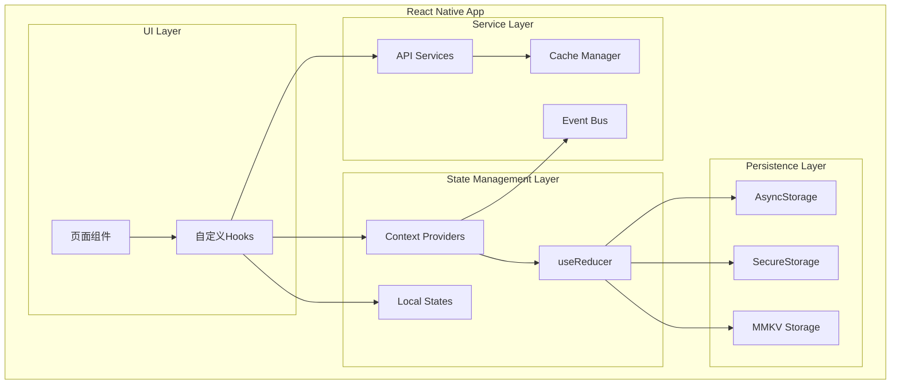
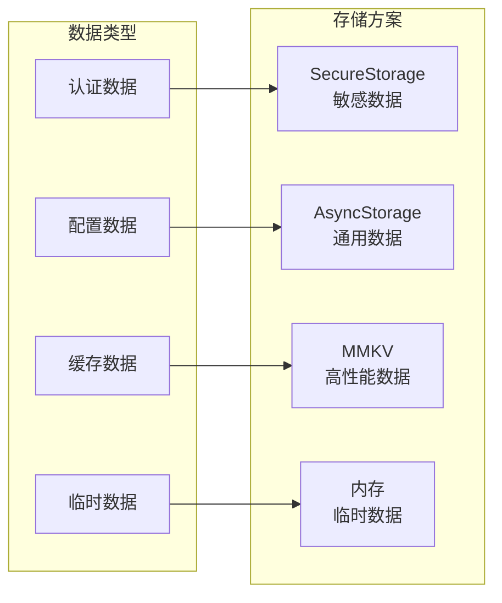
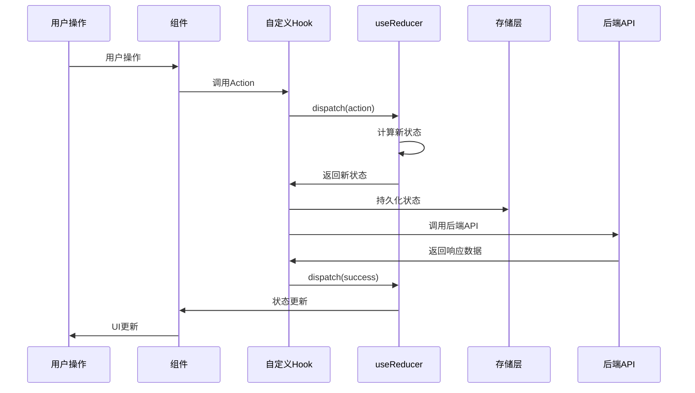

# 状态管理架构

**文档版本**: v1.0
**最后更新**: 2025-11-22
**项目名称**: dehaze-react-native
**目标平台**: iOS、Android

---

## 📋 文档概述

本文档详细描述了Dehaze React Native应用的状态管理架构，包括状态管理方案选择、数据流设计、状态模块划分、持久化策略和性能优化。基于现有的分层架构模式，采用React Hooks + Context API的轻量级状态管理方案，专注于移动端特性和用户体验。

---

## 🎯 状态管理设计原则

### 移动端优先原则

#### 1. 轻量级架构
- **最小依赖**: 避免引入重型状态管理库，减少包体积
- **原生支持**: 充分利用React Hooks和Context API
- **性能优化**: 合理的组件更新策略，避免不必要的重渲染
- **内存友好**: 及时清理状态，避免内存泄漏

#### 2. 用户体验优先
- **即时响应**: 用户操作立即反映在界面上
- **离线支持**: 关键状态本地持久化
- **状态恢复**: 应用重启后恢复用户会话
- **错误处理**: 状态异常时的优雅降级

#### 3. 开发效率
- **类型安全**: 完整的TypeScript类型支持
- **易于调试**: 清晰的状态变化日志
- **模块化**: 功能模块状态独立管理
- **可测试性**: 状态逻辑单元测试友好

### 状态管理方案选择

#### React Hooks + Context API 优势

基于现有项目架构分析，选择React Hooks + Context API作为主要状态管理方案：

**技术优势**：
- **原生支持**: React 18内置功能，无额外依赖
- **性能优化**: useReducer和useMemo减少不必要的更新
- **类型安全**: 完整的TypeScript类型推导
- **学习成本低**: React开发者熟悉的概念

**移动端适配**：
- **包体积小**: 不增加额外依赖，适合移动端
- **启动速度快**: 无需初始化复杂的状态管理库
- **内存占用低**: 按需创建和使用状态
- **调试友好**: React DevTools原生支持

---

## 🏗️ 状态管理架构设计

### 整体架构图



### 状态层级划分

#### 1. 全局状态 (Global State)
- **用户认证**: 登录状态、用户信息、权限管理
- **应用配置**: 主题设置、语言偏好、功能开关
- **网络状态**: 连接状态、API配置、错误状态

#### 2. 页面状态 (Page State)
- **路由状态**: 当前页面、导航历史、页面参数
- **页面数据**: 页面特定的业务数据
- **UI状态**: 加载状态、表单状态、交互状态

#### 3. 组件状态 (Component State)
- **UI状态**: 组件内部的状态变量
- **临时状态**: 用户交互产生的临时数据
- **计算状态**: 基于props和state计算得出的状态

---

## 📦 状态模块设计

### 1. 认证状态模块

```typescript
// 认证状态类型定义
interface AuthState {
  // 用户状态
  isAuthenticated: boolean;
  isLoading: boolean;
  user: UserInfo | null;

  // 令牌管理
  accessToken: string | null;
  refreshToken: string | null;
  tokenExpiresAt: number | null;

  // 设备信息
  deviceId: string | null;
  deviceInfo: DeviceInfo | null;

  // 错误状态
  error: string | null;
  lastLoginAttempt: number | null;
}

interface AuthActions {
  // 认证操作
  login: (username: string, password: string) => Promise<void>;
  logout: () => Promise<void>;
  refreshToken: () => Promise<void>;

  // 用户操作
  updateUserInfo: (userInfo: Partial<UserInfo>) => Promise<void>;
  changePassword: (oldPassword: string, newPassword: string) => Promise<void>;

  // 状态操作
  clearError: () => void;
  setLoading: (loading: boolean) => void;
}

// 认证Context
const AuthContext = createContext<{
  state: AuthState;
  actions: AuthActions;
} | null>(null);

// 认证Provider
export const AuthProvider: React.FC<{ children: React.ReactNode }> = ({ children }) => {
  const [state, dispatch] = useReducer(authReducer, initialAuthState);

  // 登录Action
  const login = useCallback(async (username: string, password: string) => {
    dispatch({ type: 'AUTH_START' });

    try {
      const deviceInfo = await getDeviceInfo();
      const response = await authService.login(username, password, deviceInfo);

      // 保存令牌
      await AsyncStorage.setItem('access_token', response.data.accessToken);
      await AsyncStorage.setItem('refresh_token', response.data.refreshToken);

      dispatch({
        type: 'AUTH_SUCCESS',
        payload: {
          user: response.data.userInfo,
          accessToken: response.data.accessToken,
          refreshToken: response.data.refreshToken,
          tokenExpiresAt: Date.now() + response.data.expiresIn * 1000
        }
      });
    } catch (error) {
      const errorMessage = ErrorHandler.handleApiError(error);
      dispatch({
        type: 'AUTH_ERROR',
        payload: { error: errorMessage.message }
      });
      throw error;
    }
  }, []);

  // 登出Action
  const logout = useCallback(async () => {
    try {
      await authService.logout();
    } catch (error) {
      console.error('Logout API call failed:', error);
    } finally {
      // 清理本地存储
      await AsyncStorage.multiRemove(['access_token', 'refresh_token', 'user_info']);

      dispatch({ type: 'AUTH_LOGOUT' });
    }
  }, []);

  // 刷新令牌Action
  const refreshToken = useCallback(async () => {
    const { refreshToken: token } = state;
    if (!token) {
      throw new Error('No refresh token available');
    }

    try {
      const response = await authService.refreshToken(token);

      await AsyncStorage.setItem('access_token', response.data.accessToken);

      dispatch({
        type: 'TOKEN_REFRESHED',
        payload: {
          accessToken: response.data.accessToken,
          tokenExpiresAt: Date.now() + response.data.expiresIn * 1000
        }
      });
    } catch (error) {
      // 刷新失败，执行登出
      await logout();
      throw error;
    }
  }, [state.refreshToken, logout]);

  const actions: AuthActions = {
    login,
    logout,
    refreshToken,
    updateUserInfo: async (userInfo) => {
      // 实现用户信息更新
    },
    changePassword: async (oldPassword, newPassword) => {
      // 实现密码修改
    },
    clearError: () => dispatch({ type: 'CLEAR_ERROR' }),
    setLoading: (loading) => dispatch({ type: 'SET_LOADING', payload: { loading } })
  };

  return (
    <AuthContext.Provider value={{ state, actions }}>
      {children}
    </AuthContext.Provider>
  );
};

// 认证Hook
export const useAuth = () => {
  const context = useContext(AuthContext);
  if (!context) {
    throw new Error('useAuth must be used within an AuthProvider');
  }
  return context;
};
```

### 2. 图像管理状态模块

```typescript
// 图像状态类型定义
interface ImageState {
  // 图像列表
  images: ImageInfo[];
  isLoading: boolean;
  error: string | null;

  // 分页信息
  pagination: {
    page: number;
    limit: number;
    total: number;
    totalPages: number;
    hasMore: boolean;
  };

  // 当前选中的图像
  selectedImage: ImageInfo | null;

  // 上传状态
  uploadProgress: number;
  isUploading: boolean;
}

interface ImageActions {
  // 图像操作
  loadImages: (params?: ImageListParams) => Promise<void>;
  loadMoreImages: () => Promise<void>;
  refreshImages: () => Promise<void>;

  // 图像上传
  uploadImage: (file: ImageAsset, metadata?: ImageMetadata) => Promise<void>;

  // 图像管理
  deleteImage: (imageId: string) => Promise<void>;
  selectImage: (image: ImageInfo | null) => void;

  // 状态操作
  clearError: () => void;
  setUploadProgress: (progress: number) => void;
}

// 图像Reducer
const imageReducer = (state: ImageState, action: ImageAction): ImageState => {
  switch (action.type) {
    case 'LOAD_IMAGES_START':
      return {
        ...state,
        isLoading: true,
        error: null
      };

    case 'LOAD_IMAGES_SUCCESS':
      return {
        ...state,
        isLoading: false,
        images: action.payload.images,
        pagination: action.payload.pagination,
        error: null
      };

    case 'LOAD_MORE_IMAGES_SUCCESS':
      return {
        ...state,
        isLoading: false,
        images: [...state.images, ...action.payload.images],
        pagination: action.payload.pagination,
        error: null
      };

    case 'LOAD_IMAGES_ERROR':
      return {
        ...state,
        isLoading: false,
        error: action.payload.error
      };

    case 'UPLOAD_START':
      return {
        ...state,
        isUploading: true,
        uploadProgress: 0,
        error: null
      };

    case 'UPLOAD_PROGRESS':
      return {
        ...state,
        uploadProgress: action.payload.progress
      };

    case 'UPLOAD_SUCCESS':
      return {
        ...state,
        isUploading: false,
        uploadProgress: 100,
        images: [action.payload.image, ...state.images],
        error: null
      };

    case 'DELETE_IMAGE_SUCCESS':
      return {
        ...state,
        images: state.images.filter(img => img.imageId !== action.payload.imageId)
      };

    case 'SELECT_IMAGE':
      return {
        ...state,
        selectedImage: action.payload.image
      };

    default:
      return state;
  }
};

// 图像管理Hook
export const useImages = () => {
  const [state, dispatch] = useReducer(imageReducer, initialImageState);
  const { state: authState } = useAuth();

  // 加载图像列表
  const loadImages = useCallback(async (params: ImageListParams = {}) => {
    if (!authState.isAuthenticated) {
      throw new Error('User not authenticated');
    }

    dispatch({ type: 'LOAD_IMAGES_START' });

    try {
      const response = await imageService.getImages({
        page: 1,
        limit: 20,
        ...params
      });

      dispatch({
        type: 'LOAD_IMAGES_SUCCESS',
        payload: {
          images: response.data.images,
          pagination: response.data.pagination
        }
      });
    } catch (error) {
      const errorMessage = ErrorHandler.handleApiError(error);
      dispatch({
        type: 'LOAD_IMAGES_ERROR',
        payload: { error: errorMessage.message }
      });
      throw error;
    }
  }, [authState.isAuthenticated]);

  // 加载更多图像
  const loadMoreImages = useCallback(async () => {
    if (state.isLoading || !state.pagination.hasMore) {
      return;
    }

    try {
      const response = await imageService.getImages({
        page: state.pagination.page + 1,
        limit: 20
      });

      dispatch({
        type: 'LOAD_MORE_IMAGES_SUCCESS',
        payload: {
          images: response.data.images,
          pagination: response.data.pagination
        }
      });
    } catch (error) {
      const errorMessage = ErrorHandler.handleApiError(error);
      dispatch({
        type: 'LOAD_IMAGES_ERROR',
        payload: { error: errorMessage.message }
      });
    }
  }, [state.isLoading, state.pagination.hasMore, state.pagination.page]);

  // 上传图像
  const uploadImage = useCallback(async (file: ImageAsset, metadata?: ImageMetadata) => {
    dispatch({ type: 'UPLOAD_START' });

    try {
      // 获取文件信息
      const fileInfo = await getImageFileInfo(file);

      // 创建FormData
      const formData = new FormData();
      formData.append('file', {
        uri: file.uri,
        type: fileInfo.type,
        name: fileInfo.name
      } as any);

      if (metadata) {
        formData.append('metadata', JSON.stringify(metadata));
      }

      // 上传文件
      const response = await imageService.uploadImage(formData, (progress) => {
        dispatch({
          type: 'UPLOAD_PROGRESS',
          payload: { progress }
        });
      });

      dispatch({
        type: 'UPLOAD_SUCCESS',
        payload: { image: response.data }
      });

      return response.data;
    } catch (error) {
      const errorMessage = ErrorHandler.handleApiError(error);
      dispatch({
        type: 'UPLOAD_ERROR',
        payload: { error: errorMessage.message }
      });
      throw error;
    }
  }, []);

  const actions: ImageActions = {
    loadImages,
    loadMoreImages,
    refreshImages: () => loadImages(),
    uploadImage,
    deleteImage: async (imageId) => {
      await imageService.deleteImage(imageId);
      dispatch({
        type: 'DELETE_IMAGE_SUCCESS',
        payload: { imageId }
      });
    },
    selectImage: (image) => {
      dispatch({
        type: 'SELECT_IMAGE',
        payload: { image }
      });
    },
    clearError: () => dispatch({ type: 'CLEAR_ERROR' }),
    setUploadProgress: (progress) => {
      dispatch({
        type: 'UPLOAD_PROGRESS',
        payload: { progress }
      });
    }
  };

  return {
    state,
    actions
  };
};
```

### 3. 算法选择状态模块

```typescript
// 算法状态类型定义
interface AlgorithmState {
  // 算法列表
  algorithms: AlgorithmInfo[];
  recommendedAlgorithms: AlgorithmInfo[];
  categories: AlgorithmCategory[];

  // 加载状态
  isLoading: boolean;
  isLoadingRecommendations: boolean;
  error: string | null;

  // 当前选中的算法
  selectedAlgorithm: AlgorithmInfo | null;

  // 搜索状态
  searchKeyword: string;
  searchResults: AlgorithmInfo[];
  isSearching: boolean;

  // 筛选状态
  selectedCategory: string | null;
  sortBy: 'popular' | 'newest' | 'name' | 'speed';
}

interface AlgorithmActions {
  // 算法加载
  loadAlgorithms: (params?: AlgorithmListParams) => Promise<void>;
  loadRecommendedAlgorithms: (imageMetadata: ImageMetadata) => Promise<void>;

  // 算法操作
  selectAlgorithm: (algorithm: AlgorithmInfo | null) => void;
  getAlgorithmDetail: (algorithmId: string) => Promise<AlgorithmInfo>;

  // 搜索和筛选
  searchAlgorithms: (keyword: string) => Promise<void>;
  setCategory: (category: string | null) => void;
  setSortBy: (sortBy: string) => void;

  // 状态操作
  clearError: () => void;
  clearSearch: () => void;
}

// 算法管理Hook
export const useAlgorithms = () => {
  const [state, dispatch] = useReducer(algorithmReducer, initialAlgorithmState);
  const { state: authState } = useAuth();

  // 加载算法列表
  const loadAlgorithms = useCallback(async (params: AlgorithmListParams = {}) => {
    dispatch({ type: 'LOAD_ALGORITHMS_START' });

    try {
      const response = await algorithmService.getAlgorithms({
        category: 'all',
        sort: 'popular',
        ...params
      });

      dispatch({
        type: 'LOAD_ALGORITHMS_SUCCESS',
        payload: {
          algorithms: response.data,
          categories: extractCategories(response.data)
        }
      });
    } catch (error) {
      const errorMessage = ErrorHandler.handleApiError(error);
      dispatch({
        type: 'LOAD_ALGORITHMS_ERROR',
        payload: { error: errorMessage.message }
      });
    }
  }, []);

  // 加载推荐算法
  const loadRecommendedAlgorithms = useCallback(async (imageMetadata: ImageMetadata) => {
    dispatch({ type: 'LOAD_RECOMMENDATIONS_START' });

    try {
      const response = await algorithmService.getRecommendedAlgorithms(imageMetadata);

      dispatch({
        type: 'LOAD_RECOMMENDATIONS_SUCCESS',
        payload: {
          algorithms: response.data.algorithms
        }
      });
    } catch (error) {
      const errorMessage = ErrorHandler.handleApiError(error);
      dispatch({
        type: 'LOAD_RECOMMENDATIONS_ERROR',
        payload: { error: errorMessage.message }
      });
    }
  }, []);

  // 搜索算法
  const searchAlgorithms = useCallback(async (keyword: string) => {
    if (keyword.trim() === '') {
      dispatch({
        type: 'SEARCH_SUCCESS',
        payload: { results: [] }
      });
      return;
    }

    dispatch({ type: 'SEARCH_START' });

    try {
      const response = await algorithmService.searchAlgorithms(keyword);

      dispatch({
        type: 'SEARCH_SUCCESS',
        payload: {
          results: response.data,
          keyword
        }
      });
    } catch (error) {
      const errorMessage = ErrorHandler.handleApiError(error);
      dispatch({
        type: 'SEARCH_ERROR',
        payload: { error: errorMessage.message }
      });
    }
  }, []);

  const actions: AlgorithmActions = {
    loadAlgorithms,
    loadRecommendedAlgorithms,
    selectAlgorithm: (algorithm) => {
      dispatch({
        type: 'SELECT_ALGORITHM',
        payload: { algorithm }
      });
    },
    getAlgorithmDetail: async (algorithmId) => {
      const response = await algorithmService.getAlgorithmDetail(algorithmId);
      return response.data;
    },
    searchAlgorithms,
    setCategory: (category) => {
      dispatch({
        type: 'SET_CATEGORY',
        payload: { category }
      });
    },
    setSortBy: (sortBy) => {
      dispatch({
        type: 'SET_SORT_BY',
        payload: { sortBy }
      });
    },
    clearError: () => dispatch({ type: 'CLEAR_ERROR' }),
    clearSearch: () => {
      dispatch({
        type: 'CLEAR_SEARCH'
      });
    }
  };

  return {
    state,
    actions
  };
};
```

### 4. 处理任务状态模块

```typescript
// 处理任务状态类型定义
interface ProcessingState {
  // 当前任务
  currentTask: ProcessingTask | null;
  taskHistory: ProcessingTask[];

  // 处理状态
  isProcessing: boolean;
  isPaused: boolean;
  progress: number;
  currentStage: string;
  estimatedRemaining: number | null;

  // 实时更新
  lastUpdate: number | null;

  // 错误状态
  error: string | null;
}

interface ProcessingActions {
  // 任务控制
  startProcessing: (request: DehazeProcessRequest) => Promise<string>;
  pauseProcessing: (taskId: string) => Promise<void>;
  resumeProcessing: (taskId: string) => Promise<void>;
  cancelProcessing: (taskId: string) => Promise<void>;

  // 任务查询
  getTaskProgress: (taskId: string) => Promise<void>;
  getTaskResult: (taskId: string) => Promise<ProcessingResult>;

  // 状态操作
  clearCurrentTask: () => void;
  clearError: () => void;
  updateProgress: (progress: number, stage: string, remaining: number | null) => void;
}

// 处理任务管理Hook
export const useProcessing = () => {
  const [state, dispatch] = useReducer(processingReducer, initialProcessingState);
  const { state: authState } = useAuth();
  const webSocketManager = useWebSocket();

  // 开始处理任务
  const startProcessing = useCallback(async (request: DehazeProcessRequest) => {
    if (!authState.isAuthenticated) {
      throw new Error('User not authenticated');
    }

    try {
      dispatch({ type: 'PROCESSING_START' });

      const response = await processService.startDehazeProcess(request);
      const taskId = response.data.taskId;

      // 订阅WebSocket进度更新
      webSocketManager.subscribe('process_progress', (data) => {
        if (data.taskId === taskId) {
          dispatch({
            type: 'PROGRESS_UPDATE',
            payload: {
              progress: data.progress,
              stage: data.stage,
              estimatedRemaining: data.estimatedRemaining,
              timestamp: data.timestamp
            }
          });
        }
      });

      // 订阅完成通知
      webSocketManager.subscribe('process_completed', (data) => {
        if (data.taskId === taskId) {
          dispatch({
            type: 'PROCESSING_COMPLETED',
            payload: {
              result: data,
              timestamp: data.timestamp
            }
          });

          // 取消订阅
          webSocketManager.unsubscribe('process_progress');
          webSocketManager.unsubscribe('process_completed');
        }
      });

      dispatch({
        type: 'TASK_CREATED',
        payload: {
          task: {
            taskId,
            status: 'pending',
            createdAt: new Date().toISOString(),
            request
          }
        }
      });

      return taskId;
    } catch (error) {
      const errorMessage = ErrorHandler.handleApiError(error);
      dispatch({
        type: 'PROCESSING_ERROR',
        payload: { error: errorMessage.message }
      });
      throw error;
    }
  }, [authState.isAuthenticated, webSocketManager]);

  // 暂停处理
  const pauseProcessing = useCallback(async (taskId: string) => {
    try {
      await processService.pauseProcess(taskId);
      dispatch({
        type: 'PROCESSING_PAUSED'
      });
    } catch (error) {
      const errorMessage = ErrorHandler.handleApiError(error);
      dispatch({
        type: 'PROCESSING_ERROR',
        payload: { error: errorMessage.message }
      });
      throw error;
    }
  }, []);

  // 恢复处理
  const resumeProcessing = useCallback(async (taskId: string) => {
    try {
      await processService.resumeProcess(taskId);
      dispatch({
        type: 'PROCESSING_RESUMED'
      });
    } catch (error) {
      const errorMessage = ErrorHandler.handleApiError(error);
      dispatch({
        type: 'PROCESSING_ERROR',
        payload: { error: errorMessage.message }
      });
      throw error;
    }
  }, []);

  // 取消处理
  const cancelProcessing = useCallback(async (taskId: string) => {
    try {
      await processService.cancelProcess(taskId);

      // 取消WebSocket订阅
      webSocketManager.unsubscribe('process_progress');
      webSocketManager.unsubscribe('process_completed');

      dispatch({
        type: 'PROCESSING_CANCELLED'
      });
    } catch (error) {
      const errorMessage = ErrorHandler.handleApiError(error);
      dispatch({
        type: 'PROCESSING_ERROR',
        payload: { error: errorMessage.message }
      });
      throw error;
    }
  }, [webSocketManager]);

  const actions: ProcessingActions = {
    startProcessing,
    pauseProcessing,
    resumeProcessing,
    cancelProcessing,
    getTaskProgress: async (taskId) => {
      const response = await processService.getProcessProgress(taskId);
      // 更新状态逻辑
    },
    getTaskResult: async (taskId) => {
      const response = await processService.getProcessResult(taskId);
      return response.data;
    },
    clearCurrentTask: () => {
      dispatch({ type: 'CLEAR_CURRENT_TASK' });
    },
    clearError: () => {
      dispatch({ type: 'CLEAR_ERROR' });
    },
    updateProgress: (progress, stage, remaining) => {
      dispatch({
        type: 'PROGRESS_UPDATE',
        payload: {
          progress,
          stage,
          estimatedRemaining: remaining,
          timestamp: Date.now()
        }
      });
    }
  };

  return {
    state,
    actions
  };
};
```

---

## 💾 状态持久化策略

### 持久化方案选择



### 1. 敏感数据存储 (SecureStorage)

```typescript
import SecureStorage from 'react-native-secure-storage';

class SecureStorageManager {
  private static instance: SecureStorageManager;

  static getInstance(): SecureStorageManager {
    if (!SecureStorageManager.instance) {
      SecureStorageManager.instance = new SecureStorageManager();
    }
    return SecureStorageManager.instance;
  }

  // 令牌存储
  async saveTokens(tokens: { accessToken: string; refreshToken: string }) {
    await Promise.all([
      SecureStorage.setItem('access_token', tokens.accessToken),
      SecureStorage.setItem('refresh_token', tokens.refreshToken)
    ]);
  }

  async getTokens(): Promise<{ accessToken?: string; refreshToken?: string }> {
    const [accessToken, refreshToken] = await Promise.all([
      SecureStorage.getItem('access_token'),
      SecureStorage.getItem('refresh_token')
    ]);

    return {
      accessToken: accessToken || undefined,
      refreshToken: refreshToken || undefined
    };
  }

  async clearTokens(): Promise<void> {
    await Promise.all([
      SecureStorage.removeItem('access_token'),
      SecureStorage.removeItem('refresh_token')
    ]);
  }

  // 用户密码存储（可选，用于自动登录）
  async saveUserCredentials(username: string, password: string) {
    await SecureStorage.setItem('user_credentials', JSON.stringify({
      username,
      password: btoa(password) // 简单编码，实际应使用更安全的方式
    }));
  }

  async getUserCredentials(): Promise<{ username?: string; password?: string } | null> {
    const credentials = await SecureStorage.getItem('user_credentials');
    if (credentials) {
      try {
        const parsed = JSON.parse(credentials);
        return {
          username: parsed.username,
          password: atob(parsed.password)
        };
      } catch (error) {
        console.error('Failed to parse user credentials:', error);
      }
    }
    return null;
  }
}
```

### 2. 高性能存储 (MMKV)

```typescript
import { MMKV } from 'react-native-mmkv';

class MMKVStorageManager {
  private mmkv: MMKV;

  constructor() {
    this.mmkv = new MMKV({
      id: 'dehaze-app-storage',
      encryptionKey: 'dehaze-secret-key'
    });
  }

  // 图像缓存
  saveImageCache(imageId: string, imageData: any) {
    this.mmkv.set(`image_${imageId}`, JSON.stringify(imageData));
  }

  getImageCache(imageId: string): any | null {
    const data = this.mmkv.getString(`image_${imageId}`);
    return data ? JSON.parse(data) : null;
  }

  // 算法缓存
  saveAlgorithmCache(algorithms: AlgorithmInfo[]) {
    this.mmkv.set('algorithm_cache', JSON.stringify({
      data: algorithms,
      timestamp: Date.now(),
      ttl: 3600000 // 1小时
    }));
  }

  getAlgorithmCache(): AlgorithmInfo[] | null {
    const cache = this.mmkv.getString('algorithm_cache');
    if (cache) {
      try {
        const parsed = JSON.parse(cache);
        if (Date.now() - parsed.timestamp < parsed.ttl) {
          return parsed.data;
        }
      } catch (error) {
        console.error('Failed to parse algorithm cache:', error);
      }
    }
    return null;
  }

  // 用户设置
  saveUserSettings(settings: UserSettings) {
    this.mmkv.set('user_settings', JSON.stringify(settings));
  }

  getUserSettings(): UserSettings | null {
    const settings = this.mmkv.getString('user_settings');
    return settings ? JSON.parse(settings) : null;
  }

  // 处理历史
  addToProcessHistory(task: ProcessingTask) {
    const history = this.getProcessHistory() || [];
    history.unshift(task);

    // 只保留最近100条记录
    const limitedHistory = history.slice(0, 100);
    this.mmkv.set('process_history', JSON.stringify(limitedHistory));
  }

  getProcessHistory(): ProcessingTask[] | null {
    const history = this.mmkv.getString('process_history');
    return history ? JSON.parse(history) : null;
  }

  clearProcessHistory() {
    this.mmkv.delete('process_history');
  }
}
```

### 3. 通用存储 (AsyncStorage)

```typescript
import AsyncStorage from '@react-native-async-storage/async-storage';

class AsyncStorageManager {
  private static instance: AsyncStorageManager;

  static getInstance(): AsyncStorageManager {
    if (!AsyncStorageManager.instance) {
      AsyncStorageManager.instance = new AsyncStorageManager();
    }
    return AsyncStorageManager.instance;
  }

  // 应用配置
  async saveAppConfig(config: AppConfig) {
    await AsyncStorage.setItem('app_config', JSON.stringify(config));
  }

  async getAppConfig(): Promise<AppConfig | null> {
    const config = await AsyncStorage.getItem('app_config');
    return config ? JSON.parse(config) : null;
  }

  // 用户偏好设置
  async saveUserPreferences(preferences: UserPreferences) {
    await AsyncStorage.setItem('user_preferences', JSON.stringify(preferences));
  }

  async getUserPreferences(): Promise<UserPreferences | null> {
    const preferences = await AsyncStorage.getItem('user_preferences');
    return preferences ? JSON.parse(preferences) : null;
  }

  // 主题设置
  async saveTheme(theme: ThemeConfig) {
    await AsyncStorage.setItem('theme_config', JSON.stringify(theme));
  }

  async getTheme(): Promise<ThemeConfig | null> {
    const theme = await AsyncStorage.getItem('theme_config');
    return theme ? JSON.parse(theme) : null;
  }

  // 离线数据管理
  async saveOfflineData(data: OfflineData) {
    await AsyncStorage.setItem('offline_data', JSON.stringify(data));
  }

  async getOfflineData(): Promise<OfflineData | null> {
    const data = await AsyncStorage.getItem('offline_data');
    return data ? JSON.parse(data) : null;
  }

  // 清理过期数据
  async cleanupExpiredData() {
    try {
      const keys = await AsyncStorage.getAllKeys();
      const expiredKeys = [];

      for (const key of keys) {
        if (key.endsWith('_cache')) {
          const value = await AsyncStorage.getItem(key);
          if (value) {
            try {
              const parsed = JSON.parse(value);
              if (parsed.timestamp && parsed.ttl) {
                if (Date.now() - parsed.timestamp > parsed.ttl) {
                  expiredKeys.push(key);
                }
              }
            } catch (error) {
              // 解析失败，删除该键
              expiredKeys.push(key);
            }
          }
        }
      }

      if (expiredKeys.length > 0) {
        await AsyncStorage.multiRemove(expiredKeys);
        console.log(`Cleaned up ${expiredKeys.length} expired items`);
      }
    } catch (error) {
      console.error('Failed to cleanup expired data:', error);
    }
  }
}
```

---

## 🔄 数据流管理

### 1. 状态更新流程



### 2. 异步状态管理

```typescript
// 异步Action创建器
class AsyncActionCreator {
  // 创建异步Action
  static createAsyncAction<T, E = any>(
    typePrefix: string,
    asyncFunction: (payload: T) => Promise<any>
  ) {
    return (payload: T) => async (dispatch: Dispatch) => {
      const startType = `${typePrefix}_START`;
      const successType = `${typePrefix}_SUCCESS`;
      const errorType = `${typePrefix}_ERROR`;

      // 开始Action
      dispatch({ type: startType, payload });

      try {
        const result = await asyncFunction(payload);

        // 成功Action
        dispatch({
          type: successType,
          payload: result.data || result
        });

        return result;
      } catch (error) {
        // 错误Action
        const errorMessage = ErrorHandler.handleApiError(error);
        dispatch({
          type: errorType,
          payload: {
            error: errorMessage.message,
            details: error
          }
        });

        throw error;
      }
    };
  }
}

// 使用示例
const loginAsync = AsyncActionCreator.createAsyncAction(
  'LOGIN',
  async (credentials: LoginCredentials) => {
    return await authService.login(credentials.username, credentials.password);
  }
);
```

### 3. 状态同步机制

```typescript
// 状态同步管理器
class StateSyncManager {
  private static instance: StateSyncManager;
  private syncQueue: Array<{ type: string; payload: any }> = [];
  private isOnline: boolean = true;

  static getInstance(): StateSyncManager {
    if (!StateSyncManager.instance) {
      StateSyncManager.instance = new StateSyncManager();
    }
    return StateSyncManager.instance;
  }

  // 监听网络状态
  initializeNetworkListener() {
    NetInfo.addEventListener(state => {
      this.isOnline = state.isConnected ?? false;

      if (this.isOnline) {
        this.processSyncQueue();
      }
    });
  }

  // 添加到同步队列
  addToSyncQueue(action: { type: string; payload: any }) {
    this.syncQueue.push(action);
    this.saveSyncQueue();
  }

  // 处理同步队列
  private async processSyncQueue() {
    if (this.syncQueue.length === 0) {
      return;
    }

    const actionsToProcess = [...this.syncQueue];
    this.syncQueue = [];

    for (const action of actionsToProcess) {
      try {
        await this.processAction(action);
      } catch (error) {
        console.error('Failed to sync action:', action, error);
        // 失败的动作重新加入队列
        this.syncQueue.push(action);
      }
    }

    this.saveSyncQueue();
  }

  // 处理单个动作
  private async processAction(action: { type: string; payload: any }) {
    switch (action.type) {
      case 'UPLOAD_IMAGE':
        await this.syncImageUpload(action.payload);
        break;
      case 'UPDATE_USER_SETTINGS':
        await this.syncUserSettings(action.payload);
        break;
      // 其他同步动作...
    }
  }

  // 保存同步队列
  private async saveSyncQueue() {
    await AsyncStorage.setItem('sync_queue', JSON.stringify(this.syncQueue));
  }

  // 加载同步队列
  async loadSyncQueue() {
    const queue = await AsyncStorage.getItem('sync_queue');
    if (queue) {
      this.syncQueue = JSON.parse(queue);
    }
  }
}
```

---

## 🎯 性能优化策略

### 1. 组件渲染优化

```typescript
// 使用React.memo优化组件重渲染
const ImageCard = React.memo<{
  image: ImageInfo;
  onPress: (image: ImageInfo) => void;
}>(({ image, onPress }) => {
  return (
    <TouchableOpacity onPress={() => onPress(image)}>
      <Image source={{ uri: image.thumbnailUrl }} />
      <Text>{image.filename}</Text>
    </TouchableOpacity>
  );
}, (prevProps, nextProps) => {
  // 自定义比较函数
  return (
    prevProps.image.imageId === nextProps.image.imageId &&
    prevProps.image.thumbnailUrl === nextProps.image.thumbnailUrl
  );
});

// 使用useMemo优化计算
const AlgorithmList: React.FC = () => {
  const { state } = useAlgorithms();

  const filteredAlgorithms = useMemo(() => {
    return state.algorithms.filter(algorithm => {
      if (state.selectedCategory && algorithm.category !== state.selectedCategory) {
        return false;
      }
      if (state.searchKeyword && !algorithm.name.includes(state.searchKeyword)) {
        return false;
      }
      return true;
    });
  }, [state.algorithms, state.selectedCategory, state.searchKeyword]);

  const sortedAlgorithms = useMemo(() => {
    return [...filteredAlgorithms].sort((a, b) => {
      switch (state.sortBy) {
        case 'popular':
          return b.usageCount - a.usageCount;
        case 'name':
          return a.name.localeCompare(b.name);
        case 'speed':
          return a.performance.speed.localeCompare(b.performance.speed);
        default:
          return 0;
      }
    });
  }, [filteredAlgorithms, state.sortBy]);

  return (
    <FlatList
      data={sortedAlgorithms}
      renderItem={({ item }) => <AlgorithmCard algorithm={item} />}
      keyExtractor={item => item.algorithmId}
      getItemLayout={(data, index) => ({ length: 120, offset: 120 * index, index })}
    />
  );
};
```

### 2. 状态更新优化

```typescript
// 批量状态更新
const useBatchedUpdates = () => {
  const [batchedUpdates, setBatchedUpdates] = useState<Record<string, any>>({});
  const timeoutRef = useRef<NodeJS.Timeout>();

  const batchUpdate = useCallback((key: string, value: any) => {
    setBatchedUpdates(prev => ({
      ...prev,
      [key]: value
    }));

    // 清除之前的定时器
    if (timeoutRef.current) {
      clearTimeout(timeoutRef.current);
    }

    // 设置新的定时器
    timeoutRef.current = setTimeout(() => {
      setBatchedUpdates({});
    }, 16); // 一帧的时间
  }, []);

  return { batchUpdate, batchedUpdates };
};

// 防抖Hook
const useDebouncedState = <T>(initialValue: T, delay: number = 300) => {
  const [value, setValue] = useState<T>(initialValue);
  const [debouncedValue, setDebouncedValue] = useState<T>(initialValue);

  useEffect(() => {
    const timer = setTimeout(() => {
      setDebouncedValue(value);
    }, delay);

    return () => {
      clearTimeout(timer);
    };
  }, [value, delay]);

  return [debouncedValue, setValue] as const;
};

// 使用示例
const SearchInput: React.FC = () => {
  const { actions } = useAlgorithms();
  const [searchTerm, setSearchTerm] = useDebouncedState('', 500);

  useEffect(() => {
    if (searchTerm) {
      actions.searchAlgorithms(searchTerm);
    }
  }, [searchTerm, actions]);

  return (
    <TextInput
      placeholder="搜索算法..."
      onChangeText={(text) => setSearchTerm(text)}
    />
  );
};
```

### 3. 内存管理优化

```typescript
// 内存泄漏防护Hook
const useMemoryLeakPrevention = () => {
  const mountedRef = useRef(true);

  useEffect(() => {
    return () => {
      mountedRef.current = false;
    };
  }, []);

  const safeSetState = useCallback((setter: React.Dispatch<React.SetStateAction<any>>) => {
    return (value: any) => {
      if (mountedRef.current) {
        setter(value);
      }
    };
  }, []);

  const safeAsyncOperation = useCallback(async (asyncFn: () => Promise<any>) => {
    try {
      const result = await asyncFn();
      if (mountedRef.current) {
        return result;
      }
    } catch (error) {
      if (mountedRef.current) {
        throw error;
      }
    }
  }, []);

  return { safeSetState, safeAsyncOperation };
};

// 图片缓存管理
const useImageCache = (maxCacheSize: number = 50) => {
  const cacheRef = useRef<Map<string, any>>(new Map());

  const getCachedImage = useCallback((uri: string) => {
    return cacheRef.current.get(uri);
  }, []);

  const cacheImage = useCallback((uri: string, imageData: any) => {
    // 如果缓存已满，删除最旧的项
    if (cacheRef.current.size >= maxCacheSize) {
      const firstKey = cacheRef.current.keys().next().value;
      cacheRef.current.delete(firstKey);
    }

    cacheRef.current.set(uri, imageData);
  }, [maxCacheSize]);

  const clearCache = useCallback(() => {
    cacheRef.current.clear();
  }, []);

  useEffect(() => {
    return () => {
      // 组件卸载时清理缓存
      clearCache();
    };
  }, [clearCache]);

  return { getCachedImage, cacheImage, clearCache };
};
```

---

## 🧪 状态测试策略

### 1. Reducer测试

```typescript
// 认证Reducer测试
describe('authReducer', () => {
  test('should handle AUTH_START', () => {
    const initialState = {
      isAuthenticated: false,
      isLoading: false,
      user: null,
      error: null
    };

    const action = { type: 'AUTH_START' };
    const newState = authReducer(initialState, action);

    expect(newState.isLoading).toBe(true);
    expect(newState.error).toBe(null);
  });

  test('should handle AUTH_SUCCESS', () => {
    const initialState = {
      isAuthenticated: false,
      isLoading: true,
      user: null,
      error: null
    };

    const mockUser = { userId: '123', username: 'testuser' };
    const action = {
      type: 'AUTH_SUCCESS',
      payload: {
        user: mockUser,
        accessToken: 'token123',
        refreshToken: 'refresh123'
      }
    };

    const newState = authReducer(initialState, action);

    expect(newState.isAuthenticated).toBe(true);
    expect(newState.isLoading).toBe(false);
    expect(newState.user).toEqual(mockUser);
    expect(newState.error).toBe(null);
  });

  test('should handle AUTH_ERROR', () => {
    const initialState = {
      isAuthenticated: false,
      isLoading: true,
      user: null,
      error: null
    };

    const action = {
      type: 'AUTH_ERROR',
      payload: { error: 'Invalid credentials' }
    };

    const newState = authReducer(initialState, action);

    expect(newState.isAuthenticated).toBe(false);
    expect(newState.isLoading).toBe(false);
    expect(newState.error).toBe('Invalid credentials');
  });
});
```

### 2. Hook测试

```typescript
// useAuth Hook测试
describe('useAuth', () => {
  let mockAuthService: jest.Mocked<AuthService>;
  let mockSecureStorage: jest.Mocked<SecureStorageManager>;

  beforeEach(() => {
    mockAuthService = {
      login: jest.fn(),
      logout: jest.fn(),
      refreshToken: jest.fn()
    } as any;

    mockSecureStorage = {
      saveTokens: jest.fn(),
      getTokens: jest.fn(),
      clearTokens: jest.fn()
    } as any;

    // Mock dependencies
    jest.mock('../services/authService', () => mockAuthService);
    jest.mock('../storage/secureStorage', () => mockSecureStorage);
  });

  test('should login successfully', async () => {
    const mockResponse = {
      data: {
        accessToken: 'token123',
        refreshToken: 'refresh123',
        expiresIn: 86400,
        userInfo: {
          userId: '123',
          username: 'testuser',
          email: 'test@example.com'
        }
      }
    };

    mockAuthService.login.mockResolvedValue(mockResponse);

    const { result } = renderHook(() => useAuth(), {
      wrapper: AuthProvider
    });

    await act(async () => {
      await result.current.actions.login('testuser', 'password123');
    });

    expect(mockAuthService.login).toHaveBeenCalledWith('testuser', 'password123', expect.any(Object));
    expect(result.current.state.isAuthenticated).toBe(true);
    expect(result.current.state.user).toEqual(mockResponse.data.userInfo);
    expect(mockSecureStorage.saveTokens).toHaveBeenCalledWith({
      accessToken: 'token123',
      refreshToken: 'refresh123'
    });
  });

  test('should handle login error', async () => {
    mockAuthService.login.mockRejectedValue(new Error('Invalid credentials'));

    const { result } = renderHook(() => useAuth(), {
      wrapper: AuthProvider
    });

    await act(async () => {
      try {
        await result.current.actions.login('testuser', 'wrongpassword');
      } catch (error) {
        // Expected error
      }
    });

    expect(result.current.state.isAuthenticated).toBe(false);
    expect(result.current.state.error).toBeTruthy();
  });
});
```

---

## 📊 监控与调试

### 1. 状态变化监控

```typescript
// 状态变化监控器
class StateMonitor {
  private static instance: StateMonitor;
  private subscribers: Array<(stateInfo: StateInfo) => void> = [];
  private stateHistory: StateInfo[] = [];

  static getInstance(): StateMonitor {
    if (!StateMonitor.instance) {
      StateMonitor.instance = new StateMonitor();
    }
    return StateMonitor.instance;
  }

  // 记录状态变化
  recordStateChange(module: string, action: string, prevState: any, newState: any, timestamp: number = Date.now()) {
    const stateInfo: StateInfo = {
      module,
      action,
      prevState: this.deepClone(prevState),
      newState: this.deepClone(newState),
      timestamp,
      duration: timestamp - (this.stateHistory[this.stateHistory.length - 1]?.timestamp || timestamp)
    };

    this.stateHistory.push(stateInfo);

    // 限制历史记录数量
    if (this.stateHistory.length > 1000) {
      this.stateHistory.shift();
    }

    // 通知订阅者
    this.notifySubscribers(stateInfo);
  }

  // 订阅状态变化
  subscribe(callback: (stateInfo: StateInfo) => void) {
    this.subscribers.push(callback);
    return () => {
      const index = this.subscribers.indexOf(callback);
      if (index > -1) {
        this.subscribers.splice(index, 1);
      }
    };
  }

  // 获取状态历史
  getStateHistory(): StateInfo[] {
    return [...this.stateHistory];
  }

  // 获取性能报告
  getPerformanceReport(): PerformanceReport {
    const moduleStats: Record<string, any> = {};

    this.stateHistory.forEach(stateInfo => {
      if (!moduleStats[stateInfo.module]) {
        moduleStats[stateInfo.module] = {
          updateCount: 0,
          totalDuration: 0,
          avgDuration: 0,
          actions: {}
        };
      }

      const stats = moduleStats[stateInfo.module];
      stats.updateCount++;
      stats.totalDuration += stateInfo.duration;
      stats.avgDuration = stats.totalDuration / stats.updateCount;

      if (!stats.actions[stateInfo.action]) {
        stats.actions[stateInfo.action] = {
          count: 0,
          totalDuration: 0
        };
      }

      stats.actions[stateInfo.action].count++;
      stats.actions[stateInfo.action].totalDuration += stateInfo.duration;
    });

    return {
      totalUpdates: this.stateHistory.length,
      moduleStats,
      slowUpdates: this.stateHistory.filter(info => info.duration > 100)
    };
  }

  private notifySubscribers(stateInfo: StateInfo) {
    this.subscribers.forEach(callback => {
      try {
        callback(stateInfo);
      } catch (error) {
        console.error('State monitor subscriber error:', error);
      }
    });
  }

  private deepClone(obj: any): any {
    return JSON.parse(JSON.stringify(obj));
  }
}

// 增强的useReducer Hook
const useTrackedReducer = <S, A>(reducer: (state: S, action: A) => S, initialState: S, module: string) => {
  const [state, dispatch] = useReducer(reducer, initialState);

  const trackedDispatch = useCallback((action: A) => {
    const timestamp = performance.now();
    const prevState = state;

    const result = dispatch(action);

    const newState = reducer(prevState, action);
    const duration = performance.now() - timestamp;

    StateMonitor.getInstance().recordStateChange(
      module,
      String(action.type),
      prevState,
      newState,
      timestamp
    );

    return result;
  }, [state, reducer, module]);

  return [state, trackedDispatch] as const;
};
```

### 2. 调试工具集成

```typescript
// React DevTools集成
const withDevTools = <S, A>(
  reducer: (state: S, action: A) => S,
  name: string
): ((state: S, action: A) => S) => {
  if (__DEV__ && typeof window !== 'undefined' && window.__REDUX_DEVTOOLS_EXTENSION__) {
    const devTools = window.__REDUX_DEVTOOLS_EXTENSION__.connect({
      name,
      trace: true
    });

    return (state: S, action: A) => {
      const newState = reducer(state, action);
      devTools.send(action, newState);
      return newState;
    };
  }

  return reducer;
};

// 日志记录器
class StateLogger {
  private static instance: StateLogger;

  static getInstance(): StateLogger {
    if (!StateLogger.instance) {
      StateLogger.instance = new StateLogger();
    }
    return StateLogger.instance;
  }

  logStateChange(module: string, action: any, prevState: any, newState: any) {
    if (__DEV__) {
      console.group(`🔄 ${module} State Change`);
      console.log('Action:', action);
      console.log('Previous State:', prevState);
      console.log('New State:', newState);
      console.log('Timestamp:', new Date().toISOString());
      console.groupEnd();
    }
  }

  logError(module: string, error: any, context?: any) {
    if (__DEV__) {
      console.group(`❌ ${module} Error`);
      console.error('Error:', error);
      if (context) {
        console.log('Context:', context);
      }
      console.groupEnd();
    }
  }

  logPerformance(module: string, operation: string, duration: number) {
    if (__DEV__ && duration > 100) {
      console.warn(`⚠️ ${module} ${operation} took ${duration}ms`);
    }
  }
}
```

---

## 📚 相关文档

### 架构文档系列
- [01-架构概述](01-overview.md)：详细的架构设计说明
- [02-技术架构](02-technical-architecture.md)：技术栈和架构模式
- [03-组件设计](03-component-design.md)：组件设计规范
- [04-API集成](04-api-integration.md)：API接口集成方案

### 设计文档系列
- [06-导航设计](06-navigation-design.md)：导航系统设计
- [07-响应式设计](07-responsive-design.md)：多设备适配方案
- [08-性能优化](08-performance-optimization.md)：性能优化策略

### 开发文档系列
- [09-测试策略](09-testing-strategy.md)：测试策略和工具
- [10-部署指南](10-deployment-guide.md)：应用打包和发布

### 技术参考
- [React Hooks官方文档](https://reactjs.org/docs/hooks-intro.html)
- [Context API官方文档](https://reactjs.org/docs/context.html)
- [AsyncStorage文档](https://react-native-async-storage.github.io/async-storage/)
- [React Native MMKV文档](https://github.com/mrousavy/react-native-mmkv)

---

**文档版本**: v1.0
**最后更新**: 2025-11-22
**下次更新**: 根据实际开发测试结果持续优化和更新