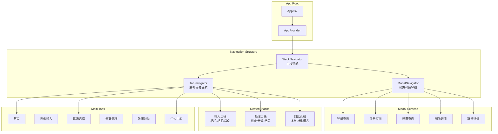
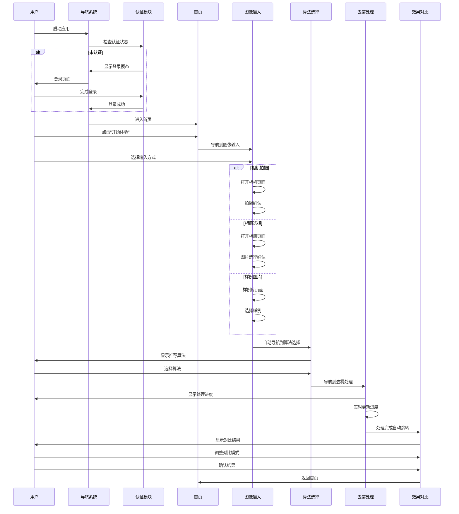

# 导航系统设计

**文档版本**: v1.0
**最后更新**: 2025-11-22
**项目名称**: dehaze-react-native
**目标平台**: iOS、Android

---

## 📋 文档概述

本文档详细描述了Dehaze React Native应用的导航系统设计，包括导航架构、路由管理、页面跳转、参数传递、权限控制和用户体验优化。基于现有的React Navigation 6架构，结合移动端特性，提供流畅直观的导航体验。

---

## 🎯 导航设计原则

### 移动端导航最佳实践

#### 1. 原生体验优先
- **平台一致性**: 遵循iOS和Android原生导航规范
- **手势支持**: 支持返回手势、侧滑手势等原生交互
- **过渡动画**: 使用平台标准的页面过渡效果
- **导航栏设计**: 适配平台特定的导航栏样式

#### 2. 用户体验优化
- **清晰的层级**: 导航层级不超过3层
- **快速返回**: 提供明确的返回路径
- **状态保持**: 页面切换时保持用户操作状态
- **深度链接**: 支持外部链接直达特定页面

#### 3. 性能考虑
- **懒加载**: 按需加载页面组件
- **预加载**: 智能预加载可能访问的页面
- **内存管理**: 及时清理不需要的页面实例
- **动画优化**: 确保页面切换动画流畅

---

## 🏗️ 导航架构设计

### 整体导航架构



### 导航类型设计

#### 1. 主栈导航 (Main Stack)
```typescript
// 根导航器，管理整体应用结构
const MainStackNavigator = () => {
  return (
    <Stack.Navigator
      screenOptions={{
        headerShown: false,
        gestureEnabled: true,
        animationTypeForReplace: 'push',
        cardStyleInterpolator: CardStyleInterpolators.forHorizontalIOS,
      }}
    >
      <Stack.Screen name="MainTabs" component={MainTabNavigator} />
      <Stack.Screen name="AuthStack" component={AuthStackNavigator} />
    </Stack.Navigator>
  );
};
```

#### 2. 底部标签导航 (Tab Navigation)
```typescript
// 主要功能页面的标签导航
const MainTabNavigator = () => {
  const { state: authState } = useAuth();

  return (
    <Tab.Navigator
      screenOptions={({ route }) => ({
        tabBarIcon: ({ focused, color, size }) => {
          return getTabIcon(route.name, focused, color, size);
        },
        tabBarActiveTintColor: '#3B82F6',
        tabBarInactiveTintColor: '#6B7280',
        tabBarStyle: {
          backgroundColor: '#FFFFFF',
          borderTopWidth: 1,
          borderTopColor: '#E5E7EB',
          paddingBottom: 8,
          paddingTop: 8,
          height: 60,
        },
        tabBarLabelStyle: {
          fontSize: 12,
          fontWeight: '500',
        },
        headerShown: false,
      })}
    >
      <Tab.Screen
        name="Home"
        component={HomeScreen}
        options={{
          title: '首页',
          tabBarBadge: authState.isAuthenticated ? null : 1,
        }}
      />
      <Tab.Screen
        name="ImageInput"
        component={ImageInputStackNavigator}
        options={{
          title: '输入',
        }}
      />
      <Tab.Screen
        name="AlgorithmSelect"
        component={AlgorithmSelectScreen}
        options={{
          title: '算法',
        }}
      />
      <Tab.Screen
        name="DehazeProcessing"
        component={DehazeProcessingStackNavigator}
        options={{
          title: '处理',
        }}
      />
      <Tab.Screen
        name="EffectComparison"
        component={EffectComparisonStackNavigator}
        options={{
          title: '对比',
        }}
      />
    </Tab.Navigator>
  );
};
```

#### 3. 模态导航 (Modal Navigation)
```typescript
// 模态弹窗页面导航
const ModalNavigator = () => {
  return (
    <Modal.Navigator
      screenOptions={{
        headerShown: false,
        presentation: 'modal',
        gestureEnabled: true,
        animationTypeForReplace: 'push',
      }}
    >
      <Modal.Screen
        name="Login"
        component={LoginScreen}
        options={{
          presentation: 'transparentModal',
          animationTypeForReplace: 'push',
        }}
      />
      <Modal.Screen
        name="Register"
        component={RegisterScreen}
        options={{
          presentation: 'modal',
        }}
      />
      <Modal.Screen
        name="ImageDetail"
        component={ImageDetailScreen}
        options={{
          presentation: 'modal',
        }}
      />
      <Modal.Screen
        name="AlgorithmDetail"
        component={AlgorithmDetailScreen}
        options={{
          presentation: 'modal',
        }}
      />
      <Modal.Screen
        name="Settings"
        component={SettingsScreen}
        options={{
          presentation: 'modal',
        }}
      />
    </Modal.Navigator>
  );
};
```

---

## 📱 页面导航设计

### 1. 用户旅程导航

基于[demo中的用户旅程设计](../../demo/docs/01-产品概述和总体架构.md#三-用户旅程设计)，设计完整的导航流程：



### 2. 核心页面导航

#### 图像输入导航栈
```typescript
const ImageInputStackNavigator = () => {
  return (
    <Stack.Navigator
      screenOptions={{
        headerShown: true,
        headerTitleAlign: 'center',
        headerBackTitleVisible: false,
        headerStyle: {
          backgroundColor: '#FFFFFF',
          shadowOpacity: 0,
          elevation: 0,
        },
        headerTitleStyle: {
          fontSize: 18,
          fontWeight: '600',
          color: '#111827',
        },
      }}
    >
      <Stack.Screen
        name="ImageInputMain"
        component={ImageInputScreen}
        options={{
          title: '图像输入',
          headerRight: () => <HistoryButton />,
        }}
      />
      <Stack.Screen
        name="CameraCapture"
        component={CameraCaptureScreen}
        options={{
          title: '拍照',
          headerShown: false,
        }}
      />
      <Stack.Screen
        name="GalleryPicker"
        component={GalleryPickerScreen}
        options={{
          title: '选择图片',
        }}
      />
      <Stack.Screen
        name="SampleLibrary"
        component={SampleLibraryScreen}
        options={{
          title: '样例图片',
        }}
      />
      <Stack.Screen
        name="ImagePreview"
        component={ImagePreviewScreen}
        options={{
          title: '图片预览',
          headerRight: () => <ConfirmButton />,
        }}
      />
    </Stack.Navigator>
  );
};
```

#### 去雾处理导航栈
```typescript
const DehazeProcessingStackNavigator = () => {
  return (
    <Stack.Navigator
      screenOptions={{
        headerShown: true,
        gestureEnabled: false, // 处理中禁用手势返回
        headerStyle: {
          backgroundColor: '#FFFFFF',
        },
      }}
    >
      <Stack.Screen
        name="ProcessingMain"
        component={ProcessingScreen}
        options={({ navigation, route }) => ({
          title: '去雾处理',
          headerLeft: () => <BackButton disabled={route.params?.processing} />,
          headerRight: () => route.params?.processing ? null : <CancelButton />,
        })}
      />
      <Stack.Screen
        name="ParameterConfig"
        component={ParameterConfigScreen}
        options={{
          title: '参数配置',
          gestureEnabled: true,
        }}
      />
      <Stack.Screen
        name="ProcessingResult"
        component={ProcessingResultScreen}
        options={{
          title: '处理结果',
          gestureEnabled: true,
          headerRight: () => <CompareButton />,
        }}
      />
    </Stack.Navigator>
  );
};
```

#### 效果对比导航栈
```typescript
const EffectComparisonStackNavigator = () => {
  return (
    <Stack.Navigator
      screenOptions={{
        headerShown: true,
        headerTitleAlign: 'center',
      }}
    >
      <Stack.Screen
        name="ComparisonMain"
        component={ComparisonScreen}
        options={{
          title: '效果对比',
          headerRight: () => <ModeSelector />,
        }}
      />
      <Stack.Screen
        name="MagnifierView"
        component={MagnifierViewScreen}
        options={{
          title: '放大镜对比',
          presentation: 'modal',
        }}
      />
      <Stack.Screen
        name="MetricsReport"
        component={MetricsReportScreen}
        options={{
          title: '质量指标',
          presentation: 'modal',
        }}
      />
      <Stack.Screen
        name="ExportOptions"
        component={ExportOptionsScreen}
        options={{
          title: '导出选项',
        }}
      />
    </Stack.Navigator>
  );
};
```

---

## 🔐 导航权限控制

### 1. 认证守卫

```typescript
// 认证守卫Hook
const useAuthGuard = () => {
  const { state: authState } = useAuth();
  const navigation = useNavigation();

  useEffect(() => {
    const unsubscribe = navigation.addListener('state', () => {
      const currentRoute = navigation.getCurrentRoute();

      // 需要认证的页面列表
      const protectedRoutes = [
        'ImageInput',
        'AlgorithmSelect',
        'DehazeProcessing',
        'EffectComparison',
        'Profile'
      ];

      if (protectedRoutes.includes(currentRoute.name) && !authState.isAuthenticated) {
        // 显示登录模态
        navigation.navigate('ModalStack', {
          screen: 'Login',
          params: {
            redirectTo: currentRoute.name,
            params: currentRoute.params
          }
        });
      }
    });

    return unsubscribe;
  }, [navigation, authState.isAuthenticated]);

  return authState.isAuthenticated;
};

// 高阶组件：权限保护
const withAuthGuard = (WrappedComponent: React.ComponentType<any>) => {
  return (props: any) => {
    const isAuthenticated = useAuthGuard();

    if (!isAuthenticated) {
      return <LoadingScreen />;
    }

    return <WrappedComponent {...props} />;
  };
};
```

### 2. 路由权限配置

```typescript
// 路由权限配置
const routePermissions = {
  // 公开路由 - 无需认证
  public: [
    'Home',
    'SampleLibrary',
    'Login',
    'Register',
    'Settings'
  ],

  // 受保护路由 - 需要认证
  protected: [
    'ImageInput',
    'AlgorithmSelect',
    'DehazeProcessing',
    'EffectComparison',
    'Profile',
    'History'
  ],

  // 高级功能路由 - 需要高级会员
  premium: [
    'BatchProcessing',
    'AdvancedAlgorithms',
    'HighQualityExport'
  ]
};

// 权限检查Hook
const useRoutePermission = (routeName: string) => {
  const { state: authState } = useAuth();

  const checkPermission = useCallback(() => {
    // 公开路由直接通过
    if (routePermissions.public.includes(routeName)) {
      return { allowed: true, reason: null };
    }

    // 需要认证的路由
    if (routePermissions.protected.includes(routeName)) {
      if (!authState.isAuthenticated) {
        return {
          allowed: false,
          reason: 'AUTH_REQUIRED',
          redirect: 'Login'
        };
      }
      return { allowed: true, reason: null };
    }

    // 需要高级会员的路由
    if (routePermissions.premium.includes(routeName)) {
      if (!authState.isAuthenticated) {
        return {
          allowed: false,
          reason: 'AUTH_REQUIRED',
          redirect: 'Login'
        };
      }
      if (authState.user?.level !== 'premium') {
        return {
          allowed: false,
          reason: 'PREMIUM_REQUIRED',
          redirect: 'Upgrade'
        };
      }
      return { allowed: true, reason: null };
    }

    return { allowed: true, reason: null };
  }, [routeName, authState]);

  return checkPermission();
};
```

### 3. 深度链接处理

```typescript
// 深度链接配置
const linking = {
  prefixes: ['dehaze://', 'https://dehaze.com'],
  config: {
    screens: {
      MainTabs: {
        screens: {
          Home: 'home',
          ImageInput: 'input',
          AlgorithmSelect: 'algorithms',
          DehazeProcessing: 'process',
          EffectComparison: 'compare',
          Profile: 'profile'
        }
      },
      ModalStack: {
        screens: {
          Login: 'login',
          Register: 'register',
          Settings: 'settings',
          ImageDetail: 'image/:imageId',
          AlgorithmDetail: 'algorithm/:algorithmId'
        }
      }
    }
  }
};

// 深度链接处理Hook
const useDeepLinking = () => {
  const navigation = useNavigation();
  const { state: authState } = useAuth();

  useEffect(() => {
    const handleDeepLink = (event: { url: string }) => {
      const { url } = event;

      // 解析URL
      const parsedUrl = new URL(url);
      const path = parsedUrl.pathname.replace(/^\//, '');
      const params = Object.fromEntries(parsedUrl.searchParams);

      // 处理特定的深度链接
      switch (path) {
        case 'image/:imageId':
          if (authState.isAuthenticated) {
            navigation.navigate('ModalStack', {
              screen: 'ImageDetail',
              params: { imageId: params.imageId }
            });
          }
          break;

        case 'algorithm/:algorithmId':
          navigation.navigate('ModalStack', {
            screen: 'AlgorithmDetail',
            params: { algorithmId: params.algorithmId }
          });
          break;

        case 'share':
          // 处理分享链接
          handleShareLink(params);
          break;

        case 'comparison':
          if (authState.isAuthenticated) {
            // 导航到特定对比
            navigation.navigate('EffectComparison', params);
          }
          break;
      }
    };

    const subscription = Linking.addEventListener('url', handleDeepLink);

    // 处理应用启动时的初始链接
    Linking.getInitialURL().then(url => {
      if (url) {
        handleDeepLink({ url });
      }
    });

    return () => {
      subscription.remove();
    };
  }, [navigation, authState.isAuthenticated]);
};
```

---

## 🎨 导航UI设计

### 1. 底部标签栏设计

```typescript
// 自定义标签栏组件
const CustomTabBar = ({ state, descriptors, navigation }: TabBarProps) => {
  return (
    <View style={styles.tabBarContainer}>
      {state.routes.map((route, index) => {
        const { options } = descriptors[route.key];
        const label = options.tabBarLabel !== undefined
          ? options.tabBarLabel as string
          : options.title !== undefined
          ? options.title
          : route.name;

        const isFocused = state.index === index;
        const onPress = () => {
          const event = navigation.emit({
            type: 'tabPress',
            target: route.key,
            canPreventDefault: true,
          });

          if (!isFocused && !event.defaultPrevented) {
            navigation.navigate(route.name);
          }
        };

        const onLongPress = () => {
          navigation.emit({
            type: 'tabLongPress',
            target: route.key,
          });
        };

        return (
          <TouchableOpacity
            key={route.key}
            accessibilityRole="button"
            accessibilityState={isFocused ? { selected: true } : {}}
            accessibilityLabel={options.tabBarAccessibilityLabel}
            testID={options.tabBarTestID}
            onPress={onPress}
            onLongPress={onLongPress}
            style={[
              styles.tabItem,
              isFocused && styles.tabItemFocused
            ]}
          >
            <View style={styles.iconContainer}>
              {getTabIcon(route.name, isFocused)}
              {/* 红点提示 */}
              {route.name === 'Home' && !isAuthenticated && (
                <View style={styles.badge} />
              )}
            </View>
            <Text style={[
              styles.tabLabel,
              isFocused && styles.tabLabelFocused
            ]}>
              {label}
            </Text>
          </TouchableOpacity>
        );
      })}
    </View>
  );
};

const styles = StyleSheet.create({
  tabBarContainer: {
    flexDirection: 'row',
    backgroundColor: '#FFFFFF',
    borderTopWidth: 1,
    borderTopColor: '#E5E7EB',
    paddingBottom: Platform.OS === 'ios' ? 20 : 0,
    height: Platform.OS === 'ios' ? 80 : 60,
  },
  tabItem: {
    flex: 1,
    alignItems: 'center',
    justifyContent: 'center',
    paddingVertical: 5,
  },
  tabItemFocused: {
    // 选中状态样式
  },
  iconContainer: {
    position: 'relative',
    marginBottom: 2,
  },
  badge: {
    position: 'absolute',
    top: -4,
    right: -4,
    width: 8,
    height: 8,
    borderRadius: 4,
    backgroundColor: '#EF4444',
  },
  tabLabel: {
    fontSize: 12,
    fontWeight: '500',
    color: '#6B7280',
  },
  tabLabelFocused: {
    color: '#3B82F6',
  },
});
```

### 2. 导航栏设计

```typescript
// 自定义导航栏组件
const CustomHeader = ({
  title,
  leftComponent,
  rightComponent,
  backgroundColor = '#FFFFFF',
  titleStyle,
}: HeaderProps) => {
  const insets = useSafeAreaInsets();

  return (
    <View style={[
      styles.headerContainer,
      {
        backgroundColor,
        paddingTop: insets.top,
      }
    ]}>
      <View style={styles.headerContent}>
        {/* 左侧组件 */}
        <View style={styles.headerLeft}>
          {leftComponent || <BackButton />}
        </View>

        {/* 标题 */}
        <Text style={[styles.headerTitle, titleStyle]}>
          {title}
        </Text>

        {/* 右侧组件 */}
        <View style={styles.headerRight}>
          {rightComponent}
        </View>
      </View>
    </View>
  );
};

// 返回按钮组件
const BackButton = ({ onPress, disabled = false }: BackButtonProps) => {
  const navigation = useNavigation();

  const handlePress = () => {
    if (onPress) {
      onPress();
    } else {
      navigation.goBack();
    }
  };

  return (
    <TouchableOpacity
      onPress={handlePress}
      disabled={disabled}
      style={[
        styles.backButton,
        disabled && styles.backButtonDisabled
      ]}
    >
      <Icon
        name="arrow-left"
        size={24}
        color={disabled ? '#D1D5DB' : '#374151'}
      />
    </TouchableOpacity>
  );
};
```

### 3. 页面过渡动画

```typescript
// 自定义页面过渡动画
const FadeTransition = ({ current, next, layouts }: TransitionProps) => {
  const progress = Animated.add(
    current.progress,
    next ? next.progress : 0
  ).interpolate({
    inputRange: [0, 1, 2],
    outputRange: [0, 1, 0],
  });

  return {
    cardStyle: {
      opacity: progress,
    },
  };
};

const SlideFromRightTransition = ({ current, next, layouts }: TransitionProps) => {
  return {
    cardStyle: {
      transform: [
        {
          translateX: current.progress.interpolate({
            inputRange: [0, 1],
            outputRange: [layouts.screen.width, 0],
          }),
        },
      ],
    },
  };
};

// 在导航器中使用
<Stack.Screen
  name="Example"
  component={ExampleScreen}
  options={{
    cardStyleInterpolator: FadeTransition,
    transitionSpec: {
      open: {
        animation: 'timing',
        config: {
          duration: 300,
        },
      },
      close: {
        animation: 'timing',
        config: {
          duration: 200,
        },
      },
    },
  }}
/>
```

---

## 🔄 导航状态管理

### 1. 导航状态追踪

```typescript
// 导航状态管理
const useNavigationState = () => {
  const navigation = useNavigation();
  const [routeHistory, setRouteHistory] = useState<RouteInfo[]>([]);

  // 记录导航历史
  const recordNavigation = useCallback((routeName: string, params?: any) => {
    const routeInfo: RouteInfo = {
      name: routeName,
      params: params || {},
      timestamp: Date.now(),
    };

    setRouteHistory(prev => {
      const newHistory = [...prev, routeInfo];
      // 限制历史记录长度
      return newHistory.slice(-50);
    });
  }, []);

  // 导航监听器
  useEffect(() => {
    const unsubscribe = navigation.addListener('state', () => {
      const route = navigation.getCurrentRoute();
      if (route) {
        recordNavigation(route.name, route.params);
      }
    });

    return unsubscribe;
  }, [navigation, recordNavigation]);

  // 获取上一个页面
  const getPreviousRoute = useCallback(() => {
    return routeHistory[routeHistory.length - 2] || null;
  }, [routeHistory]);

  // 检查是否可以返回
  const canGoBack = useCallback(() => {
    return routeHistory.length > 1;
  }, [routeHistory]);

  return {
    routeHistory,
    currentRoute: navigation.getCurrentRoute(),
    previousRoute: getPreviousRoute(),
    canGoBack,
    recordNavigation,
  };
};

// 导航服务类
class NavigationService {
  private static instance: NavigationService;
  private navigationRef: RefObject<NavigationContainerRef> = React.createRef();
  private routeHistory: RouteInfo[] = [];

  static getInstance(): NavigationService {
    if (!NavigationService.instance) {
      NavigationService.instance = new NavigationService();
    }
    return NavigationService.instance;
  }

  setNavigationRef(ref: NavigationContainerRef) {
    this.navigationRef.current = ref;
  }

  navigate(routeName: string, params?: any) {
    if (this.navigationRef.current) {
      this.navigationRef.current.navigate(routeName, params);
      this.recordNavigation(routeName, params);
    }
  }

  goBack() {
    if (this.navigationRef.current) {
      this.navigationRef.current.goBack();
      this.routeHistory.pop();
    }
  }

  reset(routeName: string, params?: any) {
    if (this.navigationRef.current) {
      this.navigationRef.current.resetRoot({
        index: 0,
        routes: [{ name: routeName, params }],
      });
      this.routeHistory = [{ name: routeName, params, timestamp: Date.now() }];
    }
  }

  private recordNavigation(routeName: string, params?: any) {
    const routeInfo: RouteInfo = {
      name: routeName,
      params: params || {},
      timestamp: Date.now(),
    };

    this.routeHistory.push(routeInfo);

    // 限制历史记录
    if (this.routeHistory.length > 100) {
      this.routeHistory.shift();
    }
  }

  getRouteHistory(): RouteInfo[] {
    return [...this.routeHistory];
  }

  getCurrentRoute(): RouteInfo | null {
    return this.routeHistory[this.routeHistory.length - 1] || null;
  }
}
```

### 2. 页面参数管理

```typescript
// 参数类型定义
interface RouteParams {
  // 认证相关
  Login?: {
    redirectTo?: string;
    params?: any;
  };

  // 图像相关
  ImageDetail?: {
    imageId: string;
    source?: 'upload' | 'process' | 'history';
  };

  // 算法相关
  AlgorithmDetail?: {
    algorithmId: string;
    imageId?: string;
  };

  // 处理相关
  DehazeProcessing?: {
    imageId: string;
    algorithmId?: string;
    autoStart?: boolean;
  };

  // 对比相关
  EffectComparison?: {
    originalImageId: string;
    processedImageId: string;
    algorithmId: string;
    autoMode?: string;
  };
}

// 参数验证Hook
const useRouteParams = <T extends keyof RouteParams>(
  routeName: T
): RouteParams[T] | null => {
  const route = useRoute<RouteParams[T]>();

  // 参数验证
  const validateParams = useCallback((params: any): RouteParams[T] | null => {
    if (!params) return null;

    try {
      switch (routeName) {
        case 'ImageDetail':
          return validateImageDetailParams(params);
        case 'AlgorithmDetail':
          return validateAlgorithmDetailParams(params);
        case 'DehazeProcessing':
          return validateDehazeProcessingParams(params);
        case 'EffectComparison':
          return validateEffectComparisonParams(params);
        default:
          return params as RouteParams[T];
      }
    } catch (error) {
      console.error(`Invalid params for ${routeName}:`, error);
      return null;
    }
  }, [routeName]);

  return validateParams(route.params);
};

// 参数验证函数
const validateImageDetailParams = (params: any): RouteParams['ImageDetail'] => {
  if (!params.imageId || typeof params.imageId !== 'string') {
    throw new Error('imageId is required and must be a string');
  }
  return {
    imageId: params.imageId,
    source: ['upload', 'process', 'history'].includes(params.source)
      ? params.source as 'upload' | 'process' | 'history'
      : undefined,
  };
};
```

---

## ⚡ 性能优化

### 1. 懒加载实现

```typescript
// 页面懒加载配置
const LazyHomeScreen = lazy(() => import('../pages/home/HomeScreen'));
const LazyImageInputScreen = lazy(() => import('../pages/imageInput/ImageInputScreen'));
const LazyAlgorithmSelectScreen = lazy(() => import('../pages/algorithmSelect/AlgorithmSelectScreen'));
const LazyDehazeProcessingScreen = lazy(() => import('../pages/dehazeProcessing/DehazeProcessingScreen'));
const LazyEffectComparisonScreen = lazy(() => import('../pages/effectComparison/EffectComparisonScreen'));

// Suspense包装器
const SuspenseWrapper = ({ children }: { children: React.ReactNode }) => (
  <Suspense fallback={<LoadingScreen />}>
    {children}
  </Suspense>
);

// 在导航器中使用懒加载
const MainTabNavigator = () => {
  return (
    <Tab.Navigator>
      <Tab.Screen
        name="Home"
        component={() => (
          <SuspenseWrapper>
            <LazyHomeScreen />
          </SuspenseWrapper>
        )}
      />
      <Tab.Screen
        name="ImageInput"
        component={() => (
          <SuspenseWrapper>
            <LazyImageInputScreen />
          </SuspenseWrapper>
        )}
      />
      {/* 其他页面... */}
    </Tab.Navigator>
  );
};
```

### 2. 导航预加载

```typescript
// 预加载管理器
class PreloadManager {
  private static instance: PreloadManager;
  private preloadedScreens: Set<string> = new Set();
  private preloadPromises: Map<string, Promise<void>> = new Map();

  static getInstance(): PreloadManager {
    if (!PreloadManager.instance) {
      PreloadManager.instance = new PreloadManager();
    }
    return PreloadManager.instance;
  }

  // 预加载屏幕组件
  preloadScreen(screenName: string): Promise<void> {
    if (this.preloadedScreens.has(screenName)) {
      return Promise.resolve();
    }

    if (this.preloadPromises.has(screenName)) {
      return this.preloadPromises.get(screenName)!;
    }

    const promise = this.doPreloadScreen(screenName);
    this.preloadPromises.set(screenName, promise);

    return promise;
  }

  private async doPreloadScreen(screenName: string): Promise<void> {
    try {
      switch (screenName) {
        case 'AlgorithmSelect':
          await import('../pages/algorithmSelect/AlgorithmSelectScreen');
          break;
        case 'DehazeProcessing':
          await import('../pages/dehazeProcessing/DehazeProcessingScreen');
          break;
        case 'EffectComparison':
          await import('../pages/effectComparison/EffectComparisonScreen');
          break;
        default:
          console.warn(`Unknown screen for preloading: ${screenName}`);
      }

      this.preloadedScreens.add(screenName);
    } catch (error) {
      console.error(`Failed to preload screen ${screenName}:`, error);
      this.preloadPromises.delete(screenName);
    }
  }

  // 预加载数据
  async preloadData(screenName: string): Promise<void> {
    switch (screenName) {
      case 'AlgorithmSelect':
        // 预加载算法列表
        try {
          const algorithmService = AlgorithmService.getInstance();
          await algorithmService.getAlgorithms({ limit: 10 });
        } catch (error) {
          console.warn('Failed to preload algorithms:', error);
        }
        break;

      case 'EffectComparison':
        // 预加载对比模式配置
        try {
          const comparisonService = ComparisonService.getInstance();
          await comparisonService.getComparisonModes();
        } catch (error) {
          console.warn('Failed to preload comparison modes:', error);
        }
        break;
    }
  }
}

// 预加载Hook
const usePreload = () => {
  const navigation = useNavigation();

  useEffect(() => {
    // 监听焦点变化，预加载相邻页面
    const unsubscribe = navigation.addListener('focus', () => {
      const route = navigation.getCurrentRoute();
      if (route) {
        PreloadManager.getInstance().preloadData(route.name);
      }
    });

    return unsubscribe;
  }, [navigation]);
};
```

### 3. 内存优化

```typescript
// 组件卸载清理
const useNavigationCleanup = () => {
  const navigation = useNavigation();

  useEffect(() => {
    const cleanup = () => {
      // 清理图片缓存
      ImageCache.getInstance().clearUnusedCache();

      // 取消所有进行中的网络请求
      RequestManager.getInstance().cancelAllRequests();

      // 清理定时器
      TimerManager.getInstance().clearAllTimers();
    };

    const unsubscribe = navigation.addListener('beforeRemove', cleanup);

    return () => {
      unsubscribe();
      cleanup();
    };
  }, [navigation]);
};

// 导航状态优化
const useOptimizedNavigation = () => {
  const navigation = useNavigation();
  const [isTransitioning, setIsTransitioning] = useState(false);

  // 优化导航性能
  const optimizedNavigate = useCallback(async (
    screenName: string,
    params?: any
  ) => {
    setIsTransitioning(true);

    try {
      // 预加载目标屏幕
      await PreloadManager.getInstance().preloadScreen(screenName);

      // 执行导航
      navigation.navigate(screenName, params);
    } finally {
      // 延迟重置过渡状态，确保动画完成
      setTimeout(() => {
        setIsTransitioning(false);
      }, 300);
    }
  }, [navigation]);

  return {
    navigate: optimizedNavigate,
    isTransitioning,
  };
};
```

---

## 🧪 导航测试

### 1. 导航功能测试

```typescript
// 导航测试工具
const NavigationTestUtils = {
  // 渲染导航容器
  renderWithNavigation: (
    component: React.ReactElement,
    initialRoute?: string,
    params?: any
  ) => {
    const MockedNavigation = () => {
      const ref = useRef<NavigationContainerRef>(null);

      useEffect(() => {
        NavigationService.getInstance().setNavigationRef(ref.current!);
      }, []);

      return (
        <NavigationContainer ref={ref}>
          <Stack.Navigator>
            <Stack.Screen
              name="TestScreen"
              component={() => component}
              initialParams={params}
            />
          </Stack.Navigator>
        </NavigationContainer>
      );
    };

    return render(<MockedNavigation />);
  },

  // 模拟导航操作
  simulateNavigation: (screenName: string, params?: any) => {
    const navigation = NavigationService.getInstance().getNavigation();
    if (navigation) {
      navigation.navigate(screenName, params);
    }
  },

  // 验证当前路由
  expectCurrentRoute: (expectedRoute: string) => {
    const navigation = NavigationService.getInstance().getNavigation();
    const currentRoute = navigation?.getCurrentRoute()?.name;
    expect(currentRoute).toBe(expectedRoute);
  },
};

// 导航测试用例
describe('Navigation System', () => {
  test('should navigate to login screen when not authenticated', async () => {
    const mockAuthService = {
      isAuthenticated: false,
    };

    const { result } = renderHook(() => useAuthGuard(), {
      wrapper: ({ children }) => (
        <AuthProvider value={{ state: mockAuthService }}>
          {children}
        </AuthProvider>
      ),
    });

    expect(result.current).toBe(false);
  });

  test('should handle deep links correctly', async () => {
    const mockLinking = {
      getInitialURL: jest.fn().mockResolvedValue('dehaze://image/123'),
    };

    const { result } = renderHook(() => useDeepLinking(), {
      wrapper: ({ children }) => (
        <NavigationContainer>
          {children}
        </NavigationContainer>
      ),
    });

    await waitFor(() => {
      expect(mockLinking.getInitialURL).toHaveBeenCalled();
    });
  });

  test('should preload screens when tab changes', async () => {
    const mockPreloadManager = {
      preloadData: jest.fn().mockResolvedValue(undefined),
    };

    renderHook(() => usePreload(), {
      wrapper: ({ children }) => (
        <NavigationContainer>
          <Tab.Navigator>
            <Tab.Screen name="Home" component={() => <View />} />
            <Tab.Screen name="Algorithms" component={() => <View />} />
          </Tab.Navigator>
        </NavigationContainer>
      ),
    });

    // 模拟切换到算法标签
    act(() => {
      NavigationService.getInstance().navigate('Algorithms');
    });

    await waitFor(() => {
      expect(mockPreloadManager.preloadData).toHaveBeenCalledWith('Algorithms');
    });
  });
});
```

---

## 📚 相关文档

### 架构文档系列
- [01-架构概述](01-overview.md)：详细的架构设计说明
- [02-技术架构](02-technical-architecture.md)：技术栈和架构模式
- [03-组件设计](03-component-design.md)：组件设计规范
- [04-API集成](04-api-integration.md)：API接口集成方案
- [05-状态管理](05-state-management.md)：状态管理架构

### 设计文档系列
- [07-响应式设计](07-responsive-design.md)：多设备适配方案
- [08-性能优化](08-performance-optimization.md)：性能优化策略

### 开发文档系列
- [09-测试策略](09-testing-strategy.md)：测试策略和工具
- [10-部署指南](10-deployment-guide.md)：应用打包和发布

### 技术参考
- [React Navigation 6官方文档](https://reactnavigation.org/)
- [React Native导航最佳实践](https://reactnative.dev/docs/navigation)
- [移动端导航设计指南](https://developer.apple.com/design/human-interface-guidelines/)

---

**文档版本**: v1.0
**最后更新**: 2025-11-22
**下次更新**: 根据用户体验测试和性能监控结果持续优化