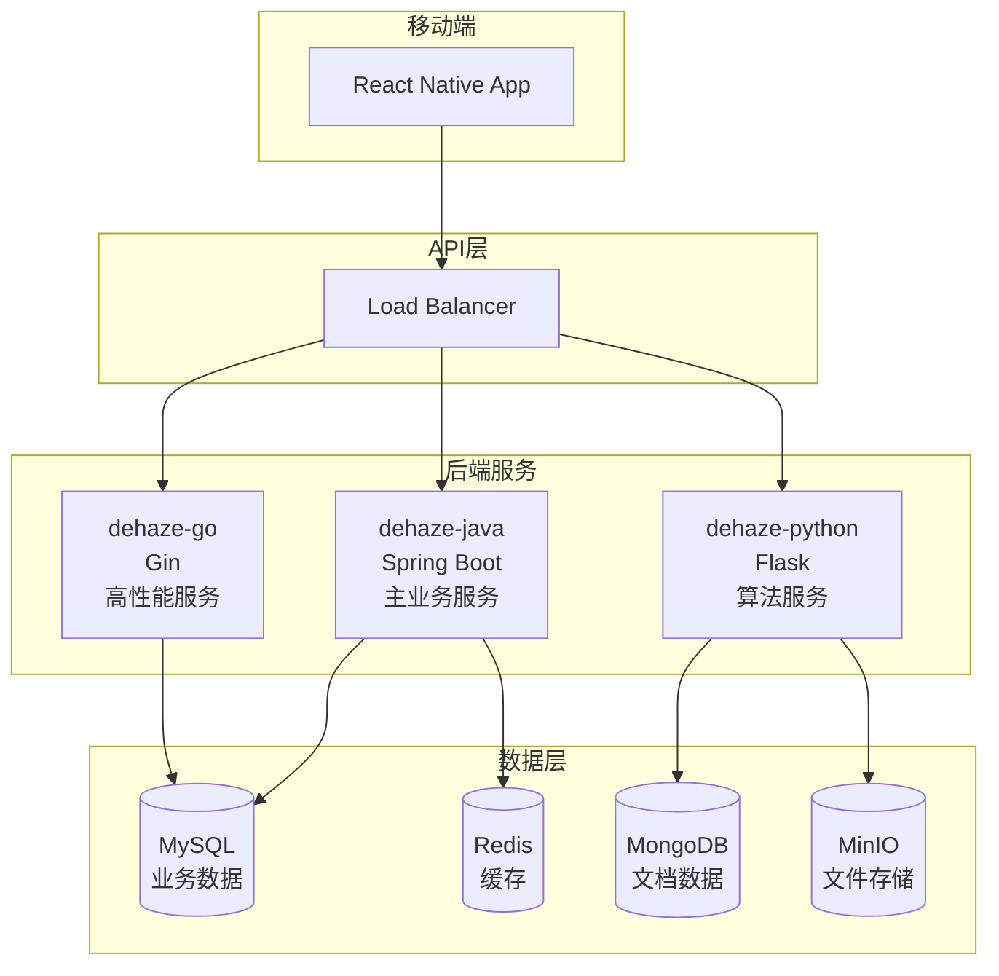

# Dehaze React Native 架构设计文档

**文档版本**: v1.0
**最后更新**: 2025-11-22
**项目名称**: dehaze-react-native
**目标平台**: iOS、Android

---

## 📋 文档结构

本架构设计文档基于[demo文件夹中的需求分析和设计规范](../../demo/docs)和[Flutter设计文档](../dehaze_flutter/docs)的分析，专为React Native技术栈设计，包含以下核心文档：

```
dehaze-react-native/docs/architecture/
├── README.md                        # 文档说明（本文档）
├── 01-overview.md                   # 架构概述
├── 02-technical-architecture.md     # 技术架构设计
├── 03-component-design.md           # 组件设计规范
├── 04-api-integration.md            # API接口集成设计
├── 05-state-management.md           # 状态管理架构
├── 06-navigation-design.md          # 导航系统设计
├── 07-responsive-design.md          # 响应式设计策略
├── 08-performance-optimization.md   # 性能优化策略
├── 09-testing-strategy.md           # 测试策略
└── 10-deployment-guide.md           # 部署指南
```

---

## 🎯 项目概述

### 产品定位

**Dehaze React Native**是基于React Native跨平台技术开发的移动端图像去雾应用，专注于提供**原生级用户体验**的图像去雾服务。本应用作为完整去雾系统的移动端前端，与后端服务（dehaze-java、dehaze-go、dehaze-python）深度集成，为用户提供移动端的便捷图像去雾处理能力。

### 核心价值主张

- **原生性能体验**: 利用React Native的原生渲染能力，提供接近原生应用的性能表现
- **移动端优化**: 专为移动设备设计，支持相机集成、相册访问、手势操作等移动端特性
- **离线支持**: 支持基础功能的离线使用，提升用户体验
- **跨平台一致性**: 一套代码同时支持iOS和Android，保证统一的用户体验

### 技术特色

- **React Native 0.81**: 最新版本的React Native框架，支持最新特性
- **TypeScript**: 类型安全的开发体验，提升代码质量和维护性
- **现代化状态管理**: 使用Zustand进行轻量级状态管理
- **原生模块集成**: 相机、相册、文件系统等原生功能深度集成
- **实时通信**: WebSocket支持，实时查看处理进度

---

## 🏗️ 整体架构设计

### 架构模式

采用**Clean Architecture + Feature-First**架构模式，结合**React Navigation**路由管理和**Zustand**状态管理，专注于移动端用户体验优化。

```
dehaze-react-native/
├── src/
│   ├── App.tsx                           # 应用入口
│   ├── app/                              # 应用层
│   │   ├── navigation/                   # 导航配置
│   │   ├── theme/                        # 主题配置
│   │   ├── providers/                    # 全局Provider
│   │   └── components/                   # 全局组件
│   ├── core/                             # 核心层（跨功能共享）
│   │   ├── constants/                    # 常量定义
│   │   ├── utils/                        # 工具类
│   │   ├── hooks/                        # 自定义Hooks
│   │   ├── types/                        # TypeScript类型定义
│   │   └── errors/                       # 错误处理
│   ├── features/                         # 功能模块层
│   │   ├── home/                         # 首页模块
│   │   ├── imageInput/                   # 图像输入模块
│   │   ├── algorithmSelect/              # 算法选择模块
│   │   ├── dehazeProcessing/             # 去雾处理模块
│   │   ├── effectComparison/             # 效果对比模块
│   │   └── userProfile/                  # 用户档案模块
│   └── services/                         # 全局服务
│       ├── api/                          # API客户端
│       ├── storage/                      # 本地存储
│       ├── websocket/                    # WebSocket服务
│       └── permissions/                  # 权限管理
├── android/                              # Android原生代码
├── ios/                                  # iOS原生代码
└── __tests__/                            # 测试文件
```

### 模块划分与职责

| 模块名称 | 核心功能 | 用户价值 | 移动端特性 | 优先级 |
|---------|----------|----------|------------|--------|
| **home** | 产品介绍、功能引导、快速入口 | 帮助用户快速了解产品 | 原生动画、手势引导 | P0 |
| **imageInput** | 图像输入（相机、相册、样例） | 移动端便捷图像获取 | 相机集成、相册访问、图片压缩 | P0 |
| **algorithmSelect** | 算法选择（推荐、搜索、详情） | 智能选择最适合算法 | 手势滑动、原生搜索 | P0 |
| **dehazeProcessing** | 去雾处理（进度、预览、控制） | 实时查看处理进展 | 后台处理、推送通知 | P0 |
| **effectComparison** | 效果对比（并排、重叠、放大镜） | 全面评估去雾效果 | 手势缩放、触摸交互 | P0 |
| **userProfile** | 用户档案、设置、历史记录 | 个性化体验管理 | 生物识别、本地设置 | P1 |

### 依赖关系

```
presentation → zustand → services → backend API
     ↓
  React Native Components
     ↓
  Native Modules (Camera, FileSystem, etc.)
```

**依赖规则**：
- 功能模块内部使用Clean Architecture分层
- 跨模块通信通过全局状态管理或事件总线
- 所有模块依赖core层的通用功能
- 原生功能通过React Native Bridge访问

---

## 📱 移动端特色功能

### 1. 原生相机集成

```typescript
// 支持的相机功能
- 实时预览: Camera API实时预览
- 拍照控制: 对焦、曝光、闪光灯控制
- 前后摄像头: 前置/后置摄像头切换
- 视频录制: 支持录制视频进行处理
- 实时滤镜: 预览实时去雾效果
```

### 2. 相册深度集成

```typescript
// 相册功能
- 智能选择: 按时间、地点、智能分类
- 批量操作: 多选图片进行批量处理
- 原图访问: 无损访问原始图片
- 元数据读取: 读取EXIF信息用于算法优化
```

### 3. 手势操作优化

```typescript
// 手势支持
- 缩放手势: 图片缩放查看
- 滑动手势: 页面切换、图片对比
- 长按手势: 显示上下文菜单
- 双击手势: 快速缩放、确认操作
- 拖拽手势: 分割线调节、参数调整
```

### 4. 离线功能支持

```typescript
// 离线功能
- 离线样例: 内置样例图片，支持离线体验
- 缓存算法: 缓存常用算法参数和配置
- 历史记录: 本地保存处理历史
- 设置同步: 网络可用时同步用户设置
```

---

## 🔄 后端服务集成

### 后端服务架构

React Native前端与后端服务的集成架构：



### API集成策略

#### 主要API服务推荐

| 服务类型 | 推荐后端 | 主要功能 | 优化策略 |
|---------|----------|----------|----------|
| **用户认证** | dehaze-java | 登录、注册、权限管理 | JWT Token + 自动刷新 |
| **文件管理** | dehaze-java | 图像上传、下载、存储 | 多线程上传、断点续传 |
| **算法管理** | dehaze-java | 算法列表、推荐、详情 | 本地缓存、智能预加载 |
| **图像处理** | dehaze-python | 去雾算法执行 | WebSocket实时进度 |
| **数据统计** | dehaze-go | 处理统计、性能数据 | 增量更新、本地聚合 |

#### 移动端网络优化

```typescript
// 网络优化策略
- 请求合并: 合并多个小请求减少网络开销
- 数据压缩: 启用gzip压缩减少传输量
- 缓存策略: 智能缓存减少重复请求
- 离线支持: 网络不可用时使用缓存数据
- 重试机制: 网络错误时自动重试
- 超时控制: 合理的超时设置避免用户等待
```

---

## 🎨 UI设计系统

### 设计原则

基于[demo中的UI/UX设计规范](../../demo/docs/08-UI-UX设计规范.md)，针对移动端进行优化：

#### 移动端优先
- 原生组件优先使用，确保平台一致性
- 触摸友好的交互设计（最小44px触摸区域）
- 底部导航便于单手操作
- 手势操作优化

#### 原生性能体验
- 使用React Native原生组件避免性能损耗
- 优化列表渲染性能（FlatList、FlashList）
- 合理使用动画，避免过度渲染
- 图片懒加载和内存管理

### 核心设计规范

#### 色彩系统（移动端优化）
- **主色调**: #3B82F6 (iOS/Android原生蓝色)
- **渐变主色**: linear-gradient(135deg, #007AFF, #5856D6) - iOS风格
- **功能色**: 适配系统主题色彩
- **暗色模式**: 支持iOS/Android系统暗色模式

#### 字体系统（原生字体）
- **iOS**: SF Pro Display/Text 系列字体
- **Android**: Roboto 系列字体
- **响应式字号**: 根据@2x/@3x屏幕密度调整

#### 间距系统（移动端适配）
- **基础单位**: 4px，适配不同屏幕密度
- **安全区域**: 适配刘海屏、底部指示器
- **触控热区**: 最小44px保证触控准确性

---

## 🚀 核心优势

### 技术优势

**1. 原生性能表现**
- React Native原生渲染，性能接近原生应用
- 原生模块深度集成，充分发挥设备能力
- 优化的内存管理和电池使用

**2. 跨平台一致性**
- 一套代码支持iOS和Android
- 统一的用户体验和功能特性
- 降低开发和维护成本

**3. 移动端特性支持**
- 完整的相机和相册集成
- 生物识别认证支持
- 推送通知和后台处理
- 离线功能支持

### 产品优势

**1. 移动端优化体验**
- 5秒快速体验流程
- 相机一键拍照处理
- 手势操作直观便捷

**2. 智能化功能**
- 基于图像特征的算法推荐
- 自动优化处理参数
- 智能缓存和预加载

**3. 完整的移动生态**
- 与系统相册深度集成
- 支持系统分享功能
- 原生文件管理

---

## 📚 相关文档

### 架构文档系列
- [01-架构概述](01-overview.md)：详细的架构设计说明
- [02-技术架构](02-technical-architecture.md)：技术栈和架构模式
- [03-组件设计](03-component-design.md)：组件设计规范
- [04-API集成](04-api-integration.md)：后端服务集成方案
- [05-状态管理](05-state-management.md)：状态管理架构

### 设计文档系列
- [06-导航设计](06-navigation-design.md)：导航系统设计
- [07-响应式设计](07-responsive-design.md)：多设备适配
- [08-性能优化](08-performance-optimization.md)：性能优化策略

### 开发文档系列
- [09-测试策略](09-testing-strategy.md)：测试策略和工具
- [10-部署指南](10-deployment-guide.md)：应用打包和发布

### 需求文档系列
- [产品概述和总体架构](../../demo/docs/01-产品概述和总体架构.md)：完整的产品需求分析
- [UI-UX设计规范](../../demo/docs/08-UI-UX设计规范.md)：完整的设计规范
- [后端API分析](../backend-api-analysis.md)：后端接口详细分析

---

## 📈 开发计划

### 第一阶段：基础架构（2周）
- Week 1：项目初始化、基础架构搭建、原生模块配置
- Week 2：导航系统、主题配置、全局状态管理

### 第二阶段：核心功能（4周）
- Week 3-4：图像输入模块（相机、相册集成）
- Week 5-6：算法选择模块、去雾处理模块

### 第三阶段：高级功能（3周）
- Week 7-8：效果对比模块（手势交互、多模式对比）
- Week 9：用户档案模块、离线功能

### 第四阶段：优化与发布（3周）
- Week 10：性能优化、内存管理
- Week 11：测试完善、Bug修复
- Week 12：应用打包、发布准备

---

**文档版本**: v1.0
**最后更新**: 2025-11-22
**下次更新**: 根据开发进度和需求变化持续更新