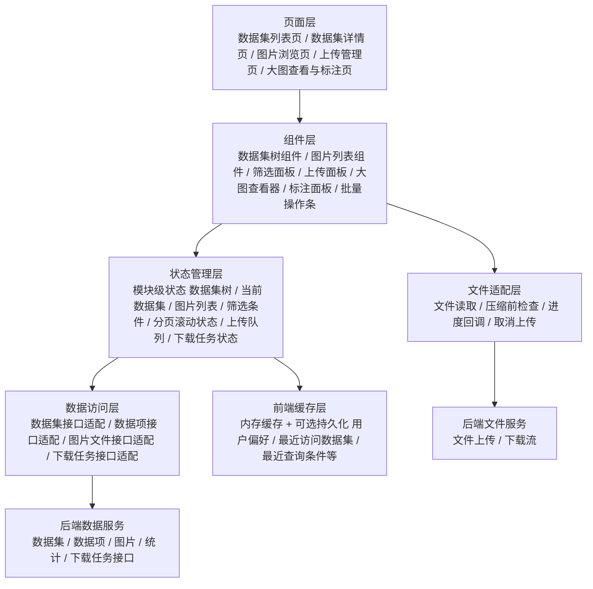
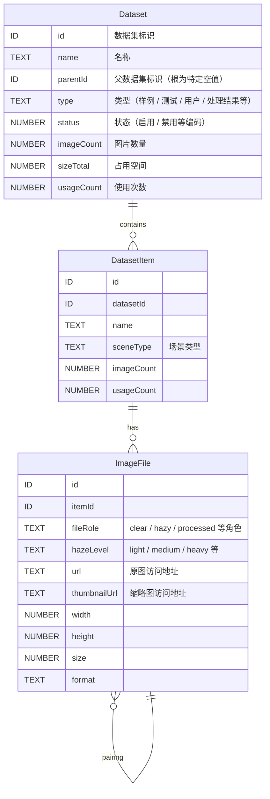
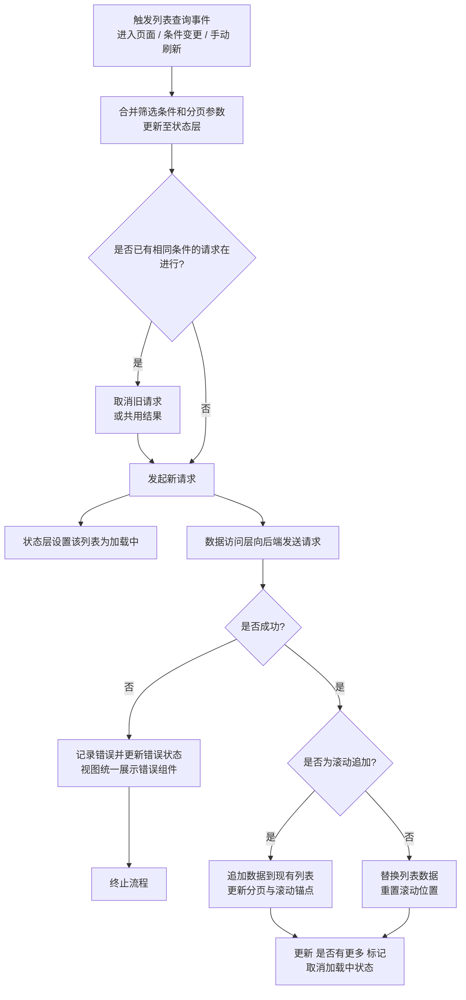
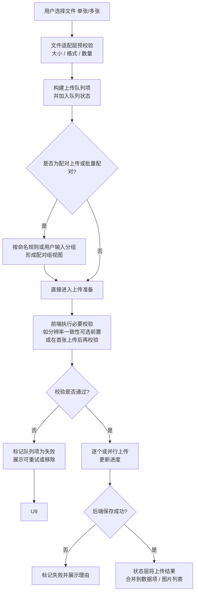
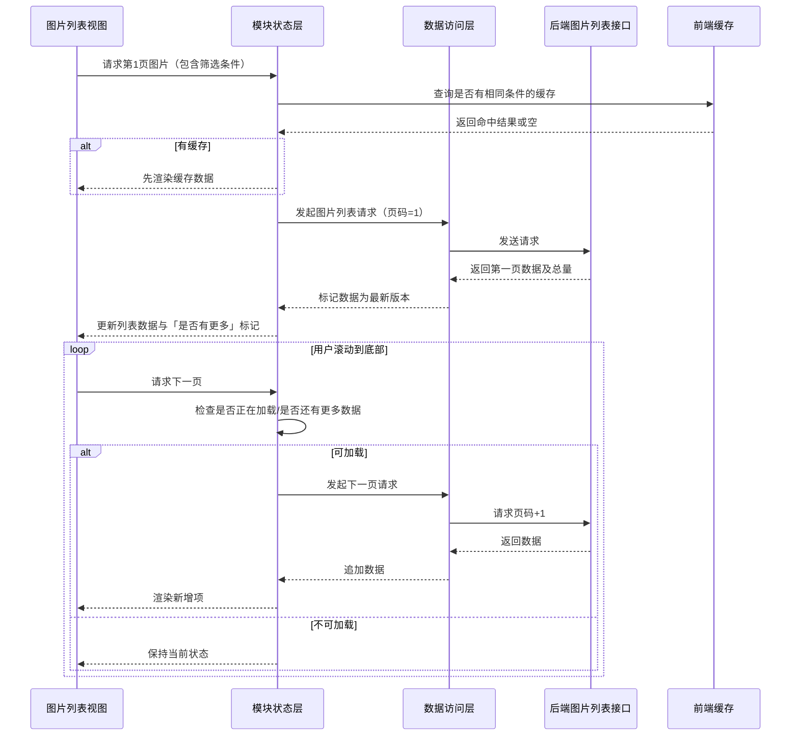
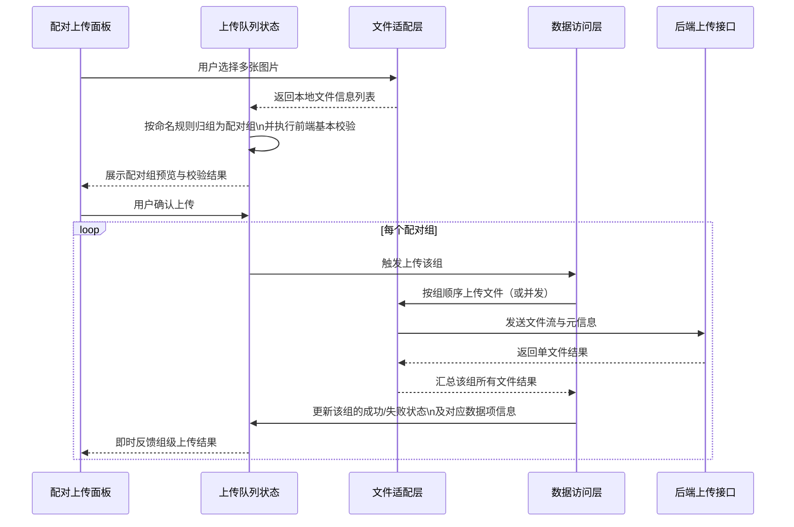
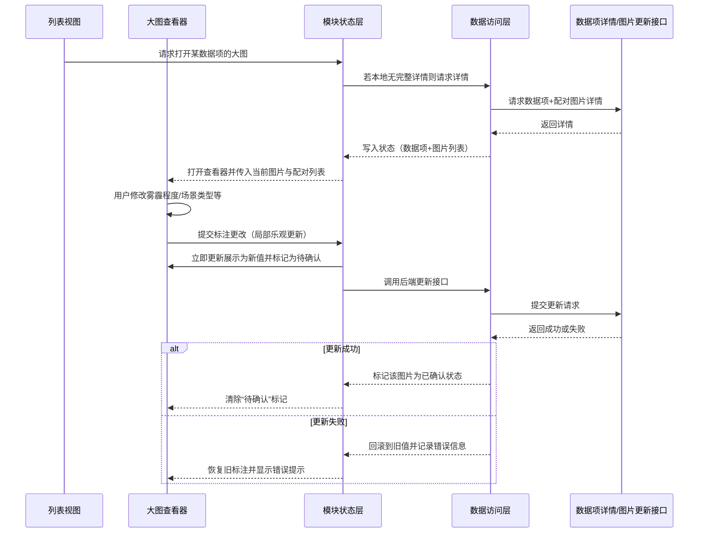

## 一、模块概览与核心目标

### 1.1 模块定位

数据集管理模块前端负责**数据集 / 数据项 / 图片文件**在客户端的完整呈现与操作编排，包括：

- 数据集树与列表浏览、筛选、搜索、多种展示模式与无限滚动。
- 图片大图查看、配对图片切换、人工标注编辑。
- 单张 / 配对 / 批量上传与配对校验、图片信息修改与删除。
- 下载入口与下载任务触发（由后端异步打包）。

目标是：**在保证复杂业务规则（配对规则、统计规则、权限、批量操作）的前提下，提供高性能、高可用、高可维护的前端模块**。

### 1.2 设计原则

- **语言 / 框架无关**：仅描述概念层的视图、组件、状态、数据与接口协作，不绑定具体技术栈。
- **DRY**：抽象统一的列表模式、表单模式、上传模式、批量模式、异常模式，后续功能只声明差异点。
- **前后端契约友好**：前端状态与视图实体与后端领域模型保持一一对应，减少适配层复杂度。
- **高性能**：虚拟列表、图片懒加载、前端缓存、请求合并与去重，降低网络与渲染压力。
- **可观测性**：所有关键操作具备统一的加载状态、错误反馈与重试机制。

---

## 二、前端分层与组件架构

### 2.1 分层架构

### 2.2 各层职责（后文不再重复）

- **页面层**：组合模块级组件，负责路由入口、跨模块跳转、整体布局。
- **组件层**：封装可复用 UI 与局部交互，不直接调用后端，只与状态层交互。
- **状态管理层**：统一管理模块内所有状态，负责：
    - 触发数据访问层调用；
    - 管理加载 / 错误 / 空状态；
    - 处理前端缓存读写；
    - 管理批量操作与上传队列。
- **数据访问层**：对后端接口进行抽象，包括：
    - 请求参数组装、响应结构归一；
    - 错误与权限异常分类；
    - 请求去重 / 取消 / 重试。
- **前端缓存层**：缓存热点数据（如数据集树、常用数据集、最近查询结果），并缓存用户偏好（展示模式、筛选条件、排序字段等）。
- **文件适配层**：统一处理文件选择、大小与格式校验、分片策略（如需）、进度通知与取消。
- **后端数据/文件服务**：抽象为外部依赖，仅通过接口契约交互，设计不涉及内部实现。

---

## 三、核心前端数据模型（视图实体）

> 类型使用抽象表示（ID / TEXT / NUMBER 等），不绑定任何具体语言类型。

前端额外维护的非后端字段（逻辑字段）示例（不在 ER 图中展开）：

- 列表项视图字段：选中状态、是否在当前视窗、是否处于加载中。
- 上传队列项字段：本地临时标识、上传进度、错误信息、重试次数。
- 下载任务视图字段：显示名称、关联数据集 / 数据项摘要、当前进度文案。

---

## 四、通用前端业务模式（DRY）

本节抽象**前端通用模式**，后续所有功能只描述“偏离点”。

### 4.1 列表查询与滚动加载模式

要点：

- **请求去重 / 取消**：相同条件下只保留最新请求，避免快速滚动或频繁筛选造成浪费。
- **滚动加载**：列表统一维护“页码 + 是否有更多数据 + 当前滚动锚点”，支持无限滚动与显式“加载更多”两种模式。
- **排序与筛选**：条件变化会重置页码与滚动状态；但可通过缓存恢复上一次条件。

### 4.2 表单提交与编辑模式

适用于：数据集创建 / 修改、数据项信息修改、图片信息编辑、标注编辑等。

伪代码式流程（抽象步骤，非真实语法）：

- 当用户提交表单时：
    1. 在前端校验必填项、长度、格式、数值范围等。
    2. 若存在跨字段规则（例如“至少选择一种雾霾程度”），在状态层统一校验。
    3. 若校验通过：

    - 将表单数据转换为接口约定的结构；
    - 设置对应区域为“提交中”；
    - 通过数据访问层调用后端。

    4. 接口成功：

    - 合并后端返回（如实际保存的实体）到状态中；
    - 若当前视图存在相关列表，按需局部刷新而非全量刷新；
    - 关闭弹窗或退出编辑态。

    5. 接口失败：

    - 根据错误分类（见 §8）恢复表单可编辑状态；
    - 若为字段级错误，将后端错误映射到对应字段显示。

### 4.3 文件上传模式（单张 / 配对 / 批量）

对所有上传入口统一处理为“上传队列”：

要点：

- 上传队列与页面解耦，多个页面共用同一队列。
- 配对上传与批量配对在队列层看作“分组任务”，失败时可以按组级反馈。
- 进度与取消托管在文件适配层，状态层只关心队列状态。

### 4.4 批量操作模式（删除 / 下载 / 批量编辑）

统一抽象为“选择集 + 操作描述”：

- 组件层只维护“已选项集合”（可以是数据集、数据项或图片）。
- 状态层接收“操作类型 + 选择集合”，生成批量任务：
    - 若操作可拆分（如删除多个图片），则为每项创建子任务；
    - 若操作需整体原子性（如“一个配对组必须整体上传成功才能显示”），则作为单一任务处理结果。

结果展示遵循统一原则：

- 显示总数、成功数、失败数；
- 对失败项给出逐项原因（若后端有返回），并允许重试当前失败项集合。

### 4.5 前端权限与显示控制通用模式

- 状态层持有当前用户的角色与数据范围信息（由全局模块提供）。
- 组件仅基于“能力标记”渲染按钮和入口，例如“是否允许删除数据集”、“是否允许上传图片”。
- 对于被后端拒绝的操作（权限变更、接口侧限制），统一走异常处理流（见 §8），并可按操作类型隐藏入口以降低用户困惑。

---

## 五、功能分组与差异化逻辑

本节**只讲偏离通用模式的逻辑**，通用部分均“同通用流程”。

### 5.1 数据集列表与树形管理

- **视图特点**：
    - 左侧树形导航 + 右侧列表，树形部分与列表共享同一数据源与缓存。
- **差异化逻辑**：
    - 切换树节点时：
        - 使用“同通用列表查询流程”，但不重置全局筛选条件，只替换数据集标识。
        - 使用缓存优先渲染树形结构，列表再异步请求。
    - 树操作（新增 / 重命名 / 删除）成功后：
        - 只更新受影响的节点与其父节点统计信息；
        - 通过状态层触发“树形结构缓存失效”，下次进入时重新加载。

### 5.2 数据集详情与统计面板

- **视图特点**：头部为数据集信息与统计卡片，底部为图片列表模块入口。
- **差异化逻辑**：
    - 详情加载时：
        - 并行请求“数据集基本信息”和“统计信息”，使用统一列表模式的加载与错误状态；
        - 若统计信息命中前端缓存，则优先使用，同时在后台静默刷新。
    - 统计图表组件只订阅“统计数据”子状态，不感知请求细节，支持后端统计结构扩展。

### 5.3 图片展示与浏览模式（列表 / 瀑布流 / 网格）

- **视图特点**：多展示模式共享同一数据源，不同模式只差异渲染策略。
- **差异化逻辑**：
    - 切换展示模式时：
        - 不触发新的数据请求，只切换“展示模式”状态；
        - 共享相同的分页与滚动状态，但每种模式单独维护视窗滚动位置。
    - 无限滚动：
        - 使用“同通用列表查询流程”，但在滚动到底部后，由列表组件触发下一页请求；
        - 为防止激进滚动导致请求风暴，组件端使用节流策略，状态层负责请求去重。

### 5.4 大图查看与标注

- **视图特点**：覆盖式视图（弹窗或独立页），展示一张图片及其配对关系和可编辑信息。
- **差异化逻辑**：
    - 启动方式：
        - 从任意列表模式点击进入时，状态层记住“来源列表与位置”，支持“上一张 / 下一张”跨数据项切换。
    - 标注编辑：
        - 使用“同通用表单提交模式”，但采用**局部乐观更新**策略：
            - 用户保存后，立即在大图视图中更新展示，同时标记为“待接口确认”；
            - 若接口失败，再回滚到上次成功状态并展示错误。
    - 配对图片切换：
        - 仅操作本地状态，不触发接口；
        - 切换行为保持独立于“上一张 / 下一张”的数据项切换，以避免用户混淆。

### 5.5 图片上传与管理（单张 / 配对 / 批量）

- **视图特点**：一个统一的“图片管理面板”，支持多入口（创建数据项时、数据项详情中、批量上传入口等）。
- **差异化逻辑**：
    - 单张上传：
        - 使用“通用上传模式”，但若数据项已有图片，则在上传前拉取已有图片分辨率用于前端预校验。
    - 配对上传：
        - 在上传队列层增加“配对组视图”，前端按命名规则或用户选择归组；
        - 组级校验（清晰图存在、有雾图至少一张、分辨率一致）在前端先执行一次，以减少明显错误；
        - 组级结果反馈（整组成功 / 整组失败 / 部分失败时的提示策略）由前端统一控制。
    - 批量上传：
        - 文件适配层负责从文件名自动提取前缀与角色信息，状态层只接收分组结果；
        - 对失败组支持单组重试，避免整批重新上传。

### 5.6 下载入口与下载任务绑定

- **视图特点**：下载入口散布在数据集列表、图片列表、大图查看器中，背后统一走下载任务视图。
- **差异化逻辑**：
    - 所有下载操作仅负责：
        - 拼装“下载意图”（数据集 / 数据项 / 图片集合 + 组织方式）；
        - 通过数据访问层触发对应下载任务接口；
        - 将返回的任务标识交给“下载任务中心视图”展示。
    - 下载任务中心在前端维护：
        - 任务列表、任务状态、进度与失败原因；
        - 定时或按需轮询后端任务状态；
        - 点击下载链接由浏览器/操作系统处理实际文件保存。

---

## 六、关键数据流与时序

### 6.1 瀑布流图片加载与无限滚动

### 6.2 配对图片上传数据流

### 6.3 大图查看 + 标注编辑数据流

---

## 七、关键业务规则与前端校验

前端校验只做**快速反馈与减少无效请求**，最终规则由后端裁决；规则与后端保持一致。

### 7.1 数据集与数据项

- 名称非空与长度限制：防止明显无效输入。
- 同级名称唯一性：可在已有列表中预检查，减少重复提交次数，但不依赖于此作为最终结论。
- 状态变更限制：若数据集被标记为不可编辑，前端隐藏相关操作入口，并在接口被拒绝时同步更新视图。

### 7.2 图片与配对规则（前端侧）

- **文件格式与大小**：
    - 文件适配层对选中文件做格式与大小过滤，不符合规则的文件不进入队列。
- **配对完整性**：
    - 每个配对组必须恰好一张“清晰图角色”的文件；
    - 有雾图至少一张；每张有雾图必须在前端选择雾霾程度后才能提交。
- **分辨率一致性**：
    - 对同组图片，在上传前尽可能通过浏览器能力读取宽高做前置校验；
    - 若环境不支持，则在“首张上传完成返回宽高”后，对剩余图片进行与该宽高的逐一比对。
- **编辑规则**：
    - 修改图片角色时，若导致某数据项不再有清晰图，前端直接禁止该操作或给出明确风险提示。

### 7.3 搜索与筛选

- 关键词搜索默认与分页绑定，禁止在同一条件下短时间内多次请求（通过前端节流）。
- 高级搜索条件（分辨率范围、大小范围等）在前端做基本逻辑校验（最小值不大于最大值），不通过则不发起请求。

---

## 八、异常处理与前端“事务”策略

### 8.1 异常分类与处理

前端根据接口返回或网络状态将异常归类为：

- **输入错误**（参数/业务校验失败）：
    - 显示可理解的原因，保持用户输入不丢失；
    - 将后端字段级错误映射至表单字段。
- **权限错误**：
    - 弹出权限提示，并可选触发全局权限刷新；
    - 对重复被拒的操作，前端隐藏或禁用相关入口。
- **资源不存在**：
    - 在列表中，自动移除或标记为“已失效”；
    - 在大图查看中，关闭当前视图并提示。
- **系统错误或网络错误**：
    - 使用统一错误提示组件；
    - 对列表类接口可提供“重试”按钮；
    - 对上传/批量操作保留队列状态，允许用户选择失败项重试。

### 8.2 前端“事务”策略

虽无真正数据库事务，但在交互上遵循以下原则：

- **批量删除**：
    - 列表不做乐观删除，只在后端确认成功后移除；
    - 对部分失败的情况，保留失败项并标注失败原因。
- **配对上传**：
    - 单个配对组视为事务边界：前端只在整个组上传成功后才将该组加入列表；
    - 若部分文件失败，整组视为失败，防止前端出现不完整配对。
- **多步骤操作**（如“创建数据项 + 上传图片”）：
    - 将步骤拆成显式阶段：先创建数据项，再上传文件；
    - 任意步骤失败时，前端根据后端返回决定是否展示“残缺状态”（例如空的数据项）或直接隐藏。

---

## 九、前端缓存与性能优化建议

### 9.1 前端缓存策略

- **数据集树和常用数据集**：
    - 加载一次后保存在模块状态中，跨页面复用；
    - 可选持久化最近访问的数据集，提升再次访问速度。
- **图片列表**：
    - 对相同筛选条件的结果做短期缓存（例如本次会话内），切换筛选时优先回显旧数据，再静默刷新。
- **统计数据**：
    - 与数据集详情绑定缓存，进入详情页先展示缓存，再从后端获取最新值。

### 9.2 渲染与交互性能

- **长列表虚拟化**：
    - 所有列表或瀑布流视图只渲染可见区域及少量缓冲区，减少节点数量。
- **图片懒加载**：
    - 缩略图按视窗懒加载；大图仅在打开查看器时加载；
    - 支持占位符与加载失败占位。
- **搜索与筛选防抖 / 节流**：
    - 文本搜索输入使用防抖，减少请求次数；
    - 滚动触发加载使用节流，避免短时间内多次触发。
- **复用视图实例**：
    - 同一数据集在不同入口打开时优先复用已有状态，避免重复请求。

### 9.3 文件处理优化

- 上传时尽量避免前端重复读取大文件内容，仅在必要时读取元信息（尺寸、格式）。
- 对大批量文件，仅在用户确认后分批发起请求，避免一次性创建过多并发连接。
- 下载任务统一交由后端处理，前端仅负责触发与展示进度，避免在前端执行打包或复杂处理。

---

- **整体说明**：  
  本前端设计文档以“视图层—组件层—状态层—数据访问层—缓存/文件适配层”的分层为基础，抽象了数据集管理模块中常见的列表、表单、上传、批量、查看、标注等通用模式，并在各功能点只描述偏离通用模式的差异性逻辑。所有规则、异常与性能策略均保持语言和框架无关，可直接支撑后续的接口评审与实现选型。
