# 总体系统架构文档

## 1. 概述

### 1.1 文档目的
本文档描述图像去雾系统的整体技术架构，包括系统分层结构、技术选型、数据流设计、部署拓扑和安全策略等，为系统开发、部署和维护提供技术指导。

### 1.2 适用范围
本文档适用于系统架构师、开发人员、运维人员及相关技术管理人员，为系统设计和实现提供统一的技术标准和规范。

## 2. 整体架构设计

### 2.1 架构概览
系统采用现代化全栈技术架构，整体分为客户端层、网关层、业务服务层、算法服务层和数据存储层。

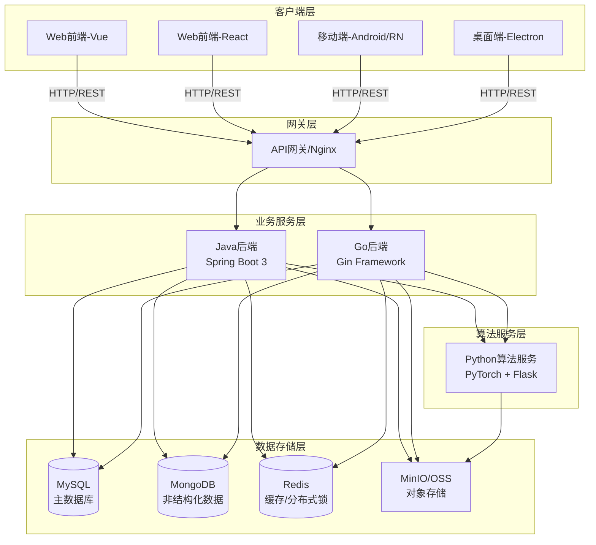

### 2.2 技术架构分层

| 层级 | 技术栈 | 说明 |
|------|--------|------|
| **客户端层** | Vue3/React + TypeScript + Vite | 响应式设计,支持PC/移动端 |
| **网关层** | Nginx | 负载均衡,反向代理 |
| **业务服务层** | Spring Boot 3 / Gin | 用户管理,权限控制,业务逻辑 |
| **算法服务层** | PyTorch + Flask + Gunicorn | 深度学习模型推理,图像处理 |
| **数据存储层** | MySQL + MongoDB + Redis | 关系型/非关系型数据存储 |
| **对象存储层** | MinIO / 阿里云OSS | 图片文件存储 |

## 3. 技术栈详解

### 3.1 前端技术栈

#### 3.1.1 Vue版本 (dehaze-front-vue)
- **核心框架**: Vue 3.4 + Vite 5 + TypeScript 5
- **UI组件库**: Element Plus 2.7
- **状态管理**: Pinia 2.1
- **路由管理**: Vue Router 4.3
- **工具库**: VueUse、Lodash-ES、ECharts 5.5
- **实时通信**: SockJS + StompJS (WebSocket)

#### 3.1.2 React版本 (dehaze-front-react)
- **核心框架**: React 18 + TypeScript + Vite
- **UI组件库**: Ant Design 5.x
- **状态管理**: Redux Toolkit
- **桌面端**: Electron 31
- **样式方案**: UnoCSS

#### 3.1.3 移动端技术
- **UniApp**: 使用uView-plus组件库
- **Taro**: 使用Taroify组件库
- **原生开发**: Android原生开发

### 3.2 后端技术栈

#### 3.2.1 Java后端 (dehaze-java)
- **核心框架**: Spring Boot 3.3 + JDK 17
- **安全框架**: Spring Security 6 + JWT
- **ORM框架**: MyBatis-Plus 3.5
- **数据库**: MySQL 8.0 + MongoDB
- **缓存**: Redis 6.0+ + Redisson分布式锁
- **对象存储**: MinIO 8.5 / 阿里云OSS
- **接口文档**: Knife4j 4.3 (OpenAPI 3)

#### 3.2.2 Go后端 (dehaze-go)
- **核心框架**: Gin + GORM
- **版本要求**: Go 1.20+
- **数据库**: MySQL + MongoDB + Redis
- **安全机制**: JWT + RBAC
- **接口文档**: Swagger

#### 3.2.3 Python算法服务 (dehaze-python)
- **深度学习**: PyTorch 1.7+
- **Web框架**: Flask + Gunicorn
- **容器化**: Docker (NVIDIA CUDA 12.1镜像)
- **依赖管理**: Conda + requirements.txt

## 4. 分层架构设计

### 4.1 前端架构
前端采用组件化架构设计，分为以下几个层次：

```
页面组件层
    ↓
业务组件层
    ↓
基础组件层
    ↓
工具函数层
    ↓
API调用层
    ↓
状态管理层
```

### 4.2 后端架构
后端采用分层架构设计，遵循MVC模式：

```
Controller层 (控制层)
    ↓
Service层 (业务逻辑层)
    ↓
Mapper层 (数据访问层)
    ↓
Model层 (数据模型层)
```

### 4.3 算法服务架构
算法服务采用微服务架构设计：

```
API接口层
    ↓
算法调度层
    ↓
模型加载层
    ↓
图像处理层
    ↓
结果返回层
```

## 5. 数据库设计

### 5.1 数据库选型
系统采用多种数据库技术来满足不同的数据存储需求：

1. **MySQL 8.0**：用于存储结构化数据，如用户信息、权限配置、系统设置等
2. **MongoDB**：用于存储非结构化数据，如日志、配置文件等
3. **Redis**：用于缓存热点数据、会话信息和实现分布式锁

### 5.2 核心数据表设计

#### 5.1.1 系统管理相关

##### 用户管理

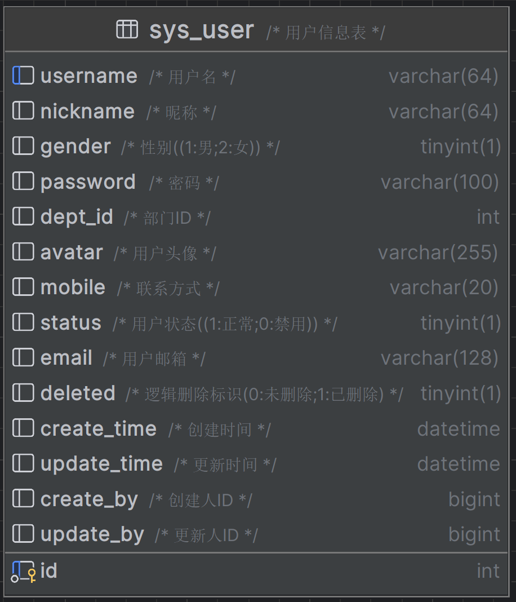

##### 角色管理

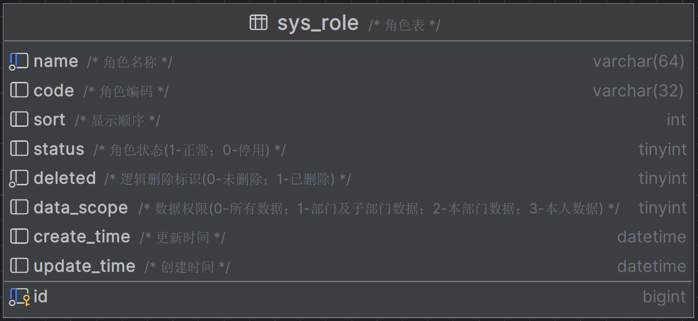

##### 部门管理

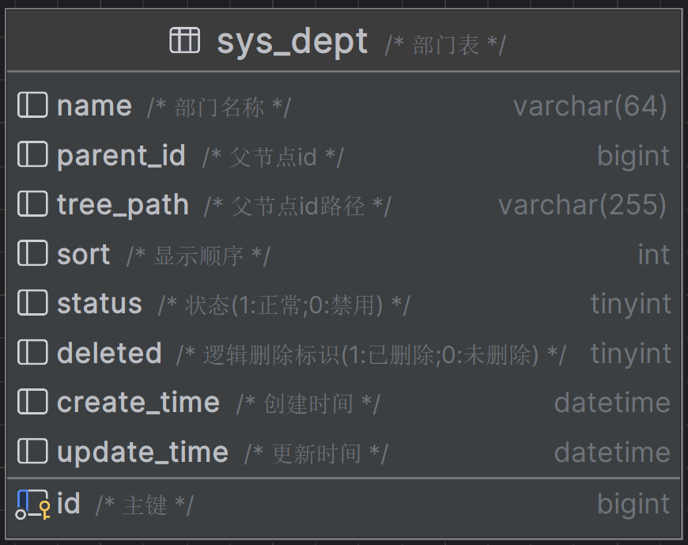

##### 菜单管理

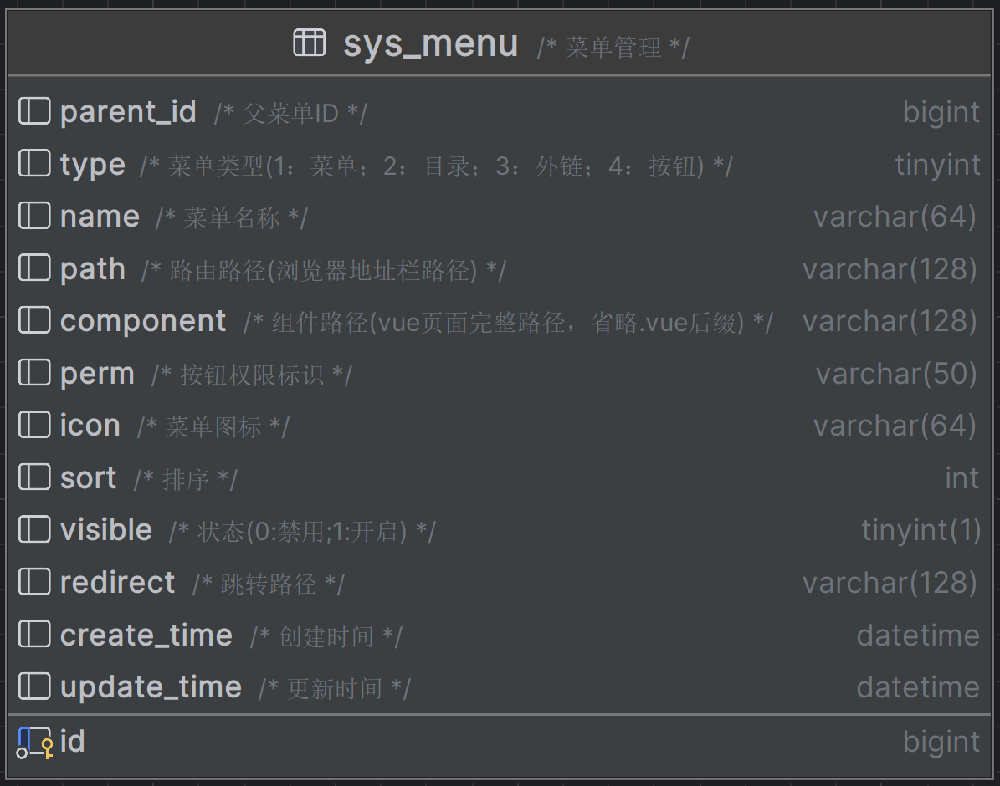

##### 字典管理

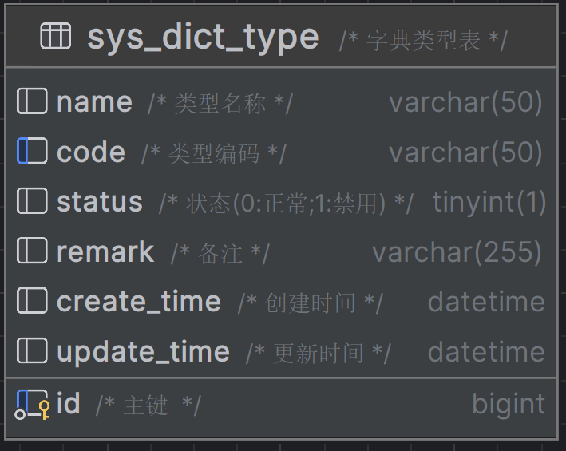

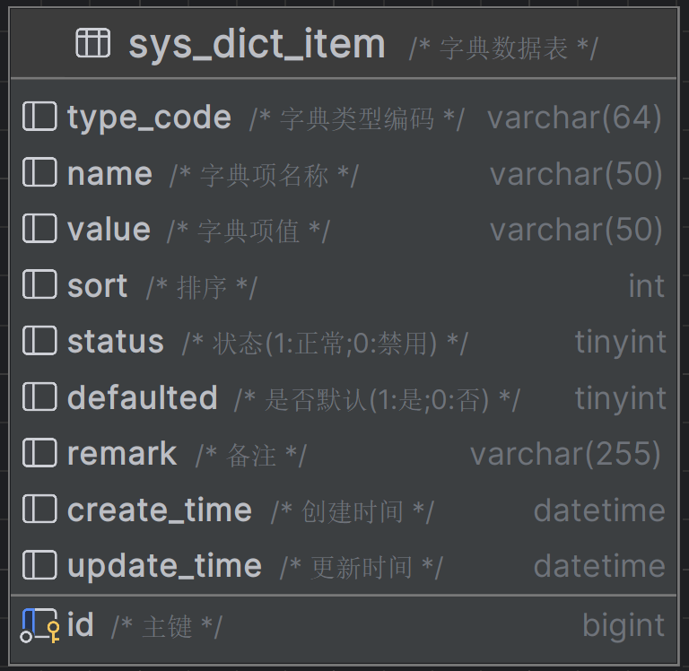

##### 文件管理

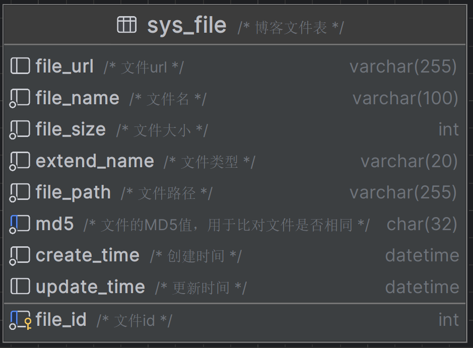

##### 系统日志

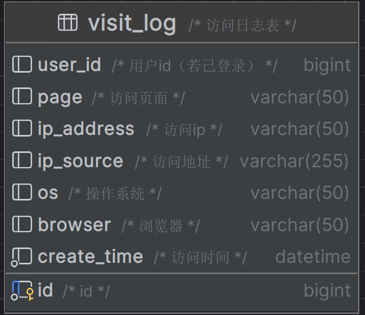

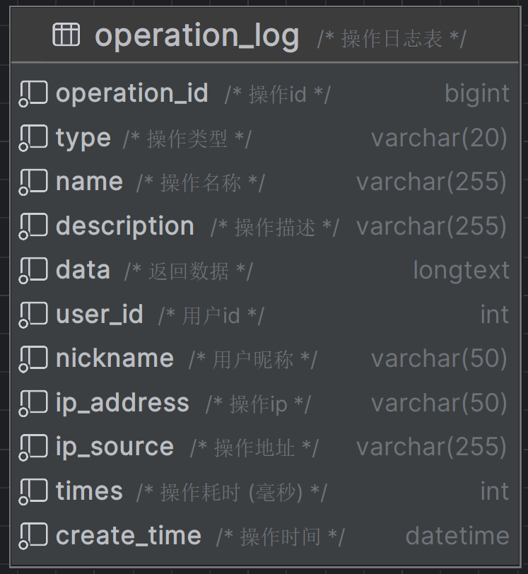

##### 其他

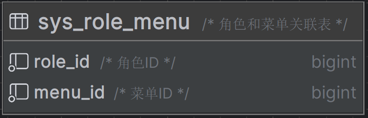

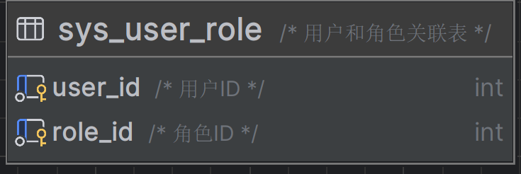

#### 会员管理相关

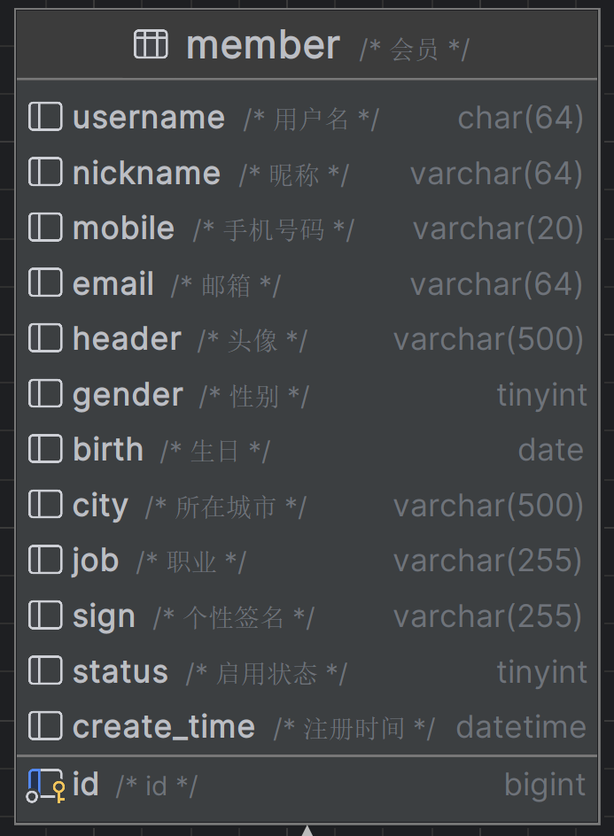

#### 套餐管理相关

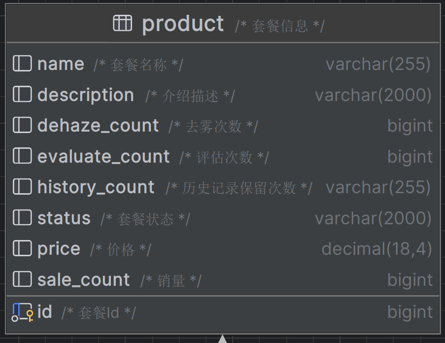

#### 模型管理相关

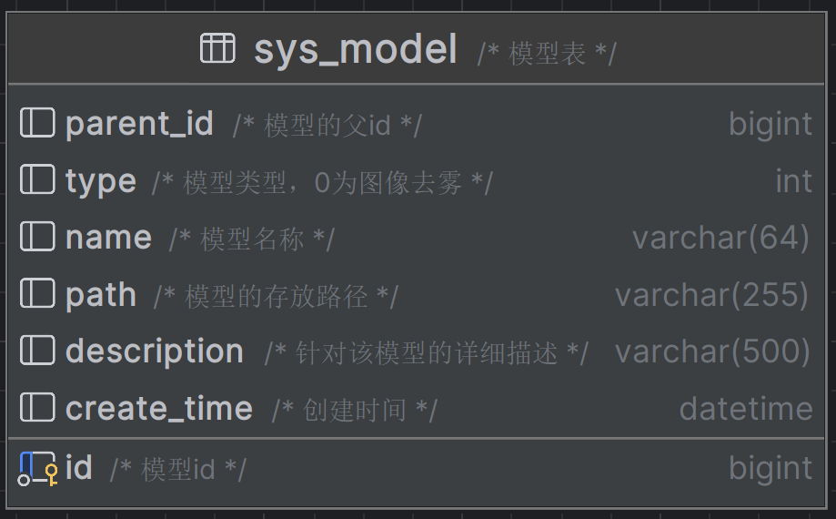

#### 订单管理相关

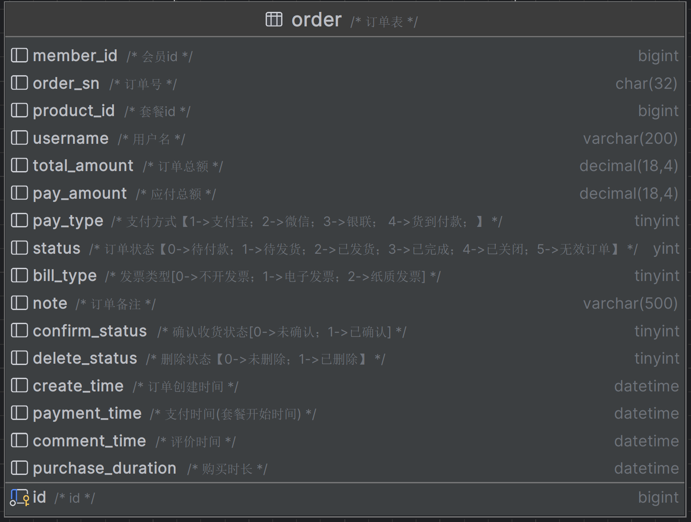

### 5.3 数据库索引设计
- 主键索引：各表id字段
- 唯一索引：用户名、角色编码、字典类型等需要唯一性的字段
- 普通索引：外键字段、经常查询的字段，如部门ID、字典ID等
- 复合索引：根据查询需求创建合适的复合索引

### 5.4 数据库连接池配置
- **最大连接数**：根据系统并发量和数据库处理能力合理配置
- **最小空闲连接数**：保证系统基本运行所需的连接数
- **连接超时时间**：避免连接长时间占用资源
- **空闲连接回收时间**：及时回收空闲连接，释放资源

## 6. 数据流设计

### 6.1 用户请求处理流程
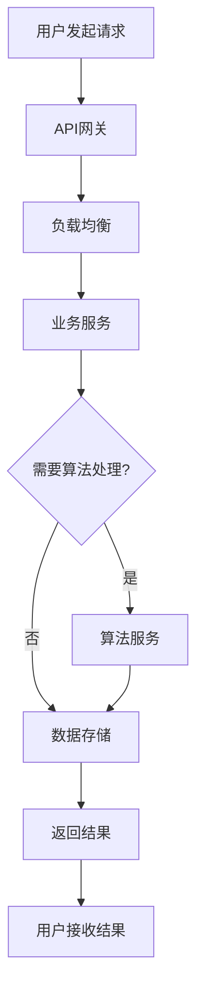

### 6.2 数据存储策略
- **结构化数据**: 存储在MySQL中，如用户信息、权限配置等
- **非结构化数据**: 存储在MongoDB中，如日志、配置等
- **缓存数据**: 存储在Redis中，如会话信息、热点数据等
- **文件数据**: 存储在MinIO/OSS中，如图像文件、模型文件等

### 6.3 数据同步机制
- **实时同步**: 通过数据库触发器或消息队列实现实时数据同步
- **定时同步**: 通过定时任务实现批量数据同步
- **手动同步**: 提供管理界面支持手动触发数据同步

## 7. 安全架构设计

### 7.1 认证授权机制
- **JWT令牌**: 基于JWT实现无状态认证
- **RBAC模型**: 基于角色的访问控制模型
- **权限验证**: 方法级别和接口级别的权限控制

### 7.2 数据安全
- **传输加密**: HTTPS协议保障数据传输安全
- **存储加密**: 敏感数据加密存储
- **访问控制**: 基于角色的数据访问控制

### 7.3 应用安全
- **输入验证**: 防止SQL注入、XSS等攻击
- **防重复提交**: 防止表单重复提交
- **速率限制**: 防止恶意请求和DDoS攻击

## 8. 部署架构设计

### 8.1 部署模式
系统支持多种部署模式：
- **单机部署**: 适用于开发和测试环境
- **集群部署**: 适用于生产环境
- **容器化部署**: 基于Docker和Kubernetes

### 8.2 环境搭建

#### 8.2.1 Docker环境搭建
使用官方脚本安装Docker：
```shell
# 获取并运行安装脚本
curl -fsSL get.docker.com -o get-docker.sh
sudo sh get-docker.sh
# 启动docker服务
systemctl start docker
# 配置docker开机自启
systemctl enable docker
```

配置国内镜像加速：
```json
{
  "registry-mirrors":[
                      "https://o65lma2s.mirror.aliyuncs.com",
                      "http://hub-mirror.c.163.com"
                     ],
  "insecure-registries" :  ["192.168.210.100:5000"]
}
```

#### 8.2.2 MySQL数据库搭建
```bash
docker run --restart=always \
-d \
-p 3307:3306 \
--privileged=true \
-v /opt/docker_volume/mysql/log:/var/log/mysql \
-v /opt/docker_volume/mysql/data:/var/lib/mysql \
-v /opt/docker_volume/mysql/conf:/etc/mysql/conf.d \
-e MYSQL_ROOT_PASSWORD=123456 \
--name mysql \
mysql
```

#### 8.2.3 Redis搭建
```bash
mkdir -p /opt/docker_volume/redis
```

配置Redis：
```bash
docker run --restart=always \
--log-opt max-size=100m \
--log-opt max-file=2 \
-p 6379:6379 \
--name redis \
-v /opt/docker_volume/redis/redis.conf:/etc/redis/redis.conf \
-v /opt/docker_volume/redis/data:/data \
-d redis redis-server /etc/redis/redis.conf  \
--appendonly yes  \
--requirepass 142536aA
```

#### 8.2.4 Nginx搭建
创建挂载目录和配置文件：
```bash
# 创建挂载目录
mkdir -p /opt/docker_volume/nginx/conf && mkdir -p /opt/docker_volume/log && mkdir -p /opt/docker_volume/nginx/html
# 创建文件
touch /opt/docker_volume/nginx/conf/nginx.conf
```

启动Nginx容器：
```bash
docker run --restart=always \
--name nginx \
-p 9531:9531 \
-p 9532:9532 \
-v /opt/docker_volume/nginx/conf/nginx.conf:/etc/nginx/nginx.conf \
-v /opt/docker_volume/nginx/conf/conf.d:/etc/nginx/conf.d \
-v /opt/docker_volume/nginx/log:/var/log/nginx \
-v /opt/docker_volume/nginx/html:/usr/share/nginx/html \
-d nginx
```

### 8.3 部署拓扑
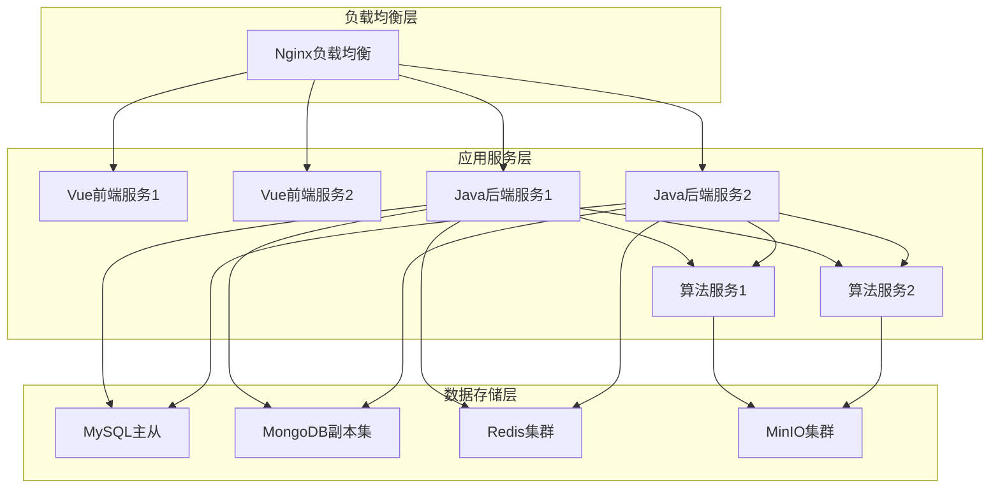

### 8.4 持续集成部署流程

#### 8.4.1 准备工作
1. 开放云服务器80端口，以及一些外部访问必要端口
2. 云服务器安装Jdk1.8、Maven、git等常用工具
3. 数据库初始化，执行SQL脚本创建数据库，并构建初始数据库数据
4. 安装持续集成的服务组件Jenkins，并配置相关插件
5. 代码需要提前上传到代码托管平台gitee上
6. 建立DevOps服务扩展点
7. 建立主机集群用于部署

#### 8.4.2 前端构建
```shell
export PATH=$PATH:~/.npm-global/bin
#设置缓存目录
npm config set cache /npmcache

#nodejs 版本大于等于 18时 可以设置下面的值 
npm config set registry https://repo.huaweicloud.com/repository/npm/
npm config set prefix '~/.npm-global'

#加载依赖
npm install -g pnpm
pnpm install
#默认构建
pnpm run build:prod
#打包
cd dist
tar -zcvf dehaze_front.tar.gz ./**
```

#### 8.4.3 后端构建
```shell
# 功能：  打包
# 参数说明：
#		-Dmaven.test.skip=true：跳过单元测试
#		-U：每次构建检查依赖更新，可避免缓存中快照版本依赖不更新问题，但会牺牲部分性能
#		-e -X ：打印调试信息，定位疑难构建问题时建议使用此参数构建
#		-B：以batch模式运行，可避免日志打印时出现ArrayIndexOutOfBoundsException异常
# 使用场景： 打包项目且不需要执行单元测试时使用
mvn package -Dmaven.test.skip=true -B
```

#### 8.4.4 代码部署

##### 前端部署
```shell
rm -rf /home/earthyzinc/nginx/html/dehaze_front/*
cd /home/earthyzinc/
tar -zxvf dehaze_front.tar.gz -C /home/earthyzinc/nginx/html/dehaze_front
rm -f dehaze_front.tar.gz
```

##### 后端部署
```shell
rm -rf /home/earthyzinc/dehaze-app/*

cd /home/earthyzinc/dehaze-app
nohup /home/earthyzinc/jdk17/bin/java -jar youlai-boot.jar 2>&1 > dehaze_backend.txt &
```

### 8.5 容器化部署
- **Docker镜像**: 每个服务独立构建Docker镜像
- **Kubernetes编排**: 使用K8s进行服务编排和管理
- **服务发现**: 基于K8s内置服务发现机制
- **自动扩缩容**: 根据负载自动调整服务实例数量

## 9. 性能优化架构

### 9.1 前端性能优化
- **资源加载优化**: 组件懒加载、路由懒加载
- **渲染性能优化**: 虚拟滚动、防抖节流
- **网络优化**: 请求合并、CDN加速

### 9.2 后端性能优化
- **数据库优化**: 索引优化、慢SQL优化
- **缓存策略**: 多级缓存、缓存预热
- **并发处理**: 线程池优化、异步处理

### 9.3 算法服务优化
- **模型推理优化**: ONNX Runtime、TensorRT
- **资源管理**: GPU显存管理、模型缓存
- **通信优化**: gRPC替代HTTP、结果异步返回

## 10. 监控和运维架构

### 10.1 监控体系
- **应用监控**: Prometheus + Grafana
- **日志收集**: ELK（Elasticsearch + Logstash + Kibana）
- **链路追踪**: SkyWalking或Zipkin
- **健康检查**: Spring Boot Actuator

### 10.2 运维体系
- **配置管理**: Apollo或Spring Cloud Config
- **服务治理**: Nacos或Consul
- **持续集成**: Jenkins + GitLab CI
- **自动化部署**: Ansible或SaltStack

## 11. 扩展性设计

### 11.1 水平扩展
- **无状态服务**: 业务服务设计为无状态，支持水平扩展
- **数据库分片**: 支持数据库水平分片
- **缓存集群**: Redis集群支持动态扩容

### 11.2 功能扩展
- **插件化架构**: 支持功能模块插件化
- **微服务架构**: 新功能可作为独立微服务开发
- **API网关**: 支持新服务的统一接入

### 11.3 算法扩展
- **动态加载**: 支持新算法模型的动态加载
- **版本管理**: 支持算法版本管理和切换
- **评估机制**: 提供算法效果评估和对比机制