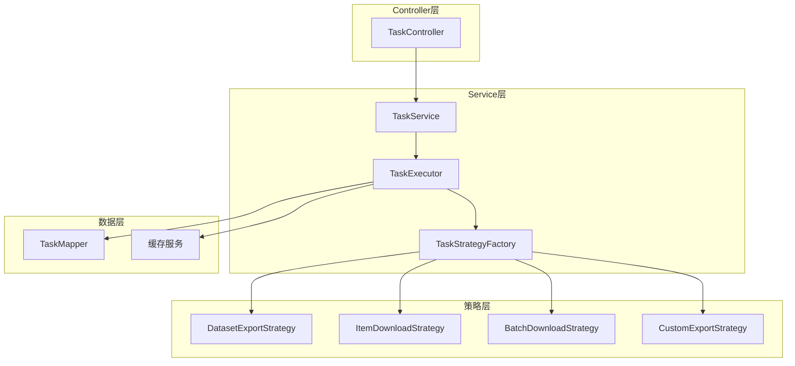
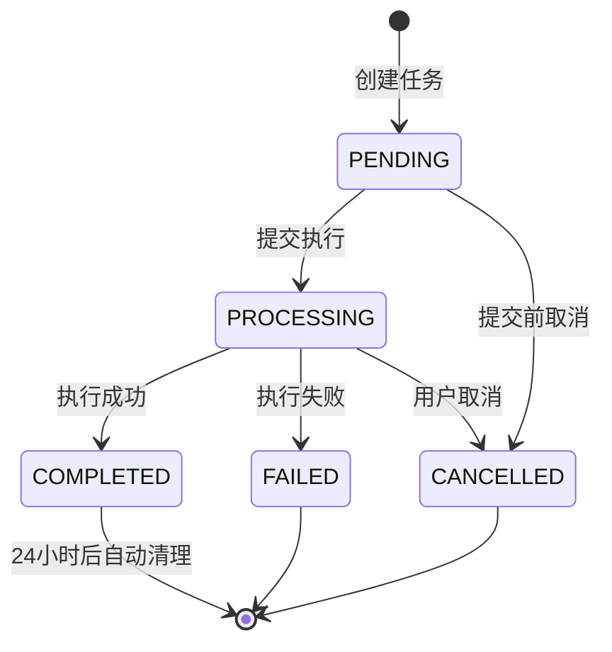
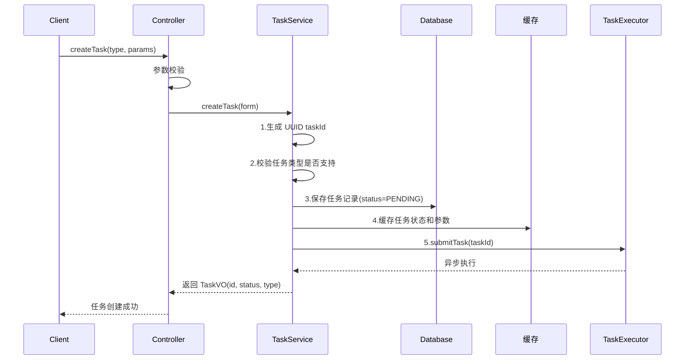
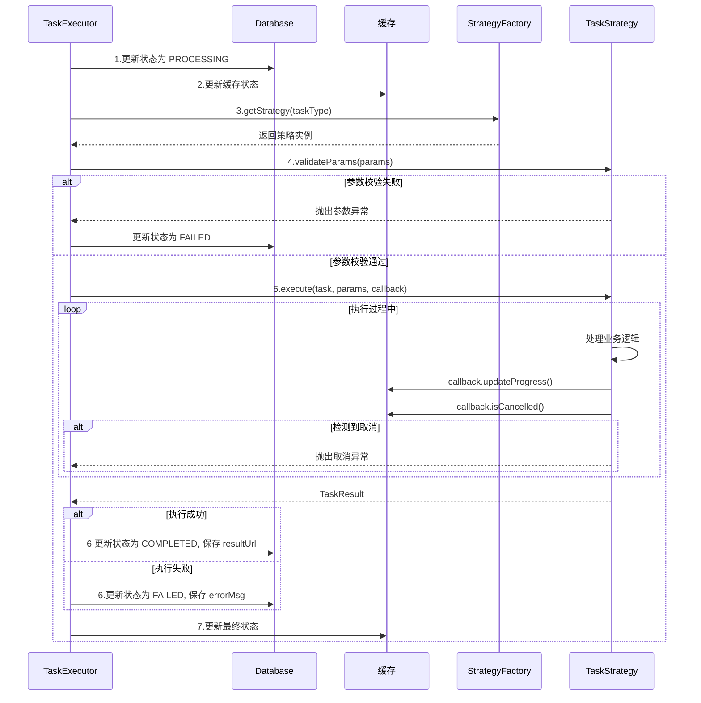
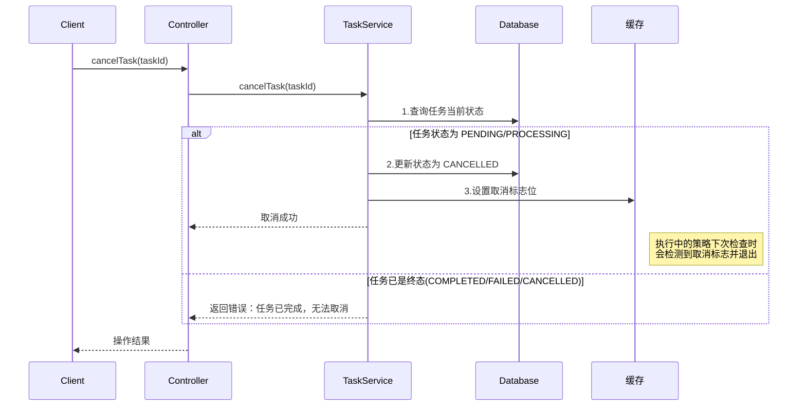
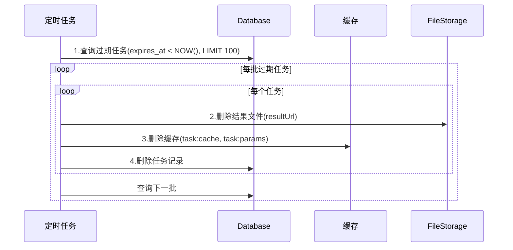

# 任务管理模块 - 后端实现设计

## 1. 文档概述

### 1.1 文档目的

本文档描述任务管理模块的后端实现方案，包括架构设计（策略模式）、核心业务逻辑、异步任务设计、缓存设计等。

### 1.2 相关文档

- **需求规格**：[需求规格.md](./需求规格.md)
- **API 接口**：[API接口.md](./API接口.md)
- **数据库设计**：[03-数据库设计.md](../../../02-系统架构/03-数据库设计.md)
- **测试用例**：[测试用例.md](./测试用例.md)

## 2. 架构设计

### 2.1 模块分层架构

采用策略模式（Strategy Pattern）实现任务执行的解耦，核心思想是将"任务调度"与"任务执行逻辑"分离：



**设计考量**：
- **策略模式**：不同任务类型的执行逻辑差异大（导出 ZIP、下载单文件、调用算法等），统一接口+多实现
- **调度与执行分离**：TaskExecutor 只负责调度（线程管理、状态流转），具体业务由 Strategy 实现
- **工厂模式**：通过 TaskStrategyFactory 自动发现和注册策略，新增任务类型无需修改调度器

### 2.2 核心组件职责

| 组件 | 职责描述 | 关键能力 |
|------|---------|---------|
| TaskService | 任务管理入口 | 任务 CRUD、状态查询、取消任务 |
| TaskExecutor | 任务调度器 | 线程池管理、状态流转控制、进度回调注入 |
| TaskStrategyFactory | 策略工厂 | 自动注册策略、根据类型获取策略实例 |
| TaskStrategy | 策略接口 | 定义任务执行的统一契约 |
| ProgressCallback | 进度回调 | 更新进度、检测取消信号 |

### 2.3 核心接口契约

#### TaskStrategy 策略接口

| 方法 | 入参 | 出参 | 说明 |
|------|------|------|------|
| getTaskType | 无 | 任务类型字符串 | 返回任务类型标识，用于工厂注册 |
| execute | task, params, callback | TaskResult | 执行任务核心逻辑 |
| cancel | task | void | 取消任务，清理中间资源 |
| validateParams | params | void | 验证任务参数，失败抛异常 |

#### ProgressCallback 进度回调接口

| 方法 | 入参 | 出参 | 说明 |
|------|------|------|------|
| updateProgress | current, total, message | void | 更新任务进度（自动计算百分比） |
| isCancelled | 无 | boolean | 检查任务是否被用户取消 |

#### TaskResult 任务结果对象

| 字段 | 类型 | 说明 |
|------|------|------|
| success | boolean | 任务是否执行成功 |
| data | string | 结果数据（如下载 URL、导出文件路径） |
| errorMessage | string | 失败时的错误信息 |
| metadata | map | 附加元数据（如文件大小、处理数量） |

### 2.4 策略工厂机制

| 职责 | 实现方式 | 说明 |
|------|---------|------|
| 策略注册 | 启动时自动扫描 | 收集所有 TaskStrategy 实现，按 taskType 建立映射 |
| 策略获取 | 类型映射查找 | 根据任务类型返回策略实例，未找到则抛异常 |
| 类型查询 | 返回注册列表 | 提供所有已注册的任务类型，用于前端展示或校验 |

**扩展点**：新增任务类型只需实现 TaskStrategy 接口并注册到容器，工厂自动发现。

### 2.5 已实现的策略

| 策略名称 | 任务类型 | 功能描述 | 依赖服务 |
|---------|---------|---------|---------|
| DatasetExportStrategy | `dataset_export` | 数据集导出为 ZIP 压缩包 | 文件服务、数据集服务 |
| ItemDownloadStrategy | `item_download` | 单数据项下载 | 文件服务 |
| BatchDownloadStrategy | `batch_download` | 批量下载（多数据项打包） | 文件服务 |
| CustomExportStrategy | `custom_export` | 自定义格式导出 | 文件服务、算法服务 |

## 3. 核心业务逻辑

### 3.1 状态流转



#### 状态定义

| 状态 | 存储值 | 说明 | 可流转到 |
|------|--------|------|---------|
| 待执行 | `PENDING` | 任务已创建，等待线程池调度 | `PROCESSING`、`CANCELLED` |
| 执行中 | `PROCESSING` | 任务正在执行 | `COMPLETED`、`FAILED`、`CANCELLED` |
| 已完成 | `COMPLETED` | 任务执行成功，结果可下载 | - (终态) |
| 已失败 | `FAILED` | 任务执行失败，记录错误信息 | - (终态) |
| 已取消 | `CANCELLED` | 任务被用户主动取消 | - (终态) |

#### 状态转换规则

| 转换 | 触发条件 | 前置检查 |
|------|---------|---------|
| PENDING → PROCESSING | 线程池开始执行 | 无 |
| PROCESSING → COMPLETED | 策略执行成功返回 | 无 |
| PROCESSING → FAILED | 策略抛出异常 | 无 |
| PROCESSING → CANCELLED | 检测到取消标志位 | 无 |
| PENDING → CANCELLED | 用户取消未开始的任务 | 任务仍在队列中 |

### 3.2 关键流程

#### 任务创建流程



**关键决策点**：
1. **UUID 作为任务 ID**：避免自增 ID 可猜测性，提升安全性
2. **创建即提交**：简化用户操作，无需单独触发执行
3. **同步返回**：创建后立即返回任务信息，执行在后台进行
4. **状态缓存**：减少数据库查询压力，支持高频进度轮询

#### 任务执行流程



**关键决策点**：
1. **状态先更新**：进入执行前先将状态改为 processing，防止重复调度
2. **参数二次校验**：策略内部再次校验，确保参数完整性
3. **进度轮询检测取消**：每次更新进度时检查取消标志
4. **异常统一处理**：任何异常都捕获并转为 failed 状态

#### 任务取消流程



**取消检测机制详解**：

| 阶段 | 检测方式 | 处理行为 |
|------|---------|---------|
| 队列等待中 | 状态判断 | 直接更新为 CANCELLED |
| 执行过程中 | 缓存标志位 | 策略定期检查，检测到后抛出取消异常 |
| 已完成/失败 | 状态判断 | 拒绝取消，返回错误提示 |

### 3.3 核心业务规则

| 规则 | 校验条件 | 触发时机 | 错误提示 |
|------|---------|---------|---------|
| 任务类型校验 | type 在已注册策略列表中 | 创建任务时 | 不支持的任务类型 |
| 目标资源存在性 | targetId 对应资源存在 | 策略执行前 | 数据集/数据项不存在 |
| 数据集非空校验 | 数据集包含至少一个数据项 | 导出策略执行前 | 数据集为空，无法导出 |
| 取消状态校验 | 当前状态为 pending/processing | 取消任务时 | 任务已完成，无法取消 |
| 并发任务限制 | 同用户同类型未完成任务数 ≤ 5 | 创建任务时 | 任务数量已达上限，请等待 |

### 3.4 事务边界

| 操作 | 事务级别 | 事务范围 | 说明 |
|------|---------|---------|------|
| 创建任务 | REQUIRED | 任务记录写入 | 写入后立即提交，异步执行在事务外 |
| 更新状态 | REQUIRED | 单表更新 | 状态变更立即可见 |
| 批量清理 | REQUIRES_NEW | 独立事务 | 清理失败不影响其他业务 |

**设计考量**：
- 任务创建与执行分离，创建事务不等待执行完成
- 状态更新使用独立事务，避免长事务锁表
- 定时清理使用独立事务，批量删除分批提交

### 3.5 幂等性与并发控制

| 场景 | 问题 | 解决方案 |
|------|------|---------|
| 重复创建相同任务 | 资源浪费 | 检查近期同参数任务，提示复用已有任务 |
| 并发取消同一任务 | 状态混乱 | 数据库乐观锁，WHERE status IN (pending, processing) |
| 任务重复执行 | 结果覆盖 | 执行前检查状态，非 pending 则跳过 |

## 4. 数据访问与数据依赖

> 表结构定义详见 [数据库设计.md](../../../02-系统架构/03-数据库设计.md)

### 4.1 依赖表清单

| 表名 | 关联方式 | 说明 |
|------|---------|------|
| sys_task | 主表 | 任务记录表 |
| sys_dataset | 外键关联 | 数据集导出时查询数据集信息 |
| sys_dataset_item | 外键关联 | 导出时遍历数据集下的数据项 |
| sys_item_file | 外键关联 | 获取数据项关联的文件 |

### 4.2 关键字段约束

| 字段 | 约束 | 业务含义 |
|------|------|---------|
| task_id | UNIQUE | UUID 格式，对外暴露的任务标识 |
| status | ENUM(5) | 仅允许状态机定义的 5 种状态 |
| expires_at | NOT NULL | 任务过期时间，默认创建时间 +7 天 |
| user_id | NOT NULL | 任务所属用户，用于权限控制 |

### 4.3 核心查询方法

| 查询方法 | 查询条件 | 索引依赖 | 说明 |
|---------|---------|---------|------|
| 根据 taskId 查询 | task_id = ? | task_id 唯一索引 | 获取任务详情 |
| 用户任务列表 | user_id = ? AND status IN (...) | user_id + status 联合索引 | 我的任务列表 |
| 过期任务查询 | expires_at < NOW() | expires_at 索引 | 定时清理使用 |
| 待执行任务查询 | status = 'pending' | status 索引 | 服务重启后恢复 |

### 4.4 查询优化要点

| 场景 | 优化措施 |
|------|---------|
| 任务列表分页 | 联合索引 (user_id, status, create_time DESC) |
| 过期清理 | 分批查询删除，每批 100 条 |
| 进度查询 | 优先走缓存，缓存未命中再查库 |

## 5. 缓存设计

### 5.1 缓存 Key 规范

| 缓存对象 | Key 格式 | TTL | 用途 |
|---------|---------|------|------|
| 任务状态 | `task:cache:{taskId}` | 7 天 | 存储任务完整状态，支持高频查询 |
| 取消标志 | `task:cancel:{taskId}` | 1 小时 | 标记任务被取消，执行中策略检测 |
| 任务参数 | `task:params:{taskId}` | 7 天 | 存储任务参数，执行时读取 |
| 进度信息 | `task:progress:{taskId}` | 1 小时 | 存储实时进度，前端轮询读取 |

### 5.2 缓存更新规则

| 操作 | 缓存行为 |
|------|---------|
| 创建任务 | 写入 task:cache、task:params |
| 更新状态 | 覆盖 task:cache |
| 更新进度 | 覆盖 task:progress |
| 取消任务 | 写入 task:cancel |
| 任务过期 | 删除 task:cache、task:params、task:progress |

### 5.3 缓存一致性策略

| 场景 | 问题 | 解决方案 |
|------|------|---------|
| 数据库更新后缓存未同步 | 查询到旧状态 | Write-Through，更新数据库后立即更新缓存 |
| 并发更新同一任务 | 缓存数据错乱 | 分布式锁（按 taskId） |
| 缓存雪崩 | 大量缓存同时失效 | TTL 随机化（±10%） |
| 缓存穿透 | 查询不存在的任务 | 空值缓存 5 分钟 |

### 5.4 缓存读写流程

**状态查询流程**：
```
查询缓存 task:{taskId}
├─ 命中 → 直接返回
└─ 未命中 → 查询数据库
           ├─ 存在 → 写入缓存，返回
           └─ 不存在 → 写入空值缓存(5min)，返回 404
```

**进度更新流程**：
```
1. 更新数据库 progress 字段
2. 覆盖缓存 task:progress:{taskId}
3. 覆盖缓存 task:cache:{taskId}（含进度）
```

## 6. 异步任务设计

### 6.1 线程池配置

| 参数 | 默认值 | 说明 | 调优建议 |
|------|--------|------|---------|
| 核心线程数 | 2 | 常驻线程 | CPU 核心数的 0.5-1 倍 |
| 最大线程数 | 4 | 峰值线程 | 核心线程数的 2 倍 |
| 队列容量 | 100 | 等待队列 | 根据内存和任务平均耗时调整 |
| 空闲存活时间 | 60s | 非核心线程回收 | 根据任务频率调整 |
| 拒绝策略 | CallerRunsPolicy | 队列满时处理 | 确保任务不丢失 |

**线程池选型考量**：
- 任务类型为 IO 密集型（文件读写、网络传输），线程数可适当增加
- 队列使用有界队列，防止内存溢出
- 拒绝策略使用 CallerRunsPolicy，降级为同步执行而非丢弃

### 6.2 进度回调机制

| 职责 | 说明 |
|------|------|
| 进度计算 | 根据 current/total 计算百分比 |
| 频率控制 | 每 5 秒或进度变化 >5% 时才实际更新 |
| 取消检测 | 每次更新时检查取消标志位 |
| 消息记录 | 可选的进度消息（如"正在处理第 3/10 个文件"） |

**频率控制的必要性**：
- 避免高频更新造成数据库/缓存压力
- 前端轮询间隔通常为 1-2 秒，更新过频无意义

### 6.3 定时任务

| 任务 | Cron 表达式 | 说明 |
|------|------------|------|
| 过期任务清理 | `0 0 3 * * ?` | 每天凌晨 3 点执行 |

#### 清理流程



**清理策略**：
- 分批处理，每批 100 条，避免长时间锁表
- 先删文件后删记录，文件删除失败不影响记录删除（孤儿文件可后续清理）

### 6.4 服务重启恢复

| 场景 | 处理方式 |
|------|---------|
| pending 状态任务 | 重新提交到线程池 |
| processing 状态任务 | 标记为 failed（无法恢复执行上下文） |

## 7. 安全设计

> 权限标识详见 [API接口.md](./API接口.md)

### 7.1 数据权限

| 操作 | 权限规则 |
|------|---------|
| 查看任务 | 仅能查看自己创建的任务 |
| 取消任务 | 仅能取消自己创建的任务 |
| 下载结果 | 仅能下载自己任务的结果 |
| 管理员 | 可查看/操作所有任务 |

### 7.2 安全防护

| 防护项 | 威胁 | 实现方式 |
|--------|------|---------|
| taskId 不可猜测 | 任务遍历 | 使用 UUID，非自增 ID |
| 结果文件访问控制 | 越权下载 | 下载前校验任务归属 |
| 任务参数校验 | 恶意参数注入 | 策略内部严格校验 |
| 并发任务限制 | 资源耗尽 | 同用户同类型任务数限制 |

## 8. 性能目标

### 8.1 性能指标

| 接口 | 目标 P99 | 约束条件 | 说明 |
|------|---------|---------|------|
| 创建任务 | < 200ms | - | 仅写入记录和提交线程池 |
| 查询任务状态 | < 50ms | 走缓存 | 支持高频轮询 |
| 取消任务 | < 200ms | - | 状态更新 + 缓存写入 |
| 任务列表 | < 500ms | 分页 ≤20 条 | 分页查询 |

### 8.2 优化措施

| 优化项 | 实现方式 | 收益 |
|--------|---------|------|
| 状态缓存 | Redis 缓存任务状态 | 查询 QPS 提升 10x |
| 进度批量更新 | 频率控制，每 5s 更新一次 | 减少数据库写入 |
| 分批清理 | 定时任务分批处理 | 避免长事务 |
| 异步执行 | 线程池异步 | 创建接口快速返回 |

## 9. 配置项

| 配置项 | 说明 | 默认值 | 是否必填 |
|--------|------|--------|---------|
| `task.expire.seconds` | 任务过期时间（秒） | 604800 (7天) | 否 |
| `task.cache.prefix` | 任务缓存 Key 前缀 | task:cache: | 否 |
| `task.cancel.prefix` | 取消标志 Key 前缀 | task:cancel: | 否 |
| `task.executor.core-size` | 线程池核心线程数 | 2 | 否 |
| `task.executor.max-size` | 线程池最大线程数 | 4 | 否 |
| `task.executor.queue-capacity` | 任务队列容量 | 100 | 否 |
| `task.executor.keep-alive` | 线程空闲存活时间 | 60s | 否 |
| `task.progress.update.interval` | 进度更新最小间隔（毫秒） | 5000 | 否 |
| `task.cleanup.cron` | 过期清理 Cron 表达式 | 0 0 3 * * ? | 否 |
| `task.max.concurrent.per.user` | 单用户最大并发任务数 | 5 | 否 |
