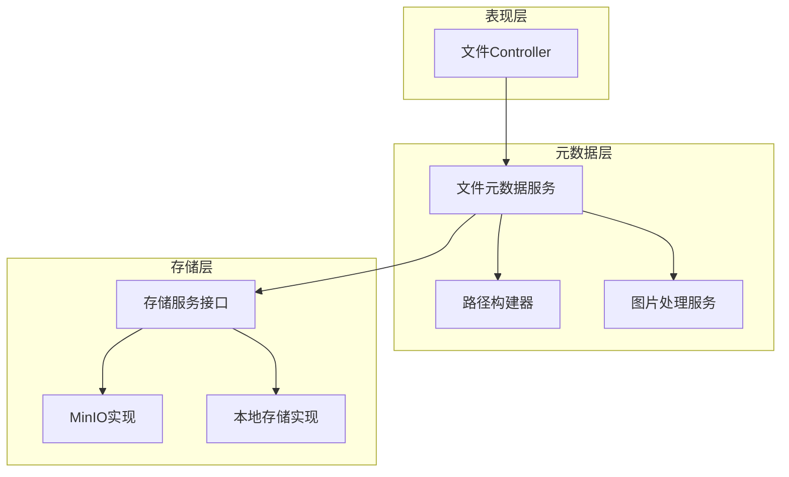
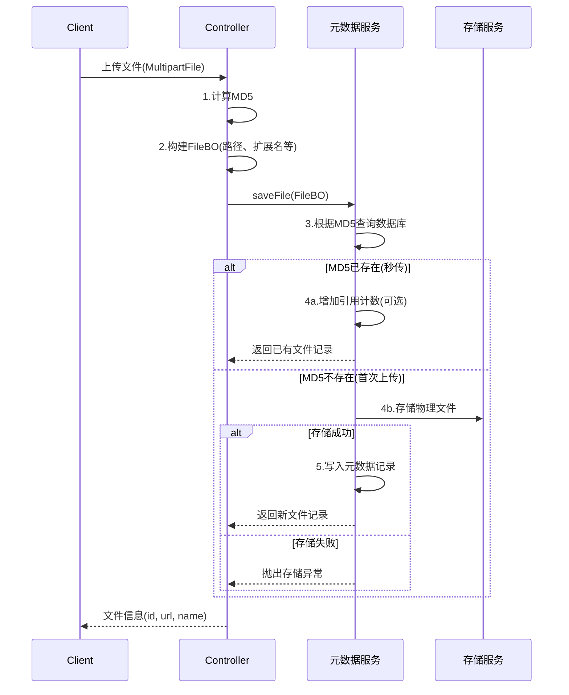
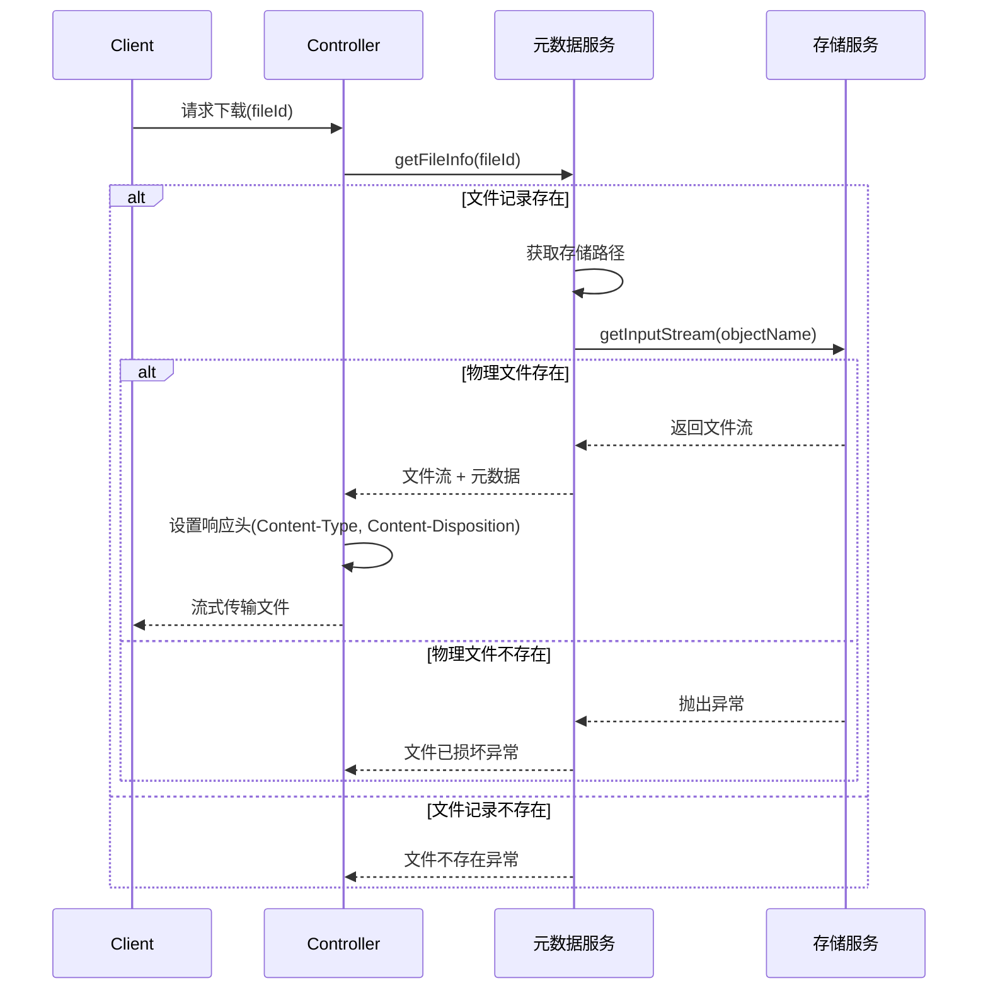
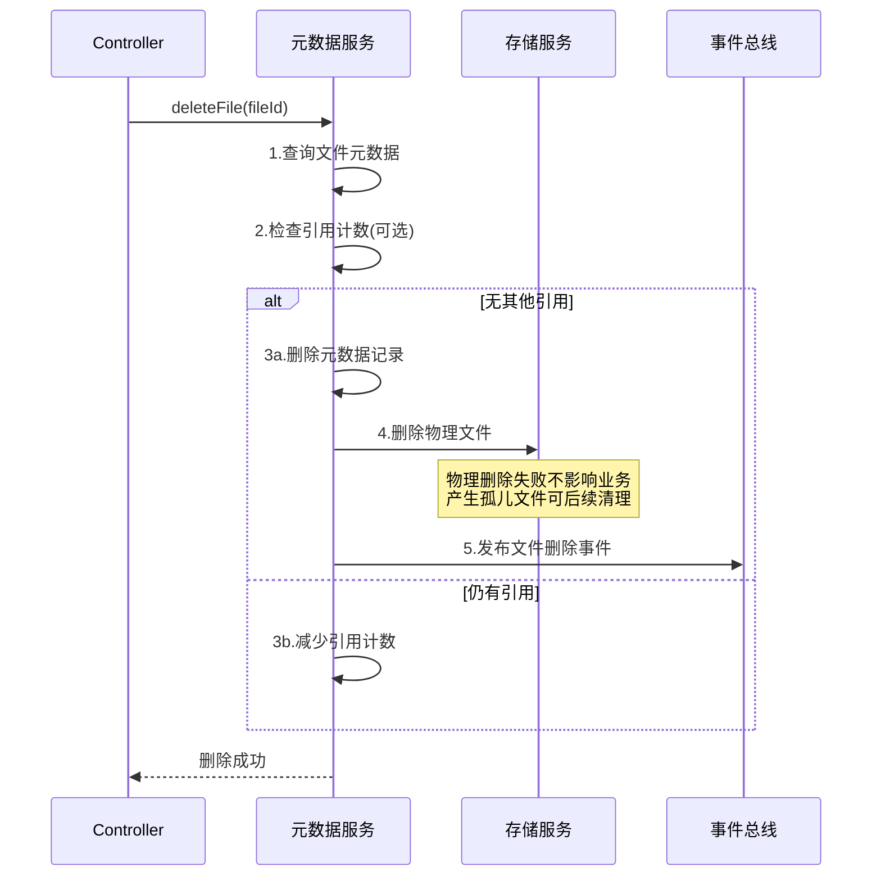

# 文件管理模块 - 后端实现设计

## 1. 文档概述

### 1.1 文档目的

本文档描述文件管理模块的后端实现方案，包括分层架构设计、核心业务逻辑、存储策略模式、MD5 去重机制等。

### 1.2 相关文档

- **需求规格**：[需求规格.md](./需求规格.md)
- **API 接口**：[API 接口.md](./API接口.md)
- **数据库设计**：[03-数据库设计.md](../../../02-系统架构/03-数据库设计.md)
- **测试用例**：[测试用例.md](./测试用例.md)

## 2. 架构设计

### 2.1 分层架构

文件管理模块采用三层架构，元数据层负责业务逻辑，存储层通过策略模式实现后端可切换：

**设计考量**：

- 元数据与物理存储分离，元数据存数据库，物理文件存对象存储
- 策略模式允许运行时切换存储后端，便于开发/生产环境适配
- 路径构建器统一命名规范，避免路径逻辑散落各处

### 2.2 核心组件职责

| 组件            | 职责描述      | 关键能力                            |
| --------------- | ------------- | ----------------------------------- |
| 文件 Controller | HTTP 请求处理 | 参数校验、文件流读取、响应封装      |
| 文件元数据服务  | 业务逻辑编排  | MD5 去重判断、元数据 CRUD、事务控制 |
| 路径构建器      | 存储路径生成  | 日期目录、MD5 命名、扩展名提取      |
| 图片处理服务    | 图片专用处理  | 格式校验、宽高解析、缩略图生成      |
| 存储服务接口    | 物理存储抽象  | 上传、下载、删除、存在性检查        |

### 2.3 存储策略模式

#### 设计原理

存储后端差异大（本地文件系统 vs 对象存储 vs 云存储），但上层业务逻辑一致。通过策略模式：

1. 定义统一的存储接口契约
2. 不同存储后端实现相同接口
3. 运行时根据配置注入具体实现

#### 存储接口契约

| 方法     | 入参           | 出参     | 说明               |
| -------- | -------------- | -------- | ------------------ |
| upload   | 文件流、对象名 | 访问 URL | 上传文件到存储后端 |
| download | 对象名         | 文件流   | 获取文件内容流     |
| delete   | 对象名         | 是否成功 | 删除物理文件       |
| exists   | 对象名         | 是否存在 | 检查文件是否存在   |
| getUrl   | 对象名         | 访问 URL | 获取文件访问地址   |

#### 已实现的存储策略

| 配置值  | 存储后端       | 特点                | 适用场景             |
| ------- | -------------- | ------------------- | -------------------- |
| `minio` | MinIO 对象存储 | S3 兼容、支持分布式 | 生产环境、需要高可用 |
| `local` | 本地文件系统   | 简单直接、无依赖    | 开发环境、单机部署   |

**扩展点**：新增存储后端只需实现存储接口，并在策略工厂中注册。

## 3. 内部领域对象

> API 层 DTO（Query/Form/VO）定义详见 [API 接口.md](./API接口.md)

### 3.1 FileBO (文件业务对象)

Service 层内部使用，封装文件上传过程中的中间状态，生命周期仅限于单次请求：

| 字段       | 类型     | 说明                                                  |
| ---------- | -------- | ----------------------------------------------------- |
| file       | 临时文件 | 上传的原始文件（处理完成后删除）                      |
| name       | 字符串   | 原始文件名（用户上传时的名称）                        |
| objectName | 字符串   | 存储对象名（含路径，如 `upload/20250119/abc123.jpg`） |
| extension  | 字符串   | 文件扩展名（小写，如 `jpg`）                          |
| md5        | 字符串   | MD5 哈希值（32 位十六进制）                           |
| path       | 字符串   | 存储路径（相对路径，用于数据库记录）                  |
| size       | 长整型   | 文件大小（字节）                                      |
| url        | 字符串   | 访问 URL（完整地址）                                  |

**设计考量**：将文件处理过程中的中间数据封装为对象，避免方法参数过多，便于扩展。

## 4. 核心业务逻辑

### 4.1 关键流程

#### 文件上传流程

**关键决策点**：

1. MD5 计算在 Controller 层完成，避免 Service 层依赖文件流
2. 秒传判断在写入前完成，减少无效存储操作
3. 物理存储失败不会产生孤儿元数据（事务回滚）

#### 文件下载流程

#### 文件删除流程

### 4.2 MD5 去重机制

#### 处理流程

| 阶段      | 操作                     | 说明                       |
| --------- | ------------------------ | -------------------------- |
| 1. 计算   | 读取文件流计算 MD5       | 使用流式计算，避免内存溢出 |
| 2. 查询   | SELECT ... WHERE md5 = ? | 命中索引，毫秒级响应       |
| 3. 命中   | 返回已有记录             | 秒传，不存储物理文件       |
| 4. 未命中 | 存储文件 + 写入记录      | 首次上传完整流程           |

#### 并发上传同一文件处理

当多个请求同时上传相同文件（MD5 相同）时：

| 场景     | 处理策略     | 说明                                 |
| -------- | ------------ | ------------------------------------ |
| 并发查询 | 乐观处理     | 多个请求同时查询 MD5，可能都未命中   |
| 并发写入 | 唯一索引约束 | 数据库 MD5 唯一索引保证只有一条记录  |
| 写入冲突 | 捕获异常重查 | 唯一键冲突时，重新查询返回已有记录   |
| 物理文件 | 幂等覆盖     | 相同对象名重复上传，存储服务幂等处理 |

#### 边界情况

| 场景              | 处理方式                            |
| ----------------- | ----------------------------------- |
| 0 字节文件        | 正常计算 MD5，允许上传              |
| 超大文件（>50MB） | Controller 层拦截，抛出文件过大异常 |
| MD5 碰撞          | 理论存在但概率极低，不做特殊处理    |

### 4.3 图片处理逻辑

图片处理服务负责图片类型文件的额外处理：

| 处理项     | 触发条件         | 处理内容                           |
| ---------- | ---------------- | ---------------------------------- |
| 格式校验   | 扩展名为图片类型 | 验证实际内容与扩展名是否匹配       |
| 宽高解析   | 图片文件         | 读取图片元数据获取宽高，存入数据库 |
| 缩略图生成 | 配置开启时       | 生成指定尺寸的缩略图，独立存储     |

**处理顺序**：格式校验 → 宽高解析 → 物理存储 → 缩略图生成（异步可选）

### 4.4 核心业务规则

| 规则           | 校验条件             | 处理方式     | 说明               |
| -------------- | -------------------- | ------------ | ------------------ |
| 文件大小限制   | size ≤ 50MB          | 超限抛出异常 | 可通过配置调整     |
| 文件类型白名单 | 扩展名在允许列表     | 非法类型拒绝 | jpg/png/gif/pdf 等 |
| 文件名安全     | 不含 `../`、`\0`     | 过滤或拒绝   | 防止路径遍历       |
| MD5 唯一性     | 数据库唯一索引       | 秒传/去重    | 核心去重逻辑       |
| 路径规范化     | 标准化后在基础路径内 | 非法路径拒绝 | 防止目录穿越       |

### 4.5 事务边界

| 操作     | 事务级别 | 事务范围              | 说明                                     |
| -------- | -------- | --------------------- | ---------------------------------------- |
| 文件查询 | 只读事务 | 单次查询              | 优化数据库连接                           |
| 文件上传 | 读写事务 | MD5 查询 → 元数据写入 | 不含物理存储（存储失败可重试）           |
| 文件删除 | 读写事务 | 元数据删除            | 物理删除在事务外（允许孤儿文件后续清理） |
| 批量操作 | 读写事务 | 整批元数据操作        | 原子性保证                               |

**设计考量**：

- 物理存储操作放在事务外，避免长事务
- 存储失败回滚事务，不产生孤儿元数据
- 元数据删除成功但物理删除失败，产生的孤儿文件由定时任务清理

### 4.6 事件驱动机制

通过领域事件解耦文件服务与业务模块：

| 事件类型     | 触发时机       | 事件内容               | 消费者处理         |
| ------------ | -------------- | ---------------------- | ------------------ |
| 文件创建事件 | 文件保存成功后 | 文件 ID、MD5、大小     | 更新数据集统计缓存 |
| 文件删除事件 | 文件删除成功后 | 文件 ID、关联数据集 ID | 更新数据集统计缓存 |

**事件发布时机**：在事务提交后发布，保证事件与数据一致。

## 5. 数据访问与数据依赖

> 表结构定义详见 [数据库设计.md](../../../02-系统架构/03-数据库设计.md)

### 5.1 依赖表清单

| 表名         | 关联方式 | 说明                         |
| ------------ | -------- | ---------------------------- |
| sys_file     | 主表     | 文件元数据存储               |
| sys_wpx_file | 左连接   | WPX 格式转换映射（可选功能） |

### 5.2 关键字段约束

| 字段 | 约束     | 业务含义                       |
| ---- | -------- | ------------------------------ |
| md5  | 唯一索引 | 实现文件去重，查询性能关键     |
| path | 非空     | 物理文件定位，丢失则无法下载   |
| name | 非空     | 原始文件名，用于下载时的文件名 |
| size | 非空     | 文件大小，用于传输进度计算     |

### 5.3 核心查询方法

| 查询方法      | 查询条件    | 索引依赖     | 说明                 |
| ------------- | ----------- | ------------ | -------------------- |
| 根据 ID 查询  | id = ?      | 主键索引     | 下载、删除时使用     |
| 根据 MD5 查询 | md5 = ?     | md5 唯一索引 | 去重判断，必须走索引 |
| 分页列表      | 无/条件筛选 | 根据筛选条件 | 后台管理列表         |
| 批量查询      | id IN (...) | 主键索引     | 批量下载、打包导出   |

### 5.4 查询优化要点

| 场景         | 优化措施                       |
| ------------ | ------------------------------ |
| MD5 去重查询 | 必须命中唯一索引，禁止全表扫描 |
| 大文件下载   | 流式读取，不加载到内存         |
| 批量操作     | 控制批次大小（建议 100 条/批） |

## 6. 外部服务集成

### 6.1 MinIO 对象存储

#### 调用配置

| 配置项     | 说明       | 默认值                |
| ---------- | ---------- | --------------------- |
| endpoint   | 服务地址   | http://localhost:9000 |
| access-key | 访问密钥   | admin                 |
| secret-key | 凭据密钥   | -                     |
| bucket     | 存储桶名称 | dehaze                |

#### 调用参数

| 参数     | 值  | 说明                   |
| -------- | --- | ---------------------- |
| 连接超时 | 10s | 建立连接的超时时间     |
| 读取超时 | 60s | 大文件读取需要较长时间 |
| 写入超时 | 60s | 大文件上传需要较长时间 |
| 重试次数 | 1   | 失败后重试一次         |

### 6.2 降级策略

| 场景           | 检测方式   | 降级行为           | 用户提示             |
| -------------- | ---------- | ------------------ | -------------------- |
| MinIO 连接失败 | 连接超时   | 抛出异常，记录日志 | 文件服务暂时不可用   |
| 存储桶不存在   | 启动时检查 | 自动创建           | 无                   |
| 上传失败       | 异常捕获   | 重试 1 次后抛出    | 文件上传失败，请重试 |
| 下载文件不存在 | 404 响应   | 抛出业务异常       | 文件不存在或已被删除 |
| 存储空间不足   | 写入失败   | 抛出异常，告警     | 系统存储空间不足     |

### 6.3 文件存储路径规则

| 路径类型   | 格式                            | 示例                                   | 说明                   |
| ---------- | ------------------------------- | -------------------------------------- | ---------------------- |
| 上传路径   | `upload/{yyyyMMdd}/{md5}.{ext}` | `upload/20250119/abc123.jpg`           | 按日期分目录，MD5 命名 |
| 缩略图路径 | `thumbnail/{originPath}`        | `thumbnail/upload/20250119/abc123.jpg` | 与原图路径对应         |
| 导出路径   | `exports/{taskId}.zip`          | `exports/task-001.zip`                 | 导出任务专用           |
| 临时路径   | `temp/{uuid}`                   | `temp/550e8400-e29b...`                | 处理中的临时文件       |

**命名规则设计考量**：

- 日期目录：便于按时间清理、统计
- MD5 命名：保证唯一性，支持去重
- 扩展名保留：便于识别文件类型、设置 Content-Type

## 7. 安全设计

> 权限标识详见 [API 接口.md](./API接口.md)

### 7.1 安全防护

| 防护项       | 威胁           | 实现方式                         |
| ------------ | -------------- | -------------------------------- |
| 路径遍历防护 | 目录穿越攻击   | 路径标准化后校验是否在基础路径内 |
| 文件名校验   | 恶意文件名注入 | 正则过滤 `../`、`\0`、特殊字符   |
| 文件类型校验 | 恶意文件上传   | 白名单 + 内容嗅探双重校验        |
| 文件大小限制 | 资源耗尽攻击   | 单文件 ≤50MB，可配置             |
| MD5 完整性   | 文件篡改检测   | 上传时计算存储，下载时可验证     |
| 传输加密     | 数据泄露       | HTTPS（部署层控制）              |

### 7.2 数据权限

文件管理模块本身不实现权限控制，权限由业务模块在调用前完成鉴权：

| 业务模块   | 权限控制点                   |
| ---------- | ---------------------------- |
| 数据集管理 | 数据集级别权限控制文件访问   |
| 任务管理   | 任务归属用户控制结果文件访问 |

## 8. 性能目标

### 8.1 性能指标

| 接口     | 目标 P99 | 约束条件     | 说明                           |
| -------- | -------- | ------------ | ------------------------------ |
| 文件上传 | < 3s     | 文件 ≤10MB   | 流式上传，主要耗时在网络传输   |
| 文件下载 | < 1s     | 首字节时间   | 流式传输，总时间取决于文件大小 |
| MD5 查询 | < 100ms  | -            | 必须走唯一索引                 |
| 文件列表 | < 500ms  | 分页 ≤100 条 | 分页查询                       |
| 秒传判断 | < 200ms  | -            | MD5 查询 + 响应封装            |

### 8.2 优化措施

| 优化项       | 实现方式             | 收益                     |
| ------------ | -------------------- | ------------------------ |
| MD5 唯一索引 | 数据库索引           | 去重查询毫秒级           |
| 流式处理     | InputStream 传输     | 避免大文件内存溢出       |
| 临时文件清理 | 上传完成后立即删除   | 释放磁盘空间             |
| 前端秒传     | 前端预计算 MD5       | 命中时无需上传，节省带宽 |
| 分片上传     | 大文件分片（待实现） | 支持断点续传、并行上传   |

## 9. 配置项

| 配置项                   | 说明             | 默认值                                      | 是否必填           |
| ------------------------ | ---------------- | ------------------------------------------- | ------------------ |
| `file.type`              | 存储类型         | minio                                       | 是                 |
| `file.baseUrl`           | 文件访问基础 URL | http://localhost:8989/api/v1/files/download | 是                 |
| `file.maxSize`           | 单文件最大大小   | 50MB                                        | 否                 |
| `file.allowedTypes`      | 允许的文件类型   | jpg,png,gif,pdf,zip                         | 否                 |
| `file.minio.endpoint`    | MinIO 服务地址   | http://localhost:9000                       | 使用 MinIO 时必填  |
| `file.minio.access-key`  | MinIO 访问密钥   | admin                                       | 使用 MinIO 时必填  |
| `file.minio.secret-key`  | MinIO 凭据密钥   | -                                           | 使用 MinIO 时必填  |
| `file.minio.bucket-name` | MinIO 存储桶名称 | dehaze                                      | 使用 MinIO 时必填  |
| `file.local.uploadPath`  | 本地存储根目录   | /data/upload                                | 使用本地存储时必填 |
| `file.thumbnail.enabled` | 是否生成缩略图   | false                                       | 否                 |
| `file.thumbnail.size`    | 缩略图尺寸       | 200x200                                     | 否                 |
