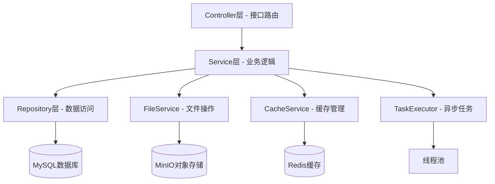
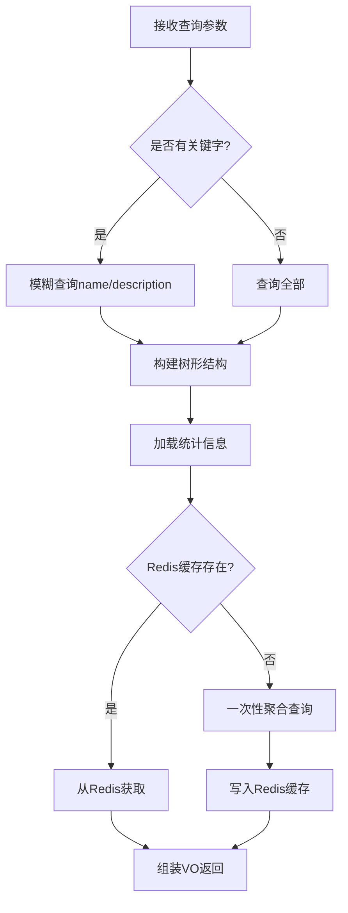
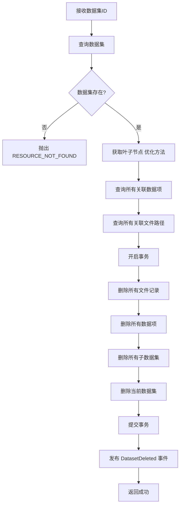
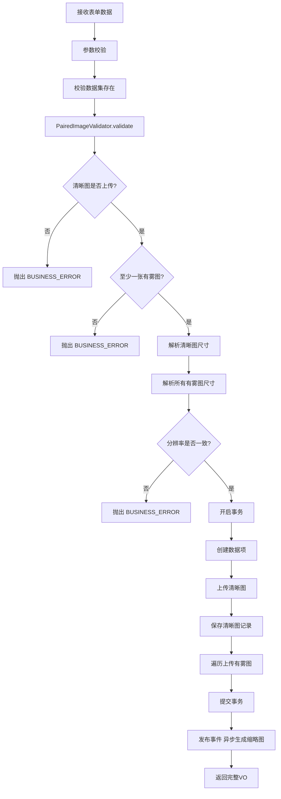

# 数据集管理模块 - 后端实现设计

## 1. 文档概述

本文档描述数据集管理模块的后端实现方案，包括 API 接口设计、核心业务逻辑、数据模型、缓存策略及性能优化方案，为后端开发提供实现指导。

## 2. 架构设计

### 2.1 模块分层架构



### 2.2 核心实体关系

数据集管理模块涉及以下核心实体：

| 实体 | 说明 |
|------|------|
| `sys_dataset` | 数据集表（支持树形结构） |
| `sys_dataset_item` | 数据项表 |
| `sys_item_file` | 数据项文件关联表 |
| `sys_file` | 文件表（存储文件元数据） |

**关系说明**：
- 数据集支持父子关系（树形结构）
- 一个数据集包含多个数据项
- 一个数据项包含多个文件（清晰图、有雾图等）
- 文件通过 MD5 去重，多个数据项可引用同一文件

---

## 4. 接口详细设计

### 4.1 获取数据集列表

**请求参数**：

| 参数名 | 类型 | 必填 | 说明 |
|--------|------|------|------|
| keyword | string | 否 | 关键字搜索（名称/描述） |
| type | string | 否 | 数据集类型筛选 |
| status | integer | 否 | 状态筛选 |
| pageNum | integer | 否 | 页码（默认 1） |
| pageSize | integer | 否 | 每页大小（默认 20） |

**响应数据**：

```json
{
  "code": "00000",
  "msg": "一切ok",
  "data": {
    "list": [
      {
        "id": 1,
        "name": "户外场景数据集",
        "description": "包含各种户外雾霾场景",
        "type": "training",
        "status": 1,
        "parentId": null,
        "path": "/户外场景数据集",
        "hasChildren": true,
        "statistics": {
          "itemCount": 120,
          "fileCount": 450,
          "totalSize": 15360000000,
          "sceneDistribution": {"outdoor": 80, "indoor": 40},
          "hazeDistribution": {"light": 150, "medium": 200, "heavy": 100}
        },
        "createTime": "2025-01-01T10:00:00",
        "updateTime": "2025-01-10T15:30:00"
      }
    ],
    "total": 50
  }
}
```

**业务逻辑**：



**性能优化**：
- 树形结构构建：一次性查询所有数据集，内存构建父子关系（BFS算法，避免 N+1）
- 统计信息优先从 Redis 获取（Key: `dataset:stats:{id}`，TTL: 30分钟）

---

### 4.2 获取数据集详情

**请求参数**：

| 参数名 | 类型 | 必填 | 说明 |
|--------|------|------|------|
| id | Long | 是 | 数据集 ID（路径参数） |

**响应数据**：

```json
{
  "code": "00000",
  "msg": "一切ok",
  "data": {
    "id": 1,
    "name": "户外场景数据集",
    "description": "包含各种户外雾霾场景",
    "type": "training",
    "status": 1,
    "parentId": null,
    "path": "/户外场景数据集",
    "children": [
      {"id": 2, "name": "城市街道", "itemCount": 50}
    ],
    "statistics": {
      "itemCount": 120,
      "fileCount": 450,
      "totalSize": 15360000000,
      "clearCount": 120,
      "hazyCount": 330,
      "sceneDistribution": {"outdoor": 280, "indoor": 170},
      "hazeDistribution": {"light": 150, "medium": 120, "heavy": 60},
      "formatDistribution": {"jpg": 400, "png": 50}
    },
    "createTime": "2025-01-01T10:00:00",
    "updateTime": "2025-01-10T15:30:00"
  }
}
```

**统计信息计算逻辑**：

1. 获取叶子节点（一次查询 + 内存 BFS）
2. 一次聚合查询（避免循环查询）

---

### 4.3 新增数据集

**请求参数**：

| 参数名 | 类型 | 必填 | 说明 |
|--------|------|------|------|
| name | string | 是 | 数据集名称 |
| description | string | 否 | 描述信息 |
| type | string | 是 | 数据集类型 |
| status | integer | 否 | 状态，默认 1 |
| parentId | Long | 否 | 父数据集 ID |

**业务规则**：
- 父数据集存在性校验：`parentId` 不为空时必须存在对应记录
- 名称唯一性校验：同一父数据集下 `name` 不能重复
- 存储目录生成规则：`/数据集根目录/父数据集名称/当前数据集名称`

**事件驱动**：创建成功后发布 `DatasetCreatedEvent`，异步触发：
- 失效树形结构缓存 `dataset:tree`
- 失效父数据集统计缓存

---

### 4.4 删除数据集

**接口路径**:
- 单个删除：`DELETE /api/v1/datasets/{id}`
- 批量删除：`DELETE /api/v1/datasets/batch`

**业务逻辑**：



**级联删除范围**：
1. 当前数据集及所有子数据集（递归）
2. 所有关联的数据项（`sys_dataset_item`）
3. 所有关联的文件记录（`sys_item_file` + `sys_file`）
4. 所有物理文件（原图+缩略图）**→ 异步删除**

**事务控制**：数据库删除操作在同一事务中，事务提交后再异步删除物理文件

---

### 4.5 分页查询数据项列表

**请求参数**：

| 参数名 | 类型 | 必填 | 说明 |
|--------|------|------|------|
| datasetId | Long | 是 | 数据集 ID |
| keyword | string | 否 | 关键字搜索 |
| sceneType | string | 否 | 场景类型筛选 |
| hazeLevel | string | 否 | 雾霾程度筛选 |
| minWidth | integer | 否 | 分辨率宽度最小值 |
| maxWidth | integer | 否 | 分辨率宽度最大值 |
| sortBy | string | 否 | 排序字段（relevance/createTime/usageCount） |
| sortOrder | string | 否 | 排序方向（asc/desc） |
| pageNum | integer | 否 | 页码（默认 1） |
| pageSize | integer | 否 | 每页数量（默认 20，最大 200） |

**响应数据**：

```json
{
  "code": "00000",
  "msg": "一切ok",
  "data": {
    "list": [
      {
        "id": 1,
        "datasetId": 10,
        "name": "城市街道_001",
        "sceneType": "outdoor",
        "description": "城市主干道雾霾场景",
        "usageCount": 15,
        "clearImage": {
          "id": 101,
          "url": "https://cdn.example.com/clear/001.jpg",
          "thumbnailUrl": "https://cdn.example.com/clear/thumb_001.jpg",
          "width": 1920,
          "height": 1080,
          "sizeBytes": 2560000
        },
        "hazyImages": [
          {
            "id": 102,
            "type": "hazy",
            "hazeLevel": "light",
            "url": "https://cdn.example.com/hazy/001_light.jpg",
            "thumbnailUrl": "https://cdn.example.com/hazy/thumb_001_light.jpg",
            "width": 1920,
            "height": 1080
          }
        ],
        "createTime": "2025-01-05T10:00:00"
      }
    ],
    "total": 120
  }
}
```

**相关度计算**（仅在有关键字时）：

| 匹配规则 | 得分 |
|---------|------|
| 名称完全匹配 | 100 分 |
| 名称包含关键字 | 50 分 |
| 场景类型匹配 | 20 分 |
| 描述包含关键字 | 10 分 |

---

### 4.6 创建数据项并上传配对图片

**接口路径**：`POST /api/v1/dataset-items/upload`

**请求参数**（multipart/form-data）：

| 参数名 | 类型 | 必填 | 说明 |
|--------|------|------|------|
| datasetId | Long | 是 | 数据集 ID |
| name | string | 是 | 数据项名称 |
| sceneType | string | 否 | 场景类型 |
| description | string | 否 | 描述 |
| clearImage | file | 是 | 清晰图 |
| hazyImages | file[] | 是 | 有雾图列表（至少 1 张） |
| hazeLevels | string[] | 是 | 对应的雾霾程度 |

**业务逻辑**：



**配对图片校验规则**：

| 规则 | 说明 |
|------|------|
| 清晰图必填 | 必须上传一张 type=clear 的图片 |
| 有雾图必填 | 至少上传一张 type=hazy 的图片 |
| 数量匹配 | 有雾图数量与雾霾程度数量必须一致 |
| 格式校验 | 仅支持 jpg/jpeg/png/gif |
| 大小限制 | 单张不超过 10MB |
| 分辨率一致 | 同一数据项下所有图片分辨率必须完全一致 |
| 雾霾程度有效 | 仅支持 light/medium/heavy |

**存储路径规则**：
- 原图：`/{rootPath}/{datasetName}/{itemId}/{filename}`
- 缩略图：`/{rootPath}/{datasetName}/{itemId}/thumb_{filename}`

---

### 4.7 创建任务（统一入口）

**接口路径**：`POST /api/v1/tasks`

**请求参数**：

```json
{
  "type": "dataset_export",
  "targetId": 123,
  "targetIds": null,
  "options": {
    "structure": "by_item",
    "includeTypes": ["clear", "hazy"],
    "includeThumbnail": false
  }
}
```

| 参数名 | 类型 | 必填 | 说明 |
|--------|------|------|------|
| type | string | 是 | 任务类型：dataset_export / item_download / batch_download |
| targetId | Long | 条件 | 目标 ID（单个资源时使用） |
| targetIds | List&lt;Long&gt; | 条件 | 目标 ID 列表（批量操作时使用） |
| options.structure | string | 否 | 文件组织方式：by_item / flat |
| options.includeTypes | string[] | 否 | 包含的图片类型 |
| options.includeThumbnail | boolean | 否 | 是否包含缩略图 |

**响应数据**：

```json
{
  "code": "00000",
  "msg": "一切ok",
  "data": {
    "taskId": "uuid-xxx",
    "status": "pending",
    "progress": 0,
    "totalFiles": 100,
    "processedFiles": 0,
    "createdAt": "2025-01-10T10:00:00",
    "downloadUrl": null,
    "expiresAt": null
  }
}
```

**任务状态**：

| 状态 | 说明 | 可操作 |
|------|------|--------|
| PENDING | 待处理（已创建，排队中） | 可取消 |
| PROCESSING | 处理中 | 可取消 |
| COMPLETED | 已完成 | 可下载 |
| FAILED | 失败 | 不可操作 |
| CANCELLED | 已取消 | 不可操作 |

**文件组织方式**：
- `by_item`：`数据集名称/数据项名称/文件名`
- `flat`：`数据集名称/文件名`

---

## 5. 数据传输对象

### 5.1 数据集相关 DTO

#### DatasetPageQuery（查询参数）

| 字段 | 类型 | 说明 |
|------|------|------|
| keyword | String | 关键字 |
| type | String | 数据集类型 |
| status | Integer | 状态 |
| pageNum | Long | 页码 |
| pageSize | Long | 每页条数 |

#### DatasetForm（表单数据）

| 字段 | 类型 | 说明 |
|------|------|------|
| id | Long | 数据集 ID |
| name | String | 数据集名称 |
| description | String | 描述 |
| type | String | 类型 |
| parentId | Long | 父数据集 ID |
| status | Integer | 状态 |

#### DatasetVO（详情视图）

| 字段 | 类型 | 说明 |
|------|------|------|
| id | Long | 数据集 ID |
| name | String | 数据集名称 |
| description | String | 描述 |
| type | String | 类型 |
| parentId | Long | 父数据集 ID |
| path | String | 存储路径 |
| hasChildren | Boolean | 是否有子节点 |
| children | List&lt;DatasetVO&gt; | 子数据集列表 |
| statistics | DatasetStatistics | 统计信息 |
| createTime | LocalDateTime | 创建时间 |
| updateTime | LocalDateTime | 更新时间 |

#### DatasetStatistics（统计信息）

| 字段 | 类型 | 说明 |
|------|------|------|
| itemCount | Integer | 数据项数量 |
| fileCount | Integer | 文件总数 |
| totalSize | Long | 总大小（字节） |
| clearCount | Integer | 清晰图数量 |
| hazyCount | Integer | 有雾图数量 |
| sceneDistribution | Map&lt;String, Integer&gt; | 场景分布 |
| hazeDistribution | Map&lt;String, Integer&gt; | 雾霾程度分布 |
| formatDistribution | Map&lt;String, Integer&gt; | 格式分布 |

### 5.2 数据项相关 DTO

#### DatasetItemQuery（查询参数）

| 字段 | 类型 | 说明 |
|------|------|------|
| datasetId | Long | 数据集 ID（必填） |
| keyword | String | 关键字 |
| sceneType | String | 场景类型 |
| hazeLevel | String | 雾霾程度 |
| minWidth | Integer | 最小宽度 |
| maxWidth | Integer | 最大宽度 |
| sortBy | String | 排序字段 |
| sortOrder | String | 排序方向 |
| pageNum | Long | 页码 |
| pageSize | Long | 每页条数 |

#### DatasetItemVO（数据项视图）

| 字段 | 类型 | 说明 |
|------|------|------|
| id | Long | 数据项 ID |
| datasetId | Long | 所属数据集 ID |
| name | String | 数据项名称 |
| sceneType | String | 场景类型 |
| description | String | 描述 |
| usageCount | Integer | 使用次数 |
| clearImage | ItemFileVO | 清晰图信息 |
| hazyImages | List&lt;ItemFileVO&gt; | 有雾图列表 |
| createTime | LocalDateTime | 创建时间 |

#### ItemFileVO（图片文件视图）

| 字段 | 类型 | 说明 |
|------|------|------|
| id | Long | 文件 ID |
| type | String | 图片类型（clear/hazy） |
| hazeLevel | String | 雾霾程度 |
| url | String | 原图 URL |
| thumbnailUrl | String | 缩略图 URL |
| width | Integer | 宽度 |
| height | Integer | 高度 |
| sizeBytes | Long | 文件大小 |
| formattedSize | String | 格式化大小 |
| format | String | 文件格式 |

### 5.3 任务相关 DTO

#### TaskCreateForm（任务创建表单）

| 字段 | 类型 | 说明 |
|------|------|------|
| type | String | 任务类型：dataset_export / item_download / batch_download |
| targetId | Long | 目标 ID（单个资源） |
| targetIds | List&lt;Long&gt; | 目标 ID 列表（批量操作） |
| options | TaskOptions | 任务选项 |

#### TaskOptions（任务选项）

| 字段 | 类型 | 说明 |
|------|------|------|
| structure | String | 文件组织方式：by_item / flat |
| includeTypes | List&lt;String&gt; | 包含的图片类型 |
| includeThumbnail | Boolean | 是否包含缩略图 |

#### TaskVO（任务状态）

| 字段 | 类型 | 说明 |
|------|------|------|
| taskId | String | 任务 ID（UUID） |
| type | String | 任务类型 |
| status | String | 任务状态（PENDING/PROCESSING/COMPLETED/FAILED/CANCELLED） |
| progress | Integer | 进度（0-100） |
| totalFiles | Integer | 总文件数 |
| processedFiles | Integer | 已处理文件数 |
| downloadUrl | String | 下载链接 |
| createdAt | LocalDateTime | 创建时间 |
| completedAt | LocalDateTime | 完成时间 |
| expiresAt | LocalDateTime | 过期时间 |
| errorMessage | String | 错误信息 |

---

## 6. 服务层设计

### 6.1 服务接口定义

#### DatasetService

| 方法名 | 参数 | 返回值 | 说明 |
|--------|------|--------|------|
| listDatasets | DatasetPageQuery | PageResult&lt;DatasetVO&gt; | 分页查询数据集 |
| getDatasetDetail | Long id | DatasetVO | 获取数据集详情 |
| getDatasetOptions | - | List&lt;OptionVO&gt; | 获取数据集下拉选项 |
| createDataset | DatasetForm | DatasetVO | 创建数据集 |
| updateDataset | Long id, DatasetForm | DatasetVO | 更新数据集 |
| deleteDataset | Long id | void | 删除数据集 |
| batchDeleteDatasets | List&lt;Long&gt; ids | BatchResult | 批量删除数据集 |
| getLeafDatasetIds | Long id | Set&lt;Long&gt; | 获取叶子节点 ID |

#### DatasetItemService

| 方法名 | 参数 | 返回值 | 说明 |
|--------|------|--------|------|
| listDatasetItems | DatasetItemQuery | PageResult&lt;DatasetItemVO&gt; | 分页查询数据项 |
| getDatasetItemDetail | Long id | DatasetItemVO | 获取数据项详情 |
| createEmptyItem | DatasetItemForm | DatasetItemVO | 创建空数据项 |
| createItemWithImages | DatasetItemUploadForm | DatasetItemVO | 创建数据项并上传图片 |
| batchCreateItems | BatchUploadForm | BatchResult | 批量创建数据项 |
| updateDatasetItem | Long id, DatasetItemForm | DatasetItemVO | 更新数据项 |
| deleteDatasetItem | Long id | void | 删除数据项 |
| batchDeleteItems | List&lt;Long&gt; ids | BatchResult | 批量删除数据项 |

#### ItemFileService

| 方法名 | 参数 | 返回值 | 说明 |
|--------|------|--------|------|
| getFileDetail | Long id | ItemFileVO | 获取图片详情 |
| uploadFile | ItemFileUploadForm | ItemFileVO | 上传图片 |
| updateFile | Long id, ItemFileForm | ItemFileVO | 更新图片信息 |
| deleteFile | Long id | void | 删除图片 |
| batchDeleteFiles | List&lt;Long&gt; ids | BatchResult | 批量删除图片 |

#### TaskService（统一任务服务）

| 方法名 | 参数 | 返回值 | 说明 |
|--------|------|--------|------|
| createTask | TaskCreateForm | TaskVO | 创建任务（统一入口） |
| getTaskStatus | String taskId | TaskVO | 查询任务状态 |
| getDownloadUrl | String taskId | String | 获取下载链接 |
| cancelTask | String taskId | void | 取消任务 |
| listMyTasks | PageQuery | PageResult&lt;TaskVO&gt; | 分页查询当前用户任务 |

### 6.2 核心业务逻辑

#### 配对图片校验器

- 规则1：清晰图必填
- 规则2：至少一张有雾图
- 规则3：数量匹配
- 规则4：格式和大小校验
- 规则5：分辨率一致性校验
- 规则6：雾霾程度有效性

#### 批量上传文件名解析

清晰图文件名规则：
- {prefix}_clear.{ext}
- {prefix}_gt.{ext}

有雾图文件名规则：
- {prefix}_hazy_light.{ext}    → hazeLevel: light
- {prefix}_hazy_medium.{ext}   → hazeLevel: medium
- {prefix}_hazy_heavy.{ext}    → hazeLevel: heavy
- {prefix}_hazy.{ext}          → hazeLevel: light（默认）

示例：
street_001_clear.jpg
street_001_hazy_light.jpg
street_001_hazy_medium.jpg
→ 识别为同一组，前缀: street_001

### 6.3 事务管理

| 操作类型 | 事务级别 | 说明 |
|---------|---------|------|
| 查询操作 | 只读事务 | 优化数据库性能 |
| 创建数据集/数据项 | 读写事务 | 主表+关联表需事务保证 |
| 删除数据集 | 读写事务 | 级联删除需事务保证 |
| 上传图片 | 读写事务 | 文件记录+关联记录需事务保证 |

### 6.4 事件驱动机制

| 事件类型 | 触发时机 | 异步处理内容 |
|---------|---------|-------------|
| DatasetCreated | 数据集创建成功后 | 失效树缓存、更新父节点统计 |
| DatasetUpdated | 数据集更新成功后 | 失效相关缓存 |
| DatasetDeleted | 数据集删除成功后 | 异步删除物理文件、清理缓存 |
| ItemFilesUploaded | 图片上传成功后 | 异步生成缩略图、失效统计缓存 |
| ItemDeleted | 数据项删除成功后 | 异步删除物理文件、更新统计 |

**事件处理示例**：

1. @Async + @TransactionalEventListener(phase = AFTER_COMMIT)
2. 生成缩略图（固定宽度200px，等比缩放）
3. 更新数据库
4. 捕获异常，记录失败，由补偿任务处理

---

## 7. 数据访问层设计

### 7.1 核心 Mapper 方法

#### SysDatasetMapper

| 方法名 | 说明 |
|--------|------|
| selectDatasetTree | 查询数据集树形结构 |
| selectChildIds | 查询所有子数据集 ID |
| aggregateStatistics | 聚合统计查询 |
| incrementUsageCount | 增加使用次数 |

#### SysDatasetItemMapper

| 方法名 | 说明 |
|--------|------|
| searchWithRelevance | 带相关度的搜索查询 |
| selectWithFiles | 查询数据项及关联文件 |
| batchInsert | 批量插入数据项 |

#### SysItemFileMapper

| 方法名 | 说明 |
|--------|------|
| selectFileWithDetails | 查询文件详情（含关联信息） |
| selectPairedFiles | 查询配对图片 |
| updateThumbnailPath | 更新缩略图路径 |
| selectFilePathsByItemId | 查询数据项所有文件路径 |

### 7.2 索引优化

数据集管理模块需要创建专用的组合索引和覆盖索引以优化查询性能。

> **详细的索引设计和 SQL 语句请参考**：系统架构/数据库设计.md

### 7.3 查询优化

**避免 N+1 查询**：使用 LEFT JOIN 一次性加载数据项和文件

```xml
<select id="selectWithFiles" resultMap="DatasetItemWithFilesMap">
    SELECT di.*, sif.*, sf.url, sf.size_bytes
    FROM sys_dataset_item di
    LEFT JOIN sys_item_file sif ON di.id = sif.item_id
    LEFT JOIN sys_file sf ON sif.file_id = sf.id
    WHERE di.dataset_id = #{datasetId}
    ORDER BY di.create_time DESC
    LIMIT #{offset}, #{limit}
</select>
```

---

## 8. 缓存策略

### 8.1 缓存 Key 规范

| 缓存对象 | 缓存 Key | TTL | 更新策略 |
|---------|---------|------|---------|
| 数据集树 | `dataset:tree` | 1 小时 | 增删改时失效 |
| 数据集统计 | `dataset:stats:{datasetId}` | 30 分钟 | 数据变更时失效 |
| 任务状态缓存 | `task:{taskId}` | 24 小时 | 实时更新 |
| 任务取消标志 | `task:cancel:{taskId}` | 5 分钟 | 取消时设置 |
| 用户偏好 | `user:dataset:pref:{userId}` | 7 天 | 用户修改时更新 |

### 8.2 缓存更新策略

**统计信息缓存**：
1. 尝试从缓存获取
2. 缓存未命中，从数据库计算
3. 写入缓存
4. 同时失效父节点缓存

---

## 9. 异步任务设计

### 9.1 导出任务执行器

**关键实现要点**：
1. 跨类调用确保 `@Async` 生效
2. MySQL 持久化任务元信息，Redis 存储实时进度
3. 支持取消机制（Redis 标志位 + 进度回调检查）
4. 流式打包避免内存溢出

### 9.2 定时任务清理

| 任务 | 执行频率 | 处理内容 |
|------|---------|---------|
| 过期任务清理 | 每小时 | 删除 expiresAt < now 的任务及文件 |
| 僵尸任务清理 | 每小时 | 标记 processing 超过 2 小时的任务为失败 |
| 缩略图补偿 | 每天 | 重试缩略图生成失败的文件 |

---

## 10. 异常处理

| 异常类型 | HTTP 状态码 | 错误码 | 说明 |
|---------|------------|--------|------|
| 参数校验失败 | 400 | PARAM_INVALID | 参数格式或值不正确 |
| 业务规则违反 | 400 | BUSINESS_ERROR | 违反业务逻辑 |
| 资源不存在 | 404 | RESOURCE_NOT_FOUND | 请求的资源不存在 |
| 权限不足 | 403 | ACCESS_DENIED | 无权限操作 |
| 系统异常 | 500 | SYSTEM_ERROR | 系统内部错误 |

## 11. 性能指标与优化

### 11.1 性能目标

| 接口 | 当前 P99 | 目标 P99 | 优化手段 |
|------|----------|----------|----------|
| 数据集列表 | 1.2s | 300ms | 缓存 + 索引优化 |
| 数据项列表 | 4.3s | 800ms | 组合索引 + JOIN 优化 |
| 数据项详情 | 500ms | 100ms | JOIN 优化 |
| 上传配对图片 | 6.5s | 1s | 异步缩略图 |
| 批量上传 | 30s | 5s | 并发上传 + 异步处理 |
| 导出任务创建 | 阻塞 | 100ms | 异步执行 |

### 11.2 优化措施

| 优化项 | 实现方式 |
|--------|---------|
| 统计信息缓存 | Redis 缓存，TTL 30 分钟 |
| 树形结构缓存 | 一次性查询 + 内存构建 |
| 缩略图异步生成 | 事件驱动 + 线程池 |
| 文件删除异步化 | 事务提交后异步执行 |
| 批量操作优化 | 批量 SQL + 并发处理 |

---

## 12. 安全设计

### 12.1 权限控制

| 权限标识 | 说明 |
|---------|------|
| sys:dataset:add | 新增数据集/数据项 |
| sys:dataset:edit | 编辑数据集/数据项/图片 |
| sys:dataset:delete | 删除数据集/数据项/图片 |
| sys:dataset:export | 导出数据集 |

### 12.2 防护机制

| 防护项 | 实现方式 |
|--------|---------|
| SQL 注入 | 参数化查询，排序字段白名单 |
| 文件上传安全 | 格式白名单、大小限制、病毒扫描 |
| 防重复提交 | Redis 分布式锁，锁定时间 3 秒 |
| 并发任务限制 | 同一用户同时最多 3 个导出任务 |

---

## 13. 多后端实现说明

### 13.1 Java 后端实现

**技术栈**：Spring Boot + MyBatis-Plus + Redis + MinIO

**特有实现**：
- 使用 `@Async` + `@TransactionalEventListener` 实现事件驱动
- 使用 `HikariCP` 连接池
- 使用 `EasyExcel` 处理导出

### 13.2 Go 后端实现

**技术栈**：Gin + GORM + Redis + MinIO

**特有实现**：
- 使用 goroutine 实现异步任务
- 使用 `go-redis` 客户端
- 使用 `excelize` 处理导出

### 13.3 Python 后端实现

**技术栈**：Flask + SQLAlchemy + Redis + MinIO

**特有实现**：
- 使用 `ThreadPoolExecutor` 实现异步任务
- 使用 `flask-caching` 缓存扩展
- 使用 Marshmallow 进行参数校验

### 13.4 接口一致性

无论使用哪种后端实现，需保证：
- API 路径、请求参数、响应结构完全一致
- 错误码和错误信息格式统一
- 缓存 Key 规范统一
- 数据库表结构和字段一致

---

## 14. 配置项

| 配置项 | 说明 | 默认值 |
|--------|------|--------|
| dataset.download.base-dir | 导出文件临时目录 | /tmp/dataset-export |
| dataset.download.expire-hours | 导出链接有效期 | 24 小时 |
| dataset.download.max-parallel-tasks | 最大并行任务数 | 3 |
| dataset.cache.tree-ttl | 树形结构缓存时间 | 1 小时 |
| dataset.cache.stats-ttl | 统计信息缓存时间 | 30 分钟 |
| dataset.item.default-page-size | 默认分页大小 | 20 |
| dataset.item.max-page-size | 最大分页大小 | 200 |
| dataset.upload.max-file-size | 单文件最大大小 | 10MB |
| dataset.upload.allowed-formats | 允许的文件格式 | jpg,jpeg,png,gif |
| dataset.thumbnail.width | 缩略图宽度 | 200px |
| dataset.thumbnail.quality | 缩略图质量 | 80% |
