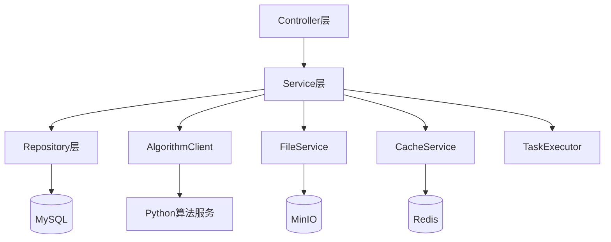
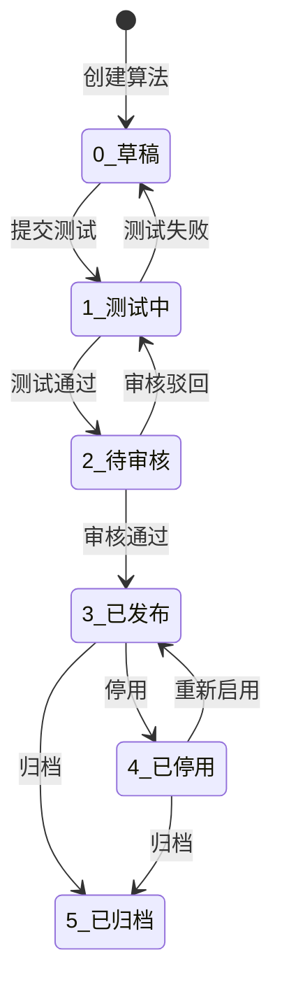
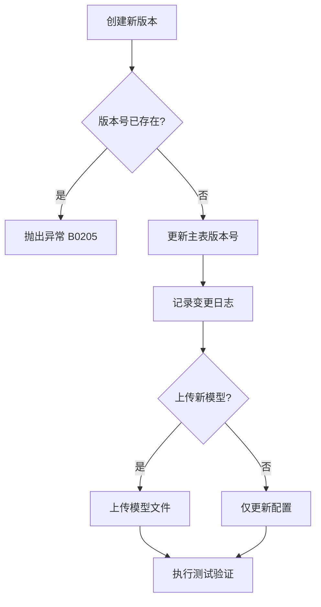
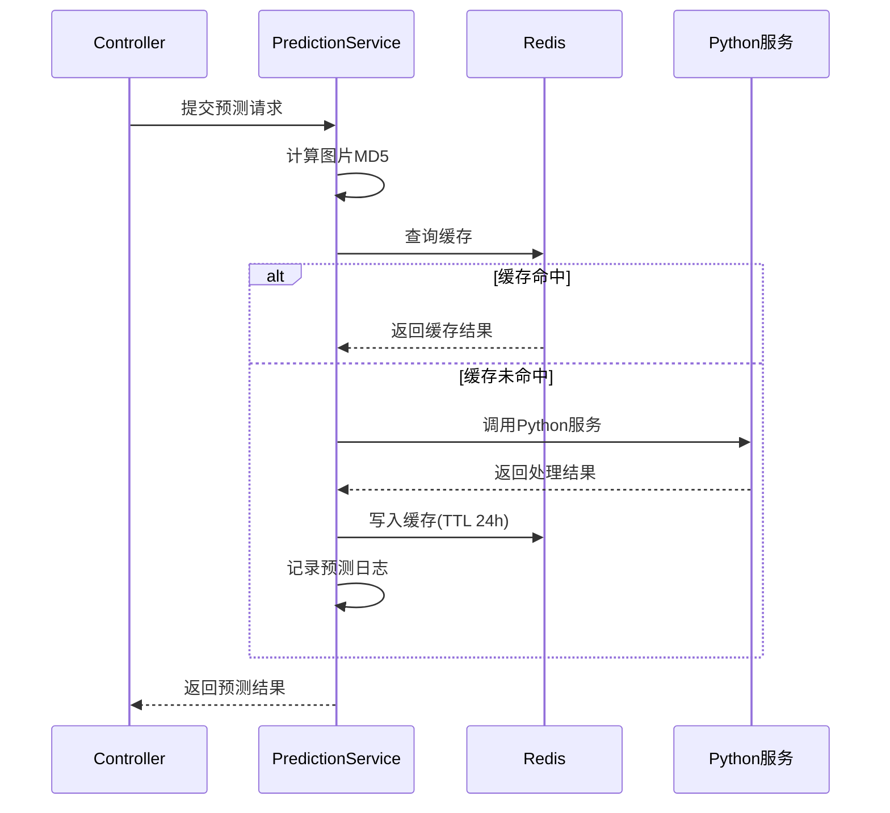

# 算法管理模块 - 后端实现设计

## 1. 文档概述

本文档描述算法管理模块的后端实现设计方案。

### 1.1 关联文档

- **需求规格**: [需求规格.md](./需求规格.md) - 功能需求与业务规则
- **API接口**: [API接口.md](./API接口.md) - 接口契约定义（SSOT）
- **数据库设计**: [数据库设计](../../../02-系统架构/03-数据库设计.md) - 表结构定义（SSOT）

---

## 2. 架构设计

### 2.1 模块分层架构



### 2.2 核心组件职责

| 组件 | 职责 |
|------|------|
| SysAlgorithmService | 算法生命周期管理、版本控制、审核、导入导出 |
| PredictionService | 模型预测处理、结果缓存 |
| EvaluationService | 效果评估计算（PSNR/SSIM/LPIPS/NIQE/Entropy） |
| MonitorService | 性能数据采集、统计分析 |
| AlgorithmClient | 调用 Python 算法服务 |

---

## 3. 数据依赖

> 详细表结构定义请参考：[数据库设计文档](../../../02-系统架构/03-数据库设计.md)

| 表名 | 模块依赖说明 |
|------|-------------|
| sys_algorithm | 主表，含 version/status/config_json/audit_by/audit_time/audit_remark 字段 |
| sys_algorithm_version | 版本历史表，支持版本回滚 |
| sys_pred_log | 预测日志，`idx_pred_cache` 复合索引用于缓存查询 |
| sys_eval_log | 评估日志，result JSON 存储 PSNR/SSIM/LPIPS/NIQE/Entropy |

---

## 4. 核心业务逻辑设计

### 4.1 算法生命周期管理

#### 状态流转图



#### 状态转换规则

| 当前状态 | 可转换状态 | 转换条件 | 权限要求 |
|---------|-----------|---------|---------|
| 0(草稿) | 1(测试中) | 完成基本信息填写和模型上传 | edit |
| 1(测试中) | 2(待审核) | 测试通过，评估指标达标 | edit |
| 1(测试中) | 0(草稿) | 测试失败或需要修改 | edit |
| 2(待审核) | 3(已发布) | 管理员审核通过 | audit |
| 2(待审核) | 1(测试中) | 审核驳回（需填写原因） | audit |
| 3(已发布) | 4(已停用) | 算法性能问题或维护需求 | stop |
| 4(已停用) | 3(已发布) | 问题修复完成 | stop |
| 3(已发布)/4(已停用) | 5(已归档) | 算法不再使用 | delete |

#### 发布前校验规则

| 校验项 | 规则 | 错误码 |
|--------|------|--------|
| 状态校验 | 必须为待审核(2)状态 | B0202 |
| 模型文件 | 模型文件必须存在且有效 | B0204 |
| 测试记录 | 必须存在通过的测试记录 | B0207 |

### 4.2 审核处理

#### 审核业务规则

| 操作 | 前置状态 | 后置状态 | 必填参数 |
|------|---------|---------|---------|
| 通过 | 待审核(2) | 已发布(3) | - |
| 驳回 | 待审核(2) | 测试中(1) | remark（驳回原因） |

#### 审核记录

审核操作需更新 `sys_algorithm` 表字段：
- `audit_by`：审核人 ID
- `audit_time`：审核时间
- `audit_remark`：审核备注（驳回时必填）

### 4.3 导入/导出处理

#### 导出逻辑

| 导出类型 | 处理方式 |
|---------|---------|
| 单个导出 | 打包算法配置 JSON + 模型文件 → `.zip` |
| 批量导出 | 遍历算法列表，打包所有配置和模型 → `.zip` |

**导出包结构**：
```
algorithm_export.zip
├── algorithm.json     # 算法配置（名称、类型、版本、config_json 等）
└── model/             # 模型文件目录
    └── model.pth
```

#### 导入逻辑

| 步骤 | 处理内容 |
|------|---------|
| 1. 校验 | 验证 `.zip` 格式、解析 `algorithm.json` |
| 2. 冲突检测 | 检查算法名称是否已存在 |
| 3. 创建记录 | 创建算法记录（状态=草稿），上传模型文件 |
| 4. 返回结果 | 返回导入成功的算法 ID |

#### 导入校验规则

| 校验项 | 规则 | 错误码 |
|--------|------|--------|
| 文件格式 | 必须为 `.zip` | B0209 |
| 配置文件 | 必须包含 `algorithm.json` | B0209 |
| 必填字段 | name、type、import_path 不能为空 | B0209 |
| 名称唯一 | 算法名称不能与已有算法重复 | B0201 |

### 4.4 版本控制机制

#### 版本号规则

采用语义化版本号：`主版本.次版本.修订号`

| 版本类型 | 说明 | 示例 |
|---------|------|------|
| Major | 不兼容的 API 修改 | v2.0.0 |
| Minor | 向下兼容的功能新增 | v1.1.0 |
| Patch | 向下兼容的问题修正 | v1.0.1 |

#### 版本创建流程



### 4.5 模型预测处理

#### 预测流程



### 4.6 效果评估计算

#### 评估指标

| 指标 | 说明 | 合格阈值 |
|------|------|---------|
| PSNR | 峰值信噪比，越高越好 | ≥ 30.0 dB |
| SSIM | 结构相似性，0-1 | ≥ 0.8 |
| LPIPS | 学习感知相似度，越低越好 | ≤ 0.3 |
| NIQE | 自然图像质量，越低越好 | ≤ 5.0 |
| Entropy | 信息熵，越高越好 | 仅统计展示 |
| 处理时间 | 单张图片处理耗时 | ≤ 10s |

### 4.7 性能监控采集

#### 统计数据架构

```
实时指标 → Redis（HyperLogLog/Counter）
              ↓ 定时任务（5分钟）
历史归档 → MySQL（预聚合表）
```

#### 定时聚合任务

| 任务 | 执行频率 | 处理内容 |
|------|---------|---------|
| 实时聚合 | 5分钟 | Redis → MySQL 聚合 |
| 小时统计 | 每小时 | 聚合过去1小时数据 |
| 日统计 | 每天凌晨 | 聚合过去24小时数据 |

---

## 5. 外部服务集成

### 5.1 Python 算法服务调用

| 配置项 | 值 | 说明 |
|--------|---|------|
| 协议 | HTTP/REST | 基于 HTTP 协议 |
| 超时时间 | 10秒 | 同步预测超时（MVP） |
| 重试次数 | 3次 | 失败自动重试 |
| 熔断阈值 | 失败率>30% + 最少10次请求 | 触发熔断保护 |

### 5.2 降级策略

| 场景 | 降级行为 | 用户提示 |
|------|---------|---------|
| Python 服务熔断（有缓存）| 返回缓存结果 | "服务繁忙，返回历史处理结果" |
| Python 服务熔断（无缓存）| 返回错误码 503 | "算法服务暂不可用，请稍后重试" |
| 评估服务超时 | 任务入队等待重试 | "评估任务已提交，结果稍后通知" |
| 模型文件加载失败 | 跳过该算法，标记异常 | "该算法暂不可用" |

### 5.3 文件存储路径规则

| 文件类型 | 路径格式 |
|---------|---------|
| 模型文件 | `/models/{algorithmId}/{version}/{filename}` |
| 预测结果 | `/predictions/{date}/{taskId}/{filename}` |
| 评估图片 | `/evaluations/{algorithmId}/{taskId}/` |

---

## 6. 缓存策略

### 6.1 缓存 Key 规范

| 缓存对象 | 缓存 Key | TTL | 更新策略 |
|---------|---------|------|---------|
| 算法列表 | `algorithm:list` | 30分钟 | 增删改时失效 |
| 算法详情 | `algorithm:detail:{id}` | 1小时 | 更新时失效 |
| 预测结果 | `prediction:{algorithmId}:{imageMd5}` | 24小时 | 版本更新时失效 |
| 实时监控 | `algorithm:monitor:{id}` | 5分钟 | 定时刷新 |

### 6.2 双层存储架构

| 层次 | 存储 | 用途 | TTL |
|-----|------|------|-----|
| L1 缓存 | Redis | 热点查询加速 | 24小时 |
| L2 持久化 | MySQL | 完整日志存储 | 永久 |

### 6.3 缓存更新规则

| 操作 | 失效的缓存 Key |
|------|--------------|
| 新增算法 | algorithm:list |
| 修改算法 | algorithm:list, algorithm:detail:{id} |
| 删除算法 | algorithm:list, algorithm:detail:{id} |
| 版本更新 | algorithm:detail:{id}, prediction:{algorithmId}:* |

---

## 7. 异常处理

> 完整错误码定义详见 [API接口文档](./API接口.md#4-业务错误码)

### 7.1 业务异常

| 异常场景 | 错误码 | HTTP状态码 |
|---------|--------|-----------|
| 算法不存在 | B0200 | 404 |
| 算法名称已存在 | B0201 | 400 |
| 状态不允许操作 | B0202 | 400 |
| 算法正在使用中 | B0203 | 400 |
| 模型文件不存在 | B0204 | 400 |
| 版本号已存在 | B0205 | 400 |
| 当前版本不允许回滚 | B0206 | 400 |
| 审核权限不足 | B0207 | 403 |
| 驳回原因不能为空 | B0208 | 400 |
| 导入包格式错误 | B0209 | 400 |
| 预测任务超时 | B0210 | 500 |

### 7.2 Python 服务异常处理

| 异常类型 | 处理方式 |
|---------|---------|
| 连接超时 | 重试3次后返回 B0210 |
| 服务不可用 | 触发熔断，执行降级策略 |
| 模型加载失败 | 返回 B0204，记录日志 |

---

## 8. 安全设计

### 8.1 权限控制

> 权限标识详见 [API接口文档](./API接口.md#3-权限标识汇总)

| 权限标识 | 说明 |
|---------|------|
| sys:algorithm:add | 新增算法 |
| sys:algorithm:edit | 编辑算法 |
| sys:algorithm:audit | 审核算法（通过/驳回） |
| sys:algorithm:stop | 停用/启用算法 |
| sys:algorithm:delete | 删除算法 |
| sys:algorithm:view | 查看算法 |
| sys:algorithm:version | 版本管理 |
| sys:algorithm:import | 导入算法 |
| sys:algorithm:export | 导出算法 |
| sys:algorithm:monitor | 性能监控 |

### 8.2 安全防护

| 防护项 | 实现方式 |
|--------|---------|
| SQL注入 | 参数化查询，排序字段白名单 |
| 文件上传 | 格式白名单(.pt/.pth/.onnx/.h5)、大小限制(≤500MB) |
| 导入包校验 | 格式(.zip)、大小(≤1GB)、结构完整性校验 |
| 防重复提交 | Redis 分布式锁，锁定时间3秒 |

---

## 9. 性能目标

| 接口 | 目标 P99 | 优化手段 |
|------|----------|----------|
| 算法列表 | 300ms | 缓存 + 索引 |
| 算法详情 | 100ms | 缓存 |
| 模型预测 | 10s | 结果缓存，后续改异步 |
| 效果评估 | 10s | 异步处理 + 进度反馈 |
| 监控数据 | 500ms | 预聚合 + 时间索引 |

---

## 10. 事务与一致性

### 10.1 事务边界

| 操作类型 | 事务级别 |
|---------|---------|
| 查询操作 | 只读事务 |
| 创建算法 | 读写事务 |
| 版本回滚 | 读写事务 |
| 删除算法 | 读写事务 |

### 10.2 事件驱动

| 事件类型 | 异步处理内容 |
|---------|-------------|
| AlgorithmCreated | 失效列表缓存 |
| AlgorithmUpdated | 失效相关缓存 |
| AlgorithmDeleted | 异步删除模型文件、清理缓存 |
| AlgorithmAudited | 发送审核结果通知 |
| VersionCreated | 失效预测结果缓存 |
| PredictionCompleted | 更新统计缓存 |
| AlgorithmImported | 记录导入日志 |
| AlgorithmExported | 记录导出日志 |

---

## 11. 配置项

| 配置项 | 默认值 | 说明 |
|--------|--------|------|
| algorithm.python.base-url | http://localhost:5000 | Python 服务地址 |
| algorithm.python.timeout | 10s | 请求超时时间 |
| algorithm.python.retry-count | 3 | 重试次数 |
| algorithm.python.circuit-breaker.failure-rate | 30 | 熔断失败率阈值(%) |
| algorithm.python.circuit-breaker.min-calls | 10 | 熔断最小请求数 |
| algorithm.cache.prediction-ttl | 24h | 预测结果缓存时间 |
| algorithm.upload.max-model-size | 500MB | 模型文件最大大小 |
| algorithm.upload.max-import-size | 1GB | 导入包最大大小 |
| algorithm.upload.allowed-formats | .pt,.pth,.onnx,.h5 | 允许的模型格式 |
| algorithm.evaluation.psnr-threshold | 30.0 | PSNR 合格阈值 |
| algorithm.evaluation.ssim-threshold | 0.8 | SSIM 合格阈值 |
| algorithm.evaluation.lpips-threshold | 0.3 | LPIPS 合格阈值 |
