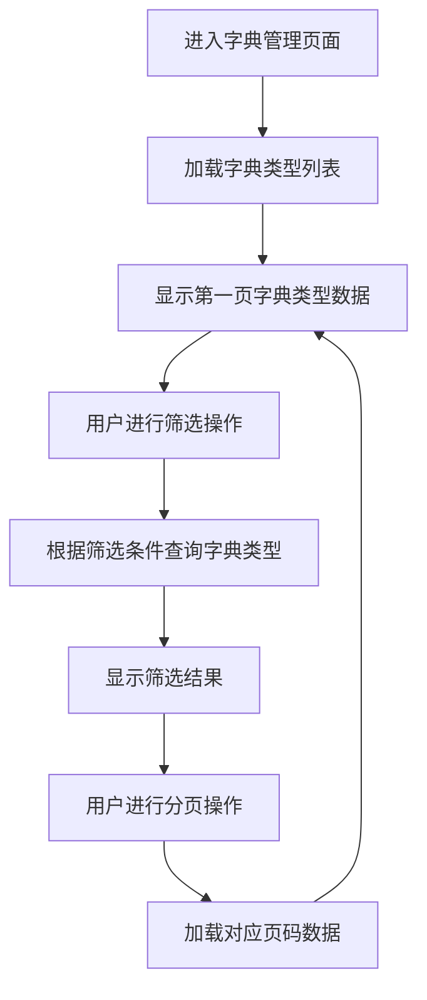
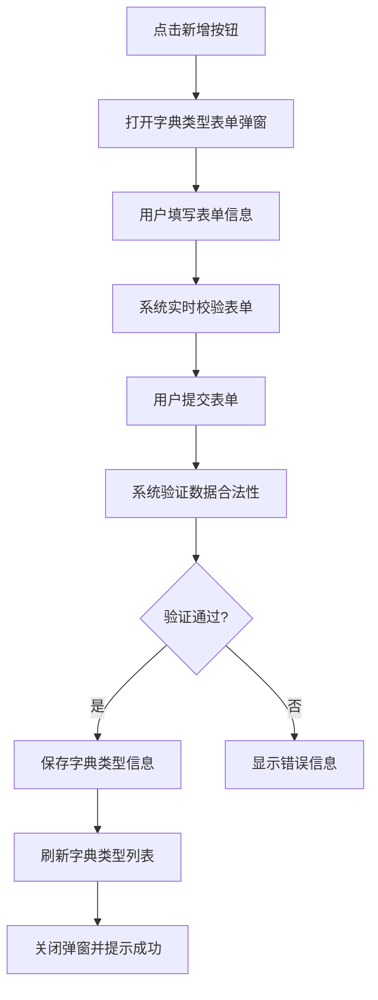
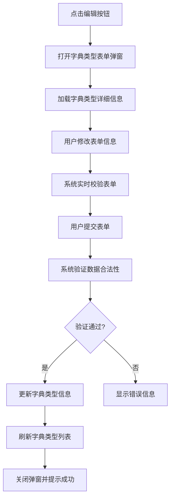
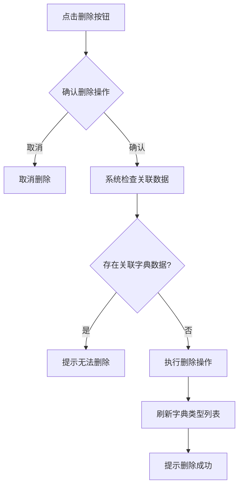
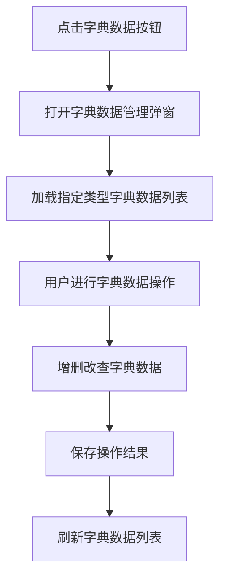

# 字典管理模块需求分析文档

## 1. 模块概述

### 1.1 模块名称
字典管理模块（Dictionary Management Module）

### 1.2 业务定位
字典管理模块是图像去雾系统基础数据管理的重要组成部分，负责维护和管理系统中各种业务字典数据。该模块采用两级管理结构，包括字典类型和字典数据两个层次，提供了完整的字典增删改查功能。

### 1.3 业务价值
通过统一的字典管理机制，集中管理系统中各种基础数据，确保数据的一致性和可维护性，避免在代码中硬编码基础数据。

### 1.4 业务目标
- 实现系统基础数据的统一管理
- 支持运行时动态调整字典数据
- 提供两级管理结构便于分类管理
- 支持字典数据的状态控制和排序功能

## 2. 用户角色分析

### 2.1 主要用户角色
1. **系统管理员**：拥有字典管理模块的所有操作权限，可以对系统中的所有字典进行增删改查操作

### 2.2 用户特征
- 系统管理员：具备专业的系统管理知识，熟悉基础数据管理操作流程

## 3. 业务需求

### 3.1 核心业务需求

#### 3.1.1 字典类型管理
- 支持字典类型信息的创建、查询、修改和删除操作
- 支持字典类型的启用和禁用状态控制
- 支持按字典类型名称/编码关键字搜索

#### 3.1.2 字典数据管理
- 支持字典数据信息的创建、查询、修改和删除操作
- 支持字典数据的启用和禁用状态控制
- 支持字典数据的排序设置
- 支持按字典类型管理对应的字典数据

#### 3.1.3 数据提供功能
- 提供字典数据下拉选项，供其他模块使用
- 支持根据字典类型编码获取对应字典数据

### 3.2 业务场景

#### 3.2.1 基础数据维护场景
当系统需要新增或调整基础数据（如性别、状态、类型等）时，系统管理员可以通过字典管理模块进行维护，无需修改代码。

#### 3.2.2 字典类型管理场景
当系统需要新增字典分类或调整现有字典分类时，系统管理员可以对字典类型进行管理操作。

#### 3.2.3 字典数据使用场景
在其他业务模块中需要使用基础数据时，通过字典管理模块提供的接口获取相应的字典数据。

#### 3.2.4 字典状态控制场景
当某些字典数据暂时不需要使用时，可以通过状态控制功能将其禁用，而不必删除数据。

## 4. 功能需求清单

| 功能分类 | 功能点 | 描述 |
|---------|--------|------|
| 字典类型管理 | 类型列表展示 | 支持分页展示字典类型列表 |
| | 条件筛选 | 支持按名称/编码关键字搜索 |
| | 类型新增 | 支持创建新字典类型 |
| | 类型编辑 | 支持修改现有字典类型 |
| | 类型删除 | 支持删除单个或批量删除字典类型 |
| | 状态管理 | 支持字典类型的启用/禁用 |
| 字典数据管理 | 数据列表展示 | 支持分页展示指定类型下的字典数据 |
| | 数据新增 | 支持创建新字典数据 |
| | 数据编辑 | 支持修改现有字典数据 |
| | 数据删除 | 支持删除单个或批量删除字典数据 |
| | 状态管理 | 支持字典数据的启用/禁用 |
| | 排序设置 | 支持字典数据的排序设置 |
| 数据提供 | 下拉选项 | 提供字典数据下拉选项，供其他模块使用 |

## 5. 非功能需求

### 5.1 性能需求
- 字典列表查询响应时间不超过500ms
- 支持至少1000个字典类型和10000个字典数据的管理
- 字典下拉选项查询响应时间不超过200ms

### 5.2 安全需求
- 字典操作需进行权限验证（新增、编辑、删除等）
- 敏感操作需进行二次确认
- 删除字典类型时需检查是否存在关联的字典数据

### 5.3 可用性需求
- 提供直观的字典管理界面
- 两级管理结构清晰，操作简便
- 表单操作具有明确的校验提示

### 5.4 兼容性需求
- 兼容主流浏览器（Chrome、Firefox、Safari）
- 响应式设计，适配不同屏幕尺寸

## 6. 核心业务流程

### 6.1 字典类型浏览流程

### 6.2 字典类型新增流程

### 6.3 字典类型编辑流程

### 6.4 字典类型删除流程

### 6.5 字典数据管理流程

## 7. 业务规则

### 7.1 数据规则
1. 字典类型编码在系统中必须唯一
2. 字典数据值在同一字典类型下必须唯一
3. 字典数据排序字段为整数类型

### 7.2 操作规则
1. 删除字典类型前需检查是否存在关联的字典数据
2. 字典类型和字典数据均支持状态控制（启用/禁用）
3. 字典数据支持排序设置

## 8. 依赖关系

### 8.1 依赖模块
无直接依赖模块

### 8.2 被依赖模块
1. **系统所有业务模块**：依赖字典管理模块提供基础数据支持

## 9. 待确认事项

1. 删除字典类型时是否需要级联删除关联的字典数据？如需要，是否需要特殊提示？
2. 是否需要增加字典数据导入导出功能？
3. 是否需要支持字典数据的批量启用/禁用操作？
4. 字典值的数据类型是否需要支持除字符串以外的其他类型（如数字、布尔值等）？
5. 是否需要增加字典使用情况统计功能，展示各字典项的使用频率？