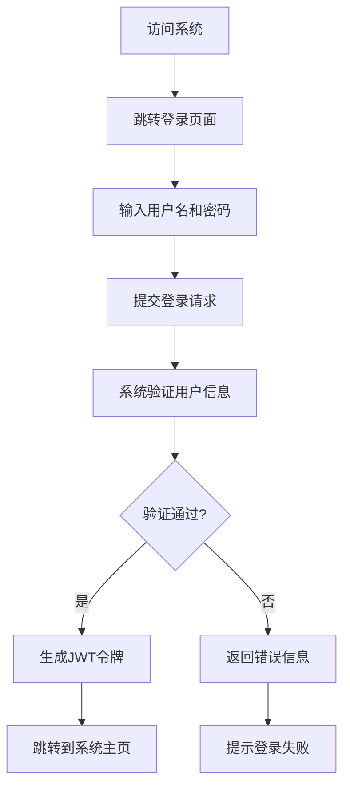
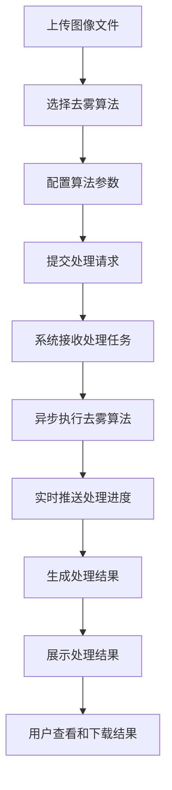
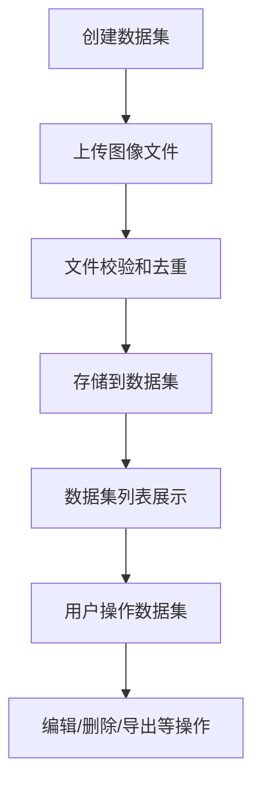

# 总体需求分析

## 1. 项目概述

### 1.1 项目名称
图像去雾系统（Dehaze System）

### 1.2 项目背景
图像去雾系统是一个基于深度学习的在线实时响应图像去雾系统，旨在改善受雾霾影响的图像质量。随着大气污染问题日益严重，雾霾天气对图像采集设备的影响也越来越明显，导致图像对比度降低、颜色失真等问题。本系统通过集成多种先进的去雾算法，为用户提供高质量的图像恢复服务。

### 1.3 项目目标
- 构建一个完整的端到端图像去雾解决方案
- 集成20+种主流去雾算法，满足不同场景需求
- 提供Web端、移动端、桌面端等多平台支持
- 实现高性能图像处理，支持实时处理和批量处理
- 建立完善的安全机制和权限管理体系

## 2. 用户角色分析

### 2.1 主要用户角色

#### 2.1.1 系统管理员
- **职责**：负责系统的整体管理，包括用户管理、角色权限分配、系统配置等
- **权限**：拥有系统所有功能的操作权限
- **特征**：具备专业的系统管理知识，熟悉系统各项功能

#### 2.1.2 普通用户
- **职责**：使用系统进行图像去雾处理，管理个人数据集和处理结果
- **权限**：仅能操作与个人相关的功能模块
- **特征**：对图像处理有一定需求，但不需要系统管理功能

#### 2.1.3 算法研究员
- **职责**：负责算法的测试、优化和管理，上传新的算法模型
- **权限**：拥有算法管理模块的操作权限
- **特征**：具备算法专业知识，能够理解和使用各种去雾算法

## 3. 核心业务需求

### 3.1 图像处理核心需求
- 支持单张图像和批量图像的去雾处理
- 集成多种主流去雾算法（RIDCP、WPXNet、Dehamer等）
- 支持实时处理进度查看和结果预览
- 提供图像质量评估指标（PSNR、SSIM等）

### 3.2 数据管理需求
- 支持数据集的创建、编辑、删除和查询
- 支持图像文件的上传、下载和管理
- 提供数据集导入导出功能
- 支持图像文件的去重处理（MD5校验）

### 3.3 用户管理需求
- 支持用户注册、登录、信息维护
- 实现基于角色的访问控制（RBAC）
- 提供部门组织架构管理
- 支持用户权限的细粒度控制

### 3.4 系统管理需求
- 提供系统配置管理功能
- 支持菜单权限管理
- 实现操作日志记录和审计
- 提供系统监控和性能分析

## 4. 功能模块概览

### 4.1 用户管理模块
- 用户信息管理（增删改查）
- 角色权限管理
- 部门组织架构管理
- 用户导入导出功能

### 4.2 数据集管理模块
- 数据集的创建和管理
- 图像文件上传和存储
- 瀑布流展示和懒加载
- 数据集导入导出

### 4.3 图像处理模块
- 图像去雾处理
- 算法选择和配置
- 处理进度实时推送
- 结果预览和对比

### 4.4 算法管理模块
- 算法模型管理
- 算法参数配置
- 模型动态加载
- 算法效果评估

### 4.5 系统管理模块
- 菜单管理
- 角色管理
- 部门管理
- 字典管理

## 5. 非功能需求

### 5.1 性能需求
- 图像处理响应时间不超过30秒（单张图像）
- 支持至少100个并发用户同时使用
- 系统可用性达到99.9%
- 页面加载时间不超过3秒

### 5.2 安全需求
- 用户身份认证和授权控制
- 敏感数据加密存储和传输
- 防止SQL注入、XSS等常见安全攻击
- 操作日志记录和审计跟踪

### 5.3 可用性需求
- 提供直观友好的用户界面
- 支持主流浏览器（Chrome、Firefox、Safari等）
- 响应式设计，适配不同屏幕尺寸
- 提供详细的操作提示和帮助信息

### 5.4 兼容性需求
- 前端支持Vue和React两种技术栈
- 后端支持Java、Go、Python三种技术栈
- 支持Windows、Linux、macOS等操作系统
- 支持MySQL、MongoDB等多种数据库

## 6. 核心业务流程

### 6.1 用户登录流程

### 6.2 图像去雾处理流程

### 6.3 数据集管理流程

## 7. 系统依赖关系

### 7.1 外部依赖
- 数据库：MySQL、MongoDB
- 缓存系统：Redis
- 对象存储：MinIO、阿里云OSS
- 消息队列：RabbitMQ（可选）
- GPU计算资源：NVIDIA CUDA

### 7.2 内部依赖
- 前端组件库：Element Plus（Vue版本）、Ant Design（React版本）
- 后端框架：Spring Boot（Java）、Gin（Go）
- 算法框架：PyTorch（Python）
- 监控系统：Prometheus、Grafana

## 8. 部署和运维需求

### 8.1 部署环境
- 支持Docker容器化部署
- 支持Kubernetes集群部署
- 支持传统物理机/虚拟机部署

### 8.2 运维监控
- 系统性能监控
- 服务可用性监控
- 日志收集和分析
- 告警机制

## 9. 未来扩展需求

### 9.1 功能扩展
- 支持视频去雾处理
- 增加更多图像处理算法
- 实现移动端原生应用
- 集成AI辅助图像分析

### 9.2 性能优化
- 进一步提升处理速度
- 优化资源利用率
- 支持更大规模并发处理