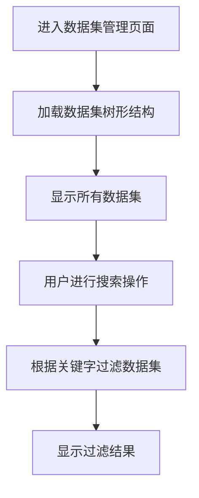
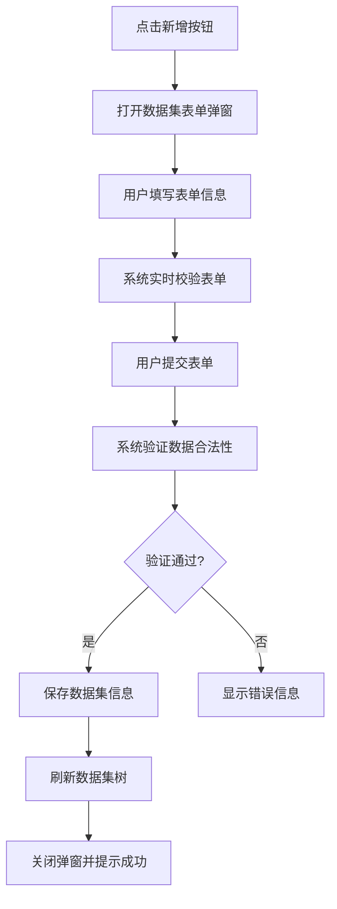
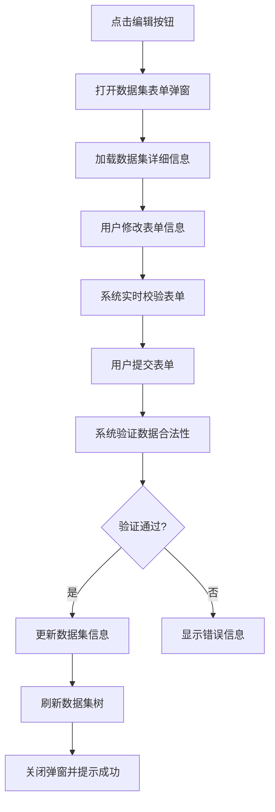
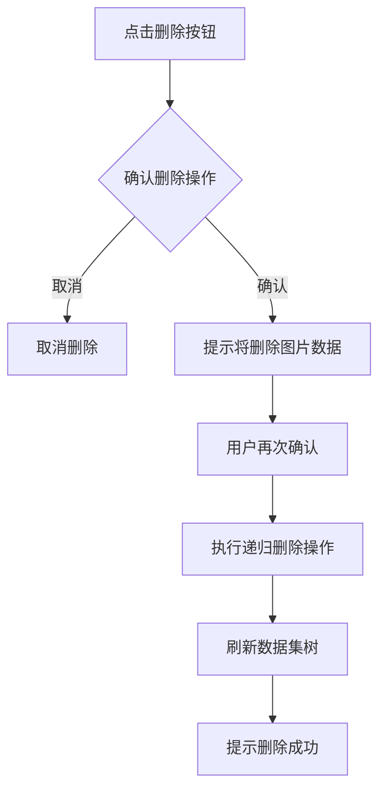
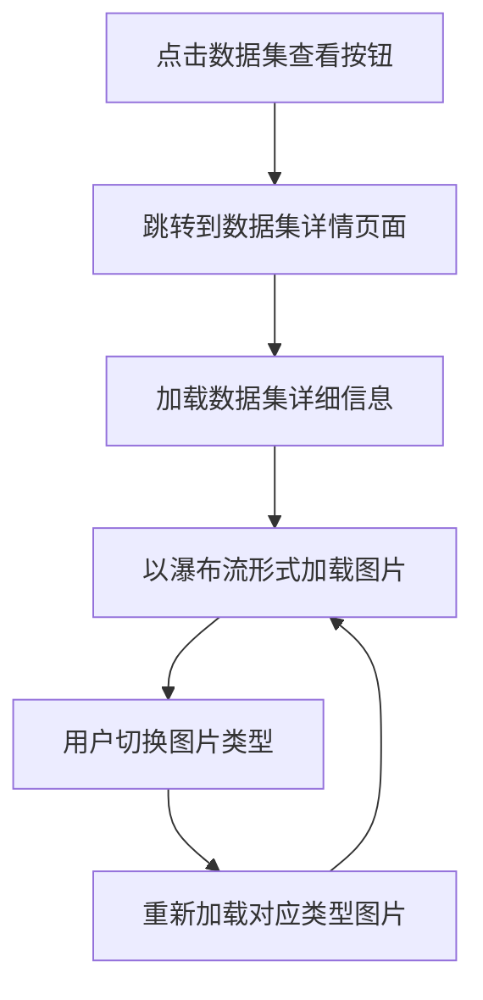

# 数据集管理模块

## 1. 模块概述

### 1.1 模块名称

数据集管理模块（Dataset Management Module）

### 1.2 业务定位

数据集管理模块是图像去雾系统的核心数据管理模块，负责管理系统中用于算法训练和测试的各种数据集。该模块提供了完整的数据集增删改查功能，支持数据集的树形结构管理、数据集详细信息展示、数据集内图片浏览与管理等功能。

### 1.3 业务价值

通过统一的数据集管理机制，为系统提供结构化的数据组织和管理能力，支持算法训练和测试所需的数据集管理，提高数据使用效率和算法研发效率。

### 1.4 业务目标

- 实现数据集的统一组织和管理
- 支持多层级数据集结构
- 提供友好的数据集浏览和图片查看界面
- 支持数据集权限控制和状态管理

## 2. 用户角色分析

### 2.1 主要用户角色

1. **算法研究员**：负责数据集的管理、维护和使用
2. **系统管理员**：拥有数据集管理模块的所有操作权限
3. **普通用户**：浏览和使用公开数据集

### 2.2 用户特征

- 算法研究员：具备数据管理专业知识，熟悉数据集组织和使用方法
- 系统管理员：具备专业的系统管理知识，熟悉数据集管理操作流程
- 普通用户：对图像处理有需求，需要使用数据集进行测试

## 3. 业务需求

### 3.1 核心业务需求

#### 3.1.1 数据集信息管理

- 支持数据集信息的创建、查询、修改和删除操作
- 支持数据集的树形结构管理
- 支持按数据集名称关键字搜索

#### 3.1.2 数据集状态管理

- 支持数据集的启用和禁用状态控制
- 支持批量数据集状态变更

#### 3.1.3 数据集详情展示

- 展示数据集的详细信息和统计数据
- 提供数据集的基本信息查看功能

#### 3.1.4 数据集图片管理

- 支持数据集内图片的浏览和管理
- 提供图片类型切换功能
- 支持图片大图查看

#### 3.1.5 数据集权限管理

- 支持数据集的公开/私有属性设置
- 支持基于角色的数据集访问控制

### 3.2 业务场景

#### 3.2.1 数据集维护场景

当有新的数据集需要添加到系统中时，算法研究员可以通过数据集管理模块进行数据集的创建和配置。

#### 3.2.2 数据集浏览场景

在算法研发过程中，需要浏览和查看特定数据集中的图片内容，以便进行算法训练和测试。

#### 3.2.3 数据集使用场景

在算法测试过程中，需要使用特定的数据集进行测试，通过数据集管理模块获取所需数据。

#### 3.2.4 数据集权限控制场景

对于私有数据集，需要控制其访问权限，确保只有授权用户可以访问。

## 4. 功能需求清单

| 功能分类  | 功能点     | 描述                  |
|-------|---------|---------------------|
| 数据集管理 | 数据集列表展示 | 以树形结构展示所有数据集        |
|       | 条件筛选    | 支持按数据集名称关键字搜索       |
|       | 数据集新增   | 支持创建新数据集            |
|       | 数据集编辑   | 支持修改现有数据集           |
|       | 数据集删除   | 支持删除数据集（包括递归删除子数据集） |
|       | 状态管理    | 支持启用或禁用数据集          |
| 数据集展示 | 详情展示    | 展示数据集的详细信息和统计数据     |
|       | 图片浏览    | 以瀑布流形式展示数据集中的图片内容   |
|       | 图片类型切换  | 支持在不同类型的图片间切换浏览     |
|       | 大图查看    | 支持点击查看图片大图          |
|       | 分页加载    | 支持大量图片的分页加载         |
| 权限管理  | 访问控制    | 支持数据集的公开/私有属性设置     |
|       | 角色权限    | 支持基于角色的数据集访问控制      |

## 5. 非功能需求

### 5.1 性能需求

- 数据集列表查询响应时间不超过500ms
- 支持至少100个数据集的信息管理
- 树形结构渲染支持最多5级深度
- 图片瀑布流加载支持懒加载和无限滚动

### 5.2 安全需求

- 数据集操作需进行权限验证（新增、编辑、删除等）
- 敏感操作需进行二次确认
- 删除数据集时需提示用户将同时删除其中的图片数据

### 5.3 可用性需求

- 提供直观的树形数据集管理界面
- 图片浏览采用瀑布流布局，视觉效果良好
- 支持图片类型切换和大图查看
- 提供搜索和筛选功能

### 5.4 兼容性需求

- 兼容主流浏览器（Chrome、Firefox、Safari）
- 响应式设计，适配不同屏幕尺寸

## 6. 核心业务流程

### 6.1 数据集浏览流程

### 6.2 数据集新增流程

### 6.3 数据集编辑流程

### 6.4 数据集删除流程

### 6.5 数据集图片浏览流程

## 7. 业务规则

### 7.1 数据规则

1. 数据集名称在同一层级下必须唯一
2. 数据集支持多层级结构，最多5级深度
3. 删除数据集时将同时删除其中的图片数据

### 7.2 操作规则

1. 删除数据集前需进行二次确认
2. 数据集支持启用/禁用状态控制
3. 数据集支持公开/私有属性设置

## 8. 依赖关系

### 8.1 依赖模块

1. **文件管理模块**：数据集图片的存储和管理
2. **用户管理模块**：数据集权限控制

### 8.2 被依赖模块

1. **模型算法模块**：依赖数据集管理模块提供训练和测试数据

## 9. 待确认事项

1. 数据集存储路径的管理方式是否需要进一步优化？
2. 是否需要支持数据集的导入/导出功能？
3. 是否需要增加数据集的权限管理功能（不同用户可访问不同数据集）？
4. 图片浏览的瀑布流组件是否需要支持更多的交互功能？
5. 是否需要增加数据集版本管理功能？
