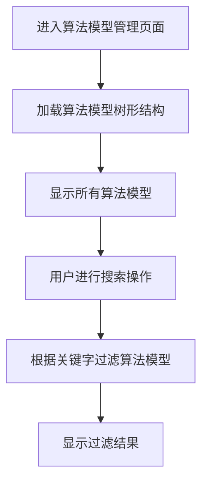
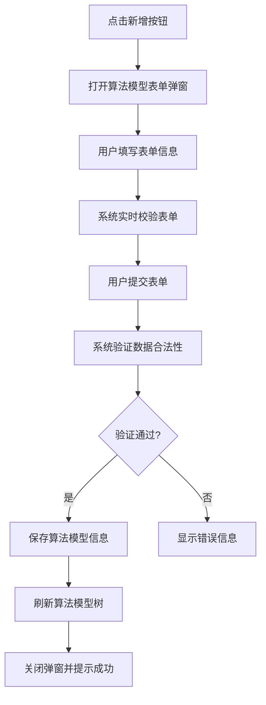
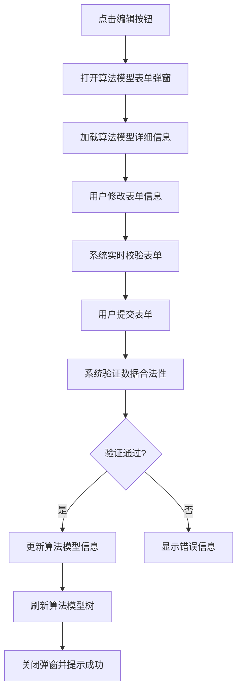
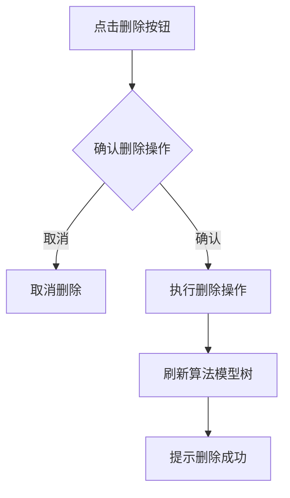
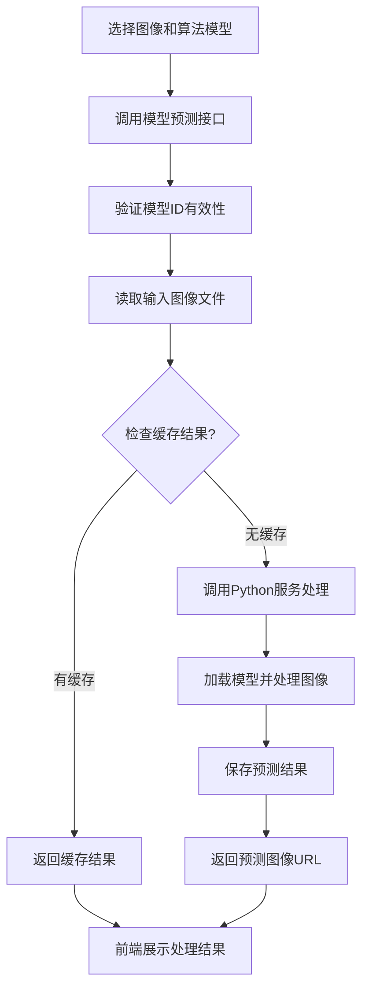
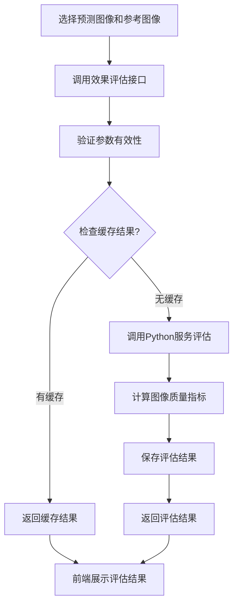

# 模型算法模块需求分析文档

## 1. 模块概述

### 1.1 模块名称
模型算法模块（Model Algorithm Module）

### 1.2 业务定位
模型算法模块是图像去雾系统的核心功能模块，负责管理系统中用于图像去雾处理的各种深度学习算法模型。该模块提供了完整的算法模型管理功能，包括模型的增删改查、模型预测处理、效果评估等核心功能。

### 1.3 业务价值
通过统一的模型算法管理机制，为系统提供多样化的去雾算法支持，实现算法的集中管理、效果评估和性能对比，为算法研究和实际应用提供支撑。

### 1.4 业务目标
- 实现算法模型的统一管理
- 提供多样化的图像去雾算法支持
- 支持算法效果的量化评估和对比分析
- 提供处理结果缓存机制，提高系统性能

## 2. 用户角色分析

### 2.1 主要用户角色
1. **算法研究员**：负责算法模型的管理、效果评估和性能分析
2. **系统管理员**：拥有模型算法模块的所有操作权限
3. **普通用户**：使用算法模型进行图像去雾处理

### 2.2 用户特征
- 算法研究员：具备算法专业知识，熟悉深度学习模型和图像处理技术
- 系统管理员：具备专业的系统管理知识，熟悉模型管理操作流程
- 普通用户：对图像处理有需求，但不需要深入的算法知识

## 3. 业务需求

### 3.1 核心业务需求

#### 3.1.1 算法模型管理
- 支持算法模型信息的创建、查询、修改和删除操作
- 支持算法模型的树形结构展示
- 支持按算法模型名称关键字搜索

#### 3.1.2 模型预测处理
- 根据指定模型对输入图像进行去雾处理
- 返回处理后的图像结果
- 支持处理结果的实时预览

#### 3.1.3 效果评估计算
- 根据预测图像和参考图像计算图像质量指标
- 支持多种评估指标的计算
- 提供评估结果的可视化展示

#### 3.1.4 性能指标管理
- 计算并存储模型的参数量和浮点运算量
- 展示模型的性能指标，便于算法选型

#### 3.1.5 处理结果缓存
- 对已处理的图像结果进行缓存
- 避免重复计算，提高系统性能
- 支持缓存结果的管理和清理

### 3.2 业务场景

#### 3.2.1 算法模型维护场景
当有新的去雾算法需要集成到系统中时，算法研究员可以通过模型算法模块进行模型的添加和配置。

#### 3.2.2 图像去雾处理场景
当用户需要对图像进行去雾处理时，可以选择合适的算法模型进行处理，并实时预览处理结果。

#### 3.2.3 算法效果评估场景
在算法研究过程中，需要对不同算法模型的处理效果进行量化评估和对比分析，以选择最优算法。

#### 3.2.4 算法性能分析场景
在算法选型过程中，需要了解不同算法模型的性能指标，如参数量、浮点运算量等，以评估算法的计算复杂度。

## 4. 功能需求清单

| 功能分类 | 功能点 | 描述 |
|---------|--------|------|
| 算法模型管理 | 模型列表展示 | 以树形结构展示所有算法模型 |
| | 条件筛选 | 支持按算法模型名称关键字搜索 |
| | 模型新增 | 支持创建新算法模型 |
| | 模型编辑 | 支持修改现有算法模型 |
| | 模型删除 | 支持删除算法模型 |
| 模型预测处理 | 图像去雾 | 根据指定模型对输入图像进行去雾处理 |
| | 结果预览 | 支持处理结果的实时预览 |
| | 进度显示 | 显示处理进度和状态 |
| 效果评估 | 指标计算 | 计算图像质量评估指标 |
| | 结果展示 | 以表格形式展示各项评估指标 |
| | 对比分析 | 支持不同算法模型的处理效果对比 |
| 性能管理 | 参数计算 | 计算并存储模型的参数量 |
| | FLOPs计算 | 计算并存储模型的浮点运算量 |
| | 性能展示 | 展示模型的性能指标 |
| 缓存管理 | 结果缓存 | 对处理结果进行缓存 |
| | 缓存清理 | 支持缓存结果的管理和清理 |

## 5. 非功能需求

### 5.1 性能需求
- 模型预测处理响应时间不超过5秒
- 支持至少20个算法模型的管理
- 图像质量评估计算时间不超过10秒
- 支持处理结果缓存机制，提高重复处理效率

### 5.2 安全需求
- 算法模型操作需进行权限验证（新增、编辑、删除等）
- 模型预测和评估接口需要JWT Token认证
- 敏感操作需进行二次确认

### 5.3 可用性需求
- 提供直观的算法模型管理界面
- 支持多种图像展示模式（重叠对比、并排对比等）
- 提供丰富的图像处理工具（放大镜、亮度调节等）
- 支持处理结果的实时预览

### 5.4 兼容性需求
- 兼容主流浏览器（Chrome、Firefox、Safari）
- 响应式设计，适配不同屏幕尺寸
- 支持多种图像格式（JPG、PNG等）

## 6. 核心业务流程

### 6.1 算法模型管理流程

### 6.2 算法模型新增流程

### 6.3 算法模型编辑流程

### 6.4 算法模型删除流程

### 6.5 图像去雾处理流程

### 6.6 效果评估流程

## 7. 业务规则

### 7.1 数据规则
1. 算法模型名称在系统中必须唯一
2. 模型文件路径必须有效且可访问
3. 图像质量评估指标包括PSNR、SSIM等

### 7.2 操作规则
1. 删除算法模型前需进行二次确认
2. 模型预测和评估需要JWT Token认证
3. 处理结果支持缓存机制避免重复计算

## 8. 依赖关系

### 8.1 依赖模块
1. **Python算法服务**：实际的深度学习模型推理和评估计算
2. **文件管理模块**：图像文件的存储和管理

### 8.2 被依赖模块
1. **图像处理模块**：依赖模型算法模块提供去雾算法支持
2. **效果评估模块**：依赖模型算法模块提供评估功能

## 9. 待确认事项

1. 算法模型的动态加载机制是否需要进一步优化？
2. 是否需要支持算法模型的导入/导出功能？
3. 是否需要增加算法模型的权限管理功能（不同用户可使用不同模型）？
4. 图像处理工具是否需要支持更多的交互功能？
5. 是否需要增加模型效果的可视化分析功能？