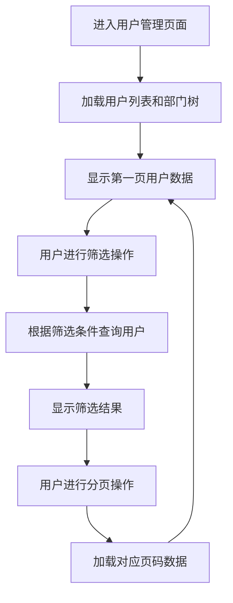
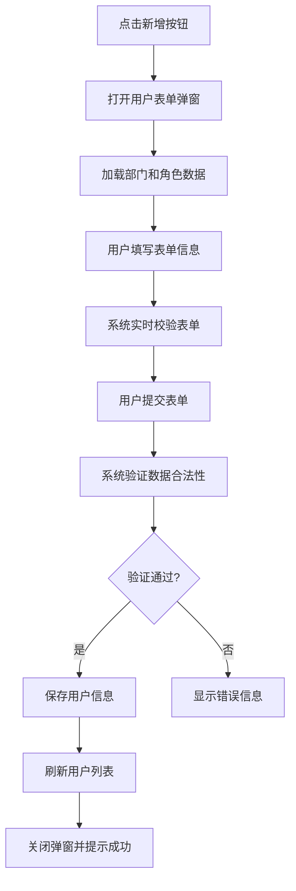
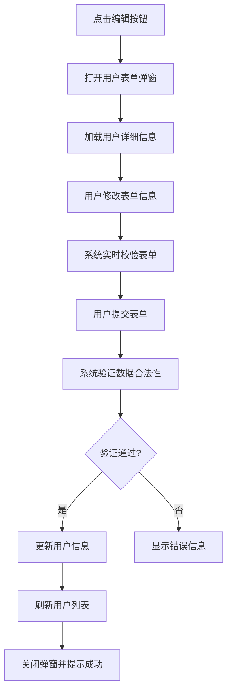
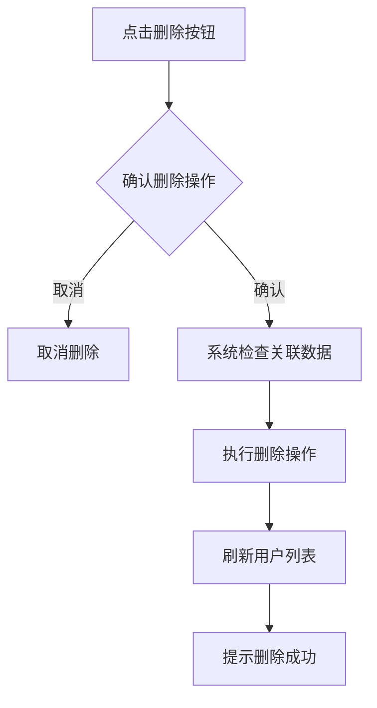
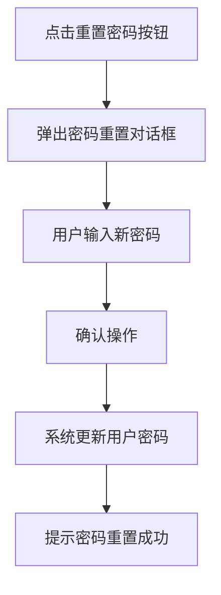

# 用户管理模块需求分析文档

## 1. 模块概述

### 1.1 模块名称
用户管理模块（User Management Module）

### 1.2 业务定位
用户管理模块是图像去雾系统后台管理系统的核心基础模块之一，负责管理系统中所有用户账户的全生命周期。该模块为系统提供用户身份识别、权限分配和安全控制等基础功能。

### 1.3 业务价值
通过统一的用户管理机制，确保系统安全性和用户权限的准确分配，为其他业务模块提供基础的用户身份验证和权限控制服务。

### 1.4 业务目标
- 实现系统用户的统一管理
- 提供完善的用户权限控制体系
- 支持用户与组织架构的关联管理
- 保障系统安全性和数据完整性

## 2. 用户角色分析

### 2.1 主要用户角色
1. **系统管理员**：拥有用户管理模块的所有操作权限，可以对系统中的所有用户进行增删改查操作
2. **普通用户**：仅能查看和修改自己的个人信息

### 2.2 用户特征
- 系统管理员：具备专业的系统管理知识，熟悉用户管理操作流程
- 普通用户：对系统管理不熟悉，仅关注个人账户信息的维护

## 3. 业务需求

### 3.1 核心业务需求

#### 3.1.1 用户信息管理
- 支持用户信息的创建、查询、修改和删除操作
- 支持用户与部门、角色的关联管理
- 支持用户状态的启用和禁用控制

#### 3.1.2 用户权限管理
- 支持为用户分配一个或多个系统角色
- 通过角色关联实现基于角色的访问控制（RBAC）

#### 3.1.3 用户批量操作
- 支持用户信息的批量导入（通过Excel模板）
- 支持用户列表的批量导出（Excel格式）

#### 3.1.4 安全管理
- 支持管理员为用户重置密码
- 用户密码需加密存储，确保数据安全

### 3.2 业务场景

#### 3.2.1 新员工入职场景
当新员工加入组织时，系统管理员需要为其创建用户账户，分配所属部门和相应角色，设置初始密码，确保其能够正常访问系统。

#### 3.2.2 员工离职场景
当员工离职时，系统管理员需要禁用或删除其用户账户，防止其继续访问系统资源。

#### 3.2.3 用户信息变更场景
当用户的基本信息（如部门调动、角色变更等）发生变化时，系统管理员需要及时更新用户信息。

#### 3.2.4 批量用户管理场景
当组织进行大规模人员调整时，系统管理员可以通过批量导入功能快速完成用户信息的更新。

## 4. 功能需求清单

| 功能分类 | 功能点 | 描述 |
|---------|--------|------|
| 用户查询 | 用户列表展示 | 支持分页展示用户列表 |
| | 条件筛选 | 支持按用户名、昵称、手机号等关键字搜索 |
| | 部门筛选 | 支持按部门筛选用户 |
| | 状态筛选 | 支持按用户状态（启用/禁用）筛选 |
| | 时间筛选 | 支持按创建时间范围筛选 |
| 用户操作 | 用户新增 | 支持创建新用户，包括基本信息、部门、角色等 |
| | 用户编辑 | 支持修改现有用户信息 |
| | 用户删除 | 支持删除单个或批量删除用户 |
| | 密码重置 | 支持管理员为用户重置密码 |
| | 状态管理 | 支持启用或禁用用户账户 |
| 批量操作 | 用户导入 | 支持通过Excel模板批量导入用户信息 |
| | 用户导出 | 支持将用户列表导出为Excel文件 |
| 个人中心 | 个人信息查看 | 用户可查看自己的基本信息 |

## 5. 非功能需求

### 5.1 性能需求
- 用户列表查询响应时间不超过500ms
- 支持至少10000个用户的信息管理
- 批量导入支持至少100条用户记录同时处理

### 5.2 安全需求
- 用户操作需进行权限验证（新增、编辑、删除等）
- 密码重置需进行身份确认
- 敏感操作需进行二次确认
- 用户密码需加密存储

### 5.3 可用性需求
- 提供直观的用户信息管理界面
- 表单操作具有明确的校验提示
- 支持键盘快捷操作

### 5.4 兼容性需求
- 兼容主流浏览器（Chrome、Firefox、Safari）
- 响应式设计，适配不同屏幕尺寸

## 6. 核心业务流程

### 6.1 用户浏览流程

### 6.2 用户新增流程

### 6.3 用户编辑流程

### 6.4 用户删除流程

### 6.5 密码重置流程

## 7. 业务规则

### 7.1 数据规则
1. 用户名在系统中必须唯一
2. 用户手机号需符合手机号格式规范
3. 用户邮箱需符合邮箱格式规范
4. 用户密码需加密存储

### 7.2 操作规则
1. 用户名一旦创建不可修改
2. 删除用户前需进行二次确认
3. 重置密码需管理员权限
4. 批量操作需相应权限控制

## 8. 依赖关系

### 8.1 依赖模块
1. **部门管理模块**：用户需要关联到具体部门
2. **角色管理模块**：用户需要分配系统角色
3. **字典管理模块**：用户性别等信息需要字典数据支持

### 8.2 被依赖模块
1. **系统所有业务模块**：依赖用户管理模块提供用户身份验证和权限控制

## 9. 待确认事项

1. 用户名是否允许修改？当前实现中用户名设置为只读
2. 用户删除是否需要考虑数据关联性检查，如该用户是否有关联的业务数据？
3. 是否需要增加用户登录日志查看功能？
4. 用户导入时，对于已存在的用户名应如何处理？是覆盖还是跳过？
5. 是否需要增加用户登录失败次数限制和锁定机制？