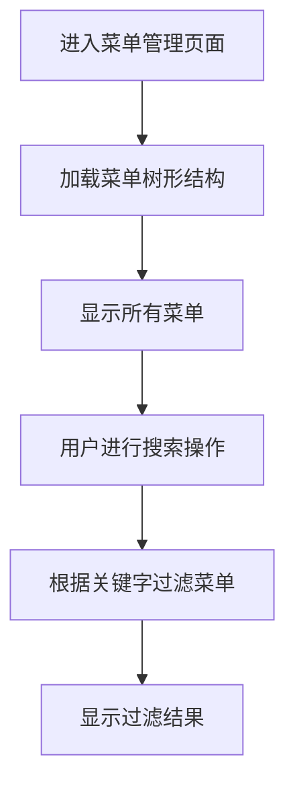
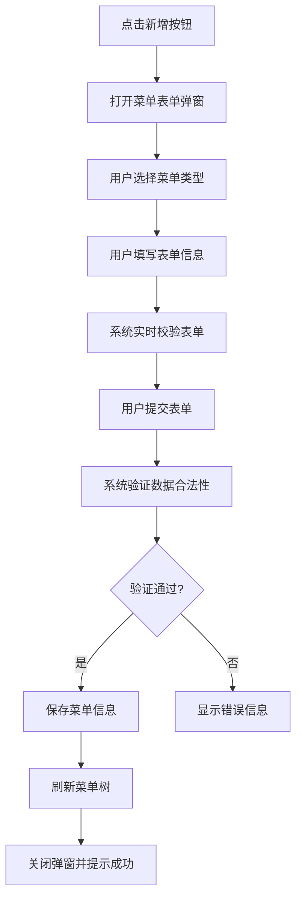
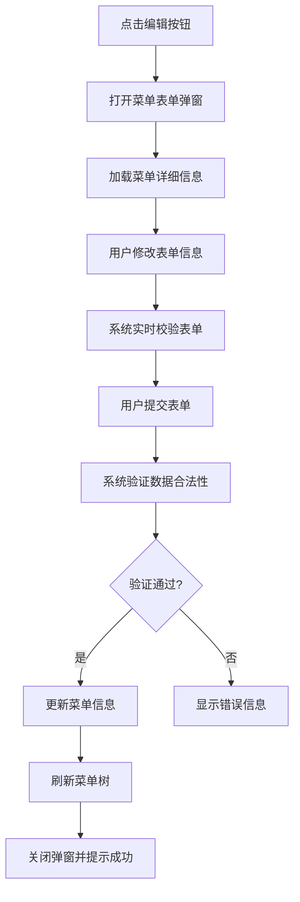
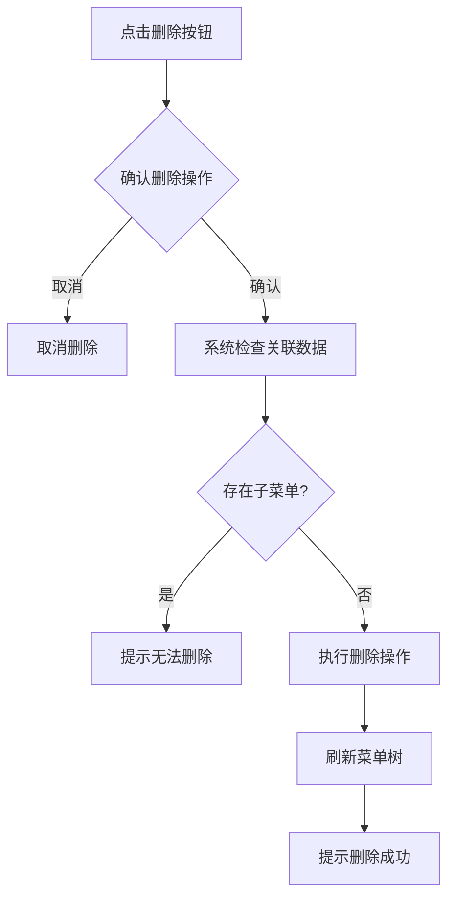
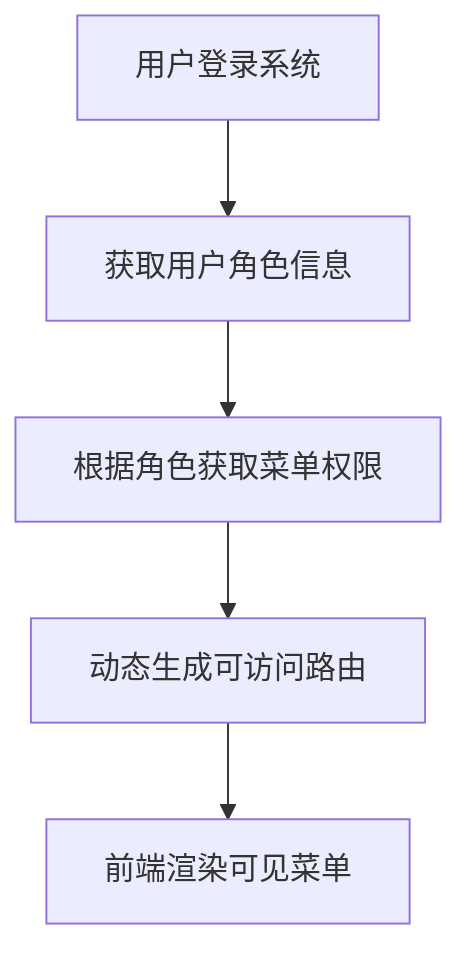

# 菜单管理模块

## 1. 模块概述

### 1.1 模块名称

菜单管理模块（Menu Management Module）

### 1.2 业务定位

菜单管理模块是图像去雾系统后台管理系统的重要组成部分，负责维护系统的导航菜单结构。该模块提供了完整的菜单增删改查功能，支持多级菜单结构、菜单类型分类、菜单显示控制以及权限标识配置等功能。

### 1.3 业务价值

通过统一的菜单管理机制，构建和维护系统的导航结构，实现基于角色的菜单访问控制，保障系统安全性和用户体验的一致性。

### 1.4 业务目标

- 实现系统菜单的统一管理
- 支持多级菜单结构
- 提供灵活的菜单权限控制
- 保障系统导航结构的清晰性和易用性

## 2. 用户角色分析

### 2.1 主要用户角色

1. **系统管理员**：拥有菜单管理模块的所有操作权限，可以对系统中的所有菜单进行增删改查操作

### 2.2 用户特征

- 系统管理员：具备专业的系统管理知识，熟悉菜单管理操作流程

## 3. 业务需求

### 3.1 核心业务需求

#### 3.1.1 菜单信息管理

- 支持菜单信息的创建、查询、修改和删除操作
- 支持多级菜单结构管理
- 支持四种菜单类型：目录、菜单、按钮、外链

#### 3.1.2 菜单显示控制

- 支持设置菜单的显示/隐藏状态
- 支持自定义菜单显示顺序
- 支持菜单关键字搜索过滤

#### 3.1.3 权限配置管理

- 为按钮类型菜单配置权限标识符
- 为菜单配置对应的前端路由路径和组件
- 支持菜单与角色权限的关联管理

#### 3.1.4 菜单结构管理

- 支持父子菜单的层级关系管理
- 提供菜单下拉选项，用于父子菜单关联
- 支持菜单树形结构展示

### 3.2 业务场景

#### 3.2.1 菜单结构维护场景

当系统功能发生变化或新增功能模块时，系统管理员需要维护相应的菜单结构，包括新增菜单项、修改菜单属性、删除废弃菜单等操作。

#### 3.2.2 菜单权限配置场景

在角色管理过程中，需要为不同角色分配相应的菜单权限，菜单管理模块需要提供权限标识配置功能。

#### 3.2.3 菜单显示控制场景

在系统功能灰度发布或维护期间，需要临时隐藏某些菜单项，通过菜单显示控制功能实现。

#### 3.2.4 路由配置场景

在前端开发过程中，需要为菜单项配置对应的路由路径和组件，确保导航功能正常工作。

## 4. 功能需求清单

| 功能分类 | 功能点    | 描述                  |
|------|--------|---------------------|
| 菜单查询 | 菜单列表展示 | 以树形结构展示系统所有菜单       |
|      | 关键字搜索  | 支持按菜单名称关键字搜索        |
| 菜单操作 | 菜单新增   | 支持创建四种类型的菜单项        |
|      | 菜单编辑   | 支持修改现有菜单的各项属性       |
|      | 菜单删除   | 支持删除不需要的菜单项         |
| 显示控制 | 显示状态管理 | 支持设置菜单的显示/隐藏状态      |
|      | 排序管理   | 支持自定义菜单显示顺序         |
| 权限配置 | 权限标识配置 | 为按钮类型菜单配置权限标识符      |
|      | 路由配置   | 为菜单配置对应的前端路由路径和组件   |
| 数据提供 | 下拉选项   | 提供树形菜单下拉选项，用于父子菜单关联 |

## 5. 非功能需求

### 5.1 性能需求

- 菜单列表查询响应时间不超过500ms
- 菜单树形结构渲染支持最多5级深度
- 支持至少1000个菜单项的管理和展示

### 5.2 安全需求

- 菜单操作需进行权限验证（新增、编辑、删除等）
- 菜单权限与用户角色绑定，防止越权访问
- 敏感操作需进行二次确认

### 5.3 可用性需求

- 提供直观的树形菜单展示界面
- 支持菜单拖拽排序（待实现）
- 表单操作具有明确的校验提示

### 5.4 兼容性需求

- 兼容主流浏览器（Chrome、Firefox、Safari）
- 响应式设计，适配不同屏幕尺寸

## 6. 核心业务流程

### 6.1 菜单浏览流程

### 6.2 菜单新增流程

### 6.3 菜单编辑流程

### 6.4 菜单删除流程

### 6.5 菜单权限控制流程

## 7. 业务规则

### 7.1 数据规则

1. 菜单名称在同一层级下必须唯一
2. 菜单类型包括：目录、菜单、按钮、外链四种类型
3. 权限标识符在系统中必须唯一
4. 菜单排序字段为整数类型

### 7.2 操作规则

1. 删除菜单前需检查是否存在子菜单
2. 按钮类型菜单必须配置权限标识符
3. 菜单显示状态可实时切换

## 8. 依赖关系

### 8.1 依赖模块

1. **角色管理模块**：菜单需要与角色权限进行关联

### 8.2 被依赖模块

1. **系统所有业务模块**：依赖菜单管理模块提供导航结构
2. **前端路由系统**：依赖菜单配置生成路由信息

## 9. 待确认事项

1. 当前菜单管理界面未实现菜单拖拽排序功能，是否需要补充实现？
2. 菜单删除操作是否需要支持批量删除多个菜单项？
3. 是否需要增加菜单导入/导出功能，以便快速初始化系统菜单？
4. 菜单图标选择器目前依赖第三方图标库，是否需要支持自定义图标上传？
