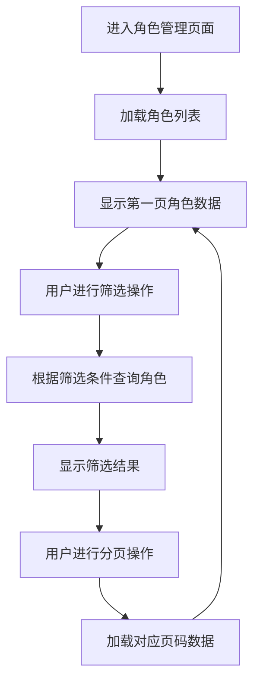
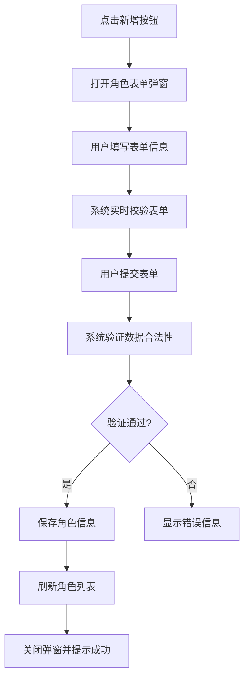
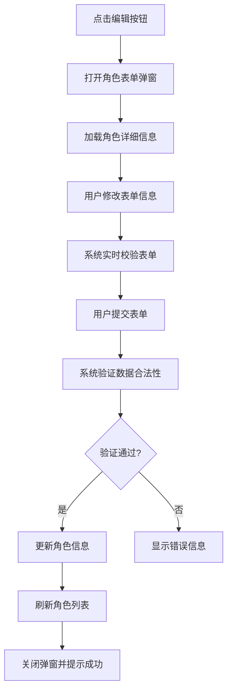
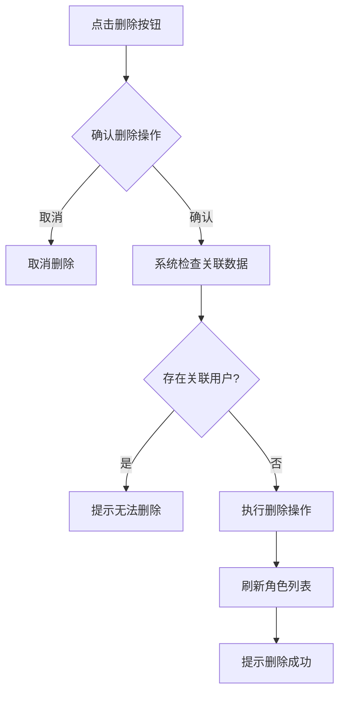
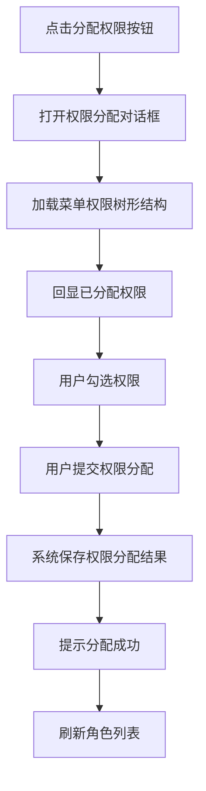

# 角色管理模块

## 1. 模块概述

### 1.1 模块名称
角色管理模块（Role Management Module）

### 1.2 业务定位
角色管理模块是图像去雾系统权限管理体系的核心组成部分，负责定义和管理系统中的各种角色及其权限。该模块提供了完整的角色增删改查功能，支持角色与菜单权限（包括按钮权限）的关联配置。

### 1.3 业务价值
通过角色管理机制，实现系统权限的集中管理和灵活分配，为用户管理提供权限基础，确保系统安全性和访问控制的准确性。

### 1.4 业务目标
- 实现系统角色的统一管理
- 提供灵活的权限分配机制
- 支持数据权限的细粒度控制
- 保障系统安全性和权限控制的准确性

## 2. 用户角色分析

### 2.1 主要用户角色
1. **系统管理员**：拥有角色管理模块的所有操作权限，可以对系统中的所有角色进行增删改查操作

### 2.2 用户特征
- 系统管理员：具备专业的系统管理知识，熟悉权限管理操作流程

## 3. 业务需求

### 3.1 核心业务需求

#### 3.1.1 角色信息管理
- 支持角色信息的创建、查询、修改和删除操作
- 支持角色状态的启用和禁用控制
- 支持角色编码的唯一性约束

#### 3.1.2 权限分配管理
- 支持为角色分配菜单权限（包括按钮权限）
- 支持权限的树形结构展示和管理
- 支持批量权限分配操作

#### 3.1.3 数据权限管理
- 支持配置角色的数据访问范围
- 支持多种数据权限模式（全部数据、部门数据、个人数据等）

#### 3.1.4 角色状态管理
- 支持角色状态的实时切换
- 支持批量角色状态变更

### 3.2 业务场景

#### 3.2.1 角色创建场景
当系统需要新增特定职能的用户群体时，系统管理员需要创建对应的角色，并为其分配相应的功能权限和数据权限。

#### 3.2.2 权限调整场景
当系统功能发生变化或业务需求调整时，需要对现有角色的权限进行调整，以适应新的业务要求。

#### 3.2.3 角色状态变更场景
当某些角色暂时不需要使用或需要临时禁用时，系统管理员可以通过变更角色状态来控制用户权限。

#### 3.2.4 数据权限配置场景
根据不同角色的业务需求，需要配置相应的数据访问范围，确保用户只能访问其职责范围内的数据。

## 4. 功能需求清单

| 功能分类 | 功能点 | 描述 |
|---------|--------|------|
| 角色查询 | 角色列表展示 | 支持分页展示角色列表 |
| | 条件筛选 | 支持按角色名称关键字搜索 |
| 角色操作 | 角色新增 | 支持创建新角色，包括基本信息、数据权限等 |
| | 角色编辑 | 支持修改现有角色信息 |
| | 角色删除 | 支持删除单个或批量删除角色 |
| | 状态管理 | 支持启用或禁用角色 |
| 权限管理 | 权限分配 | 支持为角色分配菜单权限（包括按钮权限） |
| | 数据权限配置 | 支持配置角色的数据访问范围 |
| 数据提供 | 下拉选项 | 提供角色下拉选项，供其他模块使用 |

## 5. 非功能需求

### 5.1 性能需求
- 角色列表查询响应时间不超过500ms
- 支持至少1000个角色的信息管理
- 权限分配操作响应时间不超过1秒

### 5.2 安全需求
- 角色操作需进行权限验证（新增、编辑、删除等）
- 敏感操作需进行二次确认
- 角色编码需保证唯一性

### 5.3 可用性需求
- 提供直观的角色信息管理界面
- 权限分配采用树形结构展示，便于理解和操作
- 表单操作具有明确的校验提示

### 5.4 兼容性需求
- 兼容主流浏览器（Chrome、Firefox、Safari）
- 响应式设计，适配不同屏幕尺寸

## 6. 核心业务流程

### 6.1 角色浏览流程

### 6.2 角色新增流程

### 6.3 角色编辑流程

### 6.4 角色删除流程

### 6.5 权限分配流程

## 7. 业务规则

### 7.1 数据规则
1. 角色编码在系统中必须唯一
2. 角色名称在同一层级下建议唯一
3. 数据权限范围包括：全部数据、部门及子部门数据、本部门数据、本人数据

### 7.2 操作规则
1. 删除角色前需检查是否存在关联用户
2. 角色状态可实时切换（启用/禁用）
3. 权限分配支持批量操作

## 8. 依赖关系

### 8.1 依赖模块
1. **菜单管理模块**：角色需要关联到具体菜单权限
2. **字典管理模块**：角色状态等信息需要字典数据支持

### 8.2 被依赖模块
1. **用户管理模块**：用户需要分配系统角色
2. **系统所有业务模块**：依赖角色管理模块提供权限控制

## 9. 待确认事项

1. 角色删除时是否需要检查是否存在关联的用户？如存在应如何处理？
2. 是否需要增加角色复制功能，以便快速创建相似角色？
3. 是否需要增加角色导入导出功能？
4. 数据权限的具体实现机制是怎样的？如何与部门管理模块协同工作？
5. 是否需要增加角色使用统计功能，展示各角色的用户数量？