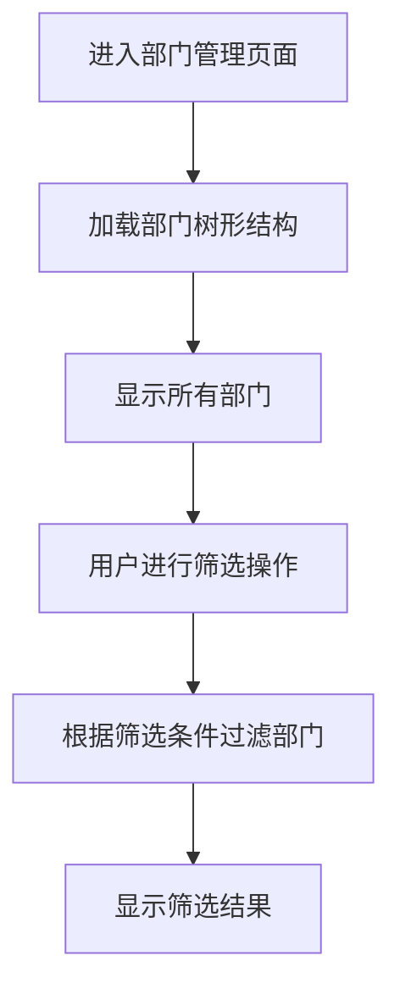
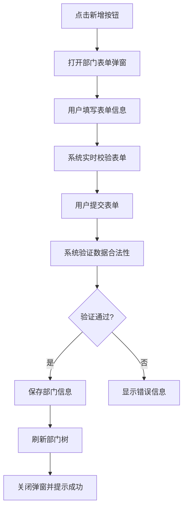
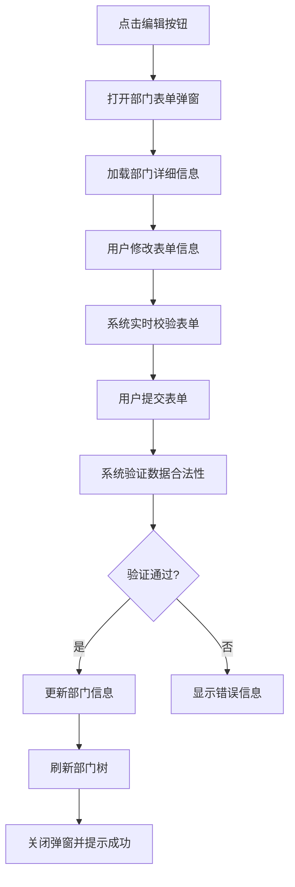
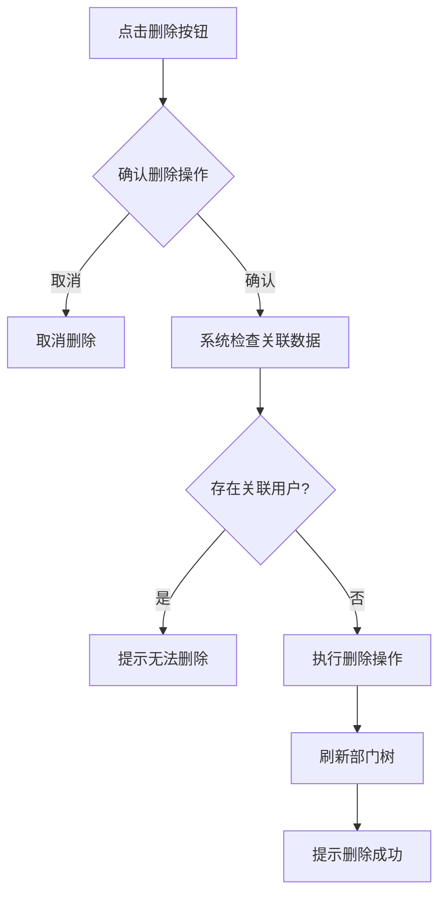

# 部门管理模块

## 1. 模块概述

### 1.1 模块名称

部门管理模块（Department Management Module）

### 1.2 业务定位

部门管理模块是图像去雾系统组织架构管理的重要组成部分，负责维护和管理系统中的部门组织结构。该模块提供了完整的部门增删改查功能，支持部门的树形层级结构管理。

### 1.3 业务价值

通过统一的部门管理机制，构建和维护企业的组织架构，为用户管理提供部门归属信息，并为数据权限控制提供组织基础。

### 1.4 业务目标

- 实现组织架构的统一管理
- 支持多层级部门结构
- 为用户管理模块提供部门归属信息
- 为角色管理模块提供数据权限基础

## 2. 用户角色分析

### 2.1 主要用户角色

1. **系统管理员**：拥有部门管理模块的所有操作权限，可以对系统中的所有部门进行增删改查操作

### 2.2 用户特征

- 系统管理员：具备专业的系统管理知识，熟悉组织架构管理操作流程

## 3. 业务需求

### 3.1 核心业务需求

#### 3.1.1 部门信息管理

- 支持部门信息的创建、查询、修改和删除操作
- 支持部门的树形层级结构管理
- 支持部门状态的启用和禁用控制

#### 3.1.2 部门排序管理

- 支持设置部门的显示顺序
- 支持按排序字段展示部门列表

#### 3.1.3 部门查询功能

- 支持按部门名称关键字筛选部门
- 支持按部门状态筛选部门

### 3.2 业务场景

#### 3.2.1 组织架构调整场景

当企业组织架构发生变化时，系统管理员需要及时更新部门信息，包括新增部门、修改部门信息、删除部门等操作。

#### 3.2.2 部门状态变更场景

当某个部门暂停使用或恢复使用时，系统管理员需要变更部门状态，以控制该部门下用户的访问权限。

#### 3.2.3 用户归属管理场景

在用户管理过程中，需要为用户分配所属部门，部门管理模块需要提供部门下拉选项供选择。

## 4. 功能需求清单

| 功能分类 | 功能点    | 描述                      |
|------|--------|-------------------------|
| 部门查询 | 部门列表展示 | 以树形结构展示所有部门             |
|      | 条件筛选   | 支持按部门名称和状态筛选            |
| 部门操作 | 部门新增   | 支持创建新部门，包括基本信息、上级部门、排序等 |
|      | 部门编辑   | 支持修改现有部门信息              |
|      | 部门删除   | 支持删除单个或批量删除部门           |
|      | 状态管理   | 支持启用或禁用部门               |
|      | 排序设置   | 支持设置部门的显示顺序             |
| 数据提供 | 下拉选项   | 提供部门树形下拉选项，供其他模块使用      |

## 5. 非功能需求

### 5.1 性能需求

- 部门列表查询响应时间不超过500ms
- 支持至少100个部门的信息管理
- 树形结构渲染支持最多5级深度

### 5.2 安全需求

- 部门操作需进行权限验证（新增、编辑、删除等）
- 敏感操作需进行二次确认
- 删除部门时需检查是否存在关联用户

### 5.3 可用性需求

- 提供直观的树形部门管理界面
- 支持快速新增下级部门操作
- 表单操作具有明确的校验提示

### 5.4 兼容性需求

- 兼容主流浏览器（Chrome、Firefox、Safari）
- 响应式设计，适配不同屏幕尺寸

## 6. 核心业务流程

### 6.1 部门浏览流程

### 6.2 部门新增流程

### 6.3 部门编辑流程

### 6.4 部门删除流程

## 7. 业务规则

### 7.1 数据规则

1. 部门名称在同一层级下必须唯一
2. 部门状态包括启用和禁用两种状态
3. 部门排序字段为整数类型

### 7.2 操作规则

1. 删除部门前需检查是否存在关联用户
2. 系统内置根部门不可删除
3. 部门状态变更需相应权限控制

## 8. 依赖关系

### 8.1 依赖模块

1. **字典管理模块**：部门状态等信息需要字典数据支持

### 8.2 被依赖模块

1. **用户管理模块**：用户需要关联到具体部门
2. **角色管理模块**：角色数据权限需要部门信息支持

## 9. 待确认事项

1. 删除部门时是否需要检查是否存在关联的用户？如存在应如何处理？
2. 是否需要增加部门复制功能，以便快速创建相似部门结构？
3. 是否需要支持部门的拖拽排序功能？
4. 是否需要增加部门导入导出功能？
5. 是否需要增加部门负责人字段及相关管理功能？
