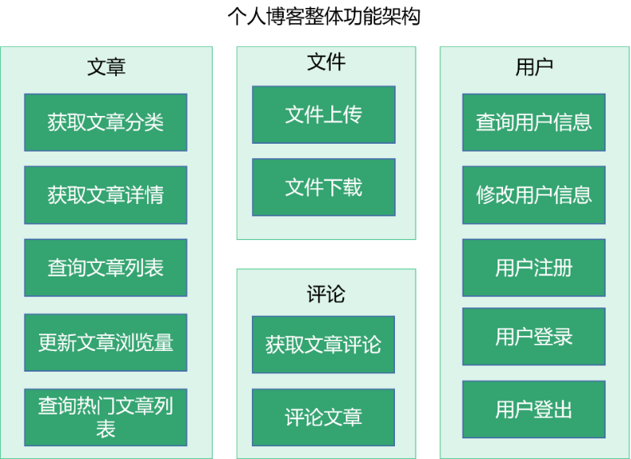
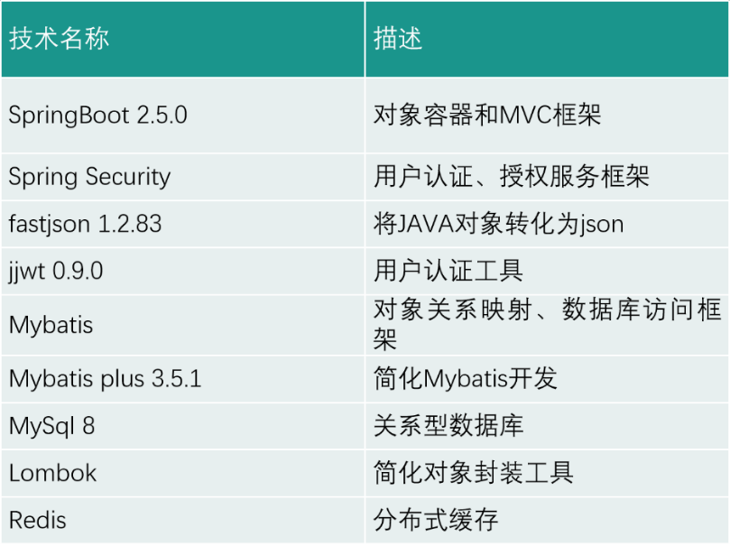
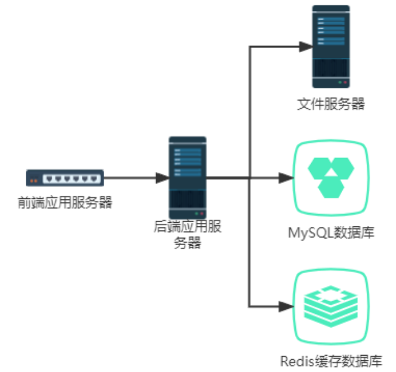
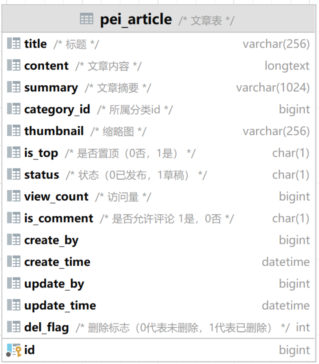
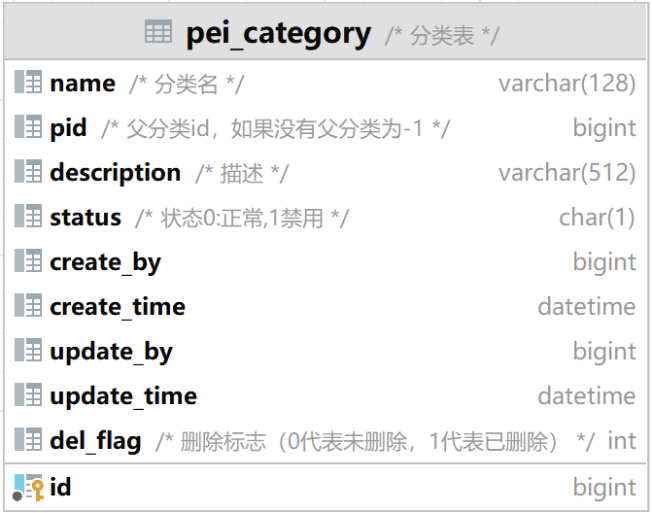
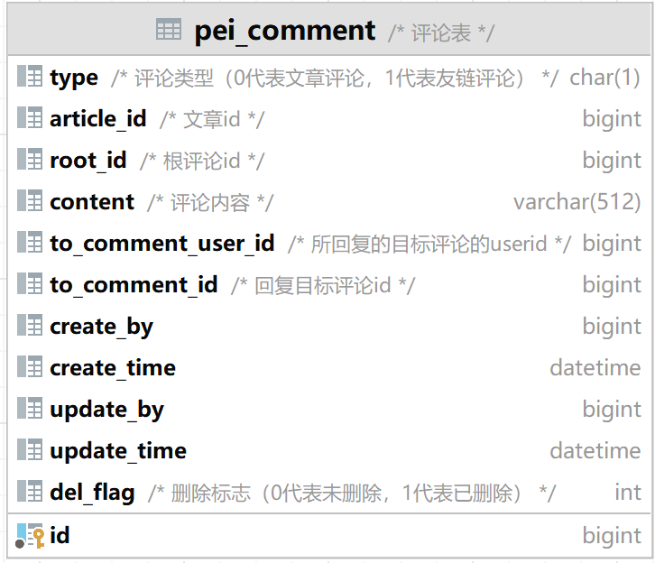
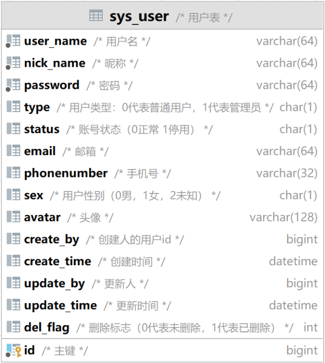
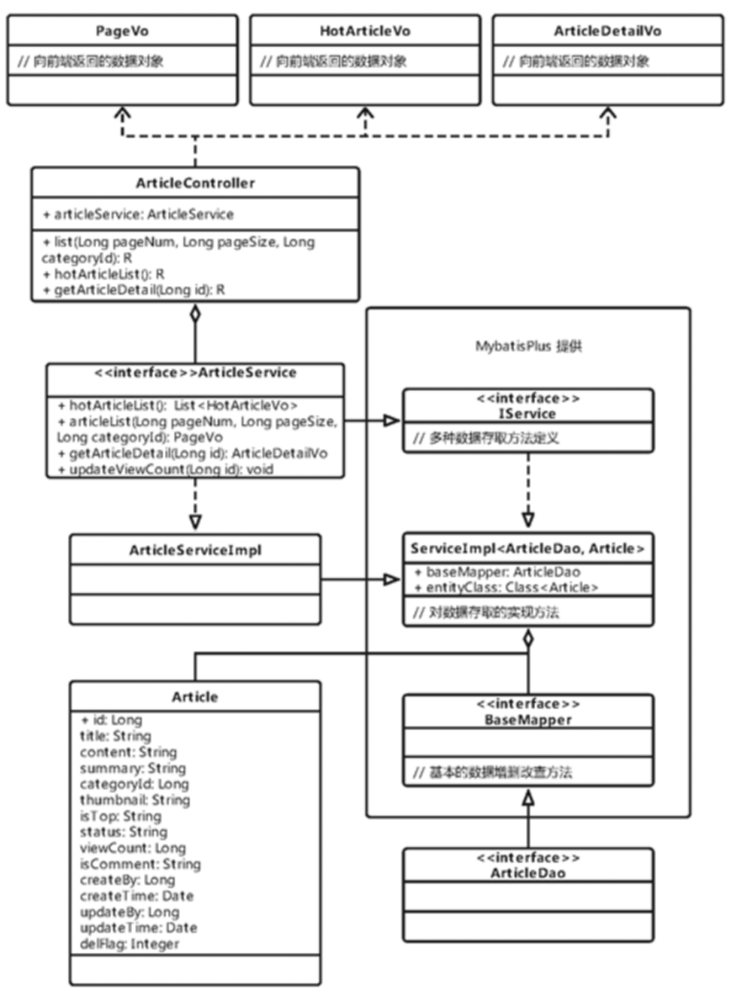
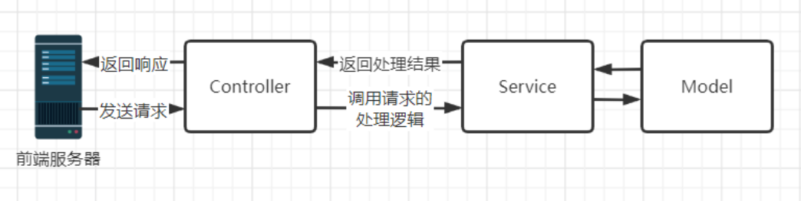
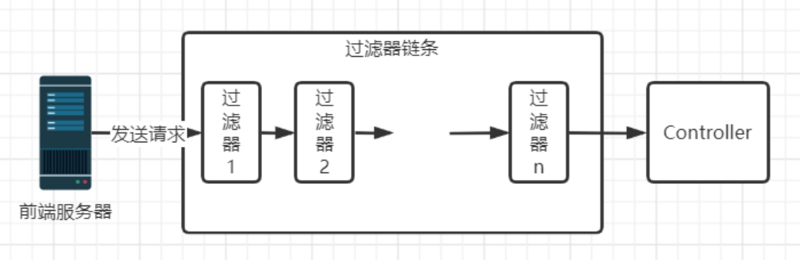

# 系统详细设计
## 架构设计

### **业务架构**

业务架构主要考虑到软件的功能需求，进行问题域的划分和领域建模等工作。架构模式如下：

### **技术架构**

技术架构主要考虑系统的非功能性特征，对系统的高可用、高性能、扩展、安全、伸缩性、简洁等做系统级的把握。

### **物理架构**

物理架构关注软件是如何放到硬件上的，专注于基础设施，选用了某种硬件体系或者云平台，包括机房搭建、网络拓扑，网络分流器，代理服务器，web服务器等。本应用的物理架构图如下：

## 数据库设计

根据系统功能模块的设计，共设计有以下4张数据表。为了更好的对每条数据进行管理，每张表格都会有创建时间、创建人、更新时间、更新人字段。方便我们事后追溯数据来源。为了防止用户误删数据，我们针对每张表格都设计有删除标志字段，数据在删除时仅仅时逻辑上删除了，数据仍然保留在数据库中。

第一张表为文章表，是最重要的一张表，用于存储博客系统中的所有文章以及相关信息。主要存储字段是文章id，文章标题，文章内容，文章摘要，所属分类id，文章缩略图，是否置顶，状态，访问量，是否允许评论。如下图所示：

第二张表为分类表，不同的文章有不同的类别，比如一篇主要内容是描述Java在编程中的应用文章，我们应该把文章分类到计算机编程-Java下，以便读者查询。因此该表用于存储文章的类别。主要存储字段是分类id，名称，父分类id，描述，状态。如下图所示：

第三张表为评论表，我们在设计博客时，为了增加读者和作者之间的互动，特地设计每篇文章都可以进行评论，已登录的用户可以发表自己对该文章的读后感。每条评论也可以进行回复。因此设计了根评论ID、所回复的目标评论ID等字段。该表主要存储字段为评论id，评论类型，所属文章id，根评论id，评论内容，回复的目标评论id，回复的目标评论所属用户id。如下图所示：

第四张表是用户表，访问博客系统的用户中，只有已登录用户才能够对文章进行评论。因此我们设计用户表来存储登录用户的信息。主要存储字段为用户id，用户名称，昵称，密码，用户类型，用户状态，邮箱，电话号码，性别，头像。如下图所示：

## 功能模块设计

### **文章管理模块**

文章管理是整个系统中最重要的部分，本文着重讲解该模块，我们可以使用类图来表示该功能的结构。

接下来是具体的功能设计分析：

**查询文章列表功能：**采用分页查询方法查询出对应类别的文章列表，一次性向前端返回指定条数的文章列表，防止单次查询对服务器压力过大，造成服务器崩溃。分页查询主要依靠Mybatis Plus提供的分页插件和筛选器，首先构造一个筛选器对象，按照给定的条件筛选出文章，随后查询数据库获取文章，最后将查询结果转换为发给前端的VO对象。

**查询文章详情功能：**需要从前端获取文章id，然后根据id查询数据库，返回数据库中对应的文章信息，随后使用Redis中获取文章的访问量信息。将这些数据封装为传输给前端的VO对象。

**获取文章分类列表功能：**根据对需求的分析，我们可以了解到，获取文章分类信息，并不是指所有文章的分类信息，而是目前已经正式发布的文章，并且文章状态需要是正常，在文章表的设计中，我们把文章分为了已逻辑删除，未删除两种状态，并且所有的文章还有草稿、正式发布这两种状态。数据库中目前存放的文章分类是所有文章的分类，不符合我们的要求，我们需要构造筛选器进行筛选，随后向前端返回文章分类列表。

### **评论管理模块**

**获取评论列表功能：**在数据库中，所有的评论不分文章，不分层级都是放到一个评论表中的。我们根据个人博客的设计需求，每一篇文章都有独立的评论区，用户可以输入对该文章的评论，最后评论将会显示在文章下侧，并且用户可以对评论进行回复，如果这条评论是根评论，用户对该评论的回复会作为该评论的子评论显示在这条评论的下方，具体样式如下图所示：

因此针对评论列表的获取，我们需要采用递归的方法来获取。

首先根据文章id获取当前文章下所有的根评论，并且按照创建时间排序。对于获取到的每一条评论，我们根据评论id递归的查询它所对应的子评论，并放到children属性中，最终我们将以树形数据结构获得属于该篇文章的所有评论。将其返回到前端页面进行展示。

**添加评论功能：**需要前端传入对应的评论信息，然后根据当前已登录用户的Id，向评论表中添加一条记录，向前端返回成功提示。

### **文件管理模块**

文件管理模块分为两个功能，一是文件上传，二是文件下载。目前主要用途一是加载博客中文章的缩略图，文章内容中的图片，二是上传和加载用户的头像。已登录用户在用户信息修改界面点击修改图像，使用后端系统提供的文件上传API，就能够选择想要上传的图片上传到服务器的指定位置，返回当前文件在服务器上的名称，下一次用户使用文件下载API，带上文件名称，便可以查看当前图像。博客文章缩略图和图片则是在对应获取途径中获取文件名称，然后使用API获取图像。

### **用户管理模块**

用户管理主要涉及到有需求登录到博客系统的人员，网站的访问者在进入博客系统时并不需要登录，只有当访问者希望对文章进行评论或者访问用户界面时，才需要登录，如果没有账号就需要注册。在用户界面中，主要呈现的是当前已登录用户的详细信息。用户可以在当前页面查看自己的信息或者选择修改当前的信息。

**注册登录功能：**主要依赖于SpringSecurity框架实现，博客系统认证登录的逻辑实现

1. 创建一个用于spring security认证的token传入用户名密码
2. 调用authenticationManager的认证方法进行认证
3. 如果没有认证信息，说明不是本系统的用户，返回用户名密码错误
4. 如果是本系统成员，我们可以从认证信息中获取用户信息。这里来的用户信息类型是spring security提供的UserDetails接口，我们在项目中需要实现它。
5. 从UserDetails中获取我们自己的数据库实体对象，获取用户id生成jwt token，jwt token将连带着部分用户信息返回给前端
6. 把用户信息存放到redis中，下次认证授权会先根据前端传来的jwt token查询redis中是否有信息。如果没有说明用户要么没登陆，要么不是本系统用户。

注意我们在使用SpringSecurity进行用户验证登录时，需要实现框架定义的UserDetailsService，并重写其中的loadUserByUsername方法，写出用户判断调用逻辑。

**用户下线功能**：首先从SecurityContextHolder获取对应用户的认证授权信息，然后获取到用户信息——用户id，根据用户id找到redis中对应值删除。

### **基础功能模块**

#### MVC模式

系统在设计上采用了MVC模式，即模型-视图-控制器模式，这种模式适用于应用程序的分层开发。

其中模型Model指的是后端传递的应用数据实体，在本系统中指的是framework.entity包下的所有类。

控制器Controller用于处理前端请求。在本系统中，还添加了Service层来处理复杂的业务逻辑。

视图View在前后端分离的系统中交给了前端工程师去实现，本系统中暂未考虑。

整体效果如下图所示：

#### 拦截过滤器模式、责任链模式

在接收前端发送来的请求和返回响应的时候，采用了拦截过滤器模式，这种模式是对应用程序的请求或者响应做一些预处理。我们定义一个过滤器，并把请求传给实际的Controller之前，过滤器可以对请求做认证、授权、记录日志等操作，如果发现用户拥有对应的权限，则对请求进行放行。

多个拦截过滤器组成了责任链，责任链模式为请求创建了一组由多个过滤器组成的链条，如果前一个过滤器无法处理请求，他会将相同的请求传递给下一个接收者，以此类推。

前端发来的请求只需要发送到责任链的链头处，无需关系请求处理细节和请求的传递。

#### 数据访问对象模式

在对应用数据的操作中采用了数据访问对象模式（DAO），在Java中，把对数据库访问获取的对象从复杂的操作中分离出来。

#### 工厂模式

在本系统的Service层、Dao层中，采用了工厂模式创建对象，定义一个Service接口（或者Dao接口），让其子类自己决定是实例化接口方法的具体代码实现。

优点是，如果对于同一种服务，存在不同的业务实现逻辑。调用者如果想要调用该服务，只需要知道其接口名称，而不必关系具体的实现类。如果想要增加一个业务实现逻辑，只需要再定义一个类，实现该接口即可。

