# 项目总体规划

## WBS分解

### 概念

#### 定义

工作分解结构（WorkBreakdownStructure）：以可交付成果为导向对项目要素进行的分组，它归纳和定义了项目的整个工作范围每下降一层代表对项目工作的更详细定义。

其由三个部分组成，如下：

Work工作：指的是某种输出、工作成果，或可交付性成果，如做一道水煮鱼、开启一盏灯，一道水煮鱼的菜和一盏亮起的灯就是输出、可交付性成果；

Breakdown分解：将工作划分成不同部分或类别；分离成更简单且可识别的事物，比如说做一道水煮鱼，可以分解为购买食材、清洗食材、烹饪等不同的部分。

Structure结构：用确定的组织方式来安排事物，比如水煮鱼分解结构为按照操作顺序的组织方式来安排的,其他还有事物的物理结构、地域等组织安排方式。

基于以上的定义，我们可以把WBS理解为将一个大的可交付性的工作成果按照一定的组织安排方式来逐级分解成多级多个的可交付性成果。这里的可交付性成果就是Work，逐级分解就是Breakdown，按照一定的组织方式就是Structure。

#### 特点

基于以上定义，WBS具有以下特点：

1．支持对实现输出、目标、可交付性成果所需的所有工作的定义。
2．用来说明并定义可交付性成果的层级结构，此层级结构是以“父子”关系的形式建立起来的。
3．WBS有一个客观或具体的结果，这个结果被称为可交付性成果、输出或结果。WBS代表了对项目可交付成果和范围的清晰描述，也就是这个项目是什么。WBS描述的不是如何或何时产出可交付性成果，而是对项目输出、项目范围、产品范围或者可交付成果的描述和细化。

#### 相关术语

层级的：按照各种指标划分成连续的级别或层次。

分解：把项目范围和项目可交付性成果划分为更小的，更便于管理的组成部分的技术。

范围：项目所提供的产品、服务和成果的总和。

可交付性成果：为完成某一过程、阶段或项目而必须交付的任何独特的、可验证的产品、成果或提供服务的能力。

WBS将项目工作分解成更小的、跟便捷于管理的工作单元。其每向下分解一个层次，就是代表了对上一个层次的项目工作有了越来越详细的定义。WBS最低层次的Work被称为工作包，可以对其进行时间和成本的估计、执行、监控。

识别工作包流程图如下：

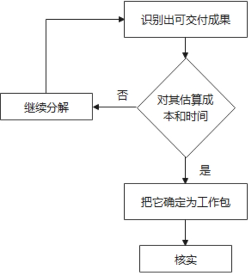 

#### 作用

WBS是项目管理众多工具中最有价值的工具之一，是项目管理的核心，它给予人们解决复杂问题的思考方法——解剖麻雀化繁为简，然后各个击破。通过工作分解结构，项目团队得到完成项目的工作清单，从而为日后制定项目计划时工期估计、成本预算、人员分工、风险分析、采购需求，项目监控等工作奠定了基础。它的作用有：

1. 把复杂的事情简单化，使项目的工作执行起来更容易。
2. 通过WBS得到完成项目的工作清单，从而界定出项目的工作范围。
3. 把项目要做的所有工作都清楚地展现出来，不至于漏掉任何重要的事情。
4. 容易对分解出的每一项工作估计所需时间、便于制定完善的进度、成本预算等项目计划。
5. 通过工作分解，可以确定完成项目所需的技术、所需的人力以及其他资源。
6. 便于将工作落实到责任部门或个人，有利于界定职责和权限，也便于各方面就项目的工作进行沟通。
7. 使项目团队成员更清楚地理解工作的性质和努力的方向。
8. 能够对项目进行有效的跟踪、控制和反馈。

#### 分解原则

1．遵循“横向到边，纵向到底”的原则，将主体Work逐步细化分解，分解到不可再分解为止。
2．分解后的Work要能定义清楚主体Work的范围，也就是100%原则。
3．每个Work都需要具有独立性、可交付性。
4．需要按照一定的组织方式来进行分解，如顺序型组织方式、物理结构组织方式。
5．通常第一层级为项目成果，第二层级为重大单元，第三层级为细节组成。

#### 分解步骤

1. 识别和分析可交付成果。
2. 选择合适的WBS编排方法，通常有树形图、大纲/文本式、表格式。
3. 选择合适的分解方法，有自顶向下、自底向上两种方式。
4. 制定和分配标识编码。
5. 核实分解程度是必要且充分的

### 本项目应用

#### 树形图分解实践

WBS在一些工程项目中运用的比较多，比如说软件工程，建筑工程等。当然，WBS在我们的生活中也随处可见，比如说上面举的做一道水煮鱼的例子，还有比如打扫屋子、准备一个十人的晚餐、组织一场聚会，都可以应用WBS或者我们已经潜移默化地在应用WBS，比如说打扫屋子，我们会分解成整理物品、擦拭家具、拖地等具体的工作来进行。

根据以上的介绍，那么我们可以对本项目选择树形图的编排方式进行WBS分解，结构如下图所示：

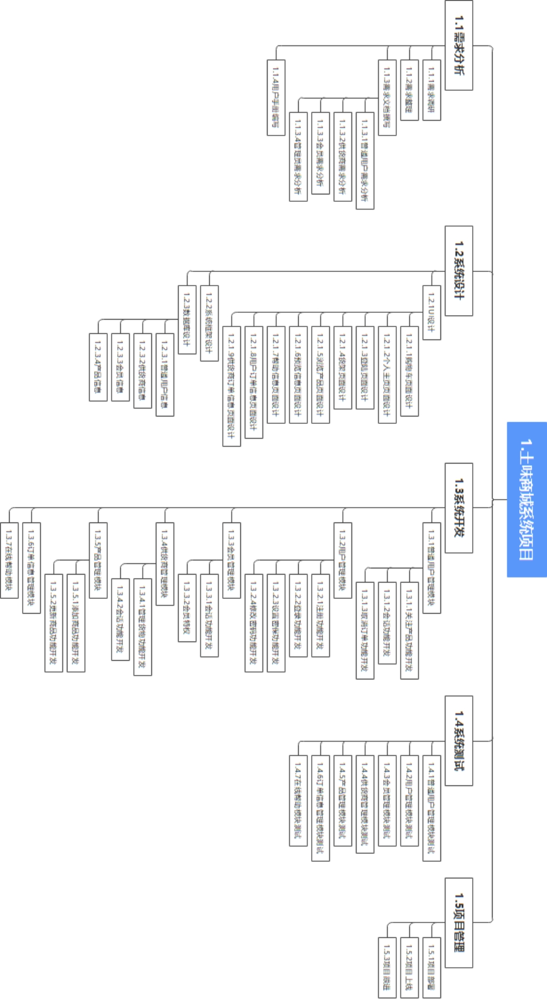

#### 华为云DevOps分解实践

##### a) Scrum项目概念

本项目拟采用敏捷需求结构化管理，在华为云中使用Scrum迭代式增量软件开发过程对工作项进行管理。相关的概念如下所示：

Epic是公司重要战略举措，需要分解为Feature，并通过Feature继续分解细化为userstory完成最后的开发和交付。通过Epic的落地达成，使公司可以获得相应的市场地位和回报，具有战略价值。通常需要数月完成。

Feature是对用户有价值的功能，通常是持续数个星期，需要多个迭代来完成交付；

Story，通常所说的用户故事，是UserStory的简称。Story是从用户角度对产品需求的一个详细描述，承接Feature，并放入产品Backlog（待办事项）中，持续规划，滚动调整，并且每一个story都有优先级，在待办事项中，始终让高优先级Story交付给客户，具有用户价值。Story要符合INVEST原则（Idependent、Negotiable、Valuable、Estimable、Small、Testable），通常需要数天，并在一个Sprint中完成。

Task是完成需求的过程性的工作，是迭代计划中将纳入迭代的story指派给具体成员并进行分解。

由于UserStory具有可验收的特性，因此使用UserStory来跟踪开发进度更加准确。也可使用Task来跟踪开发进度，但Task的完成度有时不是那么容易清晰的定义或可视的，而UserStory的完成度则是可视的。

Epic-Feature-Story-Task是一种将需求进行结构化管理的方法，在使用时是从上到下逐层分解，形成自下而上的依赖。

使用Epic、Feature、Story、Task管理需求时，需要注意以下几个方面。

1. 敏捷开发中需求是逐步细化的，遵循自上而下的方式去分解需求。
2. Epic和Feature都是颗粒度比较大的需求，是用户对于产品的期望和功能特性的描述。
3. 分解为Story的时候，目前正在进行的Sprint需要分的更小更细，将来的Sprint需求（可能是3个及以上）就不需要那样细分。当进行到某个Sprint时，再进行分解，细分成一组更小、更细的条目。
4. Task是对当前Sprint的Story进行的分解。
5. 所有这些粗略和详细的Story都放在产品Backlog中，整个列表要遵循DEEP（Detailed appropriately、Emergent、Estimated、Prioritized）原则，定期梳理和排序优化，保证高优先级的需求优先实现和交付。
6. 在整个过程中需要和客户一直保持沟通合作，这样才能保证我们实现的功能是客户真正想要的。

##### b) WBS分解思维导图

本项目在华为云DevOps平台进行工作结构分解，由于版面有限无法一次全部展示完，采用分段形式展示。首先是将WBS分解到Feature阶段。随后按照不同的Feature分开进行展示。总体分解情况下图所示：
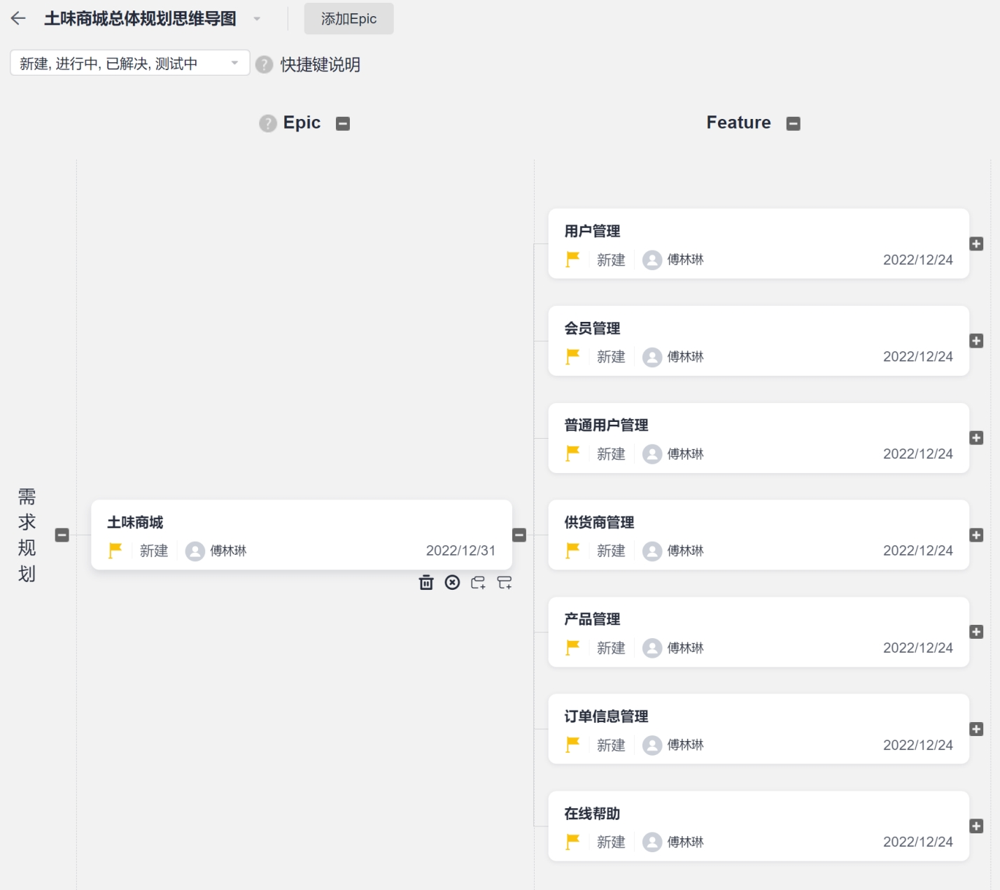

Feature往后的分解情况如下所示：

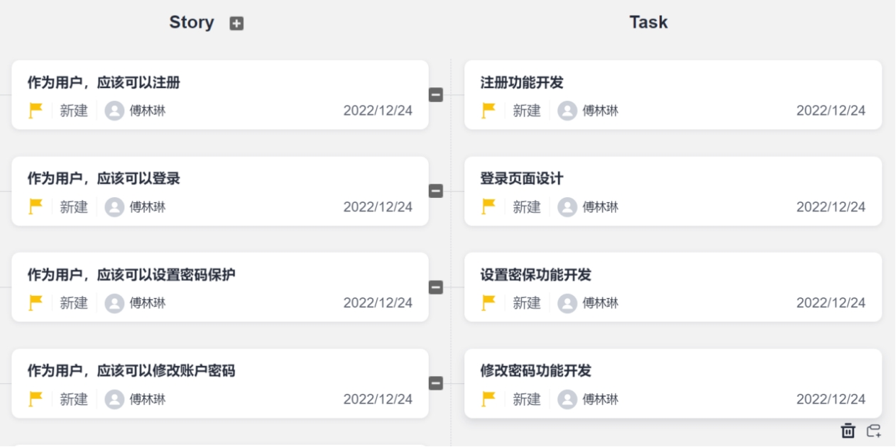 

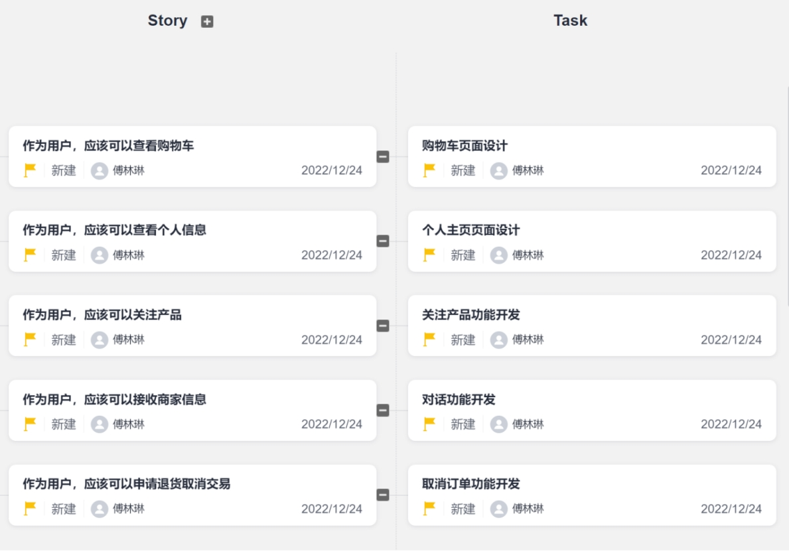 

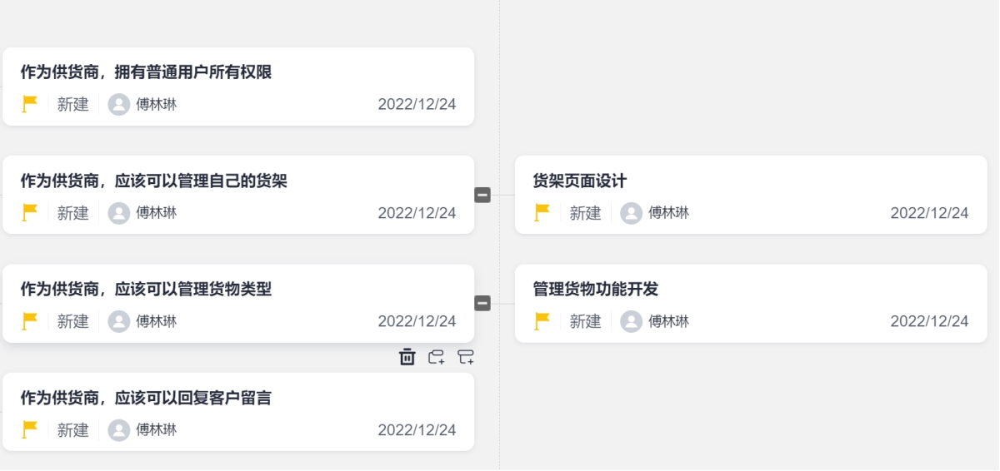

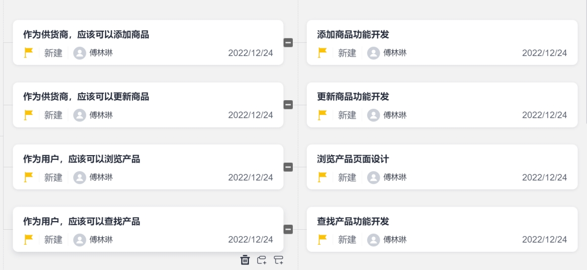 

 

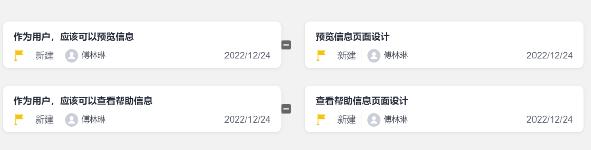 

## 活动历时
### 活动清单

#### 需求活动定义

| **1.1需求分析活动定义** |
|-----------------|
| 1.1.1需求调研       |
| 1.1.2需求整理       |
| 1.1.3需求文档撰写     |
| 1.1.3.1普通用户需求分析 |
| 1.1.3.2供货商需求分析  |
| 1.1.3.3会员需求分析   |
| 1.1.3.4管理员需求分析  |
| 1.1.4用户手册编写     |

#### 设计活动定义

| ***\*1.\*******\*2系统设计\*******\*活动定义\**** |
| ------------------------------------------------- |
| 1.2.1UI设计                                       |
| 1.2.1.1购物车页面设计                             |
| 1.2.1.2个人主页页面设计                           |
| 1.2.1.3登陆页面设计                               |
| 1.2.1.4货架页面设计                               |
| 1.2.1.5浏览产品页面设计                           |
| 1.2.1.6预览信息页面设计                           |
| 1.2.1.7帮助信息页面设计                           |
| 1.2.1.8用户订单信息页面设计                       |
| 1.2.1.9供货商订单信息页面设计                     |
| 1.2.2系统框架设计                                 |
| 1.2.3数据库设计                                   |
| 1.2.3.1普通用户信息                               |
| 1.2.3.2供货商信息                                 |
| 1.2.3.3会员信息                                   |
| 1.2.3.4产品信息                                   |

#### 开发活动定义

| ***\*1.3系统开发活动定义\**** |
| ----------------------------- |
| 1.3.1普通用户管理模块         |
| 1.3.1.1关注产品功能开发       |
| 1.3.1.2会话功能开发           |
| 1.3.1.3取消订单功能开发       |
| 1.3.2用户管理模块             |
| 1.3.2.1注册功能开发           |
| 1.3.2.2登录功能开发           |
| 1.3.2.3设置密保功能开发       |
| 1.3.2.4修改密码功能开发       |
| 1.3.3会员管理模块             |
| 1.3.3.1会话功能开发           |
| 1.3.3.2会员特权               |
| 1.3.4供货商管理模块           |
| 1.3.4.1管理货物功能开发       |
| 1.3.4.2会话功能开发           |
| 1.3.5产品管理模块             |
| 1.3.5.1添加商品功能开发       |
| 1.3.5.2更新商品功能开发       |
| 1.3.6订单信息管理模块         |
| 1.3.7在线帮助模块             |

 

#### 测试活动定义

 

| ***\*1.4系统测试活动定义\**** |
| ----------------------------- |
| 1.4.1普通用户管理模块测试     |
| 1.4.2用户管理模块测试         |
| 1.4.3会员管理模块测试         |
| 1.4.4供货商管理模块测试       |
| 1.4.5产品管理模块测试         |
| 1.4.6订单信息管理模块测试     |
| 1.4.7在线帮助模块测试         |

#### 管理活动定义

| ***\*1.5项目管理活动定义\**** |
| ----------------------------- |
| 1.5.1项目部署                 |
| 1.5.2项目上线                 |
| 1.5.3项目跟进                 |

### 里程碑

表 4 项目里程碑计划表

| 项目阶段   | 时间                 | 工作内容                                                   | 成果                                       |
| ---------- | -------------------- | ---------------------------------------------------------- | ------------------------------------------ |
| 需求调研   | 2022年8月底          | 成立项目咨询专家组，对项目需求进行详细的调研               | 系统需求规格说明书                         |
| 系统设计   | 2022年9月初          | 在需求调研的基础上对系统架构、安全体系、功能等进行系统设计 | 系统设计说明书                             |
| 系统开发   | 2022年9月初到10月中  | 进行各个子系统的迭代开发，完成单元测试                     | 不同迭代版本的可运行系统                   |
| 系统集成   | 2022年10月初到10月底 | 系统集成和对各模块集成测试                                 | 测试报告形成可完整运行的系统               |
| 系统初验   | 2022年10月底到11月初 | 项目初验                                                   | 初验报告                                   |
| 系统试运行 | 2022年11月初到11月中 | 1、平台上线试运行2、系统持续优化                           | 升级版本的可运行系统，并安装部署到用户本地 |
| 用户培训   | 2022年11月初         | 对各级用户进行培训                                         | 使用说明                                   |
| 项目终验   | 2022年11月中到11月底 | 项目终验                                                   | 验收报告                                   |
| 运营服务   | 2022年11月底到12月中 | 启动项目运营服务                                           | 运营服务内容                               |

### 活动顺序

#### 概述

本项目活动顺序分为五个阶段，分别是需求分析阶段、设计阶段、开发阶段、测试阶段、管理阶段。以下是每个阶段的详细活动关系。

#### 需求分析阶段

***\*需求分析阶段活动关系如下表所示：\****

表 5 需求分析活动关系表

| 活动名称 | 紧前活动 | 紧后活动 |
| -------- | -------- | -------- |
| 1.1.1    | ---      | 1.1.2    |
| 1.1.2    | 1.1.1    | 1.1.3    |
| 1.1.3    | 1.1.2    | 1.1.4    |
| 1.1.4    | 1.1.3    | ---      |
|          |          |          |

需求分析阶段活动前导图网络如下图所示：

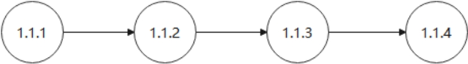 

#### 系统设计阶段

系统设计阶段活动关系如下表所示：

表 6 系统设计活动关系表

| 活动名称 | 紧前活动 | 紧后活动 |
| -------- | -------- | -------- |
| 1.2.2    | ---      | 1.2.1    |
| 1.2.1    | 1.2.2    | 1.2.3    |
| 1.2.3    | 1.2.1    | ---      |

系统设计阶段活动前导图网络如下图所示：

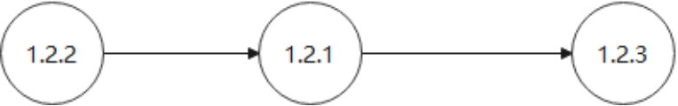 

#### 开发阶段

系统开发阶段活动关系如下表所示：

表 7 系统开发活动关系表

| 活动名称 | 紧前活动            | 紧后活动            |
| -------- | ------------------- | ------------------- |
| 1.3.2    | ---                 | 1.3.5               |
| 1.3.5    | 1.3.2               | 1.3.6               |
| 1.3.6    | 1.3.5               | 1.3.1、1.3.2、1.3.3 |
| 1.3.1    | 1.3.6               | 1.3.7               |
| 1.3.2    | 1.3.6               | 1.3.7               |
| 1.3.3    | 1.3.6               | 1.3.7               |
| 1.3.7    | 1.3.1、1.3.2、1.3.3 | ---                 |

系统开发阶段活动前导图网络如下图所示：

 

#### 系统测试阶段

系统设计阶段活动关系如下表所示：

表 8 系统开发活动关系表

| 活动名称 | 紧前活动            | 紧后活动            |
| -------- | ------------------- | ------------------- |
| 1.3.2    | ---                 | 1.3.5               |
| 1.3.5    | 1.3.2               | 1.3.6               |
| 1.3.6    | 1.3.5               | 1.3.1、1.3.2、1.3.3 |
| 1.3.1    | 1.3.6               | 1.3.7               |
| 1.3.2    | 1.3.6               | 1.3.7               |
| 1.3.3    | 1.3.6               | 1.3.7               |
| 1.3.7    | 1.3.1、1.3.2、1.3.3 | ---                 |

系统设计阶段活动前导图网络如下图所示：

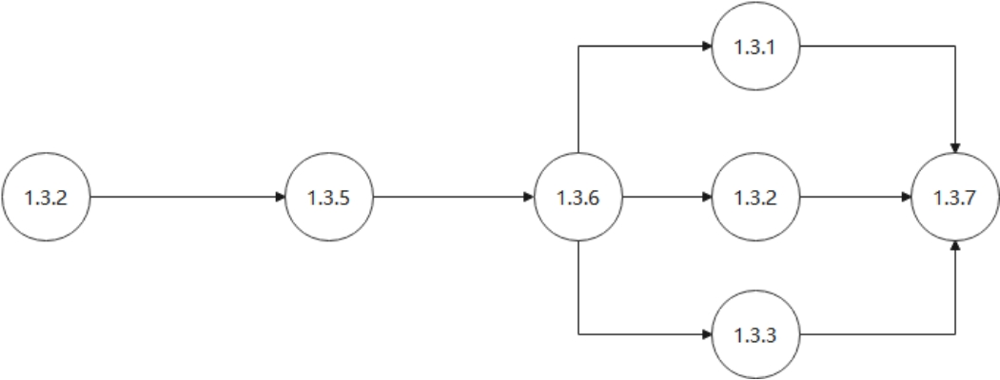 

#### 管理阶段

项目管理阶段活动关系如下表所示：

表 9 项目管理活动关系表

| 活动名称 | 紧前活动 | 紧后活动 |
| -------- | -------- | -------- |
| 1.5.1    | ---      | 1.5.2    |
| 1.5.2    | 1.5.1    | 1.5.3    |
| 1.5.3    | 1.5.2    | ---      |

项目管理阶段活动前导图网络如下图所示：

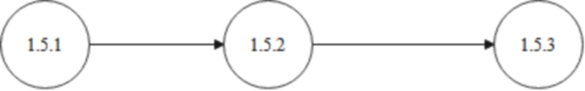 

### 活动历时

#### 概述

本项目的活动持续时间的估算方法采用类比估算的方法。

类比估算是一种使用相似活动或项目的历史数据，来估算当前活动或项目的持续时间或成本的技术。类比估算以过去类似项目的参数值（如持续时间、预算、规模、重量和复杂性等）为基础，来估算未来项目的同类参数或指标。在估算持续时间时，类比估算技术以过去类似项目的实际持续时间为依据，来估算当前项目的持续时间。这是一种粗略的估算方法，有时需要根据项目复杂性方面的已知差异进行调整，在项目详细信息不足时，就经常使用类比估算来估算项目持续时间。相对于其他估算技术，类比估算通常成本较低、耗时较少，但准确性也较低。类比估算可以针对整个项目或项目中的某个部分进行，或可以与其他估算方法联合使用。如果以往活动是本质上而不是表面上类似，并且从事估算的项目团队成员具备必要的专业知识，那么类比估算就最为可靠。

本管理系统的阶段性任务如表所示，计划分为需求分析、系统设计、系统开发、系统测试、项目管理共计5个阶段性任务。按照工作日（周一到周五）时间10:00-19:00进行工时计算。

表 10 阶段任务活动历时表

| 阶段任务 | 开始时间   | 持续时间 | 预计结束时间 |
| -------- | ---------- | -------- | ------------ |
| 需求分析 | 2022.8.10  | 15       | 2022.8.30    |
| 系统设计 | 2022.9.01  | 15       | 2022.9.21    |
| 系统开发 | 2022.9.9   | 22       | 2022.10.10   |
| 系统测试 | 2022.9.30  | 20       | 2022.10.27   |
| 项目管理 | 2022.10.20 | 18       | 2022.11.14   |

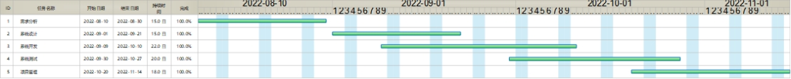 

#### 需求阶段

我们将需求分析阶段分为需求调研、需求整理、需求文档撰写、用户手册编写四个任务，其进度安排如下表所示：

表 11 需求分析阶段中各子任务进度安排

| 阶段任务     | 开始时间  | 持续时间 | 预计结束时间 |
| ------------ | --------- | -------- | ------------ |
| 需求调研     | 2022.8.10 | 5        | 2022.8.16    |
| 需求整理     | 2022.8.17 | 3        | 2022.8.19    |
| 需求文档撰写 | 2022.8.22 | 4        | 2022.8.25    |
| 用户手册编写 | 2022.8.26 | 3        | 2022.8.30    |

其甘特图如下图所示：

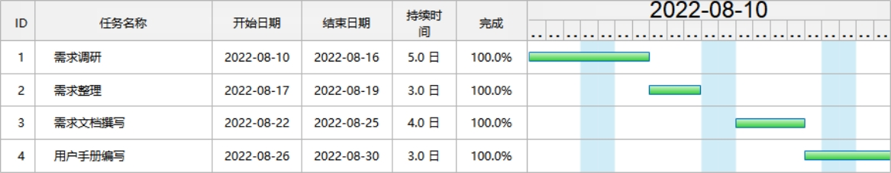 

#### 设计阶段

我们将系统设计阶段分为系统框架设计、UI设计、数据库设计三个任务，其进度安排如下表所示：

表 12 系统设计阶段中各子任务进度安排

| 阶段任务     | 开始时间  | 持续时间 | 预计结束时间 |
| ------------ | --------- | -------- | ------------ |
| 系统框架设计 | 2022.9.1  | 4        | 2022.9.6     |
| UI设计       | 2022.9.7  | 4        | 2022.9.12    |
| 数据库设计   | 2022.9.13 | 7        | 2022.9.21    |

其甘特图如下图所示：

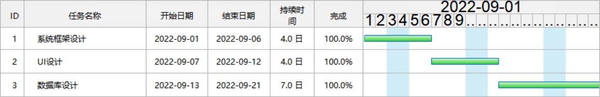 

#### 开发阶段

我们将系统开发阶段分为用户管理模块、产品管理模块、订单信息管理模块、普通用户管理模块、用户管理模块、会员管理模块、在线帮助模块七个任务，其进度安排如下表所示：

表 13 系统开发阶段中各子任务进度安排

| 阶段任务         | 开始时间  | 持续时间 | 预计结束时间 |
| ---------------- | --------- | -------- | ------------ |
| 用户管理模块     | 2022.9.9  | 3        | 2022.9.13    |
| 产品管理模块     | 2022.9.14 | 5        | 2022.9.20    |
| 订单信息管理模块 | 2022.9.21 | 4        | 2022.9.26    |
| 普通用户管理模块 | 2022.9.27 | 7        | 2022.10.5    |
| 供货商管理模块   | 2022.9.27 | 7        | 2022.10.5    |
| 会员管理模块     | 2022.9.27 | 7        | 2022.10.5    |
| 在线帮助模块     | 2022.10.6 | 3        | 2022.10.10   |

其甘特图如下图所示：

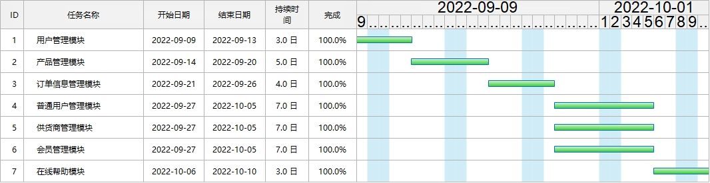 

### 2.4.5 测试阶段

我们将系统测试阶段分为用户管理模块测试、产品管理模块测试、订单信息管理模块测试、普通用户管理模块测试、用户管理模块测试、会员管理模块测试、在线帮助模块测试七个任务，其进度安排如下表所示：

表 14 系统测试阶段中各子任务进度安排

| 阶段任务             | 开始时间  | 持续时间 | 预计结束时间 |
| -------------------- | --------- | -------- | ------------ |
| 用户管理模块测试     | 2022.9.30 | 3        | 2022.9.13    |
| 产品管理模块测试     | 2022.9.14 | 5        | 2022.9.20    |
| 订单信息管理模块测试 | 2022.9.21 | 4        | 2022.9.26    |
| 普通用户管理模块测试 | 2022.9.27 | 7        | 2022.10.5    |
| 供货商管理模块测试   | 2022.9.27 | 7        | 2022.10.5    |
| 会员管理模块测试     | 2022.9.27 | 7        | 2022.10.5    |
| 在线帮助模块测试     | 2022.10.6 | 3        | 2022.10.27   |

其甘特图如下图所示：

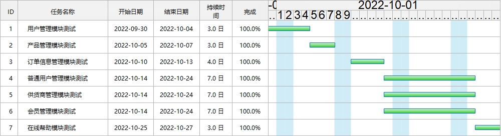 

#### 管理阶段

我们将项目管理阶段分为项目部署、项目上线、项目跟进三个任务，其进度安排如下表所示：

表 15 项目管理阶段中各子任务进度安排

| 阶段任务 | 开始时间   | 持续时间 | 预计结束时间 |
| -------- | ---------- | -------- | ------------ |
| 项目部署 | 2022.10.20 | 4        | 2022.10.25   |
| 项目上线 | 2022.10.26 | 4        | 2022.11.3    |
| 项目跟进 | 2022.11.4  | 7        | 2022.11.14   |

其甘特图如下图所示：

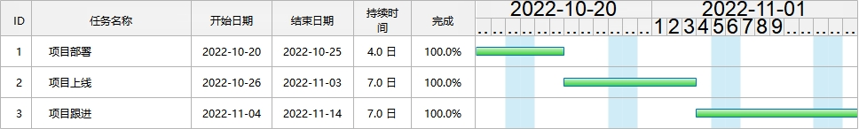 

## 资源估算

### 概念

估算活动资源是估算执行项目所需的团队资源，以及材料、设备和用品的类型和数量的过程。本过程的主要作用是，明确完成项目所需的资源种类、数量和特性。本过程应根据需要在整个项目期间定期开展。估算活动资源过程与其他过程紧密相关，例如估算成本过程。例如：建筑项目团队需要熟悉当地建筑法规。这类知识常可从当地卖方获取，但是，如果内部劳动力资源对不常用或专门的建筑技术缺乏经验，那么支付额外费用聘请咨询专家，可能就是了解当地建筑法规的最有效的方法。汽车设计团队需要熟悉最新的自动装配技术。这些必要的知识可以通过聘请顾问、派设计人员参加机器人技术研讨会，或者邀请制造人员加入项目团队等方式来获取。

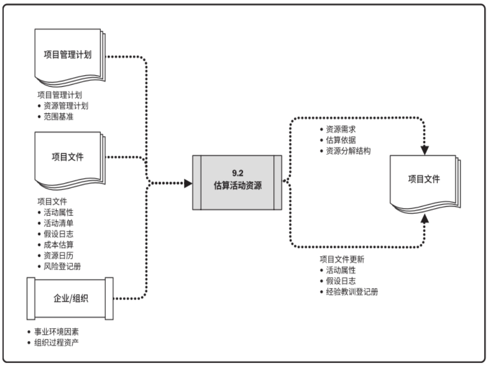 

### 硬件资源分配

表 16 Hardware Resources 硬件资源表

| **硬件名称** | **单位** | **数量** | **责任人** | **跟踪人** | **到位时间** |
| ------------ | -------- | -------- | ---------- | ---------- | ------------ |
| 笔记本电脑   | 个       | 1        | 武沛鑫     | 武沛鑫     | 2022.8.16    |
| 笔记本电脑   | 个       | 1        | 傅林琳     | 傅林琳     | 2022.8.16    |
| 笔记本电脑   | 个       | 1        | 侯天潇     | 侯天潇     | 2022.8.16    |
| 笔记本电脑   | 个       | 1        | 唐朝       | 唐朝       | 2022.8.16    |
| 笔记本电脑   | 个       | 1        | 韦春       | 韦春       | 2022.8.16    |
| 笔记本电脑   | 个       | 1        | 陈秋雨     | 陈秋雨     | 2022.8.16    |

### 人力资源分配

表 17 Hardware Resources 硬件资源表

| **角色**     | **名单**             | **主要活动**                 | **责任人** | **跟踪人** | **到位时间**  |      |
| ------------ | -------------------- | ---------------------------- | ---------- | ---------- | ------------- | ---- |
| 产品经理     | 武沛鑫               | 负责整个过程资源与流程的管控 | 武沛鑫     | 武沛鑫     | 2022年8月16日 |      |
| 开发人员     | 唐朝，傅林琳，侯天潇 | 负责整个项目的开发工作       | 傅林琳     | 唐朝       | 2022年8月16日 |      |
| 配置管理人员 | 陈秋雨               | 负责系统的配置管理           | 陈秋雨     | 陈秋雨     | 2022年8月16日 |      |
| 质量保证人员 | 韦春                 | 负责系统的质量管理           | 韦春       | 韦春       | 2022年8月16日 |      |

### 资源分解结构

资源分解结构是资源依类别和类型的层级展现。资源类别包括（但不限于）人力、材料、设备和用品，资源类型则包括技能水平、要求证书、等级水平或适用于项目的其他类型。在规划资源管理过程中，资源分解结构用于指导项目的分类活动。在这一过程中，资源分解结构是一份完整的文件，用于获取和监督资源。本项目的资源分解结构图如下所示。

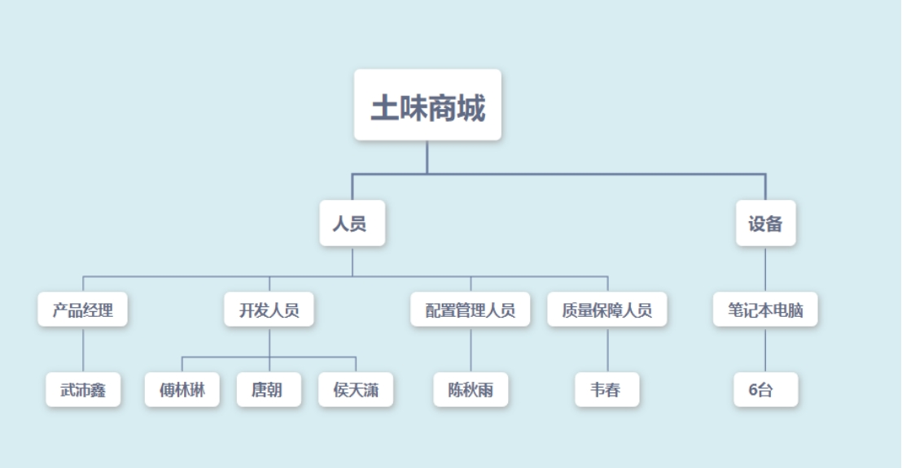 

## 成本管理

### 成本管理计划

规划成本管理是确定如何估算、预算、管理、监督和控制项目成本的过程。本过程的主要作用是，在整个项目期间为如何管理项目成本提供指南和方向。本过程仅开展一次或仅在项目的预定义点开展。

在本节中，项目团队通过举行规划会议的方式指定成本管理计划，参会人员包含了小组的全部组员。

成本管理计划是项目管理计划的组成部分，描述将如何规划、安排和控制项目成本。

在成本管理计划中需要规定每种资源的计量单位。在土味商城项目中，规定的计量单位如下：测量时间的单位为人天数，货币单位是人民币。

根据活动范围和项目规模，需要设定成本估算向上或向下取整的程度。在土味商城项目中，规定的精确度如下：进行成本估算时，若在5%的范围内，可以进行向上向下取整。

成本管理计划需要为活动成本估算规定一个可以接受的区间。在土味商城项目中，规定的准确度如下：活动成本估算的区间在±10%之内。

成本管理计划需要规定偏差临界值，用于监督成本绩效。土味商城项目的临界值为±15%。

本项目中使用的EVM技术为加权里程碑法。在加权里程碑法中，每个历时较长的工作包都会被划分成若干个可测量的里程碑事件，这样一来，标志着这一段工作被分成了有限的几份。然后再对每个里程碑赋予具体的权重，代表当该里程碑内的任务全部完成时，项目可以增加价值。

### 估算成本

估算成本是对完成项目工作所需资源成本进行近似估算的过程。本过程的主要作用是，确定项目所需的资金。本过程应根据需要在整个项目期间定期开展。

#### 成本估算表

在土味商城项目中，采用类比估算法来进行成本估算。根据项目团队的实际情况，对目前的资源进行估算：

人力资源：

* 3个开发人员
* 1个项目管理人员（项目经理）
* 1个质量保证人员
* 1个配置管理人员

设备资源：

* 6台电脑
* 1台服务器

根据项目任务分解结果WBS估算出项目工作量（单位：人天）：

表 18 项目工作量一览表

| WBS编号 | 任务名称             | 估计值 | 总计 |
| ------- | -------------------- | ------ | ---- |
| 1.1     | 需求分析             |        | 15   |
| 1.1.1   | 需求调研             | 5      |      |
| 1.1.2   | 需求整理             | 3      |      |
| 1.1.3   | 需求文档撰写         | 4      |      |
| 1.1.4   | 用户手册编写         | 3      |      |
| 1.2     | 系统设计             |        | 15   |
| 1.2.1   | UI设计               | 4      |      |
| 1.2.2   | 系统框架设计         | 4      |      |
| 1.2.3   | 数据库设计           | 7      |      |
| 1.3     | 系统开发             |        | 36   |
| 1.3.1   | 普通用户管理模块     | 7      |      |
| 1.3.2   | 用户管理模块         | 3      |      |
| 1.3.3   | 会员管理模块         | 7      |      |
| 1.3.4   | 供货商管理模块       | 7      |      |
| 1.3.5   | 产品管理模块         | 5      |      |
| 1.3.6   | 订单信息管理模块     | 4      |      |
| 1.3.7   | 在线帮助模块         | 3      |      |
| 1.4     | 系统测试             |        | 36   |
| 1.4.1   | 普通用户管理模块测试 | 7      |      |
| 1.4.2   | 用户管理模块测试     | 3      |      |
| 1.4.3   | 会员管理模块测试     | 7      |      |
| 1.4.4   | 供货商管理模块测试   | 7      |      |
| 1.4.5   | 产品管理模块测试     | 5      |      |
| 1.4.6   | 订单信息管理模块测试 | 4      |      |
| 1.4.7   | 在线帮助模块测试     | 3      |      |
| 1.5     | 项目管理             |        | 15   |
| 1.5.1   | 项目部署             | 4      |      |
| 1.5.2   | 项目上线             | 4      |      |
| 1.5.3   | 项目跟进             | 7      |      |

由此可得，总的项目工作量在117人天左右。本项目假设开发人员的成本参数是500元/人天，因此开发成本为117×500 = 58500元左右。

管理任务和质量任务成本可以通过计算开发任务成本得到，根据以往经验，管理任务和质量任务成本=开发任务成本×20%=58500×20%=11700元。

简介成本包含了员工培训，租借服务器等活动的开销，按照以往经验，采用公式：间接成本=直接成本×25%=58500×25%=14625元。

由上述可得，项目总估算成本=58500+11700+14625=84825元。

#### 项目预算表

制定预算是汇总所有单个活动或工作包的估算成本，建立一个经批准的成本基准的过程。本过程的主要作用是，确定可据以监督和控制项目绩效的成本基准。本过程仅开展一次或仅在项目的预定义点开展。

项目成本预算使用专家判断法，如下表所示。

表 19 项目成本预算一览表

| WBS编号 | 任务名称             | 开始时间   | 结束时间   | 预算成本(元) |
| ------- | -------------------- | ---------- | ---------- | ------------ |
| 1.1     | 需求分析             | 2022.8.10  | 2022.8.30  | 2340         |
| 1.1.1   | 需求调研             | 2022.8.10  | 2022.8.16  | 468          |
| 1.1.2   | 需求整理             | 2022.8.17  | 2022.8.19  | 234          |
| 1.1.3   | 需求文档撰写         | 2022.8.22  | 2022.8.25  | 702          |
| 1.1.4   | 用户手册编写         | 2022.8.26  | 2022.8.30  | 936          |
| 1.2     | 系统设计             | 2022.9.01  | 2022.9.21  | 3510         |
| 1.2.1   | UI设计               | 2022.9.7   | 2022.9.12  | 1228         |
| 1.2.2   | 系统框架设计         | 2022.9.1   | 2022.9.6   | 1228         |
| 1.2.3   | 数据库设计           | 2022.9.13  | 2022.9.21  | 1053         |
| 1.3     | 系统开发             | 2022.9.9   | 2022.10.10 | 35100        |
| 1.3.1   | 普通用户管理模块     | 2022.9.9   | 2022.9.13  | 8775         |
| 1.3.2   | 用户管理模块         | 2022.9.14  | 2022.9.20  | 7020         |
| 1.3.3   | 会员管理模块         | 2022.9.21  | 2022.9.26  | 5265         |
| 1.3.4   | 供货商管理模块       | 2022.9.27  | 2022.10.5  | 2106         |
| 1.3.5   | 产品管理模块         | 2022.9.27  | 2022.10.5  | 4095         |
| 1.3.6   | 订单信息管理模块     | 2022.9.27  | 2022.10.5  | 5967         |
| 1.3.7   | 在线帮助模块         | 2022.10.6  | 2022.10.10 | 1404         |
| 1.4     | 系统测试             | 2022.9.30  | 2022.10.27 | 9360         |
| 1.4.1   | 普通用户管理模块测试 | 2022.9.30  | 2022.9.13  | 2340         |
| 1.4.2   | 用户管理模块测试     | 2022.9.14  | 2022.9.20  | 1872         |
| 1.4.3   | 会员管理模块测试     | 2022.9.21  | 2022.9.26  | 1404         |
| 1.4.4   | 供货商管理模块测试   | 2022.9.27  | 2022.10.5  | 561          |
| 1.4.5   | 产品管理模块测试     | 2022.9.27  | 2022.10.5  | 1216         |
| 1.4.6   | 订单信息管理模块测试 | 2022.9.27  | 2022.10.5  | 1591         |
| 1.4.7   | 在线帮助模块测试     | 2022.10.6  | 2022.10.27 | 374          |
| 1.5     | 项目管理             | 2022.10.20 | 2022.11.14 | 8190         |
| 1.5.1   | 项目部署             | 2022.10.20 | 2022.10.25 | 2457         |
| 1.5.2   | 项目上线             | 2022.10.26 | 2022.11.3  | 2702         |
| 1.5.3   | 项目跟进             | 2022.11.4  | 2022.11.14 | 3030         |

### 开发及管理模式

商城项目以敏捷开发（Agile Development）作为开发方法，敏捷开发能够以用户的需求进化为核心，采用迭代、循序渐进的方法进行软件开发。在敏捷开发中，商城项目在开发构建初期被切分成前端UI开发、用户管理模块开发、会员管理模块开发、供货商管理模块开发、产品管理模块开发、订单信息管理模块开发和在线帮助模块开发等多个子项目，各个子项目的成果都会经过测试，具备可视、可集成和可运行使用的特征。多个项目之间相互联系，也可独立运行，并分别完成，在此过程中软件一直处于可使用状态。

敏捷建模（Agile Modeling）定义了一系列的核心原则和辅助原则，它们为软件开发项目中的建模实践奠定了基石。其中一些原则是从XP（极限编程，）中借鉴而来，在Extreme Programming Explained中有它们的详细描述。

#### 核心原则

##### a) 主张简单

商城项目开发过程中，团队采用最简单的解决方案，删繁就简。不过分地重构软件，前期的需求分析敲定之后，开发过程中，随时响应需求方变化，但尽量不向模型中添加冗余的功能。

##### b) 拥抱变化

团队中应有客户代表，作为产品负责人，负责开发过程中的需求更新。需求时刻在变，开发过程中产品负责人作为客户代表，会不定时不间断地有新的需求提出。项目进行中，Project stakeholder可能变化，会有新人加入，也会有旧人离开。Project stakeholder的观点也可能变化，团队努力的目标和成功标准也有可能发生变化。这就意味着随着项目的进行，项目环境也在不停的变化，因此团队的开发方法必须要能够反映这种现实。

##### c) 可持续性

可持续性可能指的是系统的下一个主要发布版，或是团队正在构建的系统的运转和支持。要做到这一点，团队不仅仅要构建高质量的软件，还要创建足够的文档和支持材料，保证下一次的需求增删改查能够顺利的进行。

##### d) 递增的变化

和建模相关的一个重要概念是团队开发不用在一开始就准备好一切。而且，不用在模型中包容所有的细节，只要足够的细节就够了。团队在开发伊始只需要构建一个概要的模型，之后慢慢的改进，必要的时候如果不需要可以丢弃。

##### e) 投资最大化

团队开发应尽量节省开发资源，如：时间、资金、设备等等，以最大化开发前及开发中的投资。

##### f) 有目的的建模

团队在开发过程中不做毫无意义的建模。搞清楚为什么建模，为谁建模。首先，团队要确定建模的目的以及模型的受众，在此基础上，再保证模型足够正确和足够详细。一旦一个模型实现了目标，对应的开发人员就可以结束工作，把精力转移到其它的工作上去，例如编写代码以检验模型的运作。该项原则也可适用于改变现有模型：如果要做一些改变，应该有做出变化的正确理由（可能是为了支持一项新的需求，或是为了重构以保证简洁）。

##### g) 多种模型

因为每种模型只能描述软件的单个方面，所以开发软件需要使用多种模型。

##### h) 高质量的工作

低质量且粗糙应付的工作，会给开发后期以及之后的运维工作带来巨大的灾难，也会给用户带来不好的使用体验，同时又会使用户的期望落空。

##### i) 快速反馈

从开始采取行动，到获得行动的反馈，二者之间的时间至关紧要。和团队其他人一起开发模型，其中一个开发人员的想法可以立刻获得反馈。开发人员和客户代表紧密工作，在开发过程中不断满足需求更新，开发满足需求的界面和功能。

##### j) 软件才是主要目标

软件开发的主要目标是以有效的方式，制造出满足需求的软件，而不是制造无关文档，无关管理的工件，甚至无关的模型。任何一项活动（activity ），如果不符合这项原则，不能有助于目标实现的，都应该受到审核，甚至取消。

##### k) 轻装前进

团队开发少花费时间在更新文档上，而是着眼于开发满足需求的功能、编写源代码、界面设计上。开发的过程中频繁且及时地权衡当前模型的保留必要性，不需要时，及时舍弃，以简化需求改变时开发的难度。

#### 开发管理工具

***\*华为云devcloud\****

* devcloud具有敏捷化项目管理的功能，能够及时准确地掌握项目质量与进度；

* 基于Git的高可用代码托管，实现跨地域协同开发；

* 可视化交付流水线，多语言并行构建；

* 一站式代码检查，及时发现代码质量问题；

* 以用例为核心，提供端到端测试管理能力

* 开箱即用特性，无需企业投入人力进行维护升级；

* 提供包括项目管理、配置管理、代码检查、编译构建、测试、部署、发布、流水线等8大功能模块，端到端地覆盖软件生命周期的相关环节；

* 华为软件开发云提供轻量级的DevOps工具服务，支撑企业DevOps落地，实现项目的持续交付；

* 提供端到端的服务，支撑软件的全生命周期管理；

* 基于华为的研发实践，提供规范模板、代码检查规则等最佳实践，企业无需从零开始；

* 实现了云上开发、全生命周期管理和DevOps的统一，具备敏捷、安全、社交、智能的四大核心竞争力，帮助开发者实现高效研发、快速响应、高效协同。

#### 建模误区

无论团队遵从的是重量级的方法，比如Enterprise Unified Process(EUP），还是轻量级的开发过程，如Extreme Programming(XP），建模在软件开发中都是不可或缺的。商城项目的开发中，极力避免了以下误区。

* 误区一：建模=写文档
* 误区二：从开始阶段就考虑一切
* 误区三：把建模当作一个重量级的软件开发过程
* 误区四：过早的冻结商城项目开发需求
* 误区五，冻结设计
* 误区六：过度依赖CASE工具，认为必须不可
* 误区七：认为建模是在浪费时间
* 误区八：过度依赖数据模型，认为数据模型就是一切
* 误区九：不对开发人员进行适当的建模培训

### 运行情况及分析

#### 平台概述

试运行期间，平台运行的模块：PC Web前端，访问方式：注册用户登录。

#### 试运行概述

开始时间：2022年12月1日

结束时间：2022年12月9日

试运行期间用户规模：6-1000人

##### a) 试运行硬件平台概述

* Ubuntu服务器	
* CPU：8核
* 内存：16GB
* 带宽：100Mbps
* 硬盘：100GB

##### b) 测试环境

* 操作系统：Windows 10
* Java版本号：1.8
* Nginx版本号：1.12.2-2.el7
* node版本号：16
* 浏览器：Chrome、火狐等主流浏览器

#### 系统概要说明

##### a) 软件主要模块

系统主要模块包括：普通用户管理、用户管理、会员管理、供货商管理、产品管理、订单信息管理、在线帮助等模块。

##### b) 软件权限

系统权限灵活分配，把整套系统的启用分配为：普通用户、用户、会员、供货商、系统管理员。

#### 用户规模

预计此系统目前的用户规模可达到6-1000人左右（项目开发完成初期，以团队成员作为普通用户测试，试运行无重大错误发生后，拉动身边人试注册，用户规模会逐步扩大）

#### 软件试运行分析

通过对目前的软件试运行结果来看，UI显示正常，商城系统需求开发均已满足，功能正常使用。

#### 试运行问题记录

l 系统崩溃（Blocker）指的是阻碍开发或测试工作的问题；造成系统崩溃、死机、死循环，导致数据库数据丢失，与数据库连接错误，主要功能丧失，基本模块缺失等问题。如：死循环、数据库发生死锁、重要的一级菜单功能不能使用等

数量：0

l 严重(Critical)，指的是系统主要功能部分丧失、数据库保存调用错误、用户数据丢失，一级功能菜单不能使用但是不影响其他功能的测试。功能设计与需求严重不符，模块无法启动或调用，程序重启、自动退出，关联程序间调用冲突，安全问题、稳定性等。如：软件中数据保存后数据库中显示错误，用户所要求的功能缺失，程序接口错误，数值计算统计错误等

数量：0

l 一般（Major），指的是功能没有完全实现但是不影响使用，功能菜单存在缺陷但不会影响系统稳定性。如：操作时间长、查询时间长、格式错误、边界条件错误，删除没有确认框、数据库表中字段过多等

数量：0

l 次要（Minor），指的是界面、性能缺陷，建议类问题，不影响操作功能的执行，可以优化性能的方案等。如：错别字、界面格式不规范，页面显示重叠、不该显示的要隐藏，描述不清楚，提示语丢失，文字排列不整齐，光标位置不正确，用户体验感受不好，可以优化性能的方案等

数量：0

#### 系统安全问题

系统基于B/S架构进行部署，所有数据保存在服务器上，同时有维护人员进行维护，基本上不存在人事信息外泄的可能性。

#### 系统正式运行所需准备工作

系统正式运行前，系统需做好如下准备工作：

* 数据库备份
* 日志备份
* 试运行期间bug修复
* 代码仓库打版本标签
