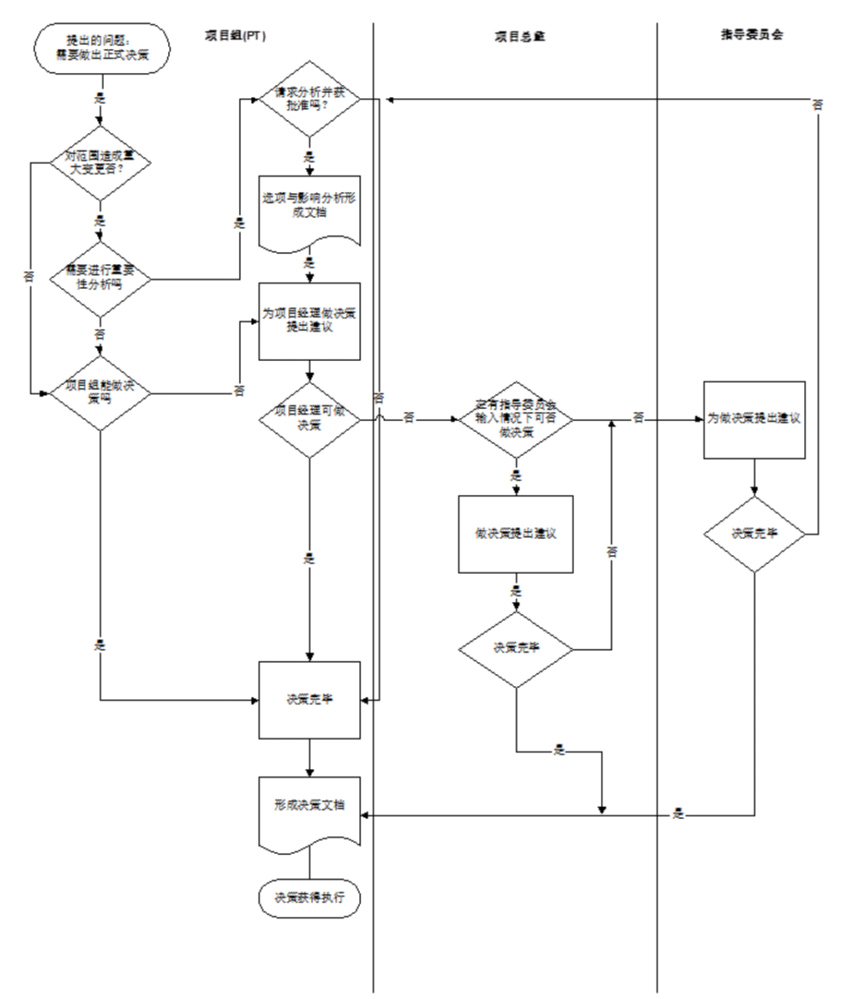
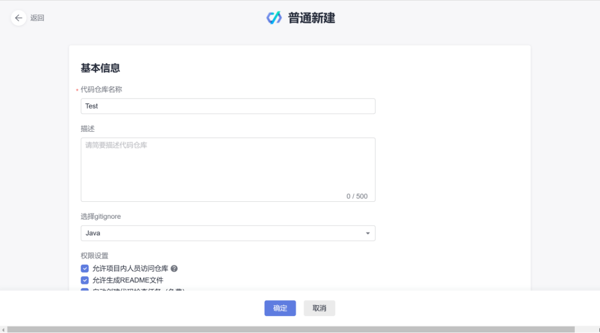
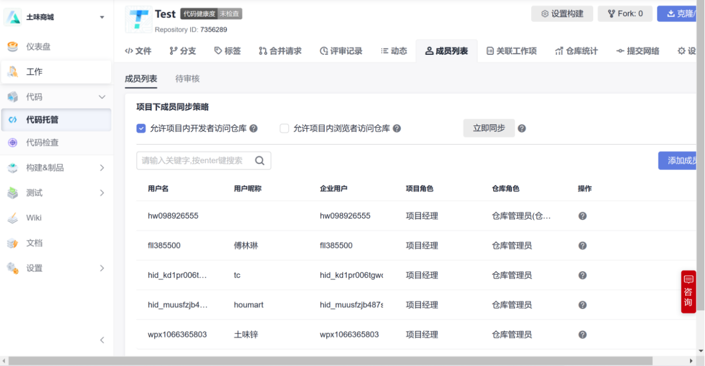
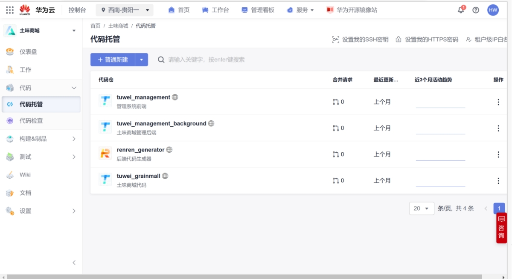

# 项目章程

## 介绍

### 总览

电商平台作为电商产业链的最关键一环，综合电商平台，顾名思义，全面综合的销售商品，产品种类丰富，涉及各行各业。其中有以天猫为典型代表的 B2C 电商，以众所周知的淘宝为代表的 C2C 电商，以及以拼多多美团为代表的 C2B 电商。如今，人们已经逐渐习惯了网上购物。本次的项目则是一个类似于天猫的综合电商平台，名称叫做土味商城。

该项目章程作为项目启动的文件，将包括项目目标的定义，实施策略的制定和项目组成人员和责任的确认，以及项目工作的计划。

为保证项目实施达到预期的目标，该文件的签署将赋予实施小组权责并开始工作。

### 项目目标

项目目标是实现消费者方便的跨越地理间隔实现在网上购物，商家可以方便的通过电商这个平台向全国各地的消费者销售产品。

## 实施策略

### 策略内容

* 整体规划，分步实施；
* 注重数据准备和测试贯穿于项目每个阶段；
* 关键用户和最终用户的提前参与。

### 实施策略的考虑

我们建议通过以下几个方面来高效率、高质量、低风险地实现总体目标。

* 切实可行的实施对策：
* 目标明确，分步实施：先试点，后推广，先实现基本需求，将来再实现扩展需求；
* 试点阶段重点投入，积累经验并确保效益；
* 通过知识转移，合作推广；
* 采用目前市面上成熟规范的实施方法和工具；
* 确保所有可能导致时间延长或成本上升的有关项目范围的问题由项目指导委员会解决，以此来对建议的改变保持强有力的控制。
* 利用模拟数据进行系统测试。

## 项目范围

项目范围将在后续的需求分析阶段进行展示。

## 项目组织结构

土味商城项目组由项目总监、项目经理、开发人员以及运维人员构成。该项目是由项目指导委员会发起的，该委员会同时还是该项目的主要决策和策略的制订者。而项目的所有事务都要由项目组进行协调和管理，项目组将由专职项目管理人员、技术人员和关键职能领域业务所有者和专家等组成。

表 1 项目组职责分工表

| **角色** | **人员** | **职责**                                                                                                                                              |
| -------- | -------- | ----------------------------------------------------------------------------------------------------------------------------------------------------- |
| 项目总监 |          | · 审核项目运行中产生的文档、资料· 确定项目总体计划· 确定项目的组织架构· 确定项目范围· 分析项目的整体风险· 审查项目进展并解决发生的问题          |
| 项目经理 |          | · 制定项目章程· 制定项目的进度计划以及开发活动历时· 对项目开发成本进行预估· 进行项目的需求分析，并制定需求规格说明书· 进行项目的WBS分解到Feature |
| 开发总监 |          | · 对开发工作的具体任务进行分配· WBS分解到Story· 对项目进行配置管理· 团队管理· 沟通和冲突管理 · 开发质量管理                                     |
| 开发运维 |          | · WBS分解到Task· 负责开发到运维流水线操作· 进行代码审查· 撰写并执行测试计划· 分析运行情况                                                        |

## 项目进度安排

本项目进度安排不在项目章程中进行定义，等到需求分析结果出来之后再进行项目进度安排，并输出项目进度报告。

项目经理对监控项目进展负主要责任。项目计划是用于通报项目进展和当前状态的关键性文件。项目计划包括项目阶段、任务、任务期限、资源、任务的计划开始和结束日期、里程碑、责任人和可交付成果等。项目计划将由华为云DevCloud进行维护并且要反应出项目方法论计划阶段。

只有在两种情况下，才能对整个基准计划进行重新设计。一是只要出现任何会从根本上影响项目进度的范围变化，就应该更新整个基准计划。同样，当进度或预算偏差非常严重的时候，就需要重新制定基准计划以使业绩报告重新变得有意义。

项目计划执行和报告应按照流程进行，具体来说如下：每个项目组成员将负责按照项目计划更新实际进展情况并估算自己分配到的任务离完成还需多少时间，这些工作是每周项目报告例会的一部分。项目管理组每个星期五会晤一次，参照项目计划审查项目进展情况。审查工作以考察拖延情况为基础，集中精力查找现存的或潜在的任务拖延，评估对项目造成的影响，并对要采取的用于减轻影响的行动计划达成一致意见。对于那些存在拖延可能的任务（例如：预计完成时间晚于计划时间）项目经理加以突出表示。该任务的负责人应制定出一个应对潜在拖延的行动计划以减小对其他项目工作造成的影响。项目组组长要在每周的状态报告问题部分中注明可能发生的任务拖延，其内容包括问题的简短说明、防止拖延的行动计划简短说明或者是新任务日期，日期上应注明对其他任务造成的影响。

## 项目文档管理

### 项目文档的重要性

为了保证项目的最终成功，必须在项目的每一个阶段都进行严格的控制。而项目的文档是项目工作过程及结果的反映，是项目控制的依据，同时也是“知识转移”的关键载体，因此必须对项目整个过程都要充分文档资料化。

本文件规定了项目过程中的所需要编写的文档，主要包括项目管理文档、项目技术文档及项目功能文档等。此外，本文件还对文档编制的具体要求进行了说明，项目组成员在制作这些文档时都要按照这些要求进行，而且都必须经过相应负责人的确认签字。

### 项目文档体系

在项目实施的不同阶段都需要编写相应文件，下表说明了在项目哪些阶段需要哪些文档，以及相应的文件格式、编码规则及需要完成日期要求等。

表 2 项目文档统计表

| **文档名称** | **项目阶段** | **文件格式** | **文档编码规则** | **签字人** |
| ------------ | ------------ | ------------ | ---------------- | ---------- |
|              |              |              |                  |            |
|              |              |              |                  |            |
|              |              |              |                  |            |

下面对上表列出报告的主要内容和编写目的进行说明：

* 项目实施及工作计划：在项目开始时需对整体的时间计划、关键检查点、职责分工等进行明确。此外，在具体实施过程中，还要有具体的工作计划，一般是按周制订并且检查。
* 评估报告：是系统评估阶段的主要工作成果。它总结所有当前的业务流程，以及所有当前业务流程和当前系统的输入（表单等）和输出（报告等）。它还应包括一系统功能检查表，将系统功能在高层次上与当前业务流程进行对应，并找出和当前流程/系统的差别。同时该报告还应包括主要的系统接口需求和数据迁移的战略。
* 设计报告：在对系统进行设计的基础上，总结需要对当前业务流程进行哪些修改。在确定的流程的基础上应当总结对系统进行何种配置来满足流程的要求。对于要进行的系统的客户化开发包括报告，需要由功能人员制定从功能的角度对开发应达到的效果提出的要求。
* 系统接口设计报告：对有外部系统接口的流程，描述接口要实现的功能和达到的目标，并应从业务角度描述可以采用的解决方案。
* 系统开发规格说明：根据功能人员制定的系统开发的功能需求，从技术的角度制定开发的设计和规范，包括使用更改哪些系统的对象，开发项目如何组织，程序逻辑如何实现等。这一文档应该由技术人员编写。
* 用户测试案例和结果：项目组成员应按照其确定的业务流程编写系统集成测试案例，确保这些案例包括了其所有的业务流程。按照这些业务案例执行后产生的对当前流程的影响以及对其他流程和步骤的影响也应包括在案例中。在用户进行测试时，应记录实际测试所产生的结果，与预期结果进行比较。
* 用户使用手册：用户对系统进行操作的指导和备查手册。它应包括确所有业务流程，并按照业务流程的方式来组织系统的功能。
* 系统上线计划：对系统上线过程进行详细安排，包括数据转换和核对过程、用户授权、切换时点、数据补充录入的时限等，系统上线的过程应严格按照该步骤进行执行。
* 系统上线报告：它是在系统的上线过程中和上线后进行制作的。在上线过程中，主要包括数据转换的结果以及数据核对的确认。在上线后，需要对上线过程进行总结，找出可能存在的问题和解决办法。
* 系统维护文档：供系统管理人员使用的系统维护手册。它应该包括系统架构和使用的软件、硬件平台的描述；各系统（生产、开发、测试等）的分布；系统的启动、关闭、备份、性能监视和常用系统维护工具的使用说明等。
* 系统质量检查报告：总结系统上线至今的状况，分析过去发生的主要问题和解决方案。对系统使用的进一步提高和改进提出相应的意见。

全部项目文档都只使用中文编写。对于文档的签字，原则上由项目经理完成，对于系统上线报告等这些关键的项目阶段总结报告，需要在项目会议上进行汇报讨论，并最终由相关领导签字确认。同时，由于本项目的日程安排紧密，为了保证项目能够按照计划进行并最终能够在计划日期上线，因此项目文件的签字工作应该在文件递交5个工作日内完成。如果超过5个工作日仍然没有签字，则视同已经签字确认，并且项目组的工作将按照这些文件进行。

### 项目文档管理环境

作为项目管理最佳实践的一部分，项目文档应该在一个集中且可控的环境内统一维护。这不仅可以保证项目文档的标准化，更重要的是这种方式为项目相关人员的知识共享提供了一个便捷的平台。本项目的文档统一在华为DevCloud内维护，具体的地址是：https://devcloud.cn-southwest-2.huaweicloud.com/home#/locale=zh-cn

## 项目团队管理

### 项目决策流程

对于那些不会对项目范围、资源或时间表造成明显影响的决策，项目组有权自行决定。决策的第一级上报领导为项目经理。第二级上报领导是项目总监。在向更上一级报告之前，在某一级领导处不得上报两次以上。需要从指导委员会处得到输入的决策或者需要获得内部大多数同意的决策仅限于以下几种：
(i) 对现有业务流程会造成重大影响的决策；
(ii) 会影响到关键方针政策的决策；
(iii) 会给项目范围、时间表、功能性或成本带来显著变更的决策（称为“重大决策”）。下页给出了一幅决策流程图，对以上流程做出了详细描述。

### 项目例会

项目沟通计划用于为项目实施和培训阐明沟通的目标、范围、流程和计划，确保项目领导、顾问和工作组能接收到及时准确的信息。项目沟通的目标受众是：

* 项目总监
* 项目经理
* 核心项目组
* 最终用户

## 项目风险管理

在实施应用过程中，不可避免的会存在一些问题和风险，这就需要我们双方本着务实的原则，及时总结和认真看待，正确协调和解决。本次项目实施可能面对风险及建议的应对策略。

### 实施周期延期的风险

1、企业建立全集团统一的生产制造管理制度的完成日期不确认；

应对方法：建立周密的计划，确保按实施计划完成集团生产制造管理制度的建立。

2、统初始化过程中新老科目转换初始余额的整理可能耗时较长；

应对方法：企业在准备初试化数据之前就建立针对该问题的明确的解决方案。

3、节假日的风险（例如：春节）

### 实施范围风险

1、在某一实施分步内的实施主体范围过多，可能会导致项目延期；

应对方法：按照实施计划分步实施

2、在某一实施分步内的实施模块过多，也可能导致项目延期，使实施人员失去信心；

应对方法：按照实施方案建立在各个步骤的实施目标值。

3、过分关注细节，导致项目耗费在无尽的讨论开会

应对方法：项目高层应正确引导，以集团实施目标为重点，先上线，后改进

4、无明确可执行的实施目标

应对方法：系统并不是万能的，不要把企业解决不了的问题放在系统的实施目标上。要从企业基础管理做起，制定确实可行的阶段性目标，因为企业的管理是有层次的，不同实施阶段有不同的应用效果。

### 人员的风险

1、消极应对项目实施，缺乏激情，怠工等；

应对办法：建立有效的奖惩措施，对其造成的影响给予公布。

2、无效的项目组织

应对办法：依金蝶项目组织要求，成立项目组织，并在相应的业务领域成立项目小组，并由相关部门负责人担任

3、散布谣言，打击项目实施小组成员；

应对办法：定期公布项目实施进度，对散布谣言者给予处罚。

4、中高层领导安排其他事务给实施人员，导致实施进度无法按期完成；

应对办法：专人专用，如需处理其他事务，必须经项目实施领导小组成员批准。

5、因为在新的流程确立后，可能会影响到相关人员的利益，特别是中高层的利益，导致对项目产生抵制情绪，最终影响项目实施进程；

应对办法：召开专门的中高层协调会议，对项目实施统一认识，明确目标，并由最高领导出面协调处理。

### 管理变革风险

1、部门在应用过程中产生冲突；

应对办法：高层领导从公司整体利益上给予仲裁。

2、在系统切换时，为了局部利益，擅自从系统外进行业务处理；

应对办法：各个实施单位高层不得在系统外进行业务的审批

3、认为系统是万能妙药，可以处理所有的问题；

应对办法：系统是处理关键合理流程，不是处理企业不合理或错误流程，数据进去的是垃圾，出来的还是垃圾。

4、现有业务流程必须在系统中体现；

5、高层应该在关键时刻站在整体优化的高度，进行仲裁，避免陷入无谓的争执中。

## 项目变更管理

变更控制是通过有序地管理变更来稳定开发过程、减少项目风险。本程序的制定是为了检查所有的变更请求，决定哪些需要实施、哪些需要推延、哪些需要否决。在得到对方的认可后，进度和成本将相应地做出调整。一个有效的变更控制程序对于避免项目延期和超支是必要的。

### 提出变更

提出变更需首先填写“变更申请表”（REQUEST FOR CHANGE，以下简称RFC）。RFC需交给项目经理。项目经理将就RFC的技术可靠性以及对整个项目的影响做出评估。

表 3 变更申请表

| **变更申请**                                                            |
| ----------------------------------------------------------------------- |
| (系统名称)变更申请序号#：                                               |
| 申请人：日期：                                                          |
| 申请变更内容：                                                          |
| 申请变更原因：                                                          |
| 变更类别(标明一个)  A.功能方面_____B.运行性能方面______C.文档方面______ |
| 授权人签字：_______________________日期：______________                 |

### 接收方响应

项目经理将在接到RFC的三个工作日内确认收讫，并说明分析RFC，做出相应的工程变更建议书（ENGINEERING CHANGE PROPOSAL，以下简称ECP）所需的时间。

ECP将就RFC中所提出的变更对整个项目的影响做出以下几方面的说明：

1. 基本变更－文件的增改和删除
2. 软件设计－程序编码的增加、修改和删除
3. 测试项目－测试计划、测试和重新测试的修改
4. 系统性能－确认修改项目对系统性能的影响以及增加或改装其它机器是否必要
5. 培训－培训计划、课程准备及教材
6. 其他材料－列出所有其它材料
7. 人员需求－确认增加其他人员的必要性
8. 进度－项目进展情况、交付件的进展速度和协议的终止日期
9. 可能的费用

### 变更实施

* 双方将根据经确认批准的ECP重新调整项目计划，并进行任务分配。
* 双方将根据新的项目计划履行各自的责任。

### 变更程序流程

* 客户以书面形式提出RFC；
* 将RFC提交项目领导小组作技术可行性评定；
* 项目经理以书面形式给出ECP的准备时间和所需费用以及是否批准RFC；
* 项目领导小组讨论ECP并提出实施建议；
* 项目领导小组批准对合同进行修改(如果需要的话)；
* 实施ECP。

## 项目配置管理

### 配置控制

在软件中配置控制的功能，并且有相应的操作人员对其进行审批和核查，配置控制要点如下:

A．修改批准权限:对土味商城系统项目各个子模块、指派极限、产品极限及其集成系统的任何修改（成为A类修改)，都必须通过项目配置管理小组讨论，并必须经总体组批准；对土味商城系统项目专用支持软件的其他阶段产品的任何修改(称为B类修改)，都必须通过本项目各模块的配置管理人员审查，并经项目的软件配置管理小组与各模块负责人的共同批准并报项目总体备案。

B．修改控制工具:修改控制工具是协助软件配置管理人员进行配置控制的有效手段。

### 配置状态审计

利用软件问题报告单和软件修改报告单对项目子系统及其支持软件的配置状态进行追踪。对软件问题报告单和软件修改报告单的追踪应由软件配置管理工具自动实现，用户可通过该软件系统对其进行查询。

### 配置的检查评审

项目软件配置管理小组要对所有由第三方提供的软件进行物理配置检查；对土味商城系统项目及其各个子系统的每一个新的释放进行功能配置检查和物理配置检查；对主计算机系统所提供的软件和硬件配置要每隔半年检查一次；在软件验收前要对主计算机系统、各个子系统及其专用支持软件的配置进行综合检查。

在软件开发周期各阶段的评审与检查工作中，要对该阶段所进行的配置管理工作进行必要的评审和检查。应该进行评审与检查的内容与次数，由土味商城系统项目质量计划规定。

### 配置管理内容

a) 使用华为云进行代码的版本控制

代码托管（CodeHub）是遵循Git的基本运行模式的分布式版本管理平台，其具备安全管控、成员/权限管理、分支保护/合并、在线编辑、统计服务等功能，旨在解决软件开发者在跨地域协同、多分支并发、代码版本管理、安全性等方面的问题。

从云端开始研发项目，本项目选择使用代码托管服务提供的仓库模板来创建项目并开始开发。使用代码托管服务提供的模板新建仓库，适用于本地没有仓库，希望按模板初始化一个仓库的情景。

在华为云上新建一个仓库，如图所示。

图 2 新建仓库示意图

同时可以对仓库成员进行管理，设置成员权限。

图 3 仓库管理示意图

详情内容可以在代码仓查看，它对自动化的研发流程起到支撑作用，同时也对交付团队内部的协同工作起到巨大的促进作用。

图 4 代码托管示意图

b) 对文档使用qq群文件进行控制

c) 配置管理活动的职责分配

a) 配置管理员：识别和标识配置项，建立和维护配置库；配置库管理；执行配置审计.

b) 配置控制委员会（CCB）：批准基线库的生成；评估和审核变更请求，并确保批准的更改得到实施。

c) QA：配置管理活动审查

d) 配置管理的资源

a) 配置库的服务器

b) 配置库工具

c) 配置库的访问方式

e) 识别配置项

对于配置项，软件过程的输出信息可以分为4个主要类别：

a) 计算机程序（源代码及可执行程序）

b) 描述计算机程序的文档（针对技术开发者和用户）

c) 数据（包含在程序内部或外部）

d) 项目管理的有关文件、信息记录等

## 质量控制

* 项目章程由双方项目管理层审阅批准
* 业务蓝图由双方项目管理层审阅批准
* 用户文件由项目小组，项目经理审阅
* 培训计划由项目小组制定

## 验收标准

本项目采用分阶段提交成果和验收的方法。在得到本阶段成果的确认以后，再开始下一阶段的实施工作。以保证项目始终在实施双方意见一致的前提下进行。

项目阶段验收将根据双方确认的本阶段实施目标，工作计划和提交的阶段工作完成报告作出结论。

在书面提出验收申请之日起，土味商城项目经理（或其授权人）应在5个工作日内，书面签署确认报告或提出优化的建议。
