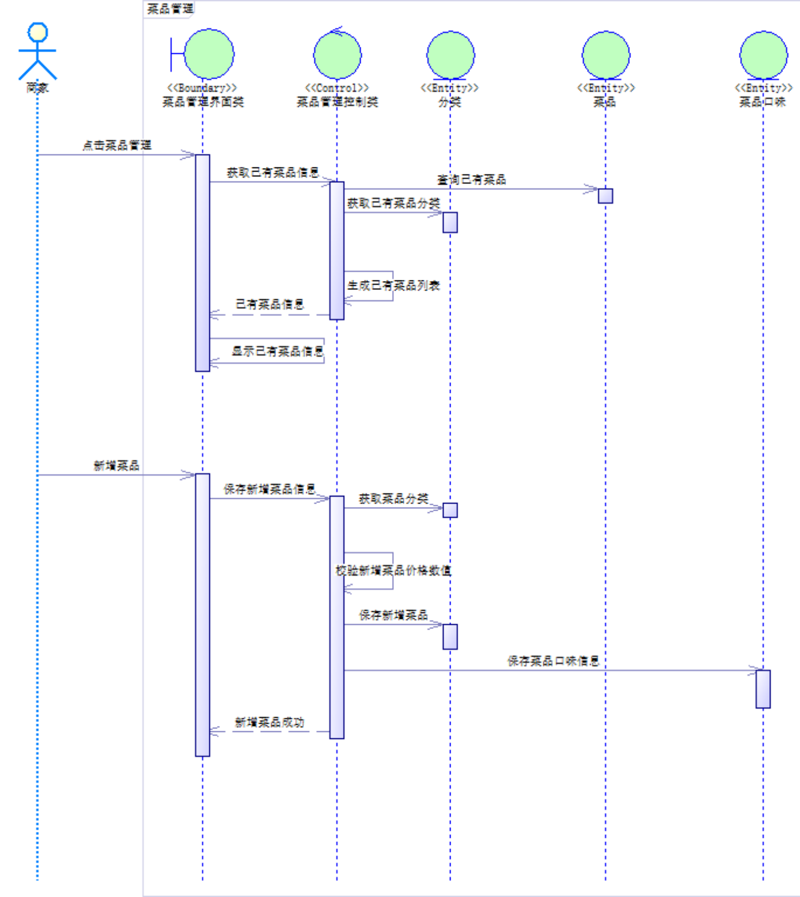

# 系统设计

本章主要着眼与整个系统的设计，第一小节对系统的架构做出了规定，采用前后端分离的架构，其中边界层为前端页面，控制层为后端的Controller和Service层，实体层负责和数据库进行交互，主要为后端的DAO、Entity、Mapper层。第二小节针对第二章系统需求给出了更详细的设计，将需求进一步向代码层面转化，采用时序图对整个系统逻辑进行概括。第三小节开始针对整个系统的数据库设计。从用例规约中提取名词，详细分析各个实体之间的关系，进而构建E-R图，给出了数据库表结构的设计。随后分析系统性能，对频繁的操作采用缓存数据库加速。针对前后端分离的情况，给出了前后端交互的API接口定义。最后一小节对于前端页面给出了原型设计。

## 架构设计

此处使用基础的BCE架构（即边界层、控制层、实体层），使用UML包图对系统的顶层架构进行设计。

图 系统架构图

图 架构交互图

图 系统架构图（左半部分）

图 系统架构图（右半部分）

系统架构使用经典的三层架构设计，根据采用的具体开发框架，对系统的顶层架构细化。此处是Spring（含Spring MVC）+ Mybatis。

MVC为编程框架，M即model模型是指模型表示业务规则。在MVC的三个部件中，模型拥有最多的处理任务。被模型返回的数据是中立的，模型与数据格式无关，这样一个模型能为多个视图提供数据，由于应用于模型的代码只需写一次就可以被多个视图重用，所以减少了代码的重复性。

V即View视图是指用户看到并与之交互的界面。比如由html元素组成的网页界面，或者软件的客户端界面。MVC的好处之一在于它能为应用程序处理很多不同的视图。在视图中其实没有真正的处理发生，它只是作为一种输出数据并允许用户操作的方式。

C即controller控制器是指控制器接受用户的输入并调用模型和视图去完成用户的需求，控制器本身不输出任何东西和做任何处理。它只是接收请求并决定调用哪个模型构件去处理请求，然后再确定用哪个视图来显示返回的数据。

系统架构设计注意事项：

（1）Controller中页面与VO互转，是MVC框架自动完成，将页面表单元素与VO转换。

（2）Controller一般只调用一个Service接口，通常不会使用多个Service接口。

（3）UserInterface和Controller都建议做格式规则校验，为了防止特殊情况不经过前端直接调用后端接口。常见情况下不需要调用Service能力做校验。

（4）Service调用Dao时，可调用1-N次/个Dao。对于数据库操作，在Service上开启事务：查询不需要事务，增改删需要事务，且一般都在一个事务内。

## 系统用例设计

在顶层架构的约束下，根据第2章用例分析的基础，我们对第2章中的核心系统用例进一步的细化设计。这里我们采用时序图来完成系统的设计。

时序图采用分析类（即边界类、控制类、实体类）对系统用例进行分析，分析的流程要严格遵守该用例的用例文档，重点是通过分析类来刻画计算机系统如何实现该用例。对于一个系统用例，通常会有1个边界类+1个控制类+N个实体类。

### “登录”用例设计

图 “登录”系统用例设计

### “管理分类”用例设计

图 “管理分类”系统用例设计

### “管理菜品”用例设计

图 “管理菜品”系统用例设计

### “管理套餐”用例设计

图 “管理套餐”系统用例设计

### “管理购物车”用例设计

图 “管理购物车”系统用例设计

### “管理收货地址”用例设计

图 “管理收货地址”系统用例设计

### “创建订单”用例设计

图 “创建订单”系统用例设计

### “查看订单”用例设计

图 “查看订单”系统用例设计

## 性能设计

通过对后端接口调用频率进行分析，我们发现查询菜品分类、查询菜品、查询套餐这三个接口调用频率最高。其他接口调用频率相对较低，同时注意到这几个接口数据变化频率不大。为了提升后端接口相应速度，我们采用缓存数据库Redis缓存这部分数据。Redis是一款内存高速缓存数据库，支持键值对等多种数据结构的存储，可以用于缓存、事件发布、订阅、高速队列这些场景。其读取性能相比较MySql高出很多。

每当前端请求查询菜品分类、查询菜品、查询套餐这些数据时，会先去查看缓存数据库中是否存在这些数据，存在则直接从缓存中读取，不存在则会去请求数据库获取数据，随后将数据缓存在Redis中 ，为了保证数据的时效性，Redis中缓存的数据会在一定时间被删除，当前端再次请求数据时，则会重复上述操作从数据库中读取。
